# Shell脚本编程：P29：条件判断与循环结构


在本节课中，我们将学习Shell脚本编程中的`case`条件判断语句以及多种循环结构，包括`for`、`while`和`until`循环。我们将通过实例来理解它们的语法和应用场景，帮助你编写更高效、更灵活的脚本。

## 概述

上一节我们介绍了`if-else`条件判断语句。本节中我们来看看另一种适用于离散值判断的`case`语句，以及用于重复执行命令的循环结构。

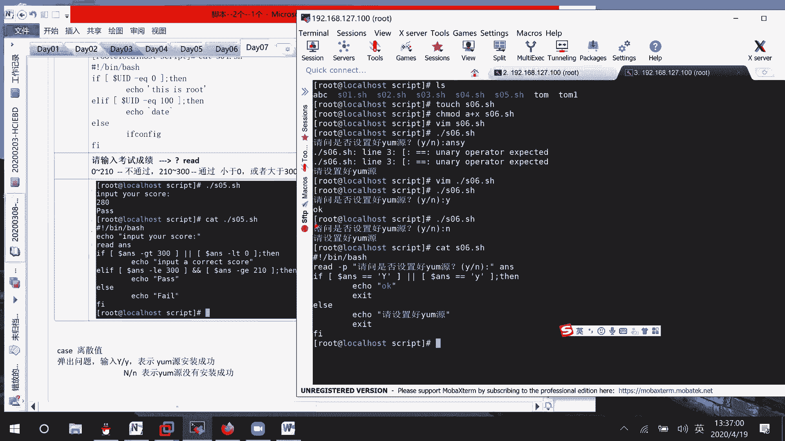

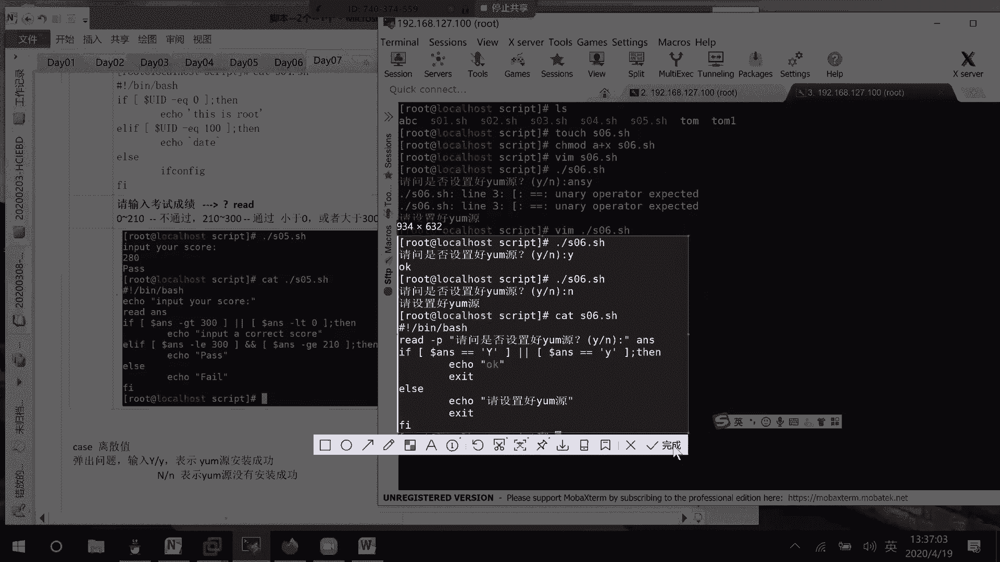

## `case`语句：处理离散值判断

`if-else`语句适用于连续值（如分数范围）或离散值（如性别）的判断。而`case`语句则更适用于处理可枚举的离散值情况，例如询问用户“是”或“否”的场景。

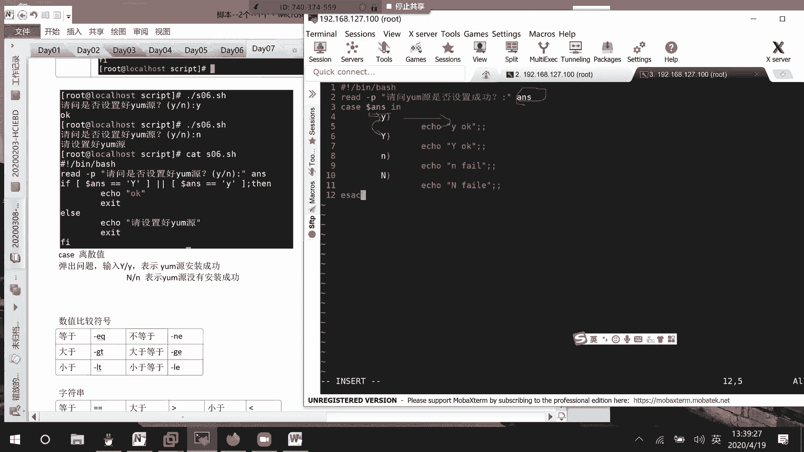

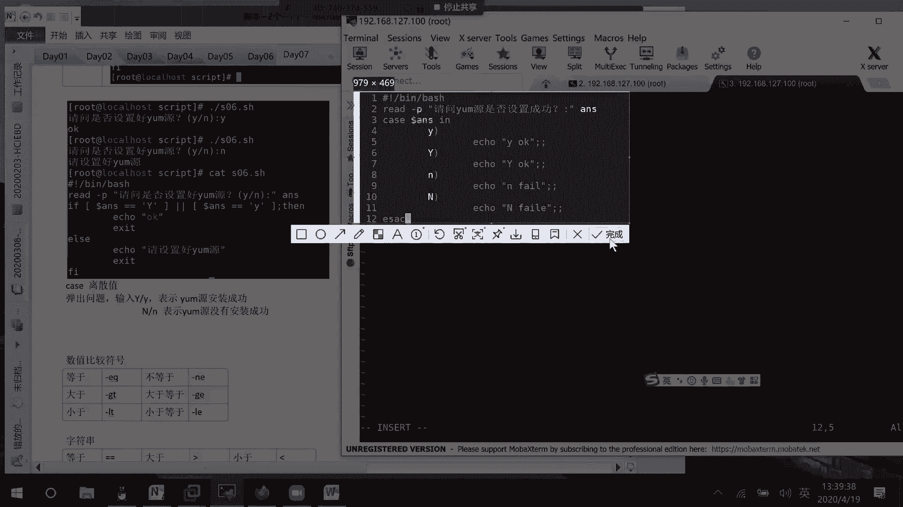

以下是使用`if-else`实现询问的示例：
```bash
read -p “是否设置好yum源？(y/n): ” ans
if [ “$ans” = “y” ] || [ “$ans” = “Y” ]; then
    echo “OK”
else
    echo “请设置好yum源”
fi
```

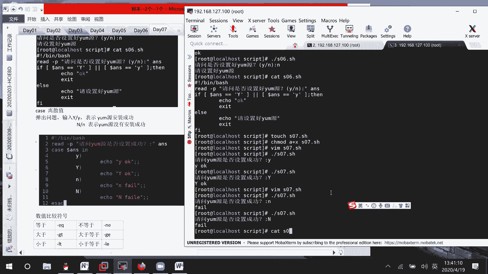

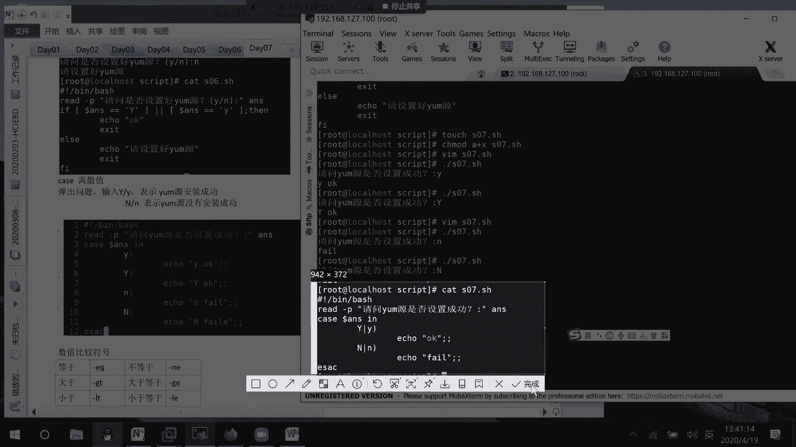

接下来，我们看看如何使用`case`语句实现相同的功能。

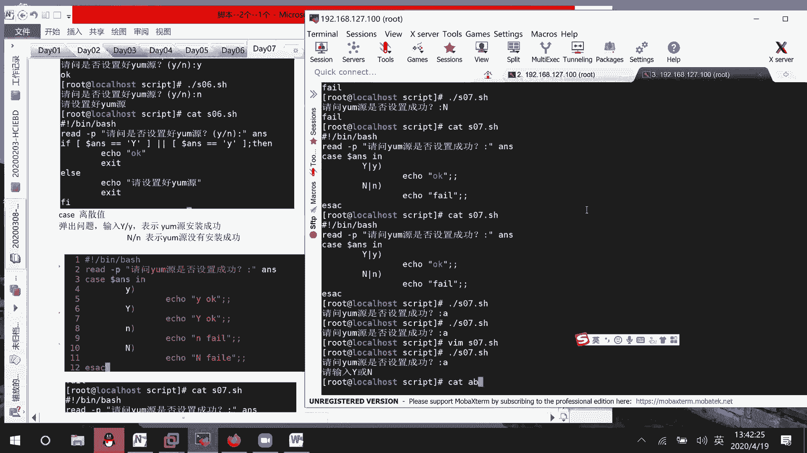

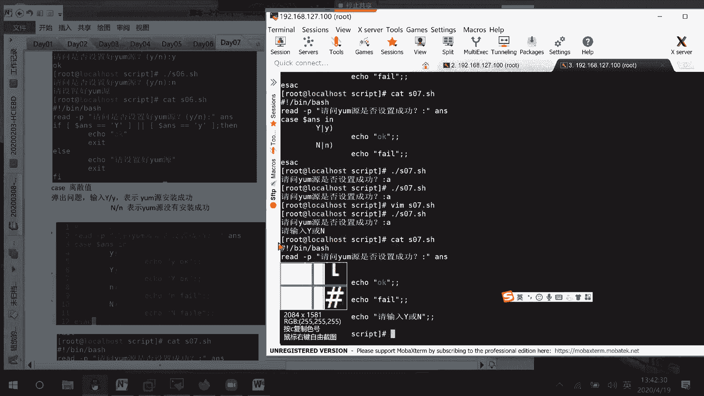

## `case`语句的基本语法

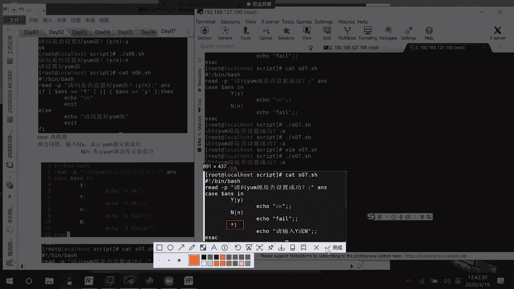

`case`语句的结构如下：
```bash
case $变量 in
    值1)
        执行动作1
        ;;
    值2)
        执行动作2
        ;;
    *)
        默认执行动作
        ;;
esac
```
*   `case $变量 in`：开始判断一个变量。
*   `值)`：匹配变量的具体值。
*   `;;`：表示该分支结束，不再继续匹配后续分支。
*   `*)`：匹配所有其他未列出的情况，类似于`if-else`中的`else`。
*   `esac`：表示`case`语句块结束。

以下是使用`case`语句重写的示例脚本`s07.sh`：
```bash
#!/bin/bash
read -p “请问，yum源是否设置成功？(y/n): ” ans
case $ans in
    y|Y)
        echo “OK”
        ;;
    n|N)
        echo “FAIL”
        ;;
    *)
        echo “请输入y或n”
        ;;
esac
```
运行此脚本时，输入`y`或`Y`会输出“OK”，输入`n`或`N`会输出“FAIL”，输入其他字符则会提示“请输入y或n”。

## 循环结构：重复执行命令

循环用于重复执行一系列命令。Shell中主要有`for`、`while`和`until`三种循环。

### `for`循环

`for`循环遍历一个值列表，对每个值执行一次循环体内的命令。

基本语法：
```bash
for 变量 in 值1 值2 值3
do
    要执行的命令
done
```

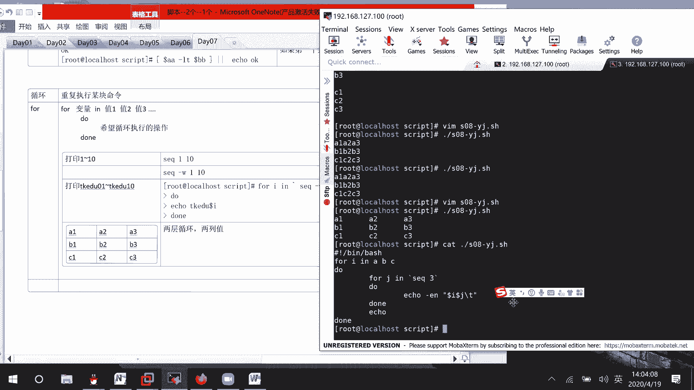

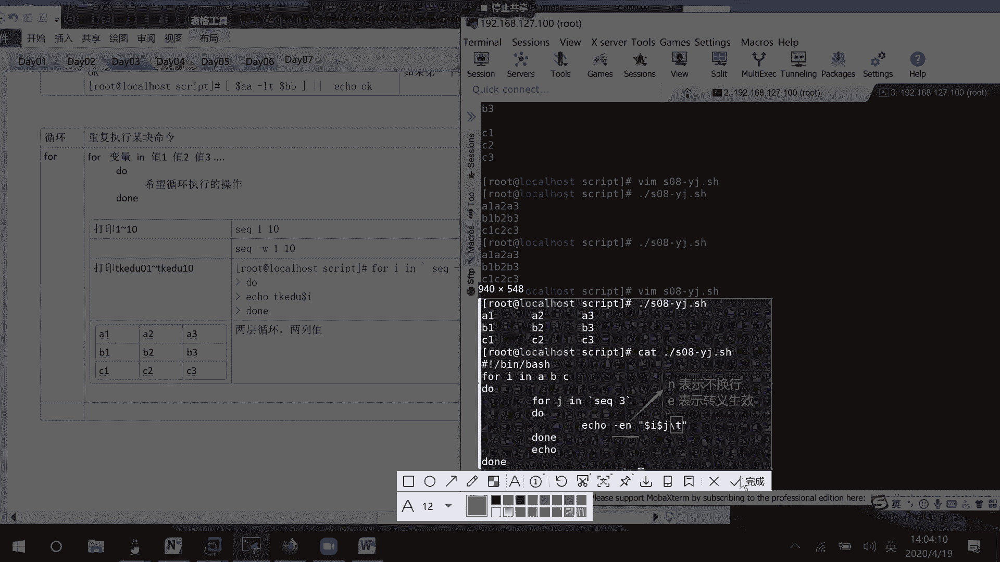

例如，打印`tkyedu01`到`tkyedu10`：
```bash
#!/bin/bash
for i in 1 2 3 4 5 6 7 8 9 10
do
    echo “tkyedu0$i”
done
```
更简洁的方法是使用序列生成命令`seq`：
```bash
for i in $(seq 1 10)
do
    echo “tkyedu0$i”
done
```
使用`seq -w`可以自动补零，使数字等宽。

### 嵌套循环与输出控制

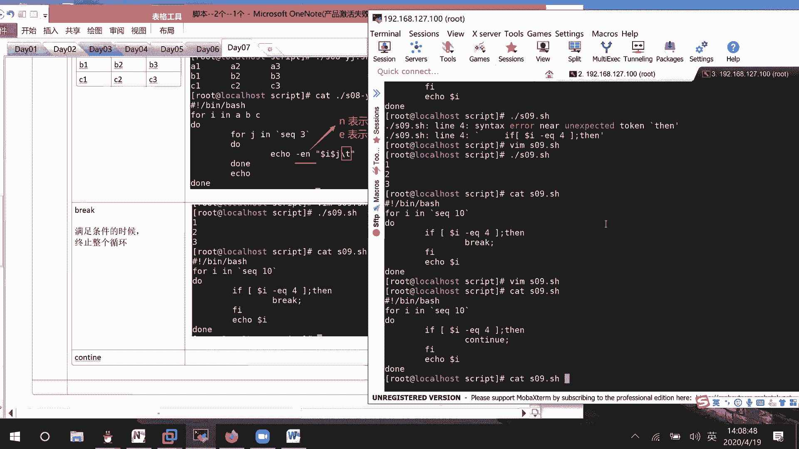

有时我们需要多层循环。例如，打印一个3x3的表格（a1 a2 a3; b1 b2 b3; c1 c2 c3）。

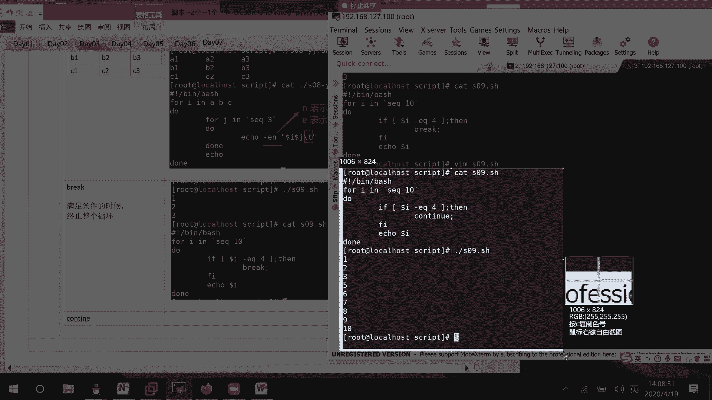

以下是实现此功能的脚本`s08.sh`：
```bash
#!/bin/bash
for j in a b c
do
    for i in $(seq 1 3)
    do
        echo -ne “$j$i\t”
    done
    echo
done
```
*   `echo -n`：输出后不换行。
*   `echo -e`：允许解释反斜杠转义字符。
*   `\t`：代表制表符（Tab）。
*   内层循环打印完一行（如a1 a2 a3）后，外层的`echo`命令用于输出一个换行，开始新的一行。

### 循环控制：`break`与`continue`

在循环中，我们可以使用`break`和`continue`来控制流程。

*   **`break`**：立即终止整个循环。
*   **`continue`**：跳过本次循环中剩余的语句，直接开始下一次循环。

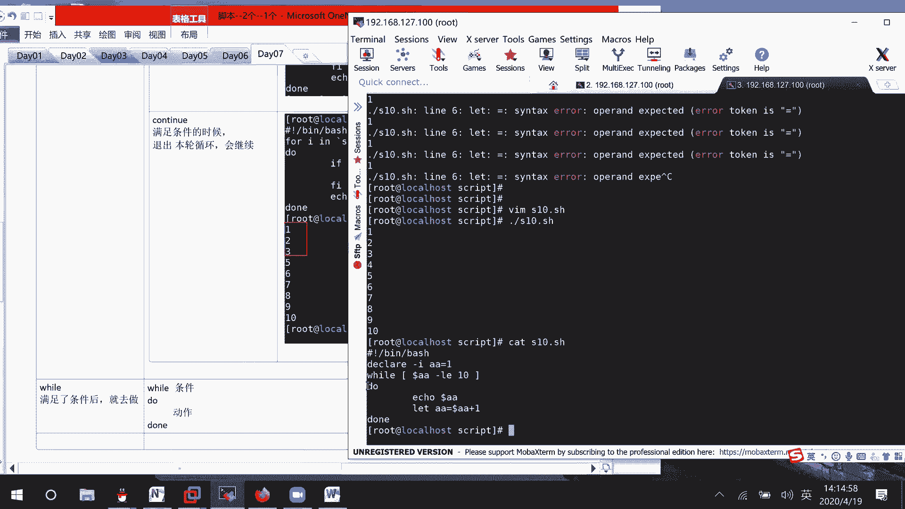

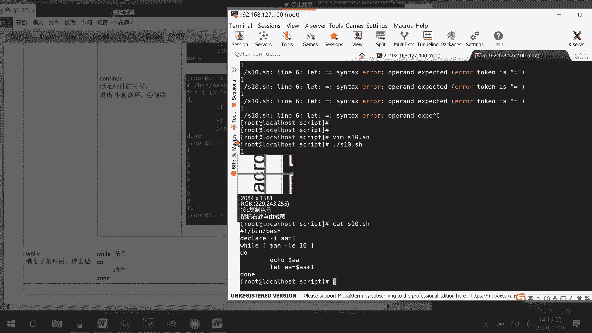

以下脚本`s09.sh`演示了二者的区别：
```bash
#!/bin/bash
for i in $(seq 1 10)
do
    if [ $i -eq 4 ]; then
        break  # 尝试将 break 替换为 continue 观察不同效果
    fi
    echo $i
done
```
使用`break`时，循环在`i=4`时完全终止，只打印1, 2, 3。
使用`continue`时，循环仅跳过`i=4`时的`echo`命令，会继续打印5, 6, 7, 8, 9, 10。

### `while`循环

`while`循环在条件为真时，重复执行循环体。

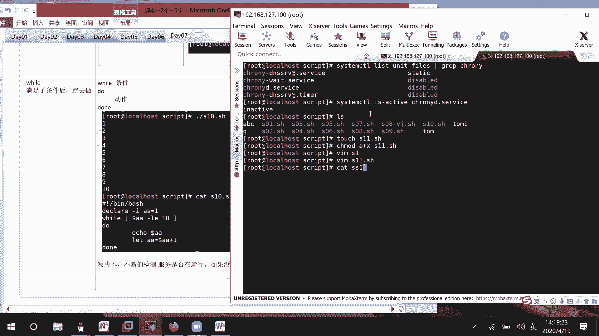

基本语法：
```bash
while [ 条件 ]
do
    要执行的命令
done
```

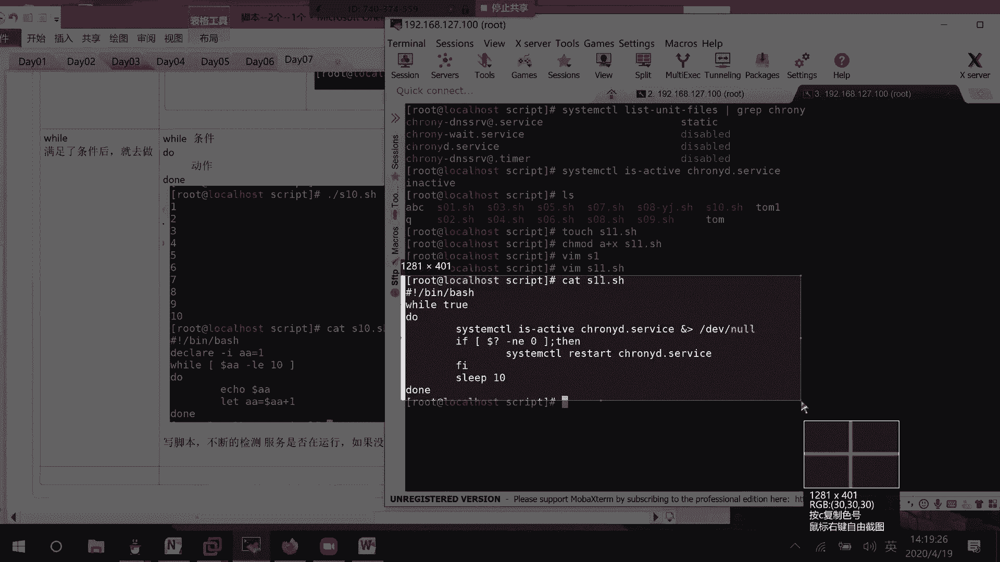

例如，使用`while`循环打印1到10：
```bash
#!/bin/bash
declare -i aa=1
while [ $aa -le 10 ]
do
    echo $aa
    let aa=aa+1  # 或 aa=$((aa+1))
done
```
**关键点**：必须在循环体内改变条件判断中变量的值，否则可能导致无限循环。

`while`循环的一个典型应用是持续监控。例如，监控`chronyd`时间同步服务，如果停止则自动启动：
```bash
#!/bin/bash
while true
do
    if ! systemctl is-active chronyd &> /dev/null; then
        systemctl restart chronyd
    fi
    sleep 10
done
```

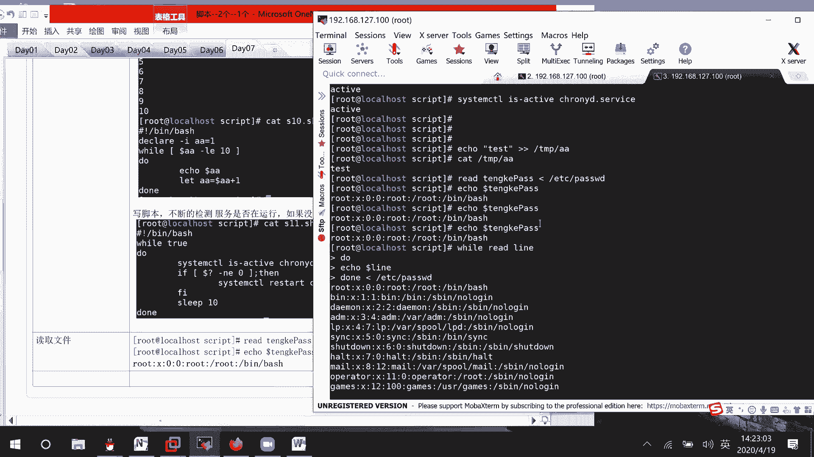

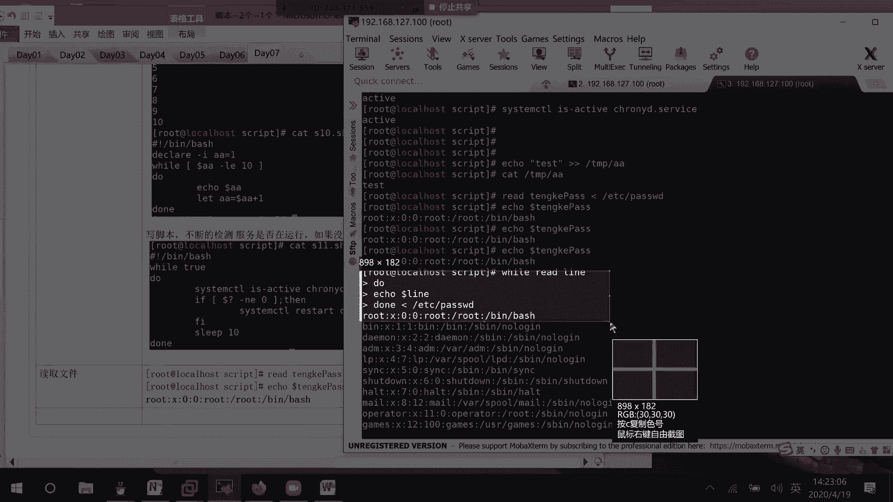

`while`循环也常用于逐行读取文件内容：
```bash
#!/bin/bash
while read line
do
    echo $line
done < /etc/passwd
```
若要按特定分隔符（如`:`）读取文件的特定列（如用户名和用户ID），可以修改内部字段分隔符`IFS`：
```bash
#!/bin/bash
oldIFS=$IFS
IFS=“:”
while read col1 col2 col3 col4
do
    echo -e “$col1\t$col3”
done < /etc/passwd
IFS=$oldIFS
```

### `until`循环

`until`循环与`while`循环相反，它在条件为**假**时执行循环体，条件为真时停止。

基本语法：
```bash
until [ 条件 ]
do
    要执行的命令
done
```

例如，使用`until`循环打印1到10：
```bash
#!/bin/bash
declare -i aa=1
until [ $aa -gt 10 ]
do
    echo $aa
    let aa=aa+1
done
```
当`aa`的值大于10时，条件为真，循环停止。

## 总结

本节课中我们一起学习了Shell脚本中`case`条件判断语句以及`for`、`while`、`until`三种循环结构。
*   `case`适用于对离散值进行多分支判断，结构清晰。
*   `for`循环适合遍历已知的列表。
*   `while`循环在条件满足时持续运行，常用于监控和逐行处理。
*   `until`循环则在条件不满足时运行，直到条件满足为止。
*   使用`break`和`continue`可以在循环内部进行更精细的流程控制。

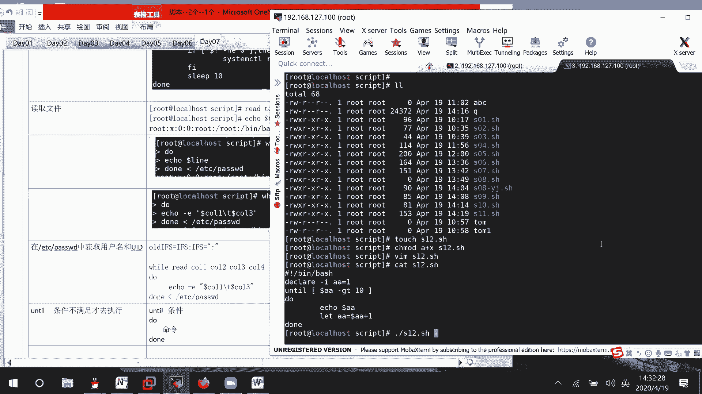

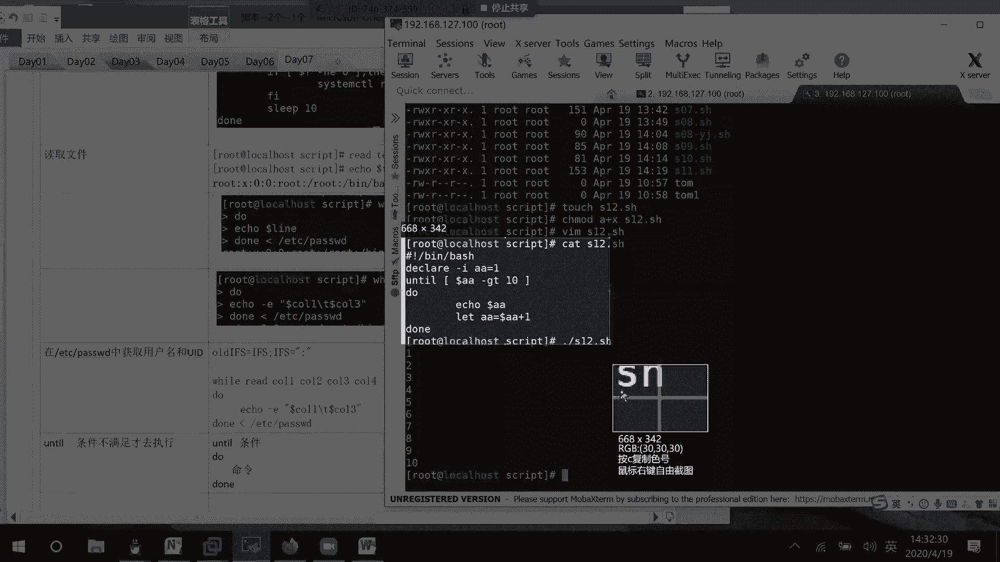

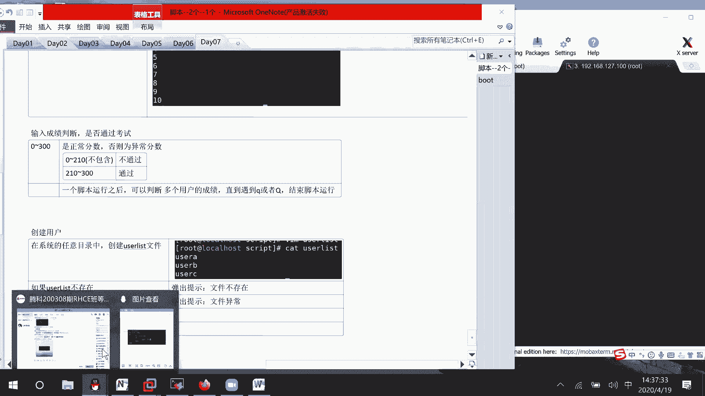

掌握这些结构后，你将能够编写出功能更加强大和灵活的Shell脚本。