# Linux基础入门：02：命令行基础与文件系统导航


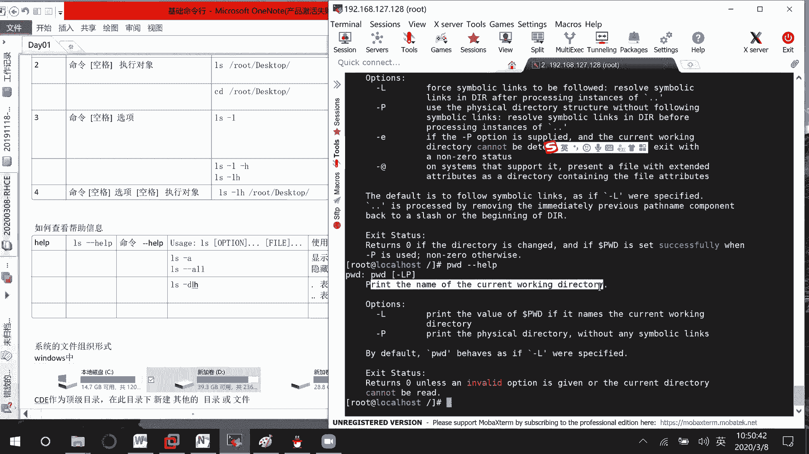

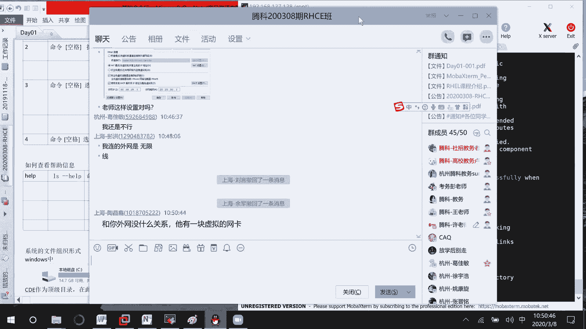

在本节课中，我们将学习Linux命令行环境下的基本操作技巧，包括如何获取命令帮助、使用快捷键提高效率，并深入了解Linux文件系统各个核心目录的作用。掌握这些知识是后续所有学习的基础。

## 获取命令帮助

上一节我们介绍了几个基础命令，本节中我们来看看当你不熟悉一个命令时，如何快速获取帮助信息。Linux系统提供了多种获取帮助的方式。

以下是三种主要的帮助查看方法：

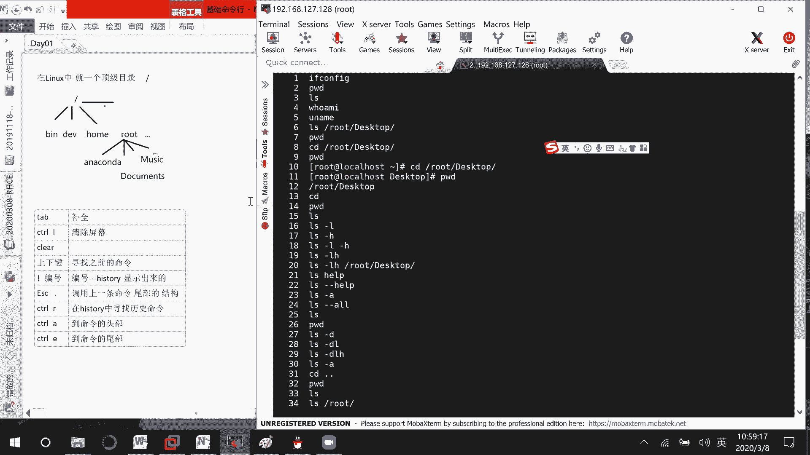

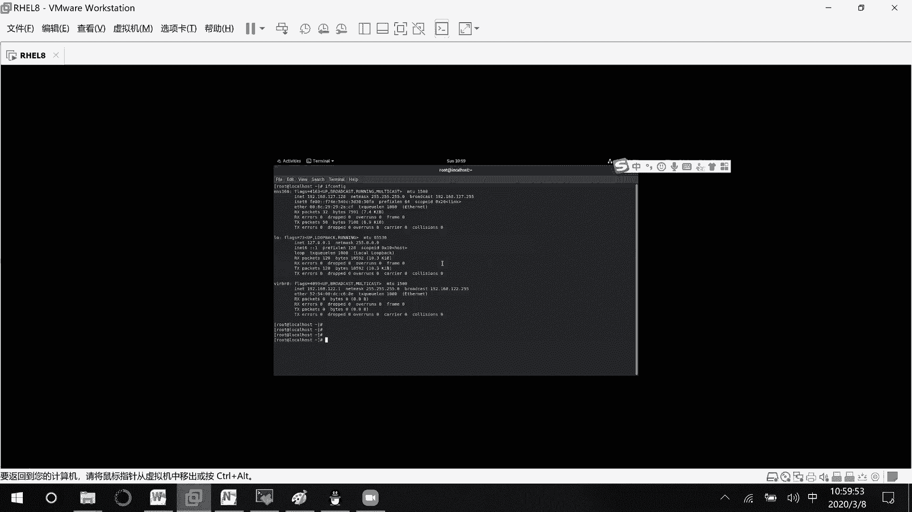

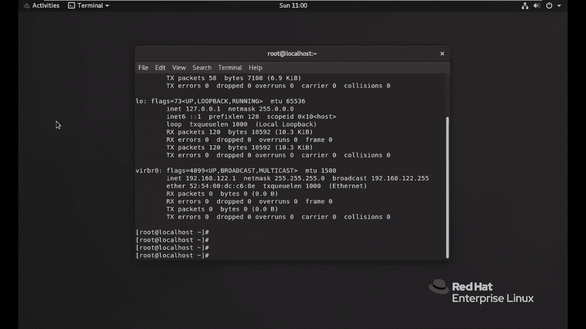

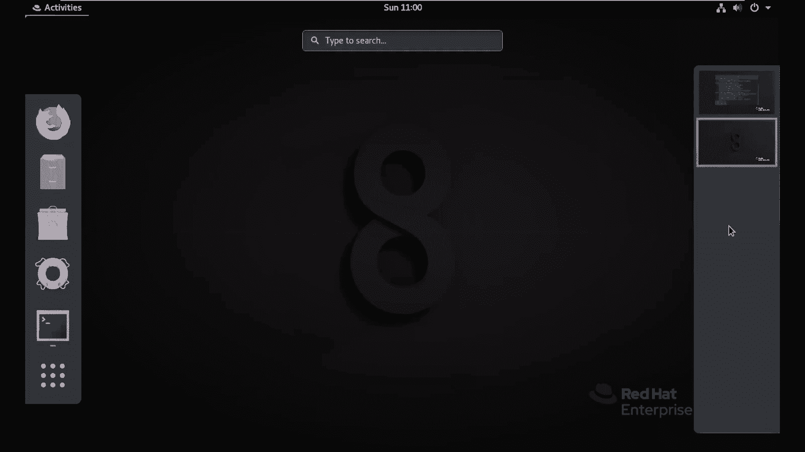

*   **`--help` 选项**：大多数命令都支持此选项，用于显示该命令的简要使用说明。
    *   示例：`ls --help`
*   **`man` 命令**：这是最全面、最权威的帮助手册。它提供了命令的详细说明、语法、选项和示例。
    *   格式：`man [命令名]`
    *   示例：`man ls`
    *   操作提示：按 `q` 键退出；按空格键向下翻页。
*   **`info` 命令**：这是另一种帮助文档格式，有时比 `man` 提供更结构化的信息。
    *   格式：`info [命令名]`
    *   示例：`info ls`
    *   操作提示：同样使用 `q` 退出，空格翻页。

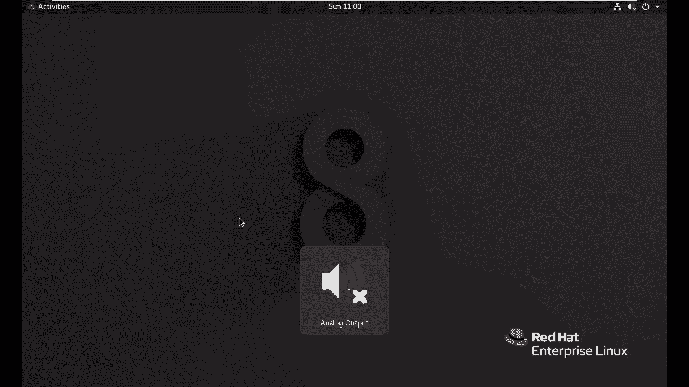

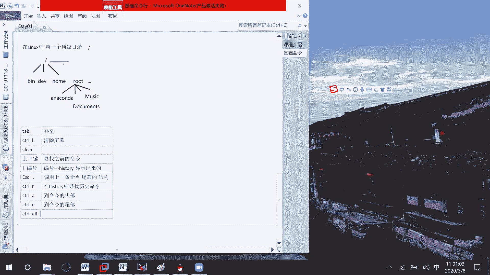

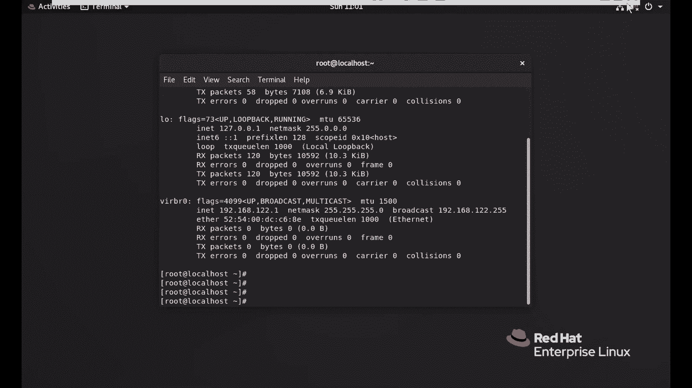

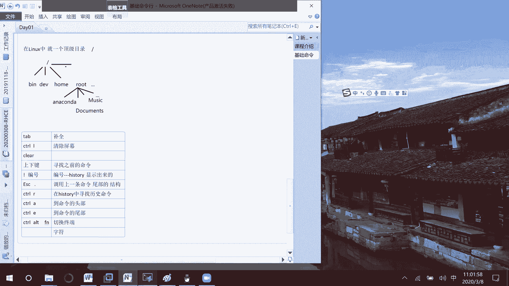

## 常用命令行快捷键

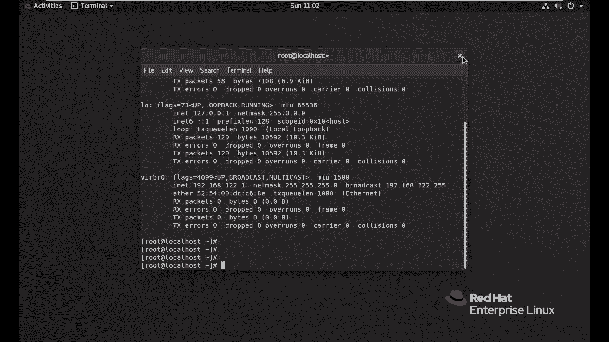

熟练使用快捷键可以极大提升在命令行下的工作效率。下面介绍一些最常用的快捷键。

以下是几个必须掌握的命令行快捷键：

*   **Tab 键**：命令或路径补全。输入命令或路径的前几个字符后按Tab，系统会自动补全。
*   **Ctrl + l** 或 **`clear` 命令**：清空当前终端屏幕。
*   **上下方向键**：翻阅之前执行过的命令历史。
*   **`history` 命令**：查看所有执行过的命令历史记录。
*   **`!编号`**：快速执行历史记录中指定编号的命令。编号通过 `history` 命令查看。
*   **`Esc + .`**：快速输入上一条命令的最后一个参数。
*   **Ctrl + r**：在命令历史中反向搜索。输入关键词即可查找包含该词的历史命令。
*   **Ctrl + a**：将光标移动到命令行的行首。
*   **Ctrl + e**：将光标移动到命令行的行尾。

## 界面切换与目录结构

了解了基本操作后，我们来看看Linux的界面切换和其独特的文件系统结构。Linux的一切皆文件，理解目录结构至关重要。

### 字符界面与图形界面切换

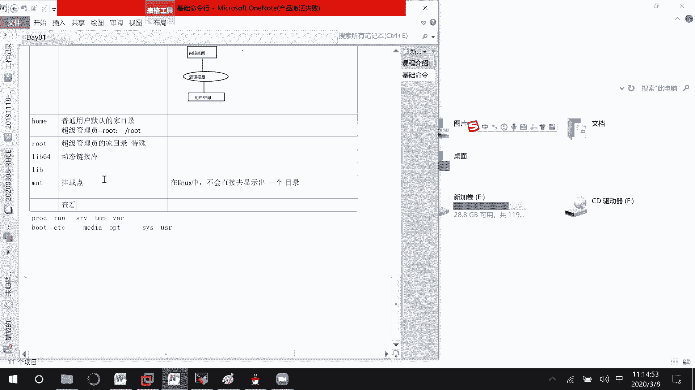

如果系统安装了图形界面但默认启动到字符界面，可以使用以下命令切换到图形界面：
```bash
startx
```
> **注意**：如果系统未安装图形界面，此命令无效。

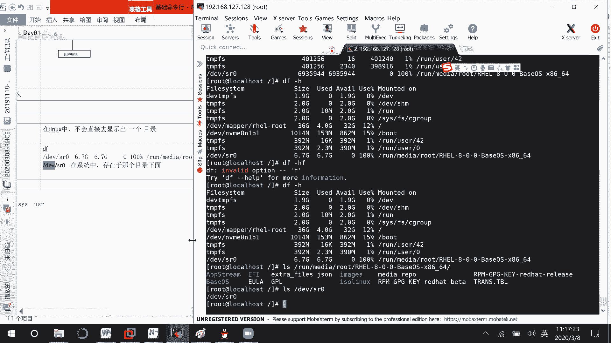

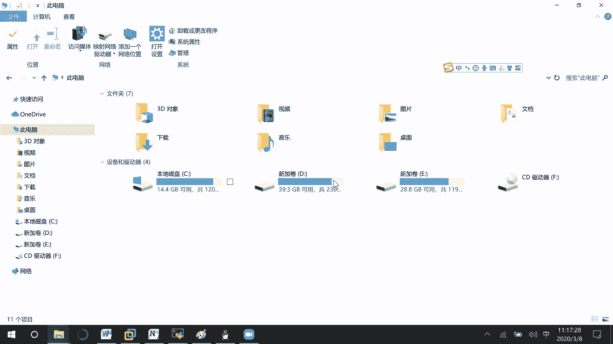

### Linux根目录解析

现在，让我们深入探索Linux的根目录（`/`）下各个核心目录的用途。

以下是Linux根目录下主要子目录的功能说明：

*   **`/bin` 与 `/sbin`**：存放系统最基本的命令（二进制可执行文件）。`/sbin` 下的命令通常需要管理员权限才能执行。
    *   查找命令位置：`which [命令名]`，例如 `which ls`。
*   **`/dev`**：设备文件目录。Linux将所有硬件设备（如硬盘、U盘）抽象为文件在此管理，用户通过访问这些文件来操作硬件。
*   **`/home`**：普通用户的家目录。每个用户在此拥有一个以自己用户名命名的子目录，用于存放个人文件和配置。
    *   超级管理员 root 的家目录比较特殊，位于 `/root`。
*   **`/lib` 与 `/lib64`**：存放系统最基本的共享库文件，类似于Windows的DLL文件，是许多命令和程序运行所依赖的。
*   **`/mnt` 与 `/media`**：挂载点目录。用于临时挂载文件系统，如U盘、光盘等。`/media` 是系统自动挂载的默认位置（如自动挂载光盘），`/mnt` 通常用于管理员手动挂载。
    *   查看所有挂载信息：`df -h`
*   **`/proc`**：虚拟文件系统，存放内核和进程的实时运行信息。这里的文件不是真正的磁盘文件，而是系统内存的映射。
    *   查看CPU信息：`cat /proc/cpuinfo`
    *   查看分区信息：`cat /proc/partitions`
*   **`/run`**：系统运行时文件，存放自系统启动以来描述系统信息的文件（如当前登录用户、运行中的进程ID）。是 `/var/run` 的符号链接。
*   **`/tmp`**：临时文件目录。所有用户都可读写，系统可能会定期清理此目录下的文件，**重要文件不要放在这里**。
*   **`/var`**：存放经常变化的文件，如日志（`/var/log`）、缓存数据、邮件等。
*   **`/boot`**：存放系统启动所需的文件，如内核、引导程序。**此目录非常重要，误删可能导致系统无法启动。**
*   **`/etc`**：系统**配置文件**目录。几乎所有系统服务和应用程序的配置文件都存放在这里。
    *   示例：SSH服务的配置文件在 `/etc/ssh/` 目录下。
*   **`/opt`**：可选应用程序目录。通常用于安装第三方大型软件或商业软件。
*   **`/usr`**：用户程序目录。存放系统用户安装的应用程序和文件，类似于Windows的 `Program Files` 目录。也包含大量的共享库、头文件、文档等。
*   **`/sys`**：与 `/proc` 类似，也是一个虚拟文件系统，主要用于管理Linux内核中的设备、驱动和某些内核特性，在系统高级调优时会用到。

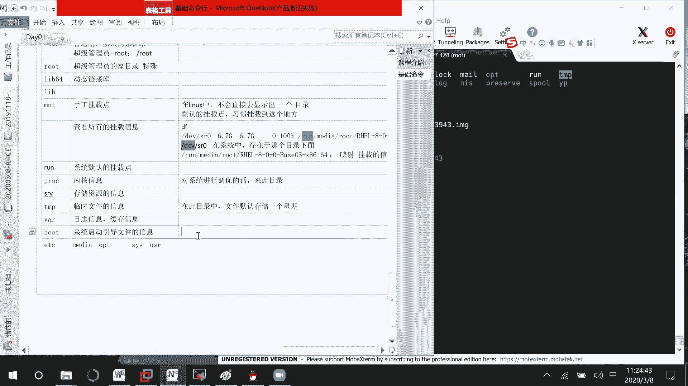

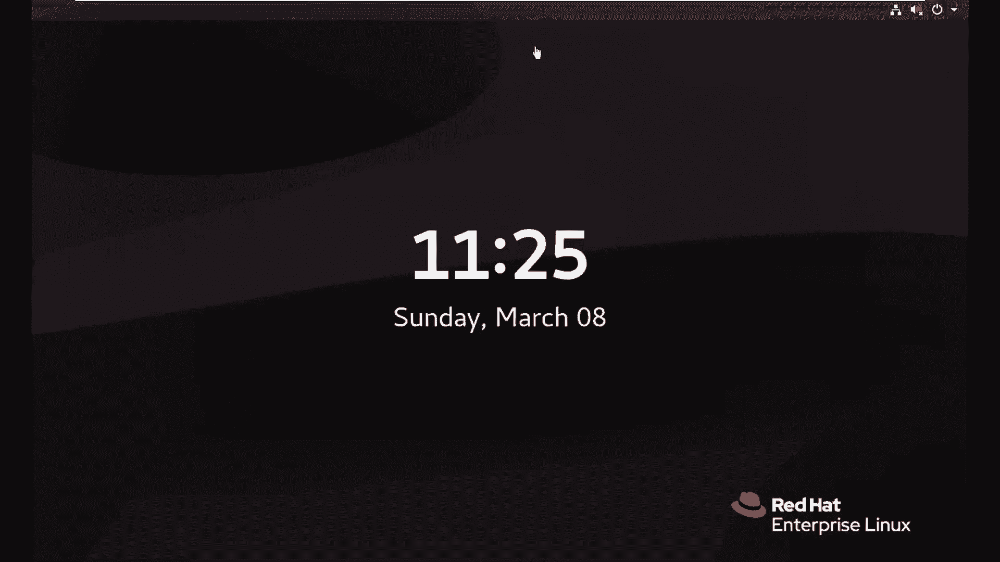

## 文件与目录操作进阶

掌握了目录结构，我们继续学习更丰富的文件和目录操作命令。

### 目录切换技巧

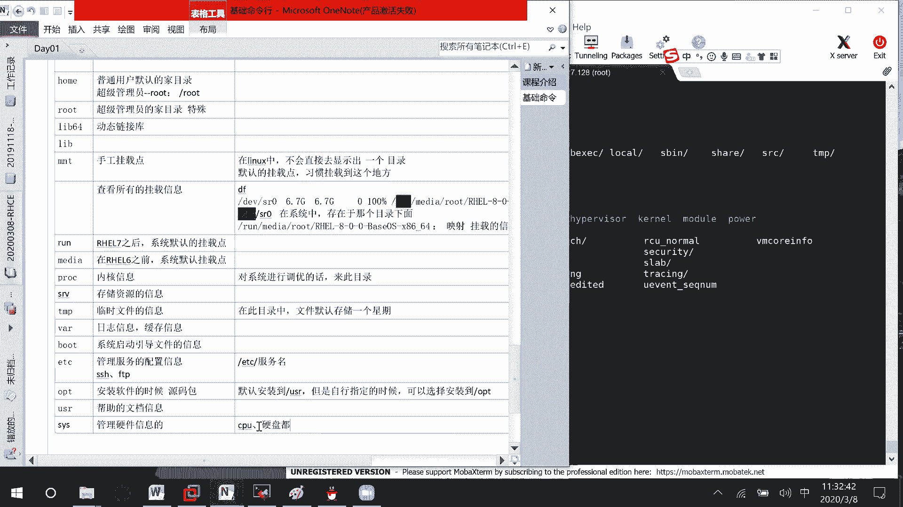

`cd` 命令除了切换绝对路径和相对路径，还有一些快捷用法：


*   `cd` 或 `cd ~`：直接返回当前用户的家目录。
*   `cd -`：切换到上一次所在的目录。

### 文件查看命令

有多种命令可以查看文件内容，适用于不同场景。

以下是常用的文件查看命令：

*   **`cat`**：连接文件并打印到标准输出，适合查看**内容较少**的文本文件。
    *   格式：`cat [文件名]`
*   **`more`** 与 **`less`**：分页查看文件，适合查看**内容较多**的文件。
    *   格式：`more [文件名]` 或 `less [文件名]`
    *   操作：按**空格**向下翻一页，按**回车**向下翻一行，按 **`q`** 退出。
    *   `less` 比 `more` 功能更强，支持上下滚动和搜索。
*   **`head`**：显示文件开头部分，默认显示前10行。
    *   格式：`head [文件名]`
    *   显示前N行：`head -n [行数] [文件名]`
*   **`tail`**：显示文件末尾部分，默认显示后10行。常用于查看日志。
    *   格式：`tail [文件名]`
    *   显示后N行：`tail -n [行数] [文件名]`

### 文件复制、移动与统计

*   **复制文件 `cp`**：复制文件或目录。
    *   格式：`cp [源文件] [目标文件或目录]`
    *   示例：`cp /etc/passwd /tmp/` （复制到 `/tmp` 目录，保持原名）
    *   示例：`cp /etc/passwd /tmp/passwd.bak` （复制并重命名）
*   **移动/重命名文件 `mv`**：移动文件或目录，也可用于重命名。
    *   格式：`mv [源文件] [目标文件或目录]`
    *   示例：`mv file1.txt /home/user/` （移动文件）
    *   示例：`mv oldname.txt newname.txt` （重命名文件）
*   **统计文件信息 `wc`**：统计文件的行数、单词数和字符数。
    *   格式：`wc [文件名]`
    *   输出示例：`45 103 2478 passwd` （分别表示：行数 单词数 字符数 文件名）
    *   常用选项：
        *   `-l`：只统计行数。`wc -l passwd`
        *   `-w`：只统计单词数。`wc -w passwd`
        *   `-c`：只统计字符数。`wc -c passwd`

---

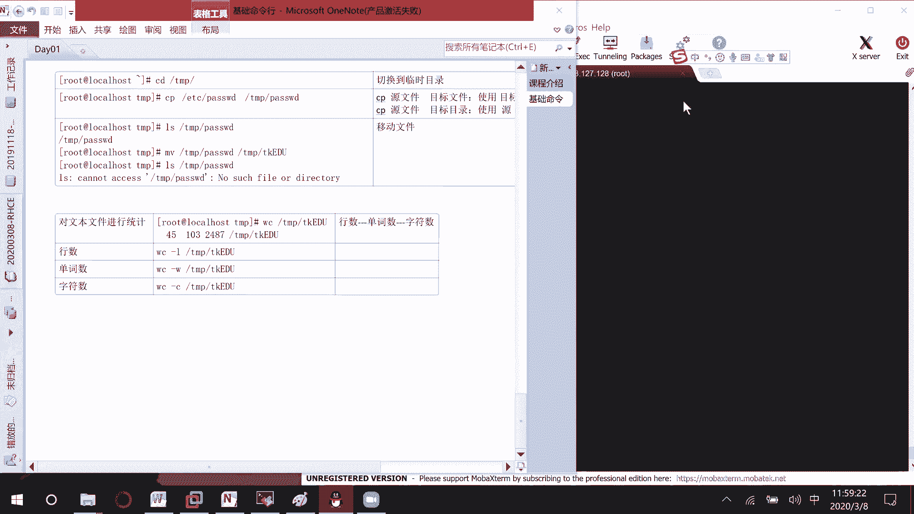

本节课中我们一起学习了Linux命令行的核心技能：如何获取帮助、使用高效快捷键、理解文件系统每个关键目录的职责，并掌握了文件查看、复制、移动和统计的基本命令。这些是日常操作Linux的基石，请务必多加练习。下午我们将学习一个极其重要的工具——Vim文本编辑器，它是编辑系统配置文件的关键。