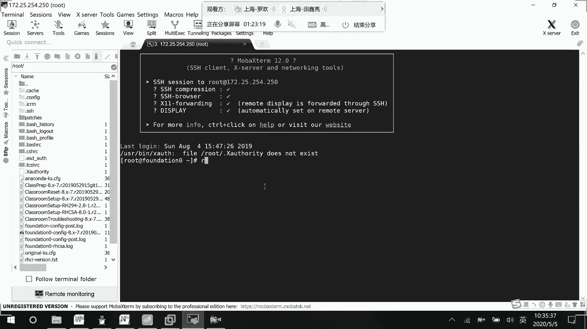
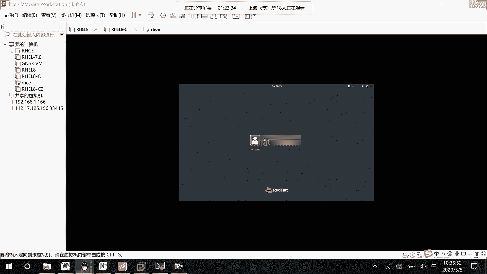
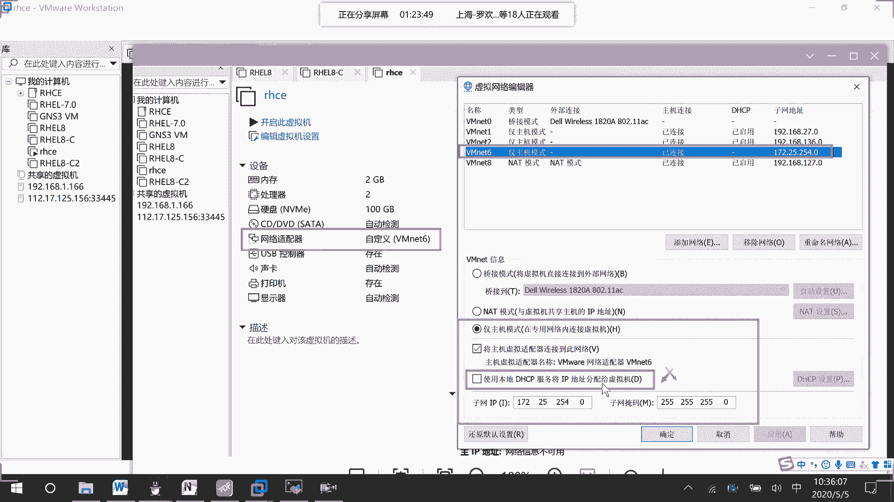
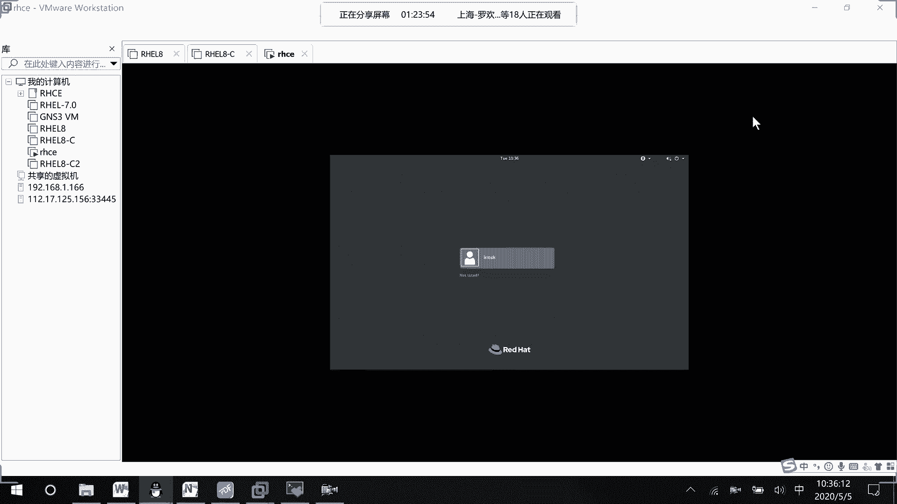
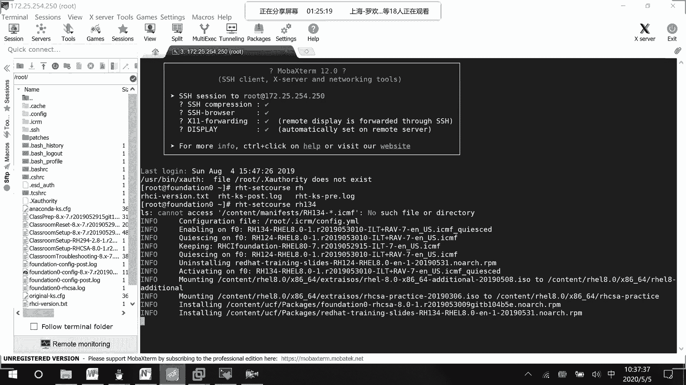
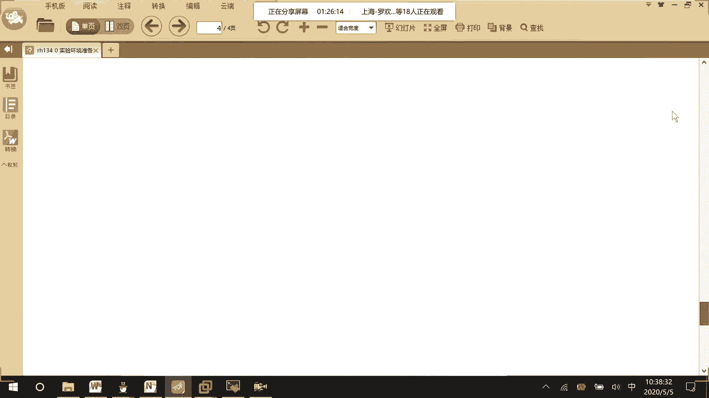
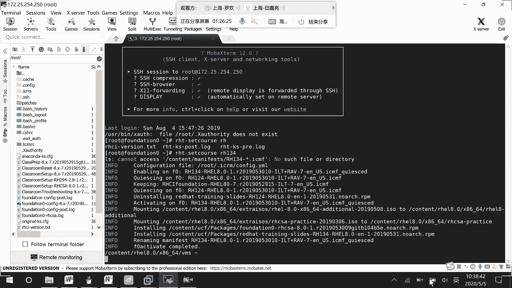
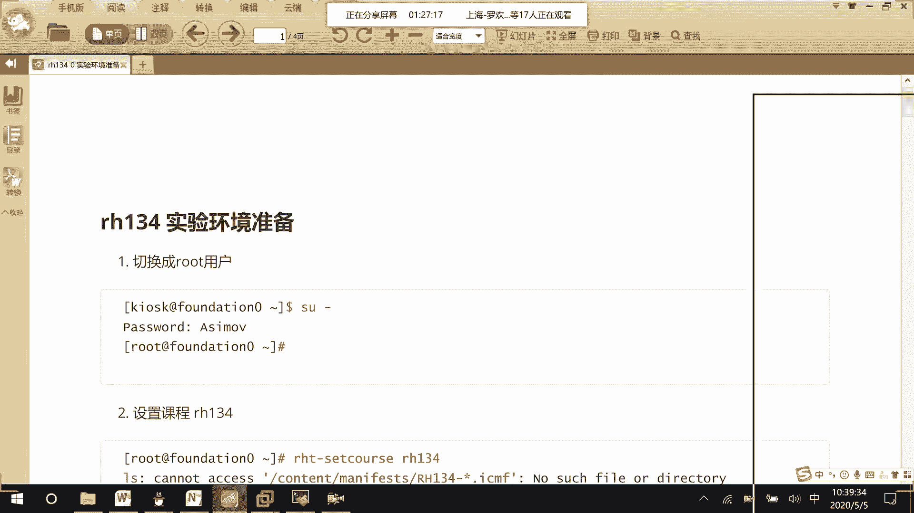
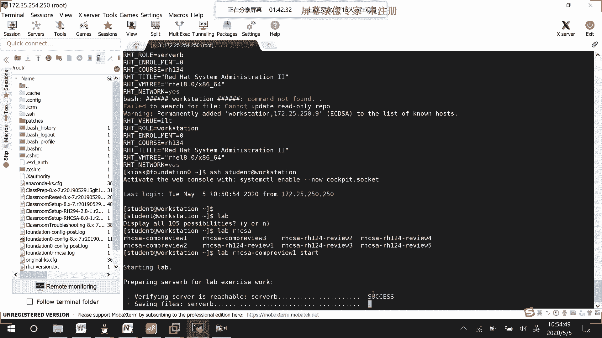

# RHCE 8.0 视频教程：P32：实验环境配置与重置



在本节课中，我们将学习如何为 RHCE 8.0 的实验配置和重置环境。我们将详细讲解如何启动特定的实验环境（如 134 号实验），并确保所有必要的虚拟机和服务都正确运行，以便顺利进行后续的练习。



## 实验环境网络配置



为了实验的便利性，我们需要将虚拟机配置在特定的网络环境中。以下是配置步骤。



首先，确保虚拟机网络适配器设置为 **VMnet 6**。你需要创建一个 **VMnet 6** 的主机模式网络。

以下是关键的网络参数配置：
*   **网段**：`172.25.254.0`
*   **DHCP**：**关闭**
*   **子网掩码**：`255.255.255.0` (即 `/24`)

配置完成后，你可以使用远程连接工具（如 SSH）连接到地址 `172.25.254.250`。默认密码是 `asimov`。

## 启动特定实验环境



成功连接到环境后，下一步是启动我们所需的实验环境，例如 134 号实验。

启动 134 号实验环境的命令是：
```bash
ht 134
```
执行此命令后，系统会开始加载和预设该实验所需的配置信息。如果后续需要启动其他实验（例如 294 号），则使用命令 `ht set coh 294`。

在初始输出中，你可能会看到 `cannot access` 的提示，这可以忽略。系统正在后台加载必要的配置。

## 重置 Classroom 环境



上一节我们介绍了如何启动实验环境，本节中我们来看看如何重置核心的 Classroom 环境。Classroom 是考官机环境，需要先进行重置。



加载完实验配置后，我们需要对 Classroom 环境进行操作。以下是重置步骤：



1.  首先，退出 `root` 用户，使用 `kiosk` 用户执行后续命令。
2.  停止并移除当前的 Classroom 容器。
    ```bash
    # 停止 classroom 容器
    podman stop classroom
    # 移除 classroom 容器
    podman rm classroom
    ```
3.  重新启动 Classroom，系统会自动拉取正确的镜像并启动。
    ```bash
    podman start classroom
    ```

等待 Classroom 容器完全启动并可以 ping 通后，再进行下一步。

## 重置所有工作设备

Classroom 环境就绪后，我们需要重置所有的工作设备（如 workstation 和 管理服务器），以确保实验环境干净。

以下是重置所有其他设备的步骤：
1.  移除除 Classroom 外的所有其他容器。
    ```bash
    # 此命令会移除所有非 classroom 的容器
    podman rm -f $(podman ps -aq | grep -v classroom)
    ```
2.  重新拉取并启动所有实验所需的设备。系统会自动从配置中拉取镜像并启动容器。
    ```bash
    # 启动所有定义好的容器
    podman start --all
    ```

请耐心等待所有设备都启动完成（状态为 `start all`）。之后，你就可以通过 SSH 连接到 `workstation` 开始练习了。

## 执行环境重置脚本

所有设备启动后，最后一步是执行官方的环境重置脚本，为具体的实验题目做准备。

以 `student` 用户身份 SSH 连接到 `workstation`，然后执行以下命令来重置环境：
```bash
lab hcsa compress start
```
此脚本会初始化实验环境。如果遇到 `ht costs not set` 之类的错误，通常是因为某些设备尚未完全启动。请返回上一步检查所有容器状态，确保它们都在运行后，再重新执行此重置命令。

脚本执行完毕后，实验环境就完全准备就绪，可以开始进行练习题目了。

---



本节课中我们一起学习了 RHCE 8.0 实验环境的完整配置与重置流程。关键步骤包括：配置 VMnet 6 网络、使用 `ht` 命令启动特定实验、重置 Classroom 核心环境、移除并重启所有工作设备，最后执行 `lab hcsa compress start` 脚本完成初始化。掌握这个流程能确保你拥有一个正确、干净的实验起点。