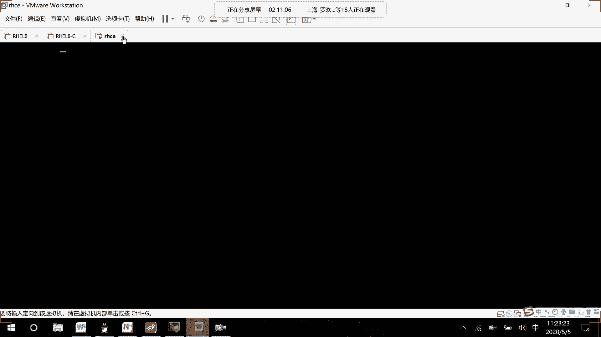
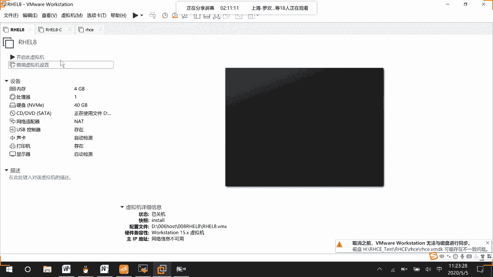
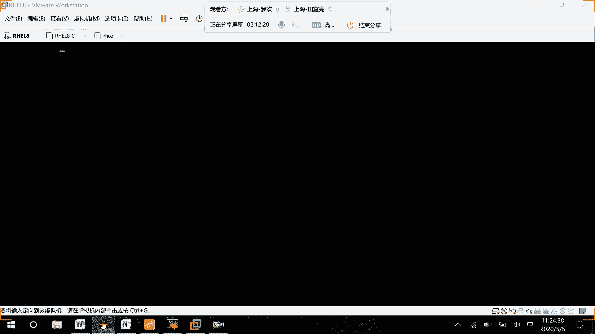
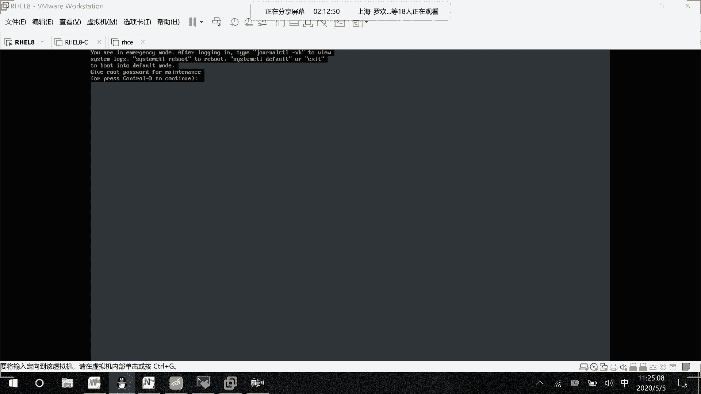
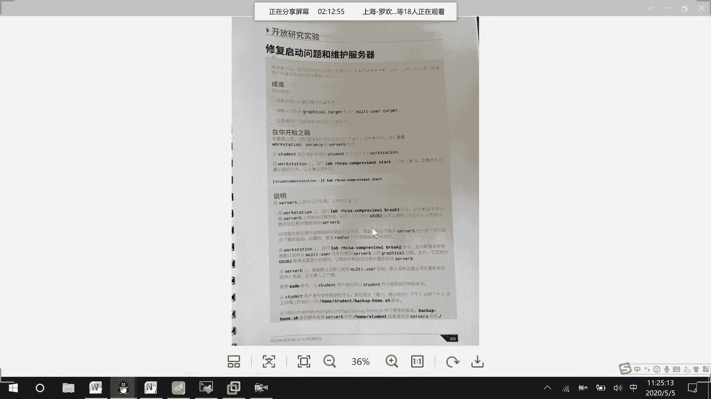
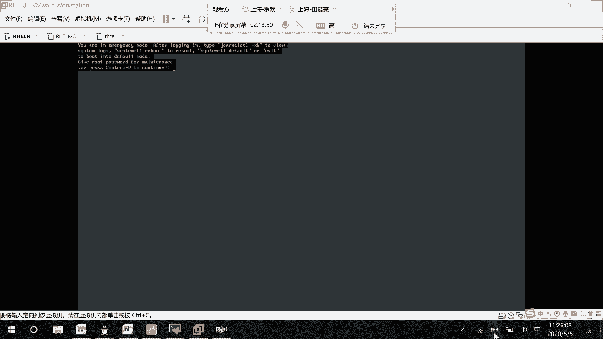

# RHCE8.0视频教程：P33：系统启动与故障恢复

在本节课中，我们将学习如何在虚拟机环境下处理系统启动问题，特别是如何进入紧急救援模式来修复常见的启动故障，例如文件系统挂载错误。我们将通过具体的步骤演示，帮助你掌握系统恢复的基本技能。





---

上一节我们介绍了系统启动的基本流程，本节中我们来看看当系统无法正常启动时，如何通过紧急救援模式进行故障排查和修复。

在虚拟机环境中，有时无法直接从光盘启动。另一种方式是修改启动参数。具体操作如下：在系统启动的GRUB菜单界面，选中需要启动的内核条目，按下 `e` 键进入编辑模式。

找到以 `linux` 开头的那一行，在该行的末尾添加以下参数：
```
systemd.unit=emergency.target
```
这个参数会临时告诉内核启动到紧急救援模式。编辑完成后，按下 `Ctrl+X` 组合键以保存并继续启动。

系统随后将进入紧急救援模式。在此模式下，你需要使用 `root` 用户名和密码进行登录。



---



登录后，系统可能会提示你遇到了问题。例如，屏幕上可能显示类似 `lab i h c s a` 的提示，并指出 `/etc/fstab` 文件存在错误导致启动中断。



以下是处理此类问题的基本思路：
1.  系统会中断启动过程，提示你检查问题所在。
2.  常见的错误是 `/etc/fstab` 文件中的配置有误。你可以编辑此文件，将有问题的行注释掉（在行首添加 `#` 号）。
3.  修复后，可以尝试重新启动系统。

---

除了文件系统错误，考试或实践中还可能遇到其他几种启动相关问题：

以下是几种常见的启动配置问题及其解决方法：
*   **切换到图形界面**：如果系统启动后默认进入多用户文本模式，你需要知道如何切换到图形界面。通常可以通过修改系统运行级别或使用 `systemctl` 命令来实现。
*   **使用 `sudo` 权限**：在恢复模式下或日常管理中，你可能需要使用 `sudo` 命令来执行需要超级管理员权限的操作。
*   **管理计划任务**：系统故障也可能与计划任务 (`cron`) 配置有关，因此了解如何查看和管理计划任务也是必要的。

---



本节课中我们一起学习了如何通过修改GRUB启动参数进入紧急救援模式，并在此模式下诊断和修复由 `/etc/fstab` 配置错误导致的启动故障。我们还简要介绍了处理其他几种常见启动问题（如切换界面、使用`sudo`、管理计划任务）的思路。掌握这些技能对于系统管理员进行故障排除至关重要。