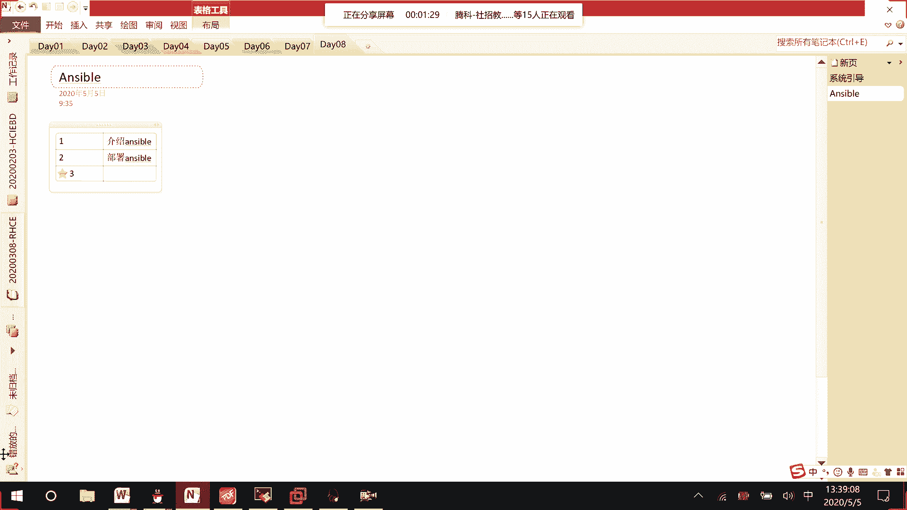
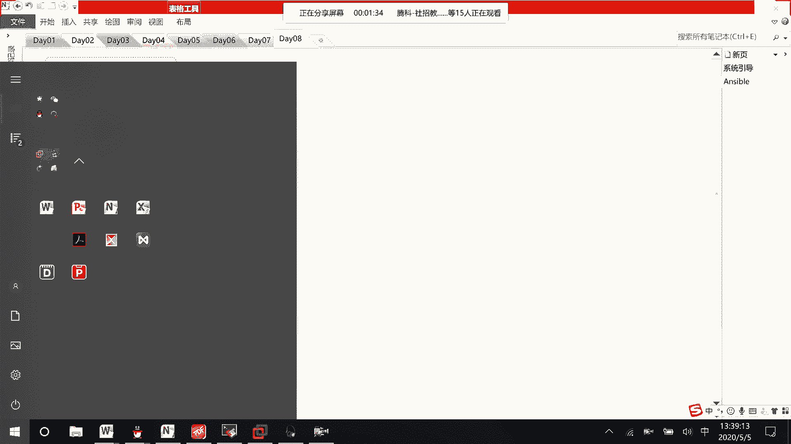
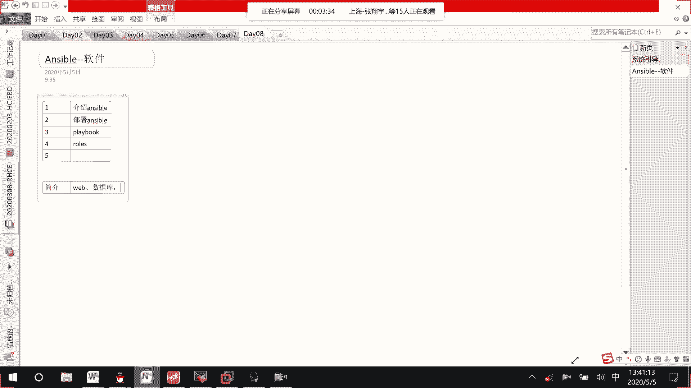

# RHCE8.0视频教程：P34：Ansible简介与部署

在本节课中，我们将要学习Ansible自动化运维工具。Ansible是RHCE 8.0认证中新增的核心内容，用于高效管理多台主机。本节将介绍Ansible的作用、工作原理以及基础部署。

## Ansible简介

上一节我们介绍了课程的整体结构，本节中我们来看看Ansible是什么。Ansible是一款自动化运维工具，用于配置管理、应用部署和任务编排。它与RHCE 7.0版本不同，是RHCE 8.0中新增的考核内容（对应课程代码294）。

Ansible的核心作用是集中管理多台主机。它通过一个称为“控制节点”的中心服务器，来管理众多被称为“被管理节点”的主机。其工作模式如下图所示：

## Ansible的核心概念与优势

仅仅发送单条命令效率低下且难以复用。Ansible通过编写**Playbook**脚本文件来解决这个问题。Playbook类似于我们之前学过的Shell脚本，它用YAML格式编写，可以记录一系列任务，实现复杂操作的自动化与重复执行。

以下是Ansible相比手动操作的主要优势：
*   **可重复性**：Playbook脚本可以反复执行，确保操作一致性。
*   **高效性**：避免在大量主机上重复执行相同命令。
*   **可管理性**：将运维逻辑代码化，便于版本控制和团队协作。

## 课程内容概览

本Ansible模块将涵盖以下核心知识点，为后续深入学习打下基础：

1.  **Ansible简介与部署**：了解其作用并完成软件安装。
2.  **Playbook编写**：学习如何编写自动化任务脚本。
3.  **变量与Facts**：掌握如何在Playbook中使用变量和获取主机信息。
4.  **任务与文件管理**：学习管理复杂任务、文件分发和大项目。
5.  **Roles（角色）**：这是Playbook的更高层次封装，用于组织和管理复杂的自动化逻辑。
6.  **故障排除**：学习如何分析和解决Ansible执行过程中的常见问题。

## Ansible的适用场景

Ansible作为一款软件，可以部署在各种环境中。它擅长管理以下类型的服务：
*   Web应用（如Nginx， Apache）
*   数据库（如MySQL， PostgreSQL）
*   企业自研的各类应用软件

其核心价值体现在批量操作上。例如，当需要在数十甚至上百台服务器上更新某个软件版本时，使用Ansible可以极大地提升效率并降低出错风险。

---

本节课中我们一起学习了Ansible的基本概念、核心优势以及整个课程的知识体系。我们了解到Ansible通过“控制节点”管理“被管理节点”，并利用**Playbook**脚本实现自动化，从而高效处理诸如软件升级等批量运维任务。从下一节开始，我们将动手部署Ansible环境。