# Ansible 基础教程：P37：文件管理与计划任务

在本节课中，我们将学习如何使用 Ansible 进行远程文件管理和计划任务管理。主要内容包括：将本地脚本发送到远程主机执行、使用 `copy` 模块传输文件、使用 `fetch` 模块从远程主机提取文件、使用 `file` 模块管理文件属性与状态，以及使用 `cron` 模块管理计划任务。

---

## 远程执行脚本的两种方式

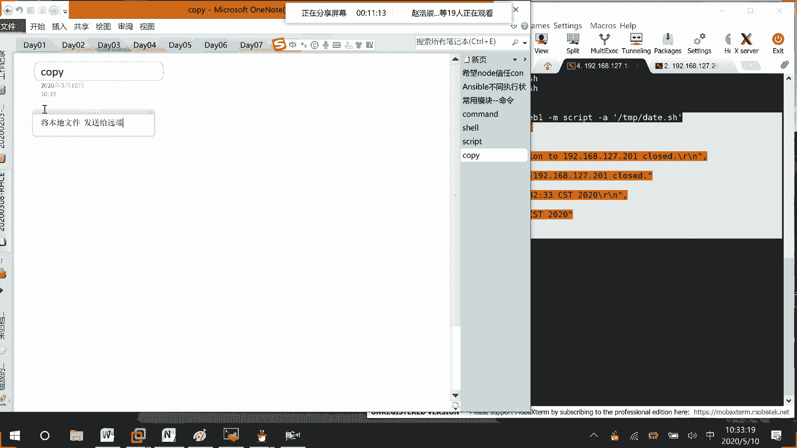

有时我们希望将本地编写的脚本传输到远程主机上执行。通常有两种实现方式。

以下是两种执行远程脚本的方法：

1.  **先发送，后执行**：首先在本地编写好脚本文件，然后使用 `copy` 模块将脚本文件发送到远程主机，最后在远程主机上执行该脚本。
2.  **直接执行**：在本地使用 `script` 模块直接执行脚本文件，该模块会自动将脚本传输到远程主机并运行，省去了手动推送的步骤。

接下来，我们将通过实践来详细了解这两种方式。

---

## 实践：使用 `script` 模块直接执行

首先，我们创建一个简单的脚本文件。

```bash
# 在 /tmp 目录下创建脚本 date.sh
echo -e '#!/bin/bash\ndate' > /tmp/date.sh
```

现在，我们使用 Ansible 的 `script` 模块让远程主机 `web1` 执行这个脚本。

```bash
ansible web1 -m script -a "/tmp/date.sh"
```

执行后，模块会返回远程主机的标准输出结果。如果脚本有多个输出条目，都会显示出来。

---

## 实践：使用 `copy` 模块先发送后执行

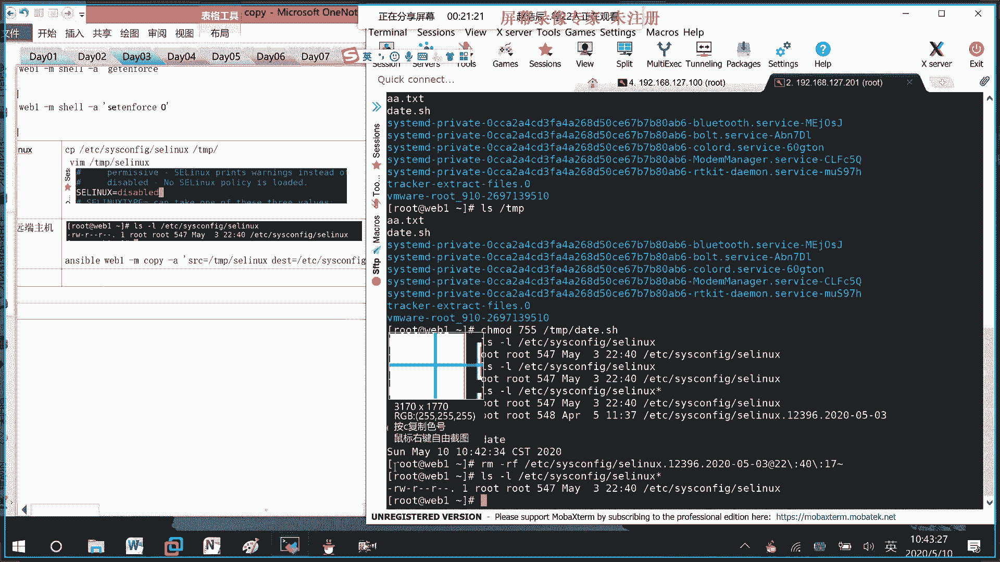

上一节我们介绍了直接执行脚本的方法，本节我们来看看如何先将文件发送到远程主机。

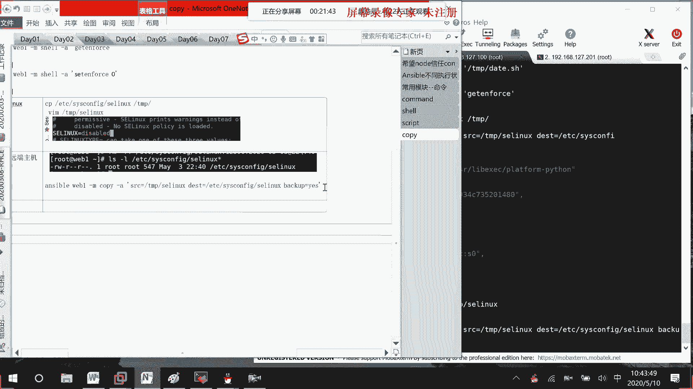

`copy` 模块用于将本地文件复制到远程主机。我们可以先查看其帮助信息。

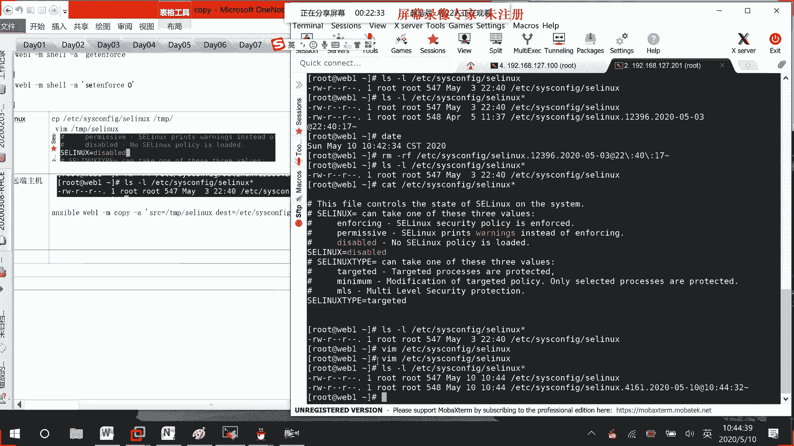

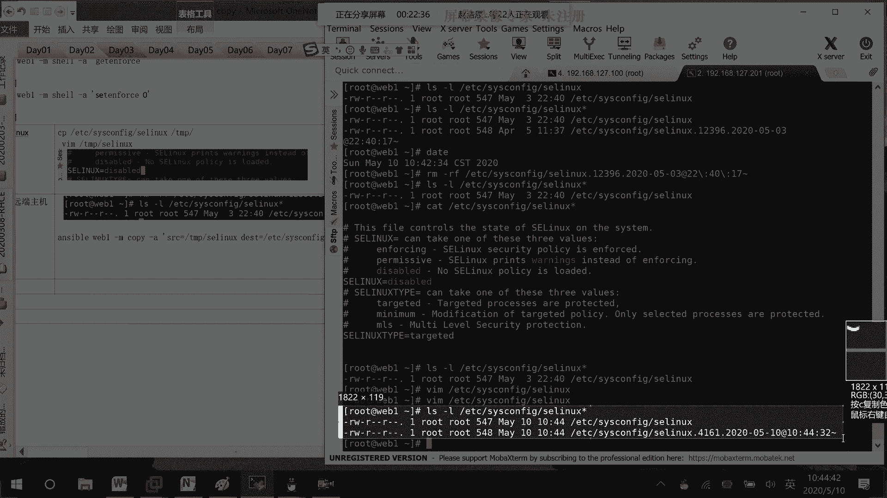

```bash
ansible-doc copy
```

关键参数包括：
*   `src`：本地源文件的路径。
*   `dest`：远程主机上目标文件的路径。
*   `backup`：在覆盖前备份远程主机上的原文件。
*   `mode`：设置远程文件权限。
*   `owner`：设置远程文件所有者。
*   `group`：设置远程文件所属组。

首先，我们将之前创建的脚本发送到远程主机。

```bash
# 将本地 /tmp/date.sh 发送到远程主机的 /tmp 目录
ansible web1 -m copy -a "src=/tmp/date.sh dest=/tmp/"
```

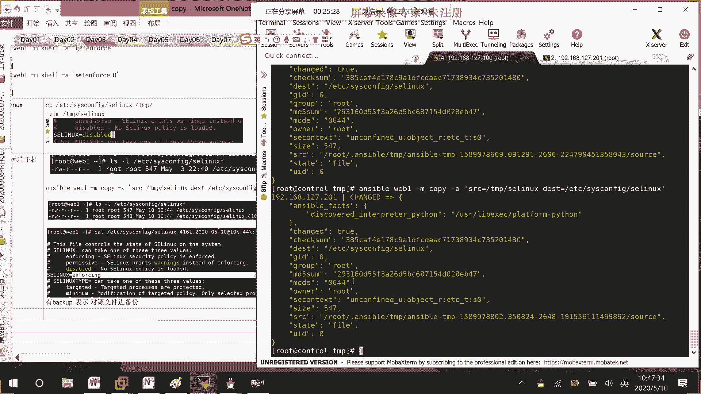

发送成功后，我们需要为远程脚本添加执行权限，然后执行它。

```bash
# 修改远程文件权限
ansible web1 -m shell -a "chmod 755 /tmp/date.sh"
# 执行远程脚本
ansible web1 -m shell -a "/tmp/date.sh"
```

这样，我们就完成了“先发送，后执行”的完整流程。

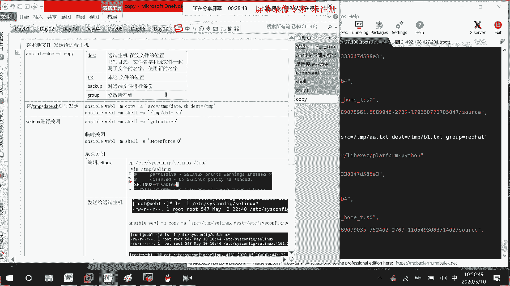

---

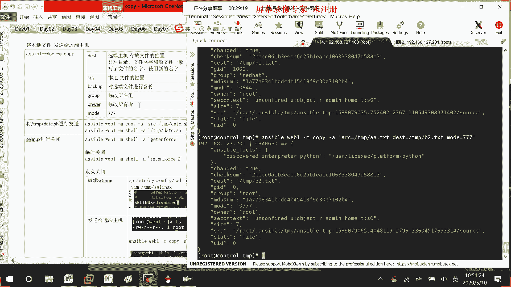

## `copy` 模块的进阶用法

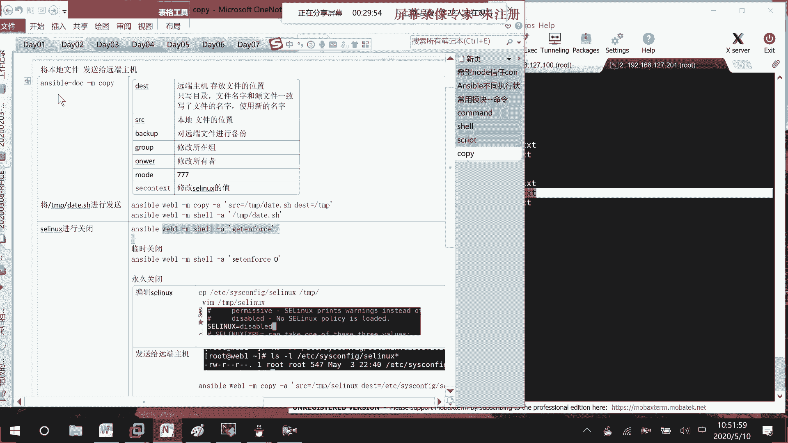

除了基本传输，`copy` 模块还有一些实用功能。

### 1. 覆盖前备份 (`backup`)

在覆盖远程重要文件（如配置文件）前，建议进行备份。例如，修改 SELinux 配置：

```bash
# 1. 本地编辑 SELinux 配置文件副本
cp /etc/selinux/config /tmp/
# 编辑 /tmp/config，将 SELINUX=enforcing 改为 SELINUX=disabled

# 2. 使用 backup=yes 将修改后的文件发回远程主机，原文件会被备份
ansible web1 -m copy -a "src=/tmp/config dest=/etc/selinux/config backup=yes"
```

执行后，远程 `/etc/selinux/` 目录下会生成一个带时间戳的备份文件（如 `config.2024-05-10@10:30:00~`）。

### 2. 传输时修改属性

我们可以在复制文件的同时，修改其权限、所有者和所属组。

```bash
# 创建一个本地测试文件
echo “hello” > /tmp/aa.test

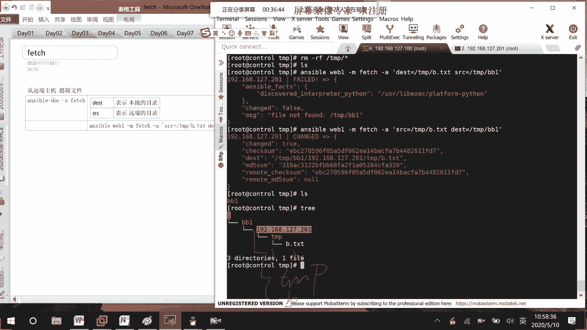

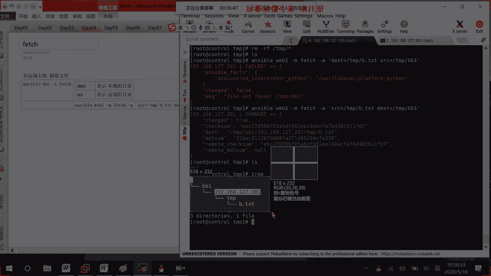

# 复制到远程，并同时修改权限为777，所有者为root，所属组为wheel
ansible web1 -m copy -a “src=/tmp/aa.test dest=/tmp/bb.test mode=0777 owner=root group=wheel”
```

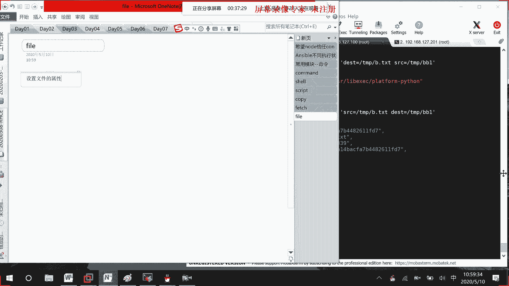

### 3. 直接写入内容 (`content`)

`copy` 模块的 `content` 参数可以直接将字符串内容写入远程文件，这会覆盖目标文件的原有内容。

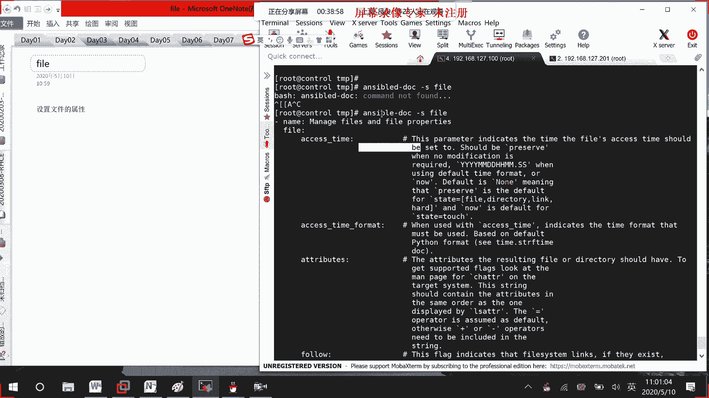

```bash
ansible web1 -m copy -a ‘content=“bye\n20200510\nhello” dest=/tmp/bb.test’
```

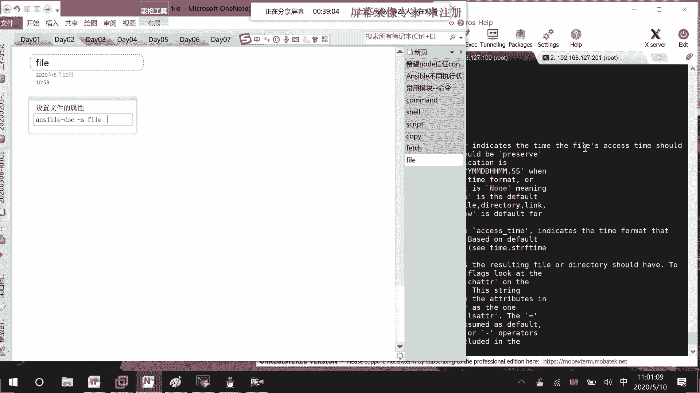

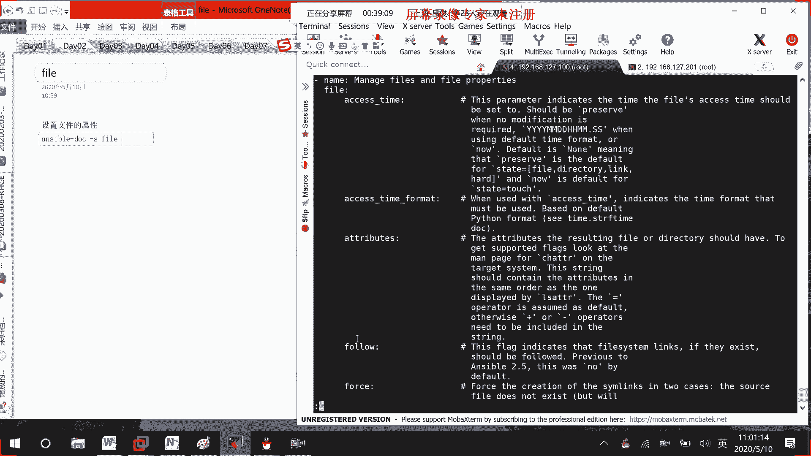

---

## 从远程主机提取文件 (`fetch` 模块)

有时我们需要从远程主机拉取文件到本地，这时可以使用 `fetch` 模块。

```bash
# 将远程主机 web1 上的 /tmp/bb.test 文件拉取到本地 /tmp/ 目录，并保存为 bb.fetch
ansible web1 -m fetch -a “src=/tmp/bb.test dest=/tmp/bb.fetch”
```

**注意**：当管理多个主机时，`fetch` 模块会为每个主机在本地 `dest` 目录下创建以主机名命名的子目录，并将文件存放在其中，以区分不同主机的文件。

---

## 文件与目录管理 (`file` 模块)

`file` 模块专门用于设置文件属性或管理文件状态。我们先查看其帮助信息。

```bash
ansible-doc file
```

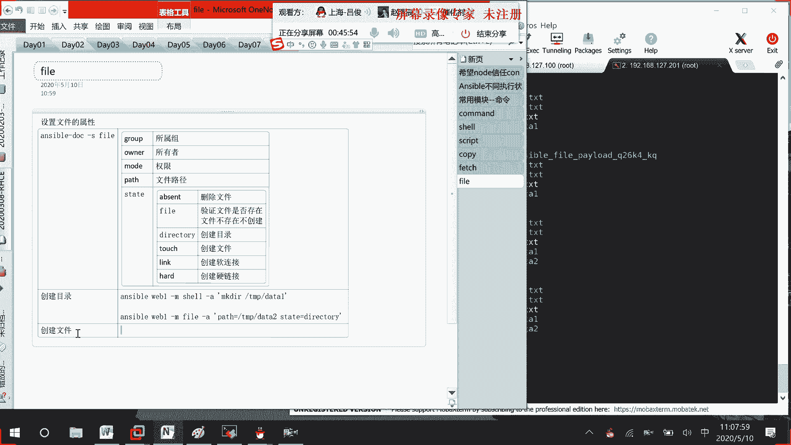

常用参数：
*   `path`：目标文件或目录的路径。
*   `state`：
    *   `directory`：确保目录存在，不存在则创建。
    *   `touch`：确保文件存在，不存在则创建空文件。
    *   `file`：验证路径是否存在且为普通文件（不创建）。
    *   `absent`：删除文件或目录。
    *   `link` / `hard`：创建软链接或硬链接。
*   `mode`：设置权限。
*   `owner`：设置所有者。
*   `group`：设置所属组。

以下是 `file` 模块的一些操作示例。

### 1. 创建目录

```bash
# 方法1：使用 shell 模块
ansible web1 -m shell -a “mkdir /tmp/dir1”

# 方法2：使用 file 模块 (推荐)
ansible web1 -m file -a “path=/tmp/dir2 state=directory”
# 创建多级目录
ansible web1 -m file -a “path=/tmp/dir2/dir21/dir22 state=directory”
```

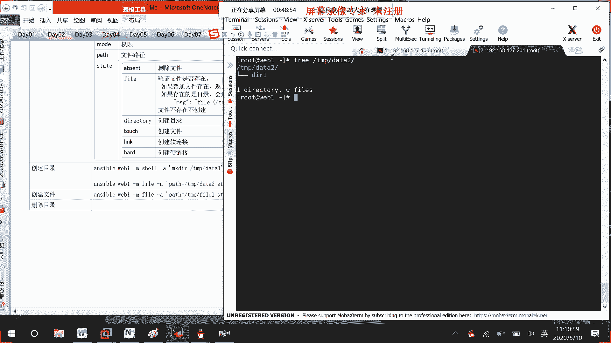

### 2. 创建文件

```bash
# 使用 touch 状态创建文件
ansible web1 -m file -a “path=/tmp/file1 state=touch”
```

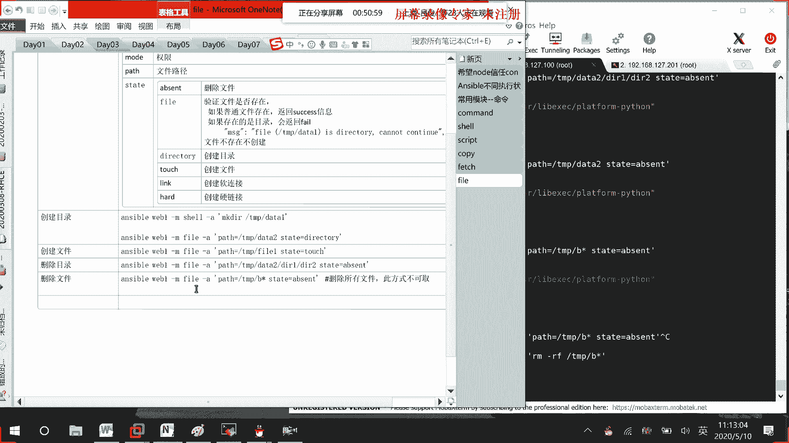

### 3. 检查文件状态

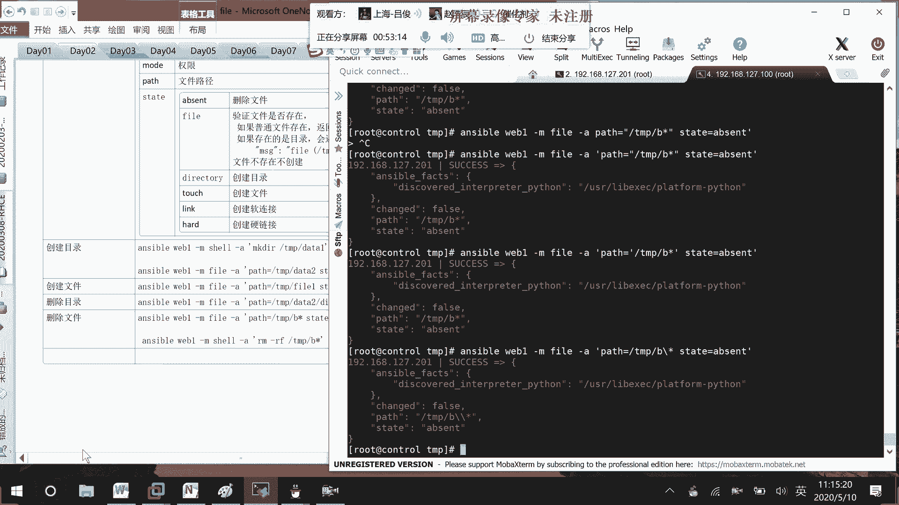

`state=file` 用于检查路径是否为普通文件，不会创建文件。

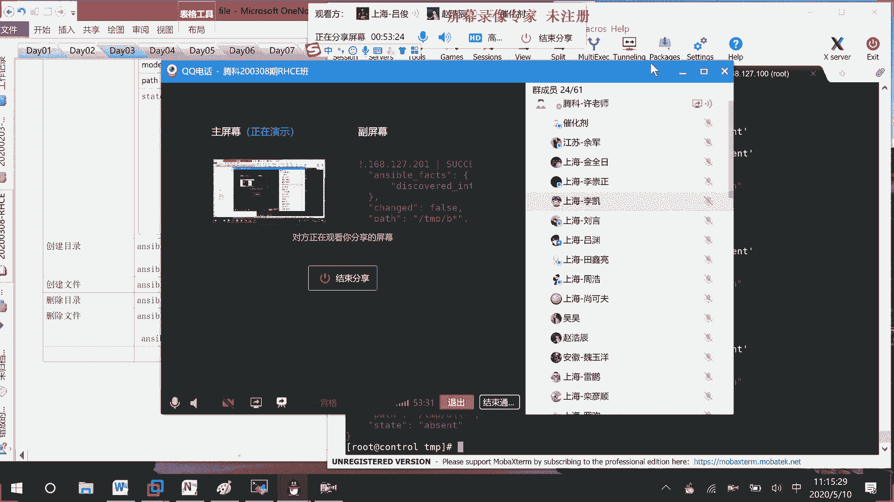

```bash
ansible web1 -m file -a “path=/tmp/file1 state=file”
# 如果文件存在，返回 success；如果是目录，则会提示是目录信息。
```

### 4. 删除文件或目录

```bash
# 删除单个目录
ansible web1 -m file -a “path=/tmp/dir2 state=absent”
# 删除目录及其下所有内容 (递归删除)
ansible web1 -m file -a “path=/tmp/dir1 state=absent”
# 删除文件
ansible web1 -m file -a “path=/tmp/file1 state=absent”
```

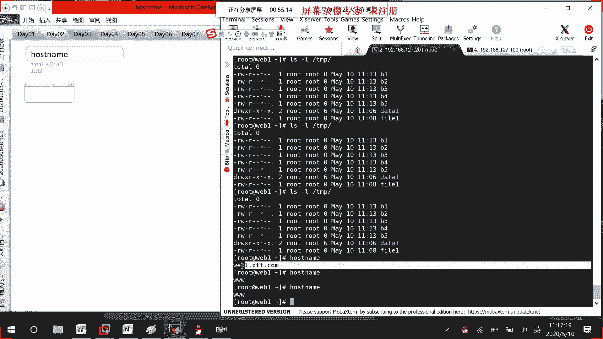

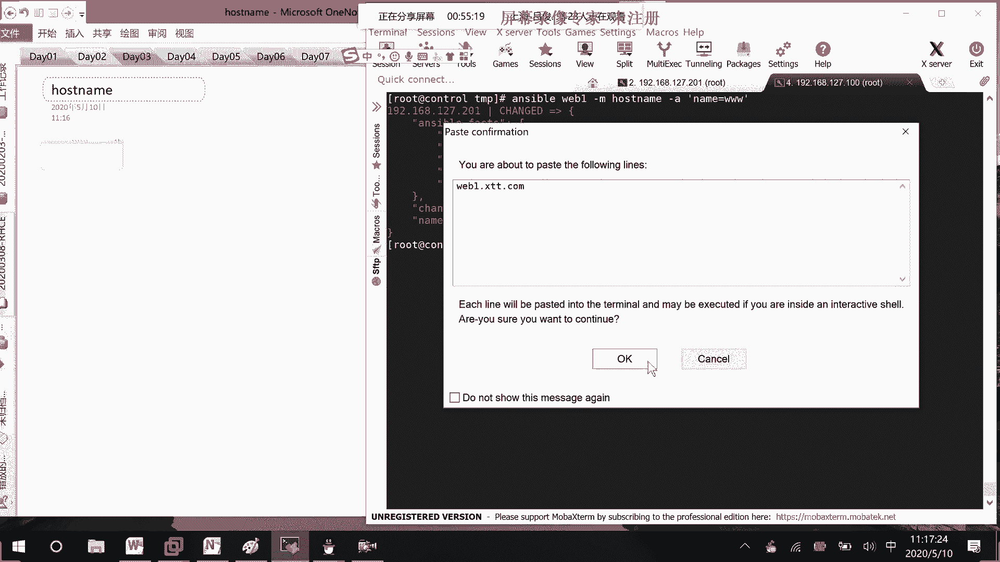

**注意**：使用 `file` 模块删除通配符匹配的多个文件（如 `path=/tmp/b*`）可能无法直接生效，复杂删除操作建议使用 `shell` 模块。

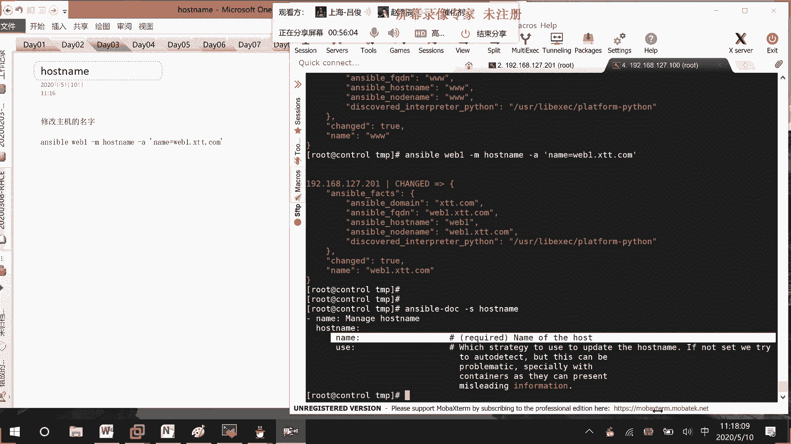

---

## 修改主机名 (`hostname` 模块)

`hostname` 模块用于修改远程主机的主机名。

```bash
# 将主机 web1 的主机名改为 www
ansible web1 -m hostname -a “name=www”
# 改回原主机名
ansible web1 -m hostname -a “name=web1.xtt.com”
```

**注意**：如果在多台主机的组上执行此命令，所有主机将被改为相同的名字。为不同主机设置不同名称需要用到变量，我们将在后续课程中介绍。

---

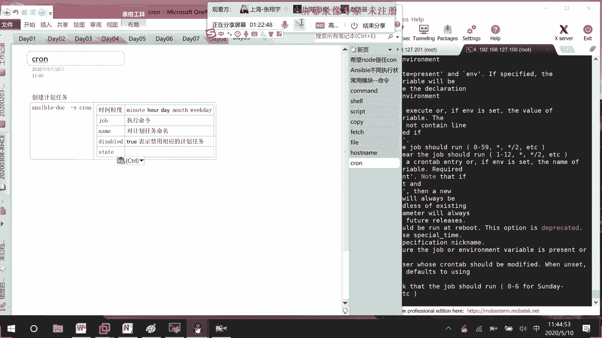

## 管理计划任务 (`cron` 模块)

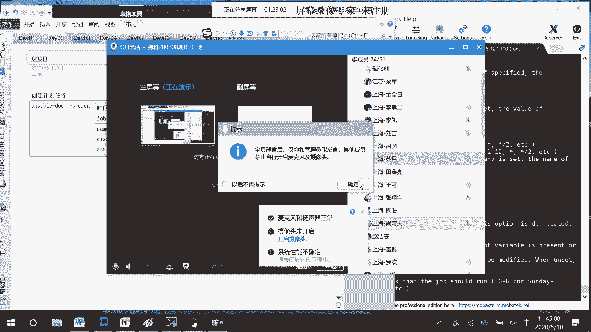

`cron` 模块用于管理远程主机的计划任务（cron job）。我们先查看其帮助信息。

```bash
ansible-doc cron
```

关键参数：
*   `name`：计划任务的名称（标识符），非常重要。
*   `job`：要执行的命令。
*   `minute`, `hour`, `day`, `month`, `weekday`：定义执行时间，默认为 `*`。
*   `user`：以哪个用户身份创建任务（默认为 root）。
*   `state`：`present`（添加，默认）或 `absent`（删除）。
*   `disabled`：`yes` 禁用任务，`no` 启用任务。

以下是 `cron` 模块的操作示例。

### 1. 创建计划任务

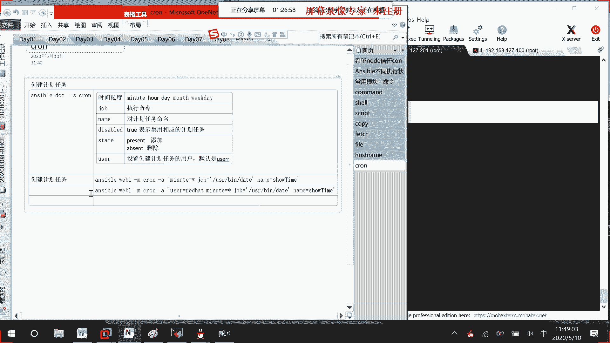

```bash
# 创建一个每分钟执行 date 命令的任务，命名为 show_time
ansible web1 -m cron -a “name=show_time job=/usr/bin/date”
# 以 redhat 用户身份，每5分钟执行一次 echo hello，命名为 say_hello
ansible web1 -m cron -a “name=say_hello minute=*/5 job=‘echo hello’ user=redhat”
```

### 2. 修改计划任务

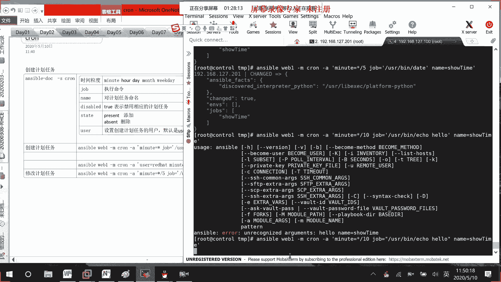

通过指定相同的 `name`，可以修改现有任务。

```bash
# 将 show_time 任务改为每5分钟执行一次
ansible web1 -m cron -a “name=show_time minute=*/5 job=/usr/bin/date”
```

### 3. 禁用与启用计划任务

```bash
# 禁用名为 show_time 的任务
ansible web1 -m cron -a “name=show_time disabled=yes”
# 启用名为 show_time 的任务
ansible web1 -m cron -a “name=show_time disabled=no”
```

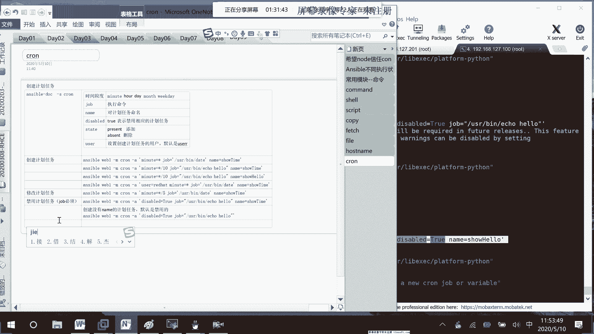

### 4. 删除计划任务

```bash
# 删除名为 show_time 的计划任务
ansible web1 -m cron -a “name=show_time state=absent”
```

**重要提示**：
*   `job` 参数是必须的，`name` 参数虽然不是必须，但强烈建议使用，以便于管理和后续操作（修改、禁用、删除）。
*   操作时，参数名称（如 `name`, `job`）是大小写敏感的。

---

## 总结

本节课我们一起学习了 Ansible 在文件管理和计划任务方面的核心模块：
1.  使用 `script` 和 `copy` + `shell` 两种方式实现远程脚本执行。
2.  使用 `copy` 模块在本地和远程主机间传输文件，并可进行备份和属性修改。
3.  使用 `fetch` 模块从远程主机拉取文件到本地。
4.  使用 `file` 模块创建、删除文件和目录，并管理其属性。
5.  使用 `hostname` 模块修改远程主机名。
6.  使用 `cron` 模块对远程主机的计划任务进行增、删、改、查、启用和禁用操作。

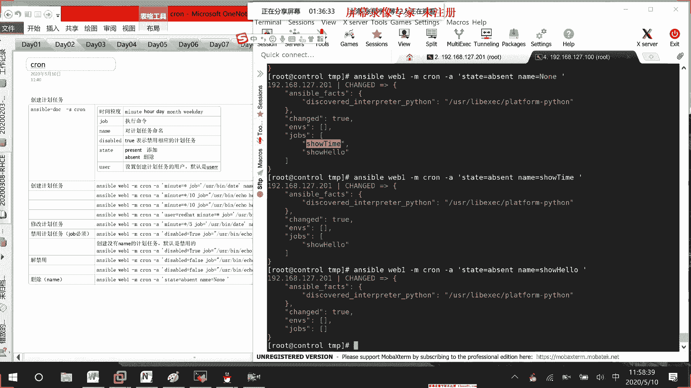

掌握这些模块，能够帮助我们高效地自动化完成日常的系统管理和配置任务。