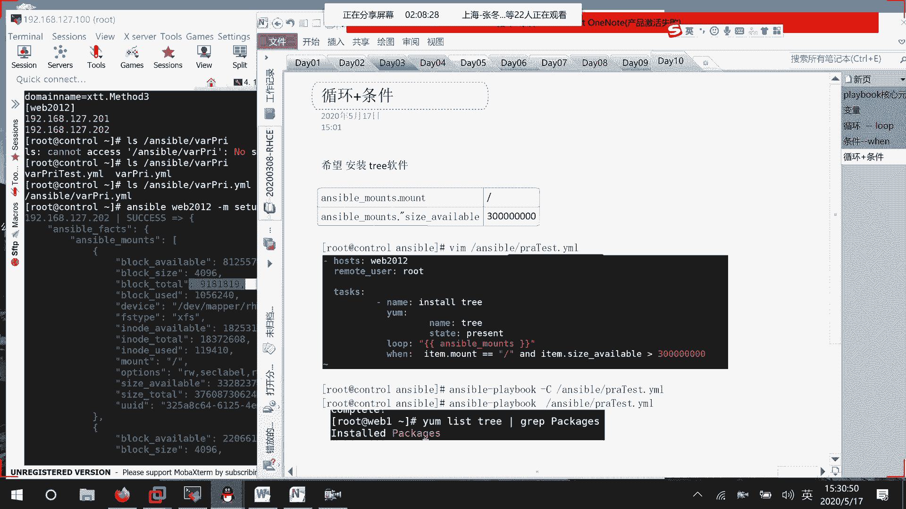
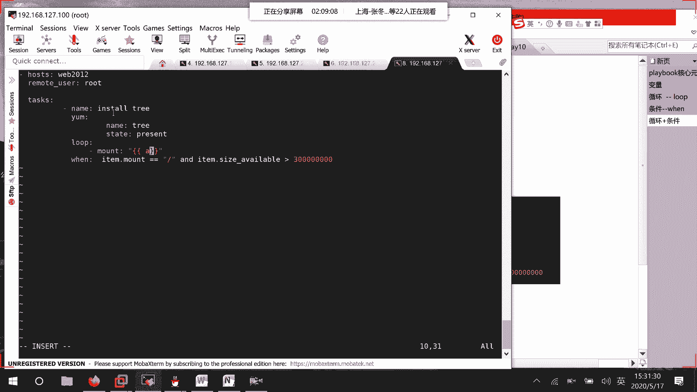
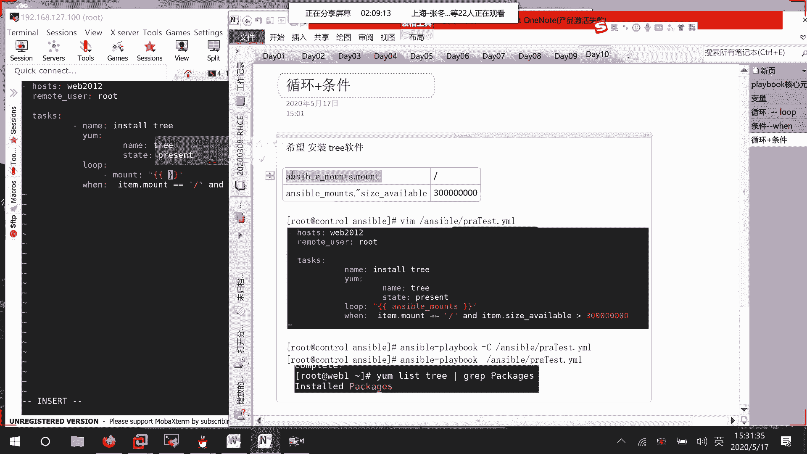
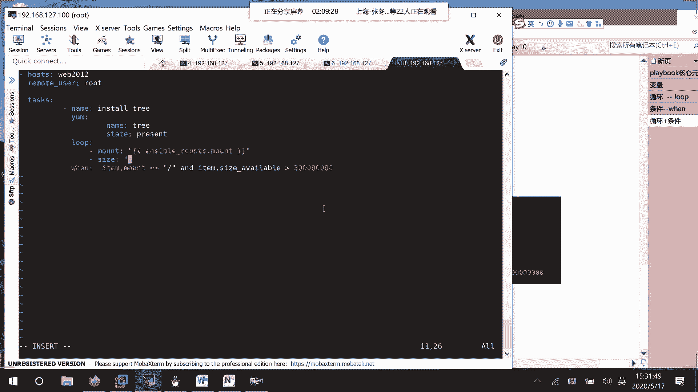
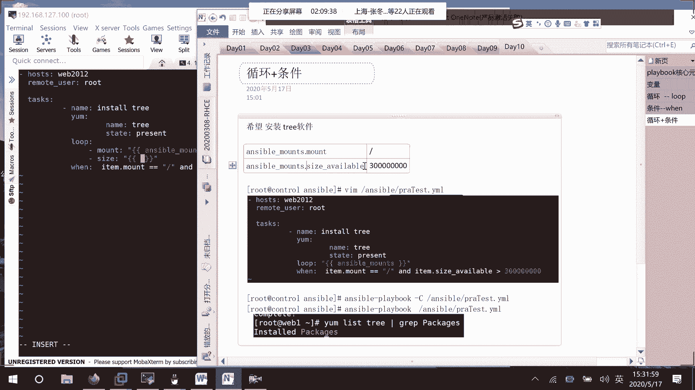
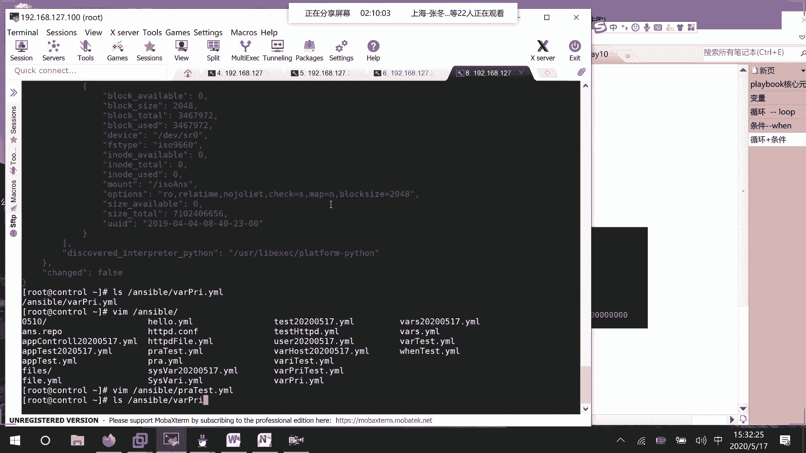
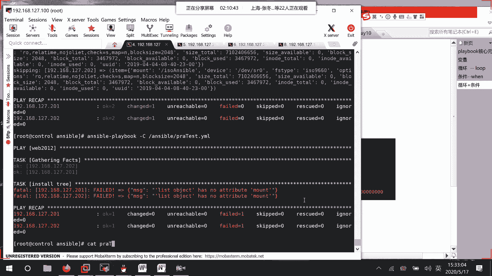
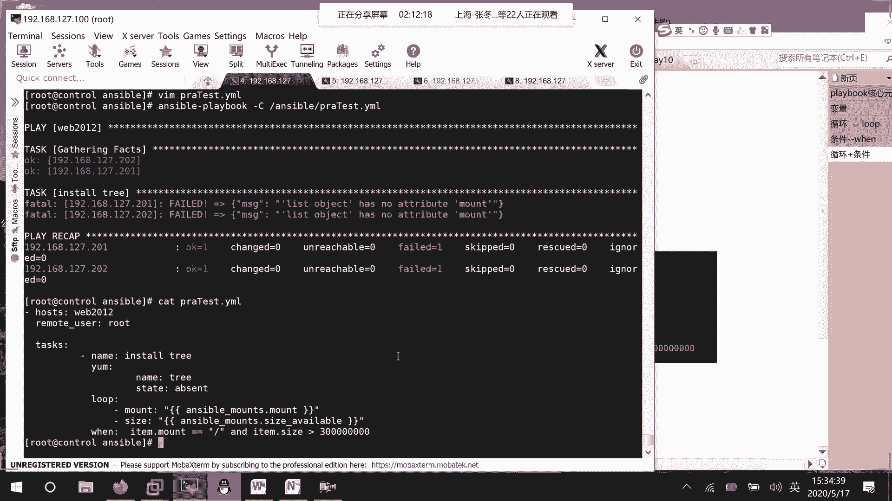
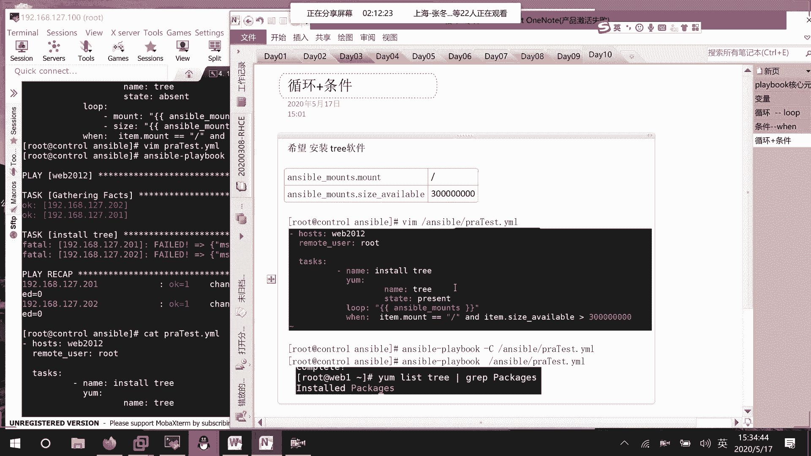
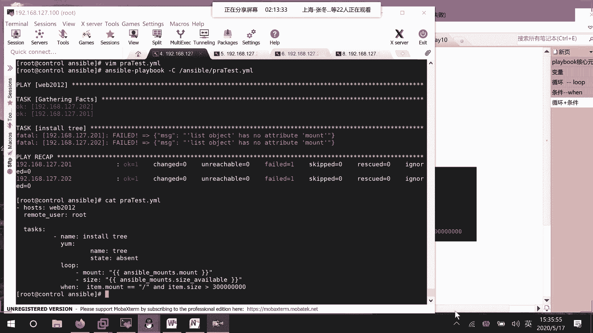

# RHCE8.0视频教程：P44：Ansible变量与循环实践调试

在本节课中，我们将学习如何调试一个使用Ansible变量和循环的Playbook。我们将分析一段在定义变量和循环取值时遇到问题的代码，并理解其背后的逻辑与可能的解决方案。



上一节我们介绍了Ansible变量的基本概念，本节中我们来看看在实际Playbook编写中，如何正确地定义和使用变量，特别是在循环结构中。

## 问题分析与代码修改



我们有一个名为 `practice test` 的Playbook，其目标是处理与挂载点相关的变量。初始代码在定义变量和循环取值时遇到了错误。



首先，我们尝试在Playbook中定义变量。以下是修改过程中的关键步骤：



以下是定义变量的YAML结构示例：
```yaml
- name: 定义挂载点变量
  set_fact:
    mount_info: "{{ item.mount }}"
    available_size: "{{ item.size }}"
```



接着，我们尝试在判断条件中使用这些变量。代码意图是检查 `item.mount` 的 `available size`。



以下是条件判断的代码片段：
```yaml
when: item.mount.available_size | int > some_threshold
```

## 调试过程与错误识别



执行Playbook后，系统报错提示 `message no attribute mount`。这表明在获取变量属性时出现了问题。

经过检查，发现问题可能出在变量引用的方式上。最初的代码尝试直接引用 `item.mount`，但结构可能并非预期。

我们尝试调整变量获取的位置。考虑将变量定义移到循环外部，或者重新审视循环本身的结构。错误信息 `list has no attribute` 进一步提示我们，可能是在对列表（list）类型的变量错误地使用了属性访问。

## 解决方案探讨



核心问题在于理解 `item` 在循环中的结构。`with_items` 或 `loop` 提供的每个 `item` 应该是一个字典，我们需要通过正确的键来访问值。



正确的变量引用方式应类似于：
```yaml
- debug:
    msg: "挂载点是 {{ item.mount }}， 可用大小是 {{ item.size }}"
  loop: "{{ mount_list }}"
```

如果 `mount_list` 的结构是 `[{'mount': '/', 'size': '50G'}, ...]`，那么 `item.mount` 和 `item.size` 就能正确取值。

如果变量定义复杂，可能需要使用 `set_fact` 配合 `loop` 来逐项处理，并确保在后续任务中能访问到这些事实（facts）。

## 课程总结



本节课中我们一起学习了Ansible Playbook中变量与循环的调试方法。我们分析了因变量引用路径错误导致的 `no attribute` 问题，并探讨了通过确保 `item` 数据结构清晰、使用正确的字典键来访问值的基本解决思路。对于复杂循环逻辑，建议将任务分解，并充分利用 `debug` 模块来输出中间变量值，这是定位问题最有效的手段。