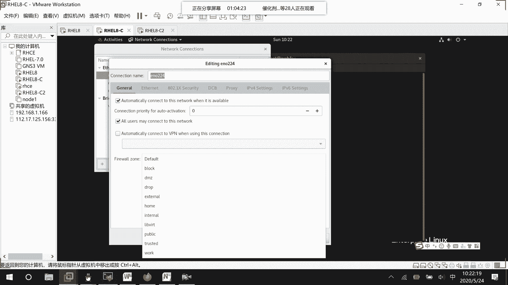
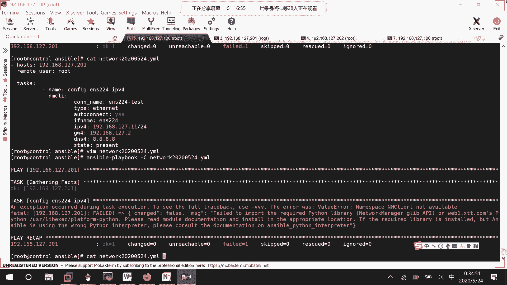

# Ansible网络管理：P47：网络连接配置模块详解


在本节课中，我们将学习如何使用Ansible的`network connections`模块来管理受控主机的网络连接。我们将了解该模块的核心参数，并通过一个实例演示如何配置IP地址、网关和DNS。


## 概述


上一节我们介绍了几个简单易用的Ansible模块。本节中，我们来看看工作与考试中都非常重要的网络管理模块。即使主机已被Ansible控制，我们仍可能需要为其配置新的网络接口或调整现有网络设置。Ansible提供了专门的模块来完成这些任务。


## 模块简介与核心参数

Ansible的`network connections`模块（或其替代模块`nmcli`）用于配置网络连接。其核心参数如下：

以下是该模块的主要配置选项：


*   **`name`**: 指定网络连接的名称。例如：`ens224_test`。
*   **`state`**: 定义连接的状态。可选值为`present`（启动）或`absent`（关闭）。
*   **`persistent_state`**: 定义是否为持久连接（即开机自动启动）。可选值为`present`（是）或`absent`（否）。
*   **`type`**: 指定连接的类型。常用类型包括`ethernet`（以太网）、`team`（链路聚合组）和`bond`（绑定）。
*   **`autoconnect`**: 指定连接是否永久有效。值为`yes`或`no`。
*   **`mac`**: 指定将此连接应用于哪个物理网卡的MAC地址。可以通过`facts`变量动态获取。
*   **`interface_name`**: 指定将此连接应用于哪个网卡接口（如`ens224`）。这是另一种标识目标网卡的方式。
*   **`zone`**: 定义此网络连接所属的防火墙区域（如`public`、`internal`）。可以在配置网络时直接指定。
*   **`ipv4`**: 配置IPv4地址信息，包括地址、子网掩码、网关等。
*   **`dns4`**: 配置IPv4的DNS服务器地址。


## 实践：编写Playbook配置网络


了解了核心参数后，我们来动手编写一个Playbook，为指定主机配置一个以太网连接。




我们将创建一个名为`network_20200524.yml`的Playbook文件，内容如下：


```yaml
---
- hosts: 192.168.127.201
  remote_user: root
  tasks:
    - name: Configure ens224 IP info
      network connections:
        name: ens224_test
        type: ethernet
        autoconnect: yes
        interface_name: ens224
        ipv4:
          - 192.168.127.11/24
        gateway4: 192.168.127.2
        dns4:
          - 8.8.8.8
        state: present
```

**代码解释**:
*   `hosts: 192.168.127.201`: 指定操作的目标主机。
*   `name: ens224_test`: 定义新连接的名称。
*   `type: ethernet`: 指定连接类型为以太网。
*   `interface_name: ens224`: 将此配置应用到`ens224`网卡。
*   `ipv4: - 192.168.127.11/24`: 配置IP地址为`192.168.127.11`，子网掩码为`24`位。
*   `gateway4: 192.168.127.2`: 配置默认网关。
*   `dns4: - 8.8.8.8`: 配置DNS服务器。
*   `state: present`: 确保连接处于启动状态。

## 运行与验证

编写完成后，我们可以使用`--check`模式进行预演，确保语法和逻辑正确：

```bash
ansible-playbook --check network_20200524.yml
```

预演无误后，即可正式运行Playbook来应用配置：

```bash
ansible-playbook network_20200524.yml
```

## 总结



本节课中我们一起学习了Ansible网络配置的核心模块。我们首先了解了`network connections`模块的各项关键参数及其含义，然后通过一个完整的示例，演示了如何编写Playbook来为受控主机配置静态IP地址、网关和DNS。掌握这个模块，你就能通过Ansible批量、自动化地管理服务器的网络设置，极大提升运维效率。