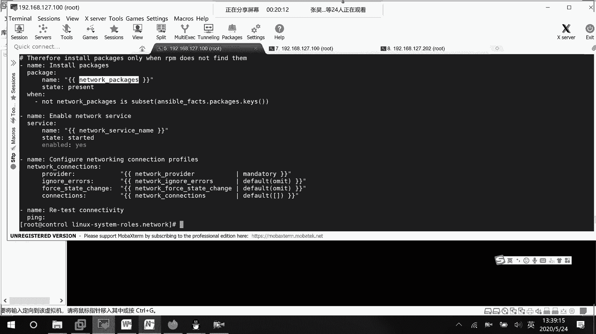
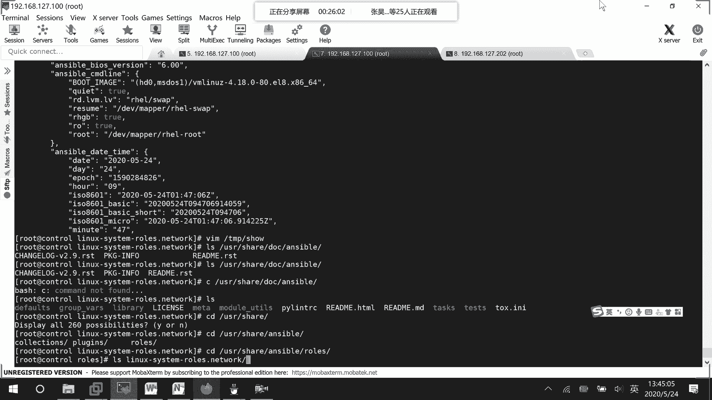

# Ansible 网络角色配置教程：P49：使用角色配置网络连接

在本节课中，我们将学习如何使用 Ansible 角色来配置网络连接。我们将分析一个现成的网络角色，理解其结构和工作原理，并尝试应用它来配置目标主机的网络接口。

上一节我们介绍了编写独立的 Playbook 来管理网络，本节中我们来看看如何使用更结构化、可复用的角色（Role）来完成同样的任务。

## 角色结构分析

我们之前安装过一个名为 `linux-system-roles.network` 的 Ansible 角色。现在，我们进入该角色的目录，查看其结构。

首先，查看 `README.md` 文件以了解角色的基本功能。

以下是该网络角色的主要功能描述：
*   该角色用于配置网络接口，支持以太网口和无线网口。
*   角色简介说明了其基本用途。
*   变量部分定义了需要用户提供的配置信息，核心是 **`network_provider`**（网络提供者，如 `nmcli`）和 **`network_connections`**（网络连接信息列表）。

## 连接变量详解

要配置一个网络连接，需要在变量中定义其属性。

以下是配置网络连接所需的关键变量及其说明：
*   **`name`**：连接名称，必需项。
*   **`state`**：连接状态，如 `up`（开启）或 `down`（关闭）。这相当于执行 `nmcli connection up/down [name]` 命令。
*   **`persistent_state`**：持久化状态。
*   **`type`**：连接类型。
*   **`zone`**：防火墙区域。
*   IPv4 信息配置方式：在变量中指定 `ipv4` 相关的地址、网关和 DNS。



## 配置示例与任务文件

在 `README` 中，给出了一个配置示例。

以下是一个 YAML 格式的变量配置示例：
```yaml
network_connections:
  - name: "eth0"
    type: "ethernet"
    autoconnect: yes
    mac: "{{ ansible_default_ipv4.macaddress }}"
    ip:
      dhcp4: yes
```
此外，还支持桥接、VLAN 等复杂配置，以及手动设置 IP 地址、网关和 DNS。

接下来，我们查看角色的主任务文件 `tasks/main.yml` 以了解其执行流程。

以下是主任务文件中的关键步骤：
1.  检查阶段。
2.  安装必要的软件包（`network_packages`）。
3.  打印信息。
4.  安装网络包（仅在所需包不是已安装包的子集时执行）。
5.  启动网络服务。
6.  配置连接（核心步骤，使用变量 `provider` 和 `connections`）。
7.  进行连接测试。

## 定义主机变量并调用角色

角色的默认变量通常已定义在 `defaults/main.yml` 中。为了定制化配置，我们需要为特定主机或主机组定义变量。

例如，我们为 `web02` 主机创建一个主机变量文件 `host_vars/web02/network.yml`。

在该文件中，我们定义如下内容：
```yaml
network_connections:
  - name: eth0
    type: ethernet
    ipv4:
      address: 192.168.1.177/24
```
变量定义好后，我们需要编写一个 Playbook 来调用这个角色。

创建一个名为 `network_role.yml` 的 Playbook：
```yaml
- hosts: web02
  remote_user: root
  roles:
    - linux-system-roles.network
```
这个 Playbook 非常简单，它指定在 `web02` 主机上，以 `root` 用户身份执行 `linux-system-roles.network` 角色。

## 执行与验证

最后，我们执行这个 Playbook。
```bash
ansible-playbook network_role.yml
```
执行后，Playbook 会按照角色中定义的任务流程运行：检查环境、安装包、启动服务、配置连接。我们可以使用 `nmcli connection show` 命令来验证名为 `eth0` 的连接是否已按我们的变量配置（IP 地址 `192.168.1.177/24`）成功创建并启用。




本节课中我们一起学习了如何使用 Ansible 的 `linux-system-roles.network` 角色来配置网络。我们分析了角色的文档和任务结构，学习了如何通过定义主机变量来定制网络连接参数，并最终通过一个简洁的 Playbook 调用角色完成了配置。使用角色可以将复杂的配置任务模块化和标准化，大大提高自动化脚本的可维护性和复用性。