# RHCE8.0视频教程：P50：课程内容回顾与总结 📚

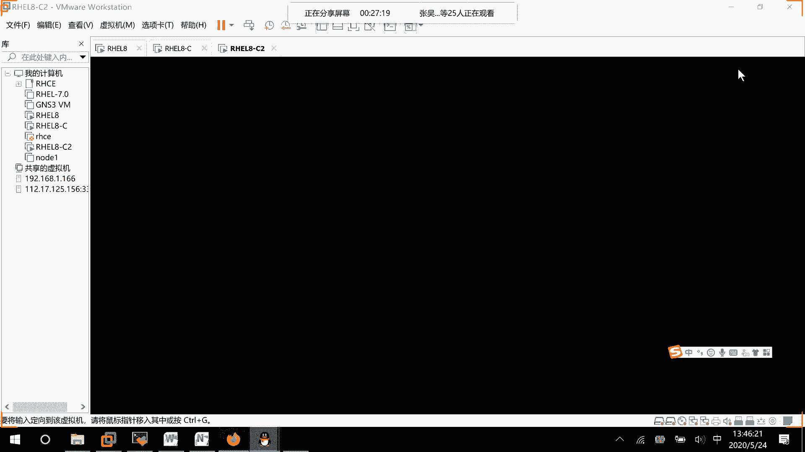

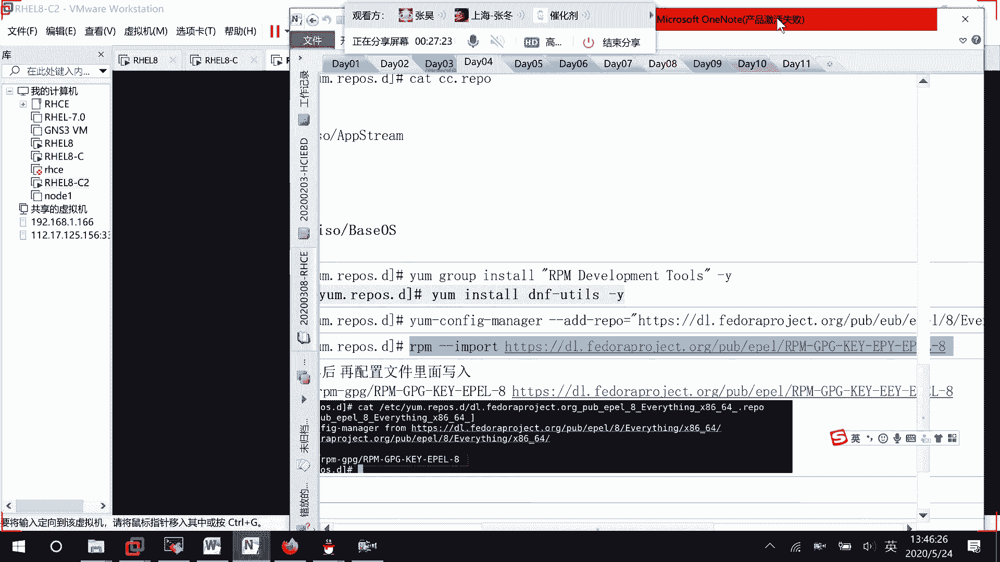

在本节课中，我们将对之前学习的Ansible核心知识进行系统性的回顾与总结，帮助初学者巩固所学内容，并补充一些高级的错误处理技巧。

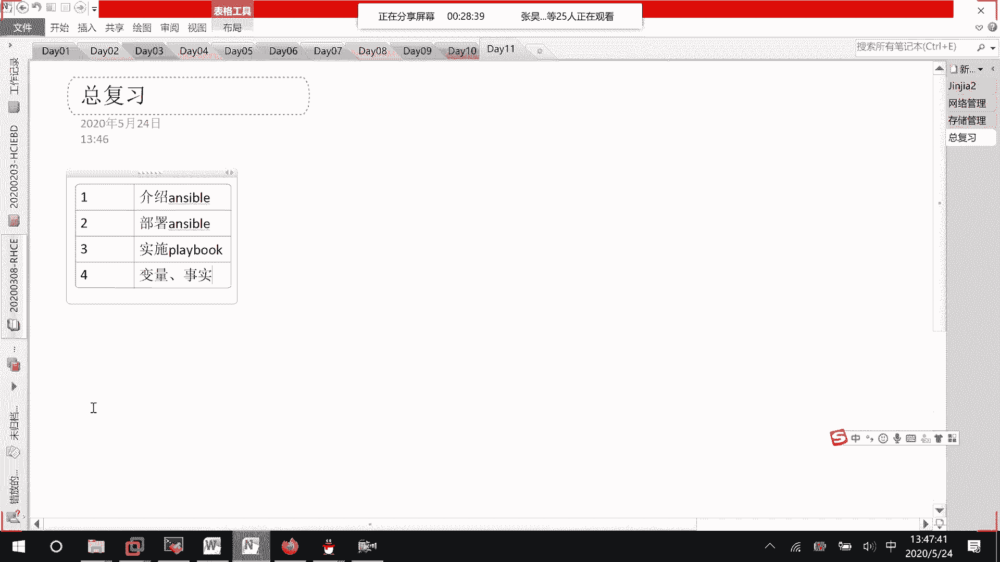

## 概述

本课程主要围绕Ansible自动化运维工具展开。我们首先介绍了Ansible的基本概念，然后逐步学习了其部署、模块使用、变量管理、任务控制、文件操作、角色管理以及故障排查等核心技能。本节将串联这些知识点，并补充`block`、`rescue`和`always`等高级错误处理机制。

## 课程内容回顾

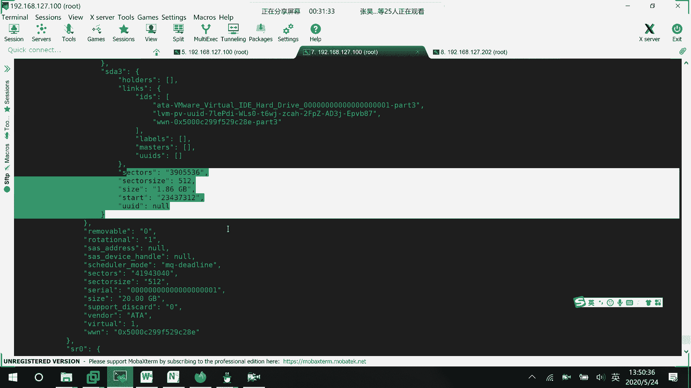

上一节我们介绍了Ansible的基础模块，本节中我们来看看整个课程的知识脉络。

### 第一章：Ansible介绍
首先，我们介绍了Ansible，目的是让大家理解什么是Ansible及其基本工作原理。

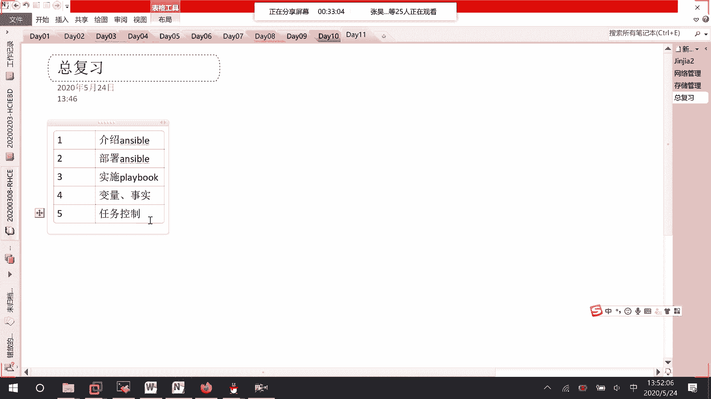

### 第二章：Ansible部署
接着，我们学习了如何部署Ansible，这实质上是学习如何控制节点（即受控主机）。

### 第三章：模块基础与Playbook编写
然后，我们学习了基础模块的信息。掌握单个模块的使用是编写Playbook的前提。在学会各个模块后，我们开始实施Playbook的编写。

### 第四章：变量使用
之后，我们学习了如何使用变量，包括自定义变量和系统变量（即“事实”）。

系统事实可以通过命令 `ansible -m setup` 收集。这些信息是从远端主机获取的，包含了系统的各种状态数据。例如，磁盘信息可以通过变量如 `ansible_devices` 来获取。如果你想根据磁盘剩余空间（例如只剩5GB）来动态划分分区（例如划分50%），就需要先通过这些事实变量获取磁盘信息，然后进行计算。

### 第五章：任务控制
下面我们要介绍任务控制的相关内容。以下是任务控制的关键点：
*   **循环与判断**：用于处理需要重复执行或条件执行的任务。
*   **错误处理**：除了之前提到的 `ignore_errors` 忽略错误外，还有更结构化的处理方式。

我们通过一个示例来学习高级错误处理。假设我们有一个任务块用于安装数据库，但可能因为YUM源未挂载而失败。我们可以使用 `block`、`rescue` 和 `always` 来优雅地处理。

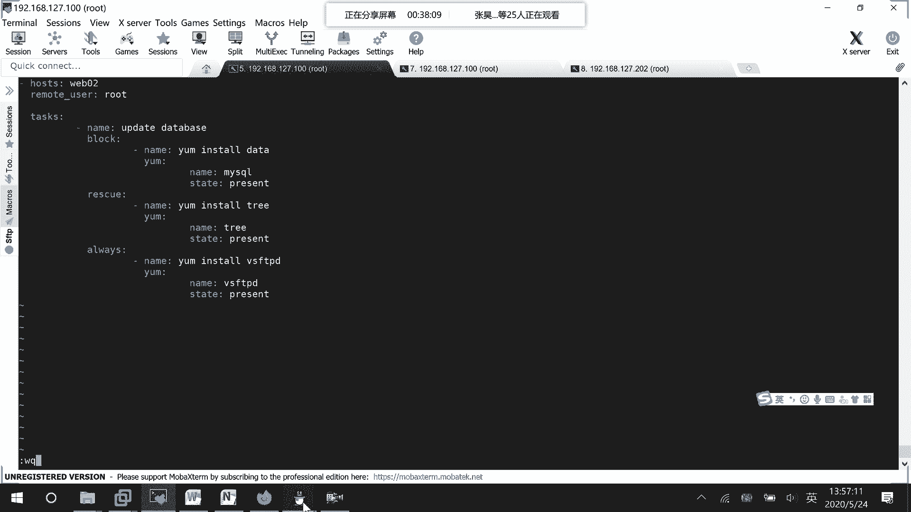

```yaml
- name: 处理数据库安装任务
  block:
    - name: 安装 mysql
      yum:
        name: mysql
        state: present
  rescue:
    - name: 修复YUM源并重试
      yum:
        name: tree
        state: present
      # 实际场景中，这里应是修复YUM源的操作
  always:
    - name: 无论成功失败都安装vsftpd
      yum:
        name: vsftpd
        state: present
```

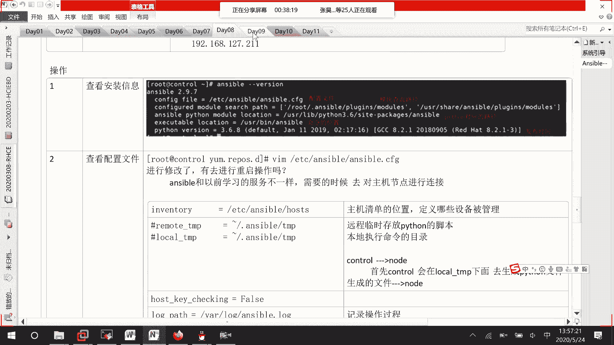

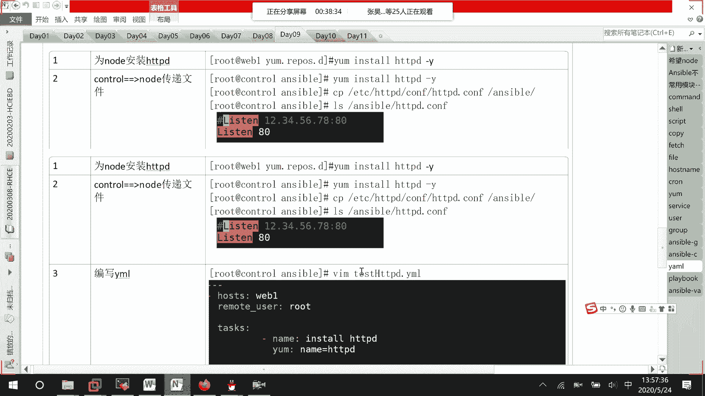

关于错误处理方式的补充说明：
*   `block` 定义了要执行的子任务块。
*   如果 `block` 中的任务执行失败，则会执行 `rescue` 块中的内容进行恢复，否则不执行。
*   `always` 块中的内容，无论 `block` 执行成功与否，都会被执行。

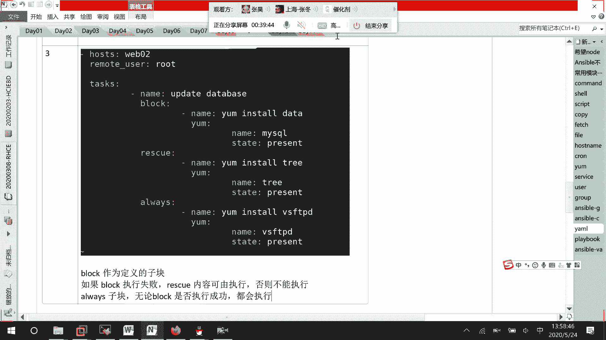

### 第六章：文件与目录管理
此后，我们学习了如何创建和管理文件与目录，使用了如 `file`、`copy` 等模块。

### 第七章：受控主机管理
我们还学习了如何管理受控主机，例如使用通配符（*）和分隔符（:）来定义主机组。

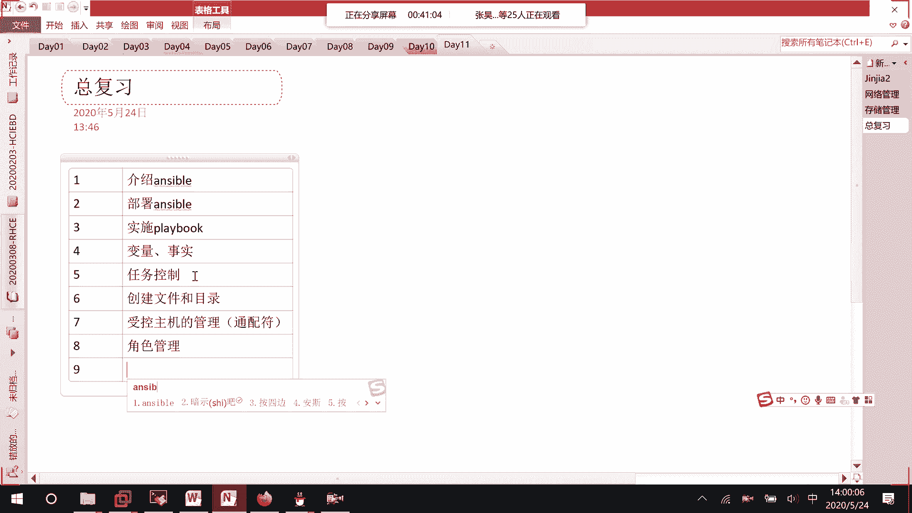

### 第八章：角色管理
接着，我们深入学习了 `roles`，即Ansible的角色管理，用于组织和复用Playbook。

### 第九章：Ansible故障处理
最后，我们学习了Ansible的故障处理方法。例如，使用 `ansible-playbook --syntax-check` 或 `ansible-playbook --list-tasks` 命令来检查Playbook的语法和任务列表。如果出现错误，命令行会提示具体的行号和列号，方便定位问题。

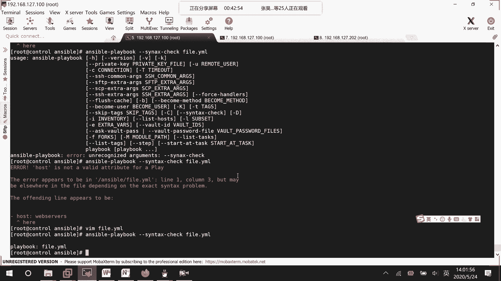

## 模块查询与学习

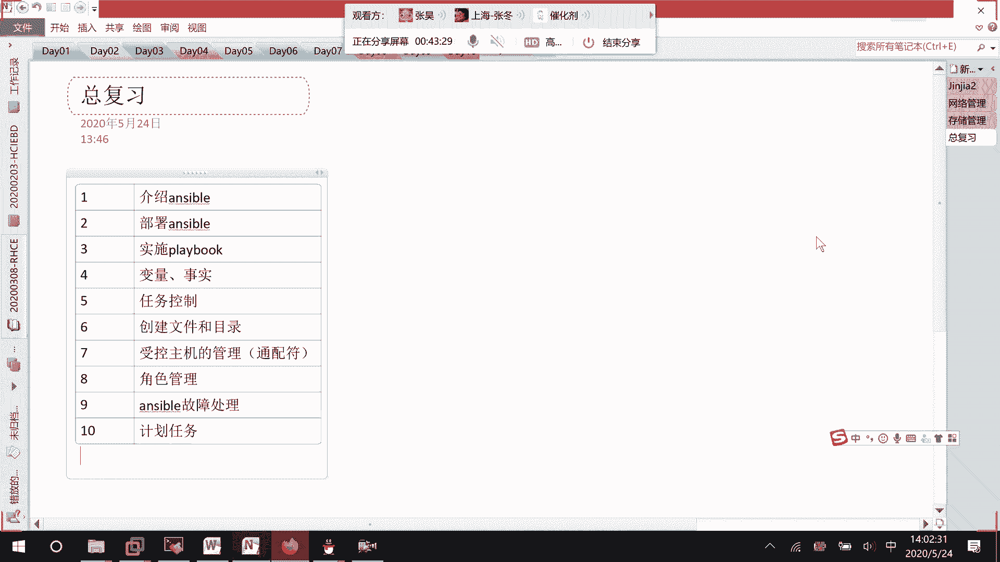

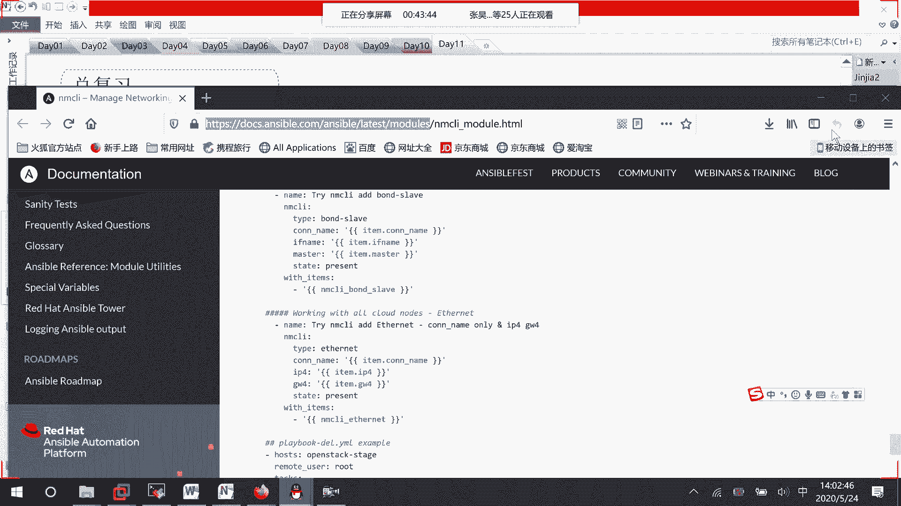

Ansible拥有众多模块，官方文档是学习的最佳途径。你可以通过访问Ansible官方文档站点，查询任何模块的详细参数和用例。例如，搜索 `yum` 模块，文档会详细说明其写法、参数以及提供安装包、移除包、测试仓库等实际案例。大家应该养成查阅官方文档的习惯。

## 总结

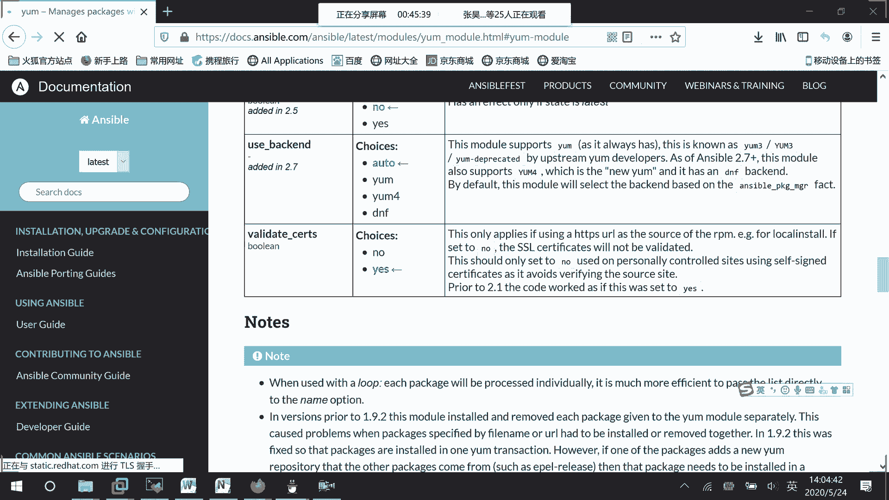

本节课中我们一起学习了RHCE 8.0 Ansible部分的核心知识框架。我们回顾了从Ansible介绍、部署、模块使用、变量、任务控制、文件操作、主机与角色管理到故障排查的全过程，并补充了`block`、`rescue`、`always`这一重要的错误处理结构。掌握这些内容，能够编写基础的Playbook、使用变量、运用角色，并查阅模块文档解决问题，就达到了RHCE考试对Ansible部分的基本要求。