# RHCE8.0视频教程：P7：网络配置与软件包管理基础


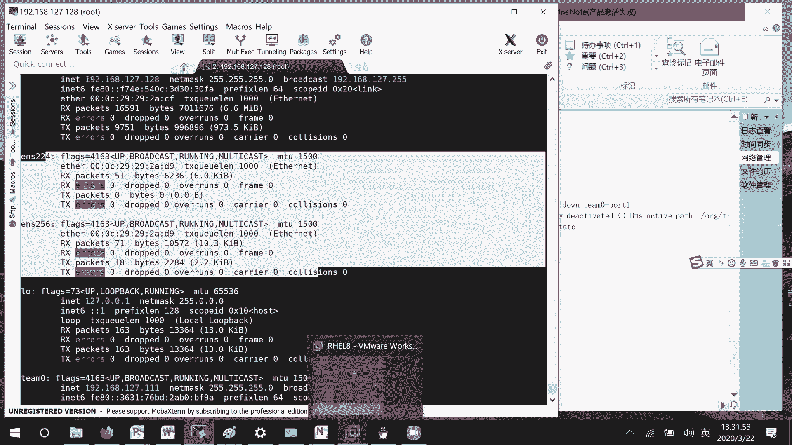

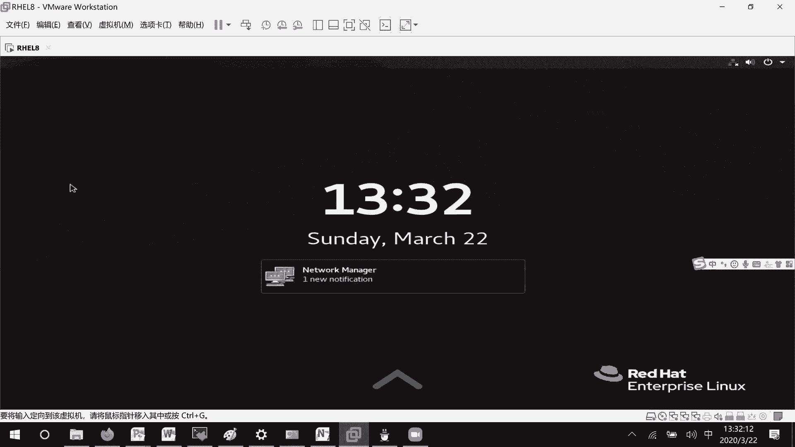

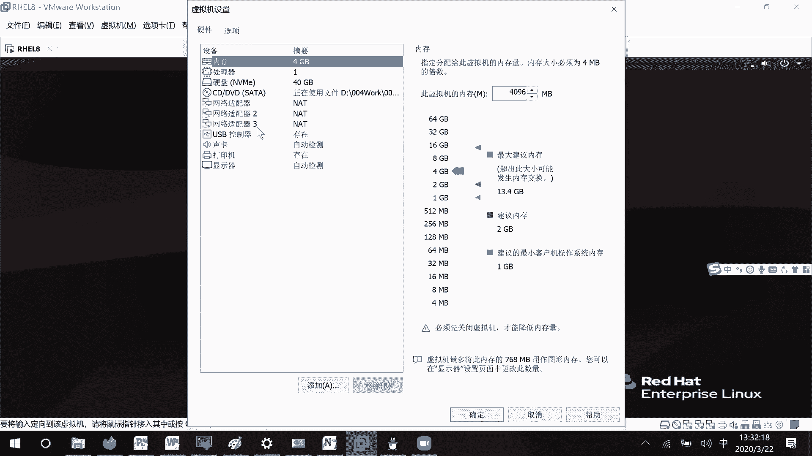

在本节课中，我们将要学习如何通过配置文件管理网络连接，以及Linux系统中软件包管理的基础知识，特别是RPM包管理工具的使用。

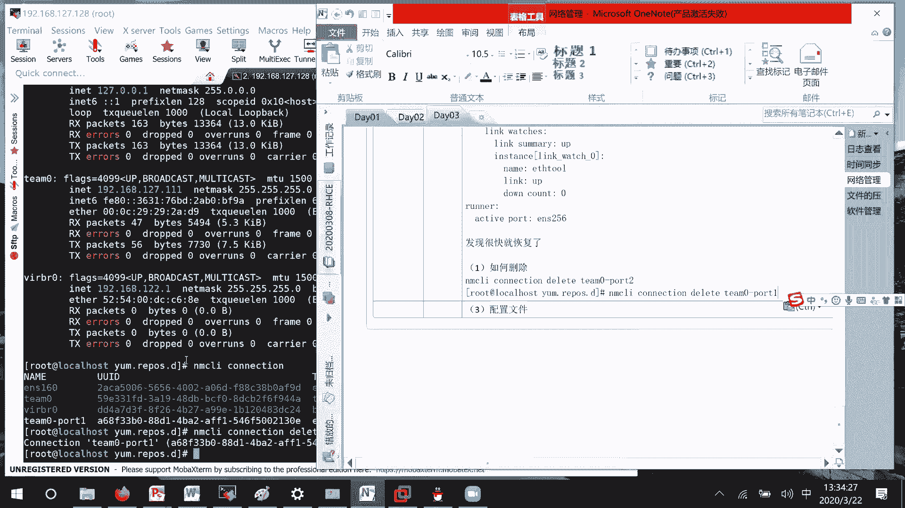

上一节我们介绍了如何通过命令行工具`nmcli`配置网络绑定（team），本节中我们来看看如何通过配置文件来管理网络，并开始学习软件包管理。

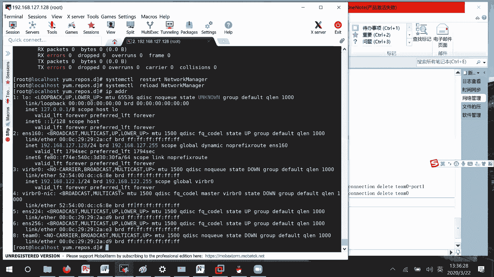

## 网络配置文件管理

在RHEL 8系统中，网络配置文件位于`/etc/sysconfig/network-scripts/`目录下。与RHEL 7相比，这个目录现在只包含实际配置了的网络连接文件，显得更加简洁。

以下是编辑网络配置文件的基本步骤：

首先，进入网络配置目录并创建或编辑对应网卡的配置文件。例如，为`ens224`网卡创建配置文件`ifcfg-ens224`。

```bash
cd /etc/sysconfig/network-scripts/
vim ifcfg-ens224
```

在配置文件中，需要包含以下核心信息：
*   **TYPE**：网络类型，例如`Ethernet`。
*   **BOOTPROTO**：IP地址获取方式，`none`或`static`表示手动配置，`dhcp`表示自动获取。
*   **NAME**：连接名称。
*   **DEVICE**：物理设备名。
*   **ONBOOT**：是否在系统启动时激活此连接，`yes`或`no`。
*   **IPADDR**：IP地址。
*   **PREFIX**：子网掩码（使用前缀表示法，如`24`）。
*   **GATEWAY**：默认网关地址。
*   **DNS1**：DNS服务器地址。

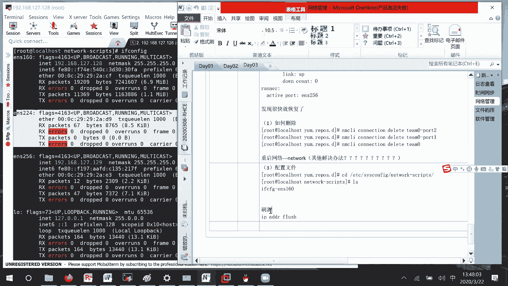

一个配置示例如下：
```
TYPE=Ethernet
BOOTPROTO=none
NAME=myconnection
DEVICE=ens224
ONBOOT=yes
IPADDR=192.168.127.10
PREFIX=24
GATEWAY=192.168.127.2
DNS1=192.168.127.2
```

配置文件修改后，需要让系统重新加载配置才能生效。以下是操作流程：
1.  使用`nmcli connection reload`命令重新加载所有配置文件。
2.  将对应的连接先停止（`down`）再启动（`up`）。
```bash
nmcli connection reload
nmcli connection down myconnection
nmcli connection up myconnection
```
3.  使用`ip addr`命令验证IP地址是否已更新。

> **注意**：在某些情况下，直接使用`reload`和`up/down`可能无法立即生效，可以尝试重启`NetworkManager`服务（`systemctl restart NetworkManager`）或使用传统的`network`服务（如果已安装）来刷新配置。

## 软件包管理基础：RPM

在RHEL系统中，软件包管理主要有两种方式：RPM和YUM。RPM（Red Hat Package Manager）是一种基础的软件包管理工具，它直接操作下载到本地的`.rpm`软件包文件，类似于在Windows中双击`.exe`文件进行安装。

### RPM包结构

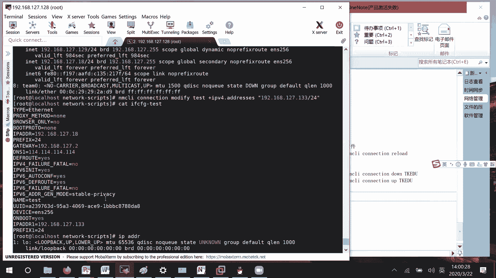

一个典型的RPM包名称包含以下信息：
*   **软件包名**：如`vsftpd`。
*   **版本号**：如`3.3.3`。
*   **发行版本号**：如`el8`，表示适用于RHEL 8。
*   **系统架构**：如`x86_64`。

例如：`vsftpd-3.3.3-4.el8.x86_64.rpm`

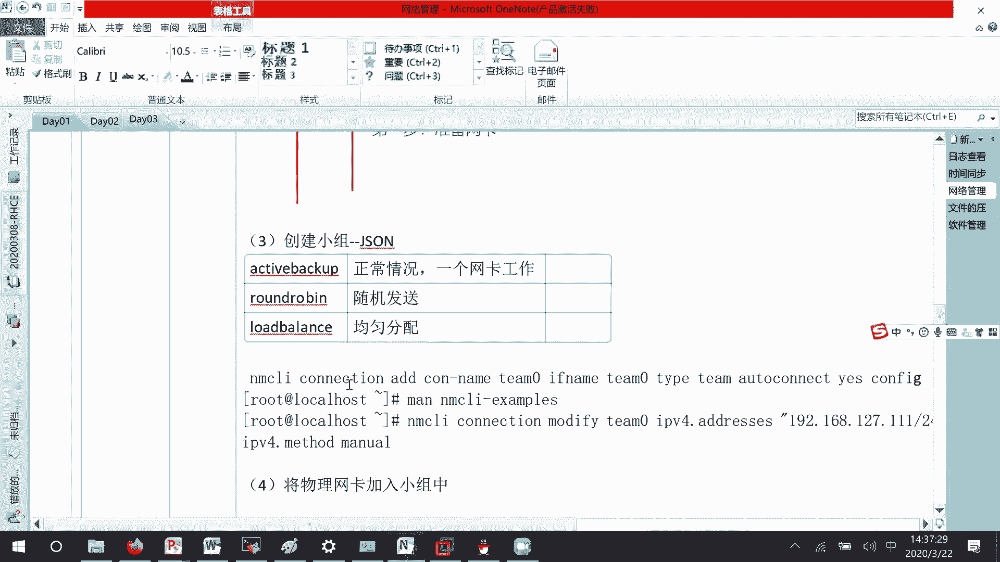

### RPM基本命令

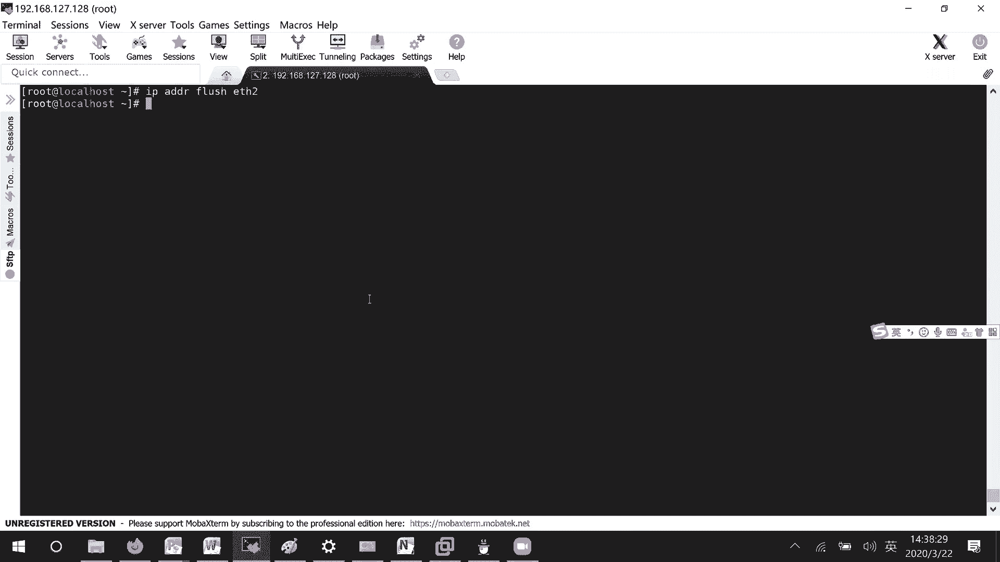

以下是使用RPM管理软件包的核心命令：

**查询已安装的软件包**
使用`-q`选项进行查询。
*   查询系统所有已安装的包：`rpm -qa`
*   查询指定软件包是否安装：`rpm -q 软件包名` （需要精确匹配包名）

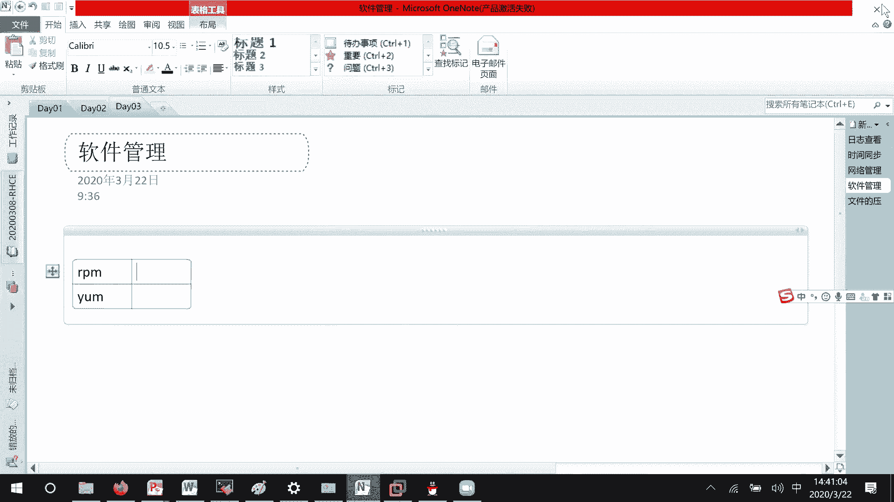

**安装软件包**
使用`-i`（install）选项进行安装。通常配合`-v`（显示详细信息）和`-h`（显示进度条）使用。
```bash
rpm -ivh 软件包全名.rpm
```

**升级软件包**
使用`-U`（upgrade）选项进行升级。如果软件包未安装，则会执行安装操作。
```bash
rpm -Uvh 软件包全名.rpm
```

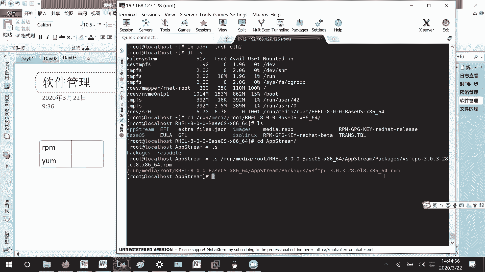

**卸载软件包**
使用`-e`（erase）选项进行卸载。
```bash
rpm -e 软件包名
```

> **提示**：RPM软件包可以从系统安装光盘获取。在RHEL 8中，软件包分为`BaseOS`（系统基础包）和`AppStream`（应用软件包）两个仓库，位于挂载光盘的对应目录下。

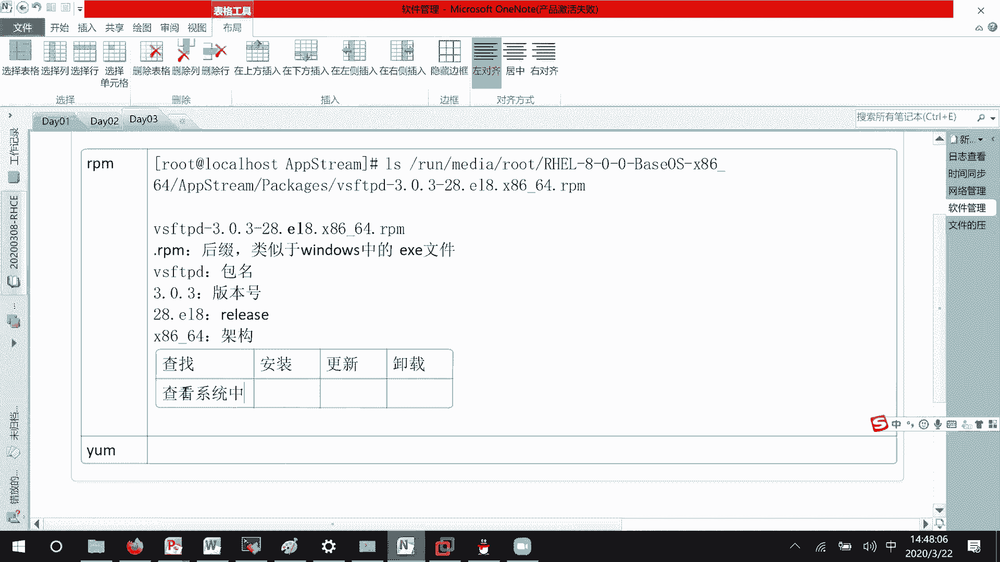

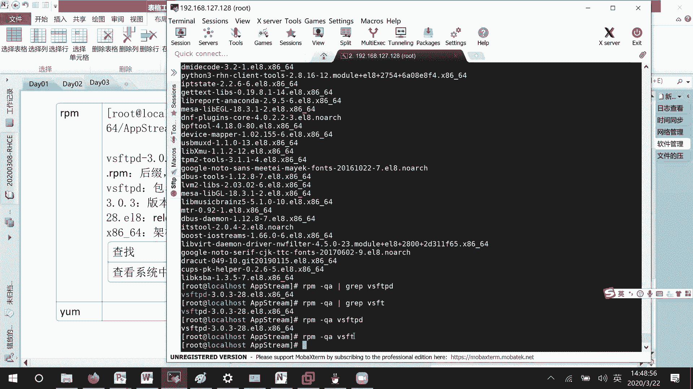

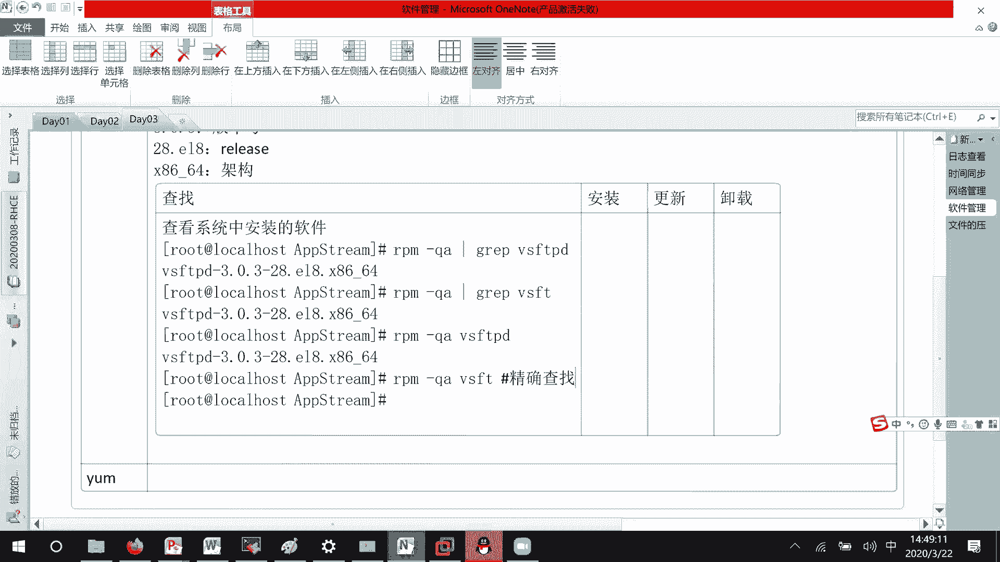

本节课中我们一起学习了如何通过配置文件管理网络连接，并介绍了Linux下使用RPM工具进行软件包管理的基础操作，包括查询、安装、升级和卸载软件包。理解这些基础知识是进行系统管理和维护的重要一步。