# RHCE8.0视频教程【45课时】 - P10：20200329-RHCE-02_recv - 六竹书生6682 - BV1su4y1Z7sJ

我这边的话呢嗯跟你们去说一下，刚才用这个叫做防火墙已经关了哦，firework防火墙有，但是ip tables的话呢，把它都给关了吗，嗯我看一下，192168127。135诶，诶等一下。

3921181270235，稍等一下，他现在这边也打不开，v s v s f t p的话呢，重启了，等一下，他这边不能建立连接，但是我这边嗯tnt好像没有安装，192168127。135。

叫做呃21号端口，这边可以进去啊，哎220，但是好歹是打开了呀，诶现在可以了，可能是ip tables，他没有生效了哈。

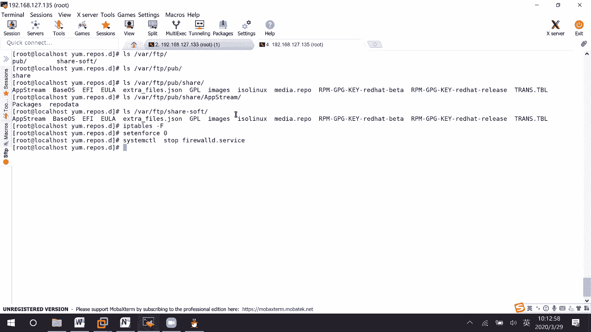

我再来试一下，现在发送了他这个好像还真的得那个叫做呃，去关闭一下，ym reporter reporter list，我看一下配线可以了，嗯嗯默认情况下就是说没有去进行一个验证吗。

没有秘密用户直接去进行一个同步cc，这样子啊，他这个的话呢，我用另一个叫做http给你们做一下好吧。

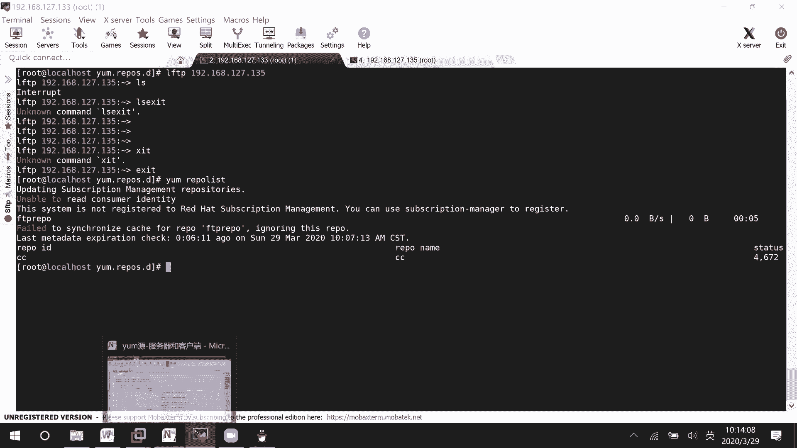

ftp叫做ftp的话呢，再看一下，因为我之前在备课的时候，他在做的时候是正常的，这边的话呢就是说我们等一下嗯，就不用这个f f t p去共享了，用另一个去共享嘛，好吧，这里第二种选择的话呢。

比如说是一个http，我们到时候的话呢也是一样的，就是安装完了之后的话呢，去进行一个挂载就行了，就服务器端，另外，嗯我看一下啊，嗯ym in store not provide，诶呀诶稍等一下。

l s cat aa，这没有问题啊，嗯跳到六ym 08，他这个的话估计我两个的话呢都要驱动起来，我的天呐，要么group list，要么group你知道叫做，serve workstation。

不是这个handers network service，ipm security在这边没有找到，我看一下，我把这个蓝印生那个我去看一下，v i m e t c v s p p vs t p d点。

cofig，enormous eneral years，等一下嗯嗯稍等一下。

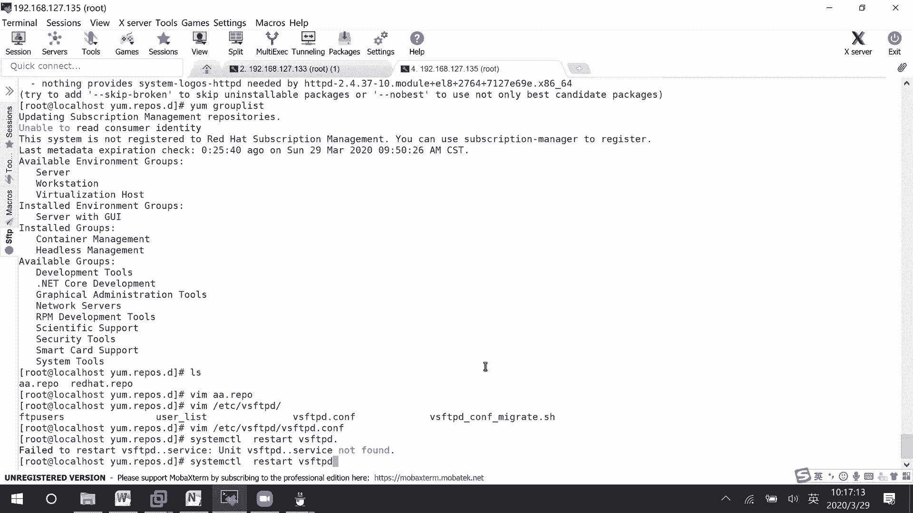

还是这个呀，你看这个叫做它的一个还是出现这个问题。

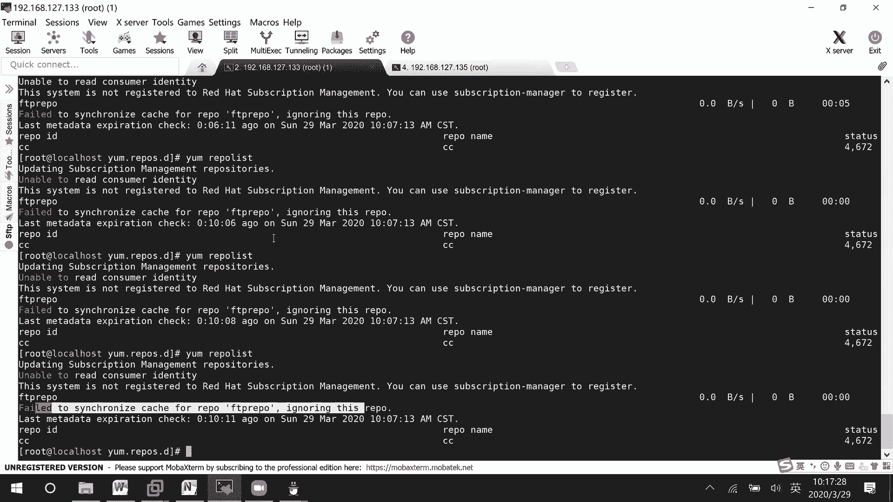

我知道刚才的话呢是为什么了，第一个的话呢像嗯我这边叫做，那那我这个http就不跟你们去讲了哈，呃叫做删除函，这里的话呢配置的时候，第一个这里叫做make dir software。

这些的话呢没有什么样的一个问题，问题的话呢就是蓝印顺说的就是匿名用户，要启用这边的话呢，他这边就是说默认没有去把它给开启起来哈，叫做cat etc，vs f t t vs f t p b config。

这边的话呢我去grape一下，叫做adamm，我看一下eno n，y m o s诶，怎么这么多e n a b l e，这里的话呢主要是蓝燕顺说的这个东西，我刚才的话呢忘记没有把它给开起来。

就是这个匿名用户默认的话呢把它给启用起来，然后的话呢去把一个叫做防火墙啊，还有一个的话呢叫做sa linux啊，你把他给叫做进行一个嗯关闭就可以了，这个时候的话呢，我们在客户端这边去进行一个访问的话。

就没有问题了，就没有问题了，这个的话呢给你们时间稍微去试一下好吧，我刚才在这里的话呢出了点小问题啊，好吧，这里你们去试一下哈。

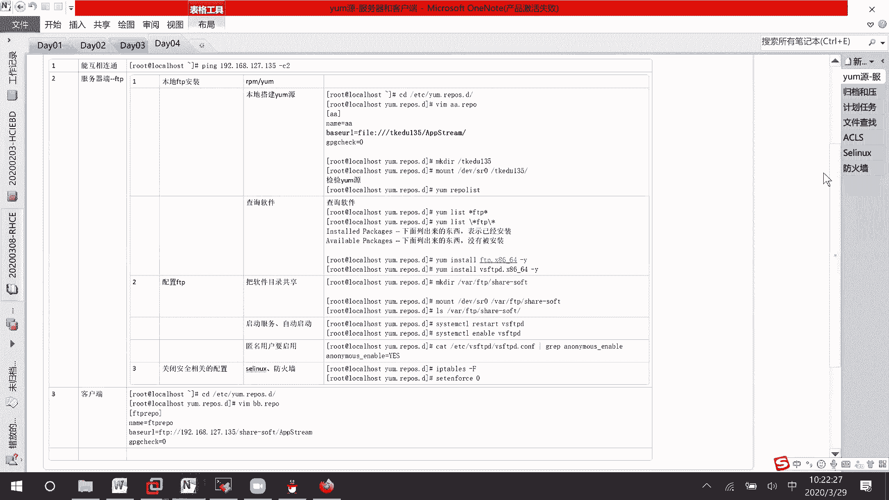

下面这边的话呢我们来看一下，如果说给你们就是说考试的时候，他会给你一个站点的地址，然后的话呢让你们去用这个站点的地址呢，进行后续的一些考试实验嘛，那这边的话呢有几种方法，你可以去利用这个站点的地址呢。

第一种方法就是像我们v i m在，在这个叫做i p o。d下面的话呢，去v i m一个文件嘛，然后还有一种方法的话呢，就是可能我使用那个叫做ym configure manager的，这种方式的话呢。

直接去进行一个管理，在以前的话呢，我们可以直接这样子的叫做亚姆configure，然后呢manager，然后后面的话呢你去跟上ip地址就可以了，但是现在的话呢这个命令已经没了。

需要我们自己先去安装一下好吧。

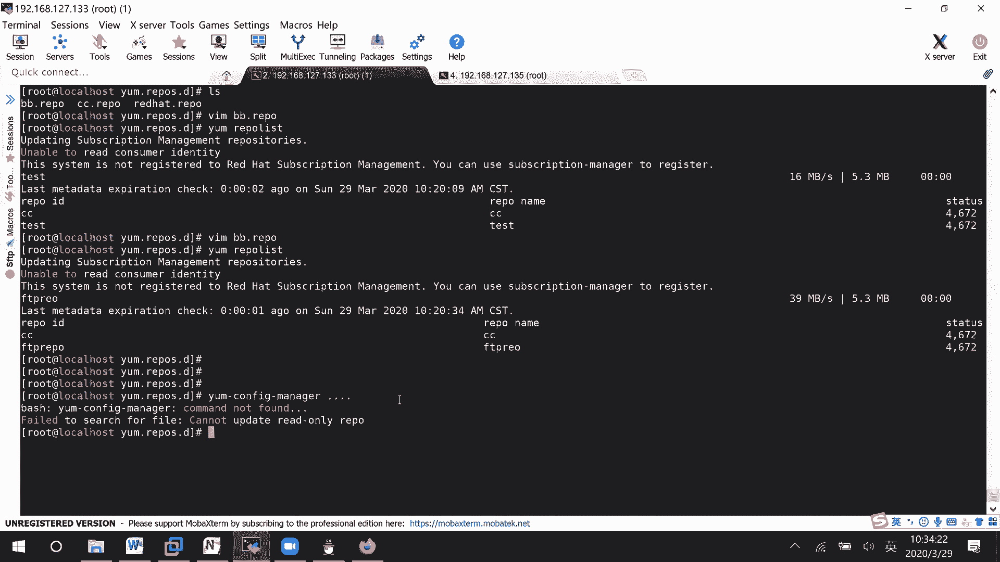

这边下面这里也就是说如何安装啊，就是说给你一个，如何去配置样元，一种方式就是我们上面的vim，像像这样子的一种形式吗，哦这里诶在哪，哦在这像这样子的一个形式去做的，还有一种的话呢。

我们的话就使用yum config manager的一个形式去做，好吧，那首先的话呢，像我这边如果说想要使用这个ym configure manager。

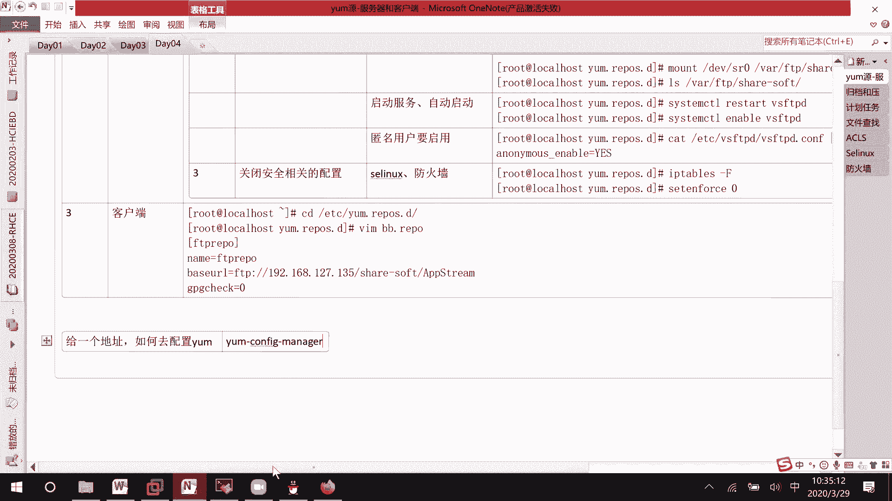

那我自己要先去把这款这款软件给装装起来吗，这边的话呢我这里有一个叫做cc的ipo啊，哈ym list信号，比如说叫做config相关的啊，他这里的话呢嗯network，反正的话呢就是没有。

我这个ym开头的一个文件吗，它在哪里呢，你们用这条命令去看的时候，group list稍等啊，这里的话呢young group list的话呢。

你就可以看到一个叫做r p m develop tools，因为这个group里面查到的和普通list里面查到的，有什么不一样的地方呢，像我们普通的类似，查到的可能都是一些比较小的一些软件。

像这种的话group查到的话呢，它是一些比较大型的软件，然后像这里的话呢，它有一些环境，比如说像桌面啊或者服务器版本的，还有呢你已经安装的呢，因为我们现在可以看到图形化界面吗。

如果有些人按的是图形字符界面，你又想要变到图形化界面了，可以把这个server view vid g u i自己去安装一下，然后呢启动方式自己再去改一下嘛，接下来这边的话呢。

group就说一些组件我已经安装的有这两个，剩下的下面这里是不是还没装啊，那好我现在的话呢就来装一下，这个叫做ipo develops，好吧，他在安装的时候呢就这样子。

group in store就可以了，后面的话呢，因为他们这些嗯字符之间的话呢有空格，所以大家的话呢在外面可以去加一个双引号，然后接下去肯定是要安装的嘛。

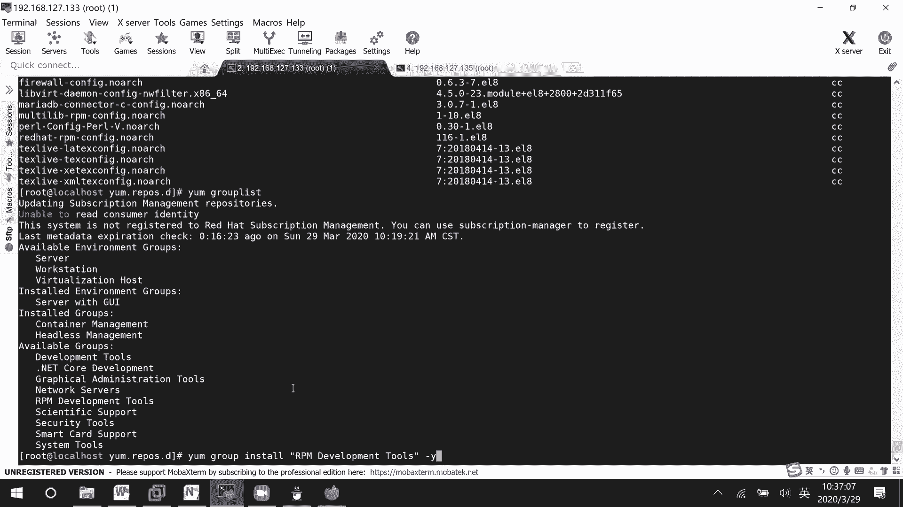

那就是减y就可以了，等一下。

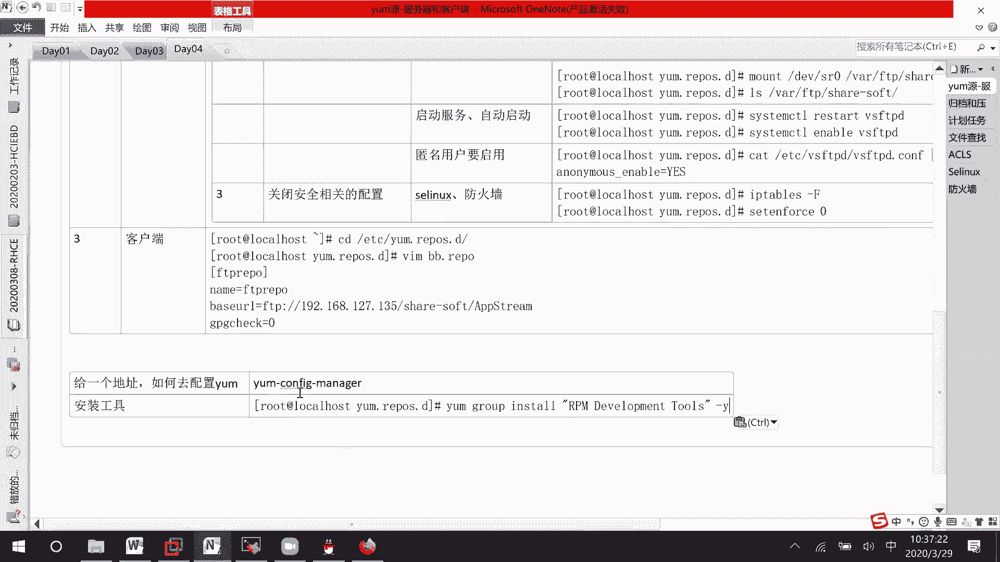

嗯我看一下啊，nothing provide by这个，那这边的话呢应该是，的亚美元的话呢，它有一些信息的话，还没有把它给给进来哈，没有给进来，我把另一个另一个项目员的话呢我也放出来哈。

叫做v i c c i p o，下面这边的话呢我来补一个叫做，e d吧，names等于gg d a s e u r l等于fire s base os，一pg chat等于零就可以了，我确定一下。

看一下是不是叫做base哦，对是base os，我再来装一次，等一下，那这样子的话呢，因为在安装嗯有些软件的时候呢，他可可能需要一些叫做系统的一些软件，去进行解析嘛，所以大家后续在创建亚目源的时候呢。

为了省心一点，可以就是说一次性把这两个条目全都写进去。

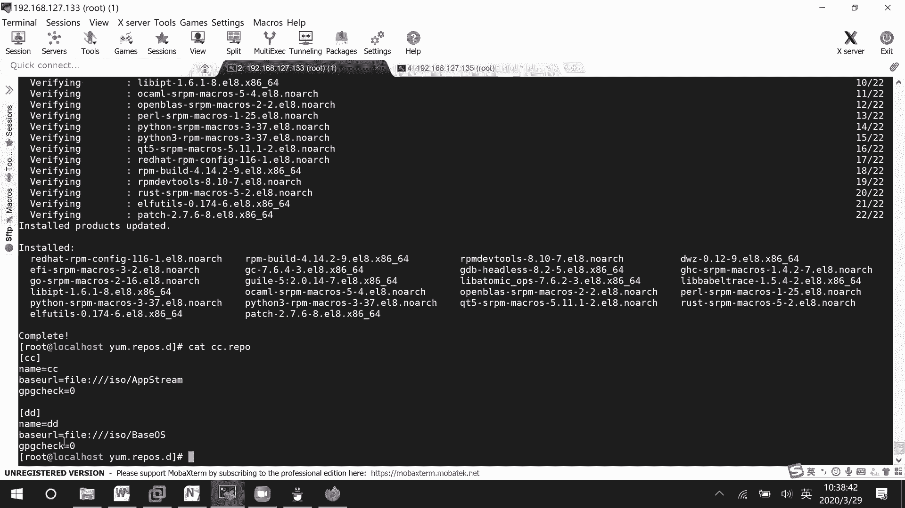

免得就是说有问题的时候呢，哦和我一样再去改嘛，把下面这个去添加一个，这样子的话呢，一张光盘里面的信息它才是完整的，那好我这边已经安装完了之后呢。

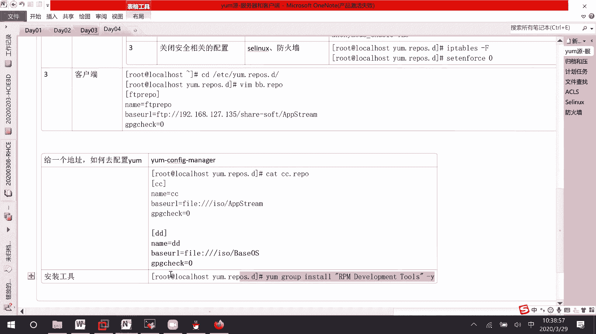

来看一下这个工具能不能去用configure a manager，他这边的话呢还没有去给他跑出来哈，yum config manager，等一下，嗯这边应该是可以直接出来的，让那个水都要。

应该是直接可以的，后面这边的话呢我们再去减减，我仅仅help看一下嗯，没有找到他这条命令，要么config manager，我这边已经装起来了，等一下，今天怎么这么多bug呢。

他这边所有的软件都已经帮我去装了呀，要么group，你说，pos，旁白不对的，这个没有关系，让，这已经装起来了，你等一下我看一下，他这边的话呢直接去安装就可以，你们给五分钟时间，我马上就要这样子啊。

他的话呢这个在安装的时候，这个我感觉不知道为什么，好像这个dnf u tals的话呢没有给我去装起来哈。

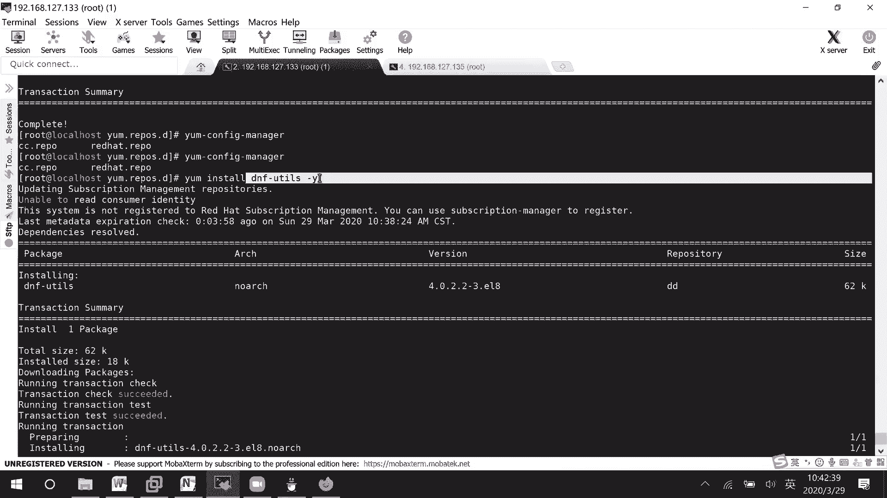

你们这边的话呢再去装一下，这个应该主要的是这个叫做dnf uta，他的话呢没有去装成功，现在的话呢去装成功了之后的话呢。

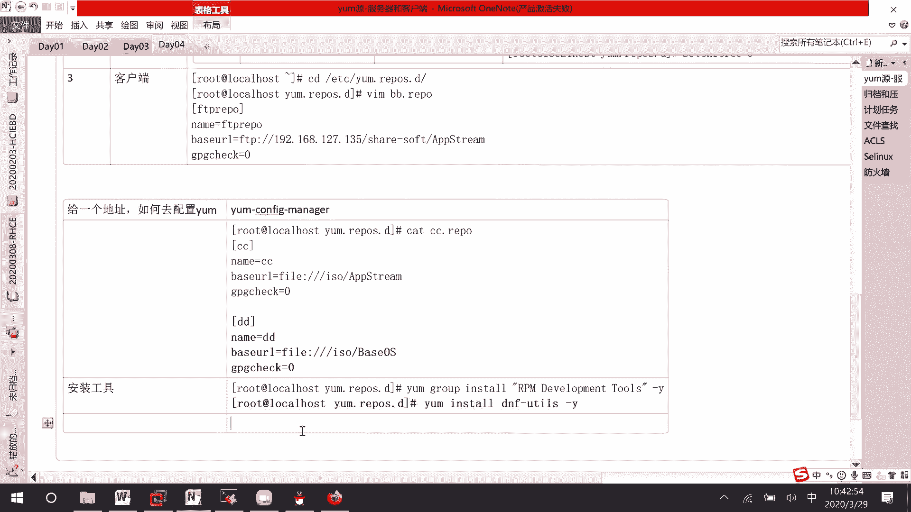

你看比如说我刚才的话呢，不是给了你们啊一个地址嘛，对不对，他在这边的话呢就可以这样子啊，我这边的话呢给了这个。

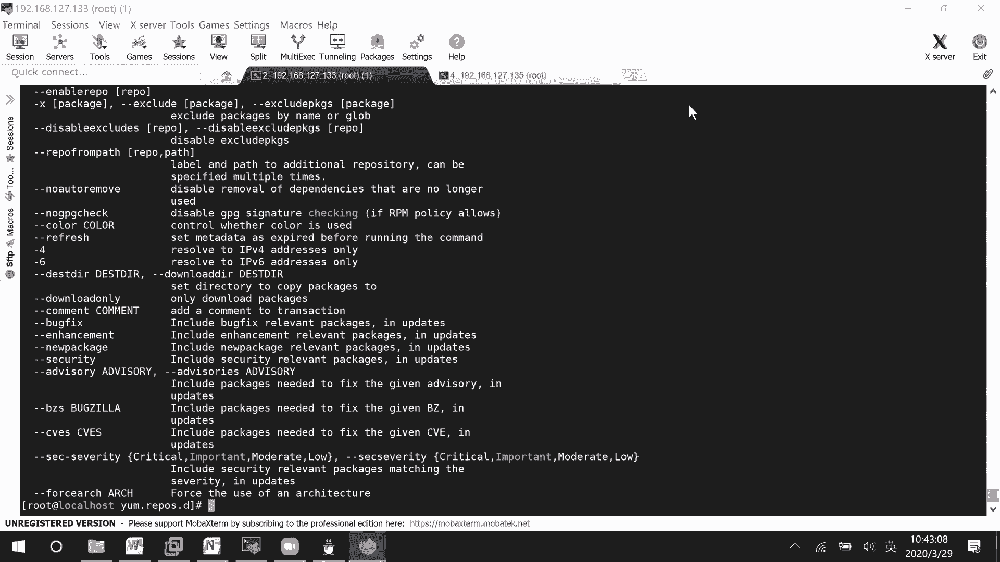

他的话呢有一个叫做啊八嘛，然后这边的话呢你再进去稍等一下再进去。

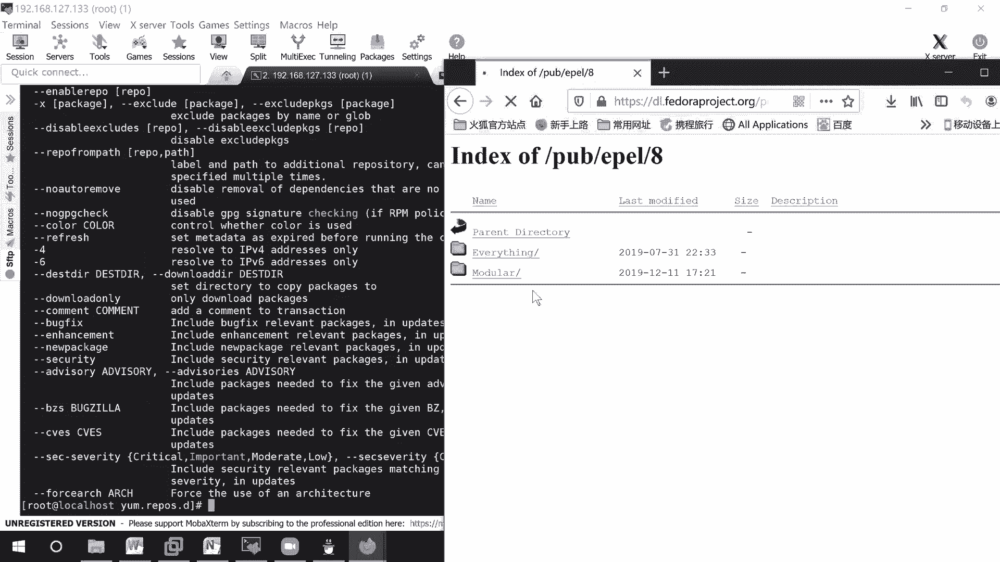

然后我们到时候的话呢就这样子，叫做ym config manager，然后呢减减adr e p o，后面的话呢去跟上一个u r l就可以了，url要么config，然后这边减减as ipo。

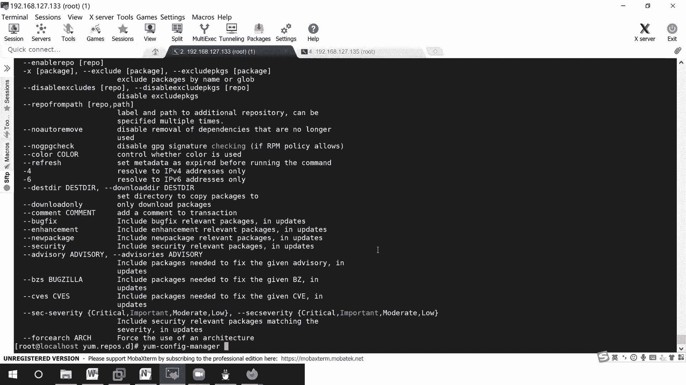

后面的话呢跟上ur l，等一下，我等他进去诶。

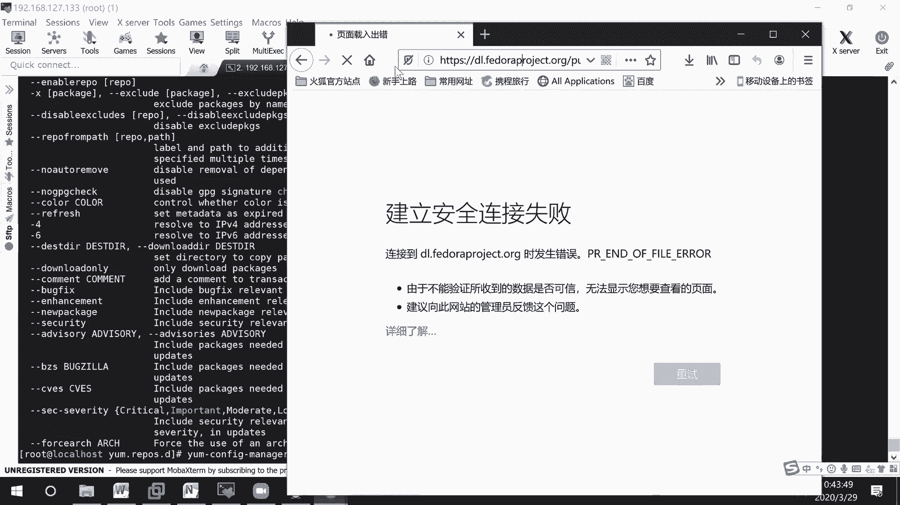

那这边的话呢。

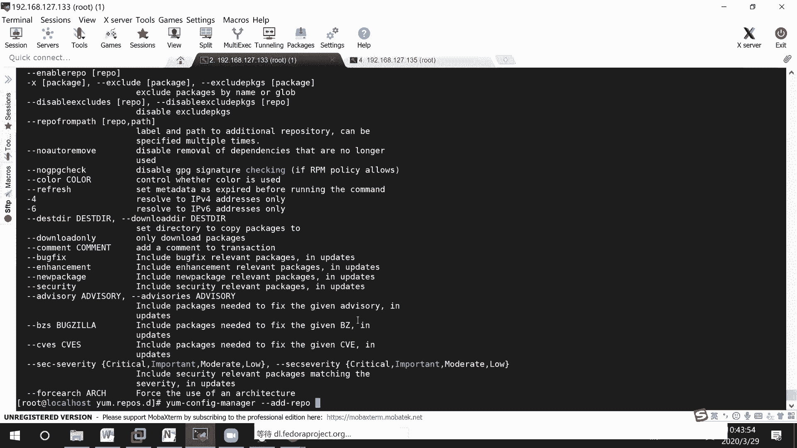

因为嗯这个是那个for dollar的一个诶，进来了哈，这边还有个x86 ，我们再进去再进去，然后到了这里就够了，它有时候打开的话呢不是特别稳定，我直接的话呢把地址发群里面，给你们到x86 过就够了。

因为这边的话呢是不是有这个r i p o啊。

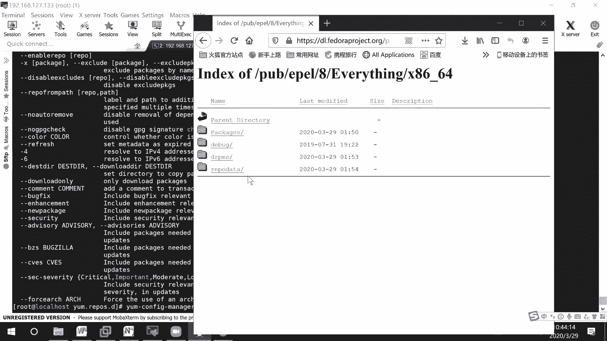

就相当于是我们那个目录了吗，然后这边的话呢你就把地址放在这里，就是啊减减a等于后面这边的话呢，你打一个双引号，把地址放在里面，就说怕它里面有什么下滑啊，空格啊什么的嘛，你这边的话呢给他加一个双引号好吧。

回车，然后他这边的话呢是不是就给你添加了呀，你在这边的话呢，就多了一个叫做dl everything的一个东西，但是它这个默认情况下的话呢，就是一个enable的一个情况。

我这边来要么reporter list在做的时候，这边的话呢可能进行加载，它很慢。

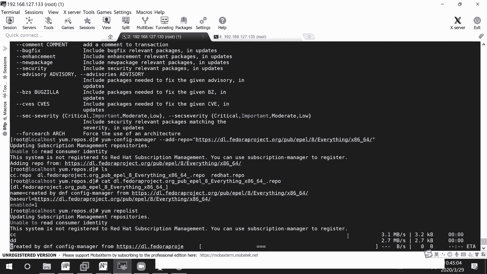

我就不加载了，然后呢会有一个什么问题呢，在考试的时候会有一个证书问题，证书我这边的话呢就是说来讲一下，如何加载亚美元的证书，如果说你在考试的时候呢。

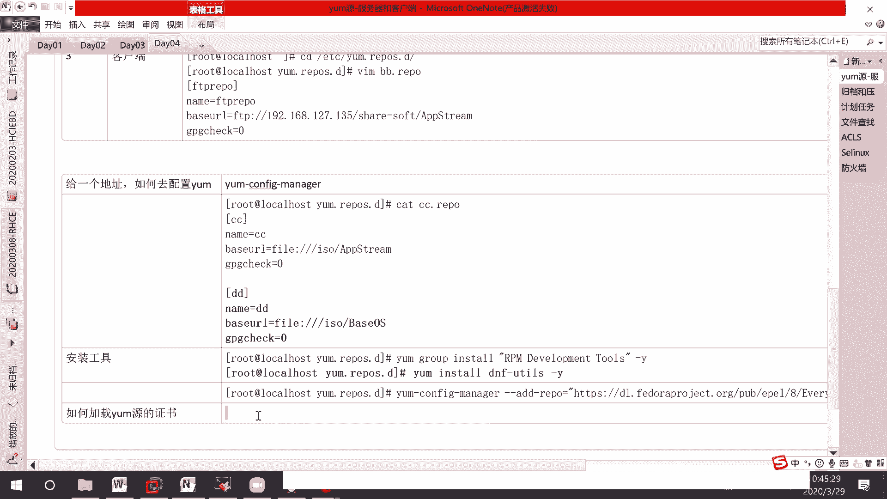

发现自己不会加载的话，那你自己要做的事情，就是说在里面去添加一个jpg等于零，jpg等于零，知道吧，先确保自己能去做后面的东西，如果说能加载的话，那是最好的，这个叫做key的话呢。

我们怎么样去进行一个加载呢，是这样子的rpm，然后后面呢减减import，然后你看到时候考试的话呢。

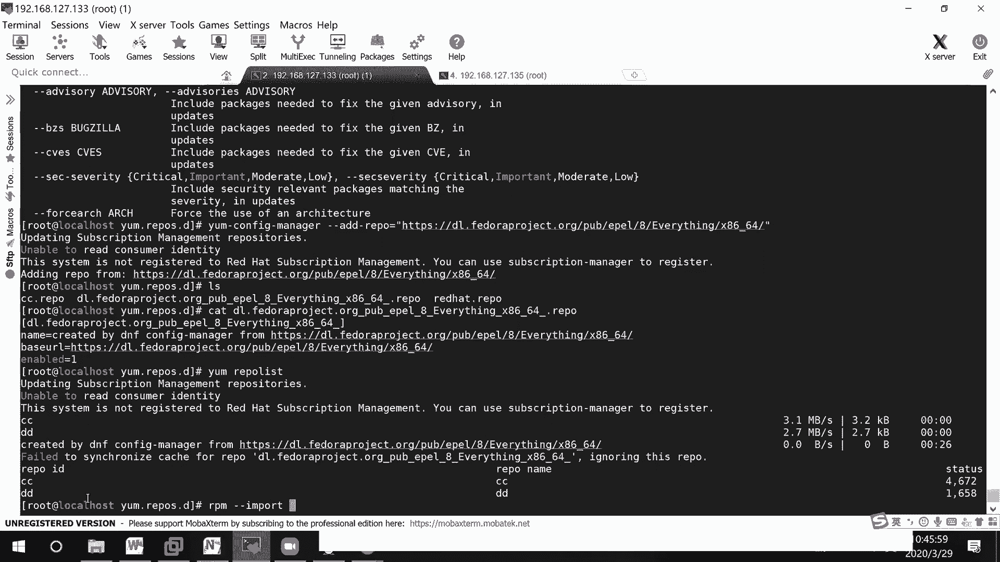

它的站点是考官那台服务器，所以不会有这么复杂，它不在这里，它在哪里呢，就是说在一开始的这个eep l里面的，稍等，我把这边先去掉吧，看一下能不能直接去进去啊。

他直接就在那个epl 8下面有一个key文件，稍等一下。

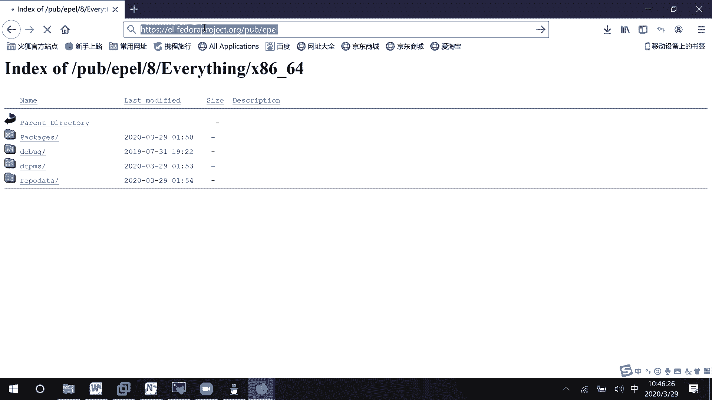

import后面的话呢，你这边就是放一下吗，或者的话呢你直接去进行一个编辑，也可以，就是说把它下载到本地来吗，好吧，就两种方法，你用这个r tm减减import，后面跟上地址也可以稍等一下。

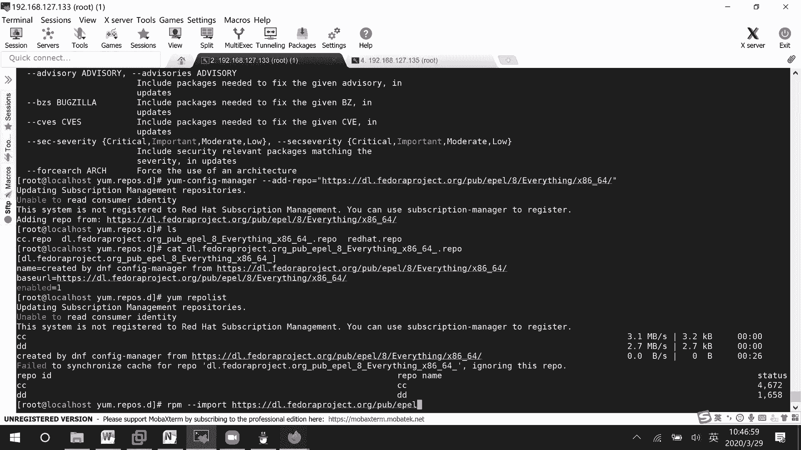

这个打开的话呢会慢一点，它打开了之后的话呢，就是一个嗯证书的一个名字。

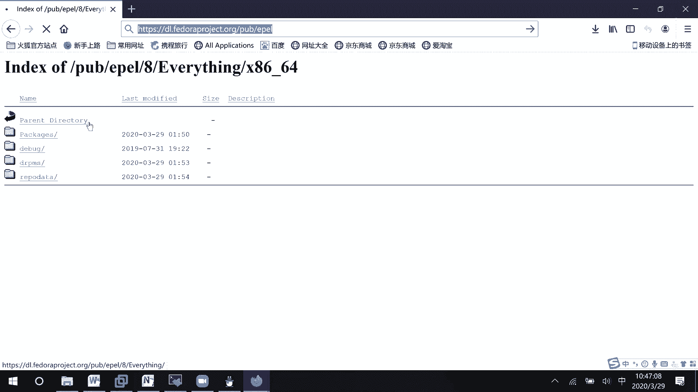

等一下太慢了，他证书的名字的话呢，和我们上一节课看到的是差不多的，就r p m g p g，然后呢k e y，然后后面这边的话呢就是e t e l，然后后面就是一个减八好横线，八。

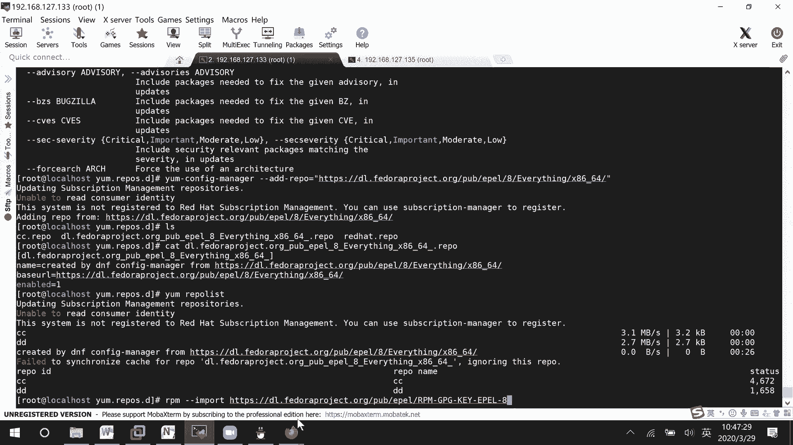

太慢了哈，等一下，等等他一下吧，他这个下载本身就慢一点，它的话呢一种你使用这个r p m的方式去导入，第二种是什么呢，可以下载证书，到本地，然后的话呢在配置文件里面，里面写入好吧，两种方式都可以。

这边的话呢如果说要去下载证书的话呢，我们怎么怎么样去下载呢。

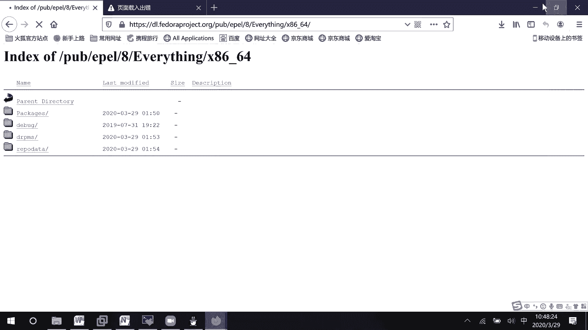

啊这边跟你们去说一个命令名字应该没错的吧，我看一下，这边我就放着看它能不能加载到吧，如果说你想要去下载的话，比如说是这个界面，那就that get减大o，这边后面的话呢你就去写一下。

你文件下载下来的话呢，想要去放在哪里吗，比如说我想要去放到这个叫做etc pki下面，这个没有关系的，然后呢，因为有一个在系统当中有一个专门的目录，etc p k i r p m g p g。

它下面有这个文件，那你就一起放在这里吗，w g e t减大o，然后呢etc p k i r p m jpg，然后后面这边的话呢再去跟比如说rpm k e y，然后后面的话呢你自己可以随便去写名字。

比如说e p e l减八就可以了吗，我看一下哦，哦我知道了，后面我的一个链接还没更哈，链接的地址在这，链接地址在这看一下能不能下成功吧。

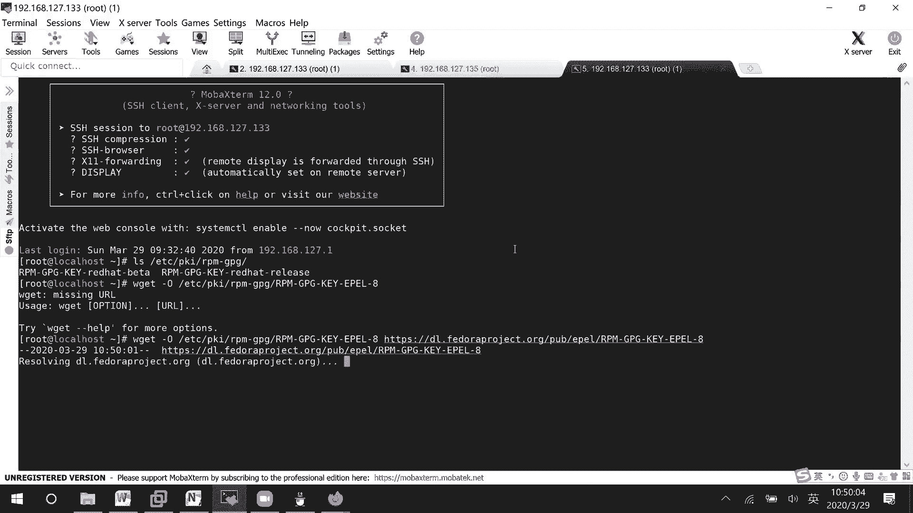

然后他就去进行一个连接去进行一个下载。

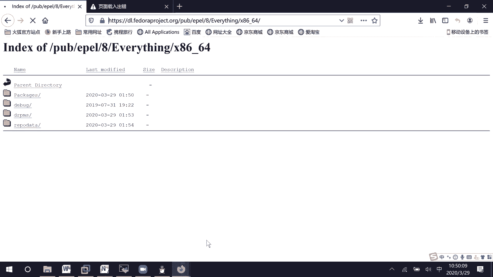

这边还没有跳转出来哈，嗯这边下载就说这边倒是下载好了，这边在import的时候的话呢，它还特别的慢，没有import进来，我的地址应该是同一个的e t c pki rpm jpg。

你看这边就是多了一个他嘛，那我们来看一下在配置文件当中，如果要去写的话呢，那这边就d这边v i m e t c d l etc，ym reporters dl嘛，后面的话呢我们去跟上一个命。

跟上一个一行信息就可以了，叫做g t g k e y，去指定一下你的这个t的位置的话呢，在哪里，本地文件哪里呢，刚才是不是下载到etc pki r p m，然后呢jpg下面我的名字叫做他嘛对吧。

这个时候的话呢就保存退出就好了，然后我们再来一下叫做ym report list，他这个的话呢会出现一个错误的原，就是说本身可能站点就比较慢，他也会去出错的好吧，我这边给你们复制一下。

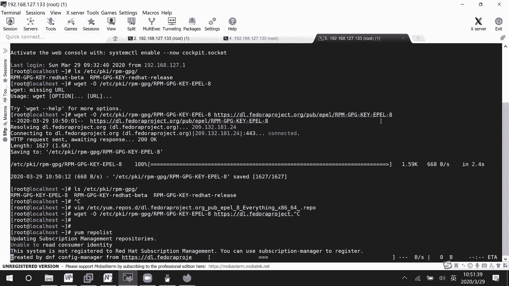

这里下载证书，下载下来了之后的话呢。

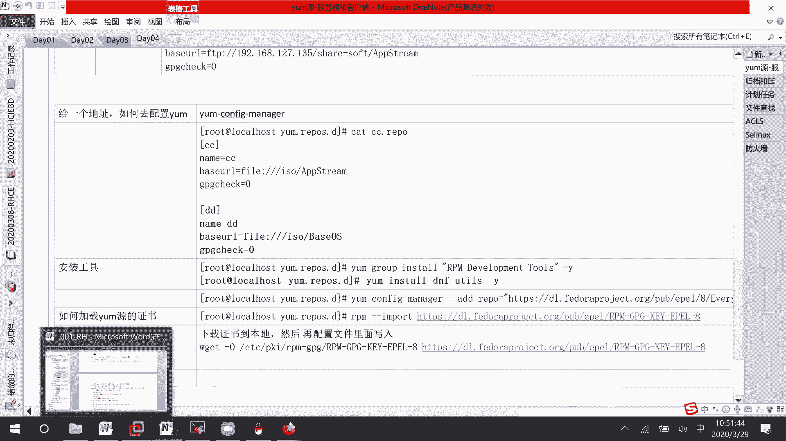

配置文件去改一下，这边我就不等他了，他这个太慢了，cat e t c，要么reporters bl，就说加上这一句gpg，然后呢fire协议本地的哪个文件，你把它给写下来就可以了。

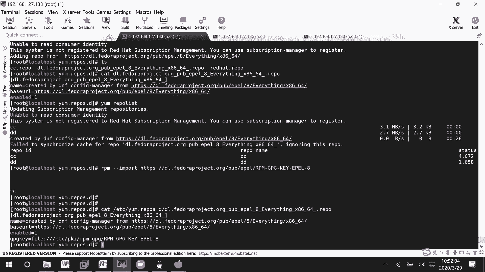

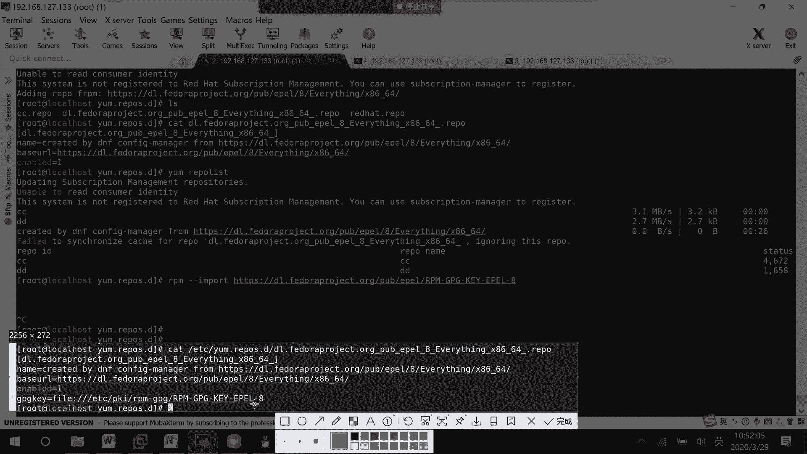

然后这个时候的话呢。

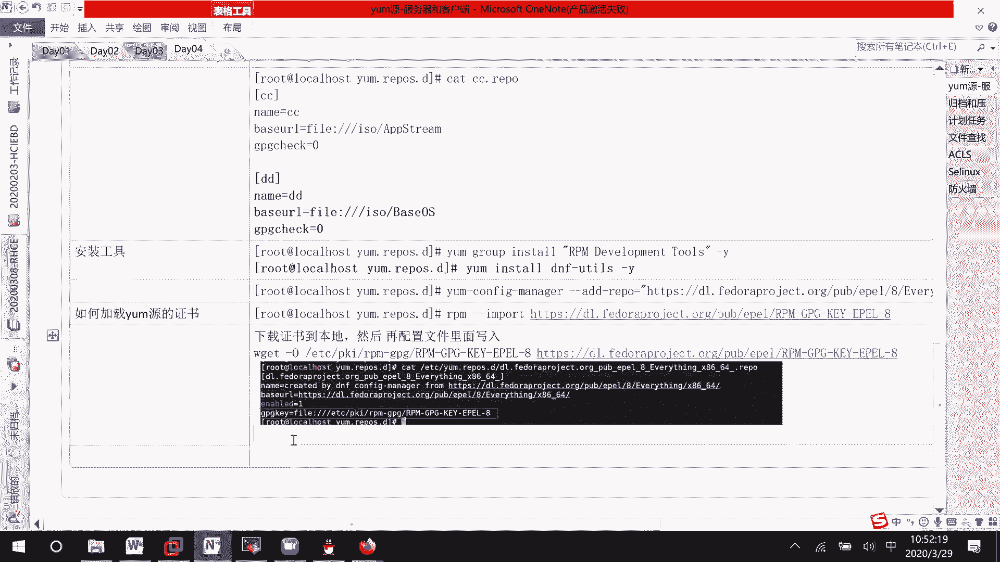

我来看一下它这边我们成功，这边的话呢没有成功，应该是那个站点的话呢会稍微慢慢一点，因为我们实际上那个站点都已经打开了吗，都已经打开了，所以的话呢是没有什么样的一个问题的，好吧是这样子的。

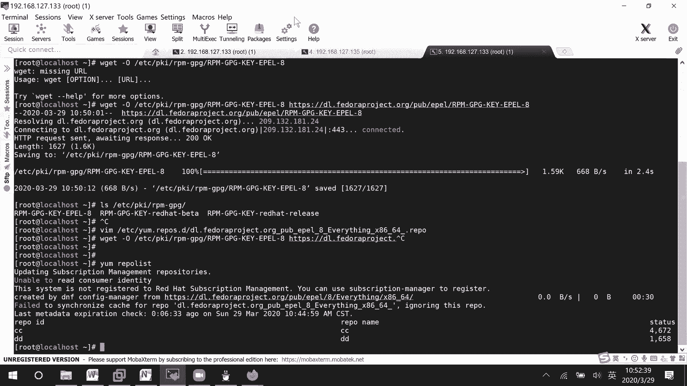

那到这里过的话呢，我们整个亚目园就已经讲完了，考试的时候的话呢，考这个他的话呢给你一个地址，给你一个地址，你的话呢怎么样去添加，像这种方式的话呢，你需要先本地去安装一个这个滴滴，dnf的一个软件。

相对来说的话呢会麻烦一点，所以建议你们的话到时候给你们亚目源的话呢，直接去编辑这个配置文件就行了，因为你到时候去写这个方括号里面，随便去起一个名字嘛，name的话呢随便去起一个名字嘛。

base url把他的一个叫做地址给放进来就好了吗，jpg check的话呢你可以等于零，或者的话呢用这条命令去考官服务器上，把它的一个证书给下载下来就可以了，你们稍微注意一下。

就说到时候考官给你们的这些http的地址，你们在这边都是可以去打开去查看的，也就是说考官比如说给你一个e p e l，但八这个的话呢是不是肯定是一个文件，你打开到前面这一集目录吗。

然后的话呢你再一层一层的跳也是可以的，知道吧，所以呢你们拿到地址了之后，在图形化界面上可以先去找找，找到自己确定的再填进去再填进去，我比较建议你们的话呢，就是说记住下面这种上面这种的话呢。

因为需要安多安装一个软件吗。

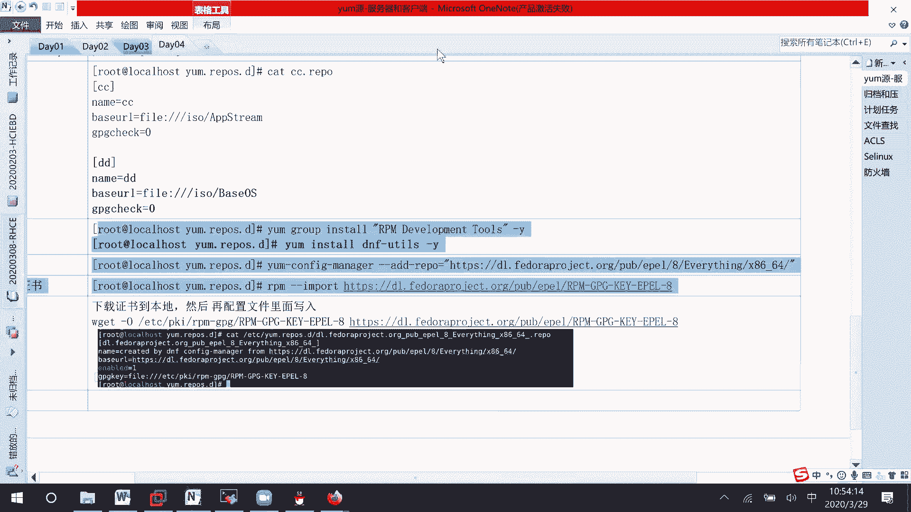