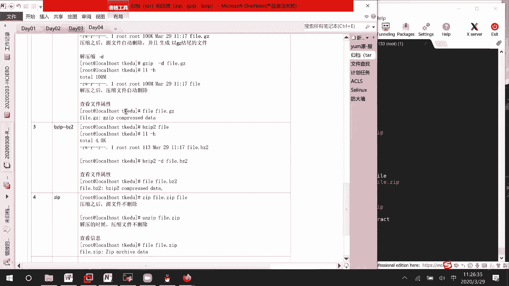

# RHCE8.0视频教程【45课时】 - P12：20200329-RHCE-04_recv - 六竹书生6682 - BV1su4y1Z7sJ

这边我们来看一下压缩，它这边的话呢压缩工具有很多，第一个命令，像我刚才说的gzip，第二个命令b z，但是他后面有个二版本，第三个命令就是一个zip嘛，好吧，这里的话呢有这三个信息。

一个叫做车自己跑b自己爬，二，还有的话呢一个就是rap，这边压缩了之后的话呢，我们是可以压缩了之后的话呢，是可以把那个叫做文件大小的话呢去变小的，去变小的，这边还是一样的啊，我们的话呢去准备几个文件。

如果说还还去用那个叫做password，和刷的文件的话呢，相对来说这些文件太小，我们的话呢压缩效果的话呢看不到，那这边的话呢我们去进行一下准备，就说准备一些数据，有一个叫做嗯快输入输出，你们应该知道吧。

就快速的把整个磁盘，比如说可以去给写满吗，dd衣服啊，这个好像在讲进程管理的时候讲过，在这个lv zero里面的话呢，你去拿文件拿过来之后的话呢，输入到输出到哪里去呢。

比如说就输出到我这个tk e d u下面，叫做发文件，每次取一丈，总共取100个，那这样子的话呢，可以产生这个文件大小可以有多少，是不是就可以有100兆的一个文件，这个dev zero的话呢。

它是一个测试的哈，回车稍微会快一点，l l减h，你看这边的话呢，是不是就生成了一个100兆的一个文件稍等，然后接下去我们的话呢，对几种方式都来进行一个压缩，这里我们先来讲这个叫做zip吧，好吧。

zzip的话呢，它的一个压缩就比较简单一点了，gzip，他这边呢zip选项，然后的话呢是一个叫做哪一个文件嘛，对不对，哪一个文件，如果说你想要去看到过程的话，你里面有很多文件的话，自己可以加上一个v。

因为我这边就只有一个文件，我就不加了，好吧，哦稍等一下啊，gzip，后面的话呢跟上我们想要压缩的文件，叫做fire回车l l减h这边的话你看啊，我刚才一个文件是100兆的。

他现在呢是不是就给我生成了一个，叫做100k的一个文件，而且这个文件的名字是不是自动的话呢，去给它生成一个叫做fire gz的一个文件，bug z的一个文件，所以这边你们稍微注意一下。

叫做压缩之后源文件自动删除，并且分成生成一个叫做以jz结尾的文件，它这边的话呢名字自动会给它去提起来的，然后现在的话呢就是说压缩完毕之后，那我们肯定要想着，怎么样去对它进行一个解压缩嘛。

compress的话呢是压缩，解压缩的话呢就是减d嘛，那这样子叫做jia减b，后面跟上你的一个文件的名字回车，这个时候再来看一下，它这边的话呢叫做f一的话呢，是不是又回来了，f一回来了。

而且的话呢他这个时间的话呢是有改掉的哈，稍等一下，你看我这边在创建的时候，因为太快了，好像都看不出来，fil l l减h他都是11：17，这个时间的话呢，也是你也是你原来文件的一个时间。

就是说不是这个时间，这怎么说呢，就是说可能你在文件创建的时候，是11：17，压缩文件的时候，11：18，那解压出来的文件呢，它也是11：17，和我们windows的话呢也是一样的好吧，这边就是说解压缩。

他的话呢一个选项就是减d这个选项吗，减d这个选项，然后的话呢这边可以发现解压缩之后嗯，压缩文件自动删除，自动删除，然后的话呢它的一些属性信息的话呢，没有发现啊，就是说属性信息的话呢没有改变。

这边的话呢就是说100兆到100k k，发现的话呢，它的压缩效果很好，为什么呢，我们这边的话呢是一些测试数据本身冗余性，它的话呢就很高，所以压缩效果的话呢会这么好好吧，稍等一下，我这边再来压缩一下。

你看这边，如果说你使用这个gzip压缩了之后的话呢，它的一个描述是gzip compress，因为就是说不是所有的zip文件的话呢，它都会后面带一个gz的，不是都会带jz，只是说正常情况下。

我们习惯性的看到gz的文件呢，就是一个gz吗，然后下面这边的话呢我们来讲第三个叫哦哦对，第二个叫做beip，beip的话呢，它和我们的jip的话呢是差不多的哈，它的一个方式viip减减help。

这边的话呢减d叫做进行一个解压缩，they的话呢就是进行一个压缩嘛，但这个选项的话呢默认就有了，就说uh的话呢就是muzip后面加上文件，它的话呢直接可以去对你进行一个压缩的。

直接可以对你进行一个压缩的，好吧，我们来看一下，就这样子，zip 2后面的话呢跟上文件的名字回车，l l l h哦不对，l l减h，这边的话呢他这个vizip压缩完毕之后，文件的大小的话呢变成113。

他的话也就是说连1k都没有到，连1k都没有到，相对来说的话，你们可以自己去测试一下，zip的话呢，它的一个压缩效果，正常情况下比这个zip的话会好很多的，会好很多的，然后他这个压缩完毕之后呢。

文件叫做原文件也是被删除掉的好吧，如果是以这个，zzip a beip进行压缩的话呢，我们后面的一个解文件描述，是一个叫做v v z2 compress，这边给你们去标记一下，正常情况下它都是jz。

这个的话呢是一个叫做b z2 ，好吧，现在的话呢我们来看一下解压缩怎么去解fire，哦不对，zip 2减d后面的话呢跟上文件的名字就行了，对吧，又解压回来了嘛，然后最后一个的话呢，我们来看一下叫做。

第四个z i p z i p的话呢，它的压缩和v z p或者叫做jip，稍微有点不一样哈，我们先来看一下它的一个帮助信息，这边的话你看啊呃option他的一个路径，它的一个时间什么的。

你自己都可以去进行一个，就是说去进行一个写吧，然后的话呢他这边减d这个d的话呢，是去移除某一个条目，他这边的话呢减低就不再是一个叫做解压缩了，他的一个解压缩是什么呢，on zip u n z i p。

它的话呢是进行一个解压缩，所以他这边的话呢会有两个命令好吧，这里比如说zip fire回车，你看这边它就，诶等一下l l减去，他这边的话和那个叫做zip zip不一样，没有进行一个压缩，对不对。

没有进行压缩，这边的话呢你需要去跟上一个压缩之后，人家叫什么名字，比如说fire zip后面再跟上要对谁去进行一个压缩，稍等一下，你看这里的话呢就压缩了一个叫做fizip。

它大小的话呢是100k100 k，这个和其他不一样的地方是什么呢，压缩之后源文件不删除不删除，然后接下去的话呢我们先把原文件给删除掉，免得等一下解压出来的之后呢，不知道有没有解压出来吗。

那这边解压的话呢就是on zip，fire zip，嗯你看你看这边的话呢，是不是解压出来了，而且他在进行解压了之后呢，压缩文件也不会删除，知道吧，嗯这边的话呢我们来看一下这个叫做zip，它的一个信息。

它的一个就是zip actor d，好吧就这样子吧，这个的话呢是我们压缩解压缩的话呢。

