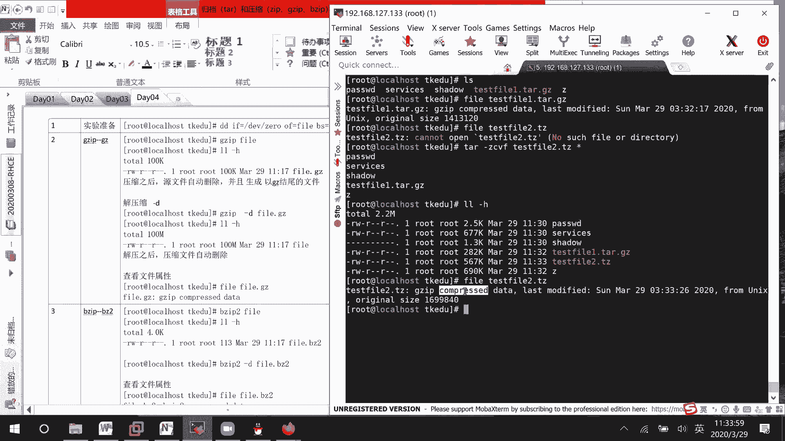
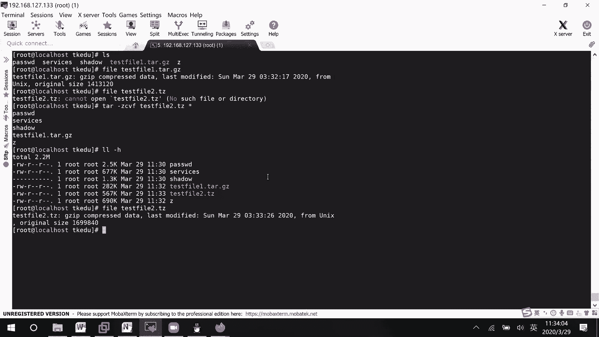
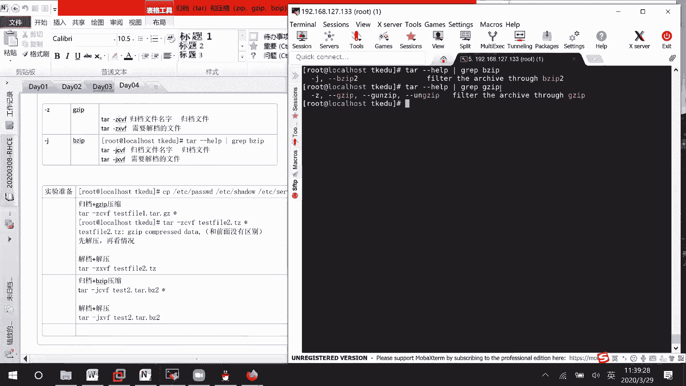

# RHCE8.0视频教程【45课时】 - P13：20200329-RHCE-05_recv - 六竹书生6682 - BV1su4y1Z7sJ

看一下压缩归档，它结合在一起的话呢，怎么样去进行一个使用，它的一个使用方式是这样子的，如果说你是进行归档的话，那是不是t a r c v f啊，后面的话呢这边就是说跟上啊归档文件名字嘛。

然后后面的话呢是不是跟上归档文件，如果说你在进行一个解档的，进行一个解档的时候呢，他的话呢tar其实前面这个横线少了，没有关系啊，这边的话呢横线x v f，后面的话呢，是不是跟上一个叫做需要结档的文件。

如果说你想要指定位置的话，那后面自己去加，然后的话呢，我那个压缩它其实只是起一个叫做辅助作用的，如果嗯这边的话呢我们来看一下car减减help，这里的话呢它有一些选项，其中一个减z。

他的话呢代表的是jz ip，然后还有一个的话呢减j就这个勾，它代表的话呢是一个叫做zip zip，然后的话呢在这边你们应该是看不到那个zip的，就说普通的第三个那个zip它没有，他没有在这。

所以呢我们这个归档它的话呢就和啊b zip，还有gzip，就是说结合起来去进行一个使用吗，那我的话呢什么时候表示，因为就是说你归档和压缩，是不是肯定一起进行的，你不可能就说边解档边压缩吧。

或者就是说边归档边解压缩吧，他肯定不是这样的，他的话呢是归档和压缩在一起，解档的话呢，肯定和解压缩在一起嘛，对不对，这边的话我如果是c的话，就表示是归档和我的一个叫做压缩，如果是x的话呢。

就表示是减档和解压缩，如果现在的话呢想要使用一个叫做啊稍等哈，如果说现在的话呢，想要使用这个叫做gzip去进行一个归档，压缩的话，怎么办呢，就在这里去加一个z就可以了，如果说你拿到的一个文件。

是通过uzip压缩过的一个归档文件呢，怎么办呢，那你就是xz就可以了，就是说线到底是归档还是减档，到底是压缩还是解压缩的话，其实主要看这个c或者那个x的，明白吗，只是说归档的话呢。

是配合着哪个压缩工具去进行一个操作的，就只有这两种，只有这两种，好吧哦就这四种哈，那现在的话呢我们来看一下，现在我随便我把这边的话呢先给它给清空掉哈，我随便去拷贝几个文件过来。

copy etc password，etc shadow，还有呢etc server service诶，e t c下面的哦，拷贝到当前目录下面来好吧，那现在的话呢比如说我想要去对它进行归档压。

uzip压缩的话，这边的话呢怎么样去进行一个操作呢，那也就是说tr回答gzip压缩，是不是跟上一个叫做z啊，他的话不是g哥哈，然后后面这边的话呢是不是要跟上压缩，压缩之后的话呢叫什么名字吗。

比如说test fire。一点，就是说基本上的话呢，你使用gzip进行压缩之后的归档文件的话呢，我们会叫做一个叫做tr。jz的，稍等哈，后面跟上所有的文件诶，我看一下横线c v f z，稍等一下。

cv f not found，诶，我看一下，对哦，稍等一下位置应该写错了，他这个的话呢我这边位置写错了，他这个还是有讲究的，这个z的话呢，你还得搞到前面去，写，到后面的话呢，他这边就一直报错了嘛。

诶那相同的j的话呢，你也写到前面去，写到后面的话呢，不可以就一直报错，然后这边的话呢，你看我使用这个命令去进行一个归档和压缩，了之后的话呢，他肯定会按照我的一个情况。

生成了一个叫做test fire一的一个文件吗，那基本上的话呢，我们如果是使用gzip进行压缩，归档的文件的话，会叫做tr g z part之间好吧，然后接下去的话呢，嗯还有一些有时候的话呢会怎么样呢。

你们看到的一些文件叫做tz文件，他的话呢也是一个叫做tg z，它的一个文件上的叫做tz好，他这边的话呢也是我们的一个叫做tp矩阵，压缩的一个文件，而压缩归档的一个文件行吗，稍等我找一下在哪，在这。

然后这边的话呢我们刚才去查看了一下，叫做文件的一个属性嘛，他这边的话呢叫做jip date date，然后和前面这里的话呢，你看他这里压缩了之后，jip compress d。

他这里的话呢也是compress的。

所以这两边的话呢，没有什么一个很大的一个区别，没有很大的一个区别。

所以的话呢只能就是说自己去操作一下，你看如果说我这边直接去使用rez减b test by 2，他这边的话呢诶你看他这边的话呢，是不是先帮你去给它解压缩掉，然后你如果说需要去进行一个解档的话。

你再去进行一个操作吗，再进行一个操作，所以它这个归档和压缩结合在一起的话呢，是你先把归档的文件先归好，然后的话呢我在外层的话呢再进行一次压缩嘛，能明白吗，他是这个意思哈，肯定不可能两件事情同时去做嘛。

所以这边的话呢，你如果有时候不能判断，到底是不是被归档过的话呢，那最保险的做法就是说先解压，看情况吧，到底是一个叫做嗯归档文件呢，还是说不是归档文件吗，如果说你已经很清楚了，它是一个归档文件的话呢。

这边我们怎么办呢，我把这些没有用的文件先删掉哈，也就是说像这个fire 2，它的话呢肯定是一个通过part归档，gz压缩的一个文件，那我们这边就是差减z x v f后面跟上in test。

你的一个叫做test，fire 2点，他这边的话呢不能让我去tb，我看不知道是不是tab键按错了，一直不能table哈，你看这边的话呢，是不是也给我们去进行一个叫做解压出来了，要叫做解压出来了吗。

对不对，这里，两个事情的话呢一起去做，叫做解档加解压对好，这个的话呢是我们和jip的话呢，去进行的一个一起的一个操作，下面这边的话呢，比如说我想要去和那个jip一起去操作的话呢，这边怎么办呢。

那这边就是踏减j cvf后面的话呢去跟上，你比如说进行归档了之后的话呢，想要叫什么样的一个名字吗，比如说叫做test 2点b z，或者的话呢就是说tr。v z2 嘛，就是说还是比较少见。

那什么叫做t b z2 的，还是如果是bz压缩的话呢，它点b z2 会常见一点，好吧，你看这边的话呢就压缩成功了，归档加vizip压缩，下面这里的话呢，我们就说也来查看一下文件的属性，fi。

fire test 2，他这边的话呢也就出现了一个vizip 2 compass，也没有出现什么回档的一个信息，如果你不放心的话，那肯定先解压再进行接档吗，如果说你很确认的话呢，那把这个c改成x吗。

哦那个原文件的话呢，它还在哈，原文件它还在，可能呢我们就没有看出效果，没有看出效果，到时候你们可以先把这个文件删了，然后再去解绑一下，好吧，这边叫做结党，压解压就这样子去做，然后到这里过的话呢。

我们整个整个归档和压缩的话呢，全部讲完了，考试的时候的话呢会结合文件查找，就是说去进行一个归档，你们的话呢一定要注意gzip和zip的话呢，它的一个选项是什么，考试的时候他会去指定某一种压缩方式的。

实在不知道的话呢，你们怕减减help总要会用吧，然后呢管道图会不会他都说了，bzip，你去grape一下，b ip不难吧，就是这边的话呢命令多稍微是多了一点，但是你自己的话呢要想点办法去给他记住好吧。

然后的话呢这边讲到这里过，留下20分钟的话呢，给你们自己去做一下这个小练习好吧。

