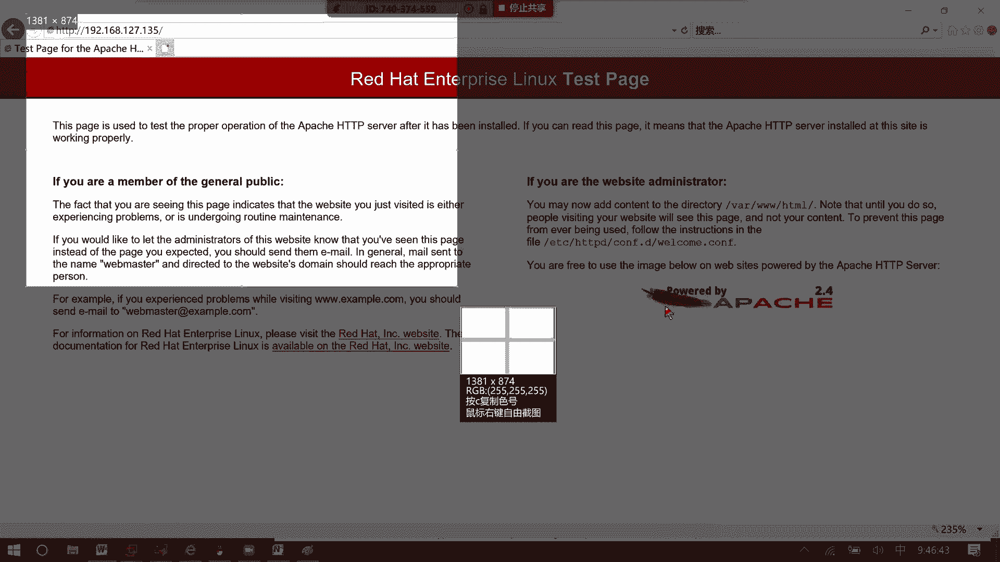
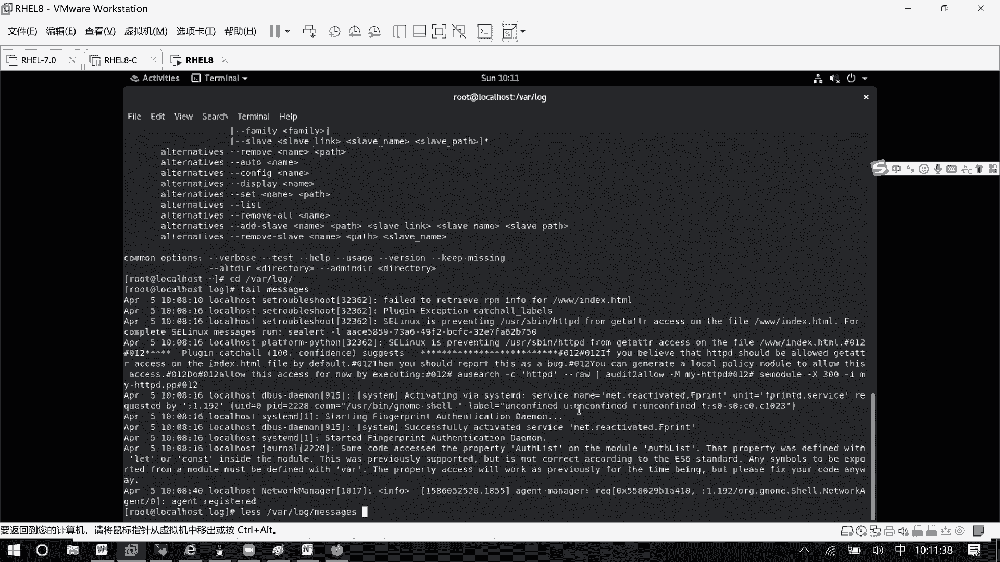
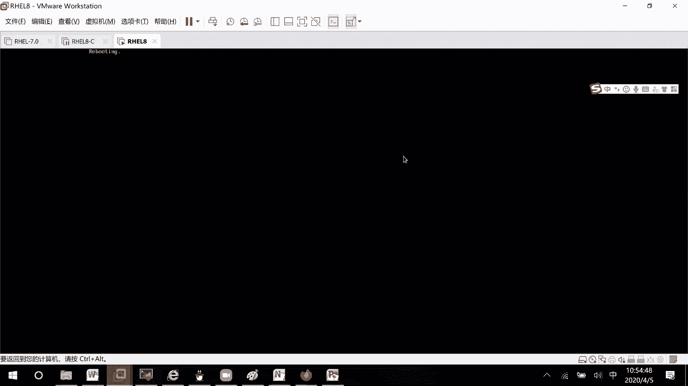

# RHCE8.0视频教程【45课时】 - P18：20200405-RHCE-01_recv - 六竹书生6682 - BV1su4y1Z7sJ

今天的话呢是我们红帽的第五次课程，然后今天主要内容的话呢就是s a linux，它的话呢是一linux当中有一个叫做增强型的，就是说是和安全相关的一个东西，下面这里的话呢防火墙也是和安全。

就是说能不能访问，就是主机就主机之间访问是相关的，然后呢文件系统就说怎么样去进行分区啊，然后怎么样去进行一个挂载啊，在这边会详细的去说，还有一个就是逻辑卷，也就是说像我们普通的一个分区。

如果以后不够用了之后呢，你就不太好去进行一个扩展，就是说不太好进行一个变大嘛，这个逻辑卷，也就是说我可能有很多人，很多的分区在我这个小组当中，我可以动态的去进行一个分配，考试的时候呢。

主要是考你们怎么样对它进行一个缩小，怎么样对它进行一个放大，所以到时候上课你没有重点的支撑，接下去这个nfs的话呢，就是一个服务，我怎么样把我一个目录共享出去，让别人能够去访问到，往里面去写东西。

或者从上面去下载东西，主要是这个东西哈，那行，那这边的话呢我们先来看一下，为什么要出现sa linux这个东西，这边的话呢，我们比如说在这边吧去看一下文件嘛，像这里的话。

如果我们没有sa linux之之前没有sa linux的时候，像对于一个文件去进行一个嗯管理的时候，它主要就是说是不是就看这个文件的权限，如果说管理员不小心的把某一个目录的话呢，设置成777的权限。

那这样子任何用户对这个文件的话呢，都可以去进行一个删除，因为你就说管理员对这个文件设置了什么权限，那相应的用户就拥有了这个权限吗，这种的话呢是传统的访问控制，叫做一个d a c主动成本控制。

也就是说你设置了什么权限，这样子的话呢，相应的用户，就具备了这个权限，这个的话呢其实是一个比较危险的一个东西，然后这边的话呢我们来讲，今天的话呢就讲这个sa linux，它的话呢是m a c。

它的话是一个叫做强制访问控制，这两个有什么区别吗，主动访问控制的话呢，就是说设置权什么权限，你你的话呢就能进行什么操作，强制呢，它是这样子的，比如说我现在这边的话呢有两个文件稍等哈。

比如说文件a和文件bb这两个文件，然后这边的话呢还有一个文件叫做bb这个文件，如果说你的系统当中sa linux开启起来了之后，会为每一个文件分配一个上下文，你也可以认为就是说标签给它去分配标签。

比如说这里给它分配一个标签二，这个的话呢不是说每个文件，它们之间的标签都是不一样的，也可以是一样的，我只是说这边的话呢，假设这两个文件的标签是不一样的，好吧，那好像这些文件的话呢，我们是不是都希望。

都肯定要通过应用程序去进行一个访问吧，文件有标签，那像我们的应用程序的话呢，它也有标签的，他就说能去访问哪一些文件吗，比如说这里进程，进程一这里的话呢，比如说进程二，像这个进程一的话呢。

比如说它能访问标签一的，那等一下的话呢会教你们去怎么样去打标签，好吧，那好如果说这个叫做呃进程一呢，他到时候访问，比如说这个a文件，到时候可以去看到里面的一个内容，就是说a文件里面写的是什么东西。

我是可以看到的，然后他如果去访问bb文件呢，他是看不到的，就说即使我这个文件，它的一个权限已经设置成了三个七，如果说我sa linux标签对应不上的话呢，这个进程一的话呢，他也不能去访问bb文件了。

像我们的话呢，像这些进程在运行的时候，这里要注意一下进程运行的时候，是不是也是会依托于某个用户，还有呢某个小组啊，正常情况下，如果说这边权限是一个三个七，那任何人来访问他。

是不是都应该能看到里面的东西啊，只是说这个进程的话呢，只是打开文件的一种方式而已嘛，但现在如果说这两个标签对应不上，你又开了sa内容，你的话呢就不能被访问，那处理办法是什么呢，把他这个标签改一下吗。

改成标签一嘛，要能去访问吗，可以吧，他是这样子啊，手也就是说有了s linux之后呢，你要有权限，并且你们的标签要匹配上，你才能去进行一个查看，如果没有匹配上的话呢，是不能去查看的，首先要有这个概念。

所以我们在学这个sa linux的时候呢，主要就是说打标签可以这样子去想，它的话呢叫做context，好吧，那在学习打标签之前呢，我们现在来看看一下查看标签，查看标记怎么样去看的好吧。

这边的话呢我随便来去创建一个文件哈，首先这个标签的概念一定要有哈，标签的概念大家一定要有，我比如说就在这里随便去创建一个文件，touch aa文件，touch vb文件怎么去看呢。

它也是l s l的话呢，查看详细信息嘛，主要是这个大写的z大写的z，大写的z的话呢就是去看你的sa linux的一个标签，能明白吗，前面这一串东西我们不看它，我们主要来看这个admht。

这个就是我的一个标签，这是我的一个标签，然后呢你们这边注意一下一个进程的话呢，它不是只能访问一种标签的，他的话呢是个大类，可以去访问多个小标签的，明白吗，好这样子啊，这个方式就是说如何去查看标签。

其中的话呢主要就是说有一个选项，叫做大写的z选项，这边的话呢配合起来去使用，如果你直接这样子a a b b哦，稍等他这边就显示了一个哦，哦这里有，你看如果说你前面没有l的话呢。

它只显示了一个标签的一个信息放在这里，就是说像这些权限，而时间就不去显示，最主要的话呢是这个叫做大写的z，明白吧，那好，这个的话呢是如何去查看我们文件的一个标签，下面这里应用程序的标签呢，p s减au。

它是不是x是不是去查看所有的进程对吧，那现在要去查看它标签呢一样的，跟一个大写的z吗，在这边你看在前面这里呢都会去跟上，你每个应用程序里的一个叫做标签是多少，标签就在这，标签就在这好。

这里的话呢没有什么样的一个问题，下面这边的话呢，就比如说我们能不能去访问啊，或者就是说各个应用程序的标签是多少啊，我们总要去看一下嘛，对不对，我这边把命给你们复制一条下来哈，就是说我们总要去看一下。

就是说能不能去访问应用程序的一些标签，那这边的话呢我们以那个叫做阿帕奇为例，话题的话呢，也就是说是我们平时去网上去访问一些网页，就3w服务嘛，3w服务他这个的话呢就比较直观，如果说你这个标签匹配上了。

是不是就可以把里面的东西显示出来给你看，如果说没有匹配上的话呢，是不是内容就不给我们去看，所以这个比较直观哈，那这边的话呢我们在讲阿帕奇的时候，首先第一个是不是要去安装软件，安装软件的时候呢。

第一个我们肯定是通过ym去安装的，先确保自己的电脑上的话呢，要么可以去用用这条命令，ym reporter list，我这边的话呢显示出来叫做没有可用的样目源，那也就是说要去进行一个配置。

这边你们来看一下怎么样去进行一个配置啊，cd etc l s我这边的话呢就是说没有任何的样源，我来编辑一个好吧，稍等我这个给你们去复制一下，这个的话呢你们前面肯定都已经做过，我只是说重新去做一遍。

第一个标签，第二个名字，第三个路径在哪里，base url，比如说等一下放到这个叫做soo目录下，因为它里面有两个，一个是app string，还有一个的话呢是base os啊，a一个的话呢。

比如说叫做bb吧，这边的话呢还有一个叫做base os，总共的话呢，它有这两个目录都添加进来就可以了，那好这边要员的话呢，创建好了之后。

我们要做的事情是不是去make d i r s o mount dev，sdroom，到我们的iso啊，去挂载一下吗，挂载成功了之后的话呢，是不是去检验一下，看一下现在这个样子源能不能用吗。

ym reporter list，稍等一下，那这边的话呢一个是四四千多个，一个是1600多个，没有什么样的一个大问题对吧，下面这边的话呢我们要做的一个事情，也就是说去安装我们的h t t p软件了。

安装就是说你先看到这个亚目源是正常的，你才可以去进行一个安装操作，ym in store，你直接就这样子http v减y就可以了，他这边的话呢就会自动帮我们去进行安装哈，等一下哈。

我看一下ym a store http t，aa我看一下啊，是我名字写错了吗，a p p s t e r a m cat，我看一下是不是我名字写错了，app，s t r e a m没有问题啊。

base url，好的ym insps t p p，稍等一下，稍等我看一下import，我是那个拼错了吗，嗯g p g check等于1g pg哦，多了一个p，不好意思啊，我这边多了一个p对吧。

难怪一直报错，我这边再来安装一下，稍等哦，那现在就没有报错了，我这边的话呢一直多了一个叫做p，所以的话呢他这里一直给我去报错哈，对我写错了，那好那现在这边的话呢它安装好了之后。

我们的话呢可以先来启动一下服务，也就是说看就是说通过浏览器的话呢，先看一下能不能看到这个东西嘛，好吧，要么restart rr e s t a r t h t t p d回车，我看一下哦，不不不。

我脑子晕了哈，system control restart http d，这里的话呢就是说启动服务，现在的话呢我已经启动好了，那我就说要来试一下，我通过浏览器的话呢，能不能去访问到他吗。

这边的话呢192168127。135，因为我这台设备的地址的话呢是个135吗，默认情况下的话呢啊，http它是不是有个端口号叫做802，因为我们我们现在呢只是说安装的应用，什么东西都没有改过。

所以可以使用这个默认的地址去进行一下，访问吧，稍等一下哈，我现在的话呢就进行一个叫做启动它，它这里的话呢没有访问到我们这边的话呢，先就是避免我们的一个叫做防火墙，对我们的一个干扰。

我们的话呢先去关闭防火墙，因为我们现在做sea linux的实验，把其他安全相关的呢先给关掉，system control stop firework，稍等一下。

然后呢我们再来访问一下http冒号斜线斜线，192168127。135，首先的话呢，这边是不是就可以看到这个叫做测试页面，先把这个测试页面的话呢给看到，然后的话呢我们再去做下面的一系列操作。

能明白吗，这里先把这个应用我们给测试成功了好吧。

关闭防火墙，然后呢这里的话呢测试先看到这个页面，也就是说你只要把你的一个叫做http安装起来，这个页面肯定都能看到，而且这边的话呢它出现一个提示是什么呢，就是说你也许要添加一些东西到vr。

3w html当中去，这边的话呢我来跟你们去说一下啊，http的一些简单配置，因为现在在我们红帽八单中的话呢，http他已经不去学习了，所以这边的话呢给你们去提一下哈，能掌握的就掌握，掌握不了的话。

那就算了，首先它的一个配置文件在哪里呢，因为就是说任何服务它都有配置文件cat啊，我这边就cat吧，e t c肯定是e t c h t t p configure。

http v config文件是它的一个叫做配置文件，我们的话呢回车来看一下，我直接都显示出来了，稍等一下，早知道就不要说哦，这里好，那可以的哈，你看再显示其中以这些井号开头的，它全都是注释信息。

你们就不用管它了，然后接下去这里的话呢，一些提示信息，就是告诉你你的一些叫做日志信息啊，记录到哪里去，如果你有需要的话，自己可以去比如说log access当中去看一下好吧。

然后下面这里的话呢叫做server root，这个是干嘛的呢，我给你们去写一下，这个是干嘛的呢，你看啊，就好像说这个叫做根目录下log access，我这边来写一个叫做，ls s根目录下。

你看一下有没有log文件，我们第一天在学习的时候，在这个目录下的话呢，是不是没有这个log文件，那到时候它会生成在哪里呢，就是说在这个文件当中，可能就是说没有去写一些根目录啊。

或者怎么样会以我这个叫做etc，http为我的一个根目录server root，也就是说这个的话呢，是作为我服务的一个根目录，服务配置的根目录，就好像说你在下面如果说没有看到一些。

比如说明确的以斜线开头的，全都是以我这个etc http开头的，你看像这个configure，models configure，它有以谁开头吗，没有对不对，他的话呢就以我这e t4 开头。

我们等一下再看，然后这里listen 80表示什么意思呢，监听的端口，就比如说有时候你想让他监听8080端口，怎么办呢，那listen listen，listen 8080就可以了，像你的服务器。

如果说有十个网卡或者三个网卡或者两个网卡，你如果说只想让他接在某一个端口上去，进行监听呢，比如说在第一个网卡上，那也就是说ip一冒号8080，那到时候的话，比如说你这台电脑有1号网卡，ip地址是点一的。

2号网卡，点二的3号网卡，点三的，其他人只能通过一冒号，冒号冒号8080来访问，通过二冒号8080呢，它是访问不进来的，38080也是访问不进来的，能明白吗，就这个意思张口，然后下面这里的话呢。

include这个的话呢，什么意思呢，如果说我们所有的配置都在一个文件当中去写，它会非常的长，这边的话呢也就是说包含的配置文件，这个应该我们之前学什么服务的时候有讲过哈，包含的配置文件什么意思呢。

就是说在这个e t c h t t p b下面，configure models v，下面，所有一点configure结尾的文件都是我的配置文件。

你看l s e t c h t t p configure models，所有以configure结尾的文件都是我的配置文件，以cnf结尾的文件，配置文件好吧，这边的话呢我们再来看一下哦。

大家看到这一波了，然后刚才的话呢是不是讲过嗯，每个应用程序也好，就是说文件也好，它是不是都有一个叫做所有者和所在组啊，我们这个文我们这个叫做http服务的话呢，它的所有者就是阿帕奇。

它的所在组的话呢也是一个阿帕奇吗，我们这边可以来看一下id阿帕奇，你看是不是48，因为就是说在1000亿嗯，这边给你们去写一下哈，我忘记了之前有没有跟你们说，这里他这个的话呢就是说呃应用程序运行。

有者和所在主它的一个i d的话呢是48，然后像在我们系统当中的话呢，id在一稍等哈，没打进去，它这个应用程序也就是说嗯应用程序，运行的用户和小组好吧，然后的话呢这边id是1000以前的，都是系统用户。

以后的话呢，就是说是我们一些创建的一些普通用户吗，好吧，然后这边我们再来看一下thrap，叫做a p a p a c h e，你看他这边的话呢是不是有存在这个信息啊，然后这里的话呢。

这个no locking的话呢，应该忘记没有跟你们去讲过吧，不管有没有讲过，我再给你们补充一下，你们在想哈，这个的话呢是不是站点在运行的时候，它的一个用户啊，所以的话呢是很多人。

很多人就说是不是会和这个阿帕奇去打交道，如果这个阿帕奇不被攻击了，那相应的这个用户的话呢是不是也攻击了，如果说这个阿帕奇用户，现在能登录系统是不是非常的危险啊，所以的话呢像这些对外去提供服务的用户。

我们都会去把它设置成一个叫做s b no log，这种的话呢，这种解释器有什么样的一个好处呢，你看我su到阿帕奇，它是登不上去的，但是的话呢它可以在我系统当中去存在，这样子的话呢是不是就安全很多。

是不是就安全很多，ipad用户现在能登录系统的话，十分危险，但是如果你设置成这个叫做sb nology，你看连超级管理员都不能切换过去，更何况说普通用户能去切换吗，肯定是切换不成功吧对吧。

这个这个给你们再强调一下，然后下面这边的话呢，我们再来看一点东西，server admin是干嘛呢，也就是说这个管理员嘛，到时候如果说有什么样的一个问题啊，去给谁去发一个邮件嘛，好吧。

然后下面这边的话呢，我们再来看一下server name这个东西的话呢，线是一个叫做井号，注释起来它的话呢是没有用的，这什么意思呢，像我们为什么可以去访问3w点，百度点com呢。

是不是有个域名解析服务器啊，那有时候的话呢像我们公司当中有一台服务器，它的性能的话呢非常的好，呃像我的话呢，如果只放一个站点，平时只利用他的一个叫做5%的一个资源，那如果说我还有另一个站点呢。

正常人是不是再去买一台电脑，那这个的话呢是不是就不太合理了，我怎么样在一台电脑上，就是说在一台服务器上去搭建多个站点呢，可以从这个seven name去入手，比如说我这个服务叫做3w。

host一点com那样，第二个呢比如说host 2点example。com，到时候呢通过我们这个名字去进行一个区分吗，这个其实叫做虚拟主机的时候，会用到，但是平常你如果说只有一个站点的话呢。

也可以去用到的，这个也就是说嗯后续去访问设备的时候，通可以通过名字去定位，就不需要再去通过ip地址去定位吗，好吧再了解一下就行了，然后这里的话呢我讲一个模块direct什么意思呢，像我这个阿帕奇。

他不是会去共享一些目录出去吗，这个目录的话呢跟目录根目录这个目录的话呢，就是我们系统当中的一个这个目录document入场，document root什么意思呢。

刚才这个server root是我们一些配置文件的根目录，这个document root呢它是访问的根目录，就好像说我们去某一个人家里的话呢，就到他家那块去嘛，对不对。

像我们如果要去访问那个叫做http http服务的话呢，默认就好像这个网页一打开，默认打开的是哪个网页呢，vr 3 w html的一个目录，那我们像对这个目录有哪些权限可以去操作的，比如说能不能读啊。

能不能写啊，他的话呢就通过这样子的一个模块去定义的，这个是我们系统当中的一个叫做根目录哈，系统当中，这里的话呢allow over override now。

表示谁都不可以去进行一个写require all design，也就是说拒绝所有人去进行一个访问，下面这里的话呢，比如说direct，像我们刚才说的b a r3 w html，他这边怎么回事呢。

你看谁都不能去写，但是谁都可以去进行一个访问，这个granted就允许吗，这deny就是一个拒绝吗，所以它的一个信息的话都差不多的，像这种direct开头就说定义一个目录的，开放信息叫做权限信息吧。

谁能访问谁不能访问的一些信息好吧，然后下面这里的话呢就是一些模块，这里我们不说啦，这里的话呢是一些文件，然后的话呢很多人有个问题是什么呢，为什么一进来的时候就会去访问，这个叫做vr 3 w html呢。

就这个来定义的，就这个来定义的，如果你自己想改，那你就把这里的一个目录自己去改掉，然后的话呢，如果说我不想要看到这个红色的页面，想要去看到一些自己想要看到的信息，怎么办呢。

你在这个家目录下面去写一个文件就行了，就是说在这个家目录下写一个文件，像我们在做亚目源的时候，它的文件是不是一定要有r e p o结尾啊，那我配置这个叫做3w服务的话呢，有没有什么呀。

就是说要注意的一个地方呢，他的一个文件的话呢一定要叫什么名字呢，我给你们去找一下哈，稍等诶，哦我知道了，他的话一定要叫这个direct index，这个默认情况，他的话呢如果去访问这个加目录的话呢。

他去找一个叫做index html的文件，才可以去进行一个加载，明白吗，那好我们来看一下cd叫做v r3 w html，因为现在下面没有任何东西，所以的话呢我们看到的就是内页红色的。

我现在往里面写入一些东西啊，比如说20200308r h c e，把它追加到index html，好吧，稍等一下，配置文件，那好这边的话呢进行配置，上面那边就是给你们介绍一下。

然后这边的话呢你看我再来刷新一下，你看是不是就可以看到里面的东西了，因为我现在的话呢只是说给目录下去放东西，而不是对他的服务去进行一个修改，那这样子的话呢就可以不用去启动服务，这边访问成功了哈。

我们先来看一下，那这个文件它的s1 linux的值是多少呢，我比较喜欢看完全的一个东西啊，你看http sse content，这个的话呢，就是我阿帕奇服它可以去访问的一个标签，查看文件标签。

我们确定这个标签的话呢，可以去被访问吗，可以去备访问，下面这边的话呢我们来呃，就是说去做一个东西，我们比如说现在的话呢去创建一个文件，因为刚才我们可以发现，在这个根目录下面稍等啊，不是在家目录下。

在家目录下创建的一个文件，它的标签是不是就不是什么叫做呃six content的，这个标签是admin home吗，因为就是说如果说你在这个目录下创建了，它自动会给你去修改的，自动会给你修改的。

那现在我们要做一个什么事情呢，比如说在根目录下，创建文件，然后的话呢我们再去创建链接，链接的话呢，就相当于我们windows当中的一个叫做快捷方式，把它给放到就是http访问的这个目录当中去嘛。

那看一下就是说标签不一样的话呢，就是说嗯http进程能否访问不一样的标签，好吧，我要做这这么一个事情，因为我现在的话呢先不去修改标签，先去给你们看一下，如果标签不一样的话呢，他能不能去进行一个访问吗。

好吧，那行我现在的话呢就呃直接就在加目录吧，就不去跟目录了哈，那这边我随便创建一个比如说叫做3w3 w，还是跟那个吧，就不要加那个纠结，mac点根目录下3w然后呢我一扣去。

比如说3w下面的t k e d u，好根目录下3w它的话呢叫做index。html，可以吧，这边创建起来了，它是一个叫做默认的一个标签吗，default t的一个标签好，第一步创建文件。

然后标签的话呢我给你们来标记一下，接下来我要做的事情，就是说去创建连接到我们的这里来，因为到时候的话呢，默认是不是来访问这个vr 3 w html，那我就创建一个连接，把它创建到这里来嘛。

l n减s3 w，就这个的话呢是不是根目录下的3w目录啊，我把整个目录都链接过来，放到vr 3 w html这个目录下面去，可以吧，好稍等一下，然后我们现在的话呢再来看一下l s，这个叫做3w。

3w是不是真的过来了，而且标签的话呢它是没有改变的，现在我们的话呢来验证一下，能不能在浏览器当中看到那个文件行吗，那既然这个直接进来的时候呢，是在这个叫做vr 3 w html。

如果说我要看3w下面的东西呢，是不是这里加一个3w就可以了，就表示打开vr 3 w html下面的3w文件吗，这边的话呢它就显示了一个叫做403。

禁止访问禁止访问。

然后的话呢，这个就相当于你们平时看到的一个叫做forbidden，我的话呢通过火狐浏览器再给你们看一下哈。

稍等我一下。

叫做呃http冒号撇撇，192168127。135斜线3w回撤，就是像你们平时看到这个叫做bbidden的，这个信息，那出现这个信息的原因是什么，出现这个信息的一个原因的话呢，其实我们都已经知道了。

是一个叫做sa linux标签，不对吗，标签不对吗，那好这边的话呢我在这里来看一下。

这边它没有显示信息。

那我们的话呢现在要做的一个事情，就是说去修改它的一个标签，修改它标签稍等我看一下，应该会有一个叫做报错信息的。

等一下，你们等一下，我先找一下那个叫做报错信息给你们来看一下，他应该会有一个叫做报错信息，a night，bb there are log，我看一下，应该是se linux相关的，你这个不是呃。

这里的话呢有一个就是这边的话呢，呃叫做我的图形化界面，他没有给我去谈类，没有给我去谈一个叫做报错信息。

所以这边的话呢我们直接去查看一下日志，先好吧，这边出错查看日志less哦，vr vlog message，因为它是一个最全的一个信息嘛，回车，然后的话呢你们来看一下这里哦，tar说错了哈，k i l。

因为tale的话呢看的快一点，因为我们的话呢这个不是在生产当中的。

系统日志的话呢少很多，其中这里有个条目，大家来看一下，sa linux，它的话呢阻止了s b h t t p的话呢，是不是一个叫做呃应用，叫做一个动作，它干嘛呢。

去访问3w下面的一个叫做html的一个文件，然后这边的话呢它是不是稍等哈，他的话呢应该产生了一个条目，他这边的话呢产生了一个信息，但是这边的话好像被隐藏掉了哈，没有看到那个信息，没有看那个信息。

我记得刚才好像里面是可以看到的呀，等一下我看一下它，这里应该会有一个提示信号信息出现的。

我妈是开始，this kind of process，这边的话应该会有个allet，我来rap一下哈，s e l t e r，s e l e r t，we are log message。

这里确实是有啊，刚才不知道为什么我好像没有看哦，在这儿在这儿好像是我们的这边的话呢。

它刚好把那个信息给刷掉了哦，在这儿在上面堆在上面，这个我刚才没有看到哈，这里这个的话呢就是一些嗯详细的报错信息了，好吧，下面那边的话呢是解释了一堆，上面这边的话呢是怎么样去查看，我们的叫做报警信息。

报警信息我再给你们截张图放在这儿好吧，这边的话呢有教你们用什么命令的话呢，可以去进行一个查看，就是s杠l，它后面这个的话呢直接就是一个编号，这里的一个详细信息的话呢，我们来看一下哈。

它的一个意思是什么呢，就说圆的context，我的http是不是h t t p d杠t啊，但是目标稳健了呢，default杠t，所以的话呢就没有办法去进行访问，这边也说了，具体的是哪一个对象。

是不是index htmin 3 w下面的index htm，然后呢我们这边因为sa linux也是开启折的，所以他就不能去访问，那解决办法是什么呢，你的话呢可以去把自己的一个叫做啊标签的话。

可以去改一下吗，这个default，比如说改成和这个http d去匹配的一个标签吗，能明白吗，这边的话呢就是告诉你们怎么样去做，怎么样去做好，现在这边的话呢，我们来改一下这个标签好吧，来改一下这个标签。

上面这个应该是能看明白吧，嗯上面这里有没有什么问题，没什么问题的话，那我就接下去讲了好吧，这里的话呢就是说修改标签，我们这个标签的话呢也叫做上下文，也叫做context，context标签的一个信息。

标签的一个信息，我们来看一下，就是说对于我们这个文件它的标签信息的话呢，怎么样去修改change context，然后的话呢，比如说我们想要去把我们肯定是不是，比如说像这个3w下面。

他如果说有很多很多文件的话，我们是不是希望一次性都去改变，change connects减r标签标签改成什么东西呢，是不是不知道，那我们可以参照一下这个吗。

l s减z v a r3 w html index稍等大写的不对，这个文件是不是被成功访问了，只要我这个3w目录下面的标签也是，这个的话呢，是不是就能够也能够被访问，那好选举，context。

减r减t3 w，就是说对于3w目录下的所有标签，我都去改一下，都去改一下，修改完了之后呢，我们来看一下是不是真的修改了v r3 w html，下面的3w，你看是不是这个context吗。

那我们现在这边的话呢再来刷新一下，是不是就看到了tk e d u啊，这就说明的话呢应用程序在访问的时候，标签确实是有关系的，确实是有关系的，那这个的话呢是第一种修改标签的方式，也就是说我们去写写。

后面的话呢去跟上这个叫做详细的标签嘛，然后这里呢还有第二种修改的一个方式，第二种怎么样去修改呢，第一种修改它就是说详细标签好吧，第二种的话呢是什么样呢，引用标签，因为我刚才的话呢已经知道了。

是要和这个叫做v r3 w html是一样的，对不对，那如果说我想要去引用它的，引用他的该怎么样去做，在引用之前的话呢，我先把自己的标签去恢复一下好吧，恢复标签，也就是说恢复初始化的一个状态。

怎么样去进行一个恢复，恢复的命令的话呢，就这个啊，restor context减r减r的话呢，就对于3w这个目录呢去进行一个恢复，你看是不是就恢复回来了，我不管是看去看这个也好，去看3w好。

人家代表的是同一个目录，所以是没有关系的，明白吗，稍等哈，上面我只是给你们去演示一下，效果是怎么样子的，下面这里的话呢，是教你们怎么样去操作这些标签，操作这些标签，然后接下去第二种方式。

我怎么样去引用某个文件的标签呢，这里叫做change context，还是减r没有问题的，然后呢reference，但这个英文单词你得去记一下，他的话呢没有办法去进行一个table。

如果说你记不住的话呢，那就是help一下好吧，change contacts，他的话呢有一个叫做这里reference，你用谁的呢，vr 3 w html index html给谁呢，给我的3w吗。

你看现这样子的话呢，它是不是又改回来了，这改了之后的话呢，如果你不去恢复的话，它是一直都有在生效的，永久都有生效的，明白吗，好这个是引用就是引用，如果说你想要把它改回一个叫做default t。

可不可以呀，那你使用第一种方式吗，change context，杠二减t，然后呢default下划线t3 w他不就改回来了吗，对不对，那好，这边的话呢我们可以发现它的一个默认值。

是不是一个叫做default default t，为什么会是这样子呢，默认值他的话呢为什么就会是default呢，我们这边先来查看一下所有的默认值好吧。

s e manager f context减l小写的l，这个的话呢就是去查看所有的默认值，回车会出来很多很多，就好像说你看啊，v a r3 w它的一个标签moon是什么，因为它是个脚本吗。

然后像这个叫做vr html，它的一个默认标签是什么，全都有的，像我们刚才的话呢，不是在一个根目录下吗，稍等啊，我找一下uv wuv这边的话呢没有去洗啊，像那个叫做w的话呢。

他用的应该就是根目录的一个标签，这个呃跟目录下的一些文件的一个标签吗，你看根目录第二行，根目录下的所有文件，它的标签的话呢就是一个default嘛，如果说我我想要去设置我的一个呃，跟跟他们一样病。

下面他有专门自己的标签吗，我想要去为3w目录的话呢，设置一个特定的标签怎么办呢，在目录下的3w目录设置特定标签，这样子的话呢，后续如果说嗯，有人在我3w目录下面去创建文件的话呢，它就会是这个标签吗。

在没有设置之前，你看，我这里party aa他的标签的话呢，哦因为我这个3w已经3w，他的标签已经让他去永久的改过了对吧，如果说这边的话呢，我先给大家去恢复一下劝句context键啊，劝句。

context or restore，我这边的话呢l l减z单打不了，我这边再来touch bb，他这边的话呢就会一个default嘛，也就是说恢复了之后呢，大家都会去default掉了。

如果说我希望他到时候恢复的时候呢，是一个叫做http this context，这个该怎么样去做，这个该怎么样去做啊，你们来看一下命令的话呢也是比较简单的，就这样子。

se manager f context添加一个标签，是http sx context t的一个标签，然后呢给谁去用呢，跟目录下的3w以及3w下面的所有文件，你看是不是就类似于这些文件啊。

你也可以这样子去写啊，就是说括号跟目录下，点星号表示任何的一个文件吗，任意的文件括号新号问号，就说有任意多个，这里写到里面了，就表示3w是一层级目录，后面这里呢我可以有任意多个乘积的一个目录。

问号是不是任意多个这个斜线的话呢，是不是一个斜线，两个斜线都可以有啊，好吧，就说为3w目录呢设置一个这个默认的sa linux值，考试的时候呢，这这条基本上是不会用到的哈。

考试的时候就是第一种和第二种用的会多一点，那好这里的话呢已经设置好了，我们来查看一下吧，等一下，f context，你看这里是不是就多了一个3w，它的标签的话呢。

是不是http t cx context的一个标签啊，现在的话呢比如说我去给你们恢复一下，现在先来看一下吧，l l3 w我这边restore减r3 w，再来给你们看一下。

刚才在恢复的时候是不是全都是default啊，现在恢复的时候呢，是不是就是我们的一个h t t p啊，这个就是我们默认值的一个作用了，明白吗，那好这边的话呢，有些人觉得这个默认值和修改标签不是一样吗。

是一样的，就看你们自己的一个想法，想要添加的话呢就去添加吗，现在的话呢我就告诉你们，如何去删除默认的上下文字，删除的话呢和我们的添加刚好是反着来的，s manager f context。

添加的时候是不是a啊，我删除的时候呢就是d什么呢，哪个标签这个标签嘛，对于哪个目录呢，3w括号，那你多个层级的目录，你就把它给删了就行了，稍等一下，就是添加的时候是减a。

删除的时候呢它是一个减d就可以了，这个时候我们再来去查询一下，叫做fs manager f contacts减l我来grap一下，以3w开头的，你看是不是就没有了，这个意思就是说以什么开头的。

以3w开头的，它是没有的，但是中间如果包含3w的呢，它还是有的对吧，以3w开头的，那现在就说标签值就没有了吗，等一下，稍等我复制一下，先，那好这边的话呢我们再来恢复一下，我们的默认值，看沉不沉好吧。

l l3 w他现在是这个restore contacts减r3 w，你们再来看是不是就变回了一个default，因为它的标签值呢现在已经没有了已经没有了，好吧，这边的话呢你们自己先去做一下。

也就是说去把3w服务去安装一下，然后呢去添加标签，去修改它的一个默认值，这是上午讲了一个小时就讲了这两个东西，等一下的话呢，我去告诉你们s1 linux的一个模式怎么样去调整。

就就是说怎么样去把sa linux给关闭掉，还有一个的话呢在sa linux当中，还有一个叫做开关的一个东西，我等一下再跟你们说好吧，这边的话呢给你们15分钟时间，自己去操作一下，自己去操作。

这边的话呢我们继续去讲好吧，刚才的话呢就去讲怎么样去呃设置标签啊，修改标签啊，设置默认标签这个东西，这边的话呢我们来看一下sa linux，它是一个功能，那也就是说它可以去关闭，或者去进行一个打开吗。

下面这里我们来学习se linux的模式，模式有几种，它的模式的话呢有两种，一种的话呢是关闭哦，开启状态，还有一种的话呢就是零食关闭状态，可以说是有三种啊，另一种的话呢就是一个永久关闭。

好像每一次开机开起来了之后的话呢，那我这边就不会再去进行一个提醒了，其实这个的话呢关闭里面就分成两种，我就不设三种了，就两种，关闭的话呢一种就是临时关闭，一种的话呢就是永久关闭，那好这边的话呢来看一下。

首先我们来看一下如何去查看我们s1 linux，linux的状态，看状态，他查看状态的命令的话呢比较简单，直接就这样子叫做get in force，他这里的话呢。

第一种状态就是inforcing的一个状态，这个状态的话呢就表示当前是一个启动状态，当前是启动状态，这种模式的话呢它是一个强制模式，像我们刚才的话呢，发现如果说呃没有符合要求的，是不是直接就被拦截掉了。

并且的话呢有一个报警信息吗，就这里不能去访问，并且这里的话呢是不是有个告警信息啊，所以这边就是说不满足状态，不满足条件sa linux汇报警，然后的话呢同时阻止访问，这没有什么样的一个大问题。

然后下面这里既然这个是一个开启，那我怎么样去把它给关闭掉，临时关闭掉，也就是说下一次开机的话呢，他还在吗，哦他就说就变成一个开启状态，这个临时生效，下次开机的话呢，启动s a linux，好吧。

这个怎么样去设呢，set in force 0，他这个就把它临时给关闭掉了，你看这里的话呢，是不是一个叫做p开头的一个模式啊，这种模式的话呢就是说当前是关闭的状态，这种模式的话呢它是一个被动模式。

如果说不满足条件，不满足条件，就比如说像sa linux这些值不符合啊之类的，他的se linux的话呢会报警，但是不会阻止访问，他只会去对你进行一个记录，能明白吗，那好就这样子。

set inforce 0，那现在如果说你想要把它给开起来呢，他这个在开启的时候呢，你也可以想成分成两种状态，临时开启和一个叫做永久开启，临时开启就是set in force一他就开启了。

反正就是说用set方式去做的话呢，它全都是一个临时的一次性生效的，那这个永久关闭的话呢，我们永久关闭和永久开启，我们是没有办法用命令去做的，需要去修改配置文件，像临时性的全都可以用命令。

像永久性的需要修改配置文件哪个呢，etc six configure sa linux这个文件，里面要写什么东西呢，这个enforcing，这个就表示是默认把它给开启起来的，然后这里呢。

如果说你希望他进行一个提醒的话呢，就是一个p把这个infencing改成这个p就行了，如果说想要永久的去关闭掉，就是一个disable，那这边我再去加一个，这边叫做开启状态，这个叫做，关闭状态吧。

这个是关闭状态好吧，关闭状态，它这个关闭的话呢，就是下次开机我的话呢如果不满足条件的话，我sa linux我是不会报警的，也他的话呢也是不会去阻止的，明白吗，这里我再写一下b i s a b l e。

这个当前是关闭状态，这里你就是半关闭吧，然后呢他不满足条件的时候呢，sa linux不会报警，他的话呢也不会注册访问，那好改的话呢就改，这里这个就是说是永久去把它给开提起来，这个的话呢是永久。

下次开机的话呢是一个叫做啊只报警，但是不提醒的一个状态，然后接下去如果说是一个叫做关闭状态的话呢，那也就是说是这样子永久半关闭吧，他的话呢你就把它改成disable，好吧，get disabled。

加个d好吧，就这样子，这边的话呢好了之后需要去重启一下系统，你才能看到嗯，相应的它的一个状态，像你的状态，如果你把它设成这个叫做disable，那下一次get inverse的话呢，它就是一个零。

然后的话呢如果是一个p开头的，你去get enforce的话呢，它也是一个零，只有enforce的话呢是一个一是一个一，这边的话呢我就不去给你们去重不去重启了，好吧，这种你可以把它叫做小程。

下面这个关闭状态，这个就禁用状态吧，不去使用吗，稍等啊，下面这里就不要那个了，用两个名字了，叫做金融状态好吧，上面这两个它是可以去切换的，但是这个的话呢它是不能去进行一个切换的，必须使用哦。

编辑配置文件的方式呢，你才能去把它给关闭掉，这没有问题啊，就这几种方式，我这样吧，给你们改一次吧，e r m i s s i v e，保存退出就行了，然后呢，重启一下系统诶，稍等啊。

应该是reboot，我写成了reload，等一下。

好这边的话呢连接上去了之后，我们来看一下get in fing，它是不是就是这个模式了，p的一个模式，然后我刚才说零和一哈说错了，他这边查看到的，我们就说如果是inforce的话呢。

看到就inforcing，如果是设置的的是p模式，这边就key如果设置成是第disabled的模式，这边到时候查看到的就是一个，disabled的一个模式行吗，就这三种模式这样子的话呢进行切换。

然后下面这边的话呢，我们来讲一个东西叫做布尔值，布尔值是什么东西呢，我们现在的话呢是不是可以去，比如说对3w这个目录去进行一个访问啊，然后的话呢在我们这个3w啊，叫做服务当中有一个什么东西呢。

如果说我这边，跟上这个叫做主机的一个地址，后面划一个波浪线，如果说去跟上某一个用户的名字，那我这样子的话呢，就会自动的去定位到这个用户的家目录下面，就是说去访问他的某一个目录嘛，这能听明白吗。

就说定位到这个用户的家目录下面，比如说有个index文件，是可以直接去进行一个打开的，是可以直接去进行打开的，这边的话呢，我们来试一下这个功能线能不能实现好不好。

首先你看比如说我这里user add t k e d u叫做user，好吧，回车，那我这边的话呢cd，pk e d u user，这个用户目录下面的话呢啊什么文件都没有。

我这边比如说随便的去创建一个目录好吧，因为等一下的话呢可以去定一下，比如说这里创建一个目录，叫做我的一个加目录，是这个make d i r t r i v a t e。

比如说叫做home p r i v a t e home吧，就这个h t p r i v a t h t m a，等一下不要叫p r i p u b l i c，它的话呢html目录好吧。

等一下是希望这个目录的话呢，可以被别人访问到，然后在这里面的话呢，我去创建一个ecoach，比如说user叫做t a k e d u，user 20200308 g c e。

我呢定位到这里来pk e d u public index。html html这边哈，我这里呢是在进行一个实验准备，就说这个创建起来之后，我希望实现一个什么效果呢，这里pk user好。

tk e d u user后面打一个index html的话呢，就要能看到里面的东西了，知道吗，我想要实现这个功能，然后的话呢文件已经创建了，目录也已经创建了，那为什么到时候的话呢就会直接定位到。

比如说这个public html，下面，这里我们需要对http服务的话呢进行一个配置，有一个文件专门去说，如果，访问某个，用户的，加目录的话默认访问哪个目录，这是什么意思呢。

就比如说我这边有个user 1，user 2，user 3，我的话呢在某个配置文件里面，专门去定义了public html，那如果说到时候想要去访问这个叫做user一的，是不是ip地址斜线这个用户。

然后呢下面文件就行了，只要这个用户下面有这个目录吗，ip用户二，然后呢某个文件是不是就可以了，都是会从这个地方去拿的，明白吗，那好这里的话呢我们去把这个目录的话呢，去说明一下是哪个呢。

v i m e d c h t t p configure the，它下面有一个叫做user vi r的一个configure，稍等哈，然后这边你看啊，我来回车一下，然后这里user dei are呢。

它首先是be ever的，我们先把它给启用起来哈，叫做user d i r是谁呢，public html好吧，冒号冒号wq。

把这个信息给加上去。

就表示后面如果说你以这种形式去访问的话呢，就会去到这个用户下面去找一下，有没有public html的一个目录，知道吧，因为现在s1 linux的话呢是一个呃叫做关闭状态，我先把它给开启起来哈。

set in force，一不然的话呢效果做不出来，那好你们来看一下，这里的话呢已经设置为一了，并且，hk user public home，然后呢index他这边标签的话呢是什么标签啊。

h t t p就这content t的一个标签，对不对，这个没有什么样的一个问题吧，标签也是对的，然后呢我们的因为修改了http的一个服务嘛，我们这边是不是要去重启一下http啊。

system control restart http，好，重启好了对吧，那现在去访问的话呢，应该能访问到哈，稍等哈，回车一下，等一下哈，他这边的话呢会跳转半天，然后的话呢一直跳转不到，我再打开一个诶。

他这里好了哈，就是说出现这种类似于连接超时的一个问题，这边为什么呢，我这里的话呢防火墙没有影响，因为之前http站点是不是都已经访问过了，目录呢也有标签的话呢也是对的，而且这边的话呢出现的不是什么。

403的一个问题，如果是403的话呢，是不是一个叫做标签的一个问题啊，哦对了，这边我先把防火墙给关了，因为刚才设备重启过了，system control stop firework，因为刚才设备重启过。

我把它补上面去，再给你们来看一下，这边再来访问一下好，这边的话呢是不是一个403的一个问题啊，刚才的话呢，就是说因为刚才就是说一直不是403问题，是不是防火，就是说是不是我们sa linux的一个问题。

但现在的话呢是403，你们来看我这个sa linux标签明明是对的，也就是说我现在的话呢，已经定位到了相应的文件了，对不对。

如果说没有定位到相应文件的话呢，也没有也不会去报403的一个问题吧。

如果是防火墙的一个问题，是不是刚才一个无法连接啊，现在呢403根据之前的经验的话，那应该就是一个sa linux相关的，但是这个这个标签值是不是都已经对了，那现在还有什么样的一个问题呢。

你们就要从这个叫做布尔值方面，去进行一个思考，你看他的话呢，就比如说访问这个文件，这个是一个应用程序，这是一个文件，你来访问的时候，首先第一个开关是一个叫做sa linux，我这开关是合上的。

这下面他还有开关，比如说能不能去访问用户的一个加目录啊，这是后面这个小开关，如果这个开关没有和善的话呢，你也是不能去访问的，能明白吗，s1 linux是一个大开关，在这个大开关下面呢，它还有很多小开关。

是一个叫做并联的一个状态的，知道吧，我们来看一下它这边的话呢是哪一个，s1 linux的一个值呢，或者说我们怎么样去看s1 linux，我们县的话呢来查看一下s1 linux，it s布尔布尔值。

然后后面的话呢减l表示，减a表示查看所有的se叫做布尔值，你看这个就表示后面那个开关，你到底是关起来的呢，还是打开着的，知道吧，我们现在是不是希望就是说http的话呢，往家目录下去写东西啊，那不确定。

但是我确定是和htp相关的，那去查找吗，查出来很多，比如说你要去往http去写东西，那这个开关如果没开起来，它是写不上去的，然后这里呢就是说能不能http去连接ftp这些东西。

或者的话呢像我们现在叫做http user，稍等一下，我怎么找不到了，http in apple a b c d e哦，在这enable home什么意思啊，我这个家目录能不能被别人去访问。

可以发现的线是不是一个叫做off的一个状态，说明不能被别人去访问，那好那我现在该怎么去做呢，是不是应该把它给弄起来啊，那设置的方式的话呢，就是这样子叫做set in verse，set s一布尔。

然后呢减p这个的话呢，就是说永久的去进行一个设置嘛，永久的去进行一个设置，然后后面这里的话呢，http enable home dir，后面直接跟上一个on就可以了，他就可以去打开，打开完了之后呢。

我们来验证一下，那边就说去grape一下，h t t p d apple，你看这边的话呢是不是就是一个on的一个状态，这个时候浏览器我们来刷新一下，稍等哈，怎么还是看不到呢，我看一下，还是一个这个状态。

我来检查一下lol home user啊，pk应该是文件没有权限啊，tk user public index，他这个的话呢不可以去作为一个文件，被进行一个执行，所以这边你们就知道一下就好了。

去把权限的话呢要去改一下诶，怎么还不行呢，对这个功能也是sea linux提供的啊，你说什么功能啊，哪个功能啊，哪个功能是不是也是sea linux提供的，你说的是往上面写东西的一个功能呢。

还是什么功能，等一下我这边的话呢，明明都已经把它给忘了呀，我重新启动一下我的http服务器哈，稍等一下，我刚才是不是一直没有重新启动http服务，哦我知道了，我好像一直没有去启动我的http，诶有啊有。

诶我看一下啊，等一下我这边来看一下行，它这个没什么问题的，root可以等一下哦，我看一下哦，对对对，因为我我这个文件估计是有问题，全剧mod啊tk，dk you oner，pk user冒号。

pk user index，public index，对我这个没，因为我这个用户的话呢，刚才忘记去切了哈，那就oner，我用户忘记去切了，我等一下再给你们去理一遍啊，诶等一下，现在应该就可以了。

我重新启动一下服务，system control restart http t，嗯t k e d u user，tk e d u user，然后呢l l public index html。

这个是没有什么问题的，我看一下他这个的话呢没有什么问题，我之前做过了哈，我看一下。

