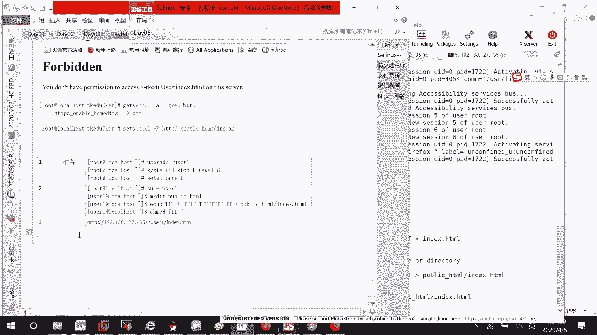
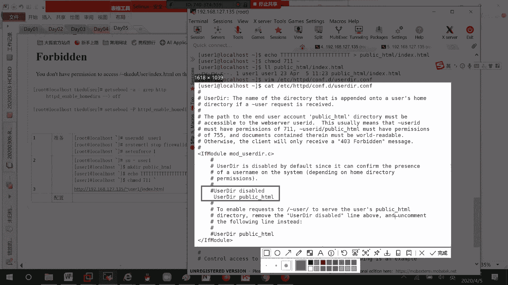
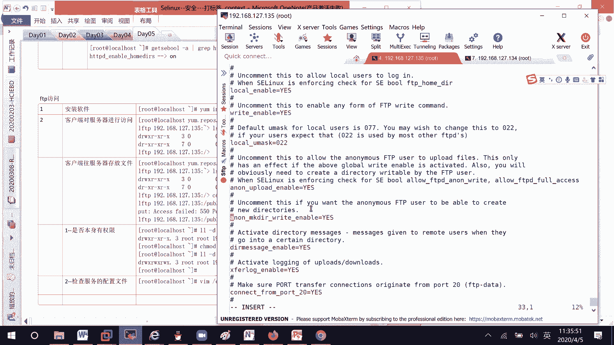
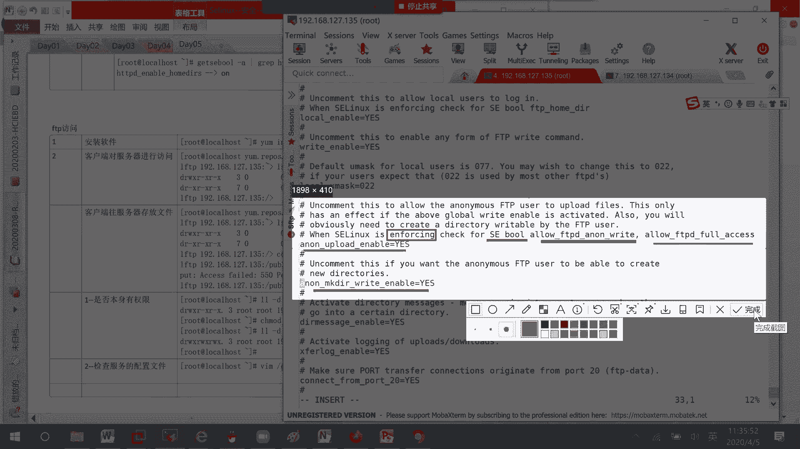
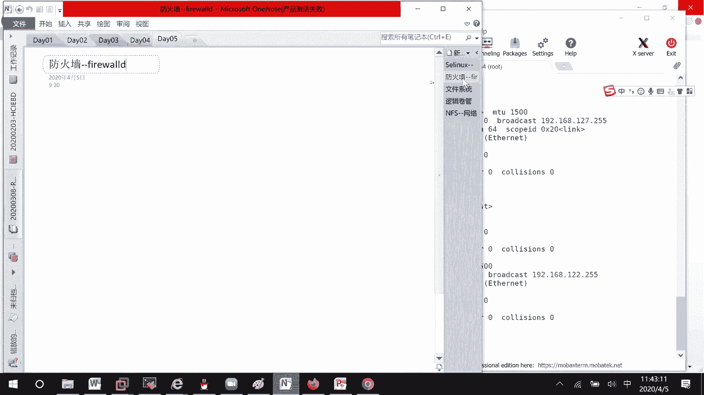

# RHCE8.0视频教程【45课时】 - P19：20200405-RHCE-02_recv - 六竹书生6682 - BV1su4y1Z7sJ

啊这边的话呢就是对于这个目录的一个访问，刚才不是做失败了吗，这边我们重新来做一下，首先第一步的话呢准备工作我们来做一下，比如说我这里是针对于某一个用户，叫做user一这个用户好吧。

那这里也就是说user add user一用户，然后呢接下去我把防火墙给关了，system control stop，然后还有一个的话呢就set in force，一把它给开启起来。

然后接下来的话呢我们来看一下，现在接下来要做的第二个准备工作，就是切换到我们的一个叫做user 1，这里我的话呢比如说make dir public html，然后的话呢在它里面我的话呢去创建一个文件。

pch一个文件叫做index html，然后呢我往里面的话呢去写一些东西，叫做嗯很多t吧，进入到index当中去，这边的话呢我们先不管，我把他的一个权限改成711好吧，就这个目录因为能执行其实就可以了。

等一下哦，我文件创建错位置啊，把它创建到public下面，lol这个叫做public index，它其实默认有一个读权限哦，我知道了，是我最开始的时候，我刚才好像加了一个减r对吧。

对这边的话呢就是说切换到我们的一个叫做，user一用户，下面这边的话呢嗯把这个目录创建起来，然后的话呢把这个文件去创建一下，然后下面这个嗯他家目录下有个public的话呢，因为到时候可能要被去执行嘛。

这里的话呢，你可以把它权限改成一个，叫做711的一个权限，其他的就没有什么样的一个问题了，然后接下去第三步的话呢，因为等一下是希望通过http冒号斜线斜线，192168127。135波浪线user 1。

然后后面的话呢去跟上index去找，就说能打开网页吗，所以我们这边的话呢需要去进行一些配置。

第一个配置的话呢就是user http，它下面有一个叫做user configure的一个目录，你的话呢只需要，其实只需要把这个井号给注释掉，把这个井号给打开就行了，我现在的话呢因为刚才已经写了吗。

把它们写在一起了，你就这样子就行了，下面这里的话呢也也有说，又说到时候的话呢怎么样去进行一个访问。

好吧，那好因为这个是对我们http的一个配置，所以这边我们要做的一个事情的话呢，就重启服务，sister more，system control restart，我们的http v。

因为刚才那个配置已经做过了，所以我就没修改了，这边配置完毕了之后的话呢，其实我们直接去访问的话呢，他访问不成功，我们需要去修改sa类s一布尔的一个值，修改布尔值。

它这边的话呢我们去获取到所有的一个布尔值，因为它是和我们的http v是相关的，这边他刚才默认的话呢，是一个叫做off的一个状态吗，对吧，所以的话呢，我们需要把它改成一个叫做on的一个状态。

这边的话呢怎么样去进行一个修改呢，set s一布尔警惕对谁呢，对他修改成什么状态呢，on哪个状态吗，那等你修改完了之后呢，这边到时候再去查的时候，它就是一个on的一个状态了。

然后呢你到时候再通过浏览器去访问，应该就可以看到里面的东西了哈，哦可以了，刚才我就说一直防不成功的原因是什么呢，阮言顺看出来了，就是我刚才在修改权限的时候，不小心跟了一个叫做。

把这个目录以及目录下面的文件的话呢，全都给修改了，那七一的话，因为阿帕奇作为其他用户去访问这个文件的话，那就没有执行权限了吗，对不对，他就没有执行权限了，是这个就是说没有这个权限好吧。

这里的话呢嗯这个布尔值你们可以去试一下，还有一个的话呢你们去试一下，这个叫做f tt f d b，因为f d b的话呢，在我们考试当中，他现在也不去考了，我这边跟你们去提一下怎么样去做好吧。

因为ftp的话呢你经常涉及到，就是说比如说往上面去写入匿名用户的话呢，是不是去写入东西啊，所以第一步我们先去安装软件，去安装一下好吧，刚才这个就到这里结束了，应该没什么问题，是我的问题。

就是说没有去发现那个读的一个问题，ym install vs ftp，稍等啊，减y，等一下哈嗯我看一下aa哦，我知道了，因为刚才系统重启过，摁一下，这边的话呢已经去安装好了。

就比如说我这边f t t去登录一下啊，重启一下system control restart，然后这里的话呢这台我单做服务器端，我再去开一个客户端好吧，等一下哈，好这边的话呢就这么两台设备。

一台设备的话呢135135的话呢，我把它去作为一个服务器端，另一台的话呢，134它作为一个客户端去进行一个访问，这一排，因为是客户端的话呢，我把他的比如说sa linux啊，这些东西我全部把它给关闭掉。

好吧，虽然说没有影响哈，far wor，然后这边要去访问另一边的话呢，他需要比如说有一个ftp的客户端，是不是才可以去访问到135啊，他这里的话呢就是说嗯没有去安装这个ftp，没有安装l ftp的话呢。

没有办法去进行一个访问，要么点reporter，啊叫做nt d v，下面的自定录到tk e d u135 ，要么拼土豆，估计这个装不起来，诶可以去装，那好这装起来了之后呢，我们去访问192168127。

135吗，这里的话呢就直接进来了，那好我这里l s一下，可以发现的话呢，在我们135上面是不是还可以看到这个pob，还可以看到这个叫做share soft，因为它这里嘛叫做vr ftp。

下面的话呢有这两个文件，这个vr的一个目录，vr下面的ftp的话呢，就相当于是他的一个加目录，好这里第二步，客户端对服务器进行访问，确实呢也看到了，然后下面这里的话呢嗯很正常。

我是不是可能要把本地的什么文件，把它给放上去啊对吧，我这边先退出来哈，我这里随便touch一个aa bb两个文件，然后呢现在，我比如说进入到pob目录，太让我进来了，我比如说put aa文件放上去。

这里出现了一个问题，叫做permission 550的一个问题，客户端网服务器存放文件，出现了这个问题，像这个问题的话呢，我们怎么样去进行一个解决呢，他这里要解决的东西就比较多了。

第一个去看一下是否本身有权限，就好像我刚才在做http的时候，那个文件根本就不能被读，还想要去访问，这是不可能的呀，那这边的话呢我们就去看下pob目录嘛，v r f t p pub pub的话呢。

你看因为我这边是通过匿名用户，来进行一个访问的吧，那就说是其他用户，其他用户的话呢有没有权限，有没有写的权限没有，对不对，所以这里change mod，比如说叫做757或者777吧。

v a r f t p pub好，首先第一个第一个因为我权限开的特别大，下面这里呢好了之后，第二个因为我这登上来的时候呢，他根本没有让我输入用户名和密码，说明是使用匿名用户去进行登录的。

所以第二个的话呢，我们来看一下，这个服务允不允许匿名用户去进行一些写操作，好吧，它的配置文件的话呢是哪一个呢，叫做etc vs f t p v s f t p can big文件，稍等，然后的话呢。

这里enormous enable表示匿名用户可以去登录的，之前默认是一个no的一个状态，好像有同学问我就是嗯ftp为什么不能访问，这个一定要记得去改一下哈，然后接下去的话呢。

它下面这里还有一个叫做anormal upload enable，这个是注释掉的，说明呢是不可以的，知道吗，就是说不能网上传文件，如果说你想要去嗯创建目录啊，或者怎么样，你这个也得去把它给打开。

也得去打开。

所以这里两个选项你自己去做一下，其中在这个选项的时候呢，upload允许传，第二个呢允许网上面去写入东西，这里你看when s1 linux is enforcing，也就是说是开启的状态。

你要记得去看一下s一的布尔值，允许ftp animals right和这个for access，你要把它给打开，能明白吗，如果说你这里把它yes起来了，如果这两个我等一下没有打开呢。

它也是不能去进行一个访问的。

有时候一些注释信息的话呢，可以去看一下this control restart vs f t p d好，这里已经启动了哈，我先退出来进去，然后呢cd tb因为权限也给了嘛，拓展诶直接就给了哈。

我看一下aa他这个直接就放上去了，我看一下get in birth，哦好吧，这个刚才是自己重启掉了吗，等一下诶，这个已经是一个高效好吧，等一下我这边先退出来再进一遍，嗯好，哦我创建的是一个b文件。

这边的话你看刚才这个能成功的原因是sa linux，没有在没有在，然后现在的话呢，我就说把他的一个sa linux给开起来的时候呢，他是不是又出现了一个问题啊，刚才是一个550的问题。

现在是一个叫做533的一个问题，put access f，那像这个问题的话呢，其实我们能解决的也只有这个叫做第三个了，s1 linux的一个问题，因为这边有说嘛，如果sa linux你是开启状态的话呢。

一定要记得把那个叫做嗯，把那个叫做s一布尔值的话呢，自己去修改一下，自己去修改一下，那好这边的话呢我们来修改一下，它修改的一个方式嗯，稍等一下sese哦，先退出这里。

it s托尔杠a我的话呢要去查找什么东西呢，a l l o w下划线f t t a，a f t p d，a n n，等一下get s e不啊，我是又查错了吗，等一下有啊，然后这个的话呢。

grape f t t d，我刚才是哪里写错了，哦多了一个n a分就够了，你看这个right的话呢，它是不是一个叫off状态，那这个是不行的，那我的话呢是不是要把它给开启起来，set s e布尔减p。

然后呢这个东西碰一下，这是一个，还有一个呢它是f t p d for access，他的话呢也要去看一下，这个的话呢是人家人家要求你去开的，这就没有办法去解释了哈，for access也要弄一下。

等一下好，这边开好了之后，你看我来退出一下，再来进一下city club，could be，这个时候的话呢是就没有什么问题了，所以有时候的话呢，第一个就是说文件本身有没有呈现第二个配置。

相关的配置做了吗，第三个s1 pro的一个值，基本上sa布尔只要修改的话呢，它这边都会有一些提示的，像我们刚才去修改ht http的时候，等一下etc，cb etc h，等一下http t，等一下。

我这怎么这么神奇啊，历史命运就这么一点点了吗，134，134，那估计我知道了刚才会重启的原因，估计是设备连到另一台上面去了，但这个的话呢不影响我们去学习，这个叫做s一波，值，不影响我们去学习sa bo。

像如果说你你去修改这个，比如说user di r的话呢，它上面这里，它下面这里可能就是说会有一些提示吗，会有一些提示，这里好像刚好没有提示啊，比较惨，我看一下as public this is the。

这个你看这里，this usually means user id，就某个用户吗，必须有711的一个权限，是因为我刚才改这个711的原因是什么呢，你如果说想要去访问这个目录，那需要去进行一个执行。

所以需要把这个pop的权限改成711，但是你们不要和我一样加一个大r，知道吧，下面的就不需要去进行一个修改了，就不需要去进行一个修改了，然后的话呢像里面的话呢，需要有个七五的一个东西好吧。

如果说你权限可能没有去设置的话呢，可能会出现一个叫做403，403，其他没什么东西啊，就这个东西s一布尔值的话呢，你们有这个概念就行了，他是在sa linux之后生效的。

如果sa linux本身没有开启的话呢，这不值是没有意义的，s1 linux开启了之后，布尔值没有开启，可能某些功能不能去进行一个使用，能听明白吗，然后上午内容的话呢，我们就讲这么多。

下午的话呢讲防火墙。

如果这些内容今天讲不完。