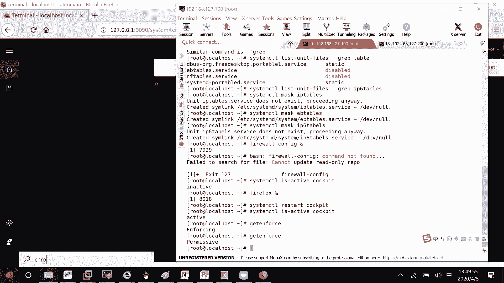
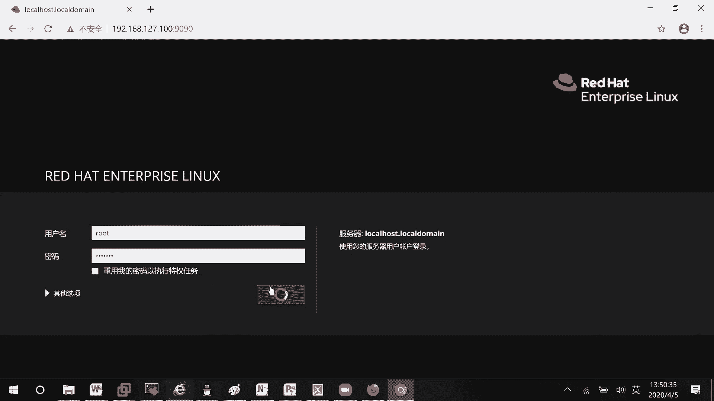

# RHCE8.0视频教程【45课时】 - P20：20200405-RHCE-03_recv - 六竹书生6682 - BV1su4y1Z7sJ

那这边的话呢我们下午来开始上课，今天下午的话呢就是说要讲什么东西呢，主要就是说来讲这个防火墙，就是和安全相关的一些东西，这个防火墙的话呢他在考试的时候怎么去考呢，他会去给你一个服务。

比如说s s h服务，我的话呢，这边可就是说，这边可能有一批的用户可以去进行ssh访问，这里一批的用户不可以去进行ssh访问，这个的话呢就是啊，我们防火墙这块要在学习的东西好吧。

这边就是说在和安全相关当中的话呢，它防火墙我们就是说会有很多种类型嘛，第一种的话呢是我们的一个叫做firework，以前他这个的话呢，就是说底层是去调用我们ip tables的一个东西吗。

但现在这边的话呢它有一个叫做nt f，叫做network of flatter，就是说嗯稍等一下，为啥他的话呢有一个东西叫做network letter，a network，没有问题啊。

net f i l t r的一个东西，这个东西的话呢就说用来对一些端口啊，对一些服务啊进行一些过滤的，知道吧，那好我们除了这个叫做发world之外，之前的话呢我们是不是还接触过其他的。

就能不能来进行一个访问，像这个呢只是说我没有跟你们说具体的名字，tcp的这个有一个文件是etc叫做ho嗯a l o w，还有一个的话呢是我们的一个叫做e t c，horse deny。

这两个文件还记得吗，这个的话呢是不是就是会允许优先于拒绝啊，上次应该在讲f t p还是讲什么的时候，是有讲哦，s s h的时候，这个允许优先，这个什么意思呢，就是说。

如果这两个文件都没有进行任何配置的话，那他这个etc allow或者deny的话呢，它都不生效，然后接下来第二个，如果dnine中配置了，那么用户在dna中存在的话，就不能进行访问，对不对。

然而还有一种情况呢，如果想要让用户访问的话，可是不是可以把design当中的给删掉，还有一个的话呢，allot中配置了，如果a l l o w中配置了，那么去访问应用访问服务的时候。

首先会看这个白名单当中是否存在，用户如果不存在的话，那就直接不能去进行一个访问，这个应该还记得吧，他的话如果这个a l o w配置了的话呢，它是允许优先，也就是说先来看这个文件，这个文件找不到的话呢。

那好所有的用户都会被进行一个拒绝，好吧，那我看你这个实验的话呢，我就不再去进行一个演示了，s s h那个章节的话，那应该是已经讲过了，你们回过头去看一下哈。

今天的话呢就主要来讲我们的一个叫做firework，他的话呢在我们系统当中对应的服务是什么呢，这个by word，我们现先来查看服务的状态好吧，稍等一下这个服务状态的话呢，怎么去查看呢。

这样子system control is active by war，因为我早上的话呢把它去给叫做禁用掉，所以这边的话呢就是一个呃，第四in inactive的一个状态吗，那现在这边的话呢。

如果说我想要把它给启动起来了，system control restart firework，这样子就可以了，启动服务，因为在企业当中的话呢，像你这个防火墙基本上会开掉。

不然的话呢有时候像什么勒索病毒啊，或者其他的一些远程攻击服务啊，直接攻击进来，那肯定是不安全的，对不对，所以这边的话呢一定要记得把它设置为，开机自动启动的一个状态好吧，然后呢这边你们可以来检查一下。

system control studies by w，这边就是active，这边就是一个enable的一个状态就可以了，这个防火墙的话呢，嗯它有很多的，就是说嗯。

很多软件可以去进行一个防火墙的一个控制吗，is active，你看啊，我们来查一个我这样子吧，system control list unit fire，我就去匹配一个和cable short。

多了一个e，我就去匹配一个和tb相关的，这边的话呢有eb tables，然后的话呢像以前还有什么ip 6 tables，还有一个叫做ip tables，他这些全都是。

我现在来看一下能不能查到ip 6 tab，这边的话呢查询不到了，查询不到了，所以像这个eb tables啊，它全都是和防火墙相关的，我们的话呢就是说避免他们之间会有冲突的话。

可以把它可以把这些没有用的给关删掉，你看system control stop，或者的话呢直接把它给禁用掉吗，mask ip tables，稍等哈啊，你们能不能听到我说话，你们能不能听到我说话。

我哪里回我一下，这边的话呢，就比如说像这个ip tables，我们可以把它给禁用掉，就考试的时候呢，如果你没有禁用，关系不大，我这边禁用呢只是说避免有干扰吗，然后还有一个mask。

像这边我们查询到的异地tables，还有一个的话呢，ip 6 tables，not exist，它这里这个i p6 是不存在的，所以呢我们只要去关闭这两个就行了。

iptables 1 be tables就好了好吧，然后这边的话呢是前期的一些准备，避免后面的话呢有问题啊，现在的话呢我们来看一下，就比如说现在我们先去看一下，图形化的一个配置界面。

如果说我们用图形化配置界面呢，以前都是这样子的，firework嗯这个，但现在的话呢嗯稍等啊，现在的话呢firework configure的话呢，基本上是打开不了了。

我来给你们在里面去打开一下，打屁股了啊，were叫做config，命运都没了。

那现在的话呢，就比如说我想要去做一些图形化配置，怎么办呢，他这里面的话呢，先把一些图形化界面全都把它给集成起来，有一个bb console，这里的话呢我们先去把一个服务给启动一下，叫做。

我看一下那个英文单词，这个c o c k p i t，那个什么驾驶舱的一个意思，这个默认的话呢就是说它现在是关闭的，它是关闭的，所以的话呢我们是没有办法去进行一个打开的，没有办法进行打开哈。

five box先给你们来打开一下，等一下，127，127点点0。1冒号9090，他这里的话呢不能去进行一个打开，我们现在如果说把这个服务给启动，system control restart叫做q。

然后呢现在再来检查一下，他现在的话呢就是一个active的一个状态，然后这个时候呃我再来去刷新一下他的话呢。

如果你们第一次打开的话，基本上这里会出现一个不安全的连接，你直接选择一个叫做高级，他的话就是说把那个证书给忽略掉，他的话呢就可以进到这一块了，明白吗，那好，这边的话呢。

嗯使用一个系统当中存在的用户就可以了，我比如说用r o o t登录密码的话呢，我按要求去写一下。

好吧，然后他这里就进来了，稍等一下哈，这边的话呢就是说我系统的版本是怎么样子的，系统运行的一些情况是怎么样子的，所以在这里都能看到实时显示的，然后呢这里就是一些日志信息。

就是说啊我之前是不是有一个说什么s e linux，它没有提醒我嘛，对不对，就这边的话呢它可以去进行一个实时显示的，然后这里就是一些存储的一个信息，稍等哈，这里存储的信息，可能这个是我光盘有六点多个g。

对不对，然后呢旁边这里比如说read有没有做啊，逻辑卷有没有做啊，v video有没有啊，i cast有没有去做啊，都可以去看到，以前的话图形化界面没有这么聪明，没有这么智能。

然后这里networking这里的话呢，你看防火墙就在network这里。

networking这里嗯。

就是说红帽八的话呢，我觉得到时候你们去考试的时候，图形化界面打开应该没有什么大问题吧，因为之前七的话呢，它不是这样子的一个界面，他就说每个软件都需要去安装的，相对来说的话呢，他需要的资源会多一点。

知道吧，这边account的话呢就是我们用户的一个管理，如果说你想去添加一个用户就correct吗，所有的信息自己去设置一下，这里service就是一些服务的一个状态是怎么样子的。

比如说我要去设置这个服务，那你去点一下嘛，他等一下的话呢，这边会加载出一些信息，你要给他stop掉还是disable掉，都有非常的智能，这里application就是说当前运行的一个状态，这里没有哈。

然后这里的话呢就是进行一些诊断，就有时候可能设备故障了，你要去收集信息啊，就这里进去correct report就行了，因为需要比较久的一个时间，我这边就不去演示了。

你们到时候去correct一下就可以了，知道吗，然后这个的话呢就是一些内核相关的一个东西，我这个的话呢是把它给关掉的，因为我本身就是一个测试的系统嘛，如果系统崩溃了，我也不需要去恢复啊，对不对。

然后这里的话呢是我们sa linux，你看这边现在是一个开启状态哈，稍等，get enforce，是不是enforcing，我如果说把它给关了，是这个p开头了，所以它这个的话呢是一个实时生效的。

明白吗好吧，然后这里的话呢像出现了一些问题啊，这里一些审计信息，你都可以去进行一个查看的好吧，因为就产生了要有两条，有两条，然后下面这里呢比如说软件要升级啊，要更新啊，他这边的话呢你你只要就是说有联网。

有注册，他都会给你推送的，因为咱们这边的话呢不去注册嘛，红帽虽然软件是免费的，但是它的一个服务呢是收费的好吧，这也是为啥人家能发展工资，然后这里的话呢就是一些订阅的一些信息吗，订阅的一些信息。

然后这里的话呢，就是说你们有些可能不通过这个去连接在这里。

terminal你也可以去挑一些命令的，知道了吧，只要你把设备的，比如说9090端口给开放掉了，那我就可以去连接进去嘛。

只是说因为我为什么要通过终端这里打开firefox，进行连接呢，如果说外面这里去连接呢。

稍等一下，你看这里叫做192168，他的话呢127。100吗，冒号9090，线是可以诶，等一下，127。1版，等一下，这好像是中文。

高级，然后呢安全其实就是说你有一个浏览器的话呢，这里也是可以去进行一个连接进去的，好吧。

这就没什么问题啊，这个我这边是中文的，然后的话呢为什么我可以连接进去呢，你看它默认就帮我把这个9090给开启掉的，所以我可以直接连接进去，就好像我为什么直接可以s s s s s h进去呢。

它的22号端口默认也是开启着的，这个能听明白吧，这能不能听明白。

这应该能听明白哈，这个的话呢是一些图形化界面的配置，相对来说比较简单一点，我的话呢就不那么详细的去说了，我们这边的话呢就是一些命令行的操作，跟你跟大家说一下好不好，首先的话呢来看一下。

还是要辅助图形化界面，这边的话呢进来了之后，比如说我想去添加一个服务，这边的话呢，是不是有很多很多服务可以给你去选择啊对吧，然后这边的话呢它的一个功能线的话呢，我看了一下，也没有那么的一个完善。

没有那么完善，为什么这么说呢，在我们的一个叫做嗯，防叫做在在我们的一个网络安全配置当中，它有一个叫做区域的一个概念，稍等哈，这里区域的概念什么意思呢，就相当于的话呢你看我这么一台服务器。

我是不是会有很多个接口啊，而且如果这台服务器是放在，比如说一些比较不安全的一个区域，那对于这个接口的话呢，我是不是要配置一些信息啊，1号接口，2号接口，比如说在一个叫做比较安全的区。

那这里的话呢是不是要去配一些其他的一些，安全规则的一个信息啊，所以的话呢你可以这样子去想这种区域的话呢，它是一些规则的一个集合，然后把端口放在这个区域当中，那这个接口的话呢。

就有这个区域他的一些权限能明白吗，就相当于你们在学数据库啊，在学用户管理的时候，如果说我去创建一个角色，角色就相当于我们这边说的一个区域，然后我这里如果有用户用户，就相当于是我们的一个叫做网口嘛。

我属于这个角色，那那这个去允许哪些啊，允许哪些叫做连接进来，那我这个用户的话呢是不是也能去允许啊，你可以这样子去理解，这里的话呢，它的区域内置了有几个呢，block默认来的全都拒绝掉。

dmz非军事化区域，基本上的话呢，就是说我们的一些服务器公司当中的服务器，会放到dz当中去，还有一些dra吧，也就是说来了一些数据之后，到了这个区域呢，我可能都会去丢弃掉，还有expo。

这个的话呢就是说去连接一些外网的一个，还有这个home连连接我内部的一些区域啊，就是说呃用户啊什么的比较安全的，还有一个呢in internal，这个呢是连接内部的一些网络。

还有public public，就公用的默认情况下，所有的网口它就属于这个public区域，还有一个叫做chest t r u s t e v，这个的话呢是一个绿色区域信任区域，还有个work工作区域。

它这个只是几个标签，你的话呢像有一些比如说服务的话，自己添加进去，把接口，然后呢，把接口就说把接口滑到这些区域下面就行了嘛，好吧，这边的话呢我再来强调一下，这个叫做区域的一个概念，好吧，区域的话呢。

你就把它想成一些嗯规则的一个集合，比如说我们这边有一台服务器，然后的话呢它有很多个网卡，然后接下来的话呢你看啊，就是说这个网卡，比如说这里是1号网卡，这里是2号网卡，然后呢这边是一个3号网卡。

这边的话呢比如说4号网卡，如果说我要去访问这台服务器的话呢，是肯定会通过1号或者2号或者3号或者4号，把数据给发送进去，这些的话呢是不是就相当于服务器的门啊，那好如果说我发送进来的时候发送给1号。

我这边的话呢，比如说要进到这边的叫做http服务，就是说要从这个园区的门口进来的时候，要去到518室吗，那你来想一下，首先这个人就是说这个数据包进来，是不是要有五要这个门口的话呢。

是不是要去放行去518室的一个通道，那这个通道的话呢，就是我们等一下在这个网卡上面要去配的规则，像我们平时说的八零端口啊，23端口啊，22端口啊，9090端口啊，其实都是在就是说在这里数据进来的时候。

我这里呢有个防火墙在这儿，比如说这是防火墙，它会去检查每一扇门的话呢，都有一道防火墙，他会去检查这个八零端口，我是能穿过去呢，还是不能穿过去呢，如果能穿过去的话呢，那好这里的数据它就能进来吗。

不能穿过去呢，他就不能进来了，能明白吗，你可以把这个防火墙想成是啊网卡爸爸看一下，我这，到我们内部应用的一堵墙，如果说你把规则给开放了，那好这里相应的就有一个洞，后续数据就可以从这个洞穿过去。

默认情况下所有的洞全都是关闭的，那数据就进不去吗，啊这里能不能理解防火墙，我说能不能理解，能理解的话，在群里回我个一好吧，不能理解的话，那我重新去讲一下，因为后面的话呢我们就要去进行一些配置了。

进行配置，因为我是有家，好如果能理解，那我就继续了哈，那好现在这边的话呢，因为就是说在我们的区域下面，绑定了一些规则嘛，区域下面绑定了规则，我们现在这边的话呢先来看一下。

就是说我这边不是说了这么多区域吗，是我口说的，可能万一不是这些区域呢，所以现在的话呢来教你们查看区域，区域怎么去查看呢，它这个命令都是这样子的，fier cd减减list，哦不对，减减get zs。

让我们看到包zoos查看区域，你看这边它还多了一个叫做liberty，就是说和那个虚拟相关的一个区域，所以现在的话呢12345678 90，总共的话呢有这十大区域，在我们八版本之前的话呢。

只有前面的九大区域，在十在七版本之后就多了这个区域，虚拟化相关的好吧，那行这个区我们都已经看到了，下面的话呢我们来查看默认区，看一下现在的默认区是不是public吗，cd减减。

get the force zo，你看是不是就是public，为什么就是说我要让你们去查看默认区域呢，因为等一下你的一些配置，其实是针对于区域去配的，这里注意一下后续的配置，针对区域去进行配置。

然后呢区域关联的接口，就立刻生效了，能明白吧，所以呢你首先要知道默认区域是什么，因为我网卡没有去指定默认区域的话呢，它就是属于我们这个叫做，就属于我们这个帕布里克区域，那好现在如果说我想要去调整网卡。

网卡的区域呢，我这边的话呢避免我的，因为我这根线不就只有一个网卡，叫做e n s160 吗，我怕他这个网卡的一个，我如果去调整它的区域，y1 s s h不放心的话呢，网络就断开了。

我这里去给他加一个网卡上，之前有人问，就说网卡怎么去加，你看一下这边右击设置一下。

他的话呢就可以弹出虚拟机设置了，就这个标签卡点击设置，然后下面这里添加，你想要添加什么都可以，网卡叫做网络适配器好吧，稍等一下啊，这个等一下去用，我先给它添加起来，好好等一下。

那好这里的话呢就让他放后后面添加吧，我现在的话呢不要调整网卡的区啊，比如说调整默认的区域来看一下怎么去调整，发work cmd，减减set default room，比如说我把它改成home，可不可以。

稍等一下，你们再来看一下这个是不是就是一个home啊，所以这条命令的话呢就调整默认区域，我现在如果说把服务区嗯叫做启动一下吗，system control restart the world，我没干嘛。

我就想启动一下，就比如说像设备重新开机了嘛，你看他这里的话呢，区域是不是还是一个叫做home嘛，还是一个home好吧，这没什么问题啊，但是好像他这边的话呢，嗯没有去把它给模拟出来，你看对吧。

他这边的话呢怎么样呢，只有就是说他这边只能看到，默认是属于哪个区域的，我这边再去给你们去调整一下，比如说把它去改一下，改成dmz区域，稍等一下，我再来查询一下点，在我这边来重启一下看，等一下你看这里的。

线能看到吗，现在能不能听到干架，好像断网，断了一下，还是那，嗯好好好好那行啊。

