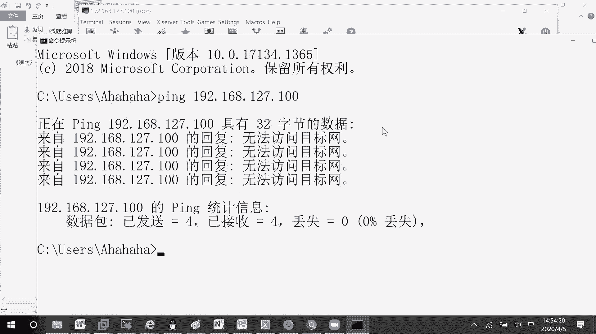

# RHCE8.0视频教程【45课时】 - P21：20200405-RHCE-04_recv - 六竹书生6682 - BV1su4y1Z7sJ

下面这边的话呢我们继续再来看一下哈，他这里的话呢我们刚才就是说list all，他是不是可以查看到很多东西啊，像interface我们说了service呢，我们也说了。

这边的话呢是不是有个叫做pose的一个东西，端口的一个东西，我这边的话呢就比如说嗯这个是我电脑，他的话呢想要去访问那个站点，很正常吧，在我这个服务器上面是不是有一个稍等一下。

是不是有一个叫做网页可以去打开啊，这边127点点0。1呢，就是内部在通信的时候，他可以去通信的，那如果说我自己的物理电脑现在的话呢，它的一个环境是这样子的，就是说这里是我台物理机。

然后呢下面这边的话呢是一台服务器好不好，我自己能访问自己，说明这个应用的话呢，线是没有问题的，然后呢我这边物理机的话呢，想要去访问这台服务器，可以发现不能成功，那这个原因有哪些呢，是不是我们能考虑的。

第一个是不是能拼通啊，第二个的话呢是什么样的一个问题，通的话肯定能通的，为什么呀，我们这边不就直接连上去了吗，或者你不放心的话呢，自己去测试一下这个100的一个地址嘛，好吧，我去拼一下哈。

就这个诶不是这个点错了哈，就这台应该有一个ping。

你看是不是这个127。1版呢是空的。

说明我和它的一个连通性绝对是没有问题的，下面这边的话呢，那我们就要去想127，它是不是属于我们这个ins 160，那这样子的话呢，我们来看一下我这个e n s160 的话呢，它是属于哪一个。

就是说属于哪个区域的好吧，这边的话呢我们可以怎么样去看呢，就这样子发were 3 d list，后面这里的话呢他只能去指定某一个room，这边的话呢咱们指定不了，就直接一个一个去查嘛。

看到它是不是属于我们这个叫做public区域呀，稍等一下嗯，比如说现在呢想访问，http服务，然后这里的话你第一步查看相应的端口，它的规则，我们这里的话呢可以看到service空的。

其他一些东西呢都没有http相关的对吧，所以它的一个解决办法的话呢，有两种，第一种添加服务，我们添加完了之后呢，再去试一下，看成不成嘛，我现在呢就不去永久添加了，我就去临时添加好吧。

add service http，这个时候我如果通过嗯，192168127。100，是不是就可以访问的，看一下刷新一下是不是就可以看到，那如果说现在把它给移除掉呢，remove，移除掉了之后呢。

人家肯定就不能去访问了吗，再过一下它就会出现另一个界面了，我们来看一下，刚才我们这边说了，比如说想要去访问，比如像http啊或者其他服务的时候，后面为什么跟上一些http这个信息就可以了。

其实对于我们来说，如果直接问http监听的端口是多少，我们第一反应是八零端口，或者s h监听的端口是多少，第一反应是不是20啊，所以的话呢像这些服务，它其实就是代表了一些默认的监听端口。

如果说你现在http开放的是8080端口，那这样子就行不通了，我们来试一下哈，我们来试一下好吧，叫做修改http的监听端口，这边的话呢我先把sa linux给关闭了。

v i m e t c h t t p configure，http configure，因为这个是早上http已经装过了吗，然后呢下面这边你们来看一下，比如说我现在要去监听8080端口好吧。

因为8080端口还是是比较多的时候，会用到的嘛。

好了之后的话呢，我们来重启一下服务，system control restart http，这边的话呢咱们来检查一下n t u l p，去grape一下http这条命令应该知道什么意思吧。

看一下我服务器上的一些网口，它监听的端口有哪些，你看这边grape的http是不是就有8080啊，虽然这边写的是一个t4 b6 哈，他tcp 4的话呢好像都没有显示出来，好吧。

那行现在的话呢我们先来内部去访问一下，等一下127点点0。1，因为刚才这个哦这边有稍等一下，我看一下啊，其实他后面应该加一个8080，刚才能出现的原因的话，那可能是一个缓存的一个问题，知道吧。

可以把缓存给清空一下，现在这边的话呢，我外面你看这边他是不是访问不到，如果说我去加一个8080呢，其实他也没有用的服务没有开吗，我们还是按照之前的老方法，比如说把这个http给添加进去看行不行。

i were，哎不不不应该是a吧哈，然后你看我把它给添加上去了，因为这添加这条命令的话呢，就相当于去开放一下我们的一个八零端口，哦不对，就相当于去开放http的8080端口。

但是现在的话呢我们是通过8080去访问的，肯定是不可以的，明白吗，肯定是不可以的，所以这边的话呢我们要去开放一下，特定的一个端口，怎么样去开呢，先把它给移除掉，remove诶，先把它给移除掉。

remove，就说明这个现在的话呢它是不生效的，不生效的那行，我现在的话呢就是说去添加端口好吧，怎么样去进行一个添加呢，fire cd add port 8080，像我们这个去访问的话呢。

它是不是一个叫做tcp协议，所以这边的话呢就可以看到，所以后面这里呢我们就跟上一个tcp，能明白吗，好这个端口已经添加上去了，现在我们再来刷啊，现在刷新都不用刷新了，因为刚才可能在一个刷新状态吗。

所以的话呢就可以了嘛，对不对，所以这里的话呢就可以去看到了，如果说我再把这个规则给移除掉了的话，那他就不能再去访问了，你们这边的话呢要知道的一点，就是说服务就是特定的端口而已。

后面这边的话呢如果说它不是那些公有的端口，你就需要写上这个add port的方式去进行一个添加，能听明白吗，那好这个没有什么样的一个问题啊。

下面这边的话呢我们再来看一下fever cd list all，然后的话呢这边可能我现在的话呢，是不是允许某一个东西叫做ssh来访问啊，或者dh cp这些东西来进行一个访问，来进行访问。

现在呢这里是还有一个叫做s m p blog，有时候的话呢服务器相对来说，如果说嗯你把ping打开的话呢，是一直会被骗啊，就不安全吗，我们这里的话呢如果说想要去禁止p。

也就是说通过防火墙去把这个聘包给禁止掉，就说不想让别人的话呢给我再去发聘包嘛，我们来看一下它这个ping的原理是怎么样的，但我之前测试的时候呢，嗯不太一样，因为这个在书上没有讲哈，我自己去测的。

你看比如说我这边是一个服务器，如果说这边是一个攻击的设备，首先是不是他不断的去发起聘包，这个包发送过来的话呢，是什么呀，是不是request，不断的去发，那第一种方式。

我是把这个把这个request就是说主色调了之后，我是不是应该就可就说不不会，因为我把这个request给阻塞掉了的话呢，是后期就不再可能给他去发送，这个叫做reply的一个信息，如果request。

被阻挡了，那么reply就不可能了，对不对，所以这边的话呢嗯我们来试一下，把这个request给阻挡掉，是不是就够了，这边单位c n d后面这里的话呢add，因为就是说线是和sm d相关的。

所以说sm p的话呢，后面跟什么东西呢，减等于它这里的话是所有的一些信息，比如说我这边的话呢，不是要去阻阻挡掉一个叫做request吗，那这里去给他添加，就说把这个信息给放上去嘛，你看我这放上去了。

现在的话呢这里能不能去聘他呢，稍等一下，ping你们稍等我一下，我先暂停，这边的话呢我们来看一下，就是说现在还是去pk 192168啊，雕27。100好吧，回车他现在的话呢是不是就不能听到了。

他这台是呃点100吧，我这里再来试一下，你看是不是就没有办法去访问了。

我之前的话呢在进行测试的时候，他的话呢出现了问题，但是现在测试的时候，那没什么问题啊，我现在这里的话呢再把这条规则给你们移除掉。

然后呢我们再来去拼一下，是不是又能通了。

所以像这个的话呢，就可以就是说别人给我发聘包，我不要的话，那我这里request就不会对它进行一个回复了，能明白吗，这个的话呢就可以实现我们服务器的一个竞聘，竞聘操作，然后还有一种思想是什么呢。

正常情况下是不是就是说想着可能嗯，别人给我回request，我可能分析了之后，包过大的话呢，或者包过小的时候，我去把这个request给阻止掉，这个不太可能吧，所以就是说阻止request型不同啊。

就是说可能我在给别人去发聘包的时候，别人给我回复的时候，我把它给，就是说把这一块给阻止了，他这个好像做不到哈，我们可以来试一下，因为就是说我给别人去发聘包，别人回来给我，如果被阻止掉的话呢。

那好这个通信是不是也只完成了一半啊，对不对，这样子的话呢他也不能去互通嘛，不能去互通，现在这边的话呢我们来看一下这个的话呢，回来就是一个reply，我不要别人的回复消息诶，等一下一。

coach rely，稍等哈，已扣取report life，嗯往里，not enable ecture reply，这里我要去add一下，现在的话呢你看啊再去拼一下。

他这个是能拼通的。

如果说我主动的去拼外面呢，192168127。1呢，他这个也能拼通的，所以像这里啊，因为我们平时正常在分析的时候呢，就是说require request和rely的话呢，两个你随便去阻止掉一个的话呢。

它是不是就不能去通信，但在这里行不通哈，如果你要阻止的话呢，就去把这个叫做request把它给阻止掉，那好这样子的话呢，我的一个服务器就就是说可以受到保护，别人就不能随便去聘我了吗。

阻止一个叫做ping的一个攻击吗，好吧，这就是要补充的，下面这边的话呢我们来看一下，如果说嗯我现在的话呢，想要去查看一下某个服务，是不是在这个区域当中存在呢，这个list all是不是要查询所有信息啊。

比如说我想要去看指定区，因为我知道某个端口在哪个区域当中吗，sd list all哦不对，这里呢就要用carry，比如说service h t t p，然后呢在我们的dmz区域当中有没有去开放呢。

没有在我们的public区域当中有没有开放呢，没有，如果说我现在想要去查找端口呢，query port 8080，稍等哈，后面忘记跟协议了，tcp这边的话呢是不是就yes啊，所以在查询的时候呢。

你们可以去根据一些类型去进行查询啊，比如说sam p block，像这个一coach request no以扣去reply，可以用tab键，然后就有，所以这里的话呢多种类型，你自己可以去进行一下查看。

像这个的话呢，target啊，或者interface，我们学了source，这边的话呢不去讲，他的话呢，其实就是一个圆，我们来看一下firework cd add source，就是说你可能这边的话呢。

所有的规则就是说没有去写吗，你这边的话呢比如说想要允许特定网段，特定网段的叫做什么呢，这里你看一下，我我这台服务器在这，那这里的话呢，公司当中可能有1g啊，2g啊，3g啊，4g对不对。

如果说我想要允许一个叫做一区域进来，或者就是说其他区域不能进来，一区能进来或者不能进来，那你就可以针对某一个某一个网段去设置，这个就是source等于什么呢，后面这里比如说192168。

一点零一二十四位，稍等啊，我看一下，一点应该就够诶，稍等我看一下，1921681点，这个应该是没有什么问题的，叫做诶这个命令，稍等一下，a的sc，哦那现在就可以了，这个意思是什么呢，就是说到时候的话呢。

如果是一点网段，他过来的一些就是说进来的一些访问的话，我可以都允许他都允许它好吧，这个的话呢就是说针对特定网段的一个操作，但是基本上source的话呢我们不会去这样去写。

会在这个rich roll当中的话呢，去进行一个详细的一个说明，rich roll既然讲到这里过呢，我再给你们补充一个东西哈，就比如说现在这里的话呢，我啊希望一个叫做，烧塔，如果说这里有个192。16。

8。一二点网段，我希望他能对我进行s s h，然后呢还有一个1921683点杠24，我希望他不能对我s h，嗯他这里这个的话呢怎么样去讲呢，我想一下哈，它这个圆的话呢，嗯我们这边来试一下吧，好吧。

我来看一下克隆机，我再给你们去添加一个网卡，稍等一下。

等一下。

我添加两块网卡。

诶哦对，we are not li。

我这里再添加一个群主机模式。

一个属于井主机一，一个属于警主机二。

等一下。

他这个我没记错的话，是如果说你不在圆里面的话，是会被拒绝掉的，我这边给你们测试一下，因为我这个sauce做的会少一点，那个叫做rich roll，我做的会多一点，connection。

add e n o2242 auto connect，好诶，等一下，and type in the net connection，name e n o2241 分，name e n o224 。

然后这里面还有一个叫做256，嗯一个地址的话呢是二七网段的，一个地址是一个叫做128网段的，然后这边的话呢稍等啊，n m z l i connection show，然后这边的诶不对。

发work sd list 2，然后这边的话呢source我看一下啊，我忘记了，比如说我把这个二七给添加进去，看一下136能不来能不能来访问好吧，nm哦，不不是，发were sd add source。

19216827点不对，27。024，对，然后现在的话呢我们来测一下ping，我看一下指定原去ping的话呢是i i，p i n g叫做减i，比如说e n s2247192168 嗯，127。100。

二七这里没有通，等一下，256，这个也没通嗯，我先自己骗自己啊，19216827。131，可以的呀，稍等啊。

我先进来，把某一个直接给断，先把那个网卡直接不行。

还是得指定指定原句p应该就是减i，嗯pin count间隔interface，然后的话呢l是payload，不是t是时间搓，不是size，也不是诶，这个没有问题啊，我再来试一下，192168。

270131，等一下我先看一下，不加这些吗，能通，哦好像是这样子，仅主机模式的话，估计他们是没有那个网关地址，没有网关地址，警主机模式好像没有那个网关地址，所以现在这边的话呢肯定是通不了的。

我来看一下先啊，这个仅主机模式的话呢，它是没有网关，所以的话呢不能跨网段进行一个操作，这边的话呢如果说你配置了，配置了这个叫做source的话，稍等一下，我看一下。

这边如果配置一个叫做source的话呢，他这个source进来的应该是允许呃，叫做允许这些服务通过，如果不在source下面的话呢，就不允许这些服务去通过嘛，就说两层限制，两层两层的一个限制好吧。

你们自己去试一下，你们到时候的话，那我想一下怎么样去测试哈，你们要不到时候的话呢，再搞一个桥接模式吧，好吧，网卡的话估计得设计一下，对好吧，因为我这边仅主机模式它测试不了，下面这边的话呢我们来看一个。

还有一个叫做richard rule，他的话呢就是说谁能对我s s h，谁不能去对我s s h嘛，这边的话呢我们来看一下，就之前在红帽期当中的话呢，它的一个考试有考到这么一题，他是这样子的。

firework cd，如果说你想要去添加的话呢，也是可以的，如果想要永久的话呢，还是跟上那个叫做parame，然后接下来的话呢这边去写什么东西呢，这边的话呢你想要去table。

可能就table不出来了，就要去写一下，比如说family i p v4 的source，这边的话呢不是1921682点吗，允许的，所以就是呃source a d d r e s s，1921682。

024位的，然后呢后面这里的话呢，protocop r o t o c o l s，等于s s h a c c e p t吗，这就是说去接受它，我看一下family双引号吧。

outside you rich ro，b o t o c o gotoos，等一下我找一下，s h i e l d这边的话，payment没有什么样的一个问题，我看一下下面这里carry不是这个查找。

也不是弱，add后面这里就写规则了吗，然后它的一个规则，等一下哈，我再来试一下看，ever cindy and rich rule，如果然后后面的话呢去跟上family，就比如说是ipv 4的。

然后后面的话呢再去跟上一个区域，应该source是没有问题啊，family family是对的，然后s o u r s e a d d r e s s，比如说1921682。024位的。

然后的话呢p r o t o c o l of service service，我写错了，s e r v i c e等于s h a c c e p t，s e r s e r v i c e s呢。

稍等一下，我想一下，b r o t o c o l，protoco，这个是没有问题的呀，e l e e，诶等一下多了一个l，invalidate嗯，这没有问题啊，稍等一下，我看一下36种。

因为它这里面太长了，s e r vs e ma，唉终于可以了，那这个的话呢里面信息太多了，发work sd添加规则，但这个是临时的，如果规则是什么呢，i p v4 从哪里来的呢，1921682点来的。

他可以去访问我的一个叫做ssh服务，比如说如果说现在还有个三点来的，我不允许他呢，拒绝掉吗，reject，好吧，firework cd list，然后你看它这边的话呢，就是说去组合起来。

如果说二点来的s s h服务呢，我允许如果是三点来的s s h服务呢，我不允许他这个的话呢没有办法去进行一个table，所以呢稍微会麻烦一点哈，不规则，那这边的话呢。

我记得他有一个叫做案例的mafirework cd，我找一下哈，e x a m p l e a example，service，这里不是这个，不过，哼哼哼哼哼，那这边的话呢按理文件我现在没有看到哈。

因为像这个rich的话呢，你纯写还是比较麻烦的，ritual service room online，这些都不是，这都不是，我搜索一下哈，嗯不是这个不是不是这个，这还查不到，估计不在这个文件里面嗯。

到时候去看一下，到时候考前辅导的时候呢，会去说一下在哪个文件里面，如果说有这个副规则这一题的话，好吧，就是说这个复规则的话呢用的会很多，因为它里面的话呢非常的灵活，像i p v4 。

就是说可以对上面所有东西的话，能去进行一次说明吗，然后再进行一个配置吗，好吧，这边的话呢就是呃我们防火墙所有的一个东西，下面这边的话呢我们来总结一下好吧，总结一下，因为他的命运比较多。

首先第一个的话呢我们来看一下，查看所有区域用的是什么命令，发work sd list all这个命令，然后接下来的话呢，如果说我们要去查看默认区域的一个信息呢。

firework cd get default zoom，然后如果说我们想要去看一下某个接口，它属于哪个区域呢，是不是firework sd这里的话呢减减get room of interface。

比如说e s24 ，他这边的话呢就给你去列出来了吗，然后还有说如果想要去查看区域的规则呢，那是不是这样子，fewer cd减减list，后面这边的话呢，你可以去跟上特定的一个区域再去查看吗，好吧。

上面这些的话呢是查看下面这里的话呢，比如说修改默认区域，你们自己去写，修改接口所在的区域，你们自己去写，然后呢，还有一个就是说将接口从某个区域中删除呢，因为上面这个就是说啊修改接口所在区域。

是让它从一个区移到另一个区域，对不对，那接口从某个区域当中去删删除呢，cd都是remove，不是remove，就是add，好吧，他的话呢比如说e n s224 ，他的话呢就是zoom public。

这里要注意一下，一个接口它只会属于一个区域，它是不能属于多个区域的，明白吗，如果说它属于多个区域的话呢，它不就凌乱凌乱掉了吗，那像这些接口它不属于任何区域的话呢，到时候去访问的话，规则依照谁来说呢。

是依照我们的一个叫做默认区域，默认区域的规则是怎么样，那他这边的规则的话呢也是怎么样的，明白吧，那行这个的话，那没什么问题啊，如果说他的话呢想要去加入到某一个区域，那就是at的吗，添加成功了。

那你看现在如果说我在想要把它at到dz呢，就不可以了，因为它本身已经属于public了，你说再添加这条命令，就是说加入到某个区域，就会认为现在会属于两个区域，那就会有问题吗，这里如果接口不属于任何区域。

可以使用add进行添加，好吧，然后上面这个的话呢，它其实就是说是去修改，从一个区域移动到另一个区域，移动到另一个区，明白吗，其他的话呢就没有什么样的一个问题啊，就是普通的一些服务啊，普通的一些规则啊。

普通的一些负规则。

