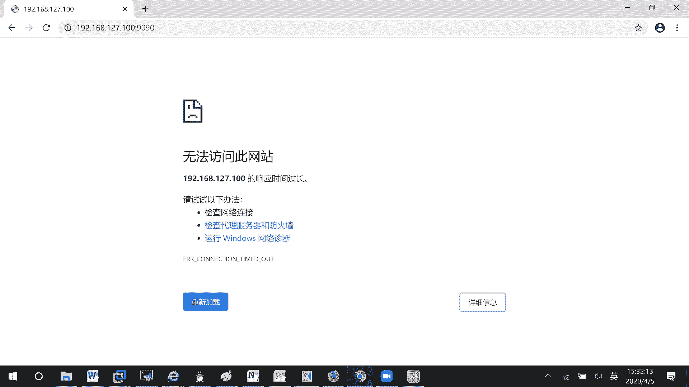
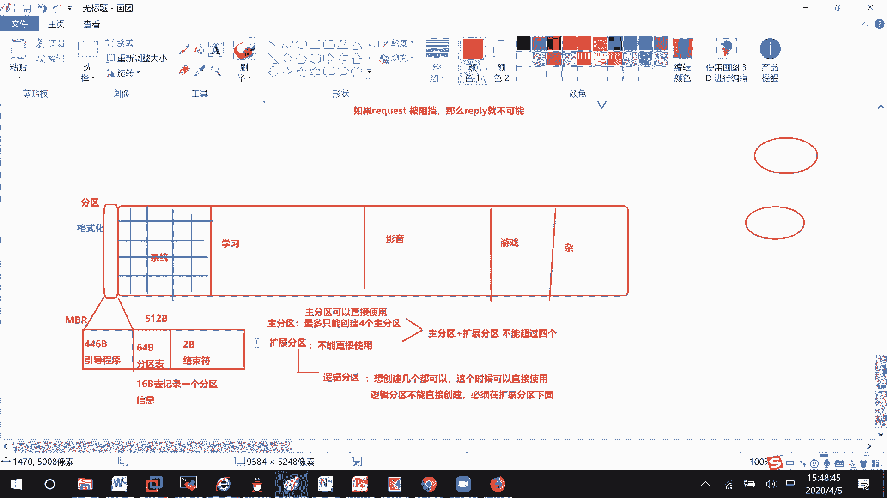

# RHCE8.0视频教程【45课时】 - P22：20200405-RHCE-05_recv - 六竹书生6682 - BV1su4y1Z7sJ

应该都在的哈，现在的话呢我们来讲一下，文件系统和这个叫做分区，文件系统和分区的话呢，在考试当中他会要求你去创建创建一个盘，创建起来了之后呢，就放在那里，可能你什么东西都不要去做。

他的话呢会去检查一些大小啊，检查一些格式啊，是不是符合我们的一个要求，明白吗，那好啊，刚才的话呢，我去给我的这台设备去添加了一块硬盘嘛，这里的话呢，如果说我想去看一下，这块硬盘有没有添加上去呢。

是不是这里有个叫做存储的一个东西，稍等一下，估计是防火墙的一个问题，ever cindy list all，诶这里有啊，二四看一下，我给他重新加载一下，哎不对，192168127 100，等一下。

那这样子吧，里面进不去，我就在外面了哦，外面进不去。

我就在里面了，这边的话呢比如说storage，诶加载不出来，估计是比较慢哈，哦有你看，然后这里的话呢它就一个dv root，然后的话呢嗯我刚才去添加了一个硬盘，在这边的话呢咱们也没看到。

因为我添加了一个20g，你们应该还记得哈，你看这里的话呢有一个40g大小的，然后这个的话呢，cd你们应该认识它是一个叫做光盘嘛，对不对，那嗯我刚才去添加的那个20g的东西呢，是不是这里没有识别到啊。

那我们有没有办法通过命令去查看一下，系统上面总共有几个盘呢，系统上存在的硬盘，这里啊cat方法很多种，我的话呢会比较喜欢这个叫做proceed partitions，呃。

这边的话呢诶我刚是不是添加这一套哦错了，这个是127的，我应该是这一边cat thy partitions，这里的话呢它只有一个这个40个g的。

然后我刚才20个g的在这边没有哈，我再来看一次，稍等一下。

嗯硬盘20个g，我刚刚放上去的，我这边的话呢估计他这里不能去热插拔，我这边给他去重启一下好吧。

你下去重启一下，没有看到，正常情况下就是说虽然我还没有分区。

但是一些基础的信息的话呢，我我要能看到的。

就就好像你买了一个硬盘插上去，首先是不是要看到，但是现在这里的话呢没有看到。

没有办法去实验哈，我这边reboot一下。

稍等一下，这边的话呢我们来看一下，我刚才的话呢在关机的一个情况下面的话呢，去添加了一个硬盘对吧，差不多20个g的嘛，你看他这有了就cat process partition的话能看到。

然后像这里的话。

you tell里面有个discover，他能去看硬盘的，我们刚才不是添加了一个叫做20g的吗，它虽然我们没有进行任何操作，但这边应该会出现一个叫做空白的东西。

这里的话呢就是没有加载出来哈，比较奇怪一点。

我们现在的话呢再来看一下我们的图形化界面，对lab cancel的话呢能不能去看到好吧，等一下我把它打开一下，看能不能看到他，这个就是说命令行显示出来的，但是图形化没有加载出来，127点点0。

1冒号9090，哦还没启动服务，s y s t m control restart。

等一下storage，看一下，这个多路径不管它，它这边的话呢我们加进去，这里也没有看到图，另外界面全都没有看到，正常情况下应该是有个空硬盘的，不然的话就是说像我们windows买了个硬盘过来，插进去。

是不是要先能识别到，然后呢我对它进行一些分区的一个操作，这里的话呢稍微感觉有点bug，看不到看不到那行，但是我们能通过命令看到的，那也是可以的吗，你看这里就有一个nv 2 m02 。

这个硬盘以前的话呢叫做s d a e i s d a2 ，但是默认我们现在这个嗯14版本的虚拟机呢，它添加的是一个nv的，那个硬盘类型好吧，这也不管它，既然我们有一个叫做20g大小的硬盘了。

现在就相当于你买了一个房子，他给你了，你的话呢把整个20g大小变成一个存储空间，以后在存文件的时候，你你如果说比如说针对某个目录去搜索，是不是搜索的东西就非常的大了呀。

正常情况下我们可能的话呢会去划分一个分区，两个分区，三个分区，四个分区，甚至五个分区，比如说第一个系统的，然后呢，接下来第二个学习的第三个娱乐影音的吧，然后第四个的话呢可能是一个叫做游戏好吧。

第五个的话呢，基本上每个人的电脑上都有一个杂的一个目录，嘛，好吧有这几个，那现在的话呢，是不是要先把他们给分成一个一个的空间，接下去的话呢这这个操作我们叫做分区，我给你们去写一下。

然后接下去的一个操作是什么呢，每个房间都有了，你是不是要对它进行装修啊，比如说我去打一个一个的格子，后面的话呢，你的文件就按照格子，一个一个去进行一个存储吗，可不可以呀，像这种过程的话呢。

我们称之为格式化，经过格式化之后呢，咱们才可以去进行一个使用，明白吗，那这边的话呢我们先来讲分区这个操作，这边的话呢啊分区的话呢有哪些秘密呢，第一个fdisk命令，第二个居disk命令。

第三个party的一个命令，这三个好吧，这三个的话呢有什么样的一个区别呢，现在我们要做的只是一个分区，大家要注意一下，没有格式化，这是分两步的，分区完毕之后呢，还不能直接使用，首先第一个f disco。

第二个呢居第四行，第三个呢party fd 4 k是这样的，就好像说我们对于这个分区，是不是有有一种协议，或者有一种机制可以去管理啊，以前一种就是比较老的，应该很多人都知道m b r知道吗。

就什么4+3啊，或者四个主分区啊，这个东西嘛像第一种分，像f disco默认情况下，像这个叫做磁盘的一个管理方式，就是一个mb 2的一个管理方式，它在最前面的话呢，会留出512个字节。

去存一些系统的一个信息，512字节啊，512比特，这里的话呢它存什么呢，其中前面这一块的话呢，有个446字节的引导程序，比特的引导程序，就是说去告诉你们怎么样去进行查找，等一下，然后接下去的话呢。

它中间这里有64比特的分区表，我这可能大小画的不太对哈，分区表，分区表是什么意思呢，就类似于这里，比如说嗯block吗，你看第零个到1048576，这几个块是我第一个分区的。

然后接下去紧接着第二个分区呢，可能是七六到我这个40893嘛，第三个分区呢可能440到我这个520嘛，他的话呢就是这样子去进行一个记录，最后的话呢是不是还有两个比克还没有用上啊，2b它的话呢就是结束符。

表示我的一些呃信息的话呢，到这里结束了，然后呢这里稍微要注意一下，每一个分分区条目的话呢，它需要多少比特去进行记录呢，16比特去记录一条信息，一个分区信息，那64个比特的话呢，可以去记录几个信息。

问你们是不是记录四个信息，所以像这个m b r的话呢，他这里有几种类型，就是说分区的话呢有几种类型，第一个主分区，它的话呢是主分区，它是在一个叫做分区记录的，所以如果你要去创建的话呢。

最多只能创建四个主分区，知道吗，那像但是我现在正有需求，12345个怎么办呢，和主分区它评级的叫做扩展分区，他的话呢就是说也会去占用一个分区记录，也会去占用一个分区记录。

但是我们的主分区加上我们的扩展分区，总共的条目不能超过四个，能明白吗，不能超过四个，这里扩展分区呢它有个特点是什么呢，不能直接使用，像这个主分区的话呢，如果你创建起来之后，可以直接比如说去格式化了。

但是像我们这个扩展分区的话呢，它不能直接去使用，你可以在这个叫做扩展分区上面去做一些操作，什么操作呢，对他再去划分，这里他的话呢扩展分区需要变成逻辑分区，它才能去使用呢，因为这个逻辑分区的话呢。

我们是不会去占用分区表单中的一个，记录信息的，所以像这个分区逻辑分区的话呢，你想创建几个都可以，但是不要超过这个分区的一个上限哈，然后这里的话呢就是说想创建几个都可以，这个时候可以直接使用。

但是逻辑分区不能直接创建，他的话呢必须依附于就是说在扩展分区下面，能明白吗，他的话呢逻辑分区它是不不能直接去创建的。

它必须在我们的扩展分区下面。

才能去进行一个创建的，就是说先有这个概念，然后下面这边的话呢，我等一下去跟你们说，然后这个gd 4 k的话呢是怎么回事呢，jp t的格式你们知道吧，就说最多可以去创建128个分区吗。

然后像这个party这个呢，它也就是说既不是nba，也不是gb t，你自己可以去指定，到底是哪一种分区管理协议嘛，哦分区管理的一个格式，但基本上没有人会去创建128个分区，这么多吧好吧，那行。

现在这边的话呢，咱们来试一下，去创建一下好吧。

我直接去用命令行的方式去给你们去创建了，因为它这个图形化界面的话呢。

根本看都看不到嘛，我再来挣扎一下。

嗯还是没看到，这个实在是没有办法了，没有办法了。

那行这里的话呢怎么去创建呢，f bahb v，下面我们刚才说了，这个是不是新增加的，那肯定就是说对这个硬盘去进行一个操作吗，好吧，你们把s d f d4 k的话呢。

去听一下g disco是一模一样的好吧，相应的，快手呗进行操作，就这条命令啊，回车进入到了一个交互模式，如果说我想要去查看帮助信息呢，那这里就m它就可以显示一些查看信息嘛。

然后这里的话首先你看m b r格式，a他的话呢就创建一个标签，b去编辑它的一个标签c，他这里好像是金融对吧，这不管他，我们只要看这个general role，首先第一个叫做n n表示我要去创建一个分区。

就比如说什么学习分区啊，什么分区吗，分创建分区好吧，然后这个呢b删除分区，后面到时候会有个编号的，你去删除掉就行了，然后这里p呢打印分区表，然后呢还有一个东西，这里是不是还有一个叫做t啊。

这个的话呢就是标签，其实这个标签有时候不修改的话呢，关系不大，就是说给分区设置标签，因为有时候一些分区是不给做交换用的，有时候一些分区的话呢是做逻辑卷用的吗，有时候分区呢就作为普通的一个分区嘛。

他这个呢你可以去打标签的，我们等一下再来看这边我们就看这些信息好吧，然后呢在退出的时候，退出的时候，他这里现在这个八版本比七版本好多了，他直接给你分块了哈，w表示保存退出，然后这里q表示退出。

你们稍微要注意一下，我们f disk现在进行的操作，所有的信息在内存中还没有写入磁盘呢，如果你直接q的话，那就表示所有的信息我就不要了吗，我就不要了好吧，然后现在下面这里的话呢。

你可以比如说改成gb t的，或者改成g的，或者改成o的，o就是我们的m v r也叫做dos，好吧，然后还有sound的都可以，这边的话呢我先来打印一下目前的一个分区表，啥都没有。

总共大小20个g b好吧，我这边的话呢你看标签格式是dos的吗，这边我来new一个，他这里就问你，你是去创建主分区呢，还是去创建扩展分区呢，这边你有四个主分区是可以空闲的。

也就是说主分区和扩展分区加起来，小于等于四个，不能超过四个，我先去创建一个主分区好吧，你看默认人家这里就是一个p，就表示是一个主分区了，你可以就不用写了，第一个分区，比如说第一个扇区。

它这里从2048开始，那你就2048嘛，比如说我要一个g的大小，加一个g就行了，到底需要多少个扇区呢，它会帮你去计算呢，因为一个扇区是0。5吗，0。5他自己会帮你去计算，p从刚才啥也没有，现在是多了。

第二个下面有个叫做p一呀，2048开始到209919嘛，扇区呢20997152，总共一个g大小，然后呢这个i d r tap就是我们说的标签，默认是linux，就是说是一个通用型的好吗，那行啊。

下面这边我给你们来看一下，就是说创建主分区，他这个命名就比较繁琐一点，其实还是很简单的，我们把这个f d4 k的话呢学的详细一点，那个叫做gd 4 k你们就会了，这里创建分区，下面这里呢创建主分区。

因为默认就是一个p嘛，好吧，然后接下来这里问你第一个分区啊，就是说这个分区的编号是多少，这里不是有个default一吗，他他的意思让你1~4选，然后默认呢从一开始好吧，然后接下来这个的话呢。

因为我们知道像这些磁盘的话，它是不是都有一些叫做扇区的一个概念，我这边的话呢开始的扇区在哪里，2048，然后这里呢问你结束的扇区在哪，你可以去写一个扇区的编号，或者直接去写我想要去创建多少的一个大小吗。

就加扇区个数，或者直接加上一个数字，后面跟上单位，它就自动为你创建这么大小的一个，就是说创建，一级的啊分区能明白吧，然后下面这里的话呢，咱们再来看一下这里p的话，打印出来是不是就有一个e v。

然后呢2048到哪里挂，然后这里type的话呢是linux，如果说我们想要去修改标签呢，这我就给你们去演示一下，修改标签t不管是什么分区，它都能修改的，还有就是说主分区和逻辑分区，问你要修改哪一个。

因为咱们就一个嘛，所以的话呢嗯1号分区就被选中了，这个是毫无疑问的好吧，诶等一下，这里就是说修改标签，然后呢默认就选中了第一个，他这里的话呢，比如说我现在要查看所有的标签，就大写的l去设置一下。

你看这里的话呢，像我们linux是83啊，如果你这个分区要做交换用的，那你就把它改成82，如果说你是要做那个嗯lvm逻辑卷用的，你可以把它修改成8亿，这里所有的标签。

你们自己根据自己的需求去进行一个设置，我们在这个红帽考试当中比较常用的，就这个八二，然后呢还有的话就是八三默认就八三嘛，然后默认还有一个叫做8e，好吧，这边的话呢，比如说我把它改成8亿好不好。

你看现在是不是就变成这个了，这个只是一个标签不改，其实关系不大，我把它改回一个叫做八三哈，对吧对八三，改回来了，然后现在这边的话呢，嗯组分区反正都是这样子去创建的，虽然说他们总共的话呢只能创建四个。

我给你们创建一下new p，哦你看这里默认就选择了一个e，如果说还想要选择p呢，它是可以的，一个g你看p一下，一个两个三个四个是不是四个分区啦，如果说我再来new一下，他就不行了。

他说去创建更多分区的话呢，你要去删除主分区，然后呢去创建一个扩展分区嘛，能明白吗，那好这里的话呢我来讲一下，删除分区d第四个d第三个里第二个可以吧，只剩下一个就好了，反正就这样子，想要去删除哪个。

后面去跟上编号就可以了，接下去我先来跟你们说怎么样去创建扩展分区，然后呢再去说创建逻辑分区好吧，因为在这个扩展分区上面呢，我们是不是还可以去划分逻辑分区，一压逻辑分区二啊。

所以像这个扩展分区可不可以稍微设得大一点，new 1，比如说十个g可以稍等一下，就第二个编号，然后加上十个g好吧，创建一个编号为二的扩展分区，明白吧，上面这段代码我找一下哈。

啊这啊这里过创建一个大小为二的扩展分区，十个g的创建一个，扩展分区二，大小为十个g好吧，这里的话呢我给你们去画一下这个图，因为有些人的话呢可能现在开始有点迷茫了哈，你看一下。

就是我这个买过来是一个叫做十个g的，就放在这吧，十个g现在的话呢我去划分前面，这里的话呢一个g的，可能大小画的不太对啊，这个叫做主分区可以吗，然后接下去我是不是去创建了，一个叫做十个g的一个文件。

但是人家是一个叫做扩展分区，不能直接去用的，这里实际扩展分区，那我们现在如果说想要把这个扩展分区，利用起来呢，那就在这扩展分区下面，你再去划分嘛，比如说啊1号逻辑分区啊，2号逻辑分区啊，3号逻辑分区啊。

4号逻辑分区啊，可不可以就这样子嘛，你看我现在的话呢要去创建这些分区了哈，首先new刚才的e是不是就变成l了，他这边自动帮我去编号是从5号开始的，这里5号，然后的话呢，嗯第一个扇区。

就是可以从他的这个后面稍微加一点，因为要存储一点信息吗，比如说加上一个g可以吧，再去创建逻辑分区，比如说加上五个g再去创建逻辑分区，加上一个g再去创建逻辑分区，加上五个g。

你来看一下现在分区数123456，是不是已经超过四个了，也就是说由我们如扩展分区下面的话呢，这里我们就是来创建逻辑分区，后面的话呢直接去进行一个使用的，能明白吗，5号，然后接下去这里就说6号。

这里呢7号嘛它自动去编号，你的话呢是没有调整的一个余地的，这能明白吗，那好这里创建好了，如果说嗯我后面这里还要去创建分区呢，可能我觉得哎和他和这个扩展分区呢，离得太近了，不太好。

中间这里我给他去空一个g好不好，比如说这里一个g，然后呢后面这边的话呢我再去设置一下，这里就是说起始扇区，这里结束扇区嘛，比如说我创建一个三个g的一个主分区，好吧，你看啊这里，主分区这个加上离它的话呢。

离前面这个，因为这个5号分区是不是二五多少对吧，等一下这个哦不对，520多少对吧，然后他的话呢可能有进行一个计算，现在的话呢默认是一个叫做230多少，这个没有关系，比如说加上一个g。

我看一下太大了太大了，这里编号太大了，比如说我给他一个叫做，我想一下哦，这里719诶，没有关系啊，他这个是719开始，720就结束了，我这边的话呢比如说是25555555好吧，这总比那个大吧。

然后再加上一个叫做三个g好，你来p一下，你看这里的话呢，我创建了第三个分区和第二个分区之间的话呢，它是不是有些空格啊，就和这个230和255之间的话呢，这里是不是有个空格啊，现在的话呢。

就比如说我想要把这个空格利用起来，和后面一起去创建分区，可不可以呢，就这样子能不能，这也要注意一下它是不能的，就是说不能跨分区去组合的，能明白吗，所以你们在创建的时候呢，中间最好不要有间隔。

如果间隔你只能让他单独的成为一个分区了，好吧，只能让他单独的去成为一个分区，是不能说再和后面连接的一个问题，然后这里的话呢要注意点是什么呢，我这个扩展分区能创建几个啊，只能创立一个扩展分区。

我后面这个我刚才把扩展分区创建完了之后，或许在创建的时候还有没有e这个选项，就没有了。

就没有了，明白吗，这里的话呢是一些我们要注意的一些东西。

我们注意的东西，稍微可能理论对我讲的复杂了很多哈，因为就是说把这些细节的话呢跟你们去说一下，比如说现在呢我想去删除我们的一个逻辑分区，可不可以稍等啊，这里叫做p0 ，哦不对，这边的话呢。

比如说我想要先把这个扩展分区给删了，第2号对不对，好p你看连带着56789也都被删除了，56789都被删除了，然后这里呢比如说d4 号分区，d3 号分区，d2 号分区，是不是现在又只剩下一个了呀。

所以像这些逻辑分区，如果你想要去删除的，也可以后面跟上某一个逻辑编号就行了，如果说你这边的话呢再删除，比如说这个扩展分区编号呢，会把整个都给移除掉了，能明白吗，好吧，这边逻辑分区的命令。

我刚才忘记给你们去写了哈，我再来创建一些n e2 ，加上十个g，l first，比如说加上一次性，就这样子，这个就是说怎么样去创建我们的逻辑分区，怎么样去创建我们的扩展分区，好吧。

上面这里创建的是扩展分区，下面这里呢创建的是一个逻辑分区，创建完了之后呢，咱们啊退一定要保存退出，如果说我点一个q，我再进入一个分区都没有了吗，new，加上十个g吧，w一下我再进来，是不是分区有在。

所以这里一定要注意，就是说如果这个东西你想要的退出这一块六，保存退出q就是啊不保存退出，然后有时候的话呢你明明都已经w了w q w了，为什么cat partition，pose。

a proce partition，看不到东西，可能就是说没有同步过来，那现在的话呢我们就来讲一条命令，就是说同步分区信息，因为在你们生产环境当中呢，磁盘它比较大的，可能没有那么快同步过来。

你可以手工去同步同步的命令是什么呢，parted top，后面的话呢你跟上你磁盘的一个编号n e n2 ，就说把这个磁盘信息写在后面，他就会对这个磁盘的一些分区信息呢，进行一个同步。

刚才如果用pet看不到的，你同步完了之后呢，可能就能看到了，能明白吗，好这个的话呢没有什么样的一个问题哈，这个是我们的一个叫做f disco，如果说我们现在想要使用这个g disco呢。

e v n v m2 好吧，n为0n2 回车，你看这里的话就说嗯，我现在的话呢查看到的是一个mb r，他这个gb t and valued叫做m b r，它的话呢会把我们的m d r。

转成我们g p t的一个格式，能明白吗，因为我们刚才这个硬盘是不是使用fdisk，去进行一个划分啊，所以人家的一个管理格式是一个m b r，dos的一个格式，但是我这个gt的话呢。

他是不是只能去管gd时刻，是不是只能管理gb t的对吧，所以他现在如果说你现在用这条命令去做呢，他在内存当中会把你转成一个叫做，这边注意一下，这里有个问题，如果b v n v。

我看一下nv m e0 n2 本身使用fdisk，进行管理的，那么标签是dos，如果现在使用及disco进行管理，那么会把u s，转成我们的gtt的一个格式，它自动帮你去转的。

你看我们刚才看到标签是不是一个叫做八三啊，现在这边看到的就8300，为什么呢，也是替他去改标签的，像我们吉迪斯科这一块的话呢，嗯我们的swap 8200是在这个基础上，后面加个零零。

就是我们的gg bt了，知道吧，你看8200，还有一个叫做8300对吧，还有一个呢8100对吧，是不是这几个还有的话呢，你看这边的一个叫做前面的一个信息，我们来找一下哈，诶等一下，打个问号诶不对。

p一下，这边的话呢，他这里倒是没有说我使用什么方式去管理，没有说什么方式去管理，但是你要知道他的话呢，就是使用一个叫做g p t去管理的，它的方式也是一样的，n第二个比如说加上一个g嘛，就这样子去加。

人家可以创建128个分区的，看到了吗，这就是g disco，如果说你本来是集diss科，现在要变成一个叫做fd 4 c呢，人家也会帮你去进行一个转换的好吧，这不管他了哈。

下面这里的话呢我们再来看一个命令，叫做part，我这里直接就q了，就不保存好吧，party，e v n v m e0 n2 好吧，就这样子，然后下面这里呢回车，他这边的话呢就没说帮你去转啊。

之类的一个操作吧，你看这里就primary吗，ms dos的一个格式吗，他是不会帮你去转的好吧，party的话呢就是两种都会去兼容的，都会去兼容的那行，现在，就是说party的话呢。

它的一些命理全都是一样的哈，比如说你想要去进行一个添加的话，稍等一下，他这里的话呢用的是一个，稍等啊，我找一下，make label，这个make party，然后就问你主分区还是扩展分区吗。

因为这个相对来说的话呢比较麻烦一点，我比较不喜欢用这种格式，好吧，这就不说了哈，基本上如果说已经确定了，是一个叫做m b r或者gb t的格式，你就使用f d4 k或者g discc，去进行一个管理。

下面这边的话呢，嗯我来讲一下这个parator，它有什么样的一个作用呢，如果他的话呢是一个非交互模式的，因为像刚才这边的话呢，我们去讲的一个fd 4 k也好，像这个gd 4 k也好，是不是都是交互的。

就是说写一部去问一步嘛，fd 4 k相对来说它是非交互式的，因为就是说直接敲命令呢会多一点，我们比如说现在要做的一个动作是什么呢，我的硬盘是不是m b r的格式啊。

怎么样去转成我们g p t的一个格式呢，party s谁呢，叫做d v n v m e02 和m e n02 ，好吧，应该没写错吧，好然后这里的话呢make level叫做g t t。

就把他的标签给改掉了，就把他的标签给改掉了，我看一下现在能不能看到。

我都已经做了这么多了，不知道这个平台上能不能看到。

稍等一下，他这边的话呢现在还是没有看到，那没有关系啊，可以这样子去看吗，party叫做d v n v m e n2 试一下，你看这是不是就g p t的格式，但下面那个分区的话呢就被删掉了，就可以删掉了。

好吧，这里改变分区，然后线线下面这里的话呢，比如说我们的gb t想要去改成一个mdr怎么办，party减s d v n b m e0 n2 ，然后呢make flevel后面这里的话呢，它的一个标签。

是不是想要变成一个叫做m b r的格式啊，这边的话呢它m b r是不可以的，人家没有这种标签，他的这个标签叫什么呢，m s d o s的一个格式，这就可以了，你看t这里是不是就改改了呀。

它是一个ms dos的一个格式，然后如果说现在的话呢，我想去还原他，让他没有任何的标签呢，就是说你们这个怎么去修改的，也要去学，考试的时候如果做错了呢，自己是不是要把它给修改回来，那好这边的话呢去修改。

如果是空的，它有一个叫做loop，你看loop他就没有了他就没有了，好吧，空标签，那这里就没有了，我那行啊，这个的话呢主要就是说怎么样去对我们的嗯，分区进行一个管理，格式化的话呢，我今天不讲了。

就讲了一个文件分区和一个叫文件系统和分区，下次课的话呢，我们先来讲格式化，格式化还会去复习一下文件系统的，然后再讲这个逻辑卷管理，逻辑卷管理的话呢，会讲文件系统的分区，又会去讲格式化，又有自己的新内容。

然后nfs网络共享，你们的话呢和我一样，只开两台电脑，到时候能进行测试好不好。

