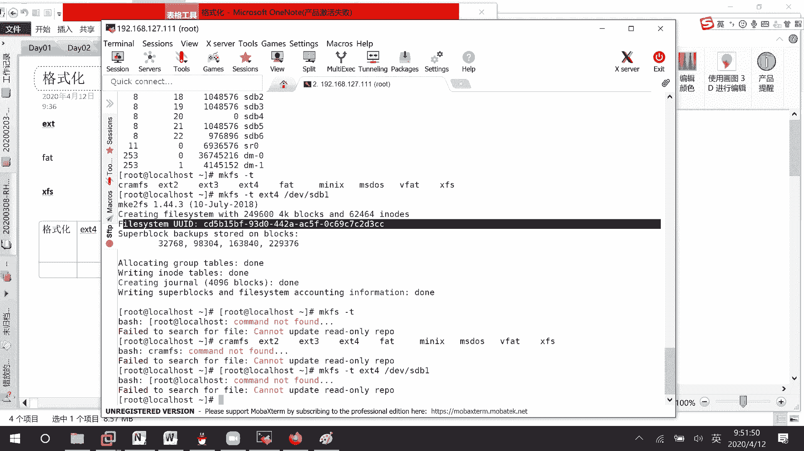
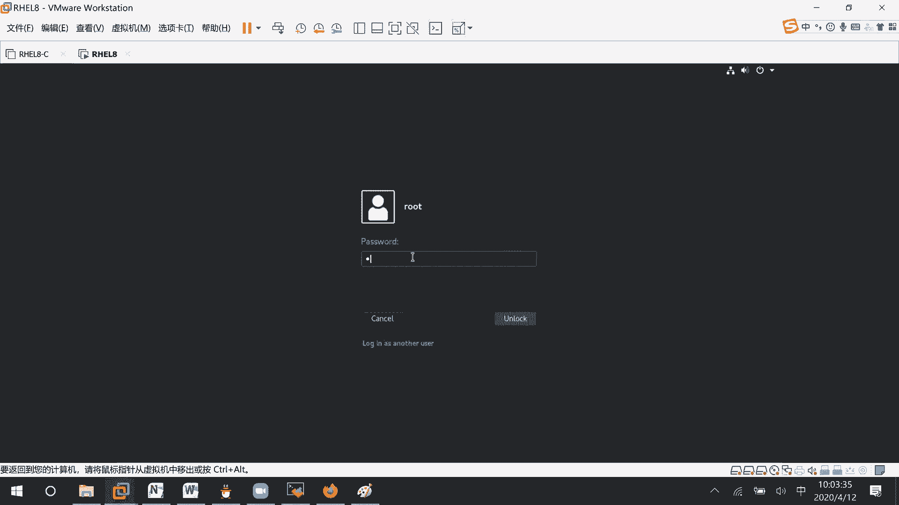

# RHCE8.0视频教程【45课时】 - P23：20200412-RHCE-01_recv - 六竹书生6682 - BV1su4y1Z7sJ

嗯今天的话呢我们就说第六天，我们课程进度还蛮快的，这里所以下午的话呢让你们去做一下练习，所以今天的话呢首先第一个我们去复习一下，那个叫做磁盘划分好吧，因为上一节课可能命令有点多。

还有一个就是我添加磁盘的时候，添加的是他那个推荐的那种类型。

它的话不太稳定，所以的话呢一直导致我们系统起不来，然后接下去的话我们磁盘划分讲完了之后呢，我们接下去讲一下叫做挂载的东西，之前我们就把划分划起来了，但是的话呢根本没有去用，所以这里挂载呢。

我们要讲临时挂载和一个永久挂载，临时挂载，其实我们之前在做亚美园的时候呢，一直有用到的，永久挂载呢，我们还没有去用过，所以今天会去讲一下，然后接下去的话还有一个叫做交换分虚，交换分区。

也就是说像有时候内存当中东西放不下了，可以用来用，放在交换分区里面去嘛，对不对，这个交换分区的话，我怎么样去创建一个新的，让它的交换分区池的话变得更大，这个考试当中交换分区它也是有考的，就单独考。

这个就是说之前之前的版本哈，他有单独去考，让你去添加一个交换分区，然后接下去的话呢，还要讲的一个重要内容的话呢，就是lvm逻辑卷的一个创建是怎么样子的好吧，然后下面这里的话呢去讲n f s。

在n f s现在的一个课程大纲里面的话呢，他就考察你们客户端如何去配置它，它就没有再考察大家去配服务器端了，他没有考察大家去配服务器端，我们这边的话呢把服务器端也去配一下，好吧。

这个的话呢是今天的一些主要内容，主要内容，那好在复习这个磁盘划分的时候呢，上一次课因为磁盘添加的有点问题。

所以想要让你们看图形化界面呢，没有看到这边的话呢，我们来看一下，还是在这里，utils有一个叫做disc。

你看我添加了两个ide硬盘，他在这边的话呢就识别到现在的话呢是unknow，就是空的，像这个我昨天我上一次课加的是n v m e，他的话就识别不到吗，好吧，我这边的话呢。

就比如说对这个硬盘进行图形化界面的划分，首先下面这里不是有个小齿轮吗，那就添加分区创建，创建错了，叫做不是这里啊，就是这里先对他的话能进行下，叫做format格式化吗，然后这里的话呢。

就整个它就把它进行了一个格式化了，他这里分区的话呢没有办法去添加嘛，restore不是这个，稍等我看一下format哦，这里如果说我点这里format的话，它会把整个盘单做一个分区去做的。

就整个盘我认为是一个分区了，像我们之前说的到底是gp t还是mb r呢，要点上面这里给我们的磁盘去添加一个标签，这边的话呢如果你大于两两tv的话呢，你可以选择g p t，就建议他这里建议。

然后这里的话呢就是m br的一个格式，然后这里的话呢就是空了一个格式嘛，我们这里的话呢去创建一个mv r好吧，稍等好，这里的话呢你看刚才这边拍，就是说这两块盘是一样的，这块我什么没做。

是不是1234只有四个属性啊，我操作了之后呢，这里是不是多了一个partition m br的一个格式吗，好现在的话呢我就可以去创建分区了，分区的话呢多大呢，比如说我创建一个g的一个大小好吧，一。

个g的大小，那剩余的话呢是不是还有20个g啊，下一步然后呢这个名字叫什么，我们之前的话呢它没有让我们去取名字，直接就是啊分区1r分区二这样子对吧，我这里的话呢比如说是p1 。

然后的话你看它下面这里你创建起来之后呢，他就直接问你要不要进行一个格式化了，要不要进行格式化，这边的话呢e x t f a t对了哈。

我们这个叫做磁盘复习，上节课就学了一个划分，这边的话呢我们今天还要讲一个东西叫格式化，格式化就相当于你房间已经分好了。

怎么样去打格子去存储东西嘛，对不对，这里有好几种类型考试，重要的呢是一个叫做ex t4 ，还有一个f a t，像这个加密的补考，还有一个这个叫做n t f s，就好像说你一个u盘，如果是ntfs的。

windows可以识别到我这个linux电脑呢可能识别不到，但是你把它格式化成fat的，windows能识别，linux也能识别，然后e x t4 的像我们这个linux能识别。

但是windows呢可能就识别不了了，明白吧，等一下会去详细说明啊，这边我们就保持默认correct稍等，这边的话呢我就说再来做选择空余的添加，比如说还是这里创建大一点十个g吧，比如说叫p2 ，等一下。

然后这里呢还有十个g，我再去添加一个g的大小，第三，然后这里的话呢比如我再来添加，叫做我看一下还有九点多个g，我这边来添加，比如说大小的话呢，比如说是怎么只有900多兆温呢，一个g。

一个g的大小next，比如说叫做p4 ，第四个嘛，那好我现在的话呢这里是还有空闲啊，我如果说想要去添加它，这里就是一个叫做错误提示，不能去添加一个新分区了，你已经有四个主分区了。

也就是说这边的话呢m dr格式它只能有四个，大家看明白了哈，像这边的话，你看比如说1234，我把某一个删了，是不是就可以了呢，删除的话呢选中之后减掉就行了，delete，然后这里的话呢。

他是不是还有就是说从刚才的八点多g，回到了现在的九点多个g啊，然后这里我去添加，比如说给它一个八个g的大小，然后如果说要让它成为一个扩展分区，怎么办呢，首先下面这里extend，稍等，你看这里的话呢。

这是扩展分区，扩展分区我们上次说过，不可以直接用，是不是要在扩展分区呢，你就把它想成一个新的磁盘，在它的基础上再去划分，对不对，添加这边的话呢，就比如说是一gb，next比如说叫做p啊e p1 。

你看是不是就就在它的这个下面，里面去进行一个产生了，这里的话呢它好像刚好就放在中间，这里比较奇怪哈，前面的话呢2。1兆估计是去存储东西了，下面这里的话呢1p一就是第一个分区的大小。

后面呢还有七个g的一个空间吗，这个看明白了吗。

我们的话呢m m b2 的分区的话。

只能去创建四个主分区，复习一下，考试的时候呢他不会考，就是说不会去考你理论性的东西，但是你要知道一下，因为在考试的时候呢，他可能会给你一个磁盘分区，格式是一个m b2 的，其中他已经去创建了三个分区了。

然后的话呢有两道题目，希望你去创建两个分区，或者去创建三个分区，然后进行挂载，你看他已经创建了三个分区了，对于这一块磁盘来说的话，如果还想要三个分区怎么办，你只能自己先去创建逻辑呃，就扩展卷。

然后再在上面的话呢再去创建逻辑卷嘛，能明白吧，他的话呢不会很死的去考你理论，需要你自己的话去应用这个理论，那是这刚才这边的话呢，我们是对第一个硬盘去进行了一个划分，我们来看一下cat parture。

你看这里第一个硬盘sda，因为是ide一类型的，然后呢1234512344是他自己吗，五五是不是在下面这样爬7x5，是不是就有了我相同的用这个叫做嗯sdb，我也想要做出这个图的效果，怎么办呢。

我们这边在做磁盘划分命令的时候呢，是不是有两个，一个是fdic默认标签的话呢，就是m d r对不对，然后还有一个叫做gt它的一个默认标签的话呢，到时候就是一个gp t，还有一个的话呢叫做party。

他的话呢是没有标签，你自己的话呢可以手就说，到时候根据自己的需求来进行一个设置，我这边就f die v sdb吧，这里因为这里的话呢还没有划分过吗，s c b回车，然后呢t现在什么都没有。

new首先主分区第一个，然后呢其实不变大小多少呢，975兆加上975m好吧，然后接下去的话呢，new p第二个它的大小是多少呢，一个g的大小，接下去new p第三个多少大呢，一个g的大小。

然后接下去第四个分区，nee开始不变多少大小呢，八个g的大小对吧，然后接下去new第一个就是说起始位置不变，last的话呢，我们希望的大小是一个g就够了吗，回车那这个好了之后的话呢。

我们先来看一下图形化界面，这里有没有反映出来哈，没有人家是空的，为什么呢，因为在这里所写的所有东西的话呢，是不是在内存当中啊，如果说想要反反映上去呢，是不是要对这些所有的配置进行一个保存，w一下吗。

你看这是不是就有了，这是不是就有了，如果说cat process partition，他这边如果没有立刻加载到的话呢，我们有什么样的方法分区没有被立刻加载到do。

那我们的话呢是不是需要用手工的命令的话呢，去给他进行一个同步啊，同步的命令的话呢，我上节课讲过一个叫做party party party probe，对不对，这个命令p a r t robl，然后呢。

你可以根据某一个特定磁盘的名字，去进行一个加载，回车对吧，这种方式去对它进行一个加载，然后还有时候的话呢，就是说在我们八单中的话呢，它多了一个命令，you d e v at me set up。

这个命令他这两条命令的话呢其实是等价的，都可以去加载一下自己的一个分区的，就是说你你配置了之后的话呢，它没有立刻识别到，可以用这种方式去进行一个加载好吧，然后g disco和我们的一个叫做f disc。

它是类似的，我这边的话呢就不再去复习及第四课了好吧，那行今天到现在开始的话呢，现在开始我们的一个新内容哈，我们的话呢要去进行一个格式化，就就比如说，我们的话呢一个硬盘已经分了吗。

分了这么多种这么多个空间，那这空间现在都是白白的一片，我们不方便去存储东西，如果说想要对它存储东西怎么办呢，是不是要去打格子啊，那这格子组织形式的话呢有很多，对不对，肯定有很多种组织形式啊。

很多种组织形式，那这边的话呢我们来看一下格式化的，形式的话呢，格式化就是说到底怎么样去打格子，我们这边比较常用的的话呢，有这个ex t4 ex t这种格式，还有一个的话呢像有时候你们去看到的呃。

f a t的一个格式也是有的，然后的话呢，还有时候我们经常用的x f s的一个格式，我这边给你们来看一下df ht，这边的话呢vv的这个不去看他临时文件，不去看它，然后这里你看是不是就xfs。

然后这个iso 99600的话呢，是我们光盘的一个格式，到时候再去讲，我们对自己的一些文件进行格式化的时候呢，会选这两个啊，较多，ex t4 x f s知道吧。

那好我们先来看一下图形化界面的话呢，怎么样去进行一个格式化，虽然刚才已经格式化过了哈，我这边再来格式化一遍，没有关系的，format hatch，你看这里的话呢。

e x t4 我们是看到了f a t我们也看到了，那像我刚才说的一个叫做，像我刚才说的那个叫做什么呀，x f x的一个格式呢，是不是没看到，是不是没看到，那这边的话呢有个other。

他这边的话等一下可以让大家去选择的哈，稍等，这是p一咳，我在这里再去来添加一个吧，一个g的，next，一个g的next，这里比如说我叫做test p2 吧，other好吧。

next就是比起刚才如果直接选择这个，他是不是correct，如果选择other呢，它是next，这边就有很多种类型，就比如说我们的xs或者我们等一下讲的linux，对不对。

然后这里的话呢还有b v格式的，还有f2 格式的，ex f的格式的，还有一个ud f格式的格式的，他这个在考试的时候呢，虽然这些你看这些全都是亏掉，我们是不是建不起来啊，在考试的时候。

他可能会去进行一些设置，让你们能去建，考试的时候让你们格式化成什么格式，你们就格式化成什么格式，不要觉得他这个呢我之前没有创建过，我就不去格式化了，能明白吗，等一下用命令的方式呢。

我会去教你们怎么样去格式的位置写在哪里哈，所以这边如果要x f s呢，就选择这个就好了，如果没有文件的，就选择这个就好了，明白吧。

the other，那行，刚才的话呢我们是使用一个叫做命令的方式，去告诉你们怎么样去啊，图形化界面的方式去和你们说，怎么样去进行一个格式化嘛，那现在的话呢我们来看一下命令的方式哈。

这边cat process audition，123456就说db的话呢有六个。

诶等一下你看这上面这里第一块的话呢，它是不是都有e x t4 这个，但是s d b呢前面的它这些叫做格式化的形式，是不是都是unknown的，但像这些呢已经格式化过的。

是不是就有一个比如说e x t4 这些标签啊，但是呢像这些还没有格式化过的，就是一个unkno，我现在的话呢就比如说给第一个分区一个标签，它的格式的话呢是e x t4 的好吧。

我们来看一下怎么样去做make fs演技，我tb两下这边所有的格式的话呢，是不是出来了，ex t234 f a t minimal ms dos v bt，还有一个叫做x f s是不是都出来了。

这边呢我比如说是a b x d4 ，对于哪个分区设置e x t4 的格式化呢，比如说我是在第一个分区，你看一下，这里我来回车一下，从刚才的unknown，现在是不是就变成了一个叫做ex t4 。

的一个格式啊，这个命令的话呢就是我们的格式化，就是我们的格式化，然后格式的话呢是中间这里是我们的一个格式，明白吗，命令的话呢就这样子诶，格式化这里的话呢e x t4 的。

然后命令的话呢是这里主要的位置是这一块，自己去改一下就行了，如果说你要的是一个叫做fs格式啊，或者x fs的格式啊，把这个ex t4 改掉就可以了，明白吗，那好这里没什么问题啊，但是在格式化的时候呢。

我们来看一下，他说corrected by system，然后的话呢总共大小是v多少个块，然后每个块的话呢是4k对吧，然后这里的话呢u u id 3 cc稍等哈。

你看我这个第一个分区的话呢，格式化完了之后，12345总共五行内容对吧，像这个还没有格式化的呢，12344个内容，其中这个叫做content，它是unknown的，是一个标签。

我这个五的话呢比他多了一个什么东西啊，u u i d u i d。

所以的话呢这边要稍微注意一下分区，只有格式化了，还有u u i d，有ui d的话呢，我们才能去对它进行使用，比如说有了ui d的话呢，系统他才识别他，他才认他，那我系统的话才能去定位，他能明白吗。

如果说他没有ui d的话呢，我的系统是不可以去对它进行一个使用的，不可以对它进行使用的，这个的话呢一定要注意一下，然后这边的话呢你看correct它的大小的话呢，是不是一个4k啊。

也就是说我在进行打格子的时候，每一个格子打的是4k的大小，也就是说一个格子最多存储4k的内容，如果说我现在的话呢，有很多文件是一个叫做ek的，问你们一个格子，或者就是说一个节点能存储四个文件吗。

这个的话呢它是不能的，一个格子的话呢，你只能去存储一个文件，你不能去存储好多个稳健的，所以有时候的话呢像我们在windows当中有些系统啊，你的话呢去创建一个文件，它的初始大小是不是就4k啊。

它占用了一个格子的大小，知道吧，如果说现在你的一个文件大小是9k，问你可以去占有三个格子吗，啧啧这是肯定可以的，对了，为什么呢，因为一个格子线默认大小，是不是一个叫做4k的一个大小哦，哦对4k的大小。

那两个格子加起来的话呢，是不是才8k啊，我这个文件存不下去啊，只能用三个格子去参加，就是说去进行一个存储吧对吧，但像现在的话呢，公司当中，他的公司当中一些文件基本上都是比较大的，对不对，4k的话呢。

可能对我来说我要去存储很多格子，那到时候的话呢去进行读写的时候，是不是就要去读很多格子啊，那我这个速度会非常的慢，能明白吗，如果公司中，文件基本都比较大，如果说你设4k的一个大小。

到时候去读取文件的时候，要找很多格子，那这样子的话呢我们的补血效率就会很慢，但是有时候的话呢，如果公司中基本上文件文件基本上比较小的话，那你如果还是4k呢，他比如说基本上都是以k。

那每一个文件在存储的时候呢，是不是都会浪费3k的东西啊，教程比较多的浪费嘛，那现在的问题就是说，我能不能去指定这个块大小呢，因为有时候文件比较大，4k我不行，有时候文件比较小，4k的话我能背嘛，对不对。

这里看一下指定快大小，其实e x t4 是这样指定的，叫做x f s f a t i全都是这样的指定的好吧，我们来看一下叫做mix还是这个fs，简简help给你们来看一下，首先t的话呢。

是去设置它的一个格式是怎么样子的，然后呢这里有一些fs的一个option，对不对，然后呢这里的话呢device对于哪个设备来说。

然后这里size size number block to use in device，就是说你的一个嗯快大小是多少的话呢，这边你直接去写上去吗，好吧，我们来看一下这边的话呢就是mf mifs。

比如说减t我还是一个叫做ex t4 的好吧，前面这边的话呢快大小，我建议大家去加一个减b大小的话呢，比如说我要认它是1k的1024的大小，对于哪个分区来说呢，d v s d v2 好吧。

第二个分区我们还没格式化吗，你看这边的话呢嗯稍等他这边是多少个快，多少个快，这边刚好是我这边4096块，他的话应该是看这里啊，4k block，我们这边的话呢是不是就是一个1k block大小。

这边才是大小哈，好这边的话呢就是说指定它的大小是多少，这里的话呢就说是b为单位，所以这边的话呢我们就是1k1 k的一个大小，好吧，这东西要稍微去记一下哈，那行那这边的话呢我们现在是一个e x t4 的。

然后我刚才的话呢跟你们说常用的格式，还有xx的，我能不能想办法把e x t4 的转换成我们的，叫做xfs呢，格式转换嘛，对不对，就正常人的话呢，我们会这样子make fs。t，我想x f s的谁呢。

b v s d d d嘛，你去给我转过来啊，回车这边的话呢，你看离vs d v1 ，他的话呢已经包含了ex t4 的标签，如果说你真的想要去转换呢，use这个f他的话呢强力的去进行一个修改。

他的话呢就是说在进行格式化，强制的格式化，在格式化的时候呢，磁盘分区里面东西肯定是会丢失的，明白吗，龙肯定会丢失的，啊这边的话呢比如说我确定我要格式化，我可以跟一个减f吗，回车你看这里的话呢。

嗯这是它的一些分区的信息，然后这里block size的话，是不是一个也是4k的一个大小，也是4k的一个大小，如果说这边的话呢，他也想要去指定一下快大小怎么办呢，你看我比如说现在第二个吧。

减f也是强制的减b，然后呢这边的话，这边的话呢你就不能直接再去写4096了，你要去写一个，比如说besides等于1024这样子回车诶，等一下我看一下呃，unknob side哦。

多了一个b直接就size就可以了，杠b size等于多少，这边的话呢，是不是就是一个1024的一个大小，1024的一个大小，好这个的话呢就是说去进行转换，你的话呢去加一个叫做减f就行了，如果不是转换呢。

是我全新的一个生成呢，那这边就不要去加了嘛，回车它就自动的帮你去生成一个新的就行了吗，能明白吧，这里创建新的，然后呢指定大小就是这里不指定的话呢，它还是一个叫做4k的一个大小，4k一个大小。

这边格式化会了吧，那现在的话呢我们来看一个，刚才是ex t4 变成我们的x f s线呢，x f x变成e x t呢，那是不是相同的，make fs减t，然后呢这里我们是希望什么样的一个标签呢。

e x t4 谁呢，比如说sd b一回车，他这边的话呢就问你叫做包含了这个标签，你要不要去进行y，我要进行它直接对你进行格式化，这边的话呢你看去加一个f有没有用哈，他这边没有用。

他这边的话呢没有那个叫做我强力的一个选项，就是说你回车了之后呢，他去问你一下，要不要去进行一个转换好吧，这，如果说你这边的话呢，是希望它的一个大小去进行改变的话，那这边的话那是二哈大大小进行改变的话呢。

和刚才那个是一样的，b2048 回车回车诶，忘记输一个y了哈，y你看这边的话呢，是不是就是一个2k的一个大小，它的转换的其实一样的，只是说没有减f那个选项而已，没有减f那个选项，那好这边格式化的话呢。

大家应该就没有问题了吧，命令的话呢主要去掌握这条make fs，它这个的话呢全都是没有发生变化的，其实在转换的时候，或者在修改的时候也是这条命令，只是有时候要加一个f，或者有时候要去确定一下嘛对吧。

下面这边的话呢我们要来讲一个新内容了，叫做挂载，叫挂载，像你这个文件，就是说如果说你们刚才看到了磁盘，没有进行格式化的话呢，它是没有uid的，这里再强调一遍啊，磁盘，没有进行格式化，没有uu i b。

那么不能使用，知道吧，我们来看哈，这边cat proce partition，我刚才的话呢一直在在操作sdb 1，sdb 2，sdb 3对吧，sdb 5和sdb 6没有操作过吧。

他们两个的话呢是没有uid的，稍等再坚持一下。

我讲了之后就让大家去做一下了，你看叫做唉这个sdb 6被操作过了哈，这里那这个sdb 5没有被操作过，他的话呢是不是就没有标签啊，我们等一下来看一下，等一下来看一下sdb 5呢能否被挂载。

那这边的话呢呃没有被格式化过，没有u我们这边如何查看uid呢，有一个命令叫做block id，他这边的话呢就显示出很多信息，第一个第二个它的uid是多少，type，就是说格式化类型是什么样的。

然后这里s d b a1 a2 a3 a4 a5 a6 ，它的分区格式又是怎么样的，这是不是都显示出来，如果你只想要去对某些事情比较关心的呢，graph sdd回车，它的话呢就显示出12365。

你看六这边level，因为我刚才的话呢是不是给它起了一个名字啊，然后呢你看这ui d是不是有s d b5 ，我没有对它进行一个格式化，你看他的话呢有没有uid，有没有格式，有没有有没有格式。

是不是都没有，所以这个命令的话呢，你们要学会去查看，有时候发现为什么就是挂载不上去呢，那你看一下人，你对他进行格式化了吗，对吧，那好这边的话呢临时挂载是什么意思呢，嗯是这样子的，开机之后就消失了。

如果你不去重启的话呢，他可能可以一直去用，可能可以一直去用哈，我这边make dir根目录下叫做aa吧，现在aa里面的话呢什么东西都没有，火m d v s d b5 ，刚才说五不能挂载吗。

这个mt什么意思呢，就比如说你现在有个u盘插到电脑上来，到时候的希望访问aa目录，就能访问到这个s d b5 吗，回车你看这里就不行，run fs type bad option。

然后呢像这个sdb 5的话呢，他就missing它的一个叫做编码的一个格式嘛，编码编码，所以就不行了，明白吧，如果我把这个sdb 5去改一下，改成六，是不是就没有报错了。

因为人家的话呢是有一个叫做u系统的话呢，是能够识别到的，好吧，这条命令这条命令的话呢，我们来看一下它是怎么样的，中间都是用空格来分隔开来的，mount挂载的命令，然后接下来去d vs db 6呢。

这个东西是挂载的设备，每一个快设备你想要来挂载aa呢，挂载点，你希望挂载到我本地的哪一个文件当中去，知道吧，你看这里df减h h的话呢，就是说带单位去显示大小，减t的话呢就显示它的一个格式。

这边我们是不是就多了一个x f s的，大小是948兆的，然后呢是aa啊，所以有时候在考试的时候，他让你去做一个文件扩展到770兆，他这个不是定死的，不是说哦固定是770的，它是怎么样呢。

有一个叫做上下浮动范围的，比如说740~210，或者740~200都是合理的，你们到时候在考试的时候呢，能在这个空间范围内就行了，不是说一定要和他完全相符合，知道吧，那好那行。

现在aa里面的话呢没有东西，我随便去写入一个东西，ecode test啊，dv s d b6 到这个aa里面叫做test里面去好吧，现在l s a是不是有东西了，好这个的话呢是一个临时挂载。

有时候我们在电脑上u盘用好了，是不是要把它给拔掉，那卸载呢卸载的命令的话呢有两种，但这两种的效果是一样的，我先来讲第一种，your mon，把哪个设备给拔下来呢，bb s d v6 设备，对不对。

你看这个时候e f减h t这个条目的话呢，是不是就没了，就相当于这个硬件现在从我的电脑上拔掉了，那我既然的话呢哎错了哈，那既然的话呢我把硬件从我的电脑上拔掉了，现在这个aa目录下。

aa文件下它还会有这个叫做test文件吗，l s a a是不是就没有了，但是a这个目录的话呢，它还存在的，现aa的话，那就是我们嗯电脑就是说他干结构是这样的，就好像我这个是我电脑现在的硬盘。

其中这个目录的话存的是aa，然后mt是不是d v sdv 6啊，那也就是说这里有个叫做s d b6 ，你临时借用这个目录，我这个aa的话呢，你如果去访问aa线，其实就是来访问这里，而不是访问这里。

能明白吗，先把它给卸载掉了之后呢，我来访问aa呢，是不是就走这条线路了，对不对，就去访问我正常的一个文件了吗，所以就看不到东西，那你看啊，现在来个东西，make dir b b，在我的电脑上有一个aa。

有一个bb，现在呢sdb 6挂到了这个bb上面去，我去访问这个bb的话呢，是不是就相当于来访问这里啊，对不对，所以现在的话呢是能看到test这个东西的，知道吧，这就相当于u盘的一个插拔。

你的话插到这台电脑上去，想要去放到aa下面，还是想要放到bb下面的，就随便你了，没有没有固定的，知道吧，那好现在的话呢还有一种呃，就是说挂载命令其实都是一模一样的，接下去呢再讲一个卸载，我的话呢。

比如说有时候是不是你的电脑上去，插入了一个东西了之后，你的话呢想要把它弹出，是不是叫右击，有个叫做弹出的信息啊，那也就是说某个目录你想要把它给弹出，这里是不是就是u mont bb啊。

这就是说在挂载点上半，把你的一个叫做关联性的给去除掉，你看现在的话呢叫做哦，刚才我忘记给你们去看了一笔，你看是不是就没有这个test的一个东西了，所以这里的话呢就有这样子两种卸载。

但这种的话呢都是临时的，都是临时的，如果说我们现在想要永久的呢，大概就是说开机之后就说设备重启之后，还存在，他这边的话呢有一个专门的文件叫做，etc f s t a b f s t a b。

就好像说我们现在电脑当中的话呢，l s叫做df ht，是不是这里就本身有很多条目了，那它肯定是读取到一些配置信息啊，cp t c f s t a b，你看这边的话呢。

什么b v h e h e l root，根目录格式xfs，对不对，然后后面这个选项呢咱们不用管它，反正就divorce 00就可以了，零一就可以了，然后然后呢还有一些临时的信息，还有一些交换的分区。

对不对，我现在的话呢就比如说想要把我d vs db 6，挂到那个叫做a项下面去，然后呢开机之后还存在怎么办，现的需求哈，姜，e v sdb 6叫做挂载到啊，aa下，希望重启天下是重启之后还能生效。

我们来看一下怎么办啊，v i m e t c f s t a b，然后下面这里o我这边的话呢，是不是d vs d v6 啊，空格强发展到哪里呢，aa空格，那现在的问题是后面这里需要写文件格式啊。

我们的d v s d b6 是怎么样，就是说格式化的形式是哪一种呢，你还记得吗，不记得的话，那就是block id，我去查一下s d d6 嘛，发现的话呢它是一个叫做x fs的。

所以就在写写这里x f s，然后呢后面这里有选项什么的，不用管它，force 00就可以了，然后冒号wq，你看b f h他这里没有，为什么呢，只有重启之后的话呢，它才能去他才能去看到的。

重启之后你才能看到这个信息，但是现在去重启的话呢可能要比较久的时间，我现在的话呢模拟一下重击好吧，模拟一下重启，但重启才有的话呢，就相当于就是说关机之后再开机，它的话呢会去读取这个配置文件，对不对。

我现在的话呢可以手工的让他去读取一下吗，mt减a t f h t，你看这边的话呢是不是就多了这个条目啊，刚才的话呢呃d f g h有没有这个条目没有，所以这个mt a，它的话呢可以去重新的读取这个文件。

在我们的八单中的话呢，还增加了一个新的命令，就是说怎么样去读取这个配置文件，他的话呢就是说去重启一下system control，restart叫做，我看一下，太多了，system，稍等一下。

我来看一下线，他的话呢是system control，叫做s t e m，然后叫做，我来rap一下吧，system control list unit，fire，rap d e a m11 ，是不是啊。

我看一下啊，嗯不是这个，不是不是u d e v e a，等一下我找一下，我记得是system开头，然后叫做dm多少的，你们稍微等我一下好了，他这条命令的话呢是这样子，system control。

然后的话呢后面直接就跟上demo reload，他这个的话呢也可以重新去把你的叫做呃，df ht，把这里面的信息的话呢重新去读取一遍，这两种形式，我这边的话呢再来加一条，我刚才的话呢是不是跟你们说过哦。

系统识别到某一个叫做磁盘了之后呢，它是不是有个uid啊，那这我们在挂载的时候，他是不是也有用到一个东西叫做uid，这个有什么好处呢，uu id是系统根据硬件的一些属性，去生成的一个标签，它比较稳定的。

像服务器当中的话，你看啊有1号盘位，2号盘位，3号盘位，有时候的话呢我们把它全都拔出来的时候，忘记忘记写标签了，你如果说像这样子，dv sda这里可能是abc对不对，如果你到时候插进去的时候。

这两个去调位置了，比如说b和c去调位置了，那现在的话呢，是不是就是原来的sdc挂载到aa下面去了，是不是就会发出现，这个叫做磁盘换位的一个问题，然后呢读取到东西，如果说这些磁盘里面有重要的东西。

是不是就不能被加载到，我们如果用这个uid去挂载的话，那就不会有这个问题了，就不会有这个问题了，我现在这里的话呢，比如说对这个s b d e进行加挂载好不好，他的ui d在这吗，所以呢怎么样去做呢。

b i m e d c f s table在最下面，这里uid还要化简到哪里呢，比如说b b b b它的一个格式是什么呢，是不是e x t4 啊，然后呢后面的属性全都是没有的。

e d e f a u l t s等于零好吧，2号w q，现在呢我用一下刚才说的最后这条命令，df ht这边的话呢，诶他没有给我加载上来哈，没有给我加载上来，这边可能还需要手工去加载一下这条命令。

他说是更新一下，我们，这条命令他只是去进行了一次更新，只是进行了一次更新，他没有没有进行一个加载，没有进行加载，所以这条命令的话呢你们就不用去看了，就看那个叫做mt就可以了。

就看mount杠a他的话呢进行了一次加载好吧，就就看mount杠a进行重新加载，啊这里的话呢就是说怎么样去使用，我们啊uid的一个形式去进行的一个加载，而去进行的一个挂载。

你们这边的话呢稍微注意一下这个uid的话呢，它会比较稳定，就像我刚才说的一个叫做磁盘，如果你在换盘的时候换的位置的话，关系也不大，对不对，你们这里的话呢，但它有好处，也有不好的地方，不好的地方是什么呢。

如果说这个硬盘坏掉了，你的话呢叫做123好吧，a b c，如果说现在是u i d这块牌，是第一块牌坏掉了吗，那现在如果说有一个新的硬盘里插进来的话，uid是不是和他不一样，那这边所有的uid都要去改了。

如果说你用这个s d p的形式呢，你这块硬盘如果坏了，我插进来，如果说我插到2号位，它识别出来的，即使我插入的，比如说第五块盘，它识别出来的还会是b能明白吗，这个的话呢就是说针对不同场合。

你到底是使用这个分区的名字，去进行一个挂载呢，还是针对uu i d的形式进行挂载呢，其实都没有错，要跟你们自己根据情况去选择，而且就是说如果是出现盘坏掉的情况，那你需要去关注有没有哪一个。

哪一个挂载信息是使用ui d的，如果是怕发现出现错位的情况的话呢，那你就要去核对一下名字，知道吧，这几种情况，那好这个的话呢是进行了一个永久挂载，对我们的一个分区，像我们这个的话呢叫做光盘。

是每次在开机的时候都要去进行一次加载，特别的麻烦，那我们的话呢希望他能进行一个永久的挂载，怎么办呢，一vs 20，他的话呢就是这个光盘，它本身就是在d vs 20啊，或者d v cd zone啊。

下面的知道吧，1v4 丁目下面的，那现在的话呢这里d vs 20嘛对吧，那那现在的话呢想要把它挂载到哪里去呢，我刚才的规划是不是要把它挂载到哦，这里没有哈，比如说我希望他到时候开机的时候呢。

挂载到这个soo下面去，那这边的话呢是不是就应该跟上so，它的格式是什么呢，就不再是ex第四了，我们这边的话呢可以看到是不是i so，9660啊，所以这个是s9660 ，然后呢选项全都是没有的。

这样就可以了，以后设备的话呢再进行重启的时候，我们的光盘信息的话，它会自动的去进行一个挂载的放下减a，稍等哈，s s o o好像是已经有挂载了，已经有挂载。

那我再来一个make dei i i s o吧，mount减a device，mount read only，稍等啊，我看一下什么情况，test l s什么东西。

v i m e t c f s table哦，我知道了，这没有东西吧，哦我知道了，我傻了，这个就一个提示信息而已，对不对，这就是一个提示信息而已，而不是说本身有挂载的一个问题，这是一个提示信息啊。

所以这边的话呢是没有问题的，没有问题的，这样子我这里的话呢去把格式给你们去写一下，首先前面这里的话呢是不是一个挂载设备啊，然后接下去这里的话呢是不是一个挂载点啊，然后这里的话呢是不是一个格式啊。

然后后面这个的话呢是一些选项，这里的话呢，就是说后期我们再讲n f s的时候呢，要不要加密啊，然后呢要不要备份啊，这些信息全都是在这后面去写的线呢，这边我们先不去管它好吧，默认就好了好吧。

这个的话呢是我们早上讲了格式化，还有一个挂载，这边的话呢，给你们20分钟时间自己去练习一下，后面呢我们再去讲交换分区，老师光盘不如果关注，等一下，现在这边的话呢我们来讲一下。

刚才有个同学问这个ui d的话呢，能不能去修改这uid的话呢，能去修改它就像mac地址一样的，但是mac地址的话呢，可能就是说嗯全球的话呢你不能去进行，就不能进行重复吗，这u i d的话呢。

它是本系统不能去重复，如果说其他地方，其他系统当中有和你一样的一个ui d的话呢，你这是没有问题的，知道吧，那好怎么去修改呢，那它主要是两步，第一步生成ui d，因为我们在这边的话呢。

看到的是一些设备的ui d，它还有其他很多的ui d的好吧，所以呢这边让系统去生成一个，然后第二个我们的话呢，再去修改某个设备的uid码，去修改生成的命令是什么呢，uu id是n。

这边就生成了一个uid，是系统它自己没有使用过的，而且长度是什么呢，它也是合法的，然后这边的话呢，就比如说我想要对d vs db 2去进行一个修改，这边的话呢怎么样去修改呢，x fs admin。

然后的话呢减大写的u后面跟上新的u u i d，然后接下去对哪一个快设备进行的一个修改，就这个回车，稍等我看一下哦，哦文件系统对它是e x t4 的，等一下哈，ex，稍等一下，啧啧，x，t，诶，稍等啊。

我看一下，就说这边去修改uid的话呢，像首先我去把sdb 2他的一个block id的话呢，去把它给grab出来，发现这里的话呢一个叫做原始的uid，那这边的话呢是这样子的，是。

这个尾号的话呢是一个叫做fa结尾的，然后现在的话呢，因为它是一个e x t4 的一个格式，e x t4 格式，所以这边的话呢使用的是一个t u n2 fs，去进行一个修改。

然后的话呢修改的一个方式的话呢，就是减大u它的一个uid是多少，然后呢对一个分区进行一个修改，然后接下去的话呢就是block id，我们去验证一下嘛，发现真的从刚才的fa的话呢。

变成现在的一个叫做二一的一个尾号，看到了吧，这种的话呢是我们xfs的一个格式，如果说我们是一个叫做哦，这个是e x t4 的格式，如果是一个叫做x f s呢，我直接去说一下修改的命令是怎么样子的。

嗯这边哎不对，不修改，这个只有是我们系统的，我看一下啊，嗯这边的话呢，比如说我来修改一下s d b3 的吧，好吧，它的命令的话呢是x f s，the main简大写的u，后面的话呢。

你去跟上一个新生成的ui d就可以了，然后呢这边再去跟上，你要对哪一个分区进行一个修改好吧，直接就这样子去修修改，这里x f x的就这样子，然后其他就没什么了，其他就没什么了。

然后这边的话呢挂载你的话呢可以去使用，比如说叫做啊挂载的名字去挂载，或者的话使用uid去挂载，全都是可以的，前面这边的话呢我们讲的是一些正常的分区，接下去的话呢我们来讲一下交换分区，交换分区的话呢。

有时候我们是会去根据内存的一个情况，内存的情况去进行一个设置的，如果说你的，内存这边的话呢是小于等于，这个叫做2g的，我们基本上的话，这个交换分区会设置成是它的一个叫做三倍。

如果说你的交换分区是两级到八级之间的话呢，我们会把它设置成相同大小，就说一倍，这个如果你没有按照这个规律去做呢，也是没有关系的，只是说关邦的建议呢它是这样子的，然后接下去的话呢，还有如。

如果说你是在八级到64g之间的话呢，建议你的交换分区的话呢，至少设置成4g，然后上上面的话呢它就没有封顶，然后接下去的话呢，如果说你是大于等于或者直接就大鱼吧，64g这边的话呢。

建议你也是就是说至少要4g好吧，就是说大于4g多少的话呢，你自己根据实际情况去进行一个调整嘛，这个东西的话呢在什么时候用到很多呢，就是虚拟化的时候，虚拟化的时候，就比如说像你的一个主机。

你的一个物理内存的话呢，如果说只有一个128g，他的话呢你你在进行扩展的时候可以发现，不是就是说像这种虚拟化或者云平台，可以去超过他这个总容量吗，现在很多平台的话呢不能去设置能超过多少。

比如说因为很多资源都没有去用，就普通的做实验嘛，他不能说去设置200%啊，或者设置成100%这样子去超过，但是你去称增加这个叫做交换的容量之后，可以去增大，就是说可以去超过他的一个128兆，哦不对。

128g你如果说想要现在的话呢，可以创建，就是说总共的主机空间是200g的话，如果说现在想要去达到300级呢，你可以去增加交换空间，他这个的话呢叫做虚拟化，会进行一个提高，明白吧，这个如果说不理解的话。

那没有关系，你以后在做云平台的时候，如果有看到，如果有看到就是说明明有128g的空间，我实际使用的话呢，很多设备在使用的时候，就使用了64g左右的空间，那我觉得我这个本身就是一些测试的情况。

我还想要去多创建一台主机，但发现创建是创建起来的，就开机开不起来，一直报内存不够嘛，我明明这边不是还空闲64g吗，对吧，你这边的话呢可以去调调整它的一个交换空间，把它调大一点。

那你那台创建的主机的话就可以去开机了好吧，所以就额外的去提一下，这边的话呢我们来看一下，首先来看一下咱们系统当中，叫做交换空间的大小，查看命令的话呢，就是这一条，还是在这个process web上面。

然后这边的话呢我们就只有一个，他的话呢是四一多少，这个的话应该差不多是四个g的一个大小吧，size然后呢以引用的话呢是零个g的大小，然后后面这边就优先级优先级，其他就没什么。

这里的话呢是用分区来做我们交换分区的，他这个的话呢，就是说我们在做交换分区的时候呢，你可以是一个叫做文件快设备，也可以是一个分区，所以我们等一下再讲的时候呢，会讲两个方面。

一个就是说快设备作为我们的交换分区，一个就是说分区直接作为我们的交换分区，然后接下去的话呢这优先级对吧，有-1，有-2，有-3，还有123456，这个的话呢数字数字越大越优，先。

赋值的话呢也是考虑在里面的越大越优，如果说再来一个它的优先级是-1的话，优先是使用-1的那个交换空间，-1-1不够用了之后再来用-2的吗，能明白吗，他是这样子去进行一个使用的那行。

现在的话呢比如说我们想要去用，分区去做交换空间，这该怎么做呢，首先第一步我们要做的事情，是不是就要去创建一个分区啊，不然的话我根本就没有分区给，我来做交换空间啊，对不对，第一步创建分区。

分区创建起来了之后呢，按照上面的一个想法，是不是先进行格式化，没有格式化你是不能用的呀，然后接下去的话呢是不是挂载呀，我们才能去用嘛，我们来看一下是不是这三个步骤好吧，第一步创建分区，我比如说的话呢。

先把叫做f迪斯卡e v s d b好吧，他这边的话呢还有剩余空间的，我来划分一下叫做new，大小的话呢，比如说我给他两个g的大小好不好，加上2g的大小，然后的话呢这里有第七个空间，它的大小是两个g。

之前我们在说的时候，还你们还记不记得一个叫做标签的一个概念啊，就这里type linux就普通的分区extend，是不是就扩展分区啊，那现在的话呢我们希望把它作为交换分分区，其实比较好的方法的话呢。

就是说把他这个分区的标签里去改一下，改一下不改，其实没有关系的哈，t我不知道有哪些标签不对啊，我如果说第七个吧，我不知道有哪个标签用l来显示一下嘛，交换的话呢是不是这边说的82呀，82。

所以呢第一个想要去修改标签，然后接下去的话呢对第几个呢，对第七个，如果说你标签记住的话呢，这条命令就可以不用去敲了，如果说你标签没有记住的话呢，自己去把这条命令l去敲一下，看一下标签的信息，那好。

这里呢我们知道要把它改成一个叫做82码，对不对，把它改成82 八二回车，然后接下去的话呢你可以去核对一下，看一下自己是真的改了，p一下，你看这里的话呢，两个g82 交换的对不对，w保存退出一下就可以了。

我们先来看一下啊，这个分区的话呢，现实系统识别到了没有，proceed partition，叫做七是不是真的识别到了那行，现在的话呢如果要去使用，要进行格式化吗。

像我们刚才说的x f s e x t4 啊，全都不是给我们，全都不是给给这个交换区进行一个使用的，那交换分区它怎么样去进行格式化呢，make你看这个什么呃，dir这些全都不是，对不对。

f a t i也不是有一个东西叫做s w a p，下面这个是临时文件哈，这个s w a p，是不是就是我们的交换交换分区啊，d v s b b7 嘛，你看这里的话呢就对我们进行一个格式化了。

然后下面的话呢就是我们ui d的一个标签嘛，对不对，那好现在的话呢如果要进行一个挂载呢，df ht，你们来看一下，这里有没有和我们叫做交s w a p相关的没有，因为我们交换分区的挂载。

和普通文件挂载是不一样的，你可以这样子去想，它，挂载的话呢，到时候是挂载到一个叫做十字当中去的swap，交换分区池当中去了，知道吧，所以呢我们在查看交换分区的时候呢，是不会来这个df减h这里去查看的。

那这边的话呢我们想要让我们的sdb 7，在交换池里面去生效，怎么办呢，swap嗯，后面去跟上哪个分区呢，s d b7 ，你看一下，现在这事情就多了一个叫做s d b7 啊，两个g优先级是-3的。

那-2的话，那肯定是比我们-3更加优先吗，对不对，这个要稍微注意一下，像这种像这种的话呢，是一个叫做临时挂载，毕竟的话就说开机之后的话呢，人家就不见了，人家就不见了，现在的话呢如果说我想要把它给关掉呢。

不要再去挂载了，swap on的话呢，是挂在关闭，就是一个off谁呢，d vs dd 7，现在你再来看一下是不是就没了好，一个是临时挂载，一个是灵芝卸载，卸载的话不是平时的，不是临时的。

反正就是说卸载掉对吧，那行如果说我在进行挂载的时候，希望它比这个-2更加优先更加好，那在挂载的时候呢，你就可以去指定一下swap on减pp的话呢，priority是不是优先级啊，比如说设置成-1。

总比那个叫做富二代吧，d vs d b7 ，诶等一下我看一下swap of，诶他这个的话呢怎么没有生效呢，swap，诶-1怎么没生效呢，我先再卸载一下off，诶刚才-1怎么没有生效呢。

-1这边的话呢他就一直没有生效，估计-1这个直线是不能去用的，但是的话呢零啊一啊，二啊三这些纸钱都可以去用哈，这个注意一下就好了好吧，下面这里的话呢，就是说如何去修改它的一个优先级。

优先级在挂载的时候就这个key，然后呢后面不写上它的一个数字就可以了，然后现在这里的话呢，如果说我想要去进行一个挂载，这个如果是一个永久挂载该怎么办，哦我以为有人说话呢，永久挂载的话呢怎么办。

他的话呢和前面是一样的，都是去编辑我们的一个配置文件的，我先把它给off掉哈，map of e vs dd，七，那如果说想要去进行一个永久发展的一样的vim，etc f s table里面的话呢。

要写什么东西呢，我们照搬就可以了，首先在下面添加一行，你看这个东西是不是交换分区啊，home非常的像你这里的话呢，可以去使用这个稍等啊，你们的话呢可以去使用这个sdb 7去挂载。

也可以使用它的uid去挂载，也是可以随便你们，比如说我这边使用d vs db 7去挂载，挂到哪里去呢，我们挂到交换池当中去，s w a t就不再是某一个文件的名字了，能明白吗，接下去格式是怎么样呢。

s w a p如果说你没有任何选项的话呢，就first 00就可以了，像刚才有人说，就是说后面这些选项什么意思，像这diverse这里呢，如果说有优先级啊，加密啊，还有其他的一些读写信息。

全都是在force这里写的，后面这位表示什么意思呢，dp要不要备份，零表示不备份，一表示备份，这里最后一个就是说去检查我们的磁盘，就每次在挂载的时候去检查一下，零表示不检查，一表示检查好吧。

我们现在就比如说想要去设置它的优先级属性，怎么办呢，逗号t r i，比如说等于三，把他的优先级调整的非常高，调整的非常高，等一下的话呢，我们来挂载试一下就好了好吧，这里保存退出。

如果你不想要去调优先级的话，那这块是不需要写的，如果想调自己去写一下，然后这里两个swap的话呢，它是没有问题的，第一个swap你可以想成挂载到一个词，第二个swap。

你的话呢知道它是一个叫做交换文件吗，交换的一个格式，所以呢就是一个swap，这是第一个swap，下面这里呢第二个4l好吧，那行现在这边的话呢，就比如说我现在能不能用叫做曼草。

让a的方式去对它进行一个挂载，这里的话呢是不是没看到，因为像这里叫做交换分区的话呢，你就要去重启设备，你才能去观察到的，我们等到最后的时候再去重启一下设备好吧，他就这样子。

然后接下来呢下面这里我们就说用文件，快文件吧去做交换分区，也就是说这个交换分区，也就是说这个文件的话呢，它本身很大，到时候你可以去放在我这里去进行一个存储嘛，那我们这边的话呢要做的事情有哪些呢。

文件首先第一步生成文件吧，你比如说希望这交换交换分区是两个g的，那你就生成一个两个g的文件，如果是一个g的，就生成一个g的文件，对不对，然后接下去好了之后呢，好了之后呢，他直接去使用这个文件就可以了。

使用门店就这两步，我们来看第一个，我们之前dd还记得吗，if zero e v接着d v z e r o of，比如说到我们根目录下叫做that fire好吧，e等于一兆count的话呢。

我比如说取200个，就比如说这个交换分区呢就200兆的一个大小，好了，太大的话呢我需要等比较长的时间，也没必要，我们就做一个测试嘛，那行好了之后的话呢，如果想要去用呢，使用吗，spp。

叫做根目录下的snap fire，slap fire，我看一下，你看我在挂载的时候，它出现了一个问题，insecure permissions，06440600的话呢是stress。

就是说建议的是建议的，你看现在cat process swap确实没有，确实没有，所以的话呢在进行使用文件之前，我们要做的一个步骤是什么呢，全剧帽的人家都说了，改成600，那你就是改了wp fire。

这个时候的话呢你再来挂载一遍，我看一下他这里的话呢，哦知道了，还是需要进行一下格式化，因为是一个快设备嘛，稍等哈，嗯我先这边把这个文件给删除掉吧，先生成文件，然后接下去的话呢还是要格式化一下。

swap叫做swap file，它是一个快设备，就相当于是一个分区，建这个分区的话呢是从磁盘当中去拿好吧，格式化快设备文件，然后接下去的话呢我们去挂载叫做swap on，他这边的话呢是不是有个建议。

你把权限去修改一下，cat process swap，他的话呢只是说进行一个建议，没有强制性要求，他的话呢也是能挂载成功的，建议你们的话呢，他既然都已经这样子去建议你了，那你就说修改文件权限吗，好吧。

按照他的要求来，swept off e v swap file，然后这里的话呢change chmod 600，然后你再去swap home，swap fire，s w a p f i l e。

然后呢你再cat proceed spe，是不是也有，这个时候的话呢，你把权限修改了之后再去挂载的话呢，人家就没有进行一个提醒了，人家就没有进行一个提醒了，知道吧，那行这里的话呢没有什么样的一个问题。

并且在查看到的时候和前面的有什么区别啊，前面是parture，我下面这里的话呢，是不是一个叫做fire的一个形式啊，那这里的话呢我们也来看一下，上面这个就是一个临时挂载，如果我们想要进行一个永久挂载呢。

永久挂载的方式的话呢，它和前面是一样的，etc f s t a b，下面这边的话呢我们要写的人都有，记好了，是swap file，挂载到交换池中，格式swap，如果说没有优先级的话，那就算了。

然后呢不备份的话就算了，不检查的话那就算了，就这样子，明白吧，稍等一下，然后好了之后的话呢，我们就说去关机再开机，然后测试一下是不是等一下交换池单中的话呢，会有那两个文件好吧。

一个的话呢是我们的sdp 7，一个是我们的slap file行吧，reboot一下，这个的话呢就不能进行一个嗯，就说mount a就不行了。

稍等一下哈。

等一下啊，等他开机了，先。

现在开的稍微有点点慢哈，不知道为什么。

等一下，下午的话呢哎呦我的妈呀，等一下我把这段录进去，就是说开机了之后的话呢，我们用cat process swap的话呢，就可以看到我们刚才创建的两个交换信息，然后接下去的话呢我们来检查一下。

像普通文件的话呢，有没有挂载上来呢，挂载上来了，你看aa b b test就有了，这样子我们后续在做亚目园的时候，就不需要每次去m一遍了，就快很多好吧。

