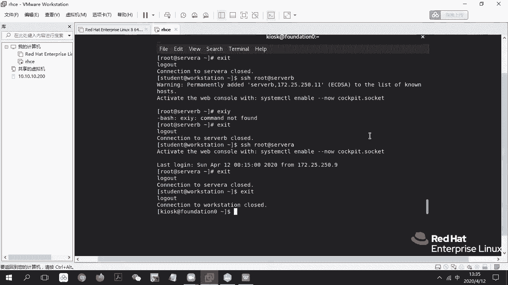
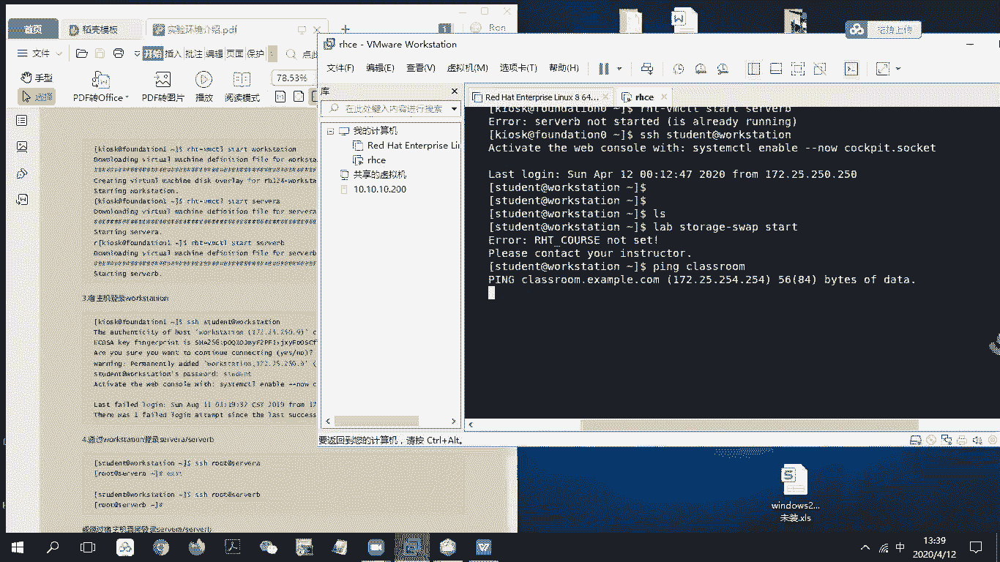
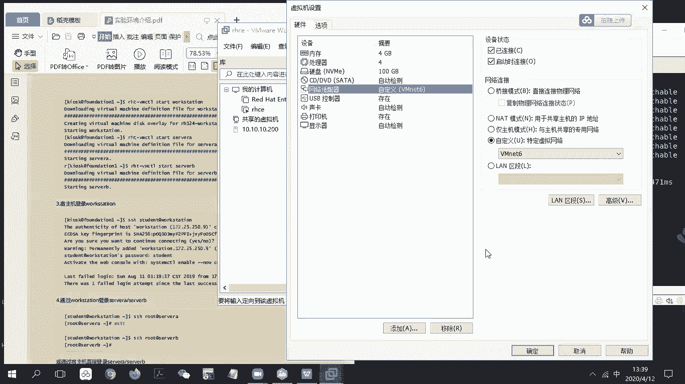
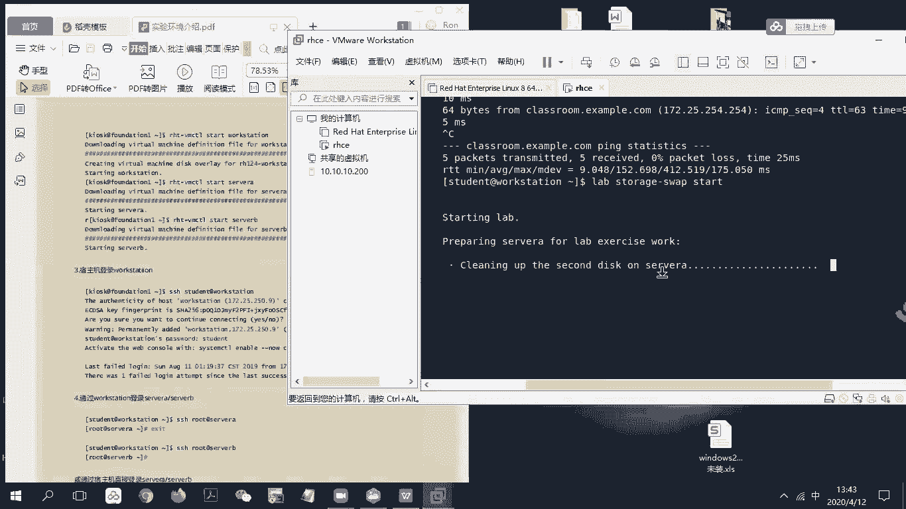

# RHCE8.0视频教程【45课时】 - P24：20200412-RHCE-02_recv - 六竹书生6682 - BV1su4y1Z7sJ

嗯这边的话呢首先我们从环境当中进来的话呢，是不是就到了一个k i o s k，然后at foundation，这里这个的话呢，就相当于是我们的一个教室环境语言，这里的话呢把你的pdf去啊。

这个叫做对我给你发的pdf，你去打开一下，把它拖到第一页环境介绍这里，对他这个的话呢，你看啊，就是说这一台你们这台虚拟机里面的话呢，它是有很多的一个环境的，里面有主机。

就是这个叫做呃server a server b workstation，是我们要去操作的，然后其他这一块的话呢，classroom content，这个是一些资料，就是说我要去下载脚本的话呢。

从这边去下载，然后这两个的话呢它是一个网络嘛，就是说我们这边的话呢是一个250网络，这边的话呢是一个252网络，去进行一个相连的明白吧，现在这里的话呢，我们要去进行一个进行一些操作。

首先这里打开了之后的话呢，留言往下拖一点哈，你看再往下拖，这上面这张表格是里面的一些ip地址，你再往下拖好，到了这里，你这边的话呢rh t v m c t l start classroom。

这个的话呢，就是把整个环境的话呢去进行一下启动，你这条敲过了吗，你去敲一下哈，就这个ht v m c t l start classroom，就在那个启动教师机那里上面。

这条i ht v m cpl start classroom，这条命令，在你的环境，那那你就说鼠标定位到那个虚拟机里面去，然后rht。

rht，i h t，很vm c t l start s t a r t，classroom，但是好像我这边学生机我是直接开的，下面那个单选，好像是，就是它下面是有一个学生机，跟那个驾驶机的区别吗。

没关系，你先敲这台啊，靠这个，他这边的话呢，就是说会给你去部署这个考试环境，v da的一个环境，就是说练习的一个环境，知道吧，现在开起来了之后，接下去就是我们的一个学生机了嘛。

你的话呢就rh t start d这台把它给抬起来回车，然后这里的话因为你已经开启过了，接下去的话呢呃就去你这个去拼一下，看一下的话呢能不能到，因为你现在的话呢是整个只有自己一台ping，不看杠c的话。

那就拼一次嘛，现在这里的话呢它是能通的，就说你那台设备已经起来了，接下去的话呢你就说去看你的workstation server a serb，因为class room的话呢。

就相当于是一个教室环境里面的话呢，有很多资料，然后你到时候去操作workstation啊，然后服务器a服务器b的话呢，要去class用当中去拿东西，start workstation，w o r k对。

回车呃，然后的话呢再去启动一下server a，你应该都启动过了，但是流程是走一遍哈，但他们就是说这个启动还比较慢的，因为挤一下应该要要等一会对，因为就是说启动虚拟机税的话，可能会比较慢一点。

它有一个流程百分之百要走，然后你再补充，然后接下去server b再敲一下，他这边有个错误，是因为他已经开过了，所以是一个错误的情况，接下去的话呢我们就可以开始去做题目了。

就远程到workstation上面去，就是说以student的一个权限吗，at workstation回车，稍等一下，然后这里的话呢登录上去，我不是啊，给你们去发了几页操作手册嘛，它的第一条的话呢。

是让你们先去重置一下环境嘛，就是在这个叫做workstation下面的话呢，去进行一个输入命令的话稍等哈，呃比如说我们做的是那个叫做逻辑卷，就是交换分区的一个管理，就在这里敲l a b lab。

l a b李渊，然后空格诶呃我发命令给你吧，l a b story，哦对对，然后横线，然后的话呢wap空格start对回车，然后这边的话呢嗯诶你这边是到不了吗，你去搜一下class room。

我看能不能到，是个p classroom，哪个classroom ping是吧，对，不能到对吧，对你这个i h e我我想一下，就是说这classroom是不是是不是老师那边有一个。

就有一个后台要要开，还是感他这个其实就是说class new workstation，还有设为a4 的，全都在这台虚拟机里面了，这才好像你就i h e l，你前面上面的编辑。

我看一下就是虚拟机软件的编辑哦，哦不不不，文件旁边的哦，对可以的，就是设置，有点这个这个有点难受，可以没事，那这样子的话，我到时候给你去录个屏吧，我去用一台电脑哈，首先要和class入门通。

然后网络桥接模式，你已经nt 6了对吧，对nt 6的话呢有没有，然后你把它给关了。

取消一下，然后叫做嗯编辑虚拟网络编辑器，这边hcp的话关掉了没有，看一下诶，你变net 6吗，我估计是有，估计是有，只是安全权限问题没显示出来对啊，哦这里没有vm 6对吧，添加一个网，你添加帮我点一下。

我现在这里点不了哈，添加网络，然后选择va net 6，确定一下，然后把这个dh cp给关了，勾勾勾给去掉，确定一下，嗯对应用也行，确定也行，确定嘛，然后把这个界面给关了，等一下。

我等一下给你们去录制一个完整的流程吧，他这里网卡的话需要设置一下，然后有人问这个完整的完整的呃扫描电子档，因为最近的话呢还没有去扫描哈，哎确定点一下，然后这里你再来p一下，看现在能不能通啊，不对。

workstation直接去pin classroom，classroom呃，因为你本身就已经在workstation上了，所以去拼一下class 1，可以了可以了，然后你再去lab一下，ctrl c。

稍等哈，lab storage s t o r a记忆横线，rap s w a p，start with you，等一下哈，他如果没有报出错误的话，那估计就就是在，就是说修改设备里面的一些配置。

然后的话呢去加载脚本，你们接下去的话呢就可以一步一步去做了，我觉得你们很多人不能成功的原因呢，就是那个网卡，因为在手册里面的话呢添了添加了一个vr net 6，但是呢没有告诉你们。

就是说编辑里面要去把新增加一个网卡，把dh cp给去掉，你看他现在的话呢就是在进行一些预配制嘛，到时候我们考试模拟的时候也是这样的，会给你们脚本，让你们自己先去运行一下，到时候再去做题，做完了之后呢。

有个检查脚本去看一下，你们做的对还是错，能明白吗。

