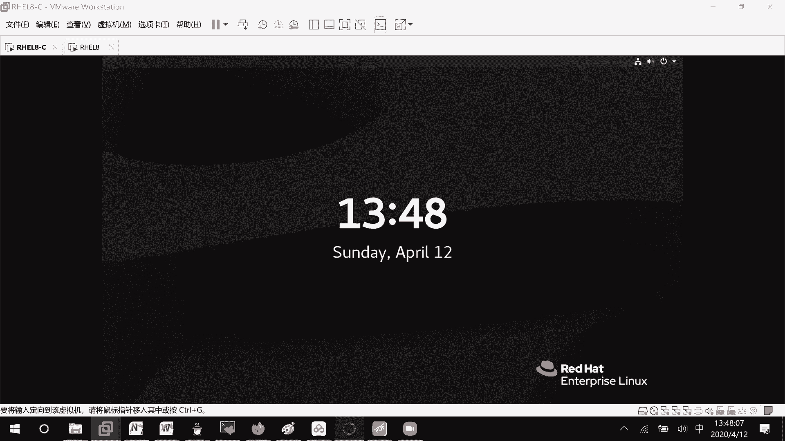
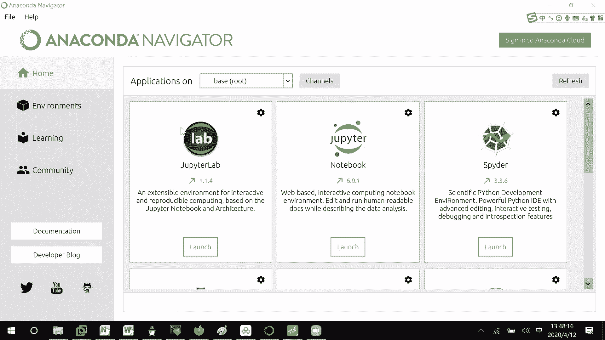
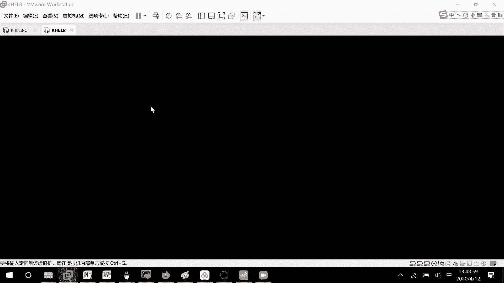
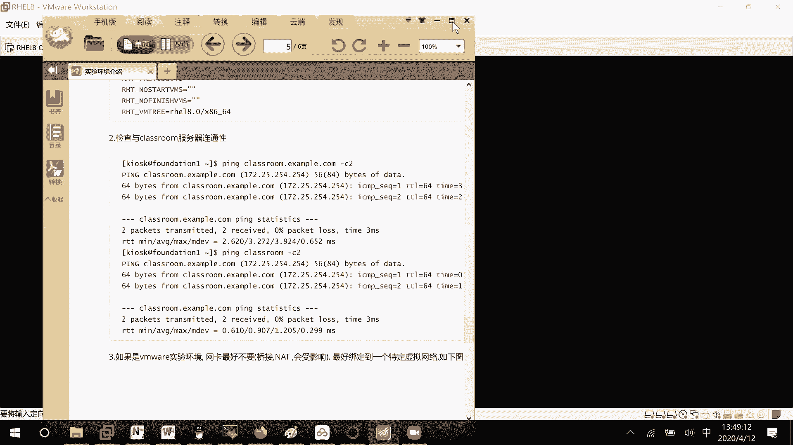
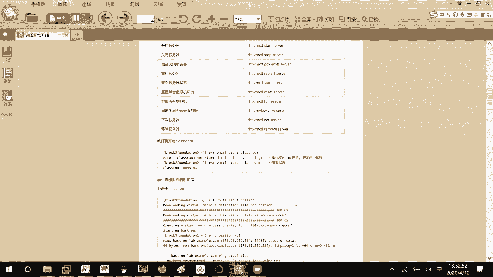
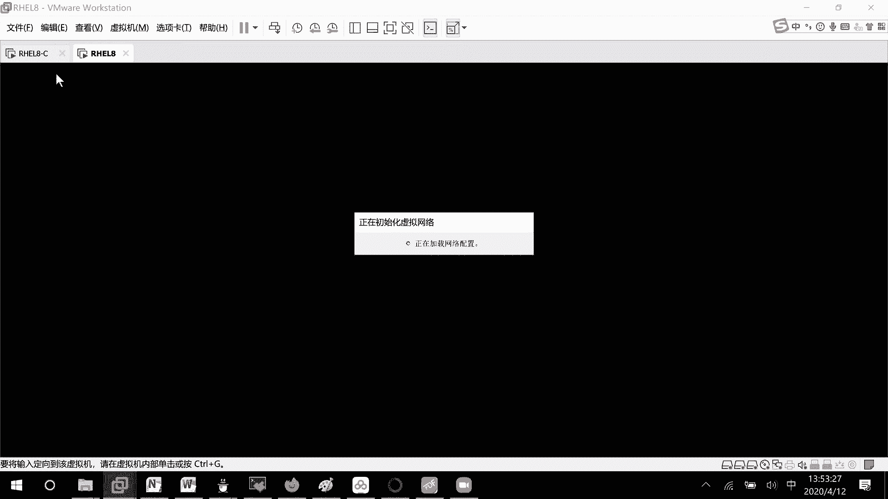
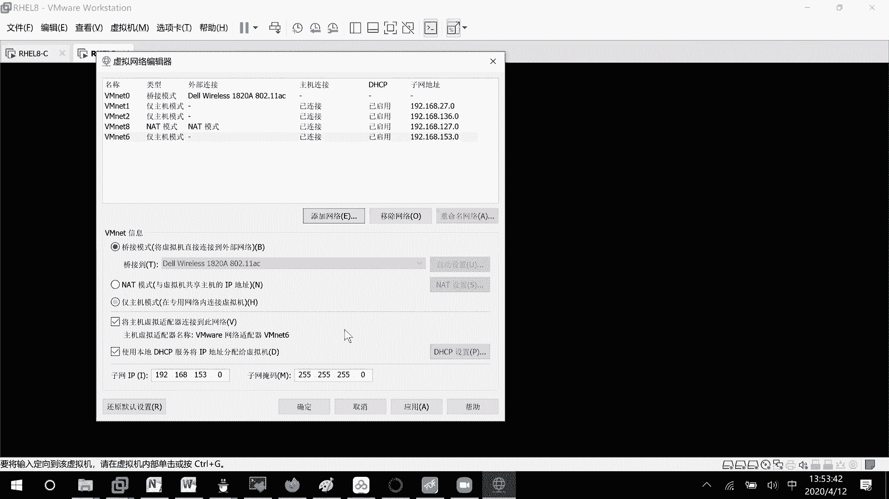
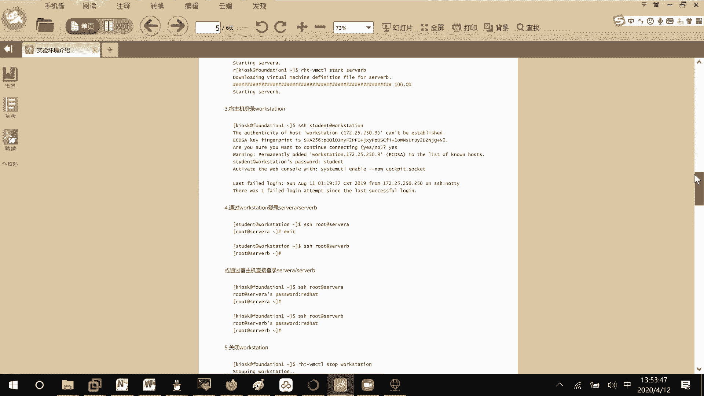
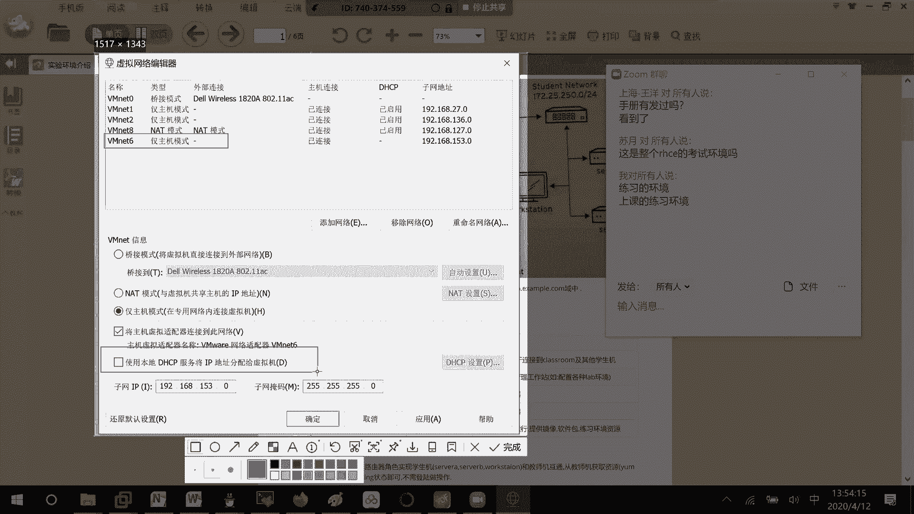
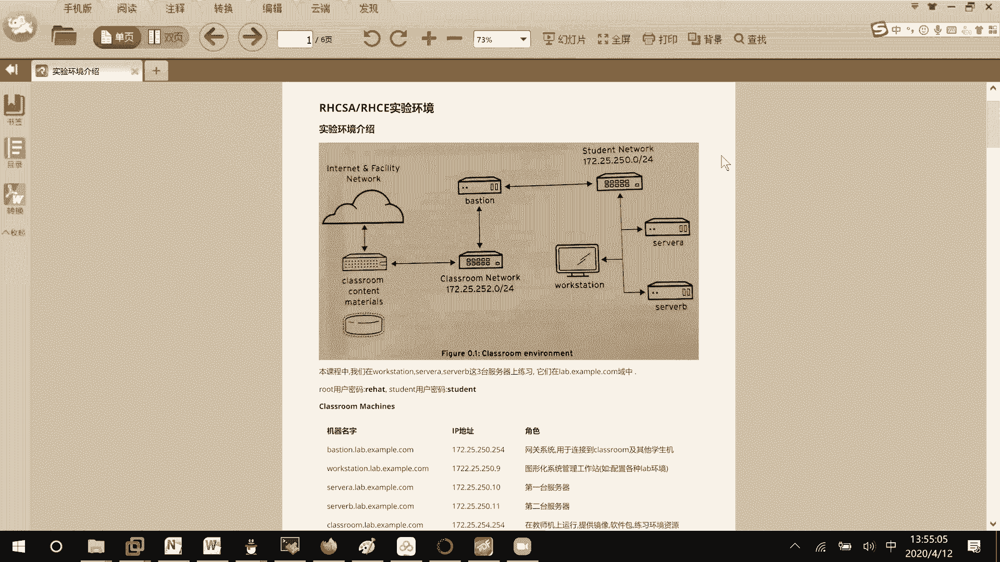

# RHCE8.0视频教程【45课时】 - P25：20200412-RHCE-03_recv - 六竹书生6682 - BV1su4y1Z7sJ

好啦，那这边的话呢我们来看一下，就是嗯环境的一个介绍。

这里我到时候会给大家去录一个屏哈，这是整个不是的，这个只是给大家练习的环境。

因为红包考试的上课练习环境的话呢。

它的一个整体的结构。

你看它的一个整体结构是怎么样呢，就是说这里有个classroom，就是我们的考官机，但是刚才给你们的那台虚拟机的话呢，其实就这整个它全都包括进去了环境，然后呢中间有一个叫做网络的动，就说网段172。

25。252，是去我们这边的学生网络和考官网络相连的，这个的话呢是一个网网络交换嘛，然后接下去的话呢这里有个workstation sera sera b，这个才是我们要做的，首先我们先登进去的时候呢。

它有一个叫做foundation，对不对，这就是我们最外层的这个叫做物理机，像我们考试的时候，你们一打开电脑看到的就是一个foundation，知道吧，然后呢在foundation上面的话呢，哦不对。

你们直接打开的话呢，就是一个我你们打开的时候，你们在考试的时候就这么一小部分，你们考试的时候就这么一小部分，就workstation上有server a和servb这两个东西，知道吧，考试的时候。

考试的时候呢打开的一台虚拟机，它就是一个workstation，但是我们现在练习的时候呢，是整个环境都包括进来，然后这里的话呢就是考关机，我们说的资料存放的地方，然后这几台的话呢是咱们要操作的。

像我们的话呢，首先把所有的设备启动完了之后，根据下面嘛我们去s h到workstation，workstation之后呢，比如说你现在想要开始做题了，就lab storage review start。

那好，然后接下去呢根据题目的需求在server a上做呢，还是在server b上做，知道吧，做完了之后有些练习它是可以去检查成绩的，可以检查的话呢，就去grade一下就可以了，如果不能检查的话。

那就没有办法，因为可能就是说书上面已经有很详细步骤了，这里的话呢像workstation上面的话，如果你这个练习做完了，你还想去做一遍怎么办呢，可以finish他的话呢。

会把环环境重新的给你们去重置一遍，能听明白吗，好吧，然后的话呢像这个red hat啊，哦不对，像这个server a r server b啊，workstation他们的一个用户名和密码。

在这root密码是red hat，然后student密码是一个哦，student的一个密码好吧，这里这里的话呢你看啊，我们再来看一下，这里是一台linux主机，这是三台linux主机。

这中间这里的话呢是一个网络的信息，把它们连接在一起，其中这个workstation是我们的工作环境，这里的话呢两台server没问题，然后这里class room的话呢，就是一个资源环境存放的地方。

跟我们要去操作相关的，就这三台只是说现在自己练习的时候呢，这四台虚拟机你们都要去管起来，然后这里的话呢它是一个网关服务器，所以的话呢四台你不要去管起来，知道吧啊这里的话呢没有什么问题。

这个的话呢就是说怎么样去控制，虚拟机的一些开关开关，然后这里的话呢第一步咱们要去做的，第一步。

如果说你不去做的话，那就相当于考官机没有开起来，你到时候要去初始化环境的话呢，没有办法去做，然后这里有个比较重要的问题是什么呢，最后一步，这里是不是让你们去添加了一个叫做vnet 6啊。

我们很多人的电脑上面的话呢是没有vm net 6，这个呃我点错了哈，稍等我一下，很多人电脑上的话呢是没有vm net 6这个东西，所以要点击编辑，然后呢编辑网络适配啊。

编辑网络适配器，然后在这里大家去添加，因为那边添加的是vnet 6，这边咱们也去添加vnet 6，因为要做环境当中的话呢。

具体每一台设备地址是多少。

这边是不是已经固定了呀，这个的话呢我配的不是静态的，它的话呢要去这边网络系统当中，会自动的去拿ip地址的，因为根据他们的mac地址的话呢，绑定过的知道吧，所以的话呢希望你们把这边bh cp给关了。

不关了的话，外面一个dh cp，里面一个dh cp，他就混乱，会外面这个优先的，所以大家一定要记得，这个vnet 6就仅主机模式就好了，别h cp一定要关掉。

不关掉的话呢，环境可能不能正常运行，知道吧，然后这边的话呢呃环如果网络已经调好了之后，你们就去测试一下，主要是这里吗，如果说呃这个不是哈，如果你进入classroom，而进入这个workstation。

它能去pp classroom，就这弹他能去拼通classroom，是不是，就相当于这个250网段，和这边252网段可以互通啊，那整个网络没有问题，你们做实验是没有问题的，听得明白吗。

我到时候的话呢会去给你们录一个屏幕哈，哦就是说录一个屏哈。

就是说关于这个考试环境怎么用的，如果说现在已经听明白的，同学。