# RHCE8.0视频教程【45课时】 - P27：20200412-RHCE-05_recv - 六竹书生6682 - BV1su4y1Z7sJ

好最后的话呢剩半小时时间，我们来看一下，现在的话呢我们要来讲一个东西叫做nfs。

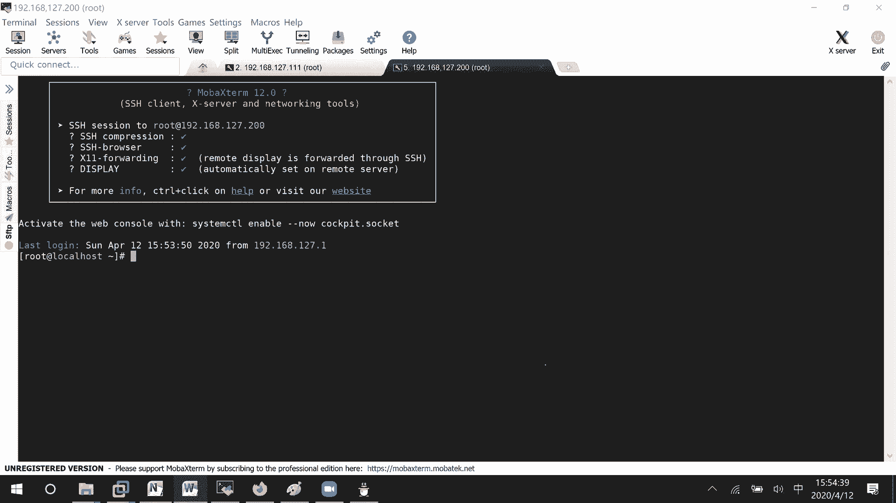

这个的话呢是什么东西呢，就好像说我这边有两台电脑，一台电脑的话呢ip地址是200，他的话呢是公司的一个服务器，他有一个目录呢想要去共享出去，让公司当中其他人能来这边去获取资料啊。

或者说放一些重要的信息进来吗，知道吧，这个就是n就是网络f就是文件s就是系统，网络文件系统这些客户端的话呢，去把这里的目录信息给加载过来，我就可以去进行一个访问了吗，就这样一个东西。

我这边的话呢有两台设备，这台设备是三个一的ip地址，我作为客户端这边设备的话呢，它是一个叫做200的地址，我作为一个服务器端，好吧，这里啊192。168。127。200，我作为我的服务器端。

然后呢192168127。111，我作为一个客户端，首先的话呢我们要配置的就是服务器端，它去共享一个目录出来，然后呢服务器端去把目录信息给加载过来，然后呢在本地进行挂载啊，临时挂载啊或者永久挂载吗。

这样子的话呢我们再去进行一个使用吗，行吗，那好这边的话呢，我怎么样去对它进行一个共享呢，共享呢这里第一个服务器端配置，共享一个目录，比如说这里md i r叫做什么文件呢，嗯n f s test它吧。

好创建起来了，我希望把这个目录共享出去，服务器端在哪里去说明呢，expose这里面去说明，在这里面就说明你要把哪个文件呢给共享出去，回车里面怎么去写呢，哪个目录，稍等哈，估计上划线不行。

下划线等一下我把它改改成一个目录，是下划线的吧，上划线不行啊，然后接下去谁能访问哪一个网段的能访问，如果你都写零的话呢，那就所有人能访问，比如说现在只有127。024倍的网段，可以去访问。

怎么样去访问呢，可以读写s y n c同步，也就是说只要有文件写上去了，或者只要有文件被删除掉了，我这边立刻同步显示吗，知道吧，好这边的话呢我把那个n f s给删了。

mad r n f s叫做下划线test好吧，这边的话呢我们去把我们的nfs，毕竟这里是经过配置了嘛，所以呢要去启动我们n s f s服务，system control restart nfs。

嗯我看一下，server server，这个的话呢n f s基本上我们在启动的时候，只有第一次是这样启动的，如果说后续你对这个配置文件有修改的话呢，我们怎么样去启动呢，叫做export fs。

杠二就reload o就就是表示所有的条目嘛，就说重新去读取一下所有的条目，它的话呢就进行一个加载一下，明白吗，减v的话呢，就是说查看一下你加载到了哪些信息，第一次，你会这样子去做，然后如果是后续呢。

那你就这样子去进行一个加载，而且这个是作为服务，你肯定希望每次在重启的时候呢，服务自动机起来吧，应该报n f s service of server server好吧，那好在服务器端我们这样子配的话呢。

其实就已经配好了，这里要做的事情呢，我们避免就是说防火墙的一个干扰，如果说想要去除防火墙干扰的话呢，之前我们已经学过防火墙了，你就把服务给关闭掉就行了吗，这边我就system control stop。

我们的firework，然后呢顺便我把sa linux给关掉了哈，你们到时候去根据规则，去把这个sa linux的标签纸啊，或者布尔值啊，自己去开一下好吧，服务器端的话呢，我们就这样配好了。

第二步是不是客户端要去进行一个加载啊，客户端是发现目录对吧，客户端的一个操作，首先第一个客户端的话呢，它是一个懵的状态，他是不是要去网络当中去搜索一下，有哪台主机的话，那可能就是说有哪个目录去共享啊。

去搜索，这边的话呢怎么样去看呢，show mt减一，比如说我知道在公司当中哦。

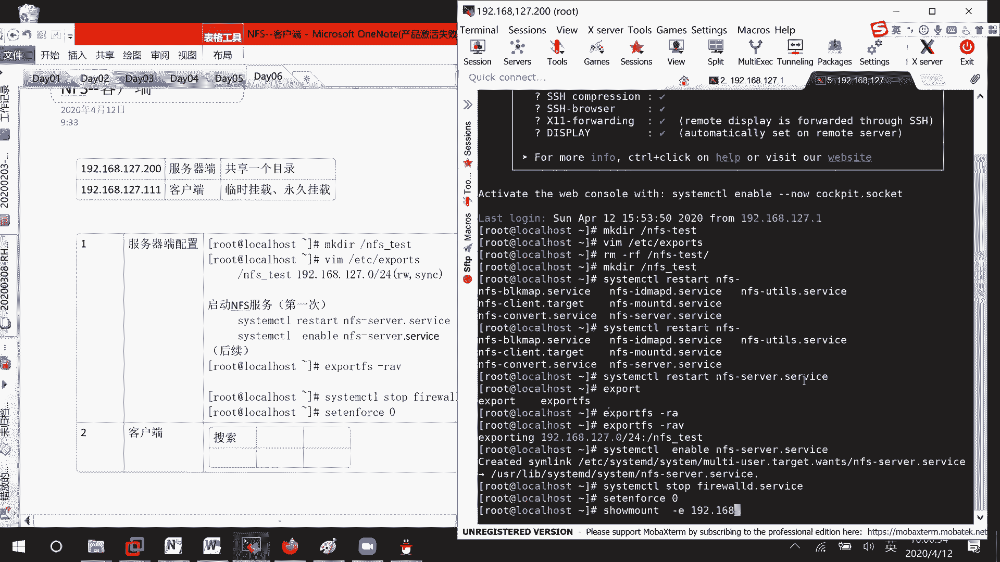

稍等是这边这里客户端码show mt简易，我去扫描192168127。200，这台设备有没有什么目录是共享出来的，然后呢这里是不是扫描到了他有一个nfs，对127这个目录的话呢是公开的呀。

在这里搜索到了这个信息，如果说我现在的话呢，想要去用这个东西怎么办呢，也就是说我后续的话呢，想要去从这边去下载文件啊，或者写入文件吗，该怎么办，nfs应该了解吧，就是这边可能是一个服务器嘛。

文件服务器吧，你就这样想，上面有很多资料，或者有很大的目录可以给你去用，你的话呢作为客户端，是不是就是说要连接到这台服务器上面来啊，你到时候的话呢才能去，比如说写入文件啊。

或者呃叫做删除文件或者下载文件吗，你这是客户端，去访问远端的某一个目录，它共享出来的一个目录去提取他的资料，能明白吧，刚才已经把服务器端写好了，现在就要来写我们的客户端了，好吧，发现了这个目录。

我怎么样在本地上进行使用呢，比如说mc比i n f s plant吧，等一下，zl i e n t好吧，这里要去挂载，要做的事情肯定是先去把目录给创建起来，然后呢挂载到本地。

这个从远端挂载到我本地的运用程度是一样的，帽上从192168127。200，它上面的是什么目录呢，这边是不是看到了nfs test的一个目录，挂载到哪里呢，我本地的nfs plant df点大t。

这边是不是就多了这么一个目录对吧，就这样子，那好稍等哈，基因就挂载过来了，就这么一个条目，而且的话呢它这边在挂挂载过来的时候，格式是什么啊，fs 4就不再是什么x f s e，x t4 的一个格式。

对不对，这种是临时挂载，如果说你希望进行一个永久挂载的话，该怎么办呢，是不是一样的，v i m e t c f s table，然后呢我们在下面去补充嘛，从192168。127。200。

上面的nfs test条目录，我要挂载到本地的nfs plan成目录，它的一个格式的话呢是nfs 4 force 00对吧，接下去保存退出放下减a f ht是不是就有了。

我刚才这边卸载的肯定就就就是没有掉的嘛，对不对，这个不用怀疑啊，我只是没有给你们去检查一下而已，上面这个叫做临时挂载，以前的话呢七版本当中，它这个nfs在考试的时候有很大的bug。

一下nfs一下nfs 4都需要进行测试的，他现在这边的话呢就比较稳定了，不需要咱们去测试好吧，因为以前的话呢就是说字版本，还有一个普通的版本也都存在的，都不知道写哪个版本，现在这个就比较稳定了啊。

你看这里就可以读取到了吗，那这一数就行了，那既然读取到了，我肯定是想往上面去写东西了吧。

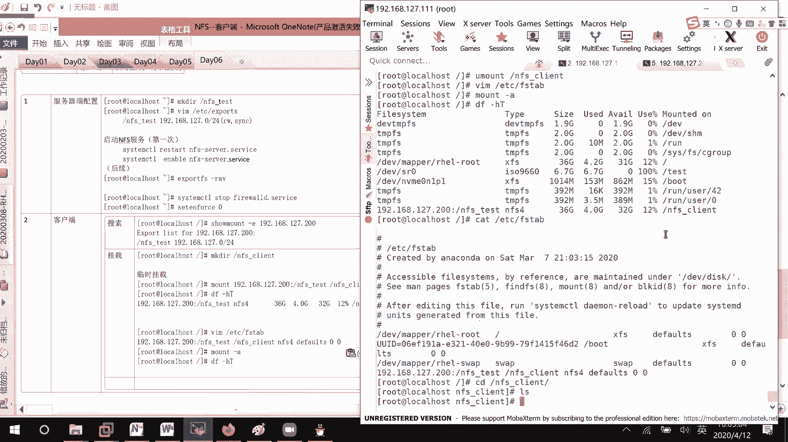

你看我在服务，比如说服务器端，我进来，本来也什么都没有嘛，我呢charge aa有东西了吧，客户端呢这里也看到东西了。

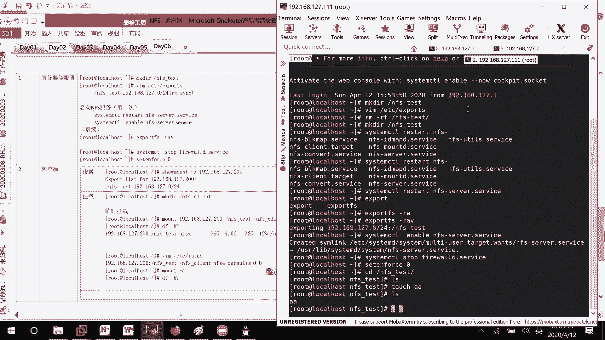

是没有问题，如果说我也想要去写入东西呢，客户端写入文件说make dir也好，touch也好，是不是都是可以的，你先看它cat啊。

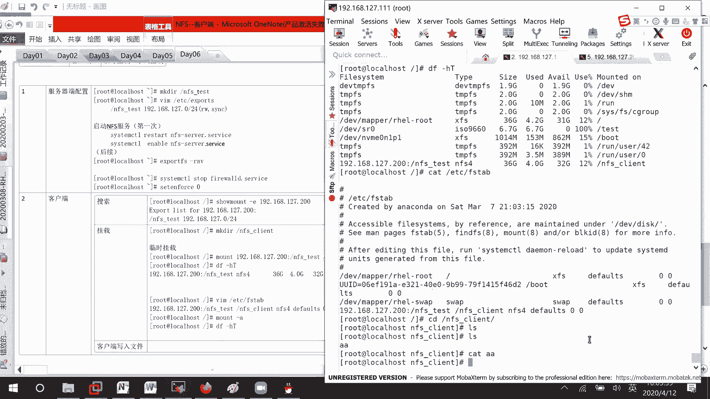

只是说没有显示出东西就扣去，hello，到我们的bp文件吧。

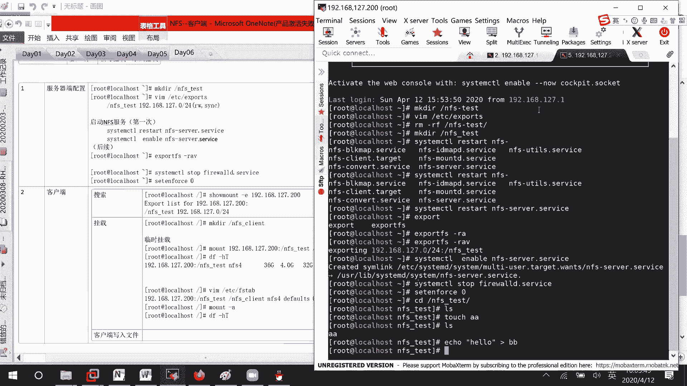

你看这里h，是不是hello啊，能查看，如果说我想要也去pass一个cc呢，发现permission deny了，为什么会出现这个问题呢，你看我这边的话呢，是以什么样的用户去访问root用户。

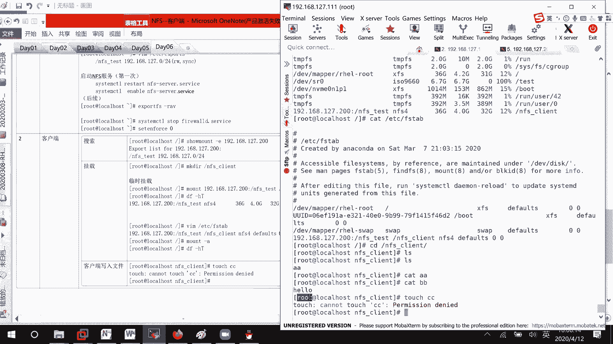

然后这边的话呢它的一个目录权限是什么呀，root用户是可读可写可执行，为什么我还不能去进行一个写入呢。

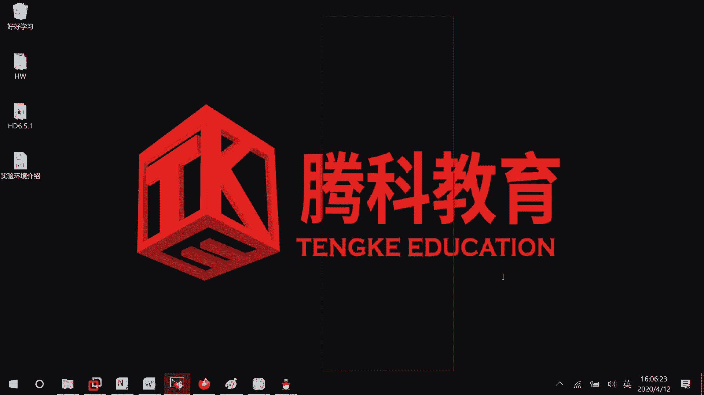

就是说客户端以r o t用户进行访问的，为什么还是不能写入呢，那我们第一个想法是不是去服务器端，李信发现这个权限的话呢，root它是有写权限的对吧，那这边为什么不会呢，他在这边你稍微注意一下。

我服务我客户端去进行访问的时候呢，实际现在，权限被压缩了，就是说虽然这边是一个root用户去访问的时候呢，就相当于ftp当中的匿名用户，这边的话呢叫做nfs nobody用户，他的话呢去进行一个访问。

那现在这个的话呢，我本地其实用能nfs nobody去访问这个目录，对他来说是不是就用这个其他用户权限，很很很明显没有写的权限对吧，如果说我把写的权限加上去呢，叫做w加，哦不对。

o加w我的一个n f s test，这是不是有权限了，我再来touch一下，有报错吗，没报错，已扣去，ok e d里面at d是不是也有啊，这边呢是不是也有这些文件。

所以的话呢这个是因为权限压缩的一个问题，因为就是说之前nfs客户端的话呢，是我们在254当中会去学的一个东西，这边的话呢我们先来看一下，如果说自己真的想要去处理的话呢，咱们该怎么样去进行一个处理好吧。

在服务器端的话呢，对它进行一个处理，这里啊这是一种方式，我这里呢把它给修改过来，圈之mod o减去w叫做nfs test，那现在的话呢如果他想要去写的话，肯定就不可以了嘛，他只是报错了报错了。

那好这边的话呢来看一下，就在这里共享的时候，你去说一下就行了，vim etc export，他这里不是也说了，共享的时候呢，其他对我是可读可写的，而且的话呢是一个同步对吧，只是说路测的权限被压缩了。

我不想他去压缩呢，no root s q u a n s h，就是说其实这里的话呢什么可读可写啊，都是在设置权限了，能明白吗，root spring的话呢，就是说能对它进行一个权限的压缩。

然后这个配置也配了export fs杠r a p，显示一下过程好吧，稍等一下啊，解决办法，可，不理n f s nobody，也就是说赋予其他用户对目录没操作对吧，然后的话呢第二个解决办法。

这个的话呢全都是在服务器端，第二个解决办法，他的话呢是怎么样呢，在共享文件的时候不对，root用户权限压缩就可以了好吧，就这几条命令，然后现在这边的话呢，你看我再来touch 11，这就没有报错了。

所以这两种方法都可以去解决，我建议大家使用下面这种方式好吧，我建议大家使用下面这种方式，那好啊，这边的话呢我们来看一下，那到底在进行这个挂载的时候呢，它有哪些权限的话呢，可以去进行一个操作嘛。

可以进行操作，我们的话呢可以用这条命令来检查一下哈，对不起，叫做mt，直接叫mt吧，at t e d c lb nfs，等一下我看一下cat etc e a n fs，难道没有这个表格了吗。

e t c哦，我写错了，要做v a r one liver，你看这边的话呢是所有全部的一个权限有多少，你自己的话呢去查看一下，嗯稍等哈。

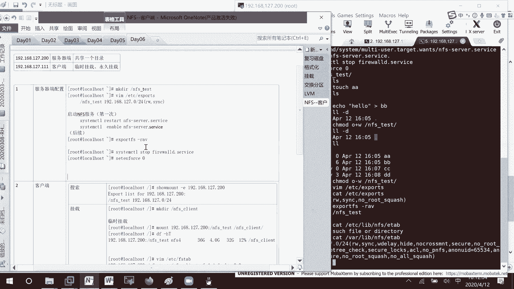

这边你可以去看的，他的话呢，呃这个文件去共享出去的时候可读可写，然后呢这边默认的话呢是一个root压缩的，线的话呢，没有压缩剑呢，没有所有的都进行一个压缩对吧，默认的话呢匿名用户是65534。

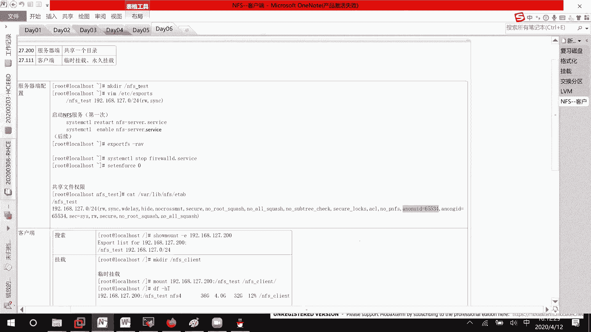

你看id id 65534。

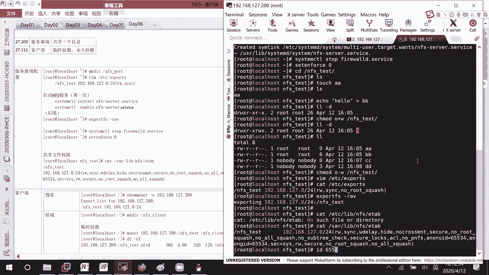

他的话呢是哦，他这边直接就是一个nobody，就不再是nfs nobody了，就不再是nfs nobody了哈，好吧这个听明白了没有，如果说出现权限问题呢，你可以这样子去修改一下。

但这个是服务器端的问题，我们现在红帽七就八版本的话呢，已经不再去关注这个东西了，所以就不用去管它好，然后下面这里的话呢，我们之前讲了一个自动挂载，对不对，这里再补充一个内容，另一个自动挂载。

叫做alt f s，你们没接触过，就好像说我现在的话呢，这边这边有有有有一个目录的话呢，是从我们的客户端那边，就是说去进行一个下载的对吧，如果说我我电脑关机了，然后再开机。

我一天都没有去连接服务器的话呢，那这个挂载信息是不是没有必要去挂载，如果说我要访问他的时候呢，那好点击一下他，他帮我去进行直接进行一个发展吗，如果编辑那个vim etc f s table。

就是说开机之后就会挂载，如果说编辑像我们这个auto fs呢，需要的时候，那好你给我去挂载一下，如果说我一天都没有用，找不到呢，那你就不需要给去进行挂载了，能明白这个问题吗，哦能明白我说的这个东西吗。

知道吧，按需进行一个挂载，好像这边的话呢嗯我就先退到根目录哈，因为想要去给大家去测试一下嘛，先卸载掉t i m e t c f s table，我把这行信息也给删除掉，没有，如果说我的话呢。

他有帮你挂载吗，没有没有挂载吧，因为咱们没有配置吗，我等我等一下，想要实现的操作是什么呢，他就帮我把远端的那个条目信息给挂载过来，能听明白我的意思吧，好吧，那这边的话呢实现的一个方式是。

这个叫做auto fs，我们来安装一下哦，我知道了，我要美元，好像还是e d c f s p哦不对，b t c ym是p read the heat啊，b i m a a，a a。

i p o r a s u r l等于fire，2号斜线斜线s o相机iso下面的有个叫做app，然后的话呢jpg check等于零，然后还有一个的话呢叫做name等于a，然后这里的话呢b。

然后这边的话呢叫做bo s，好请退出mt 1 v city room，到我的s o下面来ym reporter list，等一下好，有了下面这里的话呢，我来ym install alter fs。

第一步第一步安装软件，诶很快哈，他这里安装完了，他这里安装完了，然后呢，我们如果说cd现在nfs里面呢，d f h t没有看到任何东西，就说没有把我们的远端客户端给挂载过来吗，先就说检查一下没有挂载。

稍等我把没有用的这些信息都没有用，然后接下去的话呢，第三步我们要去配置alt f4 的服务了，这个是在我们的客户端去配置的，你谁想去挂载，就在谁那里去配，知道吧。

v i m e t c alter叫做有一个叫做master文件，在这里的话呢就可以定义，比如说某个目录，某个目录它下面的一个配置的话，就是说nfs进入到哪个目录下面，要从哪一台设备上去挂载呢。

你看这边我到时候是不是可以在某一个目录，叫做nfs lt下面，因为在公司当中的话呢，n s n f s n f f s服务器的话，是不是会有很多台，我比如说告诉大家，如果你进入一。

那我就连接到公司第一台服务器，进入到三，连接到第三台，进入到四，连接到第四台嘛，进行一个说明，如果说你把所有的文件都写在这里的话呢，会导致我们的文件非常的大，所以这边的话呢在这里你可以就去定一下目录。

比如说plant它的一个配置文件在哪呢，auto。ntfs这个名字到底叫什么呢，没有关系的，只要你到时候配置文件叫这个名字，它就会去识别明白吗，就这个意思啊，首先第一步配置主配置文件，对主要配置文件。

他的话呢是我们的auto master，等一下，在这个文件咱们去编辑一下，我写的是一个绝对路径，所以呢你们到时候要抄就可以了，然后接下去的话呢我们要做的一个事情。

是不是就要去编辑这个叫做auto f n f s啊，你知道里面的格式是怎么样子的吗，我不知道，但是的话呢这个可不可以作为我们的参考文件，因为人家已经配置了m i c嘛，对不对。

所以呢我就copy e t c，auto演mic sc文件作为我的配置文件，先到时候再去修改吗，复制这个文件，然后这里呢去编辑目录的文件，好吧，vm这个文件，回车你看这里的话就格式就告诉你。

到时候挂载的格式是怎么样，从哪里去进行一个挂载吗，就比如说我们这边吧叫做呃，他下面的一个叫做，好server，我们等一下，比如说server 2吧，文件格式呢fs type等于n f s4 ，对不对。

从那边下下载过来的话呢，是不是n f s4 啊，然后接下去哪台设备呢，192168127。200几台设备，哪个目录呢，n f s test这个目录对吧，前面如果不写任何主机的话，那就表示本地。

如果写的话，那就表示服务器那边知道吗，那好这里好了之后，咱们保存退出，毕竟的话这格式知道吧，earth client，下面的server 2，它自动的会从127。200上面。

把这个nfs test给挂载过来，好歹它是一个服务，所以我们这边的话呢是不是要去重启服务啊，如果你们在工作当中是用到的话呢，也要开机自启动，知道吧，两条命令。

system control enable auto fs，system control restart，我们的auto fs，稍等一下好，然后这里的话呢已经启动完毕了，咱们就来试一下嘛。

cd n f s plant下面没有任何东西吧，cd我一条路走到黑server 2诶，发现进来了，发现里面还有一个a a b b c c d d对吧，f h t发现他是不是也是进行了一个挂载啊，对不对。

我现在如果cd点点，因为它已经挂载上来了，所以这个目录呢就会一直存在在这里，就会一直存在在这里，能听明白吗，就是说你虽然一开始的时候没有看到，但是你知道公司告诉你呢，你去进入到server 2就行了。

你是真的能看到东西的，这个的话呢，它就真的帮你去进行一个自动挂载了吗，然后的话呢因为挂载上来，因为你是需要使用这个东西，所以他这个目录的话呢，就会就是说这一次就一直挂着，如果你关机重启了之后呢。

这边又没了，知道吧，或者你看mount grape，我的server 2，这里n f s n f s4 挂载过来的，从客户端哪里，他就说的很详细很详细吗，看到了吧，如果有时候的话呢。

嗯我希望到时候的话呢进入到cd quest soo，不对，这个就是soo目录下面的话呢，这个叫做rh e l8 ，我能看到八光盘里面的东西可以怎么办呢，哦我这里make dir r就不要是s8 吧。

哎不对，如果我cd到iso 8哦，就说rh e l8 呢能把光盘给挂载过来，这该怎么办呢，就什么目录都没有关系，我这边只是给你们去举个例子，自动挂载光盘，是不是还是t i m e t c auto。

跟fs你写在哪里没有关系的，现在我们要挂载的，是不是一个叫做光盘的一个信息啊，光盘的话呢之前跟你们去说过了，d v cd room就是咱们的光盘，光盘的话呢，它的格式是不是iso 9660，你看这边。

其实它是直接帮我们去挂载到spring room里面去了，所以我们就说l s spring room就可以去看到了，然后现在呢想要去哦，等一下写错了，写反了，这里的话呢应该叫做r h e l8 。

然后这里的话呢叫做这个翻盘的一个位置嘛，就这样子去写，下面这里的话呢咱们再去补一条信息哈，好纯退出一下，人家是一个服务，所以呢我们去restart一下photo fs，哎现在没东西，因为同启了。

人家就说像叫做配置信息，是不是哦就会断开连接啊，你看我现在cd h l8 是不是有东西了，cd叫做server 2，等一下cd点点，要不二是不是也有东西了，这个东西的话呢叫做自动化载。

考试的时候呢也会去考到的，主要是考nfs，它怎么样去进行自动发展。

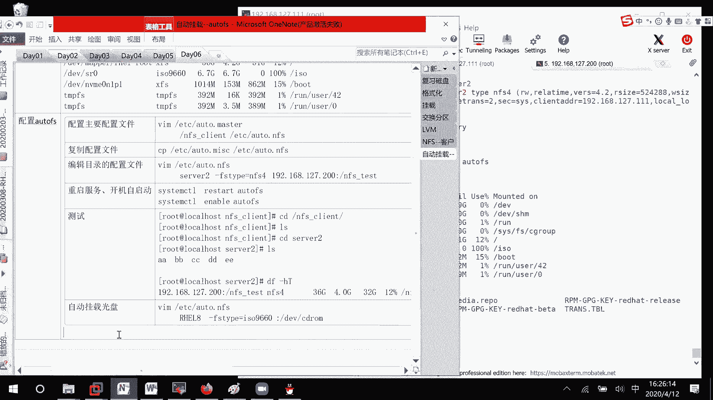