# RHCE8.0视频教程【45课时】 - P29：20200419-RHCE-02_recv - 六竹书生6682 - BV1su4y1Z7sJ

我们早上的话呢就是说讲完了if elc，还有一个叫做else对吧，然后这边的话呢，我之前在说的时候多了一一个s，你们这个的话呢去注意一下好吧，然后接下去的话呢像这种if的一个判断的话呢。

它基本上会是一些叫做连续的值，就好像100~0~210是不是连续的值啊，然后或者的话呢，如果说你是一个男生或者女生啊，比如说让你去出入性别，如果你输入的是f的话，那可能是一个女性打印出一个信息。

如果是m的话，是个男性打印出一个信息，所以if else的话呢，它不管你是一个离散值还是连续值，它都是适用的，知道吗，这边的话呢接下去我们来看另一种东西叫做case，这个case的话呢。

它是比较适用于那个叫做离散的值，这个的话呢其实如果你有能力的话呢，自己去掌握一下，如果目前的话呢觉得学的比较混乱了，你把if else的格式给掌握住就好了，明白吗，但是这边为了课程的一个完整的话呢。

像这个case我还是得去讲一下，就好像说有时候的话呢弹出一个信息，问你是啊，呃问你那个样源，你设置好了没有，就说问，或者就是说软件安装了没有，就这里弹出一个问题，这边的话呢让你去输入一个值。

比如说嗯输入一个y表示你的样员安装成功，如果说你输入一个n的话呢，表示亚元没有安装成功，也就是说替换成if else的话呢，就是if你的一个answer，他的话呢两个等线y或者answer两个等线小y。

这就表示安装成功了，否则的话呢是不是就没有安装成功啊，是这样子的一个问题，如果说我们用case的话，该怎样去做二次，s06 减s h chang mod，这里的话呢所有人加上一个执行权限，s06 好吧。

v i m s06 ，然后这里井号感叹号斜线b bas，然后这里的话呢，我们刚才这边是不是就是说分开去写啊，先一扣，取完了之后，你再进行一个叫做瑞德嘛，这边的话呢这两条命令我们可以合在一起的。

咱们看一下怎么样去做read减p，后面这边的话呢就写一个提示信息吗，请，是否设置好亚目源，然后这边的话呢就让你去回答y或者n码，如果你是y的话，那就表示设置成功，如果你是n的话。

是不是就没有设置成管这个a n s，在这里的话呢就是去承接变量去用的，就就相当于是这两条命令它合成了一行，能明白吗，然后经常我们自己在输的时候呢，嗯有时候可能输的是大y啊或者小y啊。

大n啊或者小n是不是都有可能都有可能，那这边的话呢我们如果是用if else，那肯定是这样判断的，if你的dollar a n s等于一个大写的y，或者你的a n s等于小写的y。

然后这边的话呢就就显示出来一个ok吗，然后接下去的话呢，else这边的话呢叫做打印的信息，就是请设置好亚目园，好吧，然后呢好了之后，咱们这边可以退出嘛，其实这个不写的话呢也没有关系。

如果后面没有语句的话呢，后面没有语句就相当于直接去退出了嘛，fi然后这里e s c弄好w q我们来运行一下，设设置好了吗，这诶这个answer，这有点小问题啊，好的，这边的话呢锐减p，看一下。

这就可以了，因为我刚才那边的话呢，空格忘忘记去空了，空格忘记去空了，cat s06 ，对不对，这个的话呢我们是用if else的形式的话呢，来写的这个问题。

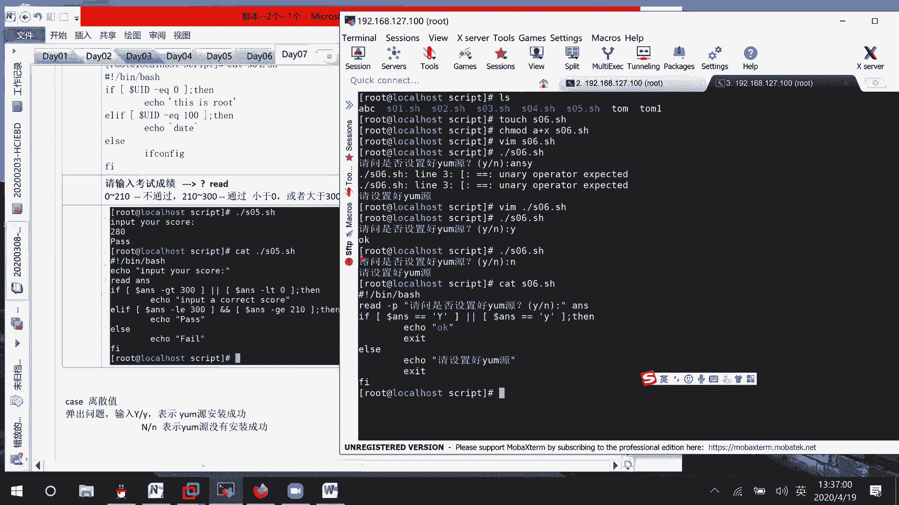

如果说我们用case的形式怎么去写呢。

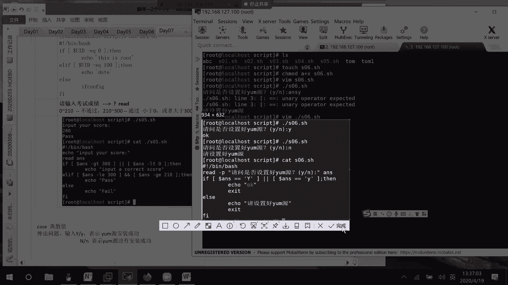

case它只适合这种叫做离散的情况，我们来看叫做差距，s07 点s h，全剧mod a加x s07 e i m s07 ，井号打3号下面的special，然后的话呢是一样的，第一个read减p。

比如说请问，亚美元是否，设置成功，让你的话呢去进行一个回答吗，回答到了之后呢，放到n s当中，你看his，我现在的话呢想要来判断这个变量，如果case等于y这边我们要输出的是不是ok啊。

ecoach o k，你这边的话呢要打两个分号，就表示后面的呢我就不去执行了吗，知道吗，就是说后面的一些case语句我就不去执行了，如果说你看啊，我这边的哦，不是应该是要打一个退出符号。

这两个分号本来就要的，如果说我这边没有退出，你们来看一下，等一下什么情况，这边如果是无y这边ecoach，我这边就大写的y，ok好吧，如果说你是一个小写的n，那就ecoach，比如说f a i l。

然后还有大写的n，那这边的话呢一扣去大写的n f a i l好吧，上面这里呢我来补充一下小写的y就这样子，然后的话呢他这边就说结束了之后，标记是怎么样呢，有个东西叫做e s a c表示这个模块结束了。

来看一下这个语句啊，这什么意思呢，你获取到n n s之后，n s这个变量，你如果是这个值，我就执行这个语句，如果是大写的y我就执行这个语句嘛。

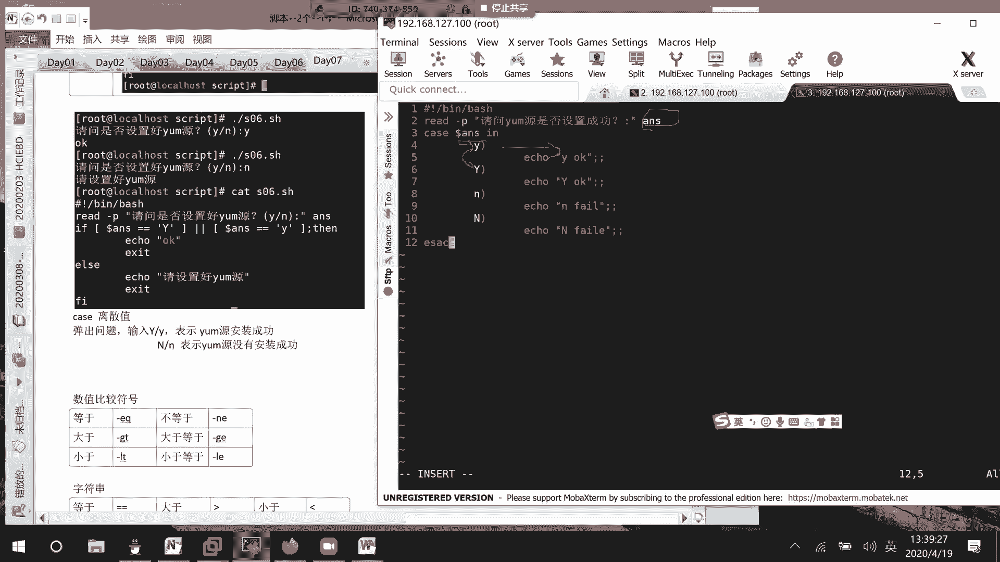

是不是这个意思啊，我截个图啊，放在边上给你们。

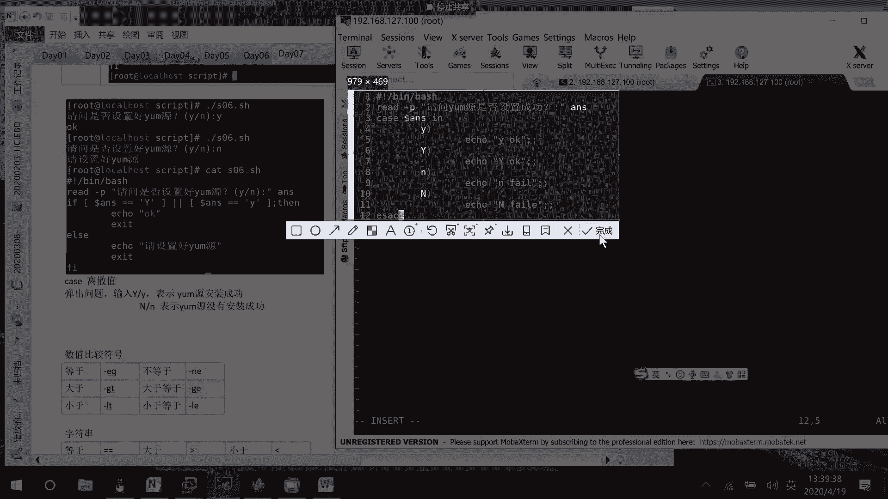

零七，我这边的话呢我先输一个小写的y好吧，你看这边的话呢，它是一个ok如果说我是一个大写的y，他的话呢是不是也是ok这边的话呢，如果不是两个分号的话呢，他可能就是说后面所有的情况，也会再去执行一遍。

所以这一定要注意是两个分号，两个分号，不然的话呢后面所有的东西都会去执行一遍，这没问题吧，然后的话呢，如果想要让我们这个代码简单一点呢，比如说这个东西我不要了，那这个也就是说大大写的y或者小写的y。

这边就一扣取，ok就好了吗，那相同的如果是这里的话呢，就是大写的n或者小写的n就一扣去，失败就好了吗，好吧，现在的话呢咱们来看一下s07 ，比如说我写一个小写的n fr吧，大写的n是不是也是fr。

所以所以所以这个case的话呢。

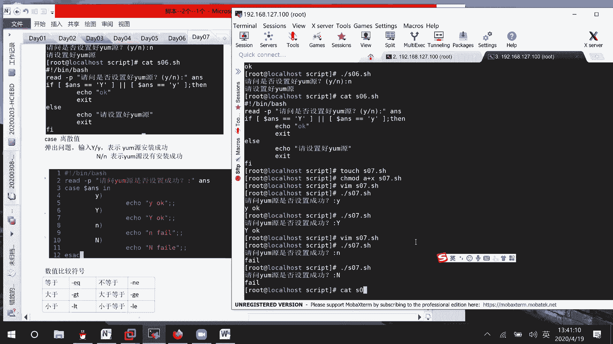

就是他这个case的话，如果说你这个值是可以枚举的。

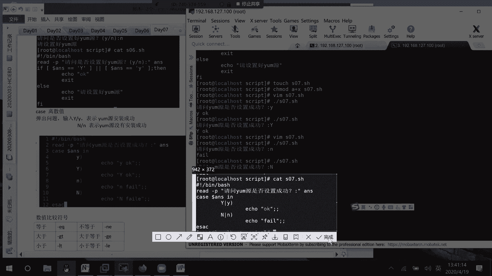

你可以这样子去写，知道吗，那现在的话呢还有一种情况呢，有时候我在输入一些值的时候呢，不是特别的规矩，我可能就会去输什么了，a他是不是就没有任何提示，如果说我希望他输入的不是y也不是n。

其他的任意字符的话呢，去弹出输入错误这个提示提示该怎么办，在下面这里加一行星号，就表示匹配其他的所有情况，新号就表示匹配其他的所有情况，就像if else当中的这个else这个东西，知道吧。

一coach请输入，或n就可以了，然后这里的话呢我们就结束了嘛，现在你再来看一下a是不是就弹出这个提示了，所以呢。

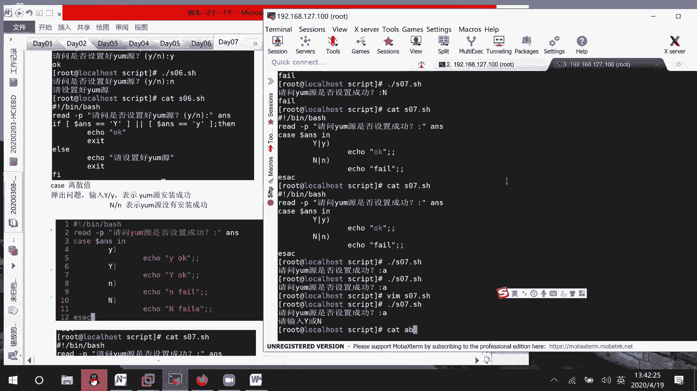

他这个稍微去注意一下。

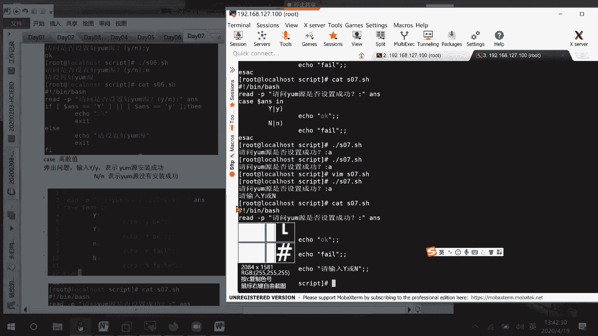

这个符号表示匹配所有表示匹配所有。

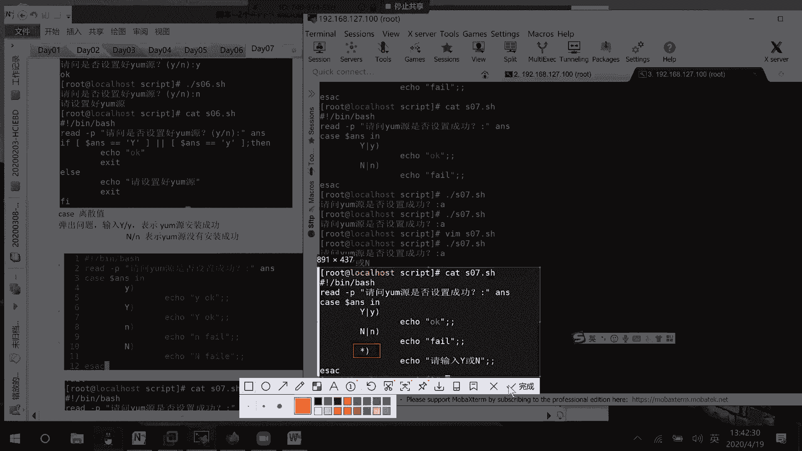

这边的话呢case它的一个结构跟你们去讲过了，首先case中间的话呢就是说等待判断的变量，然后下面这边的话呢就是把值进行一个枚举嘛，枚举就是说一个一个你可以去列出来的，然后记下面这里的话呢。

就是说呃匹配重之后执行的动作，还有一种情况呢，新号这个就是说上面都没有匹配重的话呢，就是说匹配所有的条件，对不对，然后这里e s a c表示什么意思啊，结尾上面这个开头，下面这个结尾，然后像枚举的话呢。

你可以举很多个这个呢新号的话呢，就是说减剩下的上面全都没有匹配重的话，那就来匹配我吧，对不对，你们这个的话呢其实把那个if给记住就可以了，kiss的话呢有能力的话自己去掌握一下好吧。

接下去的话呢我们再来看另一个东西，刚才是一个判断条件，判断现在的话呢比如说是循环，有时候的话呢一个命令，我希望他去计算100遍或者200遍，或者一个语句，我希望他去打印100遍或200遍。

我如果说去敲100下或200下的话，那是非常的慢啊，循环的话呢就是说重复的行好快，命令，你这个的话呢可以这个快当中，可以只有一条命令，也可以有十条命令，也可以有100条命令，全都没有关系的。

循环的格式有很多种，这边的话呢我先来跟你们讲一个four好吧，for饮料一一直二直三，然后呢这个获取到的变量呢，就是说去控制这个循环，后面这值呢只有几个，那就去循环几遍嘛，do做什么事情。

这中间的话呢就是说希望循环执行的操作，然后接下去这里呢down呢就表示这个模块里面，就说这个循环的话呢要做的东西结束了，上面是开始，下面就结束，知道吧，这边的话呢如果一个最简单的操作。

我希望在屏幕上去打印一到十，这里的话呢一个最最简单的，我们是不是可以，直接用序列的方式去对它进行一个打印啊，打印，20对吧，那这边的话呢一个最最简单的方法，就是使用序列的方式去打印码。

s e q10 起始到结尾吗，如果说你想要好看一点的话呢，前面就说去补零怎么办呢，s e q减w是不是就补零了这个序列的方式，然后的话呢还有一种呢，因为这个的话呢，就毕竟只是进行一个简单的答疑。

如果说我希望在这个呃0102前面去加一个，比如说tk d u怎么办，就是说tk e d u01 ，tk e d u02 ，tk e d u03 ，这怎么办，简单的去使用这个sq的话呢。

是没有办法去操作这边打印，pk e d u01 到pk e d u10 好吧，那这边的话呢咱们就循环去做，in in哪里，是不是这个执行的几个值，刚才不是说吗，直一直二直三，这边直一直二直三直四。

一直到直十吧，做什么呢，是不do啊，ecoach k e d u后面的话呢是不是dollar i，因为每一次的话呢，它这边有十个值，我第一次在做的时候把一拿过来，第二次拿二，直到最后一次拿十不就结束了。

整个操作嘛，这边当一下回车，你看是不是就tk d u011 直到十，先取第一个，把后面的值的话呢一个一个的去取掉，直到所有的值全部取完，那在屏幕上的话呢就可以去进行一个打印了，明白吗。

这个循环应该没有问题吧，如果说循环里面还有循环，可不可以呢，这是可以的，这里的话呢给你们一个简单的思考题好吧，还是一个比较经典的题是什么呢，希望你们去打印一个这个东西，就是a1 a2 a3 。

然后呢b1 b2 b3 ，c1 c2 c3 ，就这么一张表格，你给我打印出来，刚才我们这个讲的是一层循环，现在的话呢希望你们去做两层循环，两层循环，看你们的话呢一层循环有没有理解到位。

这边的话呢你们就不要在外面去写啦，你的话呢就来touch一个s08 点s h好吧，在s08 或者你自己的任意一个文件当中呢，把脚把代码写出来，写完了之后呢，发群里去思考一下，因为下午比较困嘛。

嗯与君的它的一个运行结果好吧，v i m s08 ，这里吧，我来tch s08 日军那点s h圈圈，mod a加x s08 横线平均了好吧，然后接下去vim这个文件，它里面的话呢写了什么呢。

井号感叹号斜线b special，然后for，s e q1 s1 q3 ，那也就是说1~3嘛，然后接下去入，j e a b c这三个值，coach，呃他是加了引号的，dollar j dollar。

那他这个现八版本就非常智能，都可以自动去缩进了点s08 ，你看他这个的话呢，首先没错，a b c a b c a b c有这个问题，那像他这个的话呢，为什么会这样呢，首先a你看在循环的时候。

第一次是不是取了一还是一，但是呢j你在循环的时候，a1 b1 c一见坠取2a2 b2 c2 ，是不是就有这么一点小问题啊，就不太方便，所以这边的话呢像我们这种循环会先怎么样呢。

把a就说你肯定是一行一行一行的循环的，所以把这个叫做abc的话呢，咱们挪到外面来，然后接下去的话呢就是j，那就等于日军这边写的s e q叫做三对吧，然后接下去的话a，一个是j对不对。

我们再来看这边运行的时候呢，是a了aaa，那我们在想是不是在进行123循环的时候呢，你不要去换行啊，等这个123循环完了之后呢，你再去给我换行吗，一coach就是空一个行。

你看现在这里abc这里是不是分开来了，然后如果说这边不要换好呢，这里有一个叫做诶好的，这边的话呢有一个符号，一个叫做解析啊，不对，这里点n，减n表示不换行表示不换行，如果如果说不换行的话呢。

aaa他之间是不是又没有空格了，之前你们在做的时候呢，是不是希望后面能用table键去分开，或者什么东西去分割对吧，斜线t表示table诶，斜线t表示table键，那这边的话呢怎么办呢。

它是一个转义字符，这个简易表示让转移字符去进行一个生效，是不是就可以这样子去打印下对吧。

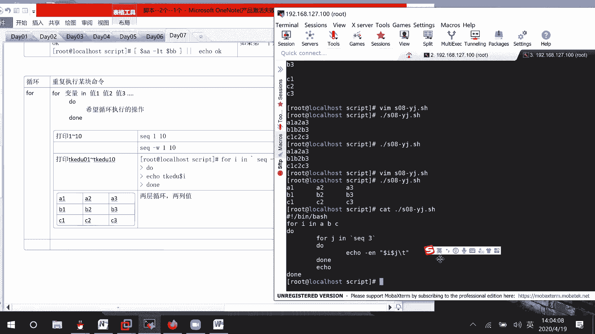

所以的话呢刚才与君写的整体是没有问题的，只是说这个东西呢我之前没有跟你们去讲解，e e的话呢，就是让我们的转义字符去生效，n的话呢就说不换行吗，对面要给你们备备注一下，老师不换行。

然后这个叫做e表示转移生效，好吧，就这样子。

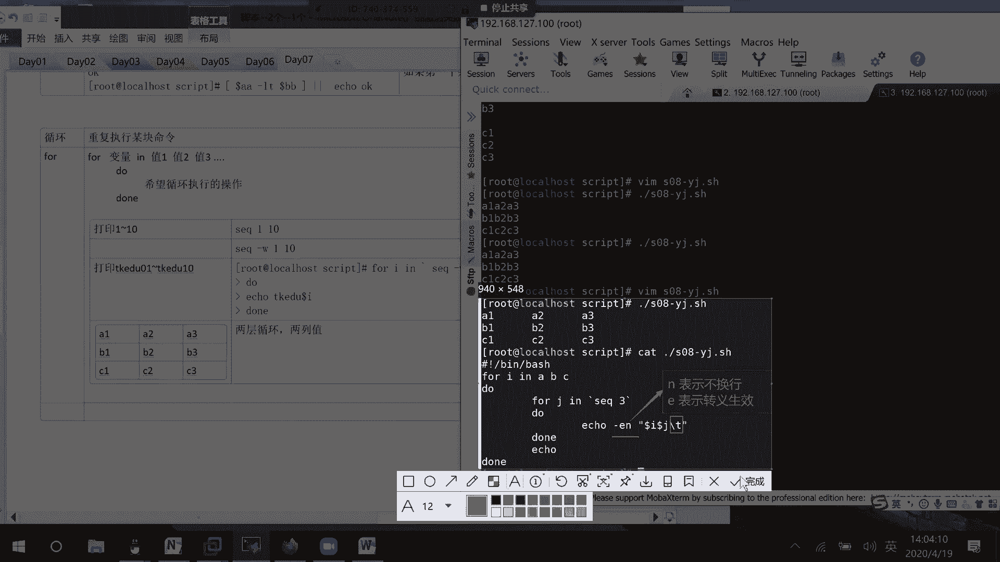

然后呢我们就可以去进行一个打印嘛，所以你们在遇到这种就是说有多层循环的问题，我们一行一行去分析，不要一列一列去分析好吧，然后这个的话呢没什么问题，在做循环语句的时候，我们考试不会这么复杂。

只是说我今天会把各种情况给大家介绍一下吗，然后我们在工作当中的话呢，有时候是会用到break continue这个东西啊，这两个的话呢其实都是去终止要我们的循环，这两个中指有什么区别呢。

我这边来写一个脚本给大家来看一下，叫做touch s09 点s h全剧mod a加x p m s，零九叫做i井号，感叹号b ash，我这边的话呢去写一个循环，ie叫做seq，比如说到时过。

然后这边do 1 coach i哦，那这个脚本的意思是什么呀，是不是就是打印一个叫做呃一诶，稍等，我忘记写了dollar符号了，这个脚本的意思的话呢，是不是就去打印一到十啊，如果说我这边的话呢。

去加一个判断，if你的i嗯，就是说等于四的话，把你这个程序给break掉，break掉，我们来看一下，那到了四之后呢，嗯就说四的话就说跳出循环嘛，那五和六他会不会去打印呢，稍等我看一下哦。

我估计又少了一个东西，等一下，给你们来看一下这里面的东西，是这样子的好吧，我刚才的话呢就加了这一块，现在的话呢点s09 诶，if dollar ieq等于什么东西，是哦，应该是空格又没了。

他这对空格要求的话呢比较严格一点，你看像这样子一个脚本的话呢，如果中间这里用的是一个break，他会怎么样，遇到四之后，这个整个循环被终止掉，就说这个循环被终止掉，就说满足条件的时候，是啊。

就是说终止整个循环，就是说我这个一到十的打印了，我就后面就不再打印了，如果把这个break改成我们的continue，k6 好吧，我们来看一下它的一个运行效果的话呢。

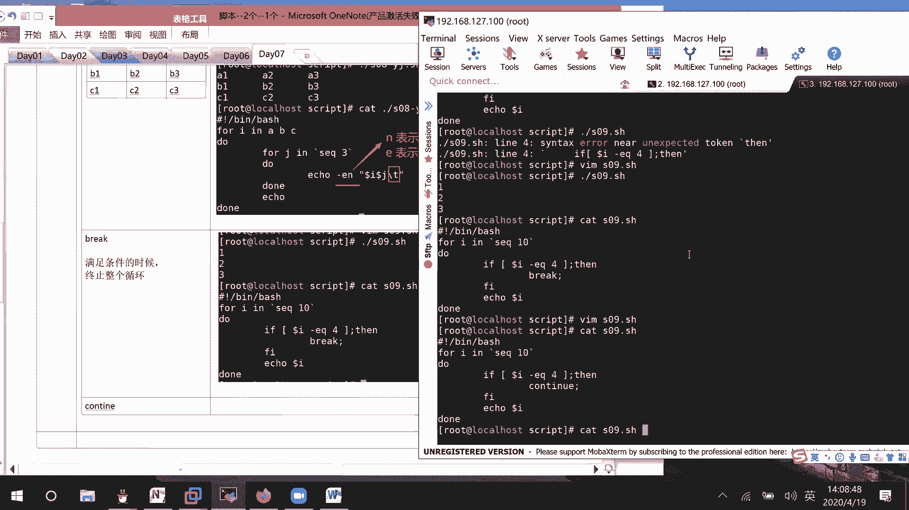

是怎么样子的，他这边在运行的时候，你看啊。

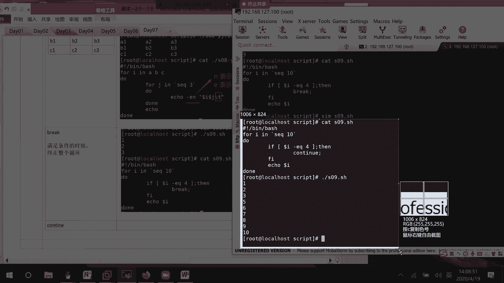

除了123，接下去的话呢是不是5678，只有一个四，它是没有打印的，肯定有会怎么样，只有c o n t m n m d，他这个的话话呢会怎么样呢，满足条件的时候退出，本轮循环，后面如果还有循环的话呢。

会继续，对不对，他的话呢没和break不一样，break是直接中断掉，continue呢就退出我这一次的一个操作，后面的其他操作的话呢，我是不会退掉的，能明白吗。

这个的话呢就是我们break和continue的一个区别，在其他的在其他的地方的话呢，你也可以用，不仅仅是在我们for当中可以去用，在其他的任何地方都可以去用，我这边的话呢就是这样子跟你们提一下好吧。

这个的话呢讲的是for和我们的判断一样的话呢，它不仅仅只有一种格式的，它有很多种格式，下面这里的话呢我给你们来讲一个while，while的情况是怎么样呢，while条件，然后接下去do做什么事情。

这里的话呢就是动作嘛，你要做好几遍的，做完了之后呢，就是down，满足了什么条件之后，我就去做什么事情，好吧，然后这边的话呢，就比如说我们要去打印一到十这个东西。

我们来看一下怎么样去用这个叫做while去做，不去做，我看一下啊，刚才好像编到了九，那这里的话呢touch s10 点s h cg mode s，10a加x i m s10 里面的话呢。

第一行全都是一样的型号，感叹号b special，如果说我们要打印呢，打印是很简单的，ecoach，到时候如果变量是i的话呢，i down是不是就可以了，那上面这个while它怎么样去写呢，唉。

我这边的话呢条件因为要去比较嘛，对不对，所以呢就是一个方括号，比如说这里aa我去设置一个aa a的话呢，你随便去设置一个值，那这边首先是不是我们可以来定一个变量，declare，刚才还记得吗。

减排a a比如说从一开始，如果说我的aa，小于十的时候，那就可以去进行一个打印，你看第一次进来的时候，a是不是等于一，那我呢打印一个一，然后接下去aa有没有执行任何操作，没执行，如果就这么一个语句。

你觉得会怎么样，a小于a等于一的时候，小于什么，小于等于打，对不对，这里应该打印的是aa对不对，a等于一的时候小于十对打一down了，再循环a小于一的时候，a等于a没有变吗，还是一，是不是还是小于12。

所以呢就这样子，它是会不断的进行一个死循环的，就这个语句执行了执行了执行了执行了，对不对，因为aa一直是一一直会小于十嘛，那我们现在这边的话呢，就要想办法让我们的a a的话呢。

能不能每次做完了之后变大一点吗，等于原来的dollar aa加一，这个let刚才是不是有学化，或者直接就是aa等于a加一对吧，就dollar括号括号a等于a加一，对不对，那现在如果是这种形式呢。

第一次a等于一小于十，好打印个一，然后let aa等于dollar a加一，线a什么二是不是小于十啊，那就等于二嘛，然后接下去的话，那a等于二了，然后2+1是不是就等于三，那这样子的话呢。

a是不会断的去增大，直到aa这边，比如说等于九的时候加一是不是等于十，好带进去，十的话呢是小于等于十，所以a这个十是不是还能打一，现在a等于十的时候呢，加一是不是11啊，再来判断11有没有小于等于十呢。

没有，那这个循环是不是就结束了呀，对不对，我们来看一下，这边点s，我应该是哪里写错了，叫做let哦，这里我前后加了空格，有问题了，第二个空格，你看123456789吧，98，那这边的话呢。

首先第一个我们去定义一个变量，他这里的话呢就是对这个变量进行判断的，如果你这个变量不去发生变化的话呢，这语句就只能不断的去执行。

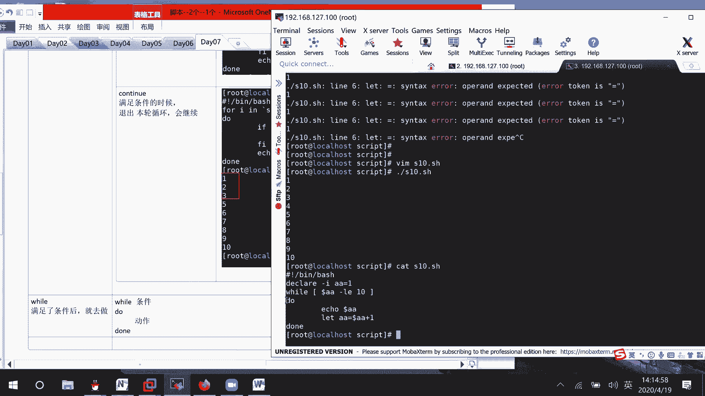

所以你一定要让这个变量去变化，不然的话呢就是一个死循环的一个过程了。

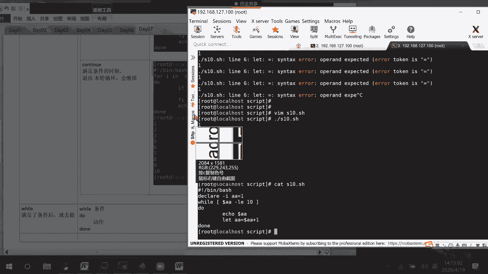

知道吗，这个就是我们while的一种形式，是这样子的，然后接下去的话呢我们来看一下啊，还有一种形式的话呢，是不是一个叫做when的一个形式啊，还有一种的话呢，就是说why你什么时候可以去做呢。

看一下system control is干active，我看一下我们f tp啊，哎有ftp对吧，sister control list fire，list unit fire。

我去grp一下和ftp相关的，诶，没有x p，我想想啊，有什么样的一个服务吧，嗯这些基本上都是，因为我现在远程的s h的话呢，又不能停掉，那这边这样子吧，时间同步服，ctrl list unit。

fires or grape一下c h r o n y，这个服务system control is actic h r o n y d，那现在是不是inactive的一个状态，我们现在的话呢。

比如说想要去写小本，不断的监测服务是否在运行，如果没有运行的话，启动服务可以吧，写一个脚本，你看我现在如果说用这个while来写，可不可以，肯定是可以的，他是s11 ，全剧mod a加x s11 。

vim，幺幺，然后呢第一个是干嘛，是不是要不断的监测，就是不让他听着，那这边写个to就好了，那这条件肯定是能满足的，就首先的话呢我们是不是要来检查一下，这个服务的话呢有没有在工作啊。

system control is active c h r o n y d，对不对，但是的话呢他这个在运行的时候，是不是经常会有个输出啊，会让我们见面的话呢不是特别好看，我们之前学过一个重定向符号。

你们还记得吧，你把它重定向到垃圾桶里面去吗对吧，那我们这边的话呢，比如说想要去判断，那这个服务到底是呃inactive呢，还是一个active的呢，怎么样去判断呢，结果你又不去显示问号，还记得吗。

如果说服务是未启动的状态，它就是一个非零值，那这边我们就来判断吗，if oa问号它不等于零，那是不是就说明这个服务它是没有启动的，那我们要做的事情呢。

system control restart这个服务吧，因为它在启动的时候呢，本身就没有什么输出，我们就可以不去重新下了，然后这里是不是就f i呀，然后呢他这个实时监测你的话呢，可以让他十秒执行一次啊。

或者叫做五秒执行一次啊，全都是可以的嘛，我比如说十秒到好吧，保存退出。

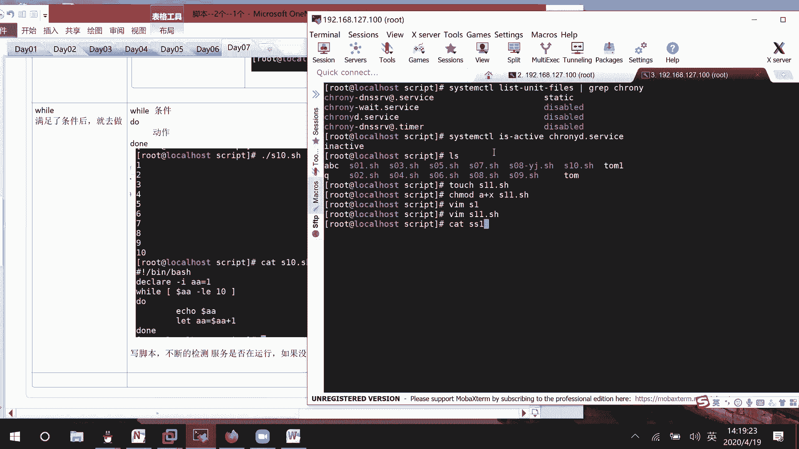

这样一个脚本就说我不断的十秒钟去监测一次。

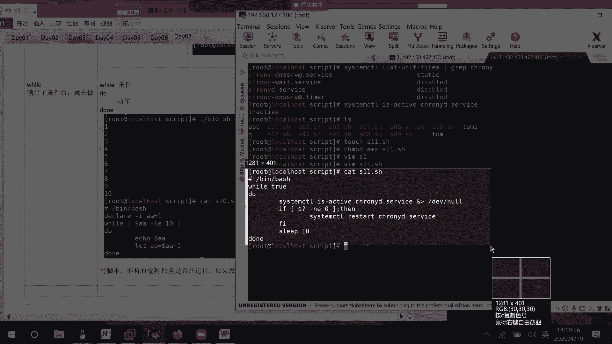

我的时间同步服务，我们开如果没开的话呢，那我就把你给开起来，如果开着的话呢，就算了嘛，那就算了嘛，我就再等下一个十秒嘛，这个的话呢，就是为什么有些协议它可以周期性的干嘛，都是有些脚本在控制的，知道吗。

in active，你看这边我来把这个脚本去运行一下，点s11 ，让他预习，诶我这边的话呢system control stop，这个不好吧，你看inactive，我等个几秒。

他是不是就active起来了，然后这个脚本现在的话呢，就是说一直在前台运行，如果你后台的话加上一个这个环，是不是就可以了，能明白吗，这个的话呢也跟你们去测试了对吧，好就是这样子啊。

就说不断的去进行一个启动，我们这样就结合到上午说的这个叫做动dollar，问号的话呢，怎么样去判断他的话呢，就是说返回值命令执行的到底是对的还是错的，对不对，然后现在这里的话呢这个没有什么问题啊。

然后我们现在的话呢，就比如说想要去读取一个文件，你们想一下该怎么办，我们比如说有信息要输入到一个文件当中去，是不是ecoach，比如说test now，比如说tap梦录下的aa啊。

这是不就是说这个是把信息放出去，如果说想要把一个文件放到一个变量当中去呢，pk文科他是word吧，那就反过来放吗，etc他是word文件放进来可不可以，我们现在呢ecoach dollar科p s诶。

我看一下这里的话呢，你看现在的话呢信息确实是放进来了，但是放了几行信息啊，这里就是说我现在要去读取文件，确实放了，是不是只读取一行信息，如果说我们想要去批量的去读取，怎么办，批量的读取。

那你可不可以用for啊，或者用while啊，这边首先第一个while read，读这边的话呢做什么东西呢，ecoach dollar，一行一行的信息吗，down信息从哪里读进来呢。

etc p s s w d这边读进来吗，你看所以这一小块的意思是什么呢，就不断的去读，直到读到结尾为止，直到你读到最后一行位置。

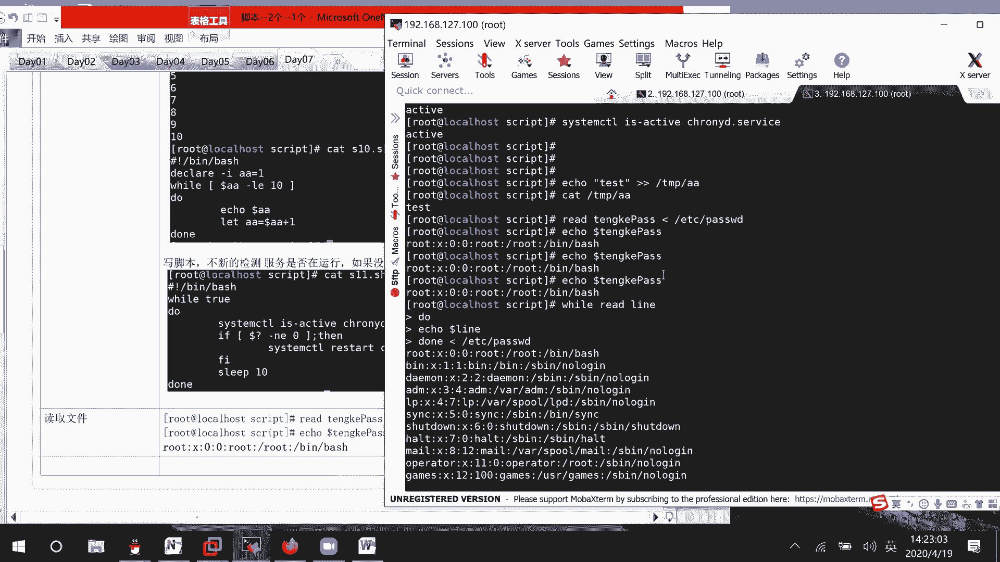

这里循环的读。

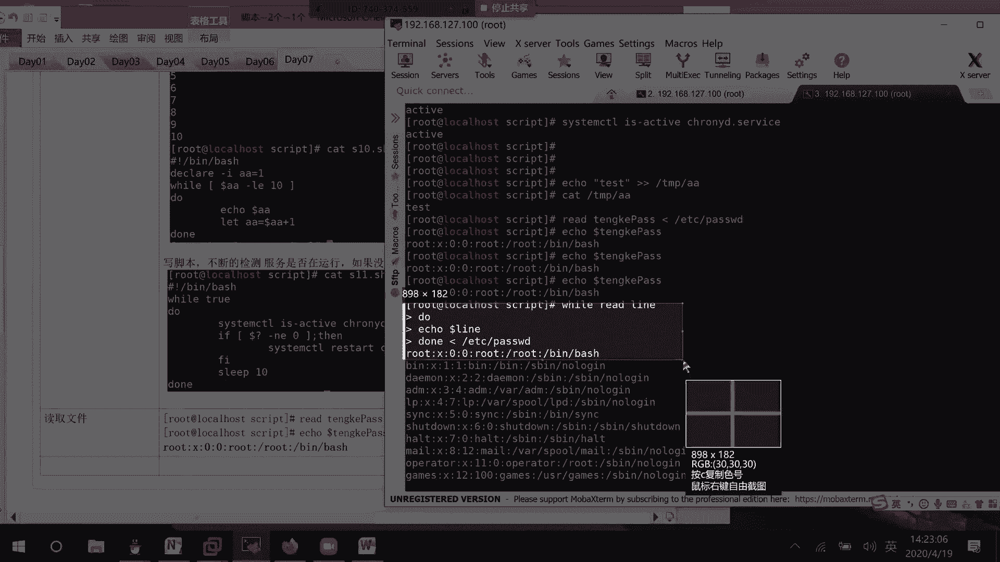

上面那个的话呢，只是说单行的读，这里循环的读，把所有信息给读取进来，知道吧，就这样就行了，就这样就行了，好那接下去的话呢，比如说嗯你看这边在读取进来的时候呢，它是不是会有很多很多的信息啊。

第一个信息的话呢，可能是root 12345677个星期对吧，那比如说我读取的时候呢，我只是想要用户名和你的这个序号，可以怎么办，可以怎么办，这边的话呢我们就要这样子，while对的。

比如说cl一第一个还有呢去读，第二个去读，第三个是不是就够了，第四个我们都可以不用去读了，不ecoach解密，因为中间的话呢，可能就是说第一列在输出的时候，和第三列在输出的时候呢。

中间希望有一个风格不慢，开火键去分格骂啊，接下去dollar coo l3 ，然后呢这里down一下，稍等，这里你看这里刚才的话呢是读整行整行的信息，比如说我们现在想要去读列的信息。

你看一下这里得到的信息是怎么样子的，诶他还是整行读取出来，没有把一个一个信息读取出来啊，为什么会这样子呢，这是和我们的分割符有关系的，我们来看一下默认情况下，它的一个分割符是什么东西，双板厚的。

这也没有去写，这边的话呢我们默认的分割符它是一个符，就是说是一个分号线的话呢，比如说我们想要去设置一个新的分隔符啊，不i fs，他的话呢默认i fs，然后呢现在ifs的话呢，分割符我这边是冒号对吧。

现在我再去来执行一下，你看像这边的话呢，第一个和第三个是不是都拿到了，但现在的问题是什么呢，第三个太长了，为什么呀，你只分成了123列，我就把你一中间x第二列，三后面剩下所有东西都是三列了。

所以如果说你你想要去获取三列的信息的话，那你至少要分割成四列，为什么呢，就说至少这样子嘛，一第一个分出来，第二个分出来，第三个分出来，第四个后面所有的整体你作为一列嘛。

这样子我到时候去打印第三列的时候呢，就不会去携带后面的所有信息了，能明白吗，就这样子，这里的话呢我给你们来看一下，pc pass word中，获取获取什么呢，叫做用户名和u i d名字命名的话呢。

是这样子给你们去写的，首先的话呢while read，这边的话呢，为什么要让大家去写12344列呢，因为如果不去写四列的话呢，他会怎么样呢，第一个分出来，第二个分出来，剩余的所有全都是第三列。

那我们等一下要去显示第三列的话呢，是不是就不方便呀，所以这里呢要分四列，1234知道吧，然后这里的话呢就是去取第一列的信息和，第三列的信息，不就是名字和id了吗，然后这里呢我不断的去进行一个输入。

不断的去进行一个读取，直到读到文件的结束符的话呢，我就结束了，我就结束了好吧，dollar old i fs，稍等一下，dollar old i f s o e coach，我一直没加，难怪报错。

他这里的话呢一开始的时候呢，它的分割符是应该是一个分号，现在的话呢就是说我们把它恢复一下，ifs，他的话呢就o i i fs就等于这个嘛，因为我刚才的话呢是进行了一次保留吗，应该就是一个i fs。

你看这边的话呢是干嘛呢，先去保留一下原来的ifs，再去给他付一个新值吗，之前的话呢应该是其他的符号的一个分割符，现在的话呢我给他设一个分冒号嘛，因为我这个文件当中的话呢，就是一个冒号去分割的嘛，对不对。

所以这一小段代码的话，你应该能看明白吧，一三，然后呢剩余所有组成一列嘛，好吧，然后下面这边我们再来看一个东西啊，叫做while，while也给你们看了ntr，来看一下until的话呢。

它和前面两个就不太一样了，前面的for也好，while也好，是不是满足条件就去执行啊，他呢条件不满足，才去执行，条件不满足他才执行它的格式，是这样子的，nt r了解，然后呢。

然后呢down中间的话呢就是我们执行的命令了，我们来看一下，如果说现在的话呢，我们想要去打印一到十的话，可以怎么样啊，touch a哦不对，s 1222s h全剧mod a加x s 12好吧。

v i m，首先第一个，我比如说和刚才的一个while是一样的，declare减i a a等于一，好吧，until这边条件怎么写，我们等一下再来写什么呢，是不是以扣取solar aa呀。

这边肯定有一个和aa相关的变化的函数吧，那我们说了只有条件不满足的时候才来执行，那也就是说高了aa有没有大于十吗，下a等于一的时候，他没有大于十吧，那就来执行，知道吗，然后a a如果大于十的时候呢。

它就不执行了对吧，那这个aa的话呢是不是还要去递增的呀，本身就应该是递增的吗，大家看一下，一开始的时候a等于一小于等于大于等于十吗，没有，所以就等于一，那现在a的话，那等于二。

a等于二的时候有没有大于等于十呢，没有，那这个二就输出了，等于三呢，等于4=5，等于六，等于七，等于8=9，九的时候有没有大于等于十，大于大于十呢，没有九就显示嘛，那好现在等于十的时候有没有大于十呢。

没有十就显示再加一，是不是11啊，11有没有大于十呢，有那我这个循环就结束了就结束了，11就打印不出来，就打印到十过，能听明白吗，他这个的话呢和其他的东西来说是特殊很多的。

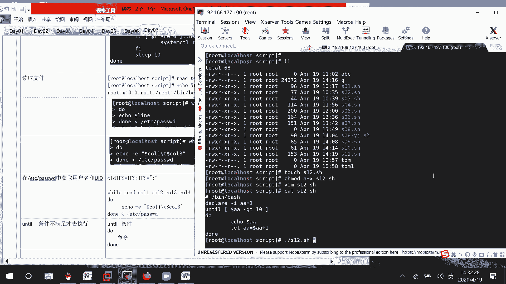

像货啊，while啊，它全都是满足条件去执行。

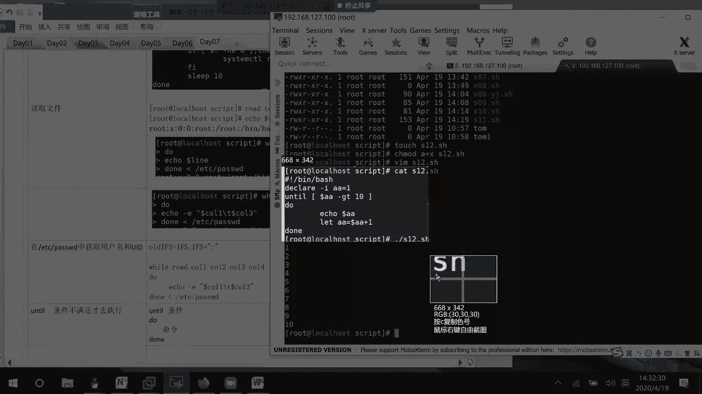

这个nt l是不满足条件才去执行，看明白了没，那好，这边的话呢给你们去出一个链就可以了，应该听明白我的意思吧，然后接下去的话呢我出两这两个脚本，自己去写一下，写完了之后呢发群里去了。

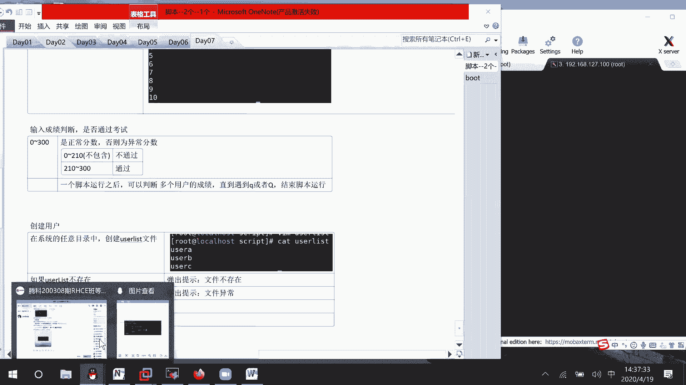

不要就一个在只有一个语音写出来了哈。