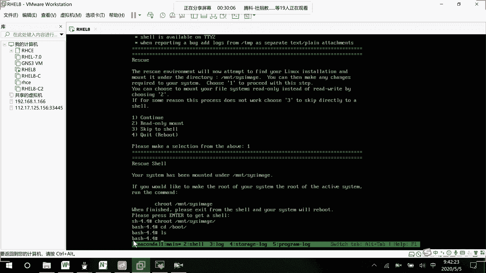

# RHCE8.0视频教程【45课时】 - P31：20200505-RHCE-01_recv - 六竹书生6682 - BV1su4y1Z7sJ

好了这边的话呢我们不等了，然后今天的话呢我们的一个主要内容，就上一次课没有讲好的一个系统引导，系统引导这一块的话呢，我们还要去讲的一个内容，就是如果说像我们的一个boot文件丢失了，那该怎么办嘛。

上一节课的话呢就讲到了像grab文件丢失啊，或者像这个怎么样去对grab去进行一个加密，就讲了这两个对吧，今天这里的话呢会去讲第一个叫做boot目录下，boot目录中文件丢失该怎么样去进行一个解决。

就相当于windows当中的话呢，我把c盘里面的它的一个system，里面的一个文件给删除掉，该怎么办嘛，然后下面这边的话呢，就是说有时候像我们在进行一个挂载的时候，就比如说挂载的一个信息丢失了。

它启动不来了，那我们又该怎么办嘛，etc s f t e t c fs tables丢失了怎么办，还有的话呢，第四还有的话呢就第三个像我们系统的话呢，在进行一个登录的时候，是不是都要去进行一个验证啊。

要验证文件的话呢是password文件，如果说像他这个password文件丢失了的话呢。

我们又该怎么办，所以这里的话呢会去讲这几个问题啊，稍等一下，我先查一个东西，先。

好吧，然后接下去的话呢，我们就来讲这个unstable的一个东西，上午的话呢把这个系统引导讲完了之后呃，因为这样子的话就是第二门课咱们就结束了，我去把叫做教材里面，第二门课的一个总复习的练习呢。

拍给大家去看一下，大家去做一下，因为环境里面也有嘛，然后下面的话呢我们就会去开始第三门课，enerable的话呢，它是整个294294的一个课程行吗，然后之前有同学就问他，有没有整个的一个扫描版。

整个扫描版的话呢，他目前还没有拿去送哦，就还没有顺序进行一个扫描，所以现在没有，只能通过拍照好，这边的话呢我们来看一下这个第一个问题。

就好像说我们boot文件丢失是怎么办，因为经常的话呢要用到这个图形化界面，我就不进行一个远程连接了，稍等我把字体给你们调大一点，我看一下，先，cd不插这边的话呢，有这么多个文件吗。

如果有时候不小心rm跟rf信号l s，它里面就什么东西都没有了。

这个时候的话呢我去进行一下reboot，没有这个脾气。

也就是说，boot里面是和我们系统引导相关的一些东西吗。

然后下面这边的话呢，我们来看一下怎么样去进行一个解决，他这边的一个解决的话呢还是比较简单的。

稍等哈，你看进来了之后就出现了这个grab这个界面，像我们之前的话呢在讲这边叫做。

哦没有截图哈，就好像系统引导丢失啊，或者我们的内核定制文件不见啦，这些的话呢该怎么样去进行一个处理，都要去从光盘的话呢去进行一个启动，然后进行修复。

知道吗，这里的这里的话呢，那这边也就是说要重新让他去开机，我们按一下esc进入到它的一个引导选择界面吗，在我们真实的服务器当中的话呢，就重新引导从我们的光盘当中去进行一个引导，我这里重启一下，稍等一下。

我多按了一下，就这里选择这个cd room还是回车，然后这里的话呢，就相当于到了我们系统安装的界面嘛，和之前都是一样的，还是进入到这个trouble shooting，因为上面就是装系统了嘛。

然后接下去的话呢到了这里之后，和之前的话呢也是一样的，我们就说要去进行的是，第二个修复我们的一个红包系统吧，知道吧，不是安装，也不是测试，也不是从本地驱动去进行一个启动，选的是第二个白色标起来的。

然后等他他这边的话呢，会有一系列的一个引导过程，等一下这边的话呢就是要去等，在隔墙看，然后就可发出去了，好现在这边的话呢就是到了这个界面之后，我们要选择什么啊，他这里的话呢就告诉你现在的话呢。

就说你是等一下，就是说这个修复修复的一个环境的话呢，需要尝试去挂载到这个mount size image下面去嘛，但是如果你想要去进行一个修改或者怎么样，就说去呃去修改你的一个系统对吧。

一的话呢就是说去进行一个处理，它，它会帮你去进行一个挂载，二的话呢只读挂载嘛，三的话呢就是去略过嘛，四的话呢就是进行一个重启，直接去退出了嘛，我们这边的话呢肯定是要按一吧，就说继续嘛。

我这里给你们去截一下图哈，慢一点。

等一下他这个特别慢，然后到了这里之后呢，接下去就说啊，你如果想要去修改你的一个root的一个信息，激活你root的一个系统，就说要圈居root到mt size image下面来对吧。

我们直接按回车就可以了，然后到了这里这边的话呢，第一个它让我们去切换到硬盘系统当中去嘛，change局root mount size image，然后切换过去了之后呢，你看到我们的boot当中去。

里面是不是是空的呀，里面是空的，那现在的话呢我们就需要想办法，把boot里面的文件信息的话呢去给它生成一下，现在的话呢我这边再去开一台系统。

给你们去看一下，就说现在需要重新生成，boot里面的文件，就它里面需要什么文件呢，我们是不知道的。

我们不知道，那我们就说就好像工作环境当中只有一台设备。

那你就需要去安装一台虚拟机，可以去看一下这些文件的话呢。

是由哪一台，就说哪一个软件去进行一个生成的吗，就是说这节课我们讲过了之后呢，大家去记住就可以了，如果以后真的去忘记掉了的话呢，你可以去网上查，或者的话呢边上有其他的一个设备在的话呢。

你就说是使用一个软件查询命令，去看一下这些文件是由哪些软件的话呢，去进行一个安装出来的好吧。

稍等哈。

我再去开一台，重新开设备查询boot里面的文件，室友哪款软件安装的，我们在之前的话呢是不是学过一个叫做rpm，q是不是一个查询啊，f是不是一个fire，后面的话呢是不是去跟上一个文件的名字。

就可以去进行一个查询了，等一下。

然后呢，我们等一下就按照这种方式的话去查询一下，就可以看到是哪一款软件了，是哪一款软件了。

嗯怎么开不起来呢。

那这边哦终于开起来了，他又来佩奇了。

等一下好点一点，好慢，好了这边的话呢这台系统去开起来了，我们比如说就使用这台，就说这个这台电脑的话呢，去查询一下，不存目录里面的信息，是由哪一款软件去进行一个生成的吗，cd到我们的一个boot当中去。

他这个软件是不是很多啊，比如说我们就查询这个，我们在进行启动的时候呢，他是不是主要去找vm linux这个内核文件，我们去把这个信息给找到嘛，先把这款软件给找到，对不对。

那这款软件的话呢是由谁去安装产生的呢，那我们这边的话呢，看一下光盘有没有挂载上来哈，有是不是rpm减q查询f，我要查询软件哪个软件呢，vm linux 4。18k发现的话呢，是不是由这个叫做内核文件。

去进行一个安装产生的，首先这里我们去找到了第一款，第一款软件，我给你们去截个图哈。

好吧，查询到这个了，那接下去的话呢。

我们是不是要在有有问题的，这一台系统上面的话呢，去进行一个安装，那好他这边再进行一个安装的话呢，df减去，你看一下它上它上面的话呢，有没有一个叫做光盘的一个信息啊，他这边是不是没有光盘信息啊。

那我们要做的事情的话呢，是不是就把它关盘给挂载上来对吧，mount这边比如说我去进这边的话呢，就比如说我去挂载创建一个目录，make dir so mount dev sd room。

到我们的so上面去，这个时候的话呢，我们在rm r p m i v h软件的名字是什么呢。

叫做内核。

就是说内核核心的一个文件，4。18的一个版本吗，k e r ne哦，我要先进入cd s贝斯os l s内核，我看一下没有找到，cd package l s内核，扣哦对，就这个文件吗，那接下去的话呢。

我们去进行一个安装r p m i v h so base，os package内核的一个文件，呃是不是就可以了，这里在出问题的系统上面的话呢。

你先去进行一个挂载，我把颜色去变一下，只有红色的是在另一台设备上去做的，在系统上进行挂载，然后呢安装软件，然后安装软件的话呢。

是不是就是这个rpm我们之前学习过的，然后这里呢回车让他去进行一个安装就行了，然后你看在这边的话呢，它在进行安装的时候出现了一个问题，就说说这款软件已经存在，因为其实这款软件呢是真的已经安装过了。

只是说它的一个它的一些配置文件被我们删了，我们希望重新去安装它嘛，所以这里后面的话你要跟一个force强制安装安装，也就是说即使在了，你还要去给我去安装一次，这样就不会出现那个already了。

一定要跟上这个first强制的一个意思。

我把这给删了哈，跟上一个强制等安装完了之后呢。

我们去看一下在他的一个目录下面呢，有没有什么样一个新的文件产生，好吧，然后这边的话呢它产生的一些文件里面会有。

比如说叫做引导文件啊，但是的话呢像这个grab文件的话呢，它是不会去生成的。

grab文件它是不会去生成的，对于我们来说，那是不是还要去把grab文件去生成一遍，上一节课的话呢，是不是有讲过如何生成grab文件，最下面这里生成grab文件，重新去给它生成一遍就可以了。

生成完了之后呢，我们就去重启一下就可以了，好吧，生成grab文件，然后呢去安装grab文件，就这两步。

等一下他这边还在安装。

特别久特别久，然后这边grab文件的话呢，怎么样去生成，你们还记不记得，是不是我们就说像一些grab信息的话呢，都保存在etc目录下面，大家还记得吗，就说根据etc目录中的，一些配置文件，进行生产。

我把第二台虚拟机先关掉，不然我的电脑太卡了，那进生成的话呢，是不是就是这个make config叫做grab 2，gr u b2 make config，然后后面的话呢杠o选项嘛。

我要去生成一个grab configure，是不是就可以了，去生成一下，然后这边的话呢因为你直接删掉了，在我们的啊引导磁盘当中的话呢，它就没有了，所以我们这边的话呢，要对grab去进行一个安装。

就grab in store，然后后面的话呢就跟上你的一个启动盘，是哪个就可以了好吧。

等一下去操作一下，这个的话呢稍微繁琐一点，诶，怎么还没好，特别慢特别慢，那这里的话呢呃虽然才开始上课十几分钟啊。

你们去把这个过程自己稍微去试一下好吧。

因为我已经做到这里过了的话，那不可能就这样子把它给停止掉嘛，估计要等个三四分钟的一个这样子啊，我们来看一下，因为刚才的话呢嗯我在安装的时候，估计是它这个版本顺序稍微有点问题啊。

就说我在安装的时候呢。

它一直出现一个error错误的一个问题对吧，所以大家这边的话呢。

这样子啊可以把顺序去换一下，哦我看一下从光盘修复的话呢，是没有问题的，然后这边我们先去生成grab文件，然后我们再去做内核的一个安装，但我顺序错了。

应该也是没有关系的，进行这个叫做内核文件生成的时候呢。

像我们的内核文件，需要专门的去存放到这个目录当中，叫做l s boot grab 2目录当中，然后的话呢大家先去把这个目录给创建起来。

make dii啊，boot grab 2的一个目录，然后接下去的话呢你可以cd到这个目录当中去，去grab 2，make config干欧，去把这个配置文件的话呢去进行一个生成吗，杠o grab。

config文件。

这个时候的话呢做完了之后，在我们的一个目录当中，就会出现这个grab config的文件，和这个grab e n v的一个文件。

然后好了之后的话呢，因为这只是一个文件，像这个的话呢，受是不是一些和我们内核引导相关的东西啊，我们之前的话呢把老的文件给删除掉了，他可能就是说定位不到那个信息了，我们是不是要把它给安装一下。

告诉我们的磁盘到时候怎么样去进行一个查找。

所以这边的话呢把它给安装回去，我们这我们这边的话呢稍微来看一下，第一个叫做它的一个磁盘是哪个，cat op t partition，等一下不是op t process partition。

我们之前在看的时候呢，他在进行安装的时候，是不是安装在这个nv m e0 n一上面去啊，或者我们这里嘛就说f disk dvn vm 101 n1 ，它是不是确实在这里打了一个星号。

表示我是一个启动盘的一个信息吗，所以我们这边的话呢要去进行一个安装，你一定要先定位一下谁是我们的一个启动盘。

谁是我们的一个引导盘，能明白吗，虽然这两个东西是同一个哈，定位到了之后的话呢，咱们再这样子诶，定位到了之后的话呢，咱们再去进行一个安装，后面这里就跟上一个叫做dv，不需要跟到具具体的分区。

你只需要去找到硬盘的名字就可以了，林恩一就可以了。

nvme 0 n一吗好吧，所以这边的话呢就是grab install，grab 2 install，我经常会少掉一个二哈，然后后面这里的话呢就dv nvme，0n一就可以了，然后这个时候呢就可以回车。

n一的话呢表示是第一个盘吗，grab 2 i n s t a l l，他就进行了一个安装好了之后的话呢，咱们接下去就是exit进行退出，exit再进行退出，直到他去进行一个系统的重启就可以了。

稍等一下，然后呢哦这边的话，因为我是先去安装了这个软件，再去进行一个grab的安装。

你们这个exit的话呢可以放到下面去做。

就是说这里的话呢你们先不做，在这里去做。

那你们在上面这里的话呢就到这里过就够了吗。

因为上面的一个grab文件生成了，你再去安装这个内核文件，它基本上就不会报错了。

你看他这边的话呢，是不是就进行了一个正常的一个启动，等我一下，等一下他这个比较慢哈，他这估计是第一次的话呢，会特别的慢，反正你们刚才看到那个界面的话呢，是不是就代表着我去启动成功了呀。

那这边的话呢我就不去等他了，好吧，等他估计又得两三分钟时间，你们到时候自己去做练习的时候呢，稍微等一下他，因为这边的话呢他要去进行一个重建，要从8%的话呢到百分之百，要等很久的时间，我就不去等了。

然后接下去这边的话呢，我们来讲一下第二个问题，比如说在挂载方面的一个问题，你们稍微注意一下，在挂载的话呢，只有一个目录是一定要挂载的，就是我们的一个根目录，根目录，如果其他目录没有去挂载的话呢。

它是可以可以去进行一个进入的，根目录的话呢，到时候也可以去进行一下修复嘛，我这边的话呢去添加一个硬盘，我这边的话呢不去做根目录哈，因为我们在考试的时候，就挂载的是一些非根目录嘛，我去添加一个硬盘诶。

这台设备还没有关机掉吗，等一下，因为开了两台虚拟机，他现在很卡，然后这里的话呢，因为我现在要进行一个呃挂载失败，所以这里的话呢我去添加一个硬盘上来，哦不要这个，比如说就是一个i d的。

然后这里的话呢新创建20个g就可以了，完成就可以了，确定就可以了。

我先把这台给关机掉，昨天没有关成功，哦不对，不是昨天啊，刚才没关成功，然后这边我就等它关机吧。

然后现在这边的话呢。

我把这台开起来，这台好慢。

终于关掉了。

然后这里的话呢让他去进行一个呃进入。

进入了之后呢，我要做的一些事情有什么呢，这边先跟你们去说一下，首先的话呢是不是就是划分分区，然后的话呢对分区格式化，格式化完毕了之后呢，我们使用uid进行挂载，然后接下去的话呢他现在就挂载成功了嘛。

我们去修改相应分区的uid，它是不是就是一个新的新的之后的话呢，你看如果说我再去重启系统，重启在开机的时候呢，他去看发现这个u i d和原来的不一样，会出现一个什么问题，那我们又该怎么样去进行一个解决。

能明白我的一个意思吗，就好像这个就好像就是说你挂载了之后，把那个硬盘给拔掉了，我们要做什么样的操作，只是说现在呢可能就是说分区的u i d改变了，我该怎么样去操作嘛。

等一下，好。

我再把字体调大一点，因为有点小啊，这边的话呢看一下cat proceed party，是我们新加进去的话呢，就是这个s d a嘛，在这里的话呢f d c d v s d a回车，p线里面的话呢。

任何分区都没有，我们来创建p第一个分区，第一个，然后的话呢接下去比如说它的一个大小，我就给他实际大小吧，哦5g大小吧也不需要太大，稍微有点空间，能能让他去进行一个挂载就可以了，好了之后的话呢保存退出。

我这边的话呢，去看一下他是不是真的创建成功了呢，发现真的创建成功了，接下来如果我们要去使用的话呢，是不是要对它进行一个格式化，分区格式化吗，make fs。x f s对谁呢，d vs d a一嘛。

格式化完了之后的话呢，比如说我们要去查看一下它的一个ui d，是block i d d vs d a e r，发现的话呢是这个ui d，然后接下去的话呢等一下让它挂载到aa当中去。

etc f s table在下面，这里谁呢，是不是哪一个分区，然后呢挂载到哪里，格式是怎么样子的，有没有什么选项呢，没有是就这条信息好了之后，wq退出，接下去的话呢我们要做的事情去给这个叫做aa。

重新去生成一个ui d吗，uu id他去进行一个生成，生成完毕了之后呢，我们是要是不是要去修改啊，x f s admin减大u它的一个uid的话呢，是不是就是这一串字符，然后接下去呢给谁呢。

d vs da一嘛，然后接下去呢我们要做的一个事情，是不是稍等啊，我就把这块给复制下来吧。

就说原来这个uid的话呢，它是这个三八线的话呢。

它是一个叫做0a对吧。

就这样子的一个操作上面的操作的话，那我就不给大家去进行一个复制了。

还是给你们复制一下吧，不放心，你们。

里面细节性的东西我就不复制了。

我就把这几行代码给你们复制下来，接下来的话呢我们要做的一个事情。

是不是就进行一个重启了呀，reboot一下嘛，看一下它的效果是怎么样子的，等一下。

稍等，感觉刚才是要起来了，但是诶起来了还是起来了，然后现在如果说我们直接进入第一个回车，这节课就是要等啊。

没办法，我们很快就结束了，但这个等的过程还是值得的，可以去看一下吗，我先把这边录屏给暂停掉。

看能出现第二门课内容的话呢，就讲到这个第一门课的话呢，其实在什么时候去进行一个结束呢，差不多在第四天，第五天的时候，第四天的时候去进行了一个结束，知道吧，这边的话呢第八天的话呢。

把我们第二门课给结束掉了，后面这几天其实他主要是去讲一些系统分区啊，防火墙啊，还有一个就好像哦l vm逻辑卷啊，还有一个的话呢脚本啊，系统引导这些东西。

等他去启动一下，我把那个练习给你们拍一下，先稍等一下，我先找一下是哪一本134，等一下哈，它让它启动一下，启动的话呢会relap，他现在也还在进行一个重建，我手上拿的这本书是中文的书。

那对你们来说看起来就会方便很多，稍等一下再找下一个过，这里有三个练，就说三个综合练习，然后他的啊刚好是一个中文的，我就说逐一的去发，因为在书本当中的话呢，它的一个综合练习是比较重要的。

然后那个叫做三台虚拟机，大家都应该已经下好了吧，没想好的话呢，没有办法去进行一个操作，这里的话呢是第一个练习，现在十点半给大家半个小时时间的话呢，好去把设备开起来，先去把题目看一下，去把练习去做一下。

应该时间够的吧，主要是环境，前面这个给你们多十分钟的时间去开环境，后面的话呢去进行一个练习好吧，做完了之后呢，我直接就去给你们去讲了，听到了吗，应该听到我说话了吧，有吗，因为我今天在上海。

我就怕信号不太好，赵奕晨能听到我这边说话吗，没人理我，我只能田心亮能听到我这边说话吗，嗯嗯好好好正确认能对吧，那行这两张这边的话呢，两张图片，第一个的话呢先让你们去重置一下环境嘛。

然后接下去的话说明里面就是题目。

它是一个中文的一个题目好吧。

然后你们之前在做练习的时候，我看一下124，134就是设备开的话，还是像之前那样子去开，只是说这里要多做这一步操作。

我这个文档应该没有发给过你们哈，你们的话呢134的环境就这样子去开，rh 134，如果说要做294的一个实验的话，那就rh 294以后就这样子去做就可以了，好吧，你们把脚本都已经预设好，预设好了。

稍等一下，我先找一下我这个文件放哪里去了。

哦就在桌面上。

