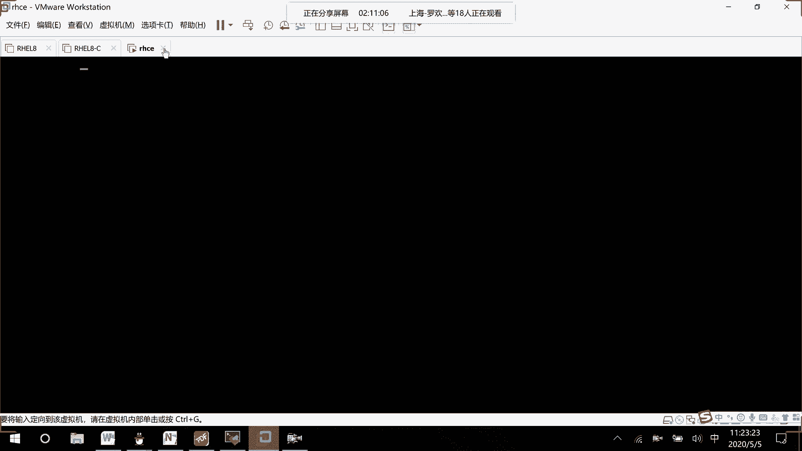
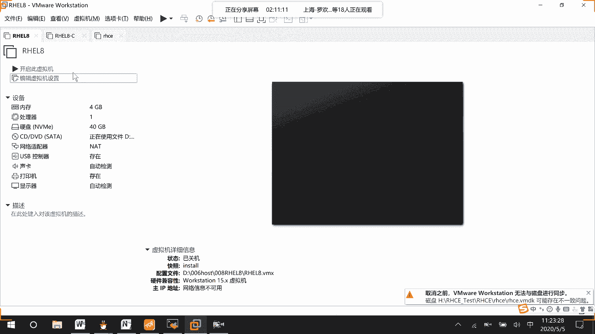
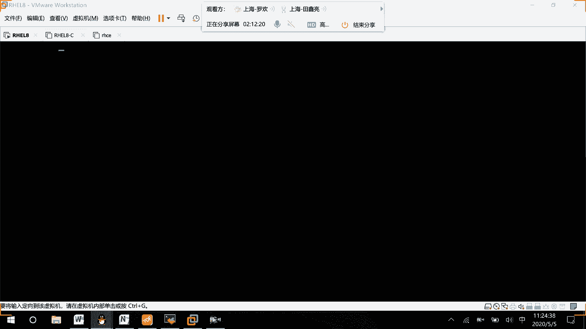
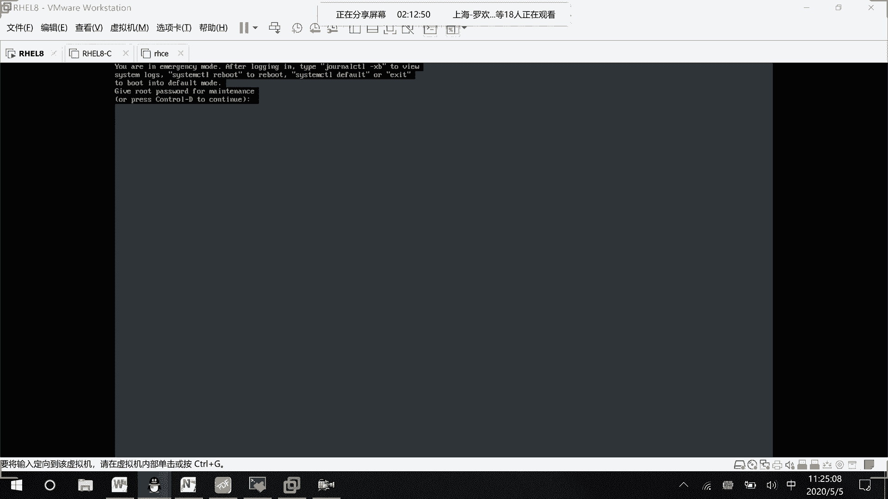
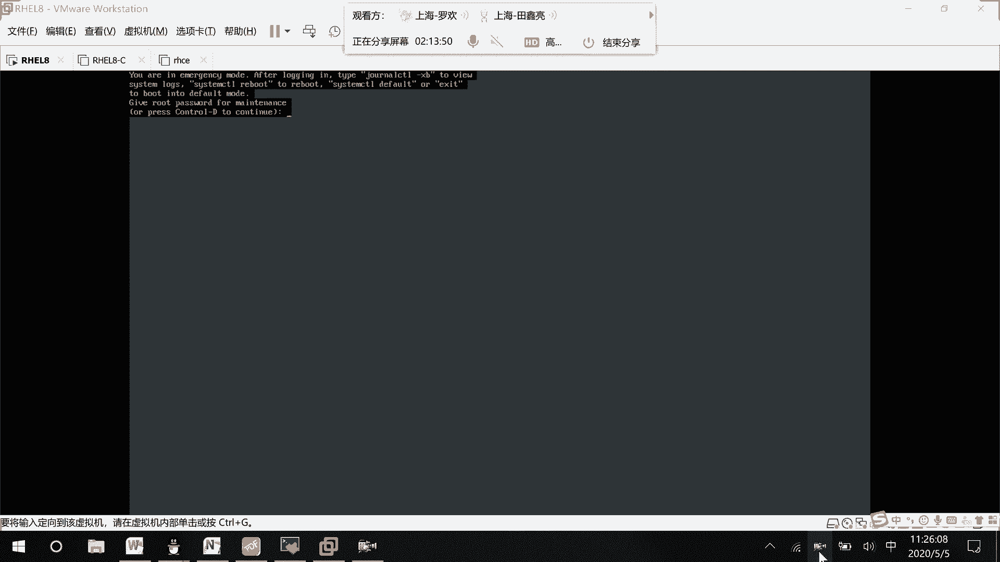

# RHCE8.0视频教程【45课时】 - P33：20200505-RHCE-03_recv - 六竹书生6682 - BV1su4y1Z7sJ

哦那好了，那这边我们来看一下，就是因为在虚拟机环境下面的话呢，大家没有办法直接从光盘单去进行一个启动嘛，它还有另一种方式，就是这边的话呢我这边开不起来，先不看了。

最后给他写书教育，就是这边的话呢在进行一个启动的时候。

我先这样子跟你们去讲一下，然后就这里就这里，去把它进行一个选中，按下e然后呢这一行是不是linux开头的，在这后面的话呢，你们去补上一个system的点，unit等于emergency，我们刚才的话呢。

就是使用图形化界面去进行一个启动，它，这里的话呢就是说在内核文件去告诉他，因为这边的话呢是一个临时生效的，告诉他启动一个叫做紧急救援模式嘛，就在这里去进行一个编辑就行了，然后ctrl x信息安全。

然后接下去的话呢，它就会进入到我们刚才的eb mergency的一个模式，你就可以去输入啊root的一个用户名和密码啊，因为第一题的话呢，它就是一个挂载出错了出错了的一个问题。

我们是不是在讲这个之前的话呢，就写了挂载出错的话，那该怎么办，等一下你看是不是到这里就可以去进入，我们的一个root恢复的一个过程嘛，稍等一下，我看到第九凉了凉了凉了。

什么鬼出来，你看。

然后你看这里lab i h c s a，他这里他这边的话呢就是说中断脚本，让你们去查找有什么样的一个问题，这里的话呢就是e t c f s里面的一个文件，有问题，你把它给注释掉就行了，然后接下去的话呢。

第二个他的话呢是不是还是执行这个break 2啊，他就去中断嘛，默认的话呢就是说它是一个多用户登录，那到时候去进行一个登录的时候，就不是一个图形化界面，问你怎么样去切换到一个graphic的一个界面。

这边的话呢下面有答案哈，然后下面这里还有一个的话呢，就说啊怎么样去使用su do，去做超级管理员的一个命令嘛，然后下面这里呢就是一个计划任务，怎么样去做的，就这么六题，就这么六题好吧，这是第一个。

然后下面这里的话呢，还有第二个。

