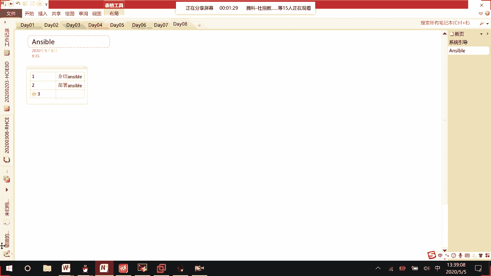

# RHCE8.0视频教程【45课时】 - P34：20200505-RHCE-04_recv - 六竹书生6682 - BV1su4y1Z7sJ

好啦，今天下面这边的话呢我们来开始这个answer b，就是在和之前七版本有一个比较大的区别，是什么呢，在七版本当中它是没有自动化运维这个课的，这个ancier的话呢，它是一个h c a里面的一门课。

现在的话呢它已就说形成了一门课叫294，在我们的c当中去进行一个考核，我们这边的话呢要去学习的内容有什么，有哪些内容，我这边先跟大家去介绍一下好吧，首先第一个给大家去简介。

就是说第一个介绍我们的一个answerable，就是说它有什么样的一个作用，以及的话呢，它是怎么样去管理我们的其他主机的，第二个我们去部署我们的unstable，其实它就是一款软件。

然后接下去的话呢就好像说我这边稍等啊。

我又不要放。

你看我这边的话呢，它其实是一个叫做enerb的控制器，去控制这些叫做node码，我再去控制它的时候呢，可以一条一条的命令去进行一个发送，但是像这个命令我执行过一遍之后呢。

以后是不是就没有办法就说再去执行了，如果说我100条命令我要复制粘贴，可能100次或者敲100次，特别的麻烦，这边的话呢我们就可以写成一个叫做playbook，就类似于我们哦上之前在学那个叫做白脚本。

这个东西，知道吧，然后接下去的话呢，第四个我们要去学他的变量啊或者factor，然后第五个的话呢还要去学他的一个任务管理，文件管理，大项目管理，还有的话呢还会去学一个叫做肉。

就好像playbook的话呢，它是一个一个脚本，这个rose的话呢就相当于去写一个逻辑，把这些play play book的话呢去进行一个结合嘛，学完了之后的话呢，接下来去第五个我们要去学。

比如说安伯出现一些故障的话呢，我们怎么样去进行一个排除，就好像我们之前在上h c的时候呢，是不是把一些啊知识点都上完了，上完了之后的话呢，我们最后是不是再讲一个trouble shooting啊，对吧。

那好那这个没有问题啊，行，现在这边我们来看一下，叫做answerable的一个简介，他的话呢是部署在哪里的，其实这个enerable它就是一款软件，他的话呢可以去管理我们的web应用啊，还有数据库啊。

还有一些比如说自研的一些软件，这些就是说像这些软件，我们是不是平时要进行一些定期升级啊，如果你在十台或者100台设备上去进行安装了，要进行升级的话。

