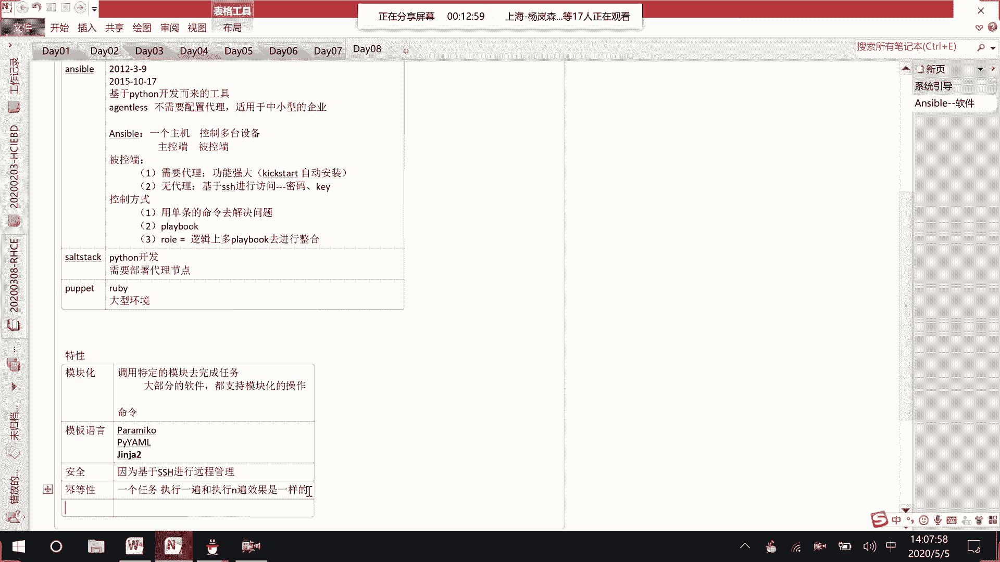
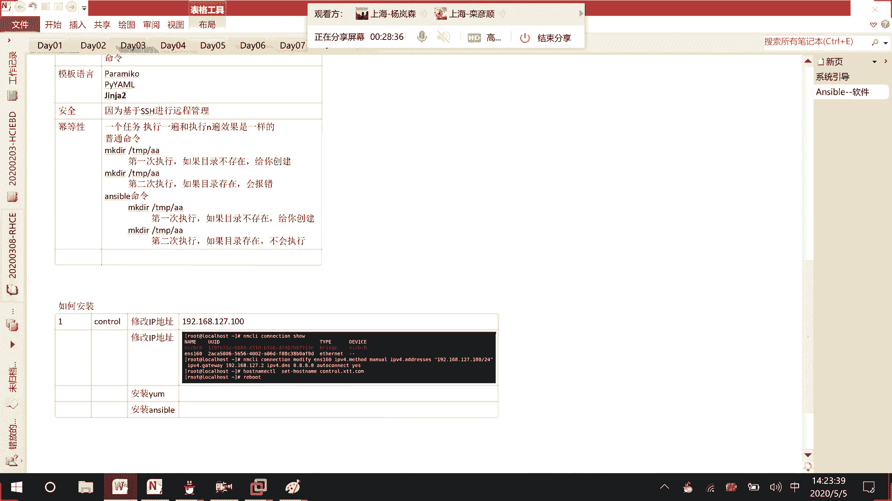
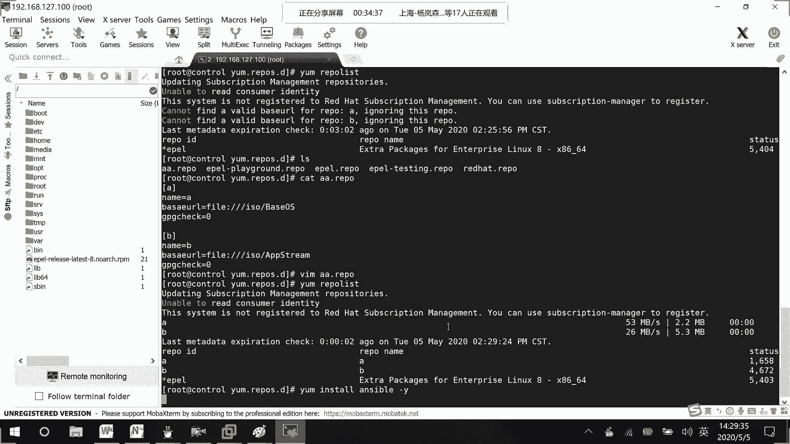

# RHCE8.0视频教程【45课时】 - P35：20200505-RHCE-05_recv - 六竹书生6682 - BV1su4y1Z7sJ

然后这边就是说我们要来讲这个，unstable的一个简介，他的话呢就是说是可以去对web数据库啊，去进行一个管理吗，如果说只有一台设备的话，那你就是说登录到那台设备去进行更新，就可以了。

如果说在有一个十台或者100台的一个设备，你去一台一台去进行更新的话，那是不是就不太合理啊，那我们就需要借助一些呃运维的一个产品嘛，这边的话呢我们接触到的就是一个ener，看你像这种风车。

基本上它有停下的办公，这个answerable的话呢，他是2012年3月9号吧，有一个第一个版本，后面的话呢就是说被红帽收购嘛，他这最最终被确认收购是，2015年10月17号，是被红帽收购的。

这款工具我没记错的话，好像是红帽的一个内部员工，他自己去开发的，后后面的话呢就是说又又卖给了红包公司嘛，他这个的话呢，ancier他这个是基于python的开发的一个工具，你上去坐在我们国内的话呢。

用的还是比较多的，因为我们国内的人对python还是比较了解的嘛，可以对这个unstable的话呢进行一个二次开发，更加符合公司的一些业务嘛，然后像这个的话呢，enerable它有什么样的特点呢。

它是angeli，这里的话呢很多人应该都知道这个叫做englist，是什么意思，他的话呢是不需要配置代理的，就好像以前的一些网管工具的话呢，他会怎么样呢，就比如说这边的话呢是我们的一个控制节点。

他肯定要安装answer包吧，然后这它不是这些node节点的话呢，要不去控制吗，在这些node节点上面，我们不需要事先去安装软件，不需要时间去安装，所以这个的话呢是一个不需要代理的。

像其他的一些比如说网网管工具，它的话呢需要代理下那个sstack，他的话呢你在控制端，这也要装在这里的话呢，需要去安装一些带代理软件嘛，去进一个管理，那没有代理的话呢，其实它实现的功能。

会相对于代理来说会少一点吗，但是像如果不需要代理的话，它就比较清亮嘛，比较适合于我们一些中小型的企业当中去，好吧，我这里这几天啊，那为什么，这是我要标注它的塑料声，大家想一想，你如果是个塑料材质。

跟你是一个一个水泥墙，然后接下去的话呢这边我们来看一下，所以在讲这个answer的时候呢，我们不会去讲什么cs，什么客户端client，就说不需要去讲客户端client，我们会去讲控制节点。

控制节点和一个node，普通的一个节点就行了，所以在这个unstable的一个架构当中会去讲这个，哦就说这个answerable，在它的整个架构里面呢，它会怎么样呢，是一个主机。

也就是说一台服务器控制多台设备，然后这边的话呢就是说，这边就是说一台主机控制多台设备，就说在进行描述的时候呢，一个叫做控主控端，还有一个的话呢叫做被控端吗，一个就是我主动的去控制。

别其他的多台设备的话呢，它是一个多个被控端，然后这边的话呢我们去讲一下，被控端怎么样去进行一个管理，就是回到刚才这个需不需要代理的一个问题了，第一种情况的话呢，就是说需要代理，你要事先去安装一些软件嘛。

它相对来说的话呢功能会更加强大，但是有一个什么样的问题呢，如果说我要控制100台或者1000台设备，是不是要一台一台先去安装一下，前期的话呢如果你规划好的话，就比如说再去安装这100台或一一千台。

服务器的时候，你们可能会使用这个kick start吗，就是说自动化安装，把软件就是说直接把软件附在上面，直接去进行安装，就是说在安装系统的时候就把软件给装上了，然后接下去的话，那第二种就说无代理程序。

他这边就是说不需要代理的话呢，他是怎么样呢，我们是可以基于ssh进行访问的，像之前我们在讲s s h大家应该了解吧，就是说我一台设备远程登录到另一台设备上去，进行一个执行吗，只是说在这边的话呢。

同时登录到多台设备上去进行一个执行而已，这边的话呢基于ssh访问的话会有两种情况，就好像我们平时去登录s h的h，一个就是说记密码的访问，还有一个叫做基于key的一个访问吗，到时候都会去讲哈。

然后除了我们unstable的一个软件的话呢，我们再来讲一个shot stack，就有有些人本身就是做运维的，或者就是说去关注了一些运维的，工作岗位的话呢，像运维里面会是有enerable啊。

或者thought static，全都会讲到吗，然后像这个salt static的话呢，它也是基于python去进行一个开发的身高，这有什么奇怪，他这个的话呢是需要去部署代理，需要部署代理节点的。

他相对来说因为它有一个代理，所以的话呢执行效率会更高，而且的话能能兼容的一些功能会更多，他的话呢是比较适合一些，就是说大一点的环境比enerable的话呢，它适合一些大型的环境吗。

还有这里puppy to这款的话呢，就是说国内懂的人会比较少一点，它是基于rabbit这个源去进行一个开发的，因为像基于python开发的话呢，如果我们想要去做二次开发，是不是会更加便捷一点。

因为python语言好了解嘛，像这个ruby语言的话呢，我们在国内懂的人会比较少一点，ruby语言懂的人会少一点，如果想要去进行一个二次开发的话呢，就会比较难，但是这个的话呢它的功能比较大。

配置的话也比较复杂，软件的话比较重量的，它是比较适用于一个叫做大型的网络环境，然后其他其他的一些你们自己可以去了解一下，他还是比较多的，下面这边enerable的话呢，我们继续来讲enerable。

就是说你要去控制被控端控制方式，这里第一种方式是什么呢，就说我们去执行一条一条的linux命令嘛，用单条的命令去解决问题，客户的他肯定在对家里进行工作了，然后接下去的话呢。

第二个就是说一条一条命令他不是很麻烦嘛，我们就说把它整合成，类似于之前在讲better脚本的时候，play book的一个形式去进行一个执行，然后playbook的话可能只能执行单一的一个功能。

有时候就是说比较复杂又单一的play book，book没有办法去进行一个执行的话，我们就用mo他是干嘛呢，逻辑上对playbook去进行整合，就是说这个肉其实你可以就是一个关系。

把playbook的话去进行一个关联起来好吧，这没什么样的一个问题啊，然后接下去的话呢我们再来介绍anerable，它的一些特性，它有什么样的一个特性呢，他就说呃模块化，第一个特性就说模块化。

就是说我们unstable再去执行的时候，他都是去调用特定的模块去完成任务的，可不可以理解这样的可不可以理解，可不可以理解，最后最后一个，就好像我们等一下要去做的两台车，就说我这个主控端要去看一下。

被控端有没有进行一个工作的话呢，他可以去使用ping命令嘛，但是这个ping的话呢，它不是我们之前说的i c m p当中的一个ping，它是一个模块化的一个东西，后面会讲好吧。

然后这个模块化的话呢不是安斯伯特有的，在很多运维工具当中的话呢，它全都有大部分的软件，都支持，模块化的操作，但是这边的话呢要看一下，他这个就是说这整个模块这个模块的话呢，它就是一个框架。

你的话呢可以不断的去进行一个完善，还有的话呢像这边模块，大家可以认为是我们linux当中的一条一条的命令，命令当中的话呢，它是不是会有很多的一个参数啊，所以在这边比如说有个拼命令。

你可以对它进行二次开发，比如说去设置某些参数啊，就是说想要去显示自己特定的一个信息嘛，或者的话呢你可以自己去开发一个新的，一个模块都可以的，所以这边的话呢是一个框架，还是不断的去进行一个完善的。

然后接下去的话呢就说他使用模板语言，打网线咯，普通网线劳动，但现在因为就是说像我们后面的话呢，answer他这里不是要去写剧本啊，或者要写roll嘛，对不对，他这边的话呢呃圆有很多种。

一个是p a r a黑瑞文这个这个语言，这个的话呢是基于s s h做开发的，实现的是一个叫做远程管理吗，这种圆的话呢我们在这个课上不讲，它还有一个叫做py压吗，这个的话呢可以去实现我们的。

enerable的一个剧本，但这个就说可以去实现剧本的一个功能，也不是我们安斯伯特有的其他的啊平台当中，也可以去进行一个实现，然后这边的话呢还有一个叫做兼葭的二，他的话呢也是一种圆，在我们的派。

在我们的unstable当中的话呢，可以去进行一个调用吗，在课程当中的话呢，他介绍了这个真假二，他怎么样去写，到时候去做一下，然后接下去的话呢我们来看一下它的一个部署，简单已经讲过很多遍了，就不说了。

还有他的一个安全性，为什么说它安全呢，因为它是基于我们的s h去发送一些指令了，发送一些指定的，所以相对来说的话，因为s s h在进行信息传输的时候，他是不是经过加密啊，所以它是一个安全的，你买不买。

基于ssh进行远程管理，然后下面这边的话呢嗯还有一个叫做密等性，这个特性非常重要，等系这个是什么样的一个意思呢，就是说你一个任务去执行一遍，或者去执行m变的话呢，它的效果是一样的，300万大概大概。

然后呢，坤坤，那陈队你想一下考虑一下啊，那这和执行n遍效果是一样的。

我这边的话呢，因为等一下反正要去开虚拟机嘛，这边先给大家来开一台虚拟机。

我们就是说像我们平时去执行一条命令的时候，比如说去make一个dir，在，可不可以学，没，这边的话呢你看在我们的temp目录下，去make一个aa执行一遍，这边第一次执行的时候，如果目录不存在。

是不是会给你创建，但是现在如果是第二次执行的时候，a还是aa目录，这个的话呢，如果目录存在呢，他是不是就是说不就会报错啊，这不会下雨啦，打雷呀，差包对不对，但是如果说在我们的unstable当中。

你使用使用unstable的一个命令啊，或者剧本啊去进行一个控制的时候呢，你第一次在执行的时候，他会给你创建，第二次他发现不了，在进行执行的时候，目录已经存在了，它就不会再去执行了。

这个呢是一个叫做普通的命令，下面这里的话呢是一个叫做unstable mini，它是这样子的，给你创建第二次目录存在的话呢，他是不会去执行的，这样子的话，那就不需要去进行一个报错了吗，好吧，换一台外。

然后接下去的话呢，我们来看一下它的整个架构是什么样子的，我们边画的话，那边去了解一下好吧，哎不用去画，我好像本身就有的，这也就节省一下时间哈，对不对，但是没有办法，因为大环境比较恶劣。

所以呢你只能这么说，如果你室内不可能就三四千一个，在上面四五天顶掉他，这里的话呢就是这么一张图，我这里的话呢也写的稍微比较详细一点，首先的话呢我们先来看这一块，所以你该化解掉哦。

中中间这一块就是说整个answerable的这一块嘛，看到了吧，就是说这是整个主控端，然后他去控制边上的这些主机，主机你可以有n台，这些的话呢叫做被控端，这是第一个概念，主控端被控端它的一个概念。

然后接下去的话呢，我们来看一下主控端的设备是已经存在了，我们接下去的话是不是就是说用户去对unstable，去进行管理啊，所以这里第三个在这个系统当中，还存在了一个用户去对我们的answer。

通过enerable的话呢去控制我们的一个host吗，这里没有问题，我的话呢他怎么样去控制我们的host呢，大家来看一下，首先这里有一个叫做host清单，如这边的话呢，它有n台设备，你要管理哪些设备。

就把他的ip地址或者它的一个主机名字，如果你要使用主机名字的话，就要使用它的一个解析呀，像dns啊或者主机解析的一个，就是说最终能解析到ip地址，能访问到这台设备，在主机清单当中一定要记录了。

你才能去管理别人，如果没有记录的话呢，你是不可以去管理别人的，能明白吗，然后他的一个目录到时候在哪里呢，在etc下面unstable host目录里面，然后接下去的话呢第五个操作。

你主机里面就说主机清单里面已经有，主机的ip地址解析信息的话呢，接下来我就可以去调用它的一个模块嘛，所以我们等一下要去学习他的一些模块的使用，比如说一条一条的命令可以去发送给我们的，叫做被控端吗，好吧。

他这边的话呢还是可以去支持一些插件信息，就说去对我们的host去进行一个管理嘛，然后下面这边的话呢，这些模块就说这些模块功能，我可以把它整合成剧本的形式，到时候再去控制我的一个主机吗，好吧。

然后你看我把上命令啊，还有一个剧本都写好了，是不是要发送给主家中间这里网络一定要连通，它是基于我们的s s h去进行一个访问的，这也就是说内部直接去去进行访问，你其实还可以通过一些叫做叫做公有云啊。

还有私有云的一个方式去进行一个实现，但是这一块课程的话，我们先不去讲，我们就讲一个本地的一个环境，是这样子的，环境能听明白吗，它的一个体系架构是这样子的，用户去控制自己的unstable。

unstable呢，其实这ensable中间的话呢，就是说具备了一些核心的命令吗，然后主机清单剧本，然后呢他去调研一些内核模块，去追主机去进行一个版本好吧，这应该没什么问题啊，然后下面这边的话呢。

我们来看一下这个叫做unstable的一个工作原理，就刚才那张图，他这也是进行了一个简化，然后他在管理的时候呢，不仅仅只能管理主机的，他还可以去管理系统环境当中的网络设备，就好像说linux主哦不对。

就好像说路由器啊，交换机啊，都可以去进行一个管理，像这边host的话呢，它可以去管理我们的windows，也可以去管理我们的linux，但是像windows这边的话呢，它只能作为一个被控端。

unstable的话，目前没有windows的一个版本，相对来说windows如果你要去控制的话，那还是使用windows自带的一些软件支持，性能会更高一点，就不要去使用我们这个answer波嘛。

然后你看这边的话呢，它还有一个叫做cmd b，这个就是说配置管理数据库嘛，c就配置m的话，就管理bb就有数据库吗，像我这个answerable的话呢，一些配置信息的话呢，去实现对我们host的一个管理。

知道吧，所以有时候在一些架构图当中看到cmd b，它就是一些配置项的一个信息，这个应该没有什么样的一个问题啊，微信视频呢哦他的一个简单情况，我就给大家介绍到这里，过也不去介绍什么市场份额啊这些东西了。

下面这边的话呢，我来跟大家去讲一下如何去安装，怎么样去安装，他这边的话呢是啊，你们如果是在红帽的环境当中的话呢，它的一个软件本身好像就已经有了，如果说像我们平时的工作当中，就说我现在就是一个纯虚拟主机。

怎么样去进行安装。

给大家看一下好吧，虽然大家觉得这个很简单的东西吧。

好这边的话因为就是说其实主要是一个软件，这边怎么样去装嘛，我们这边的话呢是一个叫做红帽吧的环境，我先去登录到我的一个系统，当中去，然后这边的话呢它有一个叫做样园的一个配置，你们到时候的话呢。

可以直接去官网上去进行一个下载的，我这边就把八的直接给你们，你们到时候在工作当中的话呢，根据自己的需求去进行，就说去进行一个选择好吧，七就可以拿到去拿东西了，这样的话那不省事吗，那不好吗。

对这些东西是属于什么，这些东西是属于你，那你就会更有一些观点节惊喜啊，那我们做项目之前也是一样的，很好，大家有可能就是下次好了，这边的话呢我们系统开起来了，然后这里的话呢。

因为就是说要通过远程去进行一个控制嘛，先把基础的ip地址啊，还有一个网络啊，先把它给配通好吧，因为我这边去进行一个重启了，可能地址的话呢就发生过了一个改变，我们后面课程还要用，所以前期的话呢。

大家就把这些比如说ip地址参数给固定了，就不要再去变了，158，但是你不能说哎我就不要你上网吧，nm cl i connection show。

nm cl i connection modify e n s16 ipv 4点，method的mu ipv 4点叫做address，192168127。

比如说点100野马24买的ipv 4 geway，192168127。2，ipv 4点dns，比如说8。8。8。8，到时候的话呢让他去进行一个自动开机，然后这边的话呢，因为我希望去对它进行一个重启嘛。

到时候的话呢哦环境是怎么样子呢，给大家去看一下。

我这边就去模拟这台设备的话呢，我要去作为一个控制端，然后还有一些节点，比如说一台web服务器啊，还有台的话呢叫做db数据库好不好，所以这边是一台克隆的机器。

给他的话呢，比如说等一下给他一个名字，这边的话呢叫做c2 ，我也是克隆的一台设备，这台比如说是一个基本web一点x t t。com，这台的话呢比如说叫做d b e s t t。com。

这台的话呢比如说是一个叫做web 2 x tt。com，好吧，红帽七的呢我也去给他搞一台，没什么样的一个大区别啊，我把图的话呢给大家去说一下，你们的话呢心里有这么一个架构。

因为在他的那个练习环境当中做的话，能做的事情比较有限，就不能这么灵活嘛，如果对着书里面去做的话呢，有点就是说跟着书里面去敲命令，跟大家去讲一些效果不是非常的大，所以在上课的时候呢。

不太喜欢用他本书当中的一个环境，首先这里有一个叫做control，诶，多了一个l没关系啊，算了哈，然后这里的话呢三台主机设备，这三台主机设备的话呢，比如说它的一个定位这边不太一样好吧。

第一台设备比如说叫做lab一点x t t。com，你们这边的话呢就去写一下自己的名字，作为他的一个域名吧，没有关系，我这边改一个名字的话呢，主要是为了方便去进行一个区分而已好吧。

db一这样子三台一个设备，自然会把你自己当然好吧，也不知道什么东西化妆拍了，首先啊这边的话呢，第一步我这里的话呢去配置了一个叫做控制端，我做的一个事情就是说先修改ip地址。

ip地址配的是192168127。100嘛，然后相同的这里我给他去记录一下，1921681。124位的设备，这样然后等一下再配置的时候呢，下面这里这一台192168127。201。

这台192168127。202，这里192168127点叫做211，就这三台设备不行。

但是嗯现在的话呢ip地址已经修改好了，接下去的话呢我要做的事情。

就是说把他主机名去改一下嘛，主机名的话呢，control set house name，比如说它的名字叫做control。x t t。com，这边的话呢去给他去进行一个重启，那这样子的话呢。

配置的主机名才能进行一个生效吗。

说的是，修改，ip地址。

这个是没有办法，然后其他几台客户端的话呢。

我先去安装，因为就是说修改名字啊什么的。

等到时候你们去做其他事情的时候呢，我再去进行一个修改好吧，像我然后ctrl这边嗯，等一下重启完了之后呢，因为我给你们发了一个叫做e p e l嘛，你们去进行一个安装，他就可以去生成一个亚美元的配置文件。

然后安装安装完了之后的话呢，接下来我们要做的事情，就是说这个是安装我们的一个亚目源，接下去的话，那我们就是要去安装我们的enerable了，它配置完了之后呢，我们也没有什么东西。

也没有什么样的一个配置文件是需要修改的，他很多配置信息的话是已经默认好了的，好吧，先要做的是这几步，或者领导等一下你要做什么操作，之前要考试，我不会操作什么，然后去跟前期工资不高。

还可以用那个不好聊的明白的。

最好表现最好的，稍等一下。

这条线还没开起来，然后他们来了之后呢。

我们好了，这边的话呢我已经把系统去进行了一个开启。

对不对，然后的话呢我到时候给你们的一个软件的话呢，你们随便放在哪个地方，到时候的话呢把它传上来就可以了，比如说我这里就把它传到根目录下面，来传桌面哪个文件呢。

这叫做pl吗。

cd根目录ls ls etc，要么点reporters里面是不是没东西，我先来安装一下rpm ivh，我们的1p l，回车，l s e c t e t c ym，点reporters。

你看里面是不是就有文件了，这里面的话呢就是一些，比如说我到时候要去查找一些软件，去哪里去进行一些下载，明白吧，把软件先缠上去，接下去的话呢去进行一个安装，安装好了之后呢，你看这就有个信息吗。

然后接下去我们就说要么reporter list。

然后这里的话呢他就说会去加载一些信息，稍等设备这一块的，还是用风机这一块，因为这块会受天气和限制的开场感，比如说下雨的都长在，对不对，风太大了，就上山，还好这边的话呢有5000多个吗。

接下来的话呢我们要做的一个事情，就去进行一个安装了，要么install answerable，敢歪吗，你说这个颜色啊。

然后我们可以稍等啊，我想要他们送出来就天天去，主要然后呢哎我就是我们的优化，最后呢我们测试再让他们去正常的使用哦。

我看一下哦，我这边拼错了，ansible。

这个中网红店的项目，可以说是我们做的所有的项目里面最难的。

这个验收不能错过很久嗯，然后这边的话呢他好像有一些问题，就说像python软件，他这边也需要吗，然后的话呢在这个亚目原单不存在，但这个像这些python软件的话呢，在我们本身的镜像文件当中是存在的。

所以这边稍微注意一下，在安装这个亚目园的时候呢，我们再去添加本地的样园广告，但是我是做那个本地镜像的亚美元的话呢。

我们也把它给添加进去，cd etc ym reporters vim，比如说aa。reporter随便去写一个名字，a name base url，等于比如说到时候我放到iso iso下面。

这里的话呢叫做base os，可以吧，jpg check等于零，然后接下来的话呢这些信息我再复制一下嘛，四yy然后这里去p一下，可以吧，里面的人就说名字叫做b b，然后还有一个的话呢。

是不是一个叫做a p p string啊，我直接就放进去就好了吗，w q，然后这里的话呢就是说make dir s o mount dev，sitting room到我们的soo，这边cut aa。

你来看一下，一个的话呢就这个叫做app string嘛，一个就base os嘛，对不对，就这样子就可以了好吧，我去进行一个添加，他们怎么，然后接下去我们要去进行一个安装了吗，然后自己带着吃了。

当然不客气，刚去的时稍等诶，我看一下，nothing need by unbo，要么reporters list是哪里写错了吗，aaipo cat，aa ipo哦，我知道了，我base url给拼错了。

有没有看到，多打了一个a，全都都打了一个a，我再来看一下，要么report list aa读取到了b也读取到了，好好配合也好，现在这边的话呢我们要做的一个事情的话，那就是安装了线。

应该没什么问题了，这边我多打了一个a。

然后这里的话呢他就会去进行一个安装，安装完了之后呢，咱们再去进行一个使用，好吧，这里的话呢给大家15分钟时间，你们去安装一下可以吗，好吧好啦。

这边的话呢咱们来看一下，就是说这边我们的control现在就这样子安装好了嘛，接下去第二步的话呢，我们就要去安装node，每一个node呢要做什么事情呢，修改ip地址和主机明，稍等一下。

我这个软件线有点卡住了好了，我们这边来看一下，第一个的话呢就是说修改它的一个ip地址，还有个主机密码，然后这边ip地址的话呢，就是说主机名的话呢，第一个web 1 x t t。com。

这后面你们不一定要x t t啊，我这边的话呢就用自己的名字缩写去做嘛，然后接下去的话呢还有一个叫做dd 1，我去搞三台设备，就是说方便去进行一个操作，web一的话呢，它的一个地址是192168127。

201，192168127。202，192168127。211，这三台设备好吧，那行，这样子的话呢，咱们安装完了之后就要去进行一些操作了，首先第一个我们的话呢要去查看安装的信息。

也就是说安装的版本呢它是怎么样子的。

以及它的一些配置文件啊，或者他的一些模块，或者它的一个python版本信息是怎么样子的好吧，unstable version，稍等一下，这边安装完了之后，可以发现，我们这边安装的是一个叫做2。9。7的。

一个版本，然后的话呢它的一个配置文件，在etc下面有个叫做unstable configure的一个文件，然后的话呢因为我们说了，他到时候是不会去调用一些模块，模块的话呢。

第一个在root下面可以去查找，第二个的话呢在user share下下面去进行查找，然后这边的话呢还有一个叫做python的一个模块，它对应的一个路径，还有一个就是说，我们到时候再进行一个直行的时候呢。

前面都会带一个answer，answer命的位置在哪里，下面这里的话呢，就是说因为它是基于python进行了一个二次开发嘛，它的一个版本信息是怎么样子的，这边的话呢什么时候去编译进行一个产生的，好吧。

是红帽的一个版本，这里的信息大家去看一下。

这里呢主要也是一样的，这个呢其实过程的那个过程，你做完证，你要给到客户这边一个回费，然后下面这边的话呢，第二个我们来查看配置文件。

配置文件的话呢，怎么样去进行一个查看呢，是不是就是那个enerable的一个信息啊，比如说vim etc enable，enable的一个config，对不对，测试环境我就看看我这个动画片里就说了。

那么后续呢总是验证一下里面的话呢。

配置信息有哪些呢，回车这里就是一些默认的配置嘛，你们可以发现这里面的很很多信息，他全都是一个被注释掉的，就是说没有生效，都是一些默认信息嘛，然后接下去的话呢，在下面这边它有很多个模块的一个配置。

上面就是一个defaults，然后下面这里还有一个就是哦哦哦互相影响，刚才的那个脚本的连接啊，对不对，s h的一个连接，他的话呢全都有这些，就是说不同的位置，是针对不同的一个方面去进行一个配置的。

我们首先来看一下这里，第一个这个的话呢就是一个库文件信息嘛，也就是说到时候的话呢我要去查找控制主机。

对不对，当然内网下载，包括内外网，这个就说主机清单的位置在哪里，保证我们的一刻，默认情况下的话呢，就是这个文件里面就写哪些设备可以被管理，定义，哪些设备被管理，知道吧，等一下会去进行一个编辑。

然后下面这边的话呢我们来看一下，这里还有一些叫做嗯模块的一些信息嘛，然后下面这里的话呢就说remote temp。

还有一个叫做local temp这个东西的话呢，有什么样的一个作用呢，就是说让大家去进行一个了解就可以了，这边的话呢就说，remote，就说远程他临时去存放pth的一个脚本，但起码1。4之后。

我看到保暖鞋虽然是计算结构单一，下面这个叫做local的话呢，就是说本地临时执行命令的一个目录，做个合在一起，等一下的话呢给大家演示一下，为什么要这样子呢，因为像我们这个control啊。

去给我们的就是去给我们的一个叫做node，去发送一个命令的时候，他就说去发送一些比如说模块信息，或者就是说执行一个命令的时候嘛，首先我们这个，我们的control会在local tap下面。

去生成python文件，这边的话呢就说像这边的话呢，他这个python文件生成好了之后呢，接下去下一步是什么呢，他把生成的一个文件，它会把它复制到node上面去，到时候这个node的话呢。

再去进行一个执行就可以了，能明白吗，他这边的话呢就定义了，到时候的话会放在哪里，会放到用户家目录下，会有个隐藏的unstable文件里面。

就tap tab下面的话呢它是一个脚本信息，明白这边我们不会全都跟你们去讲，这边的话呢folk也就是说并发一下子的话呢，就是说如果你有要控制20台设备，一次，先控制舞台，再去控制舞台，再去控制舞台。

这样子去进行控制，而不是一台一台去进行控制，然后下面这边的话呢，它的一个时间就是说返回结果的时间，然后这边的话呢su do，如果我要去获取提升权限的话，默认是一个root用户。

然后这里的话呢需不需要去询问我s，就是说我想去使用这个，我我可能就是说目前是一个普通用户嘛，想要去获取一个叫做入手用户去执行的话呢，在提升权限的时候需不需要密码，这个true的话表示是需要密码的。

然后这边的话呢叫做ask pass，也就是说在进行登录的时候，我们在进行登录的时候，需不需要你去询问密码，然后这边的话呢remote port 22，也就是说我默认的话呢，是使用使用22号端口。

对那些node节点的话去进行一个访问控制好吧，然后下面这边的话呢还有很多信息啊，我们就不一一去看了，像这种都是一些注释信息，像这种的话呢它才是一个配置信息嘛。

其中这边的话呢我来跟大家去讲几个post key，这边的话呢叫做post key checking，什么意思呢，它这个嗯叫做，之前我们如果s h第一次在进行登录的时候，他如果说发现我们不存在的时候。

让我们去添加以后的话呢，就是说存在了，是不是就不会去进行一个检查，但是这边的话呢如果说你是一个first，就表示后续的话，我就说不会再去检查你的一个指纹密钥信息了，直接就去进行一个连接。

直接进去进行一个连接哈，等一下再去进行一个演示，然后下面这边的话呢，还有一个叫做log log pass是干嘛呢，我们是不会使用answerable去进行一个执行命令，这个log pass的话呢。

就是说把执行的一个结果，在这个log文件当中去进行一个保留，进行一个保存，它前面加一个井号的话，那就说明我的执行结果，是不会去进行一个保留的，你把警号打开，它就会去进行一个保留。

现在的话呢嗯为了一个演示起见吧，我这边的话呢先把主机进行一个管理。

再去讲里面的配置文件好吧，操作这里对主机进行管理，稍等啊，对note进行管理，他的一个管理的话呢，就在清单里面去写，分成了两种形式，一个的话呢就是说对单台主机进行管理，但有时候的话呢。

我们在工作环境当中是不是有很多服务器，它的一个工作性能是一样的，我希望对他进行一个统一管理，可不可以呢，所以第二种情形式的话呢，就是说基于组的管理，然后接下去的话呢还有第三种是怎么样的。

他这个第一小组比如说是web的，第二小组可能是一个dd的对吧，如果说我现在想要对，有时候经常在开机的时候或者什么时候呢，想要对所有的服务器进行一个评测试呢，他这边的话呢。

这个组我们还可以就是说对普通的组进行管理，他这边其实也就是说嵌套组嘛，这边的话呢就单台主机管理一台一台的主机，变成一个小组，嵌套组呢就是说我对一个一个小组去进行管理。

一次性可以去管理多个小组里面的一个主机吗，这三种方式，我们这边的话呢先来看一下第一种方式。

它怎么样去进行管理。

刚才这边看到了，是不是我们那个主机清单在这。

etc unstable host，对不对，在这里，vim etc enerable toast。

在控制节点上。

记得错误，然后接下去进行一个回车，他这里的话呢就是一些案例文件嘛，你可以去写登台主机的一个名字，然后下面的单台主机的ip地址，或者的话呢这边就是一个小组的定义，小组的名字用方块把它给括起来嘛。

接下来这里的话呢就是一台一台的主机嘛，有时候的话像我们web的话是web 1 web 2这样子啊，方括号里面的话呢，它就是一个通配符，可以去进行一个匹配的好吧，这边也是一样的，这边就有一个通配符。

一个范围去进行匹配吗，如果说我现在就对单台单台主机去进行管理，管理，哪一台呢要去管理，192168127。201，就这样就好了，就单台设备，单台设备去进行一个管理，然后这里wq t。

杠n比如说最后两行吧，希望大家能够从这里上去进行一些东西啊。

这里然后现在的话呢我想去看一下他，我有没有对这个127这台设备控制成功呢，我们是不是可以使用，就是说单台单条命令去进行控制吗，比如说p命令测试node是否存活，我刚才跟大家去讲过，这个ping的话呢。

不是那个i c m p的一个ping，他的话呢是基于ssh的一个拼模块，如果说这个ping是正常的，他会给你返回一个p ping pong吗，如果不正常的话呢，他就去返回一个叫做错误的响应。

我们这边来试一下，现在的话呢就不再是这样子，p192168127。201了，现在要做的事情是这样子的，你看unstable，然后接下去空格，我用什么模块呢，p模块去ping谁呢，192168127。

201嘛，等一下，因为这个的话呢它是基于一个叫做s h的对吧，第一次他会说指纹密码没有会去进行一个询问，yes，然后这里的话呢，我明明他是可以去进行一个访问，我刚才都已经聘成功了。

为什么这边还说unreachable呢，unreachable呢，因为你看这边它是基于ssh，我如果s h19216812 ，7。201的时候要干嘛，是不是要先输密码，如果说我直接这样子对他进行访问。

不要输密码的话呢，是不是比较危险，所以这里因为我们现在没有，基于s s h的一个key认证，是基于一个密码认证吗，后面就加上一个key，表示等一下我要去验证我的一个密码，然后这里你看就输密码。

root 123，好像是r o t123 ，你看这边的话呢，他是不是就给我回了一个p啊，ping pong，所以像基本上在进行响应的时候，绿色是一个正常的，像这种其他的一个颜色的话。

像红色基本上是不正常的，黄色呢有时候也是正常的。

这里第一个操作听明白了吗，给你们备注一下。

这边的话呢就是说我先进行普通的拼测试，正常对吧，然后在接下来这里的话呢，我是不是使用这个叫做unstable的一个pin呀，在这对不对，使用unstable模块，进行ping操作，想拿走。

你走了还这么难找吗，是是是是是，然后接下去的话呢我们就说使用安，就是说ensable的话呢去进行一个拼操作嘛，发现失败了，这边的话呢为什么失败呢，因为它是不是基于s s h啊，这边的话呢没有密码吗。

不是说你一个控制端想要控制我，加到你的清单当中去，我就直接可以可以给你去控制嘛，你还还需要就是说了解我的一个认证信息吗，接下去这边的话呢，可以发现我们再去进行了一次，unstable模块的一个使用。

这边的话呢是不是有个叫做care，所以这里的话呢我们就说使用呃，就是说基于密码的验证杠k这样子的话呢，再进行unstable的，模块测试，所以的话呢发现出现这种绿色的，就说明是一个正常的，如果不是一个。

如果就说你能看到这个叫做胖回应的话呢，它是一个正常的，没有看到那个胖回应的话呢，他就是一个就说没有没有进行一个正常的交互。

这个应该能听明白吧，太好了，有有那种处理方面感觉没有，不知道是谁，但我知道好吧。

然后这里的话呢是基于单个，就是说一台一台主机管理这样子，其实它的效率也没有提升，如果说我想要去基于小组进行一个管理呢，还是这个b i m e t c unable host。

然后下面这边的话呢我们来看一下，比如说这边我一个web service里面的话呢，有哪些机器呢，192168127。201好吧，192168127。202好吧，就这两台设备吗，cat不对。

直接就是tell吧，杠n5 行信息。

诶稍等一下，我想一下哦，在这就说基于小组的一个管理嘛，那那相同的。

如果说我们这边的话呢，要去进行一个叫做模块的操作，就这样子，只是说后面这边的话呢，我们不要再去跟单台的主机了，而是去跟上我们小组的名字，还要k去问问一下密码，你家的狗子麻烦，然后你看这边的话呢。

201之前在访问的是不是还能访问成功啊，然后这边呢就说using a s s h k password，instead of key，is not poor possible。

为什么就好像你看cat这边比较绕一点，ssh no host，它是不是只有一个201的指纹密码信息，没有202的一个信息啊，他这边的话呢，就是说会在小组里面随机的去询问一个。

如果说发现某一台设备已经有了的话，他就不会再问第二个了，我这边如果说把这个文件给删了，再来访问一次，怎么啦，又断了这么大，吓死我了，那个一般的，然后他这边的话呢，就是说没有去进行一个更新嘛。

这里的话呢可以怎么样去进行一个修改呢，就etc我们的unstable unstable config里面，这边的话呢就去问一个key checking，这里把警号给去掉，就说不用去进行一个验证了吗。

root 123回车，稍等一下，你看是成功的，是成功了。

这里有没有看明白，大家有没有看明白，我还是给大家去截一张图。

这边的话呢就说还是对小组诶。

稍等一下好，这边的话呢还是对小组去进行的一个访问，其中这边的话呢要强调的一个是什么呢，发现这这里面的话呢有两台主机，一个是201，一个的话呢，是不是一个叫做202的一个设备啊，201的话呢。

因为之前第一次单独在进行访问的话呢，指纹密钥已经加进去了，所以他能访问成功，但是202没有加进去，他这边就报错了，和刚才的一个错误的话呢，是不是稍微有点不太一样啊对吧，然后呢我们想办法是不是这个叫做呃。

ssh当中的话呢，没有这个文件呢，我们发现去把那个文件删了的话呢，也没有用对吧，接下来的话呢，我们把配置文件里面有一个信息叫做key checking，把它给改掉，改成不需要去进行一个验证码。

他默认就说force之前默认是个true的。

这边就是一个force，就不需要去验证，他就不会去查看里面有没有一个信息了，你看cat etc啊，cat dollars h no host，这这边的话呢有一个202啊，他自己去加进来。

就没有去问yes和no了，稍等一下。

诶你看诶他这边的话呢就自己去加进来，不需要对你进行一个询问，不需要去对你进行询问，你看这两个的话呢。

是不是就全部访问成功了，而且的话呢你们看到一个什么样的一个问题，我想对这个配置文件进行修改了，有去进行重启操作吗，就好像之前我们在做s s h服务器端配置的时，候，它进行了任何操作。

我是不是都告诉你们要去restart一下之后，他才能成功啊，那为什么这边就不需要呢，因为我们目前的这个叫做enerable，和以前学习的服务呢是不一样的，他这个叫做ensable服务的话呢。

它不需要一直的去进行一个服务，他就说没有常驻内存的，像之前的一些服务的话呢，常驻内存嘛，现在ensable呢，我需要管理的时候去连接一下主机，需要管理的时候去连接连接一下主机，那在需要管理的时候呢。

我再去读取一下内存呃，就是说配置文件信息不就行了吗，所以呢他是就是说需要的时候，去对主机节点进行连接，没有需要的话呢，它是进行一个。

就是说没有进行一个运行的一个状态，明白吧，所以这边的话呢，咱们就不需要去进行一个重启了。

这里的话呢我们接下来再来看一下，我们这边的话呢讲了一个小组，在小组里面的话呢，是不是还跟大家说有一个叫做嵌套小组啊，vim etc enerable叫做host，我再去定一个小组。

比如说这边叫做db service，192168127。211好吧，这是两个普通的小组，如果说我想去对其他小组去进行一个管理呢，比如说这里叫做all service，后面这边我们去加一个关键字。

叫做charging c h i l d e r，稍等一下，c h i l d r e n，就这样子就这样子去进行一个管理，然后好了之后呢，这边我们就说进行一个冒号wq嘛，啊不不不。

里面的话呢我们就要去写，我们现在的话呢要管理的一个叫做小组的，名字有哪些，第一个的话呢是一个叫做web server service，还有一个叫做db service对吧，这两个吗还杠n 10。

就这里的一个信息，诶等一下我刚才的截图好。

这里好了之后呢，你看我再来访问，这个叫做or service，你看一下访问的结果是怎么样子的，然后这边在访问的时候要稍微注意一下，如果统一这样子，就是说基于密钥访问的话呢，这些主机的密码一定要一样。

如果不一样的话呢，他就说你输了之后就随机的，只有哪哪一个设备它是访问成功的，就访问成功，其他设备呢可能就不成功了，明白吗，因为只让大家去输入一次密码，这边不是因为我的所有主机它只有一个密码。

所以只射一次，你即使有你三台主机，有三个密码，他也只让你输一次的，你看这边我们在访问的时候，是不是211201202依次去访问成功了。

所以下面这种的话呢，就是一个嵌套组的形式去进行的一个访问，看明白了吗，好啦，这边的话呢你们去克隆两台虚拟机吧，然后去进行一下这样子ping pong的一个测试先，可以吗，我怕我一开始就讲很多的话呢。

你们接受不了。

这边的话呢，我们来看一下这个就是配置文件这一块，配置文件这一块的话呢，前面这边我们不是一条一条，去进行一个写操作吗，就是说unstable on啊，不是这里啊，然后这里的话呢。

unstable下面不是有hosters的一个文件吗，接下来下面这边的话呢我们来看一下，这边不是两台设备，我们这样子去做嘛，其实还有一种方法的话呢，干是不是说了一个通配符啊，前面都是一样的。

1~2这样子一一种写法嘛，就是说这样子两台设备，你看啊，我这边再去进行一个ping操作，叫做web server，密码的话呢，还是r o t123 ，就说你想被控制的一个设备嗯。

节点它的一个ip地址是多少哦不对，它的一个密码是多少，你去进行一个输入就可以了好吧，然后这这边的话呢就没什么问题了。

我们上面这边的话呢，就是说去定义了单台主机啊，单台主机我们就很容易去看到嘛，如果说像我这边去p web server这台车，就是说这个小组，那我想要去查看一下小组当中的成员呢，查看小组中的成员。

这边的话呢我们怎么样去进行一个查看呢，unstable，然后叫做web service s e r比亚s，然后这里的话呢叫做list，稍等啊，hosters他就可以把里面的小组成员给列出来，还有的话呢。

像我们刚才是不是定义了一个嵌套组，叫做or service service，所以这边的话呢就把这三台设备的话呢，全都给列出来好吧，其实这个answerable的话呢，它就是一个嗯。

就相当于我们是一个enerable系统当中，我去比如说去显示一些信息嘛。

你们就这样子去看，然后接下去这里查看信息，就这样子去做就可以了，对不对，然后下面这边的话呢我们再来去看一下，叫做配置文件，因为刚就说刚才配置文件这边没有看完嘛，没有看完，我们来看啊。

刚才说这边会在本地去生成一个叫做temp文件，远端的话也会去生成一个temp文件。

我们现在虽然说看不到它的一个临时文件，因为我们现在任务都比较小嘛，我们来看一下它这个目录的话呢，有没有去进行一个产生呢，你看目录是不是实际上去产生了。

然后像这个呃被控端叫做l s加目录下unstable，是不是也有去进行一个产生啊，其实他的话呢就是说脚本有这样子去进行一个，复制操作。

然后刚才像那边的一个first的话呢，稍等一下。

在这，叫做grape，我们的一个叫做key checking，叫做etc unstable。

unstable configure，把这个建议大家去，就是说去把它进行一个打开嘛，这边的话呢就不需要每次去对你进行一个询问，进行一个询问，然后下面这边的话呢我们再来看一下。

就是日志的一个信息叫做log pass，这边你看我现在的话呢来查看一下这个vr log on，诶，等一下unstable。log它是空的，连这个目录都不存在，因为前面的话呢把它注释掉了。

就说明我是不会去进行任何配，就说我是不会去进行一些unstable，它执行的一个配置的，这边我们来查看一下log，里面这边的话呢我们就把这个井号给去掉，那到时候的话呢，就会把你的一些执行信息。

保留在这个日志里面去，刚才我们连cat都是看不到的，现在的话呢把信息给注释掉了，这个时候我们再来执行一下，这个unstable的一个模块命令，这个估计不行哈，哦有这个也有unstable的一些执行信息。

全都有哪个用户去进行一个执行的，就说这里呢执行结果是怎么样的，然后像我们这边，比如说要去进行一个p模块的嘛，稍等啊，202unreachable web service，192168。

first two permission，不是执行了什么操作吗，应该密码写错了，应该是输入其他的一个东西吧，其实应该是密码输错了嗯，现在就成功了嘛，现在的话呢咱们再来看一下它的日志文件，你们这边的话呢。

是不是就可以看到刚才记录的一个信息啊，以及执行错误的一个信息啊，以及执行成功的一个信息对吧。

所以的话呢像这个日职信息嗯，因为你在管理的时候呢。

就会产生很多日志信息，你们看自己的情况，如果需要的话呢，就把日日信息去进行一个去除嘛，好吧。

就这样一个信息就说会去记录操作过程，全都去进行记录，然后其他的一些配置信息的话呢，我们不常用，因为它基本上都已经内置好了，主要是这个force信息的话呢，给你们去看一下好吧。

接下来下面这边的话呢还有点时间，我们前面的话呢就直接去用了一个unstable mini嘛。

那这answerable命令的话呢，有哪一些选项选项呢。

以及在这个unstable的个体系当中，他怎么样去进行一个查看帮助呢，这里我就不跟你们去绕弯子了，就说unstable命令，这里第一个的话呢就说查看帮助信息。

就这样子吗，answerable doc，它就相当于是我们的一个man的一个命令，然后后面这边的话呢，你看里面就写下版本啊，什么样的一个信息，play book的一个信息啊，然后像我们还有像什么f啊。

m啊，h啊，json格式的啊，或者t啊，是不是这里全都有啊，这边的话呢，就比如说我们这边看看到了一个选项，叫做没看到，没看到这t有一个选项可能没有看到哈，unstable doc。

嗯这里没有看到a信息的话呢，也没有看到，稍等一下，a信息这里的话呢没有去查看到，首先他这边的话呢，就比如说我们这边的一个叫做answerable，它的一个叫做doc，我们的一个answerable。

看一下能不能去查看，不行，not found，比如说我后面随便去跟一个模块叫做ping吧，p模块信息，你看这里的话呢，就秒表示ping什么时候熟时候是成功的呢，如果你收到一个pp，它就是一个成功的对。

就是说你要发什么样的一个信息过去吗，然后下面这边的话呢，就是它的一个用法是怎么样子的好吧，然后这边比如说减a，啊我热衷于的减a他是不行的，这边不行，反正就是说直接就ping的话呢。

他是去显示一个详细的信息嘛，我们这边的话呢就比如说去一个s s的话呢，就可以去查看一些简略的帮助信息吗，你看上面的话呢，直接就是模块后面的话呢去跟上，就是说直接就unstable d o c一个模块。

命令的话呢，它是非常详细的，减s的话呢它就是一个简略的一个信息，好吧，这就是它的一个帮助，怎么样去进行一个使用上面这里吗，unable这里嘛好吧，然后接下去的话呢，就比如说我们要来看我们这个诶。

等一下比如说我们要来看unstable，刚才第一个命令叫做version，查看它的一个版本，还有的话呢，就是说我们这边是不是有个叫减m啊，m的话呢，就是我们到时候可以去指定的，它的一个模块信息。

模块信息的话呢，它有很多啊，这哦这里有诶不对诶对，这里有，这里有一个叫做model nas吗，但是的话呢没有详细去说，他的模块的话呢，有很多我这节课的话呢不打算跟大家去讲啊。

他的话呢就是说像有一个叫做ping模块啊，还有的话呢像哦文件稍等一下，一个叫文件模块啊，还有软件安装模块，系统模块啊，还有网络工具模块，全都是他的信息的话呢就特别的多，然后这边让。

然后这边的话呢我们继续再来看一下m，就是说指定模块我们要去做不同的事，情，要使用不同的模块去进行一个操作，然后有时候我们在进行一个执行的时候呢，它可能没有显示非常详细的信息。

那这边的话呢你就可以去加上一个叫做，我看这里有没有写减v，好像没有去写啊，减v的话呢就是说去查看比你没有减v的话呢，它是详细，如果说你觉得还不够详细的话，那就讲减v v，如果说还不够写详细的话呢。

减三个v就说不要再写四个v了，只有三个v哈，所以这里我好像没有去记录了，这边的话呢减减version，他的一个版本信息，然后接下来的话呢就是m一个叫做模块信息嘛，然后下面这里的话呢再来再来一个叫做减v。

他的话呢显示详细信息，他的话呢还要减vv，还要减v vv这三个v对不对，然后呢前面的话呢，比如说我们想要去查看一个主机的信息list，host是不是就可以去进行一个显示啊。

然后还有的话呢我们之前在用的时候，是不是还有一个叫做减k啊，k的话呢就是说去询问密码吗，啧啧啧对不对，然后接下去的话呢，呃有时候可能你现在是一个普通用户，如果想要使用超管用户来讲。

减大k让你去输入s you do的一个密码是什么，然后还有的话呢，减t就是说命令执行的一个超时时间，如果十秒钟还没有，你自己可以去指定一下，如果是比如说我去默认是一个十秒吗，你可以默认是20秒。

或者默认是30秒也可以，然后接下去的话呢还有一个叫做减u。

像我这样子去进行执行的时候，没有写上任何的用户，那他的话呢就是说以什么样的一个用户，在这台上面去进行一个执行，在这台在这台进行一个执行呢，就是以root用户去进行一个执行的。

如果说我想要去使用一个普通用户呢，我看一下这边有个red hat 1 coach，哈喽123吧，password standing简介，给这个red hat，然后接下去呢第二台设备，有，然后eq去。

hello，123，叫做password，简简standing给我们的red hat，然后接下去的话呢，这边看一下married heat，啊有这边的话呢就一刻去哈，楼123给我。

这边就是说password减减standing给我的一个repeat，好吧，现在的话，我如果说我不希望是使用一个root，用户去进行执行，是使用普通用户去进行一个连接呢，你就可以减u去设置用户是谁。

red hat吗，那现在的话呢就是说在这些设备上面，reheat的密码是不是一个hello 123，所以这边呢我就去输入一个hello 123就可以了，他使用hard就说red hat的一个用户的话呢。

在上面去进行一个测试，使用red hat的一个用户去进行一个测试的，明白吗，叫做cat log，unable log，诶，稍等一下，嗯这边的话呢，真碰，这因为我是使用这个叫做root。

去进行一个执行的嘛，所以这里的话呢他没有把那条命令执行，就说记录下来，就是说我们没有办法去看到，以哪个用户在远远端主机上去进行一个执行，那好下面这边的话呢，嗯就好像说这个是一些常用的命令。

咱们是这样子去进行一个使用的，像version啊，m啊，vr list。

还有一个叫做ur都给你们去用过了，有时候在进行一个访问的时候，可能我就去定了单台主机，一个小组当中有十台，我不是说每一台都要去进行访问，就比如说我现在想要对1921682开头的。

但中间的就是说19168，127网段的所有设备去进行一个访问，他在外面这里的话呢也可以去使用。

就是说主机访问的一个通配符。

这里第一个就all所有主机吗，我们就可以这样子叫做哦unstable减m king，二，对不对，or or表示叫做在我们里面的所有设备是多少，呃，就是说所有的设备在文件。

就是说在那个unstable host当中的所有设备，就说所有记录的设备小组里面的，或者单个定义的，或者嵌套组里面去进行一个定义的，全都要去进行一个访问的。

然后这里就说在host清单中记录的所有设备，然后接下去的话呢，第二个比如说我们想要去访问某个网段嘛，那这里就可以去使用一个叫做新号。

比如说网段或者其他的一些通配符的地方，你看jpin 192168127点，后面第四位的话呢，比如说是一个任意的吗，等一下，他就会对主机清单当中，所有所有以127开头的去进行一个访问，然后这边的话呢。

接下去，这里就说所有以二零开头的设备，去进行一个访问吗，或者的话中间这里是任意的，这边好像写一，我今天吃这边的话呢，就是说中间这位任意的，但是后面这位的话要信号吗，他可以去匹配，下面这边的话呢。

就比如说还有一个并集。

你看我们这里cat etc answerable，然后呢host这边我们是不是有几个小组啊，一个是web server，还有一个叫做的啊，db server，还有一个叫做all吗。

我这边的话呢去使用一个叫做冒号啊，我这边再去定一个小组吧，比如说叫做mix service，192168127。2011192168，比如说127。211好吧。

我就说把这个web server和我们的一个db server的话呢，去进行一个整合，然后呢这边我在进行一个测试的时候，pp模块测试的时候，这边我在引号的时候，比如说我去跟上一个db server诶。

等一下，冒号我们的一个叫做web server，其实这边呃不是迪丽色吧，是一个叫做mix诶，我没有保存吗，好像没有去查看到哈，叫做pee，然后这里的话呢你看我在进行一个访问的时候，这样子。

一个对这个叫做web server，它是一和二吗，mix server它的话呢是一个叫做一零，叫做201和一个叫做211，对不对，我说这样子去进行一个访问呢，你们猜一下，现在能被访问中的设备有几台。

你们自己心里先看一下，他现在访问中的是211201202，也就是说这边是一个或的关系，其实也就是说是一个并集会把两个小组当中，其实你也可以去并多个，把多个小组当中的话呢，所有的主机进行一个合并。

然后的话呢把不冲突的一个，如果说有这边的话，你看就是说web server一和二是不是出现过了，在mix server当中，它的一又出现了一次，他会去重复的去进行一个合并的，能听明白我的意思吗。

去重复的去进行一个合并，所以这里冒号。

如果说我使用的是这条命令。

然后你们可以看到像这个201被访问了一次，幺二是被访问访问了一次，这个冒号的一个操作符的话呢，就说是因为我们到时候去写playbook的时候，肯定会涉及到调用嘛，对不对。

所以这里的话呢执行并集操作去重复，知道吧，然后下面这边的话呢我们再来看一下第四个，他的话呢还有一个叫做逻辑语，就这个符号吗，雨的一个意思是什么呢，就是说你去第一个小组和第二个小组去进行一，个与操作的话。

就是说在第一个小组和第二个小组当中。

同时都出现的，我才去执行一个叫做相应的执，执行相应的一个操作，如果没有出现，那我这边的话呢就不会去进行一个执行，稍等一下，我还是密码写错了吗，哦我少了一个符号，它前面这里要加一个冒号去雨上。

你看web server当中是不是有一二啊，然后mix当中是不是有一和11，只有一的话呢。

大家是重复的，所以这边的话呢只会执行，去访问201这台设备，嗯这边的话呢就没有多去访问了，就一个201去进行一个去进行了一个访问，对不对，好吧这个逻辑语的话呢没有什么问题，接下去呢。

第五个我们再来讲一个非非操作的话呢，是怎么样的，比如说我使用我使用这种方式的话呢，去命令去进行一个操作嘛，这里这个与操作的话呢就改成一个叫做感叹号，这什么意思呢。

在我们的web server当中出现过了，但是在mix server当中没有出现过的，我才会对它去进行一个执行操作，知道吗，这里哦，我把上面这一类的话呢给你们去记录一下。

就说在web service中出现了，并且在mix server中也出现了，这样子的话，就是说同时出现才会去进行一个访问，这个飞的话呢就是说在web service出现了。

但是在mix service中不存在。

不存在，我们才会去进行这样一个操作，这边的话呢我们来改一下这边感叹号吧。

可以发现这个的话呢只有202会被访问，对不对，验证了这个结果吗，这个的话呢呃就是说主机访问，然后下面这边的话呢，就比如说我们再来看一个东西，今天内容的话呢就先讲到这个，因为再讲的话呢东西就非常的多了哈。

比如说我们现在的话呢在进行执行的时候，我知道他去执行了一个pin，一个pm，如果说我想要去查看一下，我们的执行过程是怎么样子的。

他是怎么样去进行一个分步操作的，就很简单嘛，我这边的话呢去拼一下哦，剪开，他就给我执行成功了，我之前的话呢不是说过里面呃，会进行一个配置文件读取啊，python文件编译啊，python文件传输啊。

然后再执行再删除吗，对吧，现在这边我们来看一下它执行过程的话呢，主要有六部，3456，然后这边的话呢第一步，他这个answer，它的一个控制端要去访问我们的节点的时候呢。

首先第一个要去加载自己的配置文件，那我还说我是最，就说像默认配置文件当中的一个叫做etc enerable，enable。

他的一个cfg的一个文件吗，好吧，你们来看一下，就之前怎么样去查看过程呢，我我是说了一个叫做简历啊，稍等一下，root 023，你看在我输入这个密码之前，他这边的话呢是不是就执行了一个叫做using。

unstable的一个配置的一个文件，所以这边的话呢你们要知道这边第一步，你们你们干嘛去啊，那我呢，好好上你课呀，好啦，这边的话就是说第一步可以发现这边的话呢，他是不是去进行了一个配置文件。

我再来一个v，你看这边的话呢，它下面一步的话是干嘛，是不是去加载自己对应的一个模块文件。

好吧，第二步加载，我把步骤的话呢给你们去说一下，加载对应的模块文件。

然后这边的话呢，你看他就说去什么样的一个路径下，去进行一个加载，这边的话呢它的一个模块是怎么样子的，然后呢这里的话去进行一个直行，对不对，稍等一下，然后这里第三步，它生成了一些原数据的一个信息。

然后这里呢就去执行操作了嘛，然后还不是非常详细，我再来一个v，然后好这里信息的话，那就非常多了就非常多了，等一下你们来看一下，我往上拉一下，等一下诶，诶一拉拉快了，我现在控制不住了，好啦。

这里的话你看在这像这里的话，就是说他host file verify去调研一些文件，我们不管他，然后这边的话呢他去读取一个清单，然后这里呢是不是先去建立，我们s s h的一个廉价，这边也不管它。

下面这边的话呢，你看dasha杠c这里，他这里的话呢，是不是就去进行了一个文件的编译，但是py的信息我没有看到啊，哦在这儿你看在这，是不是这个文件啊，我找一下先啊，我把他的这个信息的话呢。

放到放到文件当中去，我们到时候去进行一个匹配吧，叫做temp，叫做棍呃，test，等一下我们当地的合资信如何，然后这里我们来grape。

一个第一个叫做py的一个信息，在temp test当中去吗，他这里的话呢信息就非常多，其中的话呢这里这里有一个信息，我找一下他应该有个哦点py结尾的哦，这是他的一个命令，不是这个ping，也不是now。

也不是这里诶，answerable啊，对，就这里嘛在answerable temp temp下面的话呢，是不是去生成了一个文件，这个的话呢是在哪里去进行一个生成呢，201就远端了吗。

然后这里的话呢我在本地100去进行生成的，这边好像没有去进行一个记录哈，没有去进行一个记录好，所以这边的话呢，第三部就说生在本地生成py文件，然后生成完了之后呢，他是不是要去传递到远端去啊。

那这边的话呢在进场地的时候，它有一个命令叫做put，可以发现这个put，就本地的这个临时文件去传递到远端，在本地的话呢，它叫的不是一个叫做python文件，就是一个临时文件，然后呢传递到远端去。

有看到吗，所以这里第四就说算是第三步，然后呢，将本地生成的py临时文件，传递到远端服务器上去，怎么了，然后接下去的话呢，就说第四步，我们来看一下他还做了一个操作是什么呢，修改权限的一个操作。

它其中有一部的话呢就是说会你把这个文件，我会把权限的话呢去修改一下，改成一个叫做x的一个权限，这边不就是这个文件嘛对吧，传递过去的时候，他会去对权限进行修改，对临时脚本文件修改权限有x权限。

那这样子的话呢才能去进行一个执行吗，接下来的话呢他要做的一个事情，就是说呃返回我们的一个结果嘛，最后这里是不是这边的东西就返回结果。

那返回完毕了之后呢，最后它有一个叫做删除的一个操作，rm rf把你的一个脚本文件给删除掉。

sleep 0的话呢就进行了一个退出嘛好吧，然后第五步的话呢就说返回执行结果，然后第六部的话呢就是说删除，临时的py文件，然后这里的话呢就是说sleep 0进行退出，这就是他的一个执行过程。

大家的话呢去看一下下次课的话呢，我们去讲它里面的几个模块怎么样去使用的，进度快的话呢，我们就要去讲play book了好吧，希望大家下一次课的话呢不要去缺课哈，你们这边有什么样的一个问题的话呢。

现在可以去提问一下好吧，嗯有没有问题，今天这个课程在安装的时候，以及这个简单的基础操作应该都能跟上吧，如果没有跟上的话呢，课后回去多去看看，因为比较重要，如果第一节课没有跟上的话。

那后面四五节课咱就没法去听了，好，吧没什么问题的话呢，可以先退出哈，有问题的话呢可以留在会议里面再去讨论一下，我把文件发给你们，录屏的话，路线就会发上去。

今天因为那个叫做环境问题，所以就耽误了比较多的时间。

因为等一下我们得开会了，所以今天比较惨，有的人本来看着就跟自己换了，就上面那个家长确实是，我把这个录屏传一下就过去了，三点过去吧，等一下我们两个又被认为是小团体了，走哪都要带着，行不行。

你今天晚上回去还是明天回去，给我心里有个数，今天你走，我也不太放心，你被偷走了怎么办，我不知道自己，那你说那你去，干嘛要结婚去他那吃老婆，坐起来说，你看我这边拿起什么。

