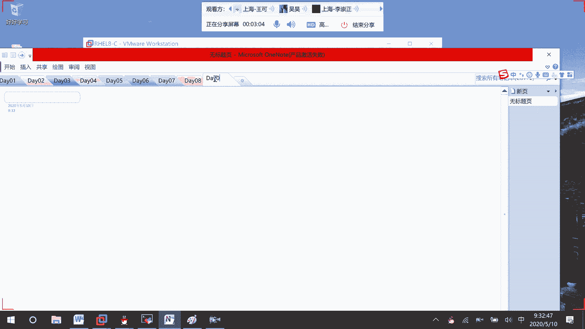
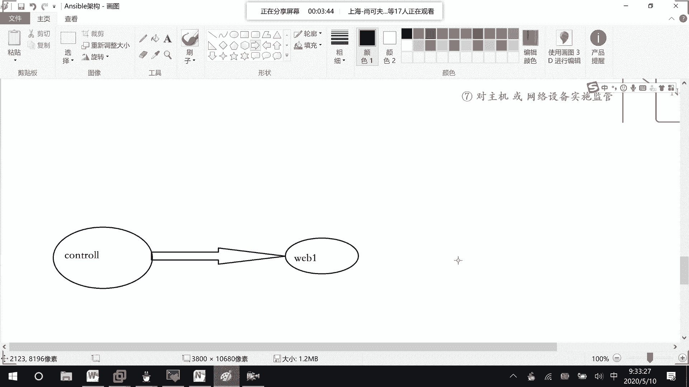

# RHCE8.0视频教程【45课时】 - P36：20200510-RHCE-01_recv - 六竹书生6682 - BV1su4y1Z7sJ

好了，这边的话呢，我们今天继续这个unstable的一个课程，上节课的话呢我们学习了一个叫做enerable，它的一个环境的一个配置吗，第一次课的时候呢，让大家去克隆了叫做三台虚拟机，并且经营了配置。

然后这次课的话呢，比如说我们就保留一台201的虚拟机，就是说进行一些测试，能控制到就可以了嘛，就这样子的一个操作好吧，等一下。

对。

环境的话呢就两台设备，这里的话呢给你们去画一下。

是一样的，一台和两台的话，那是一样的，这边的话呢就是说一个控制节点，然后下面这里的话呢也就一个web server，一，web 1，然后呢去受我这个control的一个管理嘛，好吧，等一下的话呢。

就好像我们在管理的时候，希望是以一个小组的形式，就说就去管理这个小组，那这边的话呢我们该怎么办，应该还记得吧，它的一个配置清单是不是要改一下etc unstable。

然后这边hosters上面这里的话呢，201单台主机其实也是能管理到的，设lab service，db service，还有一个叫做混合的吗，还有的话呢这里可能就是一个嵌套组，对不对，第一次课去定义的。

下面这边的话呢，比如说我们去定一个小组，就一个叫做one，就web一吧，诶稍等一下，比如说这里就一台设备，w一比一就这么一台，然后下面这里的话呢，是不是就写上那台设备的一个地址就可以了。

201嘛就方便一点，wq，我们等一下的话呢，就是说对web一这台设备去进行一个管理。

这边的话呢，因为方便后续去进行一个管理的话呢，上节课给你们讲了单台设备操作，上节课的话呢，就给你们去讲了一些基础的一个命令，主机的一个管理这个东西嘛，然后我们可以发现每一次的话呢去登录到一个，等一下哈。

稍等我一下，然后这边的话呢我们来看一下，就是说像上一节课我们在做的时候，像这个控制端去控制我们的node节点的时候，那是不是每次都要去输入，我们的一个用户名和密码呀，哦不对。

每次都要去输入我们的我们的一个密码嘛，相对来说的话呢比较麻烦，我们现在的话呢，比如说希望那个叫做node信任我们的control怎么办呢，是不是要去做互信，互信的话呢，其实就是我们的ssh免密登录。

免密登录，在免密登录的时候呢，我们要做的事情有哪个，第一个是不是在我们的control上，生成庙对啊，生成完毕了之后呢，control将公钥发给我们的node节点，是不是就可以了，就这么两步嘛。

那这样子的话呢，我们这边来做一下哈。

首先在control这里ssh key j，比如说这个生成了一个灭队的话呢，我们不需要去进行一个加密，是不是就是说这边是一个空格就可以了，因为我之前已经生成过了，所以的话呢他问我要不要去覆盖。

我打打了一个y下面这边的话呢，如果要去发给我们的node呢，是不是这样子，s s h copy di家目录下ssh里面id pub id点怕吧，发送给你想要发送的no的节点是不是就可以了。

ssh copy id杠i是不是这样子，回车，这边的话呢因为是第一次，所以在进行发送的时候呢，咱们要去输入密码，密码的话呢，你自己知道就行了，那好我们现在的话呢来测试一下，是否可以进行一个免密，等一下。

三测试，那也就是说从我control上面，比如说用我们的ping ping模块的话，能不能直接去进行一个使用吗，enerable web，一对不对，减m就哪个模块嘛，然后以前的话呢。

后面是不是都要跟上一个care，现在我们不跟了，行不行，等一下可能没有那么快，这现在的话呢是有点慢哈，web一应该是没有问题的，诶有了就说可能我现在的话呢电脑比较卡一点。

所以现在的话呢运行运行起来特别慢嘛，那好，我们现在的话呢是不是就不需要去输入密码了，之前之前我们在讲的时候。

如果不输入密码的话呢，他是不是就报错啊，那这样子的话呢我们免密登录就做好了。

就说不需要去输入密码的，大家的话呢把这个东西都去做一下，免密登录做一下，这样子的话呢方便我们后续的一个实验，就不需要每次的话都去输入一次密码吗，好吧，等一下去做啊，那行今天的话呢。

这边我们要去介绍的一些东西有哪些呢，第一个就是常用模块的一些介绍，像这边不是介绍了一个ping模块吗，他还有ba模块啊，还有一些其他的模块去介绍一下，这个模块的话呢，就相当于我们在学习linux的时候。

他的一个命令是怎么样子的，等我们命令的话呢，呃模块学完了之后呢，我们就要去学他的一个playbook是什么样子的，就是说在红帽官方的书上的话呢，是怎么样的一个模块，学了命令。

学了之后去学playbook，一个模块学完了之后去学playbook，我们这边的话呢就先把基础模块全部讲完了，再去讲playbook，play book，讲完了之后呢，我们再去讲那个roll嘛，好吧。

去调整一下和书上的话呢稍微有点差别，但是内容的话呢都会给大家去讲到的，行，这边我们来看一下，就这个呃常用模块，我们来看一下上次课的话呢，我们是不是讲到了一个叫做执行过程，这里。

它的一个执行过程的话呢是怎么样子的，我们都已经看到了，然后的话呢其实大家有时候可以看到，在进行一个执行的时候，是不是有时候颜色它是诶稍等一下，有时候一执行的一个结果，它颜色是绿色的。

有时候的话呢可能是这种叫做红色的，对不对，那这里的话呢它的一个不同颜色，是有不同的一个含义的，这个的话呢我们就说answer able，它的不同执行状态，它有不同的颜色，这个颜色的话呢。

我们可以去哪里进行一个查看呢，来看一下v i m，肯定是在它的配置文件当中去查看嘛，然后这里unstable config里面，哈这个的话呢是和他的一个叫做颜色相关的，colours，你看这里高光。

然后这边的话呢就是说如果说不可达的话，那它就是一个红色的嘛，有时候的话呢像我们如果是成功的，它是不是就是一个呃绿色的，成功了，它就是一个绿色了，然后接下去的话呢就是说不可达，它就是一个红色。

其实也就是说执行失败，基本上全都是一个红色erro，对不对，然后如果说你的话呢，像这个控制节点。

这个节点进行控制的时候，对它上面去进行了一个修改。

比如说创建了文件啊，删除了文件啊，像这种情况进行了修改的话呢，它是一个叫做黄色的，黄色的这个颜色你们自己可以去改，默认情况下的话呢，我主要给你们去提一下这三种颜色，一个就是红黄绿吗，黄色黄色对吧。

其中这个绿色的话呢就表示执行成功了，并且，叫做远端主机没有被修改，他的话呢是一个绿色的，然后这个黄色的呢执行成功了，并且，远端主机有被修改了，然后这个红色的呢执行失败了，失败的，刚才我们就看过了嘛。

然后这边的话呢嗯执行黄色的，我们现在好像还没有看过这一简单来看一下，比如说我现在的话呢，想要去往我们的目标主机上面去干嘛呢，把他的一个tap目录给清空掉好吧。

等一下我看一下这里一个201，我把它连接上来。

就说为了验证一下嘛，你们看这里l s temp目录它是不是有文件，这边的话呢我去对它进行一个删除，unstable m这里的话呢command，因为早早上的话呢。

是不是刚刚是不是用了一个叫做ping模块，那个是一个模块，command呢它也是一个模块，减a后面就要跟上，你想要执行的命令是什么，我想要去删除掉tab下面的东西，其实就这么简单。

unstable减m什么模块执行的命令是怎么样子的，我们等一下的话就要去学习不同的模块，它里面的参数可以怎么样去进行一个写，诶我看一下嗯，哦忘记写了，对哪一台，哪个小组或者哪一台主机进行一个操作。

这个web你放前面放后面都没关系啊，你看这里的话呢是不是就黄色的，这个时候我们再来看一下诶，他这边的话呢里面还有东西哈，unstable，这个是不是temple目录啊，rm rf信号。

我看一下就删除单个目录卡，单个文件看能不能成哈，单个文件是成了删除目录的话呢，可能要使用其他的，还是那个符号出错了呢，哦删除成功了哈，就是说这里的话等一下会去讲这个command呢。

它能支持的一些命令是比较少的，可以发现用这个common模块的话呢，可以单独的去删除掉一个文件嘛，对不对，如果说想要去清空目录下的内容的话，可能要用这个share。

然后的话呢它这里一个叫做红色的一些提示，就是说其实你可以使用嗯，在哪呢，你可以使用一个模块，fire，然后的话呢状态的话呢是一个state，他也可以去用的，就说其实这些模块，它之间的功能是有重叠的部分。

然后像这种叫做这种紫红色的话呢，就去建议你可能使用其他模块的话呢。

更好，可以专门去进行一个处理吗，好吧。

我给你们去解一下这三种颜色哈，第一个。

然后上面这里的话呢可能就是说是第二个。

绿色的，然后红色的，比如说去执行失败的话呢，我就写一个不存在的一个目录，诶他这里没有去报错啊，现侠看到这失败了还不容易呢，还不容易，等到时候如果真的有失败了，我再来补充这个颜色吧。

好然后这边我们就来看一下它的一个常用模块，常用模块的话呢它有很多个，这边的话呢主要是分成了四个，第一个泛模块里面我们会去讲copy，就这个拷贝的话呢，就是说将本地的文件拷贝到远端主机。

我先给你们去过一下，这个是干嘛呢，就是说将远端的文件，拷贝到，本地主机他这个就是说模块的话呢，有很多个，就相当于我们的一个叫做命令的时候啊，等一下是不是有很强的一个宅，那好他这个命令的话呢其实有上千个。

这边的话呢我不可能一一去讲，我们就好像之前在学linux命令的时候，就讲它的一些常用命令，然后还有一个叫做feature，将远端的拷贝到本地，然后在这个对文件操作里面呢，它还有一个叫做范模块。

这个模块的话呢主要可以干嘛呢，叫做去设置文件的一些属性啊，还有设置文献的一些权权限啊，哦不对，就是说所有者所在组啊，这些用file全都可以去做的，然而还有的话呢就是说啊可以去查找它。

其实还有一个叫做lie in fire，就是说某一行的话呢是不是在某个文件当中，然后接下去的话呢，就是我们的一个软件包的一个管理了，软件包的一个管理的话呢，这边我们就讲一个亚目。

亚目的一个安装是怎么样子的，然后下面这边的话呢，我们去讲一个和讲一些和系统相关的，因为像我们软件安装好了之后的话呢，是不是就要去比如说重启服啊，平时我们用的命令。

是不是一个叫做system control的一个命令，但在我们answer这块的话呢，就是一个service管理服务，就比如说他的一个开机自启动啊，当前状态要不要把它设置成一个运行状态。

都是用这个service，然后的话呢，后面这边因为前面这些讲的差不多了哈，像还有一些网络的nm c l i，就网络相关的，还有的话呢像一个叫做用户的一个管理啊，group的一个管理，其实他都有。

我们上面这边的话呢，就是说去介绍几个模块的信息，然后的话呢其他的一个模块在写playbook的时候，再跟你们去讲一下，因为前期的话对一些模块先有一些概念好吧，这边吧我一个模块去写一页吧。

首先的话呢我们来看一个模块，就是command，之前有说过的，就说之前在说的时候不是啊，在删除目录的时候，它是不能生效的嘛，对不对，他这个模块的话呢就是说命令，在远程主机上执行。

它的一个调用形式是怎么样子的呢，这个的话呢它是一个默认的模块，你什么东西都不跟的时候呢，它就是一个command的一个模块，然后这边就好像，我想要去看一下，这台设备的ip地址是什么样子的。

先来看一下他的帮助信息吧，unerable doc，然后呢减s去看一下他的一些信息，我想要去看的是command模块，回车，这里面的话呢就是说可以去跟上一些参数嘛。

然后这里的话呢首先第一个hdr是干嘛呢，你可以切换到某一个目录里面，就是说当你想去执行一个命令的时候呢，先执行这个c h d r就切换切换目录嘛，然后下面这边的话呢来看一下。

还有一个correctors，这个是干嘛呢，后面呢你去跟上一个文件的名字，如果说它已经存在了，如果说它已经存在了，这个步骤就不会去执行c r e a t e s，就是说跟上这个命令，如果文件存在了。

就不会执行后续的操作，如果说文件不存在的话呢，我会去执行后续的操作，等一下都会给大家去演示哈，下面这边的话呢来看一下removes，这个remove的话呢，刚好和这个呃correct的话呢，它是相反的。

如果文件存在的话呢，我会执行下面的一个操作，如果文件不存在的话呢，那我就不会去执行下面的一个操作嘛，如果文件存在我的话呢，会执行后面的一个操作，那如果文件不存在的话呢，那就不会去执行后续的一个操作嘛。

这边的话呢来看一下空格，还有标准输入输出吗，对吧，然后冒号qaq去进行一下退出就可以了，这边我们先来看一下，先来看一下，比如说像切换目录，我们这边的话呢呃先去创建一个文本文件吧，好吧。

在远端上面就最简单的等一下，在远端创建文本文件，那也就是说unable这是在哪一台设备上呢，web一用什么模块呢，common模块要执行什么命令呢，就一个减a就可以了，然后后面引号我的话呢。

比如说ecoach，哈喽我家我就hello，0510到哪里呢，在tap下面叫做aa。test，等一下稍等一下，王源今天开机的方式不太对啊，电脑特别吵，哦哈哦我知道了，这边他现在他现在这样子不可以啊。

这个应该等到后面再说，他不支持这个叫做高级的，好，吧因为就是说他这个的话呢command不支持，command其实和事是一样的，相对来说command呢能支持命令稍微少一点，share支持的多一点。

那这边的话呢就不管了，直接就去创建一个文件，但是呢是使用一个叫做shell的一个模块，好吧啧啧，就，但这个模块的话呢还是得得跟大家去讲一下，因为是一个最最基础的，然后这个呢文件创建好了，对不对。

我们现在的话呢，就比如说想要去切换到temp目录，然后再去查看我们的a文件，切换到pmp目录，在查看，我们的aa。test文件就说做这么两步嘛，用unstable me，用这个叫做command模块。

怎么样去做呢，就m c o m m a n d a命名是怎么样子的，那这边也就是说c hdr切换到哪里吗，temp空格我要看一下aa。test对吧，这后面的一个命令格式是怎么样子的，大家一定要记住。

因为后续再写playbook的时候呢，就这样子去写吧，我给大家先来看一个最最简单的playbook，好吧，这样子的话呢，你们才知道为什么要去讲这些模块的信息啊，cat enerable叫做file吧。

你看它的一个结构就这样子的名字的话呢，就是说你这个任务的一个名字后面呢，使用什么模块里面的参数是怎么样子的，使用什么模块里面的参数是怎么样子的，其实的话呢也就是说模块参数，模块参数就这样子嘛。

所以呢这种命令的格式大家一定要去记一下，稍等哈，你看这边的话呢，enable web一哪台主机吗，我要执行什么模块，执行的一个叫做参数呢，切换到tap目录再去看aa，如果你不去进行一个切换的话呢。

他是看不到aa的，因为这边这样子的话呢，用的是不是就是一个相对路径了，我们可以pwd一下，你看默认情况下的话呢是在家目录下面的，那现在的话呢能看到aa，因为aa这个文件的话呢。

是不是确定在远端主机的temp目录下，那原因的话是因为已经被切换过了吗，对不对好，这没有问题啊，然后下面这边的话呢刚才说到一个correct，这边我们对correct去进行一个测试。

就说文件不存在的话呢，他才会去执行一个后续的嘛，我们来看，那也就是说这边correct等于temp，比如说aa。test它是不存在的呀，如果像这个存在的话，那我比如说想要去cat一下temp，a a。

test能不能成功呢，这边这边的话呢浏览啊不对，跳过，为什么呢，因为a。test它是存在的，对不对，然后的话呢，所以就没有去显示里面的一个东西嘛，稍等一下，这边因为，叫做tama aa，aa。

txt存在，所以内容没有被查看，对吧，然后下面这边的话呢我们再来试一下，把前面这个文件呢我们去改一下，改成aaaa这个文件的话呢，它是不存在啊，比如说aa 123吧，这文件不存在。

我们来看一下他有没有看到aa里面的一个东西，是不是就看到了，因为这个叫做aa。test，123不存在，所以后面的内容的话呢可以被查看，这个应该没什么问题啊，然后下面这边的话呢。

我们再来看一下这个叫做remove，remove的话呢，就是说文件如果存在的话，后续操作才会被执行吗，我们来看它的一个格式也是这样子的，r e m o v e s，这个时候的话呢是一个叫做文件不存在。

文件不存在，所以的话呢就被跳过了吗，等一下我给你们去记录一下，因为这边刚刚开始嘛，因为这个aa test 123不存在，所以内容没有被查看，现在这边的话呢，就比如说我把123给去了。

他现在的话呢是不是就被查看了，就这样子，然后还有的话呢，就这个command它相对来说其实命令也是蛮强大的，后续的话呢就比如说哦我想一下后续的话呢，就比如说一些模块里面的一些命令。

直接使用我们这个command，它其实是可以去实现的，我们这边就比如说想要去创建一个用户好吧，平时的话呢我们在创建用户，是不是就是一个user add，然后后面跟上一个用户名就可以了，在这边他也可以。

就把你想要去执行的命令放在这里，user add，然后呢随便去写，比如说添加一个user，我先看一下吧，远端主机这个用户存不存在user 0510，等一下，诶这个用户存在啊，那这样子的话呢。

就比如说我想要把这个用户给删除掉，这个用户给删除掉，那也就是说柚子delete后面的话呢命令是怎么样的，我有点给忘了，use delete我们是不是可以跟上一个叫做减f啊，强制去删除他的一些所有信息嘛。

好吧减f然后呢再去跟上user 0510回车，这个查看用户是否存在，啊，然后下面这里的话呢发现它存在了之后呢，比如说去删除用户，他的一个命令是不是和之前是一模一样的，就是一模一样的。

然后现在呢我们再来看一下有没有存在吗，你看这个时候的话呢，因为这个没有这个用户存在，所以的话呢它是不是就fail的。

这边的话呢我们终于看到一个红色的，就是说执行失败。

执行报错的一个信息，我的话呢把它补充在这里，好吧，那行这边的话呢就比如说用户不存在的话，那我们肯定想要去添加一下嘛，user add，然后里面的比如说加目录啊，一些命令选项选项。

你在这里全都可以去进行一个使用的好吧，这样子，然后这边的话呢能不能创建成功，除了id之外，还有一个叫做get and，还可以去查看另一种方式都可以了，gt e n t p s w d，哎我看一下哦。

打错了，这里，你看默认情况下呢，它的一个id啊，它的加目录啊，它的解释器啊，在这边是不是都有，然后接下去的话呢我们要做的一个事情，比如说去给用户修改密码，你看这边的话呢叫做看到这里。

占位符是一个叫做x的一个信息吗，是一个x的一个信息，我们的话呢来看一下，我们去这个shadow dow，先看一下他的一个密码信息，发现这边的话呢叫做站占位符，用感叹号去进行一个占位的，说明什么意思啊。

说明这个用户的话呢，目前是不是没有密码信息啊，就比如说我这边的话呢去查一个red hat，是我之前去创建的，也给这个用户设置过密码的，可以发现这里的话呢，有一串字符加密的一个信息。

就说明了这个用户它是有密码的，有密码的，然后像这种空，就是说两中间是两个感叹号的话呢，说明用户没有密码，那好那既然这个user 0501没有密码的话，那我们就给他去改嘛，改密码的话呢。

我们之前比较常用的，希望一步到位嘛，一扣取red hat 123吧，怎么样呢，password减减standing给谁啊，user 0510，对不对，回车，这边的话呢它的一个状态显示出来的。

一个结果的话呢是黄色的，黄色的，我们说明它是进行了一个修改，对不对，然后我们再来查一下嘛，诶不对，不是这个用户查的是user 0510，查询一下信息验证一下吗，ak发现这边的话呢。

他是不是还是一个感叹号啊，所以就说明我们的一个密码的话呢，它是没有修改成功的，没有修改成功的，这就好像我们这个command，它有一个比较大的缺陷是什么呢，它不支持我们有时候取变量的时候，就是说。

比如说我想要去看远程主机的一些环境变量，什么的，它是不支持的，然后的话呢它也不支持那个叫做呃，我们刚才是不是用了一个重定向符号，它也不支持，还有的话呢，到时候比如说我们要去用这个管道符啊。

还有这个冒号啊，还有这个雨啊，他这些符号它全都不能支持，如果想要去支持这些模块的话呢，怎么办呢，有一个模块叫做share模块，它的一个作用，其实我们common模块的话呢，它是类似的。

只是说算是我们command一个增强的一个形式，增强的一个形式好吧，这里的话呢我们看一下就说得出一个结论，command不支持，这边的话呢竖线就管道府嘛，还有像还有的话呢就是说重定向符号。

就好像刚才说他不支持取变量对吧，那这边的话呢我们可以来看一下，是不是真的是这样的，因为我如果说想要显示这台设备的一个主机名，字，是一扣去dollar host name就可以了，稍等一下eco去大写。

你看是不是就可以啊，那就好像说我在这边的话呢，去对它进行一个直行，看行不行，就执行这条命令吗，显示出来的结果应该是web 1 x tt。com，但这边的话怎么样没有去进行一个显示。

直接的话呢就把它的一个叫做，把那个hostname的话呢去单做一个变量，去进行一个输出，因为这是一个单引号，他就是说没有去进行一个解释，如果双引号的话呢，这个会去取变量，但是现渠道的变量的话呢。

是不是一个本地变量，它也是有问题的对吧，首先这边第一个第一个问题，单引号，像这些符号的话呢，就没有作为一个特殊符号去进行一个处理，dollar等符号，没有作为特殊符号处理。

然后下面这边的话呢我们是使用了双引号，但这边如果说你这边有三个控制点，或者四个控制节点，它是怎么样的啊，获取的是control控制节点，的变量，而不是远端的一个变量，所以像这个是嗯common的话呢。

它有点问题，下面这边的话呢我们来看一下叫做摄影模块，它其实和我们的command是相似的，然后这边的话呢，我们也是先来看一下它的一个帮助信息，我把这事儿讲完的话呢，给大家去练习一下，先不着急啊。

doc这边减s都可以这样子去看share，啧你看这边第一个change dir，然后里面要执行的什么命令，correct是都一样的，其他也没有什么了对吧，然后下面这边的话呢，就是他脚本里面的一些信息了。

我们这边不太一样哈，按下q退出，你看我我就去执行一下刚才的这些命令吧，把这command改一下，改成我们的一个shell，等一下，你看，稍等，这边的话呢要单一，你看这边的话呢。

它是不是就得到了web一样，基本上我们在使用这些模块的时候，都会使用一个叫做单引号的形式，单引号的形式去得到我们的一个结果，然后还有的话呢，像刚才叫做密码密码的一个修改，这边线的话呢还是一个叫做感叹号。

感叹号的形式，说明这个密码的话呢，没有去经过任何的一个修改，我把这个模块去改一下，改成我们share的一个模块，啧啧啧啧啧，在修改密码之前的话呢，大家可以先去检查一下，就使用这个命令去检查一下。

用command用shell的话都可以发现的话呢，它上面是不是一个叫做啊空的一个密码。

然后呢我们现在去修改了一下之后，你看弹出的提示信息和刚才都不一样吧。

它有一个update successfully嘛，然后我们再来看一下，是不是现在真的有密码了呢，这边是不是就有一些一系列，字符串的一个信息了，就说明我们密码的话修改成功了吗，提示我们密码修改成功了。

然后主机名的话呢他也可以去进行一个显示，有时候也可以进行显示，然后这边的话呢，它支持的一个信息还是比较多的，就比如说你要去进行awk的一个读写，都可以用我们的一个事好吧，这里的话呢就不去说了。

share的话呢就讲这些，就说你想要执行的命令放在后面就可以了，格式的话呢就这样子，很多命令都是answerable，然后呢m就写他的一个模块，然后减a这边的话呢希望，在远端主机执行的命令是怎么样子的。

是不是都可以了，好这里的话呢你们自己去看一下，给你们十分钟时间去看一下吧。

好吧。