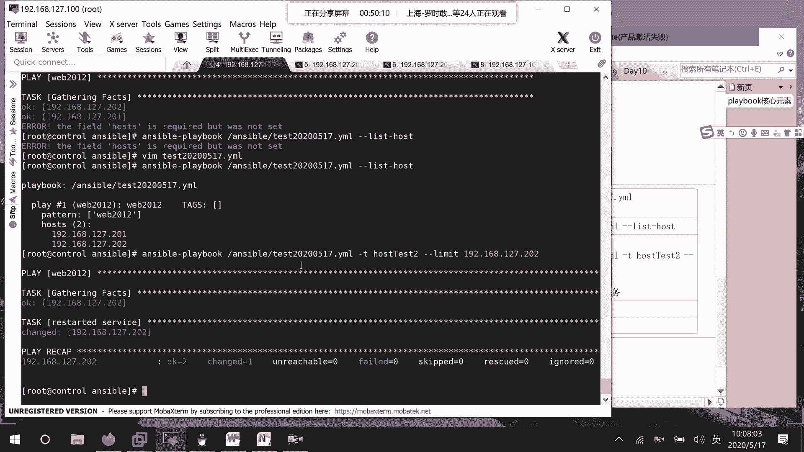

# RHCE8.0视频教程【45课时】 - P41：20200517-RHCE-02_recv - 六竹书生6682 - BV1su4y1Z7sJ

嗯因为刚才的话呢就是说我们这个叫做hunter，那也就是说其实像他这边怎么出错啊，这里都已经讲了哈，然后还有一个的话呢，就是说幂等性这边的话呢也讲了，这个就是一个hunter，我我来写一下。

那这个具体的演示的话呢，我就不去写了，第一个的话呢就是我们的一个叫做host，第二个的话呢就是task，第三个的话呢就是h，hers的话呢，它也就是说啊，和我们的notv这个通知结合起来使用。

他的话呢就说由特定的条件去进行一个处罚吗，对吧，这个上节课的话呢也是给你们演示过了，然后接下去的话呢我们再来看一个叫做tag，他给我们之前讲过吗，精选日，tag我好像在里面没有看到，你回我一下tag。

tag的话呢就是说标签，没有对吧好，那我知道从这里开始讲吧，tag的话呢它就是里面的一个标签，到时候的话呢我们执行某些任务的时候，就说会选择部分的代码去进行一个执行。

其实这个呢你可以把它想成我给这这一块的，叫做代码，去给他一个起一个名字，比如说这边不是任务一，任务二，任务三吗，他要执行的话呢，一下子三个任务都去执行了，tag的话呢，比如说我给task 2。

给他一个标签，到时候的话呢只去执行我们task 2这个任务，其他的呢不去进行一个测试，也就是说选择运行playbook中的部分代码，就这样子，那你们这边的话呢。

来看一下，我这边还是去写这个文件，posters，这边的话呢，比如说web 2012，然后的话呢remote油炸，rot这边tasks我随便去写两个任务，第一个任务的话呢。

比如说就是去进行一个ping操作吧，p test，然后这边模块的话呢直接调用pin就可以了，后面的话呢其他东西不用去写嘛，比如说我这边给他一个标签tx，后面的话呢就是host p，就这样子标签的话呢。

就在这里去进行一个企，好吧，这是第一个任务，然后接下来我们再起第二个任务，就比如说像我这边的话呢，system control is active http，他的话呢线是fied的。

也就是说没有启动system control is active http，他的话呢是一个叫做inactive的一个状态吗，我这边的话呢，第二个任务就是说想要去启动，我们的http的一个服务。

这边比如说restart service，那这边在调用模块的时候呢，调用的是不是就是service的一个模块，名字的话呢，就说对http去进行一个restart好吧。

然后这边比如说给他一个tx叫做restart httpd，就这样子。

就是说我这边的话呢来写了一个脚本，在这个脚本里面的话呢，我去设置了两个标签的一个信息嘛。

那这边的话呢等一下我们可以怎么样去做呢，我们可以这样子，第一种情况就是说只执行rs http d，还有第二种情况呢。

就是说我运行整个脚本，所有的都进行一个运行吗，好吧就说这里第一种情况之前的话呢。

如果说没有设置标签，我们的话呢想要去启动，启动一个叫做服务的话呢，它只能第一个，tsk执行完了之后，执行第二个，task，对不对，就这样子顺序去进行一个执行，但现在的话呢我们设置了tx。

比如说我现在只想要去启动服务，那好我就可以去指定某一个tag去进行一个运行，那第一个的话呢就是说不要去运行，只执行，第一个task可以这样子去做的。

我们来看一下它的一个命令是怎么样的，answerable playbook减t，后面的话呢你就跟上具体的tag是谁就可以了，answerable playbook减t，我这边的话呢。

比如说就去重启一下http的一个服务，就这里，然后后面呢跟上我们的一个叫做，unstable的一个文件，就这样子剧本文件就可以了，你看这边的话呢web 2再进行一个运行task，这边的话呢。

就是在获取远程主机的一些环境信息嘛，这边呢ok，我这里是写错了吗，我来看一下我field hosters，我看一下cat etc enerable hosters web，19198。

这个没有什么样的一个问题啊，等一下我看一下hosters，hosters web 2012 root，哎这没什么问题啊，我先来检查一下这个剧本哈，哦对对，难怪，他这样子，再让它运行一次。

可能有一台的话呢，它是没有一个http服务的，这台应该是没有http的，你看这台的话呢它是不是就启动了，然后的话呢这里就说说202的话呢，它是改变成功了，但是201的话呢没有改变成功。

他的话呢不可以去进行一个启动嘛，然后的话呢我们只执行了一个任务，叫做restart service，是没有执行的一个叫做ping的一个命令的好吧，这个的话呢就是我们tx的一个作用。

到时候的话呢只执行里面的部分代码就可以了。

好。

那好这边的话呢，tx如果说你一次性想要去执行多个标签，怎么办呢，那就替逗号把另一个标签的名字给跟上嘛，虽然我们现在这边的话呢就两个标签，但是的话呢你也可以这样子去进行一个执行，中间用逗号去进行一个分隔。

我来看一下host or这边逗号了之后不要有空格。

这里的话呢你看就开始了一个ping的一个task嘛，然后这里呢去启动服务对吧，我们上面这个的话呢就是说给每一个task，他去请他去设置一个名字，每个task设置一个tag的名字，到时候再进行调用的时候。

他的话呢就是精确调用嘛，就像我这边的话呢去掉host pin，他就调这个模块，然后这边的话呢还有另一种写法是什么样呢，就说多个task使用一个tag名字，那到时候调用的时候是怎么样子呢。

到时候调用的时候，所有匹配重的task任务都会被执行，所有匹配中的task任务都会被执行，就比如说我们这边你们来看一下，我改改成什么样的，诶，我改一下，比如说把这边tag的名字我们大家都改成一样嘛。

都改成hosters test，下面这里的话呢也改改成hosters post test，那到时候的话呢，我只要去调用这个host test的一个标签，那么这两个任务都会被执行，这两个任务都会被执行。

我们来看一下。

稍等一下，我让他已经在执行了，这边的话呢给你们去截一下图，这两个是一样的。

然后的话呢，我们在使用这条命令去进行一个调用嘛，你们下面这边的话呢，可以看到他这边是不是先去执行了，一个叫做pin的一个任务，然后的话呢再去执行那个restart一个任务。

首先这个剧本的话呢是没有报错的，而且的话呢多个任务是不是都被匹配中去进行。

一个执行了，这个稍微去了解一下他这个tag的话呢，有这两种设置方式好吧。

然后接下去的话呢我们想要去看一下，我们某个剧本当中存在的tag有哪些，这里来查看查看剧本中的tag有哪些，可以怎么去查看呢，ensable playbook，然后呢这里减减list tag。

然后对于哪个文件来说，answerable test，20200517吗，等一下你看在这里面的话呢，第一个动作针对于哪台哪些主机tug有几个呢，有一个叫做host tugs吗。

你这边如果说对这个剧本文件的话呢，去进行一下修改，比如说他host test 2，我再来查看一下标签，他这个tag的话，那就不仅仅只有一个了，你看是不是有host tag test。

还有一个叫做host test 2呀。

这个的话呢就是说你不需要去打开我们的文件，自己去找，因为就是说在文件当中的话呢，可能他有很多task，然后tag的话呢又写的比较隐蔽一种，要么你自己去匹配嘛，对不对，但但是的话呢比较麻烦一点。

还有一种的话呢就是说自己去查一下就可以了，好吧没问题。

那行，然后这边的话呢我们来看这边剧本，我们写完了，就像我刚才这边的话呢写错了，如果说直接去进行运行的话呢，是不是比较慢，所以这边的话呢，我们基本上会先去进行一个测试，这里也是ensable开头的。

这里就减一个大c去进行一个测试，他这个测试的话呢，就去看你这个代码有没有问题，但是在远端不会去进行一个执行，就是说在什么这个202201上面啊，不会真正的去进行一个执行。

知道吧，你看这边的话呢他就报错了吗，这边的话呢我们去讲几个常用的，第一个脚本检验，杠大c或者的话呢减减check他都是可以的。

好吧，他这个的话呢，诶他这个的话呢效果是怎么样子的呢。

就说会进行一次空运行，不会去进行一个执行，只是说去进行一个检查而已，然后接下去的话呢，就是说我们想要去查看针对的主机。

针对的主机的话呢其实是比较方便的，我们就说直接去cut一下这个文件就行了吗，他这里的话呢还是有一条命令，answerable playbook，然后后面这边的话呢就是enable test，2020呃。

0517，后面这个一个选项list host，你写前面的话呢也没有关系，写后面的话呢也可以哦，这边的话呢我先把它改回正确的哈，你看这边的话呢，他直接会把你从web 2012。

这个小组去进行一个解析，解析到我们的主机的名字有哪些，把它给放下来吗，好吧，那行，然后下面这边的话呢我们来看一下，就是说诶你看这边的话呢，它不是有针对192168127，还有192。168202嘛。

对不对，我刚才的话呢这边发现这台主机，这台主机的话呢是一个201，它没有安装http服务，如果说我想要去限制执行的主机怎么办，就说只让某台主机去进行一个执行，只针对，特定主机执行怎么办。

就比如说我现在这边的话呢，就针对192168127。202，去执行这个脚本吗，因为这个脚本的话呢，我们刚才看到针对127。201可以执行。

针对127。202也可以执行，我的话呢发现201他没有安装http服务，我不想让他执行了，就在202上执行，我们来看一下这条命令怎么去写啊，answerable playbook。

然后呢ensable test，这叫做这个剧本文件嘛，然后呢比如说t我干嘛呢要r s呃，名字不叫这个了，他的一个task的话呢叫做host 2嘛，就启动对吧，然后呢减减limit，192168127。

202，就让这台主机去进行一个执行，我这边的话呢，他现在的一个服务不是active的吗，我先把它给stop掉，好吧，然后呢，我又去执行这条任务回车。

这个命令的一个意思的话呢，就说只针对，192168127202执行，host 2 host test的标签任务，好吧就这样子。

然后接下去的话呢呃我们上一节课的话呢。

是不是还说过一个叫做显示执行的，中间的一些过程啊，对不对，中间过程的话呢可以怎么样去进行一个显示呢，减v对不对，这个呢你们自己去看一下，他有四个乘积。

减v减v v v v v v v v4 v4 v的话呢，它是最详细的一个过程，然后好，接下去的话呢，我们再来看一下和这个playbook相关的一个东西。

因为这里刚好看到一个执行过程嘛。

我们想要去看一下这个啊，剧本当中它到底有哪些任务，显示任务数。

这边的话呢可以怎么样去显示呢，enerable playbook，unstable test，然后这里接下去的话呢list tasks，你看这边的话呢就出现了你task有两，就是说任务有两个。

一个是ping操作，一个的话呢就是说ping测试嘛自己写的，还有一个的话呢，就是说我们去重启我们的服务吗，所以这边的话呢你们在写任务的时候，这个名字一定要写得准确一点，自己的话呢好去进行一个辨认吗。

好吧，就这样子到这边的话呢，我们对于playbook里面的一些核心元素啊，还有的话呢怎么样去进行一个查看啊，就讲完了就讲完了，接下去的话呢我们等一下要去讲一个叫做变量，它变量的话呢怎么样去进行一个定义。

变量定义的几种方式好吧，我们这边的话呢休息个十分钟吧。

