# RHCE8.0视频教程【45课时】 - P42：20200517-RHCE-03_recv - 六竹书生6682 - BV1su4y1Z7sJ

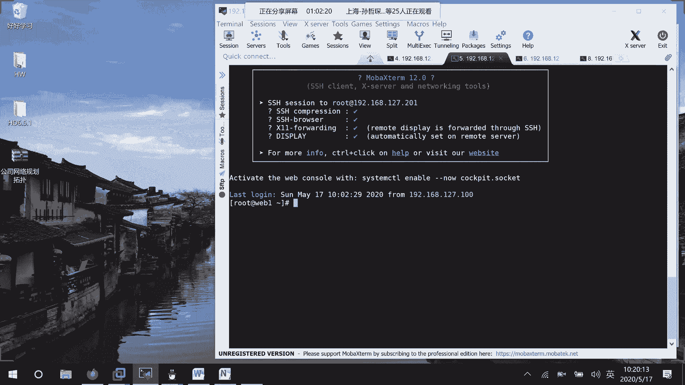

那行下面这边的话呢，我们来讲一个新的东西叫做变量。

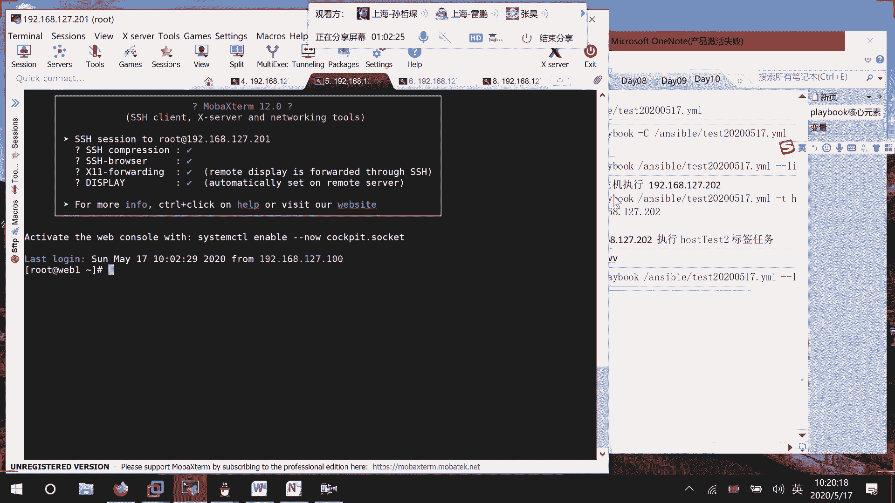

变量的话呢，之前我们在学那个叫做shell脚本的时候呢，也跟也跟大家有说过吗，他这个的话呢就可以比较灵活一点，我们之前在写这个叫做play book的时候，你看这里写的web 2012可以再变吗。

就变不了了，如果要变的话呢，再去编辑这个文件吗，就比较麻烦，所以这个变量的话呢就是一个代号，后续的话呢我根据自己的实际情况，可以去进行一个设置嘛对吧，然后那既然有变量的话呢。

那变量是不是就要去进行一个命名啊，就比如说我们这个课程叫h4 e啊，或者怎么样对吧，然后这个他在进行一个命名的时候，有什么样的一个特点呢，它的一个组成，只能有数字，还有个字母，还有一个下划线组成。

这三种，然后的话呢其中只能以我们的字母开头，其他开头全部都不可以，我这边来写一个最简单的，那比如说key等于什么样的一个value，怎么样的一个值吗，就比如说我这边到时候的话呢。

给http去进行一个叫做啊启动它的一个端口，或者给某一个主机去设置它的一个名字的时候，我是不是可以去定义变量，比如说p808080 啊，是不是可以这样子mean前它的一个格式，就这样子格式。

名字变量名字值变量名字值是怎么样子的好吧，然后下面这边的话呢我们来说一下这个变量，它进行定义的方式有几个，方式的话呢，总共有五个，我们这边的话呢就是说会先去讲三个。

因为还有一个的话呢和我们的剧本是相关的，第一个第一种形式我们通过哦不对，这边变量的话呢就是说给它赋值，赋值有几种形式好吧，第一种形式的话呢，就是说在playbook就相当于在这里。

我直接去写它的变量名字值，变量名字值是多少，在playbook中，直接定义变量，和值，然后这边的话呢定义好了之后，下面不是要去进行一个调用吗，它变量调用的方式是这样的，花括号两级花括号。

然后中间这里的话呢，去写上变量的名字就可以了，就可以去进行一个使用，好吧，这是第一种方式，第二种方式呢，比如说我在这个playbook当中，去使用了某一个变量吗，对吧。

他用这种方式的话呢去使用了某一个变量，play book当中它的一个定义的话呢，格式就是这样子格式，或者的话呢就是呃key冒号value是多少嘛，然后呢要去使用的话呢。

就是说比如说这个http我就不写了嘛，我就引号service name就可以了，然后赋值的话呢，这是第一种方式赋值，第二种方式赋值的话呢，就是命令行当中去进行一个赋值嘛，她怎么样去赋值呢，就这样子。

unstable playbook，然后接下去是不是要针对某个脚本啊，比如说test 2017减一简易，然后接下来里面的话呢，你就去写这个变量符号等于叫做值是多少，那他的话呢就可以去进行一个赋值了。

好吧，这是第二种格式，我怎么样去进行一个赋值，然后接下去的话呢我们来看一下第三种形式，叫做专门的话呢去定义文件里面的话呢，就去写某个变量，是多少，其实这两种的话呢是差不多的。

只是说一个是直接写在play book当中，一个的话呢我单独的去开一个变量文件，去写我们的这些值吗，然后还有一种情况的话呢，就在这里去进行一个定义，叫做cat，etc enerable，posters。

这里面可以去定义，你看就类似于这样子好吧，等一下，在主机清单当中去进行一个定义，主机清单里面的话呢，大家可以去看一下，去进行一个细分，我等一下会去进行一个演示，这里的话呢它有两种。

第一种针对单台主机赋值一个变量，赋值两个变量它都是可以的，好吧，针对单台主机，这样子如果有多个变量呢，就打空格，再写上新的变量吗，第二个针对主机组，就比如说我这里不是有一个web web的一个小组吗。

你看冒号va 2 s，就表示我下面这里呢是要去设置变量，这边变量名字变量值，变量名字变量值什么意思呢，我这两个变量可以针对web这个小组当中的，所有用户去进行一个生效，好吧，我这边来说一下，上面。

node，和domain name变量，针对主机组，啧，这个中中的所有主机都生下好吧，这是一种方式，然后还有一种方式的话呢，就是说我们在rose当中去进行一个定义，就角色当中他的话呢会有个目录。

这个的话呢我们后面再去讲好吧，现在的话呢我们就主要来讲这四种方式，然后大家来想一下这几种方式，1234这几种方式里面的话呢，哪一种方式是最优先的，最优先的，最优先的话呢是这种命令行的方式，为什么呢。

我们所有操作在命令行当中操作，它的优先级是最高的，这个的话呢你们可以去记住哈，他在命令行当中去进行一个赋值的话呢，它的优先级是最高的，因为我们人为去进行了一个设置嘛，好吧。

那行这里的话呢是进行的一个叫做变量，怎么赋值，接下来的话呢我们来看一下，在这里它有没有一些系统变量呢，就好像我们在进行系统操作的时候，是不是有一些什么环境变量这些东西啊。

那我在进行unstable管理的时候，它有没有用系统变量呢，它有他这些变量的一个来源，第一个就像上面这里我们自己去定义，第二个系统，自己有变量，我们这边的话呢就比如说想要去查看系统变量，怎么去查呢。

有一个模块叫做setup的一个模块，但是的话呢现在我等一下再迁移过来，现在的话呢你看这个guessing fx，这个其实就是在收集远程主机的一个变量，以前的话呢用的是一个set up。

但set up的话呢它比较灵活一点嘛，所以我先讲这个，然后到时候再给你们来看一个，这个事实的一个管理好吧，那行这边的话呢，那也就是说unstable针对于哪些主机嘛，2012这个主机要用什么模块呢。

set up模块就可以了，稍等啊，这样子回车，稍等比较慢，他的话呢就可以把web 2012这个小组，包含的所有主机，他的上面的一些信息给你去进行一个收集，我们来看，稍等一下，信息太多了，看不过来。

你看这里192168127。202，信息收集成功，在它上面的话呢，有一个叫什么unstable or ipv 4 address，202，你看我这台202的设备，它的地址不就是202。

然后接下去ipv 6的地址5e915191 ，然后接下来我们来看它这边的话呢架构，然后呢bios的一个时间，bios的版本是不是全都有收集的，所以像这个的话呢，facts也好，set up也好。

他的话呢主要获取管理节点，系统信息，好吧，主要是去管理节，获取，我们管理节点的一个系统信息是怎么样子的，然后现在这边的话呢，比如说嗯我来看一下这边的话呢，它的一个信息太多了。

如果说我现在想去看一下他的主机名字呢，如果说我想要去查看远端主机，它的主机名字有哪些，以我们目前所学的知识的话呢，首先第一个用shell命令可不可以啊，直接通过shell去发到远端当中去嘛。

shell模块万能的一个模块，好吧，你来看啊，就这样子，answerable web，2012m shell，嘿干嘛呢，host name去获取一下这两台设备的一个主机名字嘛。

你看第一台设备获取到的是web 1，第二台设备获取到的是一个web 2，这个没有问题，如果说我们现在想要使用我们的一个叫做set up，的一个模块，刚才这里的话呢，这么多信息显示出来了。

我去grape一下不就行了吗，是不是和name是相关的，稍等比较多，你看这里他这里的话呢，这个肯定不是这个不是是不是这个哦，enerable hostname，它就是一个缩写。

这个的话呢是不是一个全称啊，我们是不是想要的就是这个东西啊，web 2 x t t。com，所以后面的话呢，如果说想要去进行一个更精确的过滤的话呢，那就这样子，enable node name。

你看是不是，就把我们的一个主机名去显示出来了，所以这里的话呢就是第二种方式，等一下，这种然后还有一种方式是什么呢，就是说比这个rap更好用的，他在自己的模块当中，因为像share的话呢。

他是不是有自己的模块命令，那相同的我自己也有的，边的话呢，就是说f i l t r过滤吗，我想要去过滤什么东西呢，我想要去知道它的一个主机名字是什么，就这样子放在这里。

我的话呢也可以去进行一个获取的回车，等一下好，你看这里的话呢，是不是就显示出来这个叫做node name是什么东西啊，其实我们这边的话呢，这边fix就是我们的一个叫做，去获取我们系统的一些信息。

去获取系统的一个信息，然后的话呢这边刚才可以看到一个叫做，answerable hostname，它显示的话呢是一个短主机名字，因为这里的话呢你们去了解几个系统变量。

到时候的话呢在我们的呃answer脚本当中的话，你可以直接去进行一个使用这些系统变量的，就比如说我到时候的话呢希望在远端的主机，比如说在temp目录下面，去创建一个以主机名开头的，比如说后面下划线。

再是一个比如说x t t。com的一个文件，那首先是不是要先获取到主机的名字啊，这个unstable hostname的话呢，他就是一个短主机名，然后接下去的话呢。

我们刚才看到是不是有一个叫做answerable，not the name啊，他这个的话呢就常驻居民，然后平时的话呢，我们可能用这个有很多f q d n，就是一个信就是一个完全限定的一个域名嘛。

就是说其实和我们这个unstable node name的话，那是差不多的，就是哎f q d n，就整个整个的名字都是完整的去进行一个显示，我先来给你们匹配一下，你看就这个enable fq dn。

这个的话呢就是说完全的限定域名，然后接下去的话呢，就比如说我现在的话呢可能要去管理网络了，那这个可能是和什么相关的呢，是不是interface啊，我们来看一下它的全名叫什么，稍等，你看这里的话呢。

是不是基本上全都是unstable interface，前面加个answerable就行了吗，我这边的话呢就是说有一个e160 对吧，一个一个接口，这个东西，他的话呢就表示我们所有的网络接口列表。

然后接下去的话呢就好像你要去看磁盘分区啊，那肯定是和partition相关的对吧，如果说想要去看dns服务器啊，是不是和什么name server相关的或者dns相关的。

自己的话去进行一个查询就可以了好吧，所以这边的话呢在进行匹配的时候，有这三种方式，我们先来试一下吧，比如说现在的话呢想要去，想要去做一个嗯，我想一下，我来看一下叫做，就这样子吧，我们现在的话呢。

因为这个系统变量怎么样去进行一个，获取的话呢，已经知道了嘛，现在的话呢就是说希望使用这个hostname变量，在我们的playbook中进行使用，要做一个什么事情呢，非常的简单。

比如说在远端主机的temp目录中创建，文件就好了，这个文件的话呢有什么特点呢，携带hostname的一个信息，好吧，那行啊，那这边的话呢，我先去把这台设备temp目录，先把他所有东西给清空哈。

rm rf新号，没东西，然后这边的话呢rm rf temp信号，他这里面的话呢也没有东西，接下去我们的话呢去写一个叫做剧本文件，这边的话呢比如说cs vr 20200517，就说和我们系统是相关的嘛。

这里的话呢我去给你们去记录一下，这里清空node节点上的，dee上temp目录文件，第二个编写剧本文件，剧本文件的话呢，我们来看里面第一个就说hosters是吧，冒号web 2012。

然后接下去的话呢要做的一个事情，是不是就可以去给这个任务的话呢，user冒号root，接下来的话呢是不是就可以写task，然后呢去给这个task起一个名字，比如说对这个系统变量的一个使用吗，然后呢。

现在呢我们就很简单的想要去创建一个文件，file name等于就是说在远端哪里去创建文件，刚才是不是说了在temp目录下，然后我想要去调用一个系统变量，这系统变量的一个名字的话呢。

是不是叫做answerable hostname啊，就放在这里就好了，前面也不需要加什么dollar符号啊，或者去加引号，不需要不需要state，等于touch表示我想要去进行一个创建嘛，对不对。

就这样子就够了，好吧，然后这边的话呢我们就保存退出，然后这里enable playbook，我们先来一次空运行，unstable，我写一个完整路径啊，回车检验一下吗，你看这边的话呢可能全都是一个ok的。

对不对，然后那好，那我现在的话呢就正式的来运行一下，运行完了之后呢，我们等一下来检验一下，他是不是真的去创建起来了，我这边的话呢为了快一点，直接就到远程主机下面去看看是不是有web 1。

你看是不是有web 2，是不是全都去进行一个执行了，而且的话呢调用的是不是叫做web 1，web 2的这个信息对吧，说明的话呢没有什么样的一个问题啊，没有什么样的一个问题。

这是一个最简单的就是说这边的话呢，就是我们的一个系统变量，它是这样子的，然后这里呢用set up可以去查看，查看了之后呢，我们在playbook当中怎么样去进行一个使用，好吧，接下来我们要来讲第二个。

就是说在我们的playbook中，我的话呢怎么样去定义一个变量，定义完了之后呢，我们再去使用，比如说第一种方式，稍等啊，诶我刚才写的第一种方式，第二种方式呢，就这里比如说使用命令行去赋值啊。

定义文件去赋值啊，或者主机清单去赋值啊，这怎么样去进行一个实现的好吧，欠这边playbook，我们的话呢就说随便的去定义一个，定义剧本，就说编写剧本里面的话呢，就是说包含变量，变量包含了之后呢。

它的一个目的就是要去测试多种赋值方式，等一下，我们现在的话呢就要去测试多种赋值方式，因为在我们的剧本当中怎么样去定义，怎么样去使用变量的话呢，我们也看过了吗，刚才使用的变量的话呢。

就是说是系统的一些变量，如果现在这个的话呢不是系统的变量的话呢，怎么就说我怎么样去进行一个赋值。

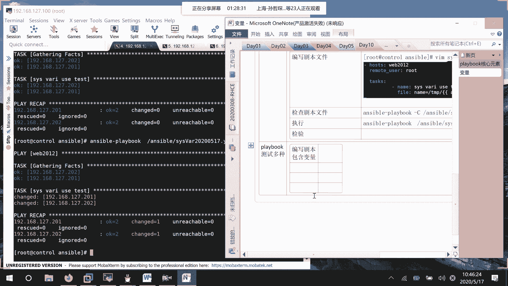

等一下。

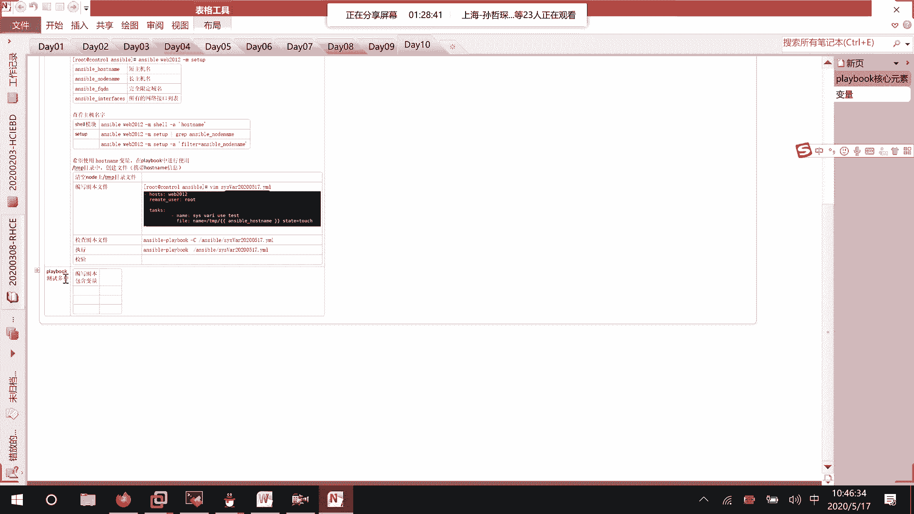

测试多种变量赋值，那行我这边的话呢先来编写一个文件啊，就vim我们的etc啊，不对还是在这个answer able下面，比如说叫做app test，20200517点y ml的一个文件。

这个文件的话呢我主要是干嘛呢，去对一些服务的话呢去进行安装啊，还有的话呢去进行一个启动操作好吧，去进行安装，还有的话呢去进行一个启动操作，我们这边的话呢先来看一下。

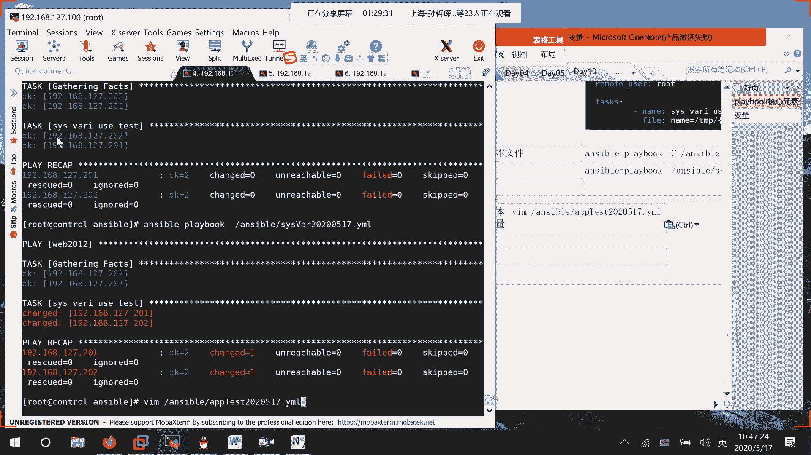

既要安装和启动，那就先把这两台设备上面它的一些服务的话呢，我先把它给卸载掉，我看一下ym list http d，在不在哦，已经安装了亚mt，dv sdroom，so ym list http d。

我看一下，先嗯，这个都已经装了，而且这个http的话呢可能下载起来会慢一点，我换一个吧，换vs f t p也安装了，我把这个给移除掉，要么remove vs ftp地，就是说我现在的话呢要去写一个剧本。

它主要的话呢是对我们vs f t p，去进行一个安装啊，去进行一个重启啊，这些操作好吧，这边实验准备，叫做卸载，node节点上打vs ftpd服务好，都忘记更歪了，我。

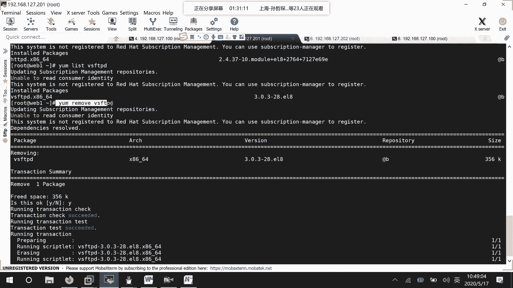

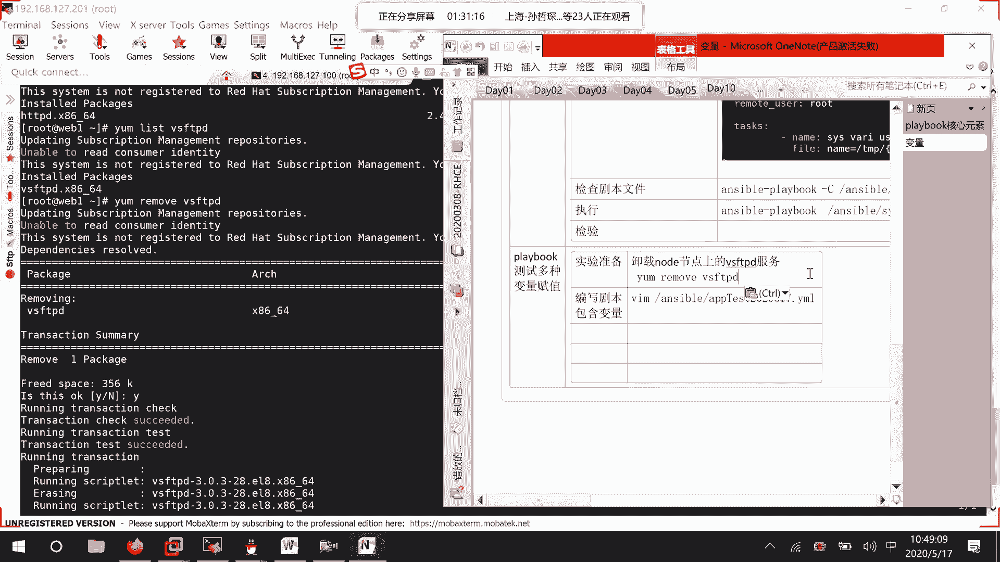

然后接下去的话呢，那我们就来去编写我们的一个剧本文件嘛，这边进来了之后也是一样的，第一个hosters冒号web 2012 remote user，冒号rot tasks。

比如说第一个任务的话呢是干嘛的呢，叫做in store vs ftpd package，然后接下来name ym冒号name，如果说这边的话呢，我直接写vs ftp或者http。

他可能就是说就直接针这个功能的话呢，我在描述的时候是不是针对某一个服务啊，但现在的话呢我希望去取变量，那也就是说我直接是去安装包嘛，那引号哦不对，花括号花括号设置一个变量的名字，就表示我等一下的话呢。

希望去获取到pk name这个变量的赋值，然后好这边的话呢可能把这个软件装起来了，我们是不是基本上会去想着去启动，我们的一个服务啊对吧，service冒号name，那你看上面这里去装的应用是什么。

那我这边的话呢启动的是不是就什么，有时候的话呢，如果说服务名和软件名是相同的还是比较好的，如果不相同的呢，那好上面就package name 1 package name 2嘛对吧，名字不相同。

那你就要去起两个变量，state启动一下，enable等于tru，对不对，就这样子啊。

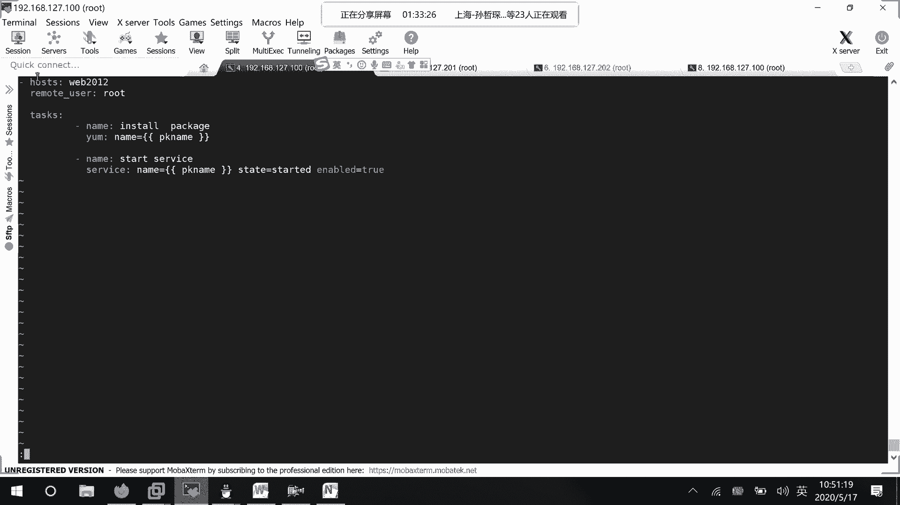

写个剧本，然后现在这边的话呢只有两个，一个的话呢哦只有一个变量pk name。

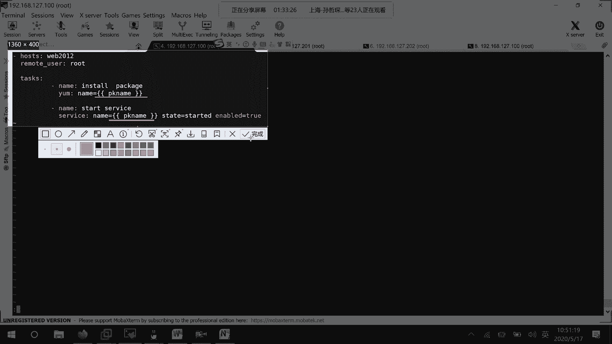

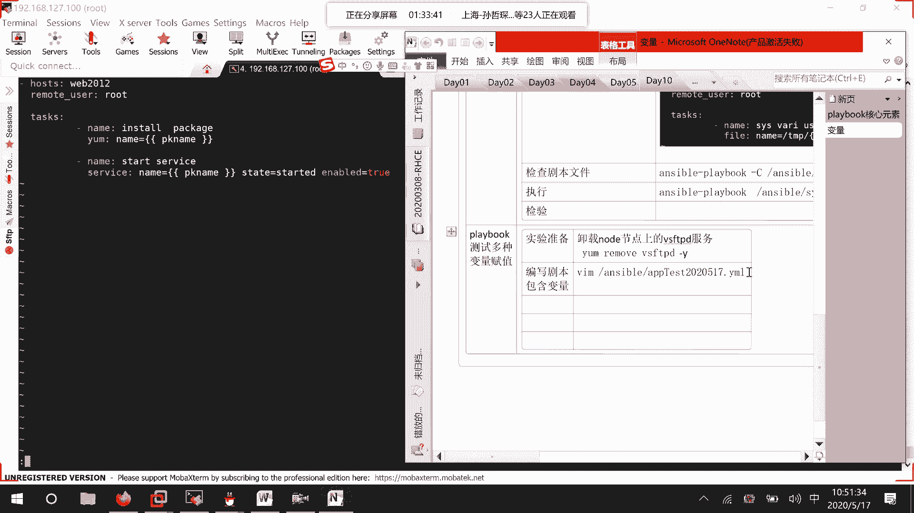

然后接下去我们要做的一个操作，就是说在执行的时候去进行一个赋值。

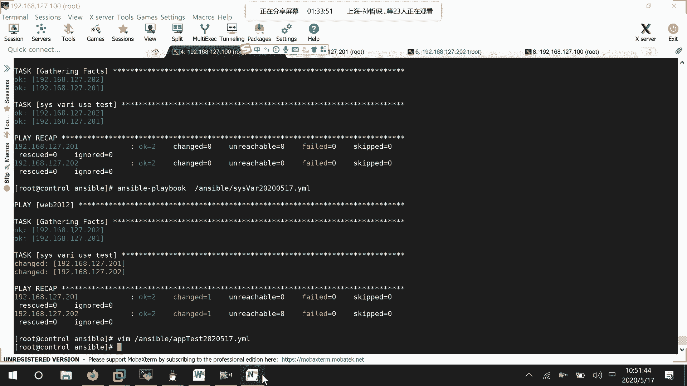

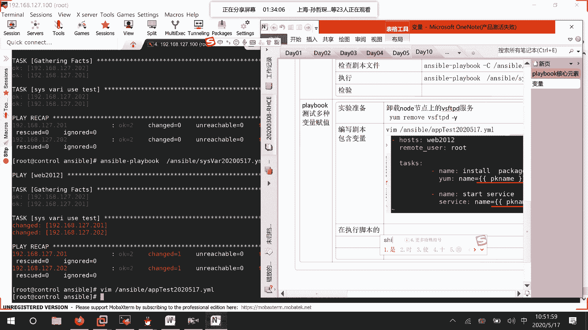

好吧，我们来看一下它的一个格式是怎么样子的，answerable playbook e减e，我们变量的名字是不是pk name vs ftp d，就这样子就行了，然后后面就跟上。

你要去运行的一个叫做剧本文件是谁，回车，这是第一种方式，我们的话呢就可以去查看一下，到时候这个包的话他装了没有，avaluable的话呢，表示还没装到，in store的话，那就表示安装到了吗。

现在的话呢才要开始去进行一个安装，所以没那么快，你看刚才这边的话呢是一个叫做available，线的话呢，是不是就是一个install e的一个状态，说明在我的201上面的话呢。

这个包它确实已经装起来了，在这里，你看他是不是也是install的，说明我这个的话呢。

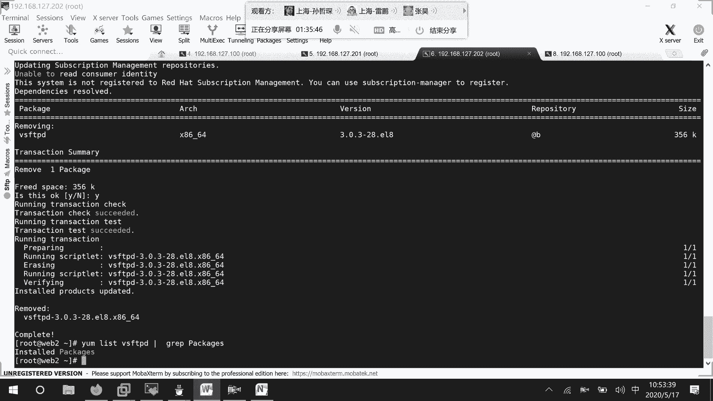

它确实也是已经安装起来了吗，好吧那行，这个的话呢，就是说我们的第一种方式去赋值，单个变量的时候呢。

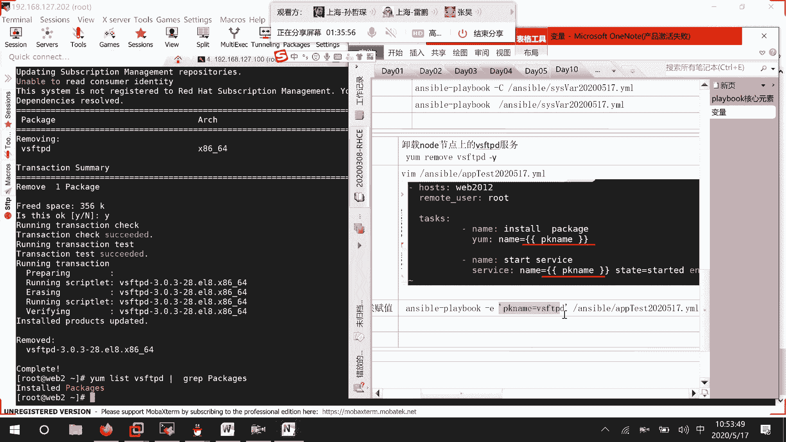

是这样子去做的，我现在剧本文件当中，如果说去写两个变量呢，比如说我这边的话呢给他一个叫做pk一嘛，这边的话呢给他一个pk 2好吧，现在的话呢就不再去start我们的一个服务了。

比如说去stop我们的一个服务，那这里就是s t o p p e d，然后呢enable，比如说我也把它改成关掉。

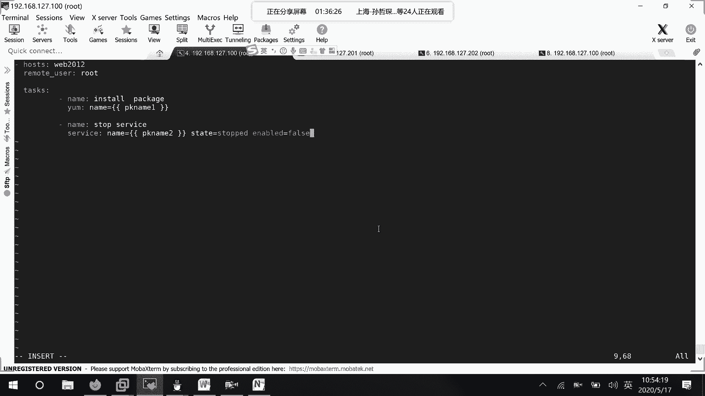

保存退出，我们来看一下这个的话呢，多个变量怎么样去进行一个赋值。

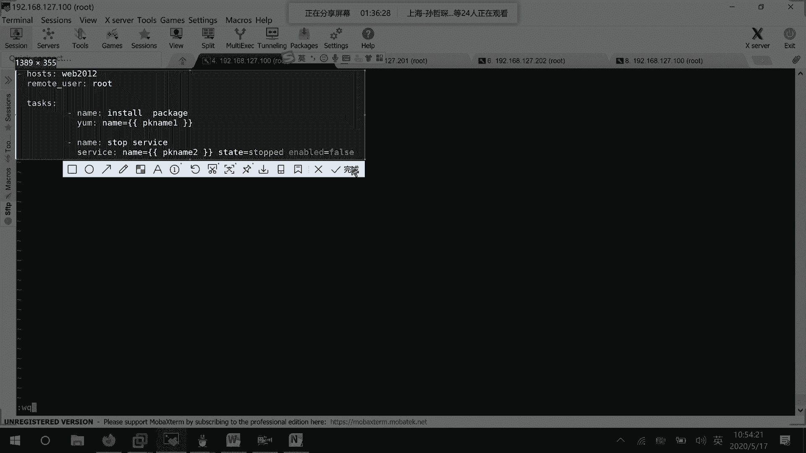

嗯好，这边的话呢在运行的时候和前面是一样的，比如说这边在两边去安装一个叫做tree，这里有我把它卸载掉，ym remove tree，这边也有我把它给卸载掉，yum remove tree，等一下。

好吧两边上面的话呢我都把它给卸载掉了，那这边的话第一个去安装tree空格就可以了，不需要打逗号，pk 02，我们希望对vs f t p d进行关闭服务，然后呢进行开机不自动启动嘛。

就这样子直接去进行一个复制。

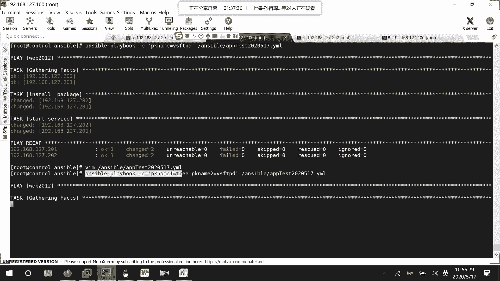

中间有空格就可以了，这里是空格哈。

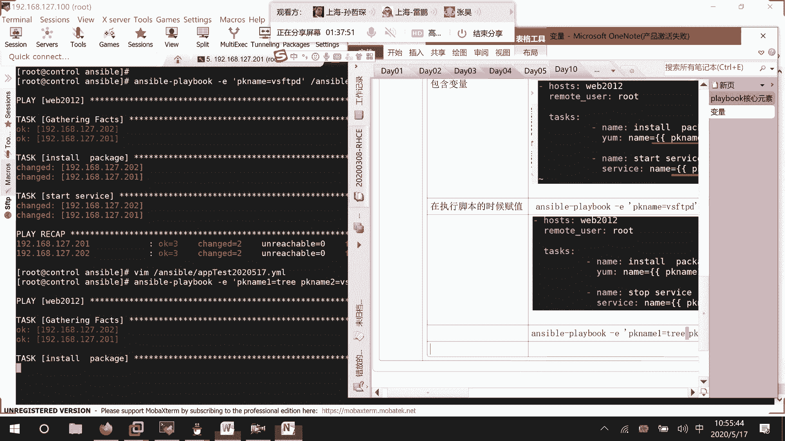

你看是不是就变成一个install的一个状态，然后呢，嗯100我把它往前挪，然后这边的话呢我们顺便再来看一下。

system control is active vs ftpd是inactive is enable，他这边的话呢是不是也是一个，disabled的一个状态对吧。

这个的话呢就是说我们怎么样去定义一个变量。

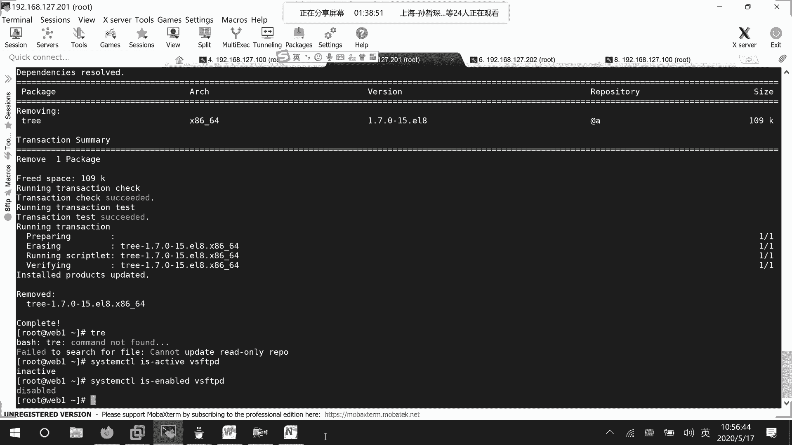

然后的话呢怎么样去进行一个命令的赋值，给你们15分钟时间的话呢，自己去做一下好吧，去练一下，然后的话呢等一下等到11。10分的时候呢，我们去讲怎么样使用剧本文件去进行一个赋值。

然后的话呢怎么样去编写文件，去进行一个赋值好吧，再去看一下。

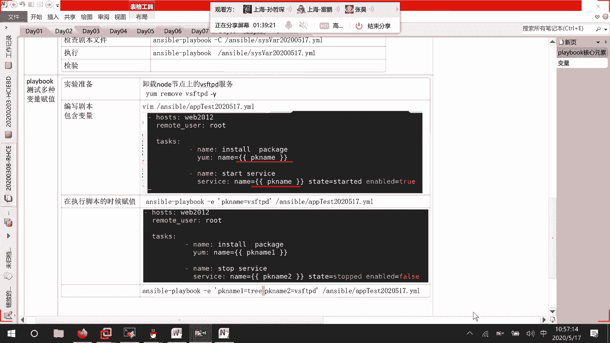

然后想上洗手间或者想要喝什么嗯。

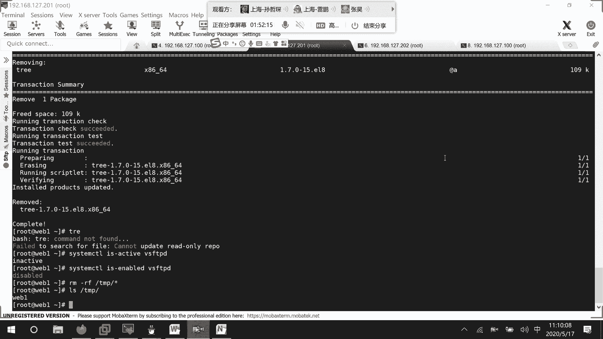

我们这边的话呢来看一下，叫做接下去怎么样去在我们的play啊。

play book当中去进行一个变量定义嘛，这边的话呢我去提一嘴哈，我们平时的话呢再写一个剧本文件的时候，是不是基本上是这样子的一个形式啊，就fire name等于什么state，等于什么东西嘛。

另一种形式的话呢，我这边给你们去提一下，其实都是一样的，cat six，这个文件就是说fire的话呢，它本身是name等于什么对吧，你可以这样子name冒号空格什么东西，get冒号空格是什么东西。

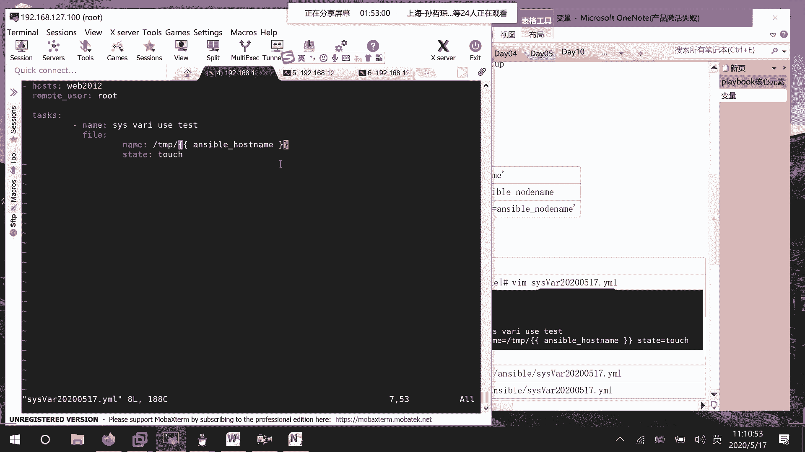

它的一个内容的话呢是完全等价的好吧。

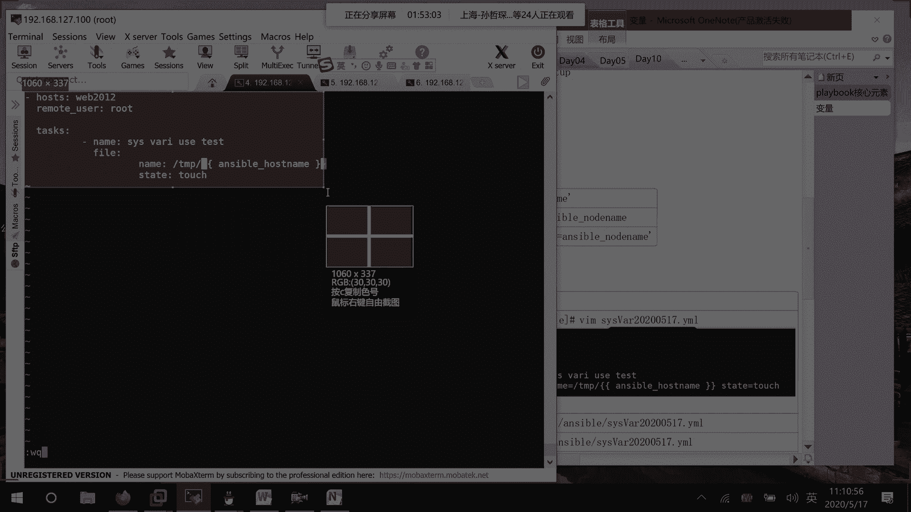

就是说你喜欢哪种格式的话呢，全都是可以的，二选一，我比较喜欢上面那种格式在写，因为下面这个格式的话呢，有时候缩进出现问题的话，那就比较难处理了嘛，虽然第二种形式会好看一点，我觉得那好。

下面这边的话呢就继续刚才的这里来讲哈，我们来看一下刚才这边的话呢，就是说直接使用命令的时候呢去进行一个赋值，接下来我们比如说想要使用剧本，剧本去进行一个复制呢app，对吧。

然后在这边去进行剧本赋值之前呢，我们先去把这个tree给删除掉，yum remove tree，等一下，减y，要么remove 7减万，把这两边的tree给移除掉。

然后接下来的话呢你看啊在这里面怎么样去做，第一个vr s表示我要去设置一些变量，对所有的任务都是生效的，变量几呢，变量一我要给它一个名字，变量几呢，变量二我要给它一个名字。

现在的话呢就比如说让这个服务去启动一下嘛，start，然后呢让他去开机自动启动一下嘛，好吧。

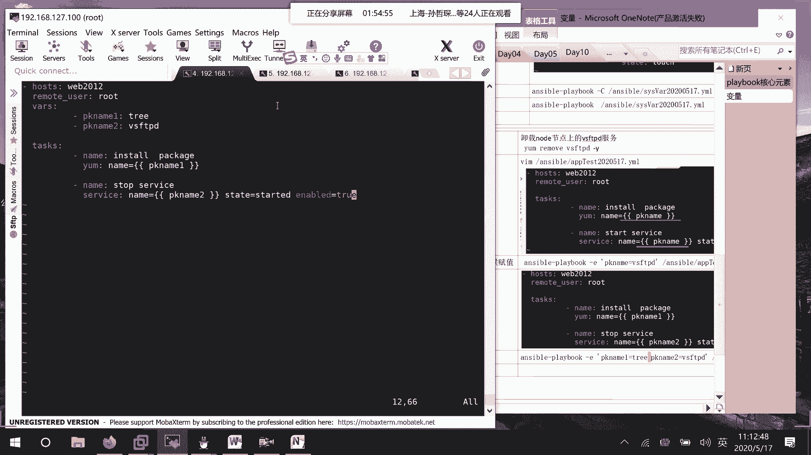

就这些东西我们的话呢大家来看一下啊，剧本当中命名，就在这个模块当中去写一下就可以了，vs冒号横线变量的名字值。

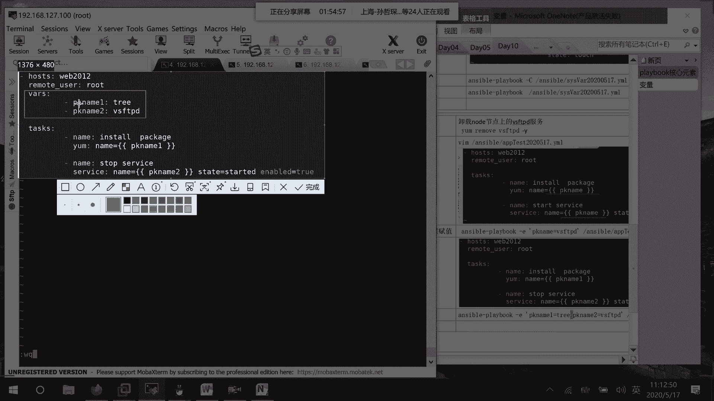

变量的名字值就可以了，表示这我这里定义的变量的话呢，对所有的任务全部都是生效的，在playbook中定义变量好吧，那现在这边的话呢我们来测试一下，那这个在测试的执行的时候就比较简单了，直接就这样子。

unstable playbook，然后呢unable下面的app test 2020，稍等一下，运行一下，然后等一下的话呢，我们来这边来检查一个就好了。

system is active vs f t p d吗，刚才被我们给停止掉了，现在有没有启动呢，等等一下，没有那么快，现在还在安装包吗，线应该就快了，但是还是得等一下，你看是不是就启动了。

所以这是第二种形式，怎么样在我们的剧本文件当中去赋值，大家先了解一下，这里呢很多种情况，我们等一下要去讲哪种情况会更加优先嘛，然后好接下来的话呢大家来看一下啊，我们要来看第三种情况。

在我们的host文件中去进行赋值，好吧，那行这边的话呢我们来看一下，呃vim，etc unable，哦我主机弄错了，vim etc enerable hosters，我这边的话呢先去定义几个变量。

等一下的话去进行一个使用，里面这边的话呢，比如说因为我这个文件都是对2012，这个组去操作的，我就在这里去进行一个命名吧，哦就在这里的话呢去进行变量的一个定义嘛，可以吧，我这边随便来写。

比如说第一个写的是啊number part，随便去写一个变量，比如说它等于1001吧好吧，然后这里它的一个number part等于1002，那也就是说就好像我等一下去创建一个文件啊。

或者去修改主机名的时候啊，如果调用了number p对于2010来说，它的number port是多少，1001，对于20202这台主机来说，它的number port应该是多少，是102。

这里的话呢也就是说针对不同的主机，这个还是蛮常用的，大家可以去住一下。

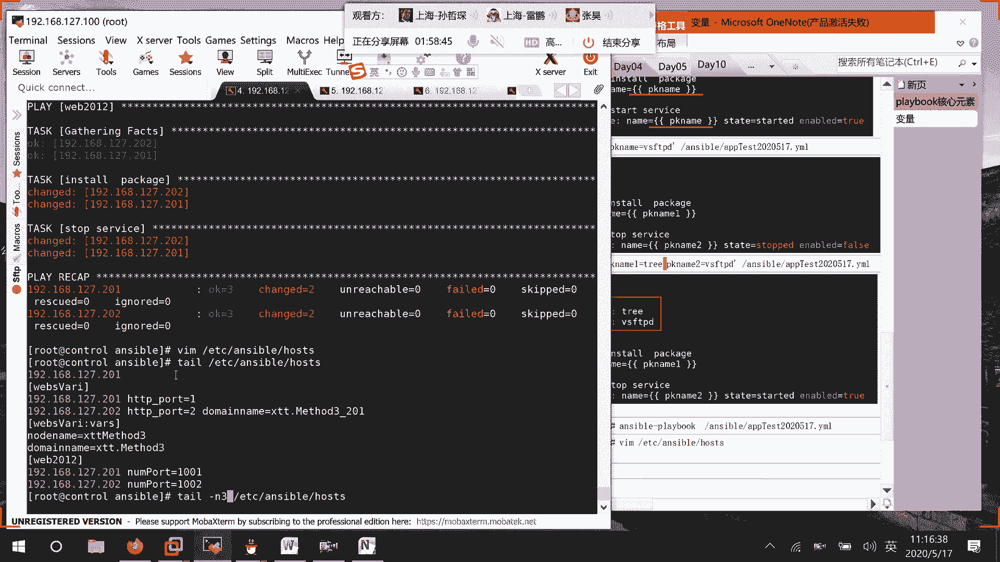

这里这里是什么意思呢。

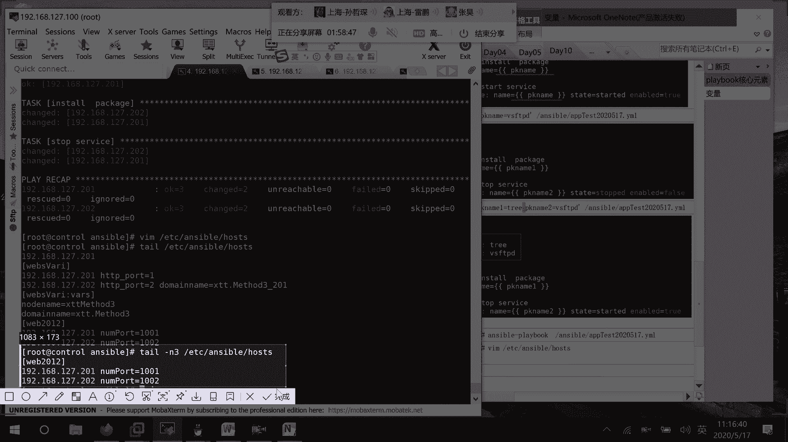

给大家解释一下，等一下。

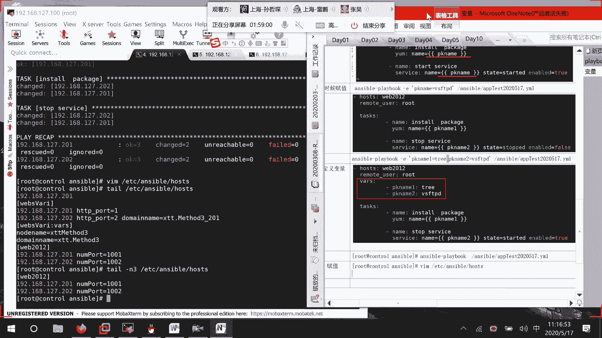

单主机，这里的意思就是说后续再使用number，pot的时候，针对201主机，该职为1001，针对202主机该值为202，这个值啊，不对，1002这个值能明白吗，就是说同一个变量针对不同主机的话呢。

我去赋不同的值嘛，那现在有个问题，就是说我能不能在这个127后面呢，再去附一个变量呢，可以的，就是说在主机后面再进行变量赋值的时候呢，你不一定说只能去复制一个变量，我这边比如说叫做随便写一个啊。

z比如说等于杭州嘛，上面这个zone的话呢，你可以再写等于上海，但是我现在就不要了就不要了。

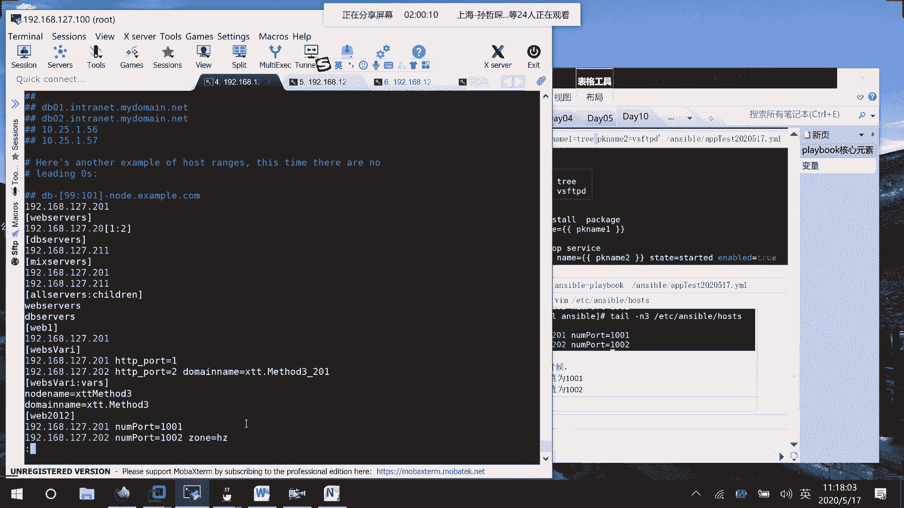

这边的话呢我们可以去设置读，就是说对多个变量去进行一个赋值，反正的话那就这样子。

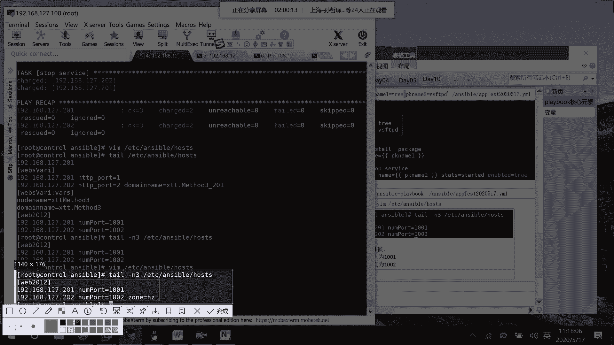

能用上的话，那就用用不上的话，那就算了嘛，好吧，那好下面这边的话呢，我们来看我们去写一个剧本，去写一个剧本vm app test，比如说我还是用这个里面这些任务的话，嗯他会浪费一点时间。

我就我不要这个吧，copy，app，unstable app test叫做enerable啊，vr cost点啊，20200517点y ml好吧，我呢去编写一下这个剧本文件，回车。

然后里面的话呢这些变量我可以都不要了吗，task的话呢，我去改一下task好吧，这边，name，比如说我就去创建一个文件可以吗，或者去修改主机名可以吗，比如说我correct fire。

那这边的话呢是不是应该跟上fire的一个模块啊，然后接下去等一下，接下去创建的文件名字叫什么，我比如说还是在tap目录下，只是说前面这里的话呢，大家全都叫3w点，后面这里我要跟上number p。

然后点test文件好吧，state等于touch吗，我们等一下的话，你去看一下201文件，是不是真的叫做3w101 ，稍等，我这边就不要点了，在这边不要点，我改一下名字啊。

就叫做fire什么10110011002。

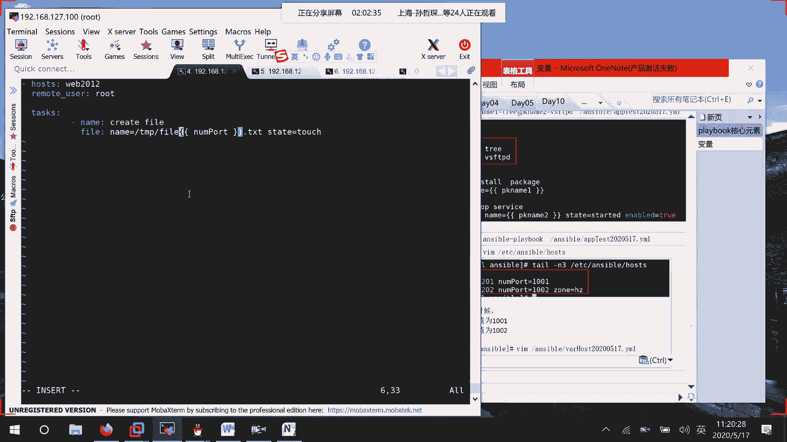

这样子的一个文件好了，3w的话呢，下一个主机灵。

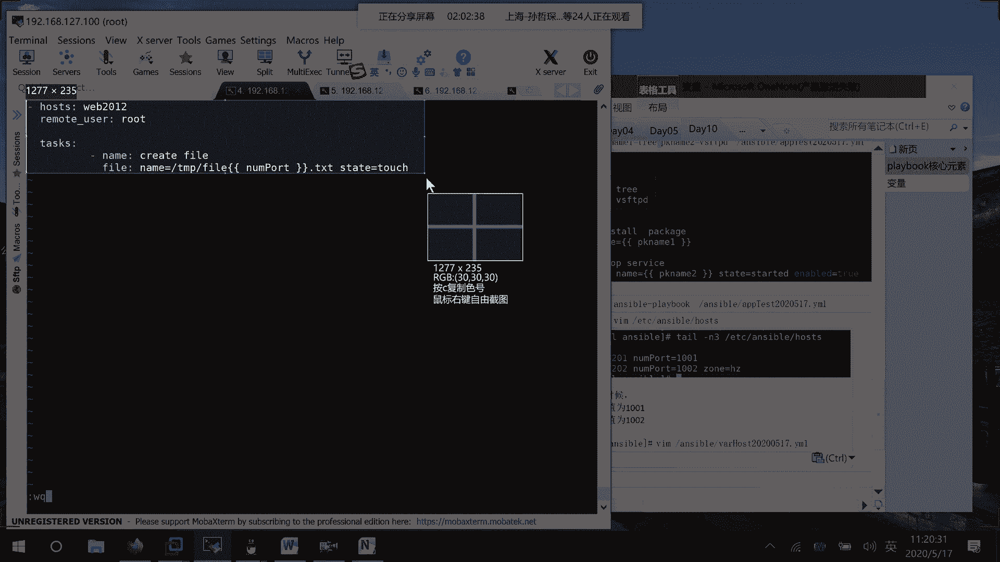

保存退出，执行一下这个剧本文件，我们先来校验一下playbook，解大c这个文件空执行一遍吗，等一下，可能没那么快，这边的话呢全都是ok那好，那我们来执行，说明我们的命令没什么问题吗。

好了之后的话呢我们来检查一下，检查的话呢为了方便点，我们还是直接在这边l s一下，好吧，你看因为这台设备的话呢，它是一个web 1，是不是就多了一个文件叫做file 1001啊，这边的话呢l s。

他的话呢是不是叫做fire 1002，也就是说我针对单台主某个变量，是针对单台主机的话呢，它有一个个性信息的话呢，大家就使用这种方式去进行一个命名，然后呢还有就是说进行一个主的一个命名呢，我们来看一下。

这边还是vm etc answerable hosters，他就这样子小组，你把它给拿过来诶，拿过来，然后接下去冒号，因为我要去设置变量，所以呢后面写个冒号vs，然后这里你直接就去写它的一个变量的名字。

我随便这边的话呢去写一个叫做，city zone区域已经有了哦，country吧，seo不要写country，随便写一个，教主我op r o吧，省份省份也不行，c o n u啊喂比如说就china吧。

好吧，就这样子去写，我应该没拼错吧，我查一下谁，哦没拼错，就写这个中国，好了好吧，然后现在这边的话呢，我把信息给你们去显示一下，tell杠n5 这个文件，诶，不是这个，是etc。

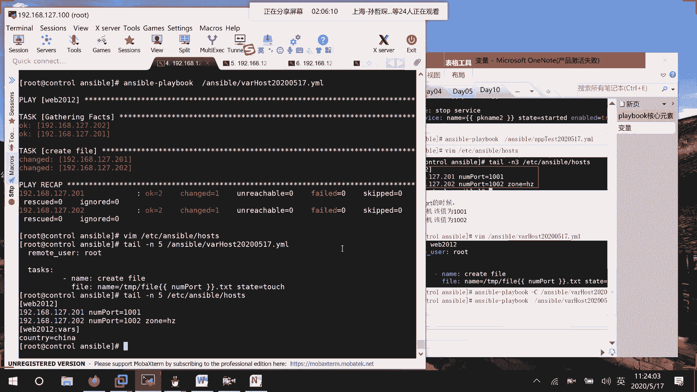

你看我去设置了这个变量，看一下是不是针对所有的都进行了一个生效。

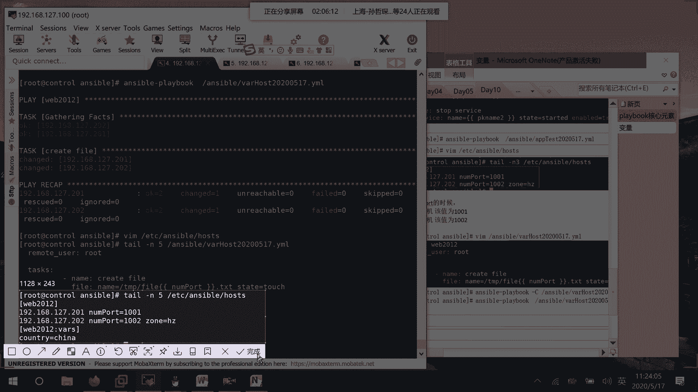

主要是下面这一块，我呢vim answerable，然后呢变量因为是针对hosters里面的吗，然后我这边的话呢去改一下，就这里就不要写number port了吗。

就写country cn co u n t r y，保存退出。

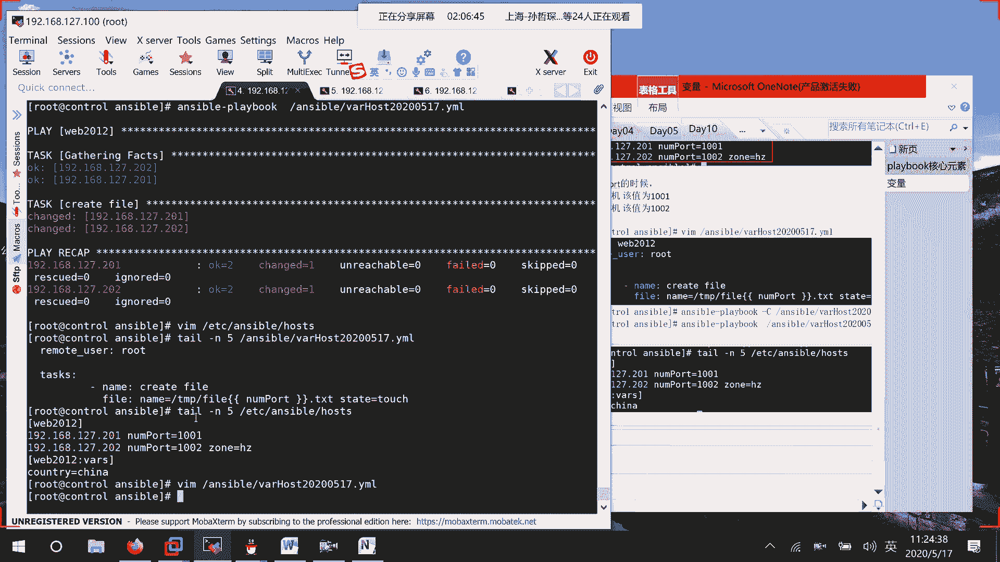

忘记截图了哈。

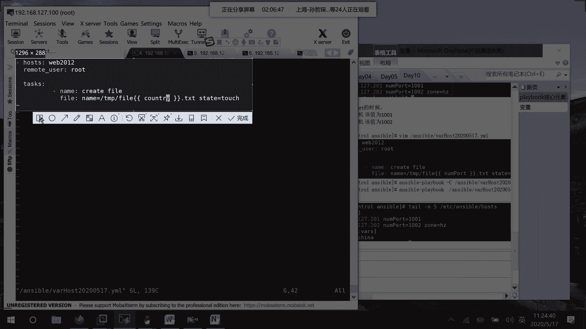

然后好，下面这边的话呢我就不进行一个空运行了，我直接去进行一个运行就好了，然后呢我们再来检查一下结果是怎么样子的，等一下，你看诶没有哦，有有有，fire china，是不是有了。

fire china是不是有了，所以的话呢这边就是说两个文件，就是说呃主的话呢，他这样子就生效了嘛，现在的话呢咱们来看一下，如果说一个变量，我们的post后面定义了，然后呢又在我们的祖宗定义了。

那这两个变量的话呢，哪个优先生效呢，你看啊，就比如说我这边来编辑etc enerable hosters，里面的话呢这边不是写了一个zoom杭州嘛，如果说有一些没有写的话，我就默认是上海好吧。

这边的话呢我等一下去创建一个文件，调用这个zoom，看一下这个202的话呢，它和它到时候生成的一个文件是以杭州结尾的，那还是以上海结尾的好吧，这边的话呢我把信息给你们去cat一下。

cat gun 6 ta。

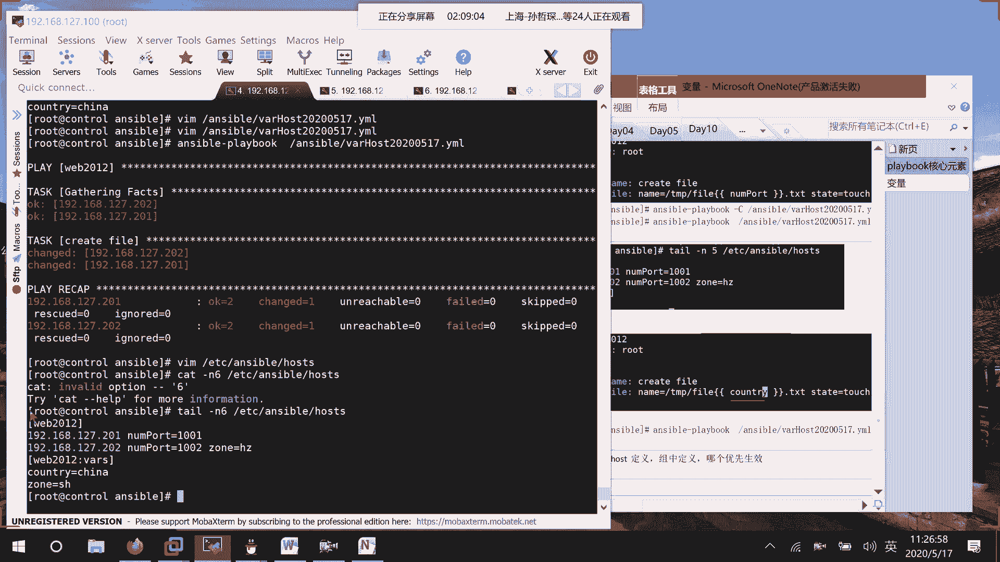

就这里的信息，现在的话呢我们要来对比这个zoom和这个信息。

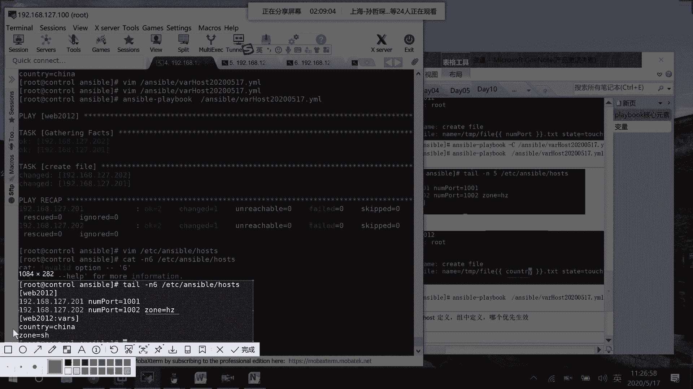

它们之间的一个区别，还是去修改那个unstable文件，unstable，we are poster里面的话呢写什么呢，现在这边就不要写country了，写重写重。

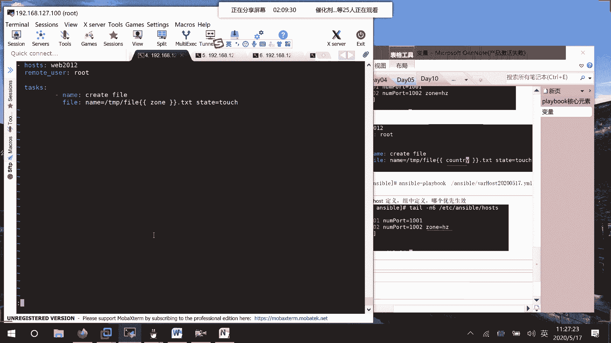

我这边的话呢给你们来解释一下。

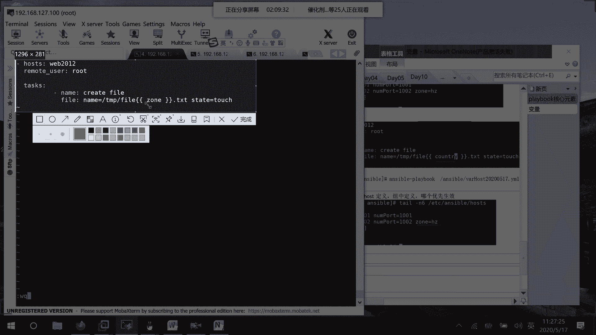

为什么要去写zone，然后这边的话呢让他先去进行一个运行，你们来看哈一个zone，他的话呢zone是主变量，正常情况是不是那个叫做201，会去生成一个叫做fire上海的一个文件。

202也会去生成一个叫做fire上海的文件，但是此时我们可以看一下，202的话呢，有对zoom赋值等于杭州，我们的话呢想要去看一下，他这个202呢生成的文件是生城，叫做fire上海呢，还是by杭州。

如果说是fire上海，说明什么呀，组变量的优先级，比我们单主机的优先级高吧，如果说，fire杭州说明什么呀，单主机的，比主变量的优先级高吧，就这两种吗，如果是杭州说明这个优先，如果上海说明这个优先吗。

我们来看一下l s a l s temp，你看第一台生成的是一个上海，毫无疑问，因为人家后面呢没有zone这个变量，第二台，它生成的是不是一个叫做杭州啊，这个是不是就说明了。

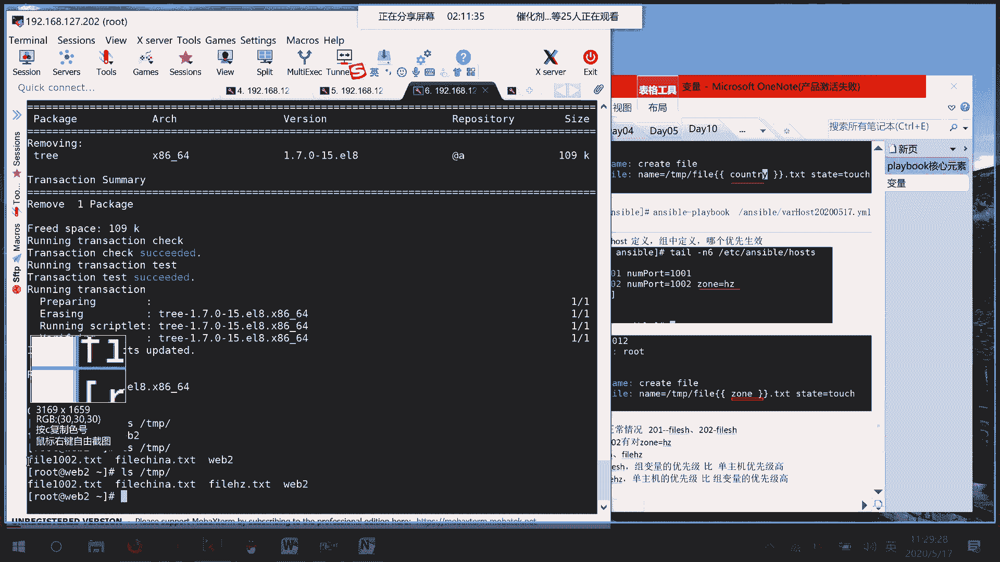

我们单主机的变量比组的变量优先级更高，这里呢我们讲了第一个对比啊，单主机的变量比我们组变量的优先级的话呢，会更高一点，会更高一点好吧，那行这里的话呢我们讲了第三种，就是说。

这里的话呢是在playbook当中，这边的话呢是在host当中，第一个脚本，第二个playbook，第三个host，host呢讲了两种，接下去我们来讲专门的文件，存放变量。

然后到时候的话呢去进行一个调用好吧，那好这边的话呢我们来去创建，创建一个单独的一个文件夹哈，就比如说在这边我们直接就是，cd unstable里面文件诶，文件很多呢，我们不管他。

我这边就v i m unstable vs，比如说20200517这个文件，这个文件专门用来存放我们变量的信息，创建变量文件，然后里面的话呢我们就说怎么样去写呢，这个文件它的话呢专门是用来存放变量的。

他就和前面的剧本文件是不一样的，它对格式没有严格要求，你就不需要写那么多东西，因为我只对变量去进行一个赋值吗，变量赋值的一个格式是怎么样的，我这边来注释一下，就这样子叫做vr s冒号回车。

这边你接下去的话呢去写变量的名字，比如说vr一第一个变量它的值是多少呢，比如说我就写test一横线，vr 2冒号，它的变量是什么呢，比如说就是test 2，这样就定义好了，没有其他的东西，就这样子。

然后接下去的话呢你这个变量是定义好了，我剧本文件当中的话呢，怎么样去对你去进行一个使用呢，比如说vm unstable叫做vr s，我想一下，vim unstable，就是这个吧，vr posters。

我还是对这个文件去进行一个修改吧，好吧。

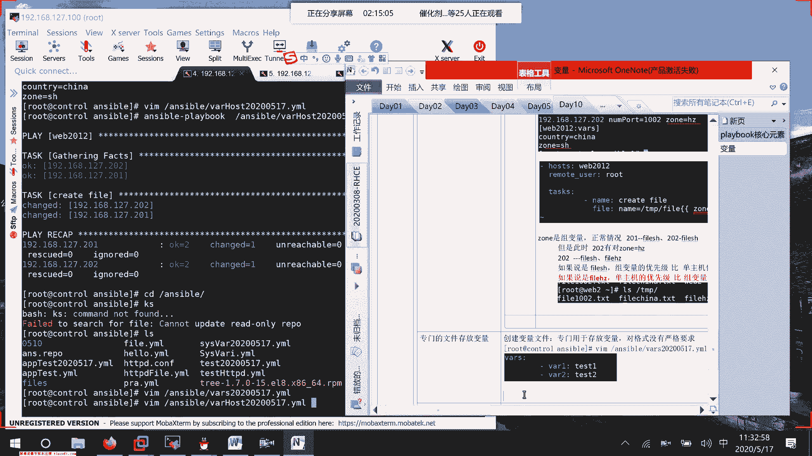

回车这里面的话呢，首先你要去说一下，我想要去包含一个和变量相关的文件吗，这个文件在哪里呢，就横线，因为其实我我是不是我我这个变量文件的话呢，和这个剧本是不是在同级目录下，请你直接去写他的一个名字就行了。

我这边的话呢，比如说去写他的一个完整路径，l s unstable，它有一个叫做virus 20200517嘛，就这个文件，你看啊那嗯等一下啊，那我就在这边的话呢去写下去就行了吗，具体的一个文件。

接下来的话呢这边比如说要去调用，那好我比如说就调用第一个变量，那是不是就到时候创建的文件就fire test一点text，我们来试诶，我给你们去截个图哈。

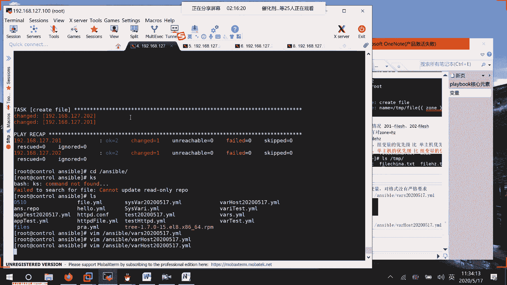

这边包含进来。

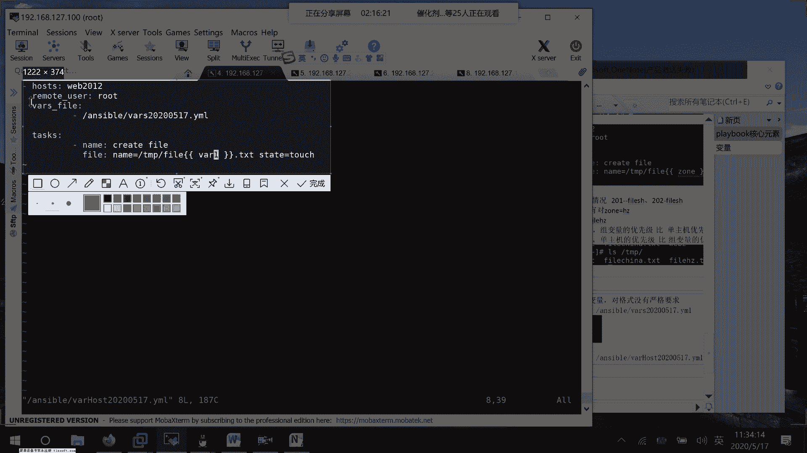

这边去使用我们变量的一个名字。

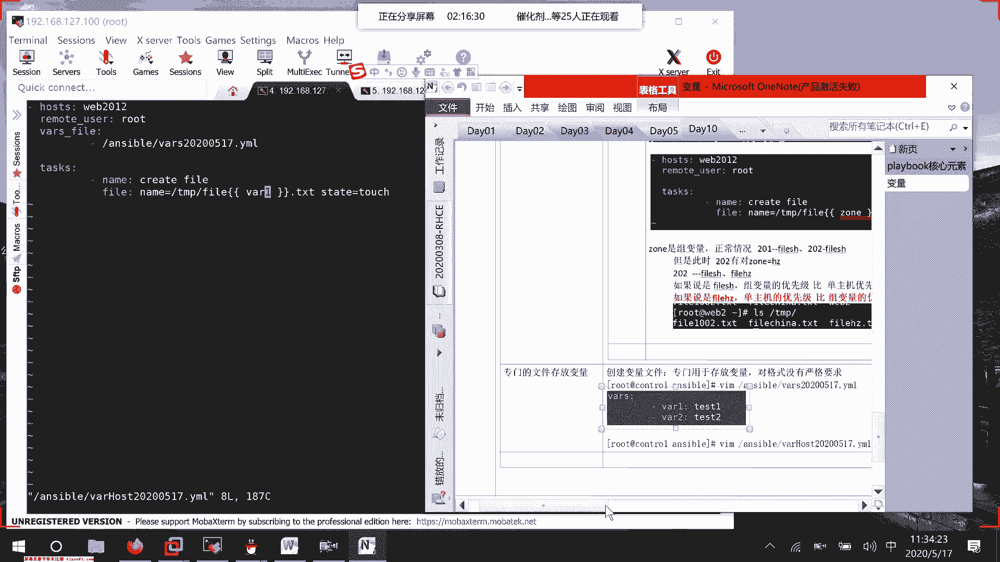

然后接下去我们要做的事情就说，来运行一下这个answer able，诶我看一下，not for play unstable worth fire，冒号哦，哦哦我知道了少了一个s。

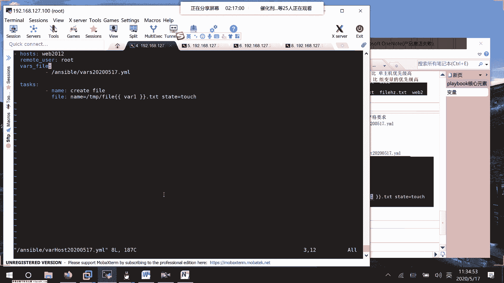

因为它可能会有多个变量的文件，我这边的话呢刚才少了个s。

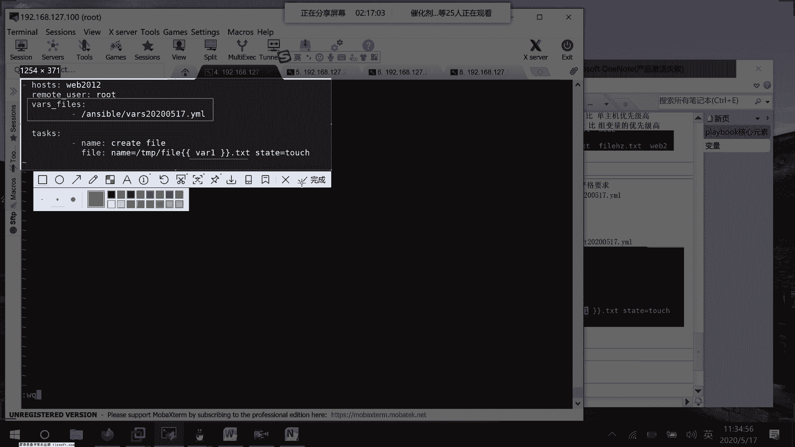

线应该就不会报错了，然后运行完毕了之后呢，我们去temple目录下看一下，是不是真的把fire test一文件呢给创建起来了，如果说到时候呢换成那个叫做服务启动啊，这些命令大家一定要知道诶，还是有问题。

我看一下。

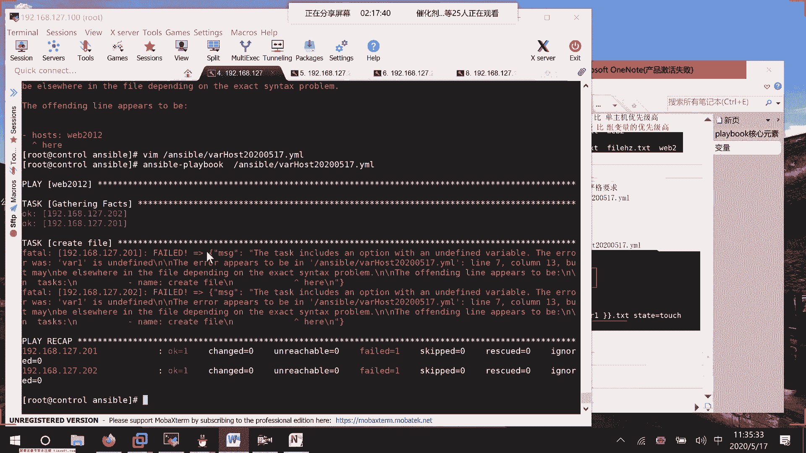

的诶，我的变量名字叫什么v a r e啊，没错啊，vr一没错啊，y m l on the bo，我看一下name，correct here。

the task option with variable is undefined，诶是我写错了吗，等一下我，来cat一下，叫做answerable，然后呢叫做vr host，这边的话呢叫做vr。

一没有问题啊，cat这个变量文件，verse，然后后面呢就是vr，vr 2，把这个给去了，把这个给去了，我看一下，现在vs都不用，这个也不用，就这样子吧，这么简单简单到不敢相信。

就这个叫做定义变量的一个文件的话呢，去稍微修改一下就可以了，然后这边保存退出，然后呢我们来运行一下嘛。

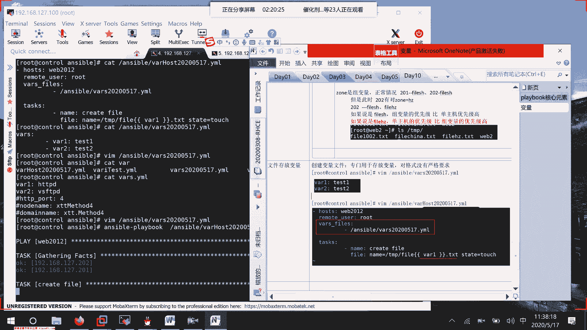

这边好了之后的话呢，你们来看一下l s temp，你看是不是真的有一个文件叫做test 1，这边第二台设备ls s temp。

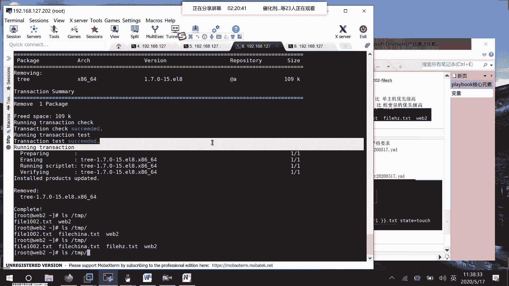

是不是有个文件叫做test啊，这样子的话呢，那你看啊，如果说我去定义了一个专门的而变量文件，到时候的话呢，其他的剧本要使用是不是都去这边调用就行了，如果要改的话呢，所有的变量统一去进行一个修改吗。

rose就是这样子，我们到时候呢专门的去定义一个叫做文件，去管理我们的变量，专门的去定义一些动作，直接去进行一个调用。

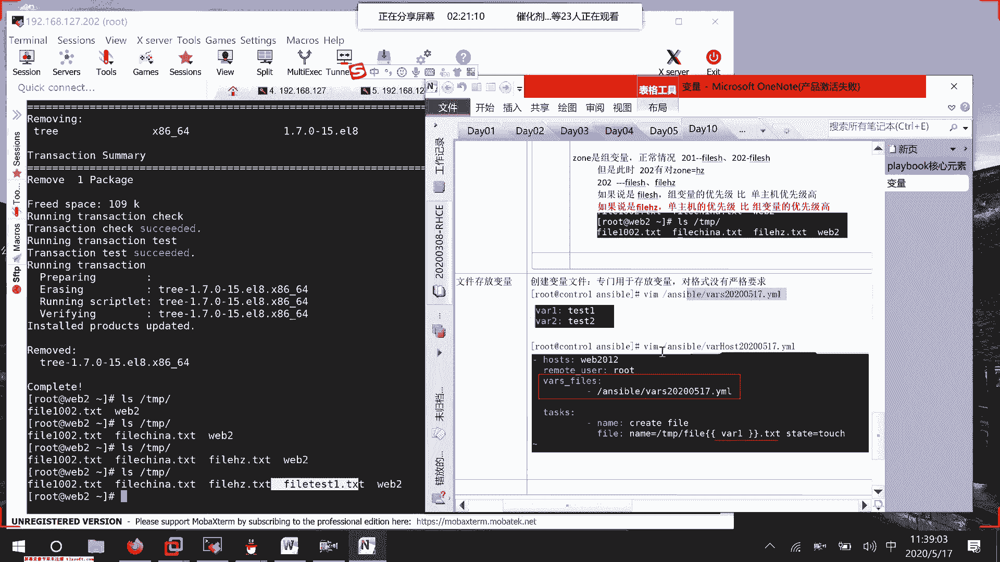

知道吧，那行这边的话呢，它这里几种定义方式，大家先去自己去试一下好不好，这里play book当中定义你们刚才看过了，就说单台主机当中去定义呢，自己去试一下好吧，还有20分钟时间。

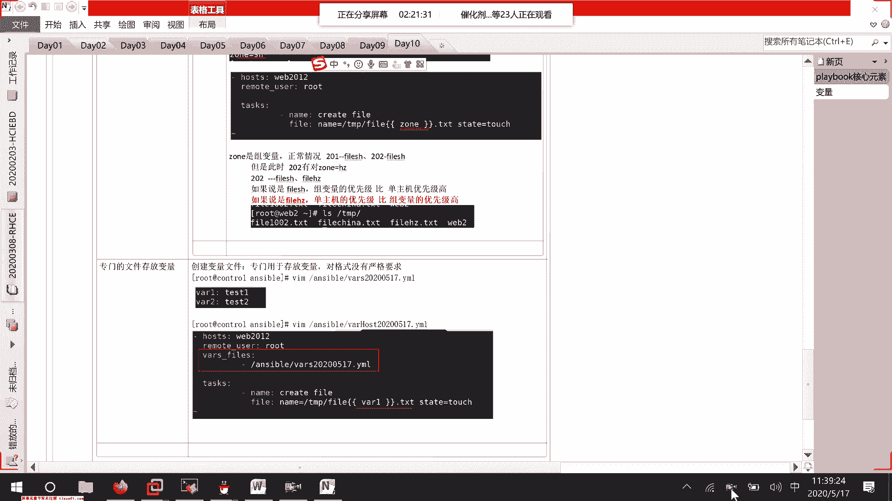