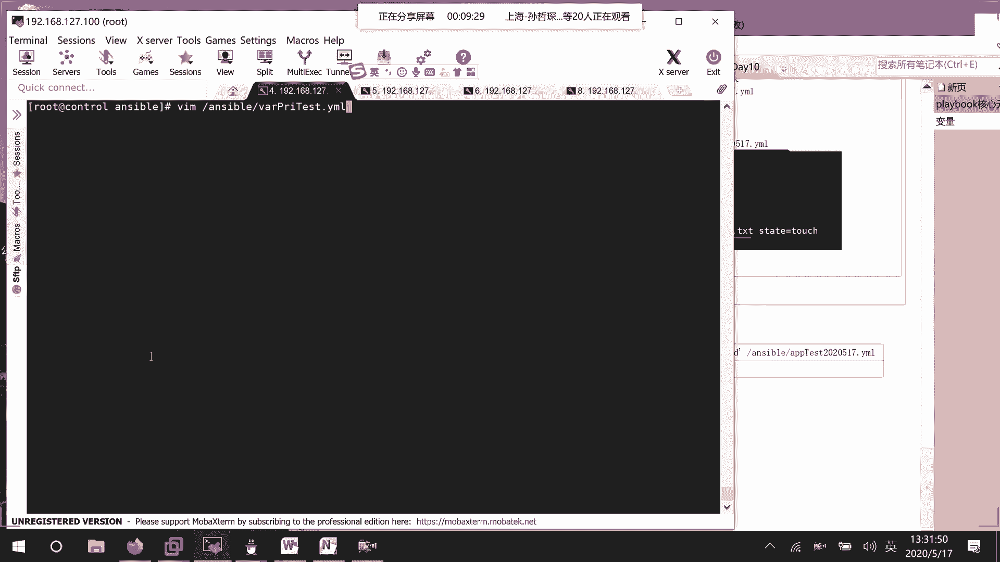
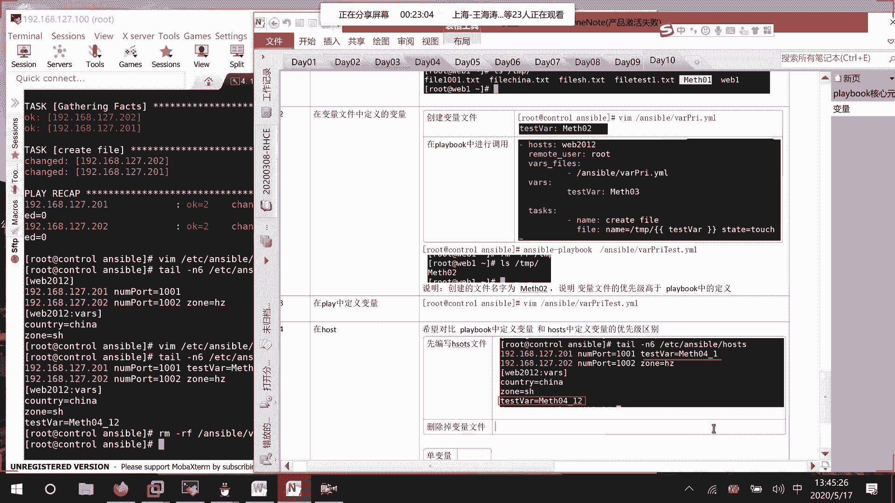
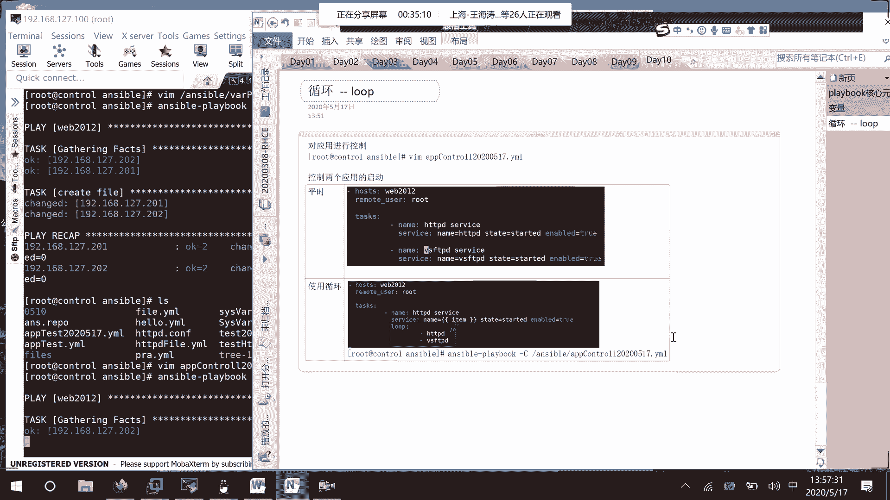
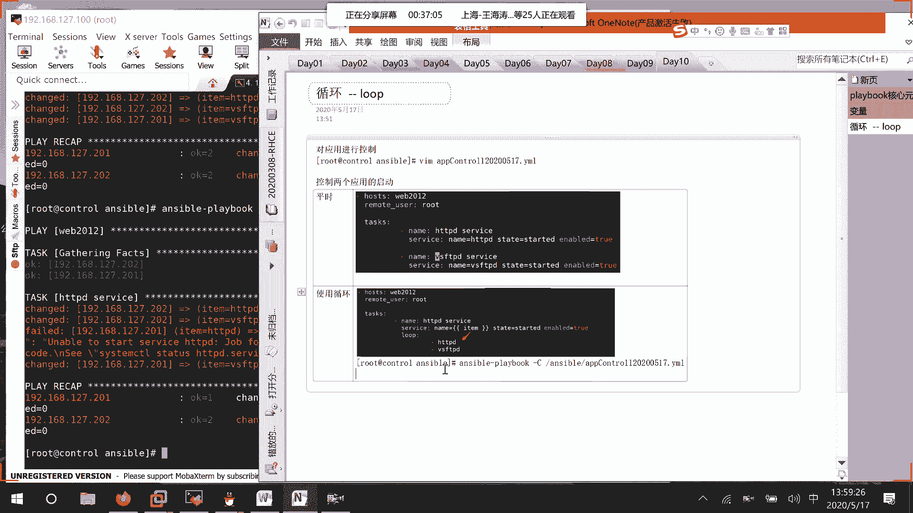
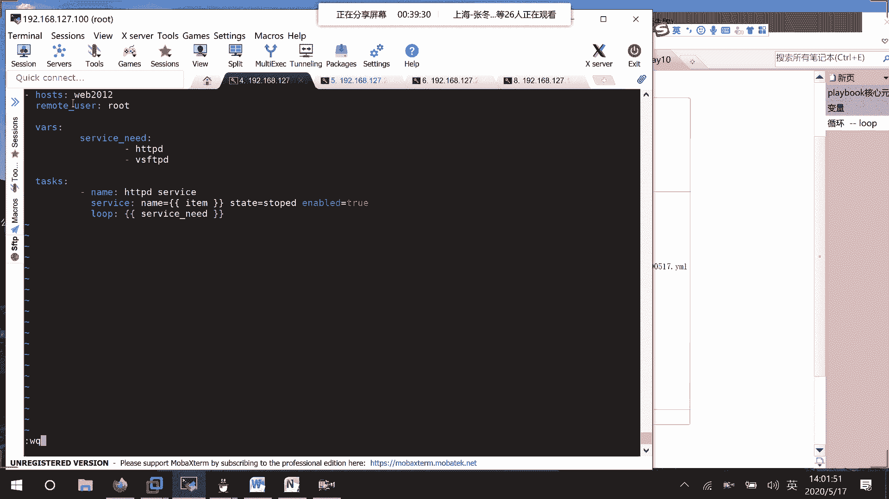
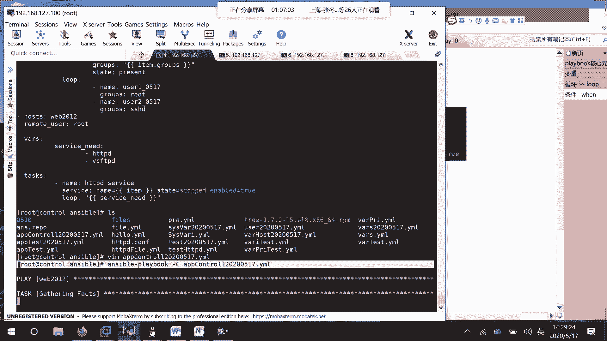
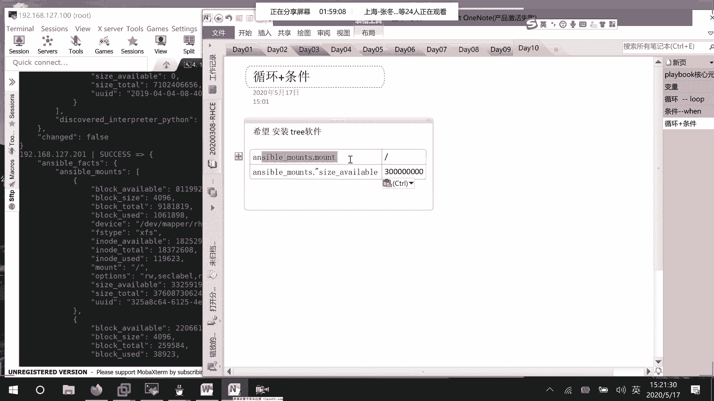

# RHCE8.0视频教程【45课时】 - P43：20200517-RHCE-04_recv - 六竹书生6682 - BV1su4y1Z7sJ

好这边的话呢咱们继续来上课，在上午的时候的话呢，我们就说去讲了这几种赋值模式。

大家的话呢应该都已经看到了哈，下午这边的话呢，我们首先要来去讲一下这几种赋值模式，它的一个优先级是怎么样子的，也就是说我在进行赋值的时候呢，谁是最优先的，我们刚才其实可以看到第一种模式。

就是说最优先的是谁啊，是不是就是说通过命令行的方式进行赋值啊，因为我们的话呢，比如说在其他的一些文件当中去设置了参数，如果说你通过命令行的方式，应该能听到我声音哈。

如果说你通过命令行的方式去进行赋值的话呢，它的优先级是最高的。

这你们要知道一下，因为我们作为管理员嘛去进行赋值对吧，然后接下去第二种方式是哪一种呢，第二种方式我们就说在playbook当中，它定义的变量是第二高的，p l a y定义变量，它的话呢是第二高的好吧。

这边我们来试一下好吧，我这里的话呢比如说vm unstable value叫做priority，它的一个test的压缩文件。

随便去写一个给你们测试一下。

你们看到效果吗，回车第一个的话呢还是说posters，他的话呢web 2012，然后接下去remote user，冒号r o t，这边的话呢task我们写的简单一点。

比如说就是correct fire好吧，然后这个file模块就去定义它的一个名字吗，这个名字的话呢，我们就写最简单的叫做我想一下test value，就这样子吧，然后呢它的一个state等于touch。

我们这边的话呢，还是在远端的一个temp目录下面，去进行一个创建好吧，就这么一个脚本，然后这边我们的话呢不是有四种方式吗，这里的话呢第一种方式我们等一下去赋值，这边的话呢不是第二种方式吗，我们去改。

这边比如说去写一个vr s叫做test vr，让他的话呢等于什么呢，因为这是第二种方法吗，比如说method的零二，这种方法可以。

在这里面去进行一个定义。

好，这边的话呢我们就来对比一下，是不是真的是命令行的方式比较优先呢，我们这样子来执行吗，叫做answerable playbook，简易设置参数，设置参数的名字是哪个呢。

是不是这个test value啊，比如说让他等于method m e t h01 ，我看一下啊，对就这样子零一，然后的话呢来执行我们的answerable value priority。

它的一个test好吧。

我把这个呢去换一下哈，你看执行这个，看一下它的一个结果是怎么样子的，我们因为后面有同学进来，我现在要做的一个事情，就是说去测试这几种赋值方式。

它的一个优先级是怎么样子的，你们来看我就看一台主机式就可以了。

这里创建出来的，是不是一个叫做method的零一啊。

是不是就可以说明我们的一个叫做哦，命令行的方式比我们playbook的方式更加优先啊，然后接下去的话呢，我们再对比他，第三种优先的方式是什么样子的呢，这里在这里呢我们再插入一个上面，第三种这个的哦。

这里的话呢第二种他这个是第三种是什么呢，叫做在变量文件中定义的变量优先级，高于我们的一个playbook，我们可以来试一下吗，我把这个方法的话呢。

改成就改成method的零三，等一下，aerable，弄错设备了，vim enerable，这里的话呢，比如说叫做value priority test，我把它改成零三。

然后接下去的话呢，我去创建一个变量的一个文件嘛，到时候的话呢在我们的aa文件当中去调用，是不是就可以了，所以这边的话呢在进行第二个测试的时候，我们要这样子去做第一个创建变量文件。

然后呢第二步在playbook中，进行调用好吧，我们来测一下，比如说vim enerable，这里呢various priority就叫做雅马文件，就这样子写一个简单一点的好了，如果大家有问题的话。

及时跟我说一下。

因为我看不到你们的状态，有时候说话的话可能就会比较快嘛，好吧好，下面这边的话呢，那我们就去定义变量的一个名字，它是不是叫做诶，它是不是叫做test vr对吧。

然后冒号给他一个变量，比如说叫做method的零二嘛，esc冒号wq就这个就够了。

因为咱们就一个变量，那好这个变量定义完了之后呢。

是不是要在剧本当中，把这个变量文件给包含进来啊，是不是在这里哦，不对，不是在这，比如说我写在它上面，这里早上写过vs fires，冒号回车横线哪一个文件去把它包含进来，是不是就可以了。

l s unstable value priority，y ml文件是不是就这个把它包含进来，那好这里包含进来了之后呢，我们是不是就可以去进行一个测试了。

好下面这边的话呢我们来测试。

测试的命令的话呢就和上面是一模一样的，只是说这个时候的话呢，我们就不再去指定它，这个叫做变量的一个名字了，就直接来运行这个脚本吗，我的话呢，把这里面的文件先给大家去清空一下哈，方便我们去观察结果。

线里面线里面的话呢都没有东西哈，你看我来运行一下脚本，他就这样子去运行，然后我们来看一下，到时候的话呢，在我们主机当中创建的那个文件，名字是叫零二呢，还是叫零三，如果是零二的话。

是不是就说明我们这个叫做变量文件，它会高于我们playbook当中的一个钱，就说优先级啊，你看这里的话呢，创生成的一个文件是method的零二啊。

对不对，所以呢这里大家来看一下，注意，因为这个优先级它它的变量的优先级呢，你们一定要知道，不然的话到时候在不同的文件当中你都写了，那到底是调用谁呢，如果一开始都没有搞清楚的话对吧，创建的文件名字。

method 02，说明我们的那个叫做呃变量文件的优先级，高于playbook中的定义，知道了吧，那好接下去的话呢也就是说是一个playbook，我们的话呢是不是还有一种方式。

第四种方式就是说在host当中去进行一个定义呀，然后host这一块的话呢，它有两种情况，我们早上的话呢也讲过一种情况的话呢，是单变量，还有一种的话呢是不是主变量啊，这这两个的话呢它也有一个优先级，好吧。

我的话呢在这里进行一个写操作，首先的话呢我们在host文件当中也去写一下vim etc。

我写错设备了哈，vim etc enerable hosters，针对于这边哦，我们早上好像已经演示过了，已经写了的话呢，我直接就把变量给拿出来了哈，cut不要tir杠n6 。

你看这里啊，我在这边的话呢就定义了。

再来写一次吧，就这里比如说我在这边的话呢定一个test v a r，它的话呢是第四种方式对吧，我比如说写一个零四下划线，一表示我们的一个单变量，然后这里的话呢再来定一个主变量。

test v a r等于比如说method的零四下划线，一二表示是一个主变量好吧。

然后这边的话呢它已经有，就说也已经有了这个变量了，接下来我们要做的一个事情是什么呢，就比如说去运行一下这个，answerable的一个文件吗，看他的话呢，等一下创建的文件名字叫做我，我现在这样子的话呢。

就是说现在我想要去测试第三种和第四种嘛，对吧，这边的话呢就是说第一步创建，第一步是什么呢，等一下，因为他这边对比的比较多，然后就说我现在的话呢，目的我给你们去写一下。

希望对比playbook中定义变量和posters中，定义变量的区别，就是说的优先级区别，我们呢要做的一些操作有什么，就说第一步我们先编写hosters文件，去定义一个叫做主变量。

然后的话呢再去定一个叫做单个变量，把它给定义上去，知道吧，然后接下去的话呢我们要做的是，如果说你直接去做的话，这边是不是一直存在一个叫做，叫做变量的一个文件。

会导致每一次创建的文件呢都叫my method的，零二嘛，不太方便，所以这边的话呢我们删除掉变量文件，就说删除掉我们的一个变量文件吗。

那这里的话呢咱们来删一下rm rf叫做answerable，下面v a r它有一个priority的一个压码文件吗。

把它给删了，排除掉，第二个的一个影响好吧。

接下去的话呢我们为了好观察结果，老样子把这些主机里面的一个文件的话呢，都去把它给清空掉好吧。

清空客户端的文件，rm，rf temp下面的信号。

接下来的话呢，我们就可以去运行我们的压码文件了吗。

playbook了吗，执行，这边的话呢我们等一下去看一下执行结果，看它稍等一下。

fire那是放的，哦我知道了，因为就是说我把那个文件给删除掉了嘛。

所以的话呢他什么东西都没有，我这边这样子吧，不要去删除掉文件，就是说清空文件里面的变量，因为把它删除掉的话呢，我们要要去改那个压码文件比较麻烦哈。

v i m unstable，我把这文件创建起来，就这样就好了，先删除掉，然后这边的话呢再去touch一个空文件。

是不是就可以了。

然后接下去的话呢咱们再去执行嘛，应该就不会报错了，在运行，他这边的话呢去获取一下环境变量，等一下你看创建成功了，这个时候的话呢。

在我们的node节点上面生成的一个文件是什么呀，method 3。

method 3，然后这个的话呢说明什么东西啊，说明play book中定义的变量优先级，高于hosters中定义的，变量吧好吧。

然后接下去的话呢，就是我们组单个变量和主变量的一个定义嘛。

这个的话呢其实早上已经说过了，我这里呢还是给大家去演示一下哈，我们现在的话呢要做的一个操作很简单，把playbook中定义的变量删除掉，把它给删除掉就可以了，然后然后这边的话呢就去对比。

我们的产生的文件叫做method的041呢，还是method的0412嘛。

对不对，vim evil vm unstable，错了设备错了，v i m unstable，然后呢value priority它的一个test，等一下。

进来了之后就把这一行这一行给注释掉嘛，就不要了，回车，然后现在下面的话呢为了好观察结果，还是把里面的内容给清空掉，这个时候我们再来运行一下自己的剧本文件。

等一下很快我们的话呢，先来第一台上面去看一下。

它产生的是不是一个叫做temp 041样。

对吧，这个时候的话呢是不是就说明因为我这台二，因为这台web一的话呢，就是这个201，它的变量是method的041，这就说明我使用优先是使用了这个变量，而不是优先使用这个变量，这个时候的话呢。

就说明单变量它的优先级高于组变量，知道大家对于这个变量的顺序的话呢，要有一个清晰的认识命令，然后呢变量文件中，playbook中，然后接下去host中，host中的话呢。

又分为单变量高于我们的一个主变量，这两种形式，明白吗，好吧，那行现在这边的话呢应该能听懂吗，能听懂的话，在群里给我回复个一哈，我今天还没有问过你们，那如果没什么问题的话呢，接下去我再讲一个东西。

刚好这边的话呢我们讲完了变量。

你看有时候的话呢就是说嗯我来这边，vim app，比如说叫做control，叫做20200517点y ml文件，这个文件的话呢。

比如说主要是想要对我们的应用啊，去进行一个控制的，比如说控制我们应用的一个启动嘛，如果说在这个文件当中的话呢。

我想要去控制两个应用的一个启动。

这边控制两个应用的启动，我们平时的话呢怎么样去写呢。

正常情况下都是这样子的，i posters，后面这边的话呢，web 2012 remote r e m o t e user，后面写上r o t吗，然后接下去的话呢我们写tasks name。

比如说这边是去管理我们的http http d，service，然后这里的话呢就service，h t t p d，然后呢state我们给它叫做started s t a r t e d。

如果说想要去管理状态的话呢，就在这边再去跟一下嘛，如果说有第二个应用的话呢，我们就这样子vs f t p d，service service name vs ftpd，然后呢stay我直接复制粘贴。

就这样子去做，但你看如果说我现在的话呢，还有第三个应用的话呢，是不是都要重复性的去洗啊，可以发现不同的地方的话呢，其实就一个服务名这块不一样，那我们的话呢之前也去学习过一个一些脚本嘛。

都知道是不是有一个叫做循环的一个东西啊。

那在我们这个压码文件当中呢，能不能去编写一些循环呢，可以的，这里的话来说，第一个循环就是一个loop。

我们来看一下这个怎么样去做，我为了实验的话呢，不要经常报错，我这两边的话呢把软件全都安装起来，h t t p d，还有vs f t体力杠y两边应用都把它给装起来，先，嗯嗯好像都已经装了哈。

那好这边的话呢怎么样去改呢。

使用循环。

那就这样子可以把这个呢就给删掉了，因为我们不一样的地方的话呢，就nce这块嘛，这里就用一个变量来进行一个代替，就好像我们平时的话呢在写一个循环的时候，就是i in哪里哪里，对不对，在这里的话呢。

我们如果是要拿后面的条件，这边有一个专就是说专用的一个变量叫做item，就是说条目嘛，他到时候的话呢，就会从我们循环当中，一个一个的去进行一个提取，我们来看变量叫做i t e m。

然后的话呢这个item要从哪里去拿呢，我们来看在下面来进行一个定义，loop l o o p冒号有哪一些呢，比如说第一个http d，第二个vs ftp地，这个的话呢就是我们一个一个item的内容。

有些人如果了解item的话呢，我等一下还会去说，现在的话呢就一个最简单的调用形式，好吧，我这边的话呢先把这些服务给关掉啊，system control stop http t vs ftpd。

这边system control stop httpd vs f t p b，system control is active没有启动，随便检查一个，没有请诶哦对诶，这个已经安装了呀，没有关系啊。

反正的话呢他们就是都没有启动的一个状态，我现在的话呢使用了循环之后。

大家来看一下，就这样子loop循环，然后呢其中的话呢这个item就是从这里面的话呢。

不断的会自己去进行一个取值的。

然后现在的话呢这个编写好了，那我们就去执行一下这个playbook，unstable，playbook，杠大c enable app，control这个看一下有没有报错。

先。

等一下哈，先看一下他有没有报错，好没有报错，那这边的话呢，说明我可能语法格式是没有问题的，来运行一下，等一下要一点时间，你看这边item先取了http，再取了vs f t p。

我估计201上面就是这个是不是亚姆list http，应该是没装吧，哎已经装了呀，list vsf tpb，亚姆list ht，诶怎么跟那个杠y，我先把它给remove掉，估计是缺少了什么文件。

要么remove，http d，港湾你们来看一下，反正这边的话呢这个201http出错了，我先不管他。

你们可以发现在运行这个任务的时候呢，他这个item是不是真的依次去进行一个获取了。

对。

所以的话呢就说明我们这个的话呢它是生效的，我的话呢来这边来看一下vs ftp是不是启动了。

http是不是也是启动了，说明的话呢我们这个循环取变量还是可以的。

不断的去执行那块代码吗，然后的话呢这个有个地方不好的是什么呢，像这种形式，那我岂不是以后的话呢，每一个服务都要在这里列出来吗，不太灵活，我能不能就是说可能这台设备的话呢，是和提供一些服务有关系的吗。

我能不能去定一个变量，变量名字的话呢，就是说一组服务包含了这些服务，到时候的话呢他再从我这个服务里面去调用呢，我这边的话呢使用循环，就是说优化循环变量啧，来看一下我该描述的话呢可能不好听懂。

你们看一下就知道了，就这里哈，比如说我呢要来定一个变量vr s，像我们早上去写的嘛，定个谁呢，叫做service呃，逆的吧，需要的一些服务，然后这里面的话呢有哪一些服务呢。

像我们刚才说的h t t p d啊，vs f t p d啊，对不对，变量变量名这个变量里面的话呢有多个值吗，我是不是可以这样子去写，然后接下去在我们这个循环里面的话呢，如何去进行一个调用呢。

那好这时候这个循环的话呢就这样子就可以了，里面写上这个变量的名字，他的话呢自动的就说，你到时候去拿这个变量的名字，其实拿到的就是http d啊，还有一个叫做vs f t p d嘛。

它自动的会去进行一个拿的，我现在比如说把它给stop掉，好吧。

去进行一个优化，优化的地方是什么呢，就这里这样子，到时候的话呢，比如说像我对服务进行控制。

我直接去改一些变量的文件就可以了吗，其实我为什么要这样子去写呢，我可以在这上面去进行提取，后续的话呢是不是也可以去编写一个文件，专门的去存储我们的一个变量啊，就为我们后后续写那个弱角色的话呢。

架构去进行一个准备好吧，那行，现在的话呢，我们来看一下我写的有没有语法错误，有我先把它给装起来先啊，ym in store，这边的话呢他说错误的地方是什么，service name等于什么。

就这里的话呢出现了一个问题，这边的话呢我们在写这个剧本文，就是说这个的时候，我看一下，在写这个loop的时候呢，我们去加一个，我刚才是不是没有空格啊，诶哦有空格，这边的话呢大家去加一个双引号。

就是说如果不加双引号的话呢，他就没有办法去解析里面的一个值，可以来试一下哈。

诶我去截个图先，他的话呢不加双引号的话呢，其实就已经报错了。

就说有时候变量你在引用的时候呢。

可以不加双引号，但有时候的话是要加双引号的，验证一下，然后再来检查一下，空运行一下，等一下哈，稍等你看，现在的话呢就去获取我们的一个环境变量，然后呢，现在的话呢去做我们这个任务的一个管理。

然后这里的话呢http item http first，我看一下http d change举的first，value of the date must be one of reload，哎我写错了吗。

哦我这边少了一个p，少写了一个p好吧，难怪他报错了。

然后的话呢我等一下就不再去执行空运行了，基本上的话呢就我那边少了一个p的一个问题。

你们这边的话呢一定要注意，这里的话呢有一个双引号在就可以了。

这里保存退出，然后呢我直接来进行一个运行，等一下哈，稍等，你看这边的话呢，201http v s f t p对不对，我们来看ym哦不对，system control is active。

这个好像一直有问题啊，vs f t p d是不是inactive了，is active是不是inactive了，是不是inactive了，都被我进行一个关闭了嘛，对不对，然后好。

这种的话呢是一个比较简单的去进行，一个叫做变量，这个变量的话呢是这样子的，就是说呃单一的一个取值嘛，这种的话呢是一个叫做简单的item，就很简单的去指定值，但有时候的话呢，我们其实是希望一个叫做成对。

去进行一个出现的，一对一对的形式去进行一个出现嘛，或者就是说某一个itunes下面它关联了很多变量，items item高级，就比如说我们有时候的话呢去创建用户。

比如说user一希望他能加入到root组，或者的话呢，还有就是说希望他创建一个家目录，是什么样子的，那你们来看这边是不是就需要有一个一匹配啊，user一加入到root组，创建用户。

我这边去跟一个名字叫做0517，免得有重复哈，root的话呢没有关系，然后这边再来创建user，20517加入到我看一下，我随便去找一个小组cut etc password。

比如说就这个s s h d组吧，好吧，就这样子，也就是说那也就是说判断到是user一的话呢，root user 2的话呢是一个s h4 h d嘛，这种高级的一个写法是怎么样呢，不再是单个变量。

这个的话呢就是一个单个变量嘛，这个的话呢是不是一个itunes下面关联多个变量，这种的话呢其实我们称之为一个叫做字典啊，或者的话呢叫做散列啊，一个形式它都是支持的，都支持的，咱们来看一下哈。

v i m哦，写错地方了，vim user，啊啊啊，20200517点y ml，然后里面也是一样的，hosters叫做lab，2012remote user root，下面这边的话呢tasks。

比如说我们的话呢想要去correct user好吧，然后接下来的话呢，那我们就要去写使用的模块是什么啊，是不是user这个模块，我现在的话呢用另一种格式去写啊，他的话呢那用户的名字是什么呢，我等一下。

是不是希望从一个叫做loop当中去取啊，我先把位置留下来，然后的话呢我是不是想要去指定它，属于特定的组啊，等一下的话呢也想要去循环当中去取，我就先空着，接下去我们是不是要说一下，我们现在是想干嘛呢。

是想要把这个用户给删掉呢，还是说把它给创建起来呢，是不是创建起来present，那接下去要做的事情，就是说我们这个循环该怎么写，loop冒号，以前的话呢是不是直接横线写上值就可以了。

但是呢我们线的话呢有两个有两个，那你的话呢就是说要去写，就这样子的一个格式啊，你们应该字典啊，格式应该有学过吧，item item下面的话呢有一个name变量，比如说到时候去赋值user 10517。

然后呢比如说它不是有一个叫做小组吗，我随便写个名字，比如说是root，接下去我还有一个变量name，它的话呢叫做user，20517，他的一个group，或者我直接写在后面也可以，group的话呢。

s hd嘛，这种的话呢是什么意思呢，我们来看一下，如果说我到时候的话呢，反正去loop你们里面拿东西，是不是去拿item的一个东西啊，item我第一次拿name，他是把它给拿过来。

第一次拿group是把它给拿过来，那好他们两个是不是就形成一组了，然后接下去第一次拿完了之后，我第二次拿嘛，他是不是循环循环到下一个item，the name是不是就他下一个item group。

是不是就是它就这样子去进行一个获取，能明白吗，就item里面的话呢再设置两个变量，默认情况下这个item的话呢就是一个单变量，如果说你还想要去设置，两个或者三个都是可以的。

如果说像这个name下面的话呢，你还想要有变量也是可以的，就比如说那到时候定位的话就是item name下面的，比如说first name啊，或者last name嘛，这就嵌套了，我们这边先不管它好吧。

比如说这里定一个name，第一个叫做user 10517，然后接下去groups是不是r o t啊，这是第一个变量，是不就相当于这个http第一个变量啊，然后好下面这边的话呢，这不一定要叫name。

随便你们自己去取，本身就是变量的名字嘛，这个user 2 group叫做s s h d对吧，就这样子啊，那好上面这边如果要去调用的时候怎么办呢，首先第一个双引号，花括号，两对花括号。

然后呢name是谁呢，是从item里面去拿拿name这个变量，然后呢，这边group也是从我们item里面去拿group这个变量，对不对，就这样子，我们这边的话呢可以来试一下。

能不能成功，稍等一下，我截个图。

我们的话呢这边来这里看一下user一下划线啊，0517还写错了哈，0517是不是这个用户不存在相同的二，肯定不存在，所以呢我们就来执行一下这个脚本哈，answerable playbook放大c。

我们来看这个剧本文件的话呢，有没有问题，先，等一下哈，稍等他这运行呢需要点时间，你看这里name 0517 root，第二台设备，0517root第零二，这台设备取了user 20517 s h d。

第一台设备是不是也取了，所以呢有循环进行一个取操作的。

那既然这边的话呢叫做空运行成功了，我们正式的去运行一下嘛，没报错，等这边运行好了之后呢，那我们就去主机上去检查一下，去检查一下，稍等啊，差不多了，你看现在这边的话呢是不是就出来了user 1。

user 2，user一的话呢，它是不是属于这个叫做root小组，是不是属于我们s h d小组啊，因为我创建的不是组组吗，然后这边id user，0517是不是有user，10517是不是都有啊。

说明那也就是说我们创建成功了嘛。

对吧，然后这个的话呢就是可以去进行一个循环写，就方便很多，也也就是说你不一定的话呢，每一个变量你都要去，就是说进行一个赋值，这个的话呢，是不是对我们模块也去进行了一个精简啊对吧。

这边的话呢给大家十分钟时间去试一下，我们的loop，然后等一下的话呢我们要去讲条件，就就相当于我们脚本当中的一个if else嘛，在这边的话呢我们用问一句，比如说我到时候的话呢想要去执行一个命令。

当是哪台主机的时候，我去执行，当它不是这台主机的时候呢，我不去执行吗，明白吗，给你们十分钟时间把这个去试一下。

那个循环的话呢应该是够的好吧，接下来的话呢我们来看这个条件。

你看就比如说我们这边的话呢，vim app control这边我的话呢把这个东西给删了，我去改造一下，在这里的话呢我随便去写一个变量，它的话呢比如说名字就叫做app name吧，然后上面这里的话呢。

这个变量定义也没有用了嘛，那我就不要了好吧。

那现在的话呢就比如说就这样子，一个简单的脚本哦。

剧本文件，如果说在运行的时候，也不指定叫做app name的值，你们想一下会出现一个什么情况，因为这个a b b name的话呢没有赋值，那这个语句的话呢是不是就会报错啊。

对不对，我们来试一下，unstable playbook，然后这边的话呢我不运行，我就来，我就来那个空运行一下。

稍等一下。

这样子的话呢他肯定是会报错的，肯定会报错的，那其实我们是希望什么样呢，就是说在我们的剧本文件当中，有很多很多的哦变量，就是说像某一个任务的话呢，我只有给它赋值了，他才去进行一个执行。

那这边的话呢是不是就涉及到判断，就是说啊对，变量赋值了再执行操作，如果没有赋值就不操作嘛，就不操作，对不对，那这边的话呢我们也就是说要去判断，要去判断我们这个叫做变量的话呢，有没有给他值了对吧。

来看一下这边的话呢，它的判断还是比较简单的，就直接这样子，then冒号，比如说app name is defined d e f i n e d，就这样子，就是说去看一下他有没有值，有没有去定义。

如果说没有值的话呢，不满足条件，那这个哦task就不去做了吗，如果有值的话，那你这个task去做一下嘛，我们先来看哈，再来see一下，等一下，你看现在的话呢是不是就没有报错啊。

这边的话呢就显示会进行一个跳过嘛对吧，那所以说明他这个的话呢判断条件是生效的，就这样子去判断，那下面这边的话呢，那判断条件有哪些符号呢，之前我们在写shell脚本的话，有什么大于号，小于号等于号吗。

这边的话呢它的条件有很多，比如说等于某个值等于某个值，那就两个等线，然后还有的话呢就是说不等于，啊这边我来写一下，等于如果说是叫做数值类型的，那我们这边这样子写就行了，比如说叫做嗯vr，它等于123嘛。

如果说是一个字符串，那就这样写，vr等于引号123，知道吧，如果是字符串的话呢，就去加一个引号，接下去的话呢数值的一个判断小于小于的话呢，它就是这个符号吗，还有的话呢大于，那就是这个符号吗。

然后接下去的话呢还有比如说小于等于嘛，小于等于的话呢，就是小于等于它就是小于等于这样子，然后的话呢还有一个叫做大于等于，大于等于的话呢就是大于等于嘛，然后接下去的话呢。

还有一个叫做不等于感叹号横线哦不对，感叹号等号就可以了，不等于嘛，然后接下去的话呢就是说变量存在值，那就我们刚才这边讲的啊，def，然后的话呢变量不存在值稍等啊，这里是is defined。

然后这个的话呢就是说is not defined吗，好吧，然后接下去的话呢我们再来看一下，如果说有时候的话呢，你本身一个变量就好像说这个吧，enable等于true，比如说我设置的一个东西。

它本来就是一个布尔值，那怎么办呢，如果说这边的话呢满足条件，那你后面就是写上那个变量就可以了，比如说这个等于true，那他直接就会去执行，如果说不满足条件我才去执行呢，那这也就是说not这个变量。

就是说这个变量的话呢，可能就是说是一个first嘛，vr等于false的时候我才去执行，那就前面加个not，加个否定，是不是就可以了，然后的话呢接下来还有就是说嗯，基本上就这些了，基本上就这些了。

然后还有一个就是印存在，就比如说啊我再去执行一个服务的时候呢，就好像就好像我的话呢，想要去对一些服务器去进行一个管理嘛，我的话呢这个脚本是希望去启动http d，还有的话呢vs f t p d啊。

这个我去把它设置成一个变量，叫做service or manager好吧，然后现在的话呢，突然间我的话呢去使用了一个变量，这个变量的话呢，surface manager他的话呢对谁去进行一个管理呢。

比如说对ngx去进行一个管理，我就可以看一下这个的话呢，是不是我现在主机想要去管理的吗，seven service manager，这里面像这种情况的话呢。

nginx有没有印http和vs ftp里面没有，所以的话呢像这种情况，我的脚本是不去进行一个执行的，然后接下来还有一种，如果说现在它的一个负值是一个叫做http d呢，那好是不是满足情况。

如果条件的话呢，是这个http p的话呢，那好这个环境是会去进行一个执行的好吧，这边的话呢嗯我们可以来试一下哈，可以来试一下，就比如说现在的话呢这个存在的这种，我们来试一个，其他的我就不是大鱼啊。

小鱼啊，是不是非常的简单啊，像现在这边的话呢，比如说我想要去看一下我自己的一个系统架构，查看系统架构，如果是红帽的一个架构，那么安装我们的一个叫做tree，好吧，安装一个trip。

因为就是说我这个系统架构里面的话呢，所有的系统，叫做system，我定义两种，一种的话呢就是我们的red hat，还有一种的话呢比如说叫做center os好吧，然后现在的话呢，目前我想要去看一下。

我自己的一个架构是怎么样子的，如果说自己的一个架构的话呢，嗯自己的架构是red hat，那我就去进行一个安装，如果说不是我们的一个red hat，那我就不去进行一个安装吗。

好吧稍等我这边的话呢来看一下，来看一个变量，set，it up叫做answerable，杠m w e b2012 杠m set，嗯杠a。

f i l t e r等于就里面的话呢应该有一个distribution，distu t i o n，我看一下，我先去把这个变量的话呢去查到，先就是说表示我们的一个架构的稍等哈，变量的名字我查一下，先。

不是这个，用另一种方式吧，set，叫做grape，稍等一下啊，啊这里就说去看这个变量吗。

我去获取一下自己系统的一个叫做好节点的，一个环境变量，如果说它是一个red hat的话。

那我就去安装一下，安装一下tree这个软件，如果说不是red hat的话，那我就不去进行一个安装。

或者的话呢你们也可以去看，根据它的一个版本信息啊，去进行一些安装都是可以的好吧。

那你们来看这个脚本怎么样去写vim，比如说这个enable when，test点压码，等一下。

然后这边的话呢回车posters w e b2012 ，remote user，就是r o t tasks，这边的话呢name，比如说remove vs f t p d吧，我就不去安装了。

是移除这边ym模块，嗯写上面去吧，空格比较麻烦，name等于vs f t p d state，等于叫做abs e n t移除掉吗，然后接下去的话呢，什么时候去进行一个执行呢，就这里写条件了，等一下。

wh 1 n冒号。

是不是这个变量。

等一下，这个变量如果说我这边的话呢，比如说support，s y s这个变量里面好吧，那行上面这边的话呢，我去写一下，我去加一下引号，这里估计得加引号，然后这边的话呢上面我这里就简单一点。

来定一个变量的名字好吧，v r s，然后的话呢接下去这个变量的名字，然后冒号，接下来我们这边的话呢，比如说先随便写两个，它是不存在的，centos和我们的windows，好吧，叫做vi os。

就这两个系统我们来看一下，等一下的话呢，vs f t p d这款软件会不会被卸载掉。

等一下那行，现在的话呢我们先来测试一下这个脚本，我语法有没有写错掉，剧本我很喜欢说脚本诶，写错掉了，我看一下interface叫做ym name vs f t t d task，问这个没什么问题啊。

稍等一下，问vs ftp地name remove name state，这个没什么问题啊，上面应该也没有写错，还是哪个符号写错了，就这样子，with answerable distribution。

这个应该是没有问题的，我看一下，我再来执行一下，the yellow appears in testers，14行，在这就最后一行这边我出错了嗯，我这里的话呢去改一下环境变量，这个问就不要我看一下。

等一下我去加一个诶，等一下看一下行，没错啊。

那这边的话呢就是说在判断的时候，因为就是说对一些变量在进行一个对比的时候。

他这边是不需要去加引号的，就是vim unstable。

这稍微注意一下，其他地方的话呢都要去加引号，这里的话呢加了反而错了。

好吧，然后现在这边的话呢大家来看一下哈，vs f t p d它也是没有问题的，这里的话呢那我们就来运行一下嘛。

我们来看这边的话呢，他有没有去删掉ym list v f vs f t p d grap，p a c k a g e s稍等哈，诶这边运行好了，诶这边的话呢还是installed。

我看一下哦，对因为你看。

因为的话呢，我自己这个enable信息获取出来的话呢，它的一个值是什么呀，大家应该还记得吧，是一个叫做red hat，是不是red hat的一个值，等一下哈，它这个运行稍微慢一点。

他这里的话呢运行出来的是一个red hat。

但是的话呢在我们的剧本文件当中，他的那个匹配列表里面。

有没有我们的一个red hat，它是没有的，这里因为实际的，这个直，我们的septesy s中不存在，所以我们这边的话呢就不进行卸载吗。

对吧，所以的话呢我们在这边在查找的时候。

去看包的一个状态呢，它是一个installed，然后接下来的话呢。

比如说我们在上面的那个哦，文件去进行一下修改，怎么修改呢，这边再去加一个嘛。

reheart冒号wq。

稍等一下保存退出，然后呢再去运行一下我们的剧本文件，然后呢等运行完了之后呢，我们再来检查一下是不是真的有被卸载掉呢。

因为现在的话呢就是说存在了嘛，它是一个red hat，那我这边的话呢也去新增了一个条目，叫red hat的，那应该能被卸载掉才对，等一下，估计还没运行好，刚才就去获取一下信息。

不会我的设备被停机了吧，稍等啊，这边还在remove。

你看是不是就从一个install的状态。

变成了一个available的状态，就说明我们的软件的话呢被卸载了吗，对不对，那这样子的话呢就可以了，上面这边的话呢，我们讲的是不是全都是一个单个变量，怎么样去进行一个判断。

接下去的话呢如果有多个变量呢，多个变量之前我们在判断的时候呢，是不是基本上有两种情况，第一种情况and你有多个条件要同时成立的，第二个情况呢就是all就说有多个，就是说如果有多个条件的话呢。

你只要有一个条件满足，是不是就可以了，就说所有条件，都要匹配，这边的话呢就是说满足一个条件即可，好吧，那这边的话呢我们来看一下，就比如说现在的话呢，我们要去所有条件匹啊，先来看所有条件匹配吧。

就说如果第一个情况，你的这个条件，啊第一个条件，你这条件可以随便去写，不一定和我一样，都要去写一些系统变量，它的话呢等于我们的red hat，第二个条件，我先写，and，第二个条件是什么呢。

比如说叫做我们的一个，主版本吧，主版本它的话呢是等于一个八，那好我们这边的话呢让他去安装vs ftp，如果说没有满足这个条件的话呢，我们不去进行一个安装吗，好吧。

这边来试一下怎么样去写v m vtest，那现在的话呢上面这里就说是呃，可以不就说可以不用管它，因为我们主要写下面这里吗，现在这边的话呢就不再是进行一个卸载了，表示是一个叫做安装。

安装的话呢present对吧，然后这里把条件先删了，第一个就这个，它的一个值，如果说等于我们的red hat，然后呢and，我们这个值，等于，八的时候我们去进行一个安装，这里保存退出，等一下。

然后这里的话呢就是answerable playbook，比如说大c test，我们先来检查一下好吧，你们再坚持一下，我把这个条件讲完了呢，就让大家去练习一下哈，很快，虽然名这个叫做remove。

其实的话呢我刚才是进行了一个in store，我等下就去看一下这个有没有装成功吗，还是avaluable，可能呢还没有执行到那一块，好吧，诶执行完了哦，我知道了，我刚才是一个杠大c去检查一下。

现在的话呢来执行一下，等等啊，好这里的话呢我们安装完了来看一下嘛，稍等啥都卖，我其实没有必要开两台设备，你看这边的话呢，是不是就说明我们安装完毕了呀对吧，那万一是一个条件满足就可以了呢。

我们现在再来改写一下剧本，让他往诶让他往不同的方向去进行一个发展哈，比如说这边的话呢，我把它改一下七，看一下能不能把我的软件的话呢，去进行一个卸载，好不好，就这样子，如果说能卸载成功的话呢。

其实他就是说满足一个条件就可以了吗，好吧，这里去改写。

线是进行一个卸载哈。

我们再来运行一下，卸载到底是成功还是失败呢，我们等一两分钟去看一下结果，好他这边好了，这边的话呢我们来看一下还在不在，你看这边的话呢是不是还是一个叫做安装状态，就说明我们的话呢卸载是失败的。

卸载是失败的，那也就是说像这个and的话呢，它需要所有的条件都去进行满足，那我们来看一下刚才说了这个or的话呢，多个条件我满足一个就行了嘛，那我这边来改一下，把这边的话呢能不能把这个and改成or。

看一下能不能去卸载成功吗，稍等哈。

这里然后呢咱们再来运行一下。

看能不能把它给卸载掉，这边的话呢可能就是说要么卸载成功，要么卸载失败，稍等运行一下，先，好这边的话呢它嗯卸载好了，我们来看一下，你看现在是变成了一个叫做available的一个情况。

就说明的话呢我们卸载是成功的，那也就是说像and的话呢要同时满足两个条件，or的话呢就满足一个条件是不是就可以了，那行这边的话呢没有什么样的一个问题啊，没有什么样的一个问题。

你们自己的话呢去练习一下好吧。

我给你们的话呢去出一个简单的小练习，剪的屏幕，这边的话呢就是说希望安装tree软件。

什么时候去进行一个安装呢，你们这边的话呢就是说要去获取我系统变量。

unstable mount。

然后里面的什么呢，首先第一个挂载点要等于我们的根目录的。

第二个呢根目录这个挂载点。

它的一个大小要大于等于我们的一个叫做商。

300兆，300兆，也就是说个十百万十万百万千万，我看一下，因为他这边的话呢要转成一个b才可以呀，300，然后呢乘上三个零三个零啊，够了就说mt要大于这个，然后只有满足这个条件的话呢。

你再去给我安装那个叫做tree软件，我这边的话呢希望大家怎么样去写，用loop去获取这两个变量，用when去判断这两个变量能听明白吗，loop循环的去获取到这个变量，获取到了之后呢。

放到win里面去进行一个判断吗。

好吧，因为就是说loop的话呢，是不是unstable mount，它会去读取到第一个，然后第二个啊，第三个对不对，每一个的话呢都会去读取一遍嘛，然后呢我去判断等于根目录的时候。

并且呢大小它的一个叫做total size of。

avaluable size吧，可用的空间是大于我们的一个叫做300，300兆的时候，我们的话呢再选安装tree，如果没有大于300兆，就不要再去安装tree了，你们写完了之后呢，代码去发好。

这边的话呢嗯与君写了对吧，哎于君你今天不是请假嘛，反正只有你能撑起班级的气氛了，其他人都不在哦，我看一下与君这个的话呢，可以的可以诶，但是但是与君这边的话呢。

item和那个command need的话呢，是不是有点写反掉了，有点血反掉了，你要安装的是tree啊，对不对，你那个变量好像位置有点错错了，其他地方的话呢还是都挺好的，现在这个需求的话呢。

我们是希望去安装tree软件，然后呢。

就说只有他的mount和他的一个空弦大小的话呢，大于300兆的时候呢，我们才去进行一个安装，先来看一下哈，啧我把这边要么remove tree，我先把它给移除掉，那好两台的话呢我们都把它给移除掉了。

接下去的话呢比如说我们来编写answerable。

诶，等一下answerable，price practice test。

压马吧，马文件。

然后接下去的话呢里面写什么呢，一样的，第一个我们去定一下hosters，就是我们的web 2012 remote user，就是我们的r o t，然后接下去的话呢很重要的一个东西。

我们是想要去进行一个软件的安装吗，比如说这里task，这里的话呢nn用的名字in store tree模块，就是我们的一个ym模块，然后接下去这个软件的名字叫什么呢，比如说就叫做tree。

然后接下来我们的话呢想要干嘛呢，对它去进行一个安装，然后接下去的话呢，我们首先就是说不是任何情况的话呢，都去进行安装吗，他要有条件，然后的话呢条件我们知道直接就是when，后面的话呢因为有两个条件。

条件一条件二对吧。

但这里的话呢有个问题是什么呢，这边条件它有两个东西叫做两个变量。

要去进行一个判断吗，所以我们这里的话呢就用loop去进行一个获取，就是说其实像语句那样写的没问题，但是你这边的话呢要写的是软件的名字对吧，loop loop的话呢，我们要去获取什么东西呢，是系统当中的。

就是说它的一些系统变量，这个系统变量的话呢，是不是全都是从这个answerable里面去来的呀。

然后接下去我的话呢unable里面呢，他是不是可以获取到很多信息，unable，叫做。

f i l t r，比如说就看这个month相关的一个模块。

等一下，稍等，你看这个的话呢，answerable month，它里面的这个东西是不是一条items，这个东西是不是一条itunes，这个东西是不是也是一条items啊。

那好我现在的话呢读取第一条itunes的时候，它的mt是不是应该要等于根目录才行，所以这里第一个条件，那就说是这个item点它的enable哦不对，它的一个mt，他这边的mt我要等于根目录。

然后呢并且我的item点这个叫做available size，a size，available，要大于300兆，后面的话呢再跟上六个零嘛，那这样子就可以了，因为其实的话呢这边你要写变量也是可以的。

主要就是说循环。

我的话呢是可以去获取到这里的所有信息的。

然后呢这里每一个都是一个item，我其中要获取item里面的什么东西，来进行一个判断，来进行一个判断好吧。

这边冒号wq。

等一下我截个图先，然后这里的话呢，unstable playbook先来检查一下我们错误，等会儿，啧啧啧。

你看这边的话呢好像就是skip 2020 mount item，mount boot device，这个这个这个哎202没有根目录吗，我看一下啊，201mt s device，这里有这里有匹配重。

然后的话呢它的available，它的一个大小，这边三个零三个零诶，有呀，available大于三个，三个两个，在这里的话它可以改变吗，下面这两个的话呢就略过了嘛，因为不满足条件嘛，对不对。

所以这边我们来看一下，就来执行一下嘛，没问题啊，黄色的表示匹配中了，到时候的话呢可以去进行一个改变，稍等，然后这边的话呢我们就把这个去进行一个运行，到时候的话呢就去看node上面的。

是不是真的被安装了就行了吗，等一下啊，慢一点。

你看这边的话呢，是不是就变成了一个叫做in store的一个状态。

就说明我们的话呢是安装成功了的，然后条件的话呢也能这样子去获取，我其实的话呢就这个这个压码文件没什么问题，最担心的就是loop里面怎么样去取变量，很多人的话是不会去取的，就说我再来强调一遍啊。

这边的话呢不是获取到很多个信息嘛，对吧，这个一个就是一个item item里面的哪个值，哪个值哪个值去进行一个判断就可以了。

知道吧，好那行。