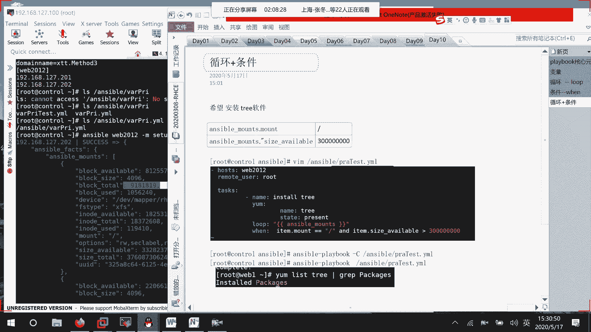
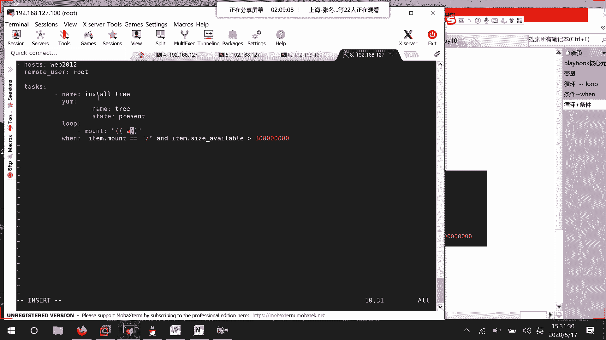
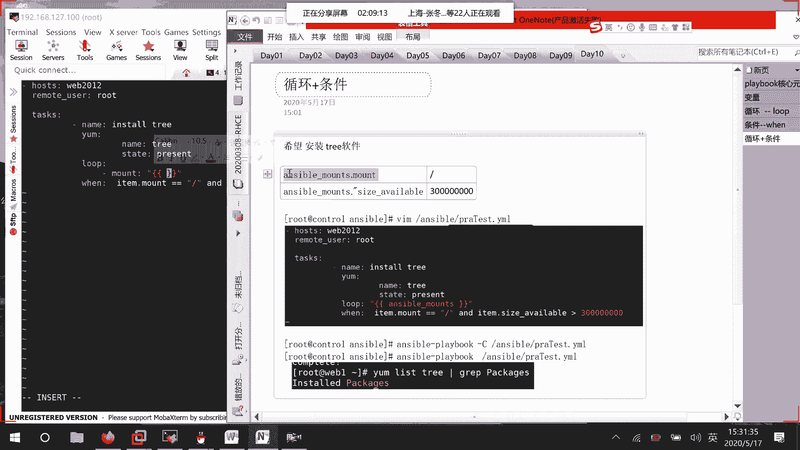
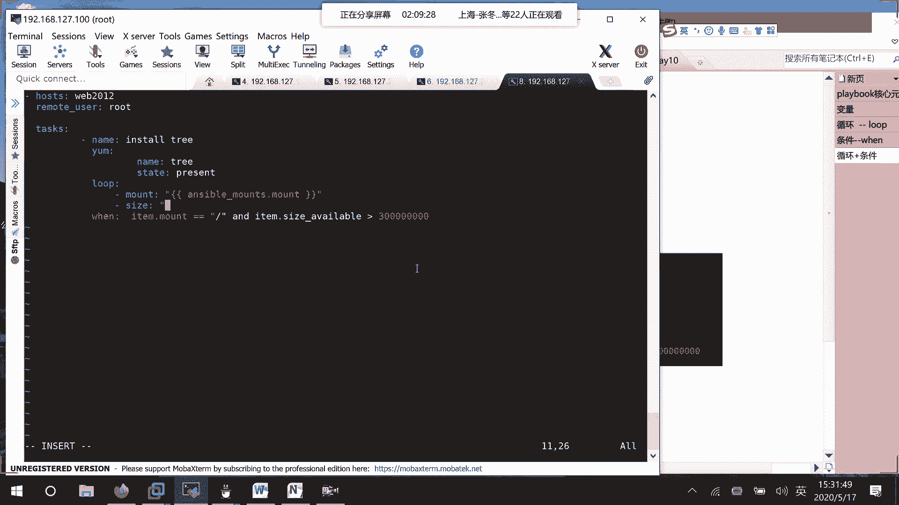
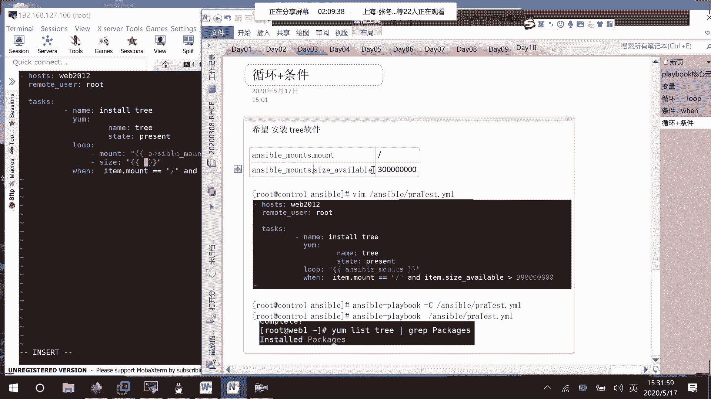
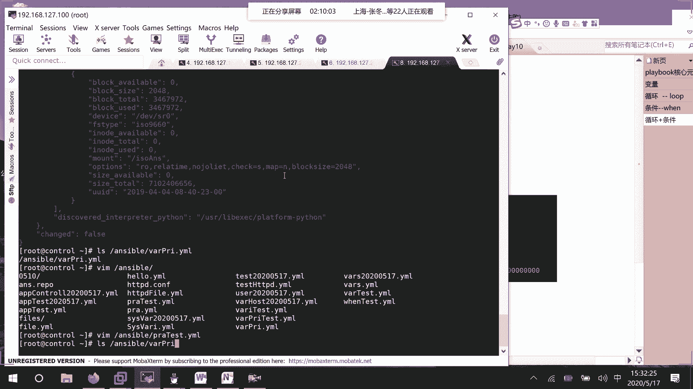
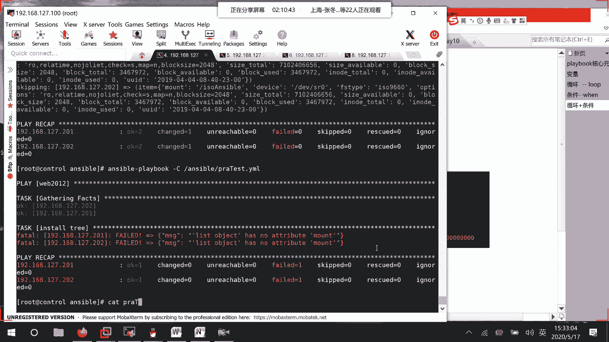
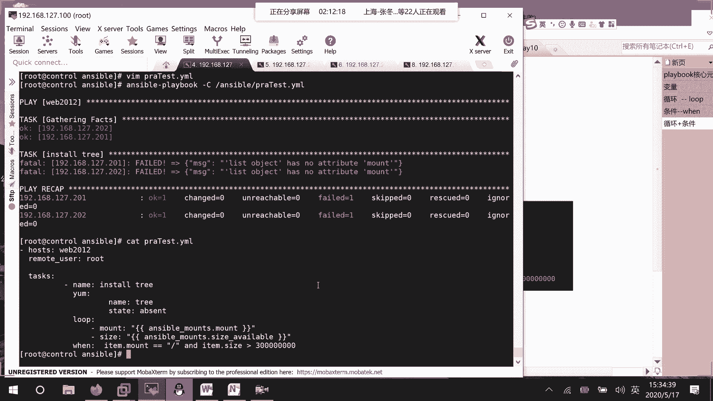
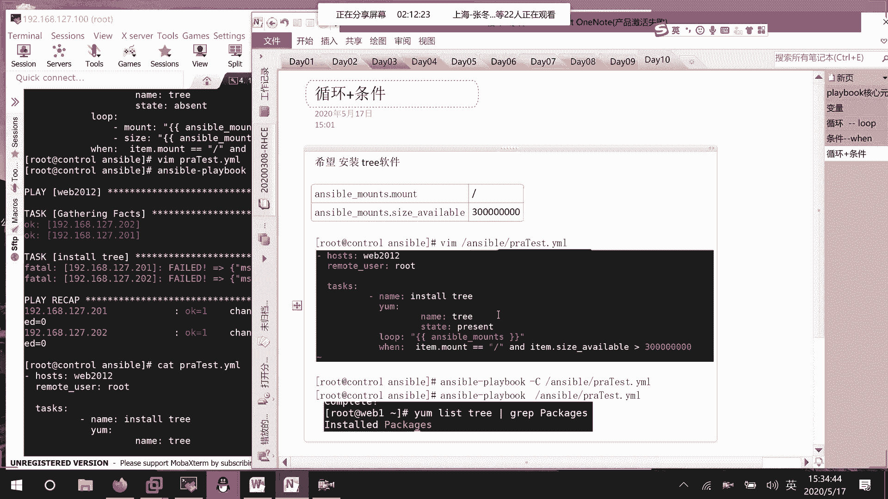
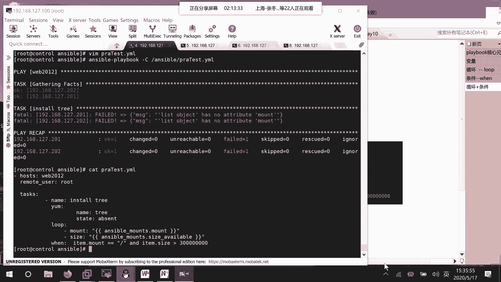

# RHCE8.0视频教程【45课时】 - P44：20200517-RHCE-05_recv - 六竹书生6682 - BV1su4y1Z7sJ

因为我们已经把那个叫做变量playbook，全都已经定义起来了，啧嗯稍等一下，我看一下哈，item remote rt，要么去mount loop mount，哦我知道你这边的话呢。

是一个一个的去定义变量对吧，去取变量，你这估计是可以的。

估计可以啊，我这边来给你改一下诶，等一下vim叫做，practice test，你这边的话呢，我看一下啊，就是很诶，等一下，横线mount你的话呢，双花括号，然后的话呢就是enable。

这个。

然后接下去的话呢还有一个叫做size，冒号双引号。

然后的话呢是等于available，等一下。

然后接下去的话呢你这边在判断的时候，item mount a available size，我这边去改一下，改成移除。

我先来检查一下他这个脚本对不对，剧本对不对，好这边的话呢哦呃这里message no attribute mount，呃k估计是上面那里取变量，problem a pro。

这里的话呢叫做enable mo item mount，我看一下归这边取变量，这里会有点问题，我没写完吗，我写完了呀，他没写完还是我没写完，state loop，问mt等哦，我知道了，我知道你的意思了。

我知道我知道了，啧，对我没写完，是我没写完，你这边的话呢就是说先取一次变量，然后再去判断嗯对嗯，这个亚目嗯嘛啊，你直接去取了第一个它的一个size对吧，就因为是一个根目录嘛。

list has no attribute，估计是我哪里又写错了吗，你那边能运行吗，我这边好像保存了，他还是出错，mount他前面这边就出错了，item mount，取双引号不行，unable。

嗯嗯叫做items。

你照道理的话应该是可以去进行一个获取的，有个序，嗯你这边的话呢要么就这个变量变量的话呢，这个估计要不要放到外面来，放外面来，对这个的话估计是这个变量有问题，估计应该要放到外面去循环不对。

loop mount循环曲指or对，你这边mont的话应该是mt去循环取值，按mt变量去循环吧，哈你这边mt的话呢是在这里面去循环，好像是不是这里的只要一个一个摆出来啊，这里的值一个一个摆出来。

再看一下这个或者课后再去看一下，好这边的话呢我们先过了吧，我课后再给你去看一下。

