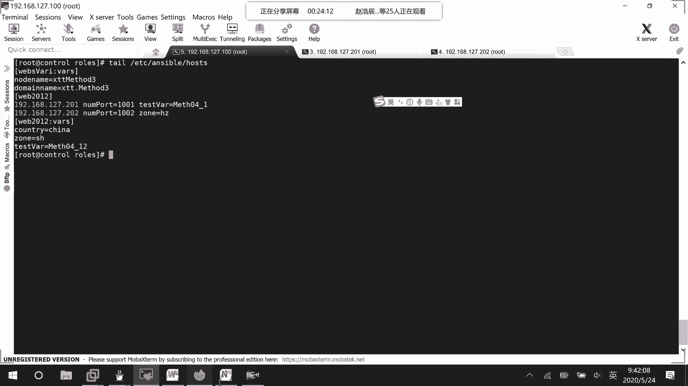

# RHCE8.0视频教程【45课时】 - P46：20200524-RHCE-01_recv - 六竹书生6682 - BV1su4y1Z7sJ

好啦，今天这边的话呢我们来讲讲的一个内容的话，就是一个简单的金加二的一个这，添加二他这一个模板的话呢，我们就说怎么样去进行一个写嘛，其实主要的话呢，也就是说在我们的配置文件当中怎么样去写，我呃。

在我们的一个配置文件当中的话呢，怎么样去使用一个变量对吧，上节课的话呢我们也去写了一个，但是的话呢嗯就是位置有点不太对，导致的话呢出现了一个异常，今天的话呢我再去把那个变量那一块呢。

给大家再去讲一下好吧，这边讲完了之后呢，后面这边因为模板怎么样去写，然后的话呢它的一个角色的话呢，怎么样去进行一个配置，我们这边的话呢也用nginx的话去讲过一次了对吧。

然后下面这边的话呢我们就是说去讲一下，如果我想要去对对端网络去进行管理的话，它的一个网络管理模块我该怎么样去写，因为其实的话呢就是你们可以发现，在我们的playbook当中。

其实就是这一个一个模块的话呢，放在里面，对不对，所以我们前面的话呢讲了一些几个模块，接下去的话呢今天这里吧，比如说网络管理模块啊，存储管理啊，就是说之前没有讲过的话呢，这边再来讲一下。

到时候的话呢方便大家在里面去进行一个调用，好吧，那好啊，我们来回顾一下上一节课的话呢，等一下哈，我们来回顾一下上一节课，这里的话呢，其实我们去写了一个叫做index的一个呃弱角色，对不对。

这边的话呢创建用户啊，安装nginx啊，其实全都是没有问题的，主要是这里就是，我们再去定义配置它的一个模板文件的时候，我们想里面去改一个参数嘛，这边的话呢怎么样改都出错。

这里的话呢要稍微注意一下哈，叫做这样子，had，我们的etc unstable里面的话呢有一个叫做rule，然后呢template模板，run gx new模板，模板里面的话呢。

有一个叫做就这个我后面跟了一个j2 ，表示是一个金加二的一个文件吗，其他的话呢不用去看，主要是这里我想让它呃叫做选择。

我们执行系的一个个数嘛对吧，这里的话呢就是说在查出来的执行器它是一，也就是说cpu是一嘛，虚拟的cpu，我再去加上一个二，那这样子的话呢到时候在主机上面呢。

它就会去启动几个任务呢，三个任务三个任务，因为这个查出来只有一个一嘛。

然后后面的话呢嗯我去把这上面的ngx的话呢，把它给移除掉，重新去执行了一个叫做这个playbook，在这边的话呢，我这边就可以看到一三就三个在进行运行嘛。

然后呢你们在做的时候呢稍微注意一下哈，这台主机上nginx的话呢，它使用的一个端口是多少。

呃这边net stn t u l p rap，他这边的话呢使用的是不是一个八零端口啊，像我们的我们之前在上课做练习的时候，经常会用到http对吧，而且设置为开机自启动，h t t p的话呢。

它使用的也是八零端口，所以大家的话呢在进行这个nginx配置的时候呢，把这个http先给禁用掉，或者把http的话呢给卸载掉，不要让他们去出现冲突，因为有一个有一个冲突的话呢，是怎么样呢。

就是说像我们这个端口已经在被使用了，这个端口已经在被使用了吧，所以呢他也是开不起来的。

明白吧哈哈，这个的话呢是上一次课，我们的话呢使用过这个金加二的一个模板，然后这里的话呢，今天我们继续来看一下进价二的一个模板哈，等一下，好这边的话呢就是说我们学习完了之后呢，就是说像一些配置文件。

我们想要去根据主机上的一些信息的话呢，去进行一个设置，也就是说我这边的话呢，一个模板文件上面这边的话呢，比如说我写一个三，那定死了，所有的主机是不是都会去试一个三，如果说我是取它的v cpu的一个数据。

数据不同主机的话，那可能不一样嘛，在这个基础上加上一个二，是不是就可以根据主机的情况去设置，我们的一个信息啊，对吧，这个的话呢，就是在我们配置文件当中去使用一个变量，它的一个好处呢是在这里哈。

然后我们的话呢也用过了playbook，也用过了一个角色，其实他们的一个格式的话呢，我们就比较了解了，现在这边的话呢我们就来学习一下，怎么样去进行一个操作，怎么样去进行一个使用好吧。

我们现在的话呢想要去做一个任务。

你们来看一下，我比如说平时去登录一台远程主机，这边的话呢是不会去显示出一些信息啊，比如说你什么时候啊，从哪里啊，对我去进行一个登录的嘛对吧。

我现在的话呢这边就希望这样子啊，在受管主机上，我的话呢想去给他传文件。

传哪两个文件呢，一个文件是这个诶，等一下，cat etc is这个文件，这个文件的话呢就是普通的进行一个登录，显示的一些信息嘛，它这边的话呢还有一个叫做net文件，但现在这两个文件的话呢。

它显示的内容是一样的哈，就是说一个是普通登录的一个信息，一个呢从网络去进行一个登录的一个信息，好吧，还有一个文件cat etc mo，回车诶，哦m o t d这个里面的话呢，现在没有什么样的一个东西哈。

我们等一下的话呢，就是说去进行一个设置，就他的一些欢迎语嘛，好吧就说到时候再登录进去的话呢，我们希望去显示出一个，我们自己去设置的一个欢迎语，语句是怎么样子的。

好这边的话呢，首先第一步，我们的话呢就说要去配置碗里的主机吗。

但这个管理的主机的话呢，我们一直都已经写好了，cat etc on some，诶哦打错设备了哈，这里cat tail吧，etc ansible hostile，就说这边的话呢。

我们还是用这个web 2012的这两台主机，稍等一下。

现在这边变量的话呢咱们是先不用到的，但是呢我还是不去改了，然后接下去的话呢，第二这个我们的话呢想要去设置，比如说到时候他在开机的时候呢，去显示我们的一个啊cpu的一个数据啊，还有内存的一些信息啊。

好不好，所以这边的话呢就是说查询受控主机，打信息，因为就是说想要在上面去进行一个显示嘛，那这边的话呢，我们是不是还是使用之前说的那个set set up。

的一个模块去进行一个显示吗，来看一下哈，unstable，然后呢这里对w e b2012 ，我的话呢减m去set up一下去进行一个显示，其实我们不看到内容的话呢，也是没有问题的，这边去进行查询的话呢。

主要就是说它的一个变量名字。

我们去获取一下嘛，等一下。

感觉切来切去太麻烦了，呃我这边的话呢往上拉一下，他这里的话呢显示的信息太多了，其实就上面这边，我这边的话呢，比如说想要去显示它的一个太多了，过滤一下吧，grape和cpu相关的信息太多了。

process处理器，这个unstable process它的一个count，我们等一下的话呢要去使用一下，然后呢还有一个叫做内存这块，我再来去查一下哈，mem memory肯定是和这个相关的。

嗯就memory total吧，这个差不多四个g两台设备，这个的话呢是一些系统变量，两台设备上面的话呢肯定是有的，对不对，那行，接下来的话呢，就是说我们想要让他到时候显示的信息，是怎么样子的呢。

我们在这里就去设置一个文件嘛，我到answerable里面来吧，然后这里的话呢make dir，比如说叫做information吧，然后这里cd show information。

这里面的话呢全都是空的，我来一下vim mt d。j2 ，就是到时候的话呢，要去拷贝到远端的一个文件吗，好吧，现在这里第三步设置配置文件，有一些配置文件的话呢，它自身本身是存在的。

但刚才的话你们也看到这个配置文件的话，是空的呀，所以这里创建配置文件，那好里面的话呢你去写什么东西呢，随便去写，比如说system total，m e m o r y，也就是说它的一个内存是多少呢。

空格他的话呢是不是这两个变量值啊，这两个变量值的话呢，怎么样去进行一个取值呢，稍等一下，我把这个信息放到一个临时文件当中去，等一下，因为等一下每次要查看的时候，要去进行一个切换，它就是说去进行一个显示。

太麻烦了，你看这个的话呢是不是他enerable facts，它里面的一个一个一个一个的信息，所以这边的话呢，如果我们想要去进行一个引用的话呢，可以这样子，就是vm unstable。

他的话呢show info，然后呢里面写什么东西呢，就这样子，等一下i花括号，花括号，花括号，花括号，然后接下去他的话呢是我这个叫做enerable。

unstable facts，因为它这个是一个jason的一个结构嘛，然后呢它的方括号里面的话呢，哪一个变量嘛，第一个比如说它的一个内存信息诶，内存，那我就这样子放在这里嘛。

然后接下去的话呢如果说还有其他的信息，像我这边system p r o，然后的话呢c e s s o r，然后的话呢count有几个，那也是一样的，滑块滑括号划款划括号，然后呢这边它也是一个fix。

接下来里面的话呢，是不是它的一个叫做count的一个信息，然后这里引号，方括号就这样子嘛，两个变量你把它给写上就可以了，这个的话呢就相当于我们刚才去之前写的那个，nginx的一个配置文件信息。

他的话呢就这样子。

只是说我们这个配置文件的话呢稍微小一点。

里面的话呢没有哪些很重要的一个信息，就进行一个显示，那好这个信息写完了之后的话呢，是不是肯定要在一个play book当中去调用才可以，不然的话我怎么样知道可以去进行一个下发呢，对吧。

那好我们这边的话呢来创建一个，比如说就叫做mtv它的一个压码文件，所以这里第四步创建亚马文件，也就是说创建我们的一个playbook嘛，这边回车里面的话呢，首先写什么东西呢，i里面这里啊，稍等一下。

这输入法没切过来，里面的话呢，i上面这三个横线的话呢，之前说过你可以打也可以不去打，然后接下来的话呢，这里面就是说你的一个主机，谁去进行一个运行吗，我们是不是w e b2012 去进行一个运行啊。

稍等一下，他这边的话呢没有去进行一个call me h，那好没关系，然后接下去的话呢我们就要去说一下，谁去进行一个运行嘛，remote user，冒号r o o t去进行一个运行。

接下来的话呢我们是不是就要去写任务了，tasks这边的话呢，比如说我们给它去设置一个名字，第一个任务nice，他的话呢就说是去呃copy肩加二file，就这样子，然后呢首先这个原文件在哪呢。

是不是和我在相同的一个目录当中啊，我就不用写太多了，直接就写mod。g2 就可以了吗，接下去我这个文件的话呢，想要去拷贝到目的地的哪个位置呢，你看是不是想要去拷贝到他们这里来，l s etc。

m o d这个位置来把它去进行一个替换吗，对吧，所以这里的话呢在拷贝的时候，我们就这样写斜线e t c，斜线m o d t这样子就够了，然后的话呢接下去哎我这边写哦，任务没有去写，任务忘记去写了。

这个是一个模板的一个拷贝模块，忘记去写了，temp l a t e，模块忘记去写了，这边缩进估计也得重新打一遍，我还是重新说一下吧，好就这两个，然后接下去的话呢，我们是不是就可以保存退出了。

然后到时候的话呢，我们再去执行一下这个文件就行了嘛，其他的我们先不管，先来执行这个文件，我把这个文件给你们去，vm把这个文件先给你们去拷贝一下哈。

等一下，算了我写到下面去吧，上面的话呢我得重新去弄一下这里enable playbook，我的话呢先来检查一下这个文件有没有问题哦，nice，那估计是里面哪里写的有问题了哈，多了一个s，再来检查一下。

那好这边的话呢好像说两个任务都是正常的啊，我看一下，could not access，那我写一下全称吧，文件访问不到这个文件的话呢，现在就在我的当前目录下，叫做pwd，哦had no。

哎我这不是复制粘贴过来的吗，等一下哎，vim etc，哦不对，vim unstable show，这个我这个东西不要了，不要用这种字典顺序，我就直接写个简单的格式，看行不行啊。

unstable memory toto mb没问题，好这个时候没有问题啊，我刚才的话呢又去改了一个地方，我给大家去看一下先哈，他这边的话呢字典顺序是不能这样子去写，但是的话呢。

在我们的红帽的官方教材当中的话呢，它前面是加了一个字典的一个顺序，但这边的话呢就是说不能用字典顺序，直接就写他的一个变量的一个名字就可以了，好吧那行这个时候的话呢。

好歹这个脚本现在就说这个play不可能去运行了，那好现在呢我们来使用一下，等一下哈，这里执行剧本，他这很快，就可以去进行一个显示的，现在的话呢我来去试一下，比如说ssh 192168127。

201试一下，嗯这边你看是不是就显示了这个信息啊，就是说你的一个总内存是怎么样的，还有的话呢就是说你这边的话呢，处理器的总个数是怎么样的。

是不是就有去进行一个显示啊，你们的话呢还想要去设置，就是这个文件可以去设置一下。

像我刚才说的i i s s u e那个文件的话，自己也可以去调整一下里面的内容，去进行一些显示好吧，然后接下去第六步测试，这样子，这边的话因为今天内容的话呢比较不紧张，所以的话呢这里给大家去十分钟时间。

去把这个金加二的一个模板的话呢，去试一下好吧，他这个很简单，就花括号里面的写上一些啊，系统变量的一些值嘛就可以了，看明白了吧，去做一下哈。

