# RHCE8.0视频教程【45课时】 - P48：20200524-RHCE-03_recv - 六竹书生6682 - BV1su4y1Z7sJ

的话呢就让他把和python 3相关的都去装一下，就让他先放那边装吧。

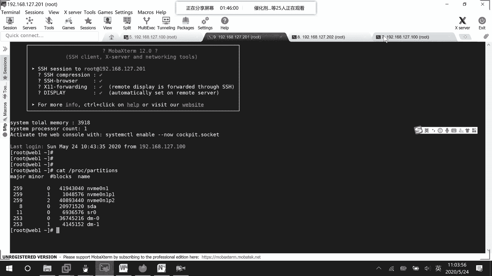

我们这边的话呢，接下来先去看一下这个叫做存储管理这一块，存管理存储这一块的话呢，其实我们要去学习的东西有哪些呢，第一个就是说学习怎么样去进行一个分区，然后的话呢怎么样去配置，我们的一个叫做逻辑卷。

然后下面这边的话呢，我们逻辑卷比如说创建出来了，怎么样去进行一个格式化，然后这边的话呢格式化完毕了之后呢，怎么样去对它进行一个挂载吗，然后还有的话呢，我们这些是一些正常的一个分区。

以及我们就是说去学习交换分区，它的一个使用好吧，主要来学这些东西啊，首先的话呢这边我们来看一下分区当中的话呢，它有一个分区的模块叫做party的一个模块，在这里面的话呢它就会有很多的一个参数。

首先这边第一个参数的话呢，就device表示你要操作的一个硬盘是哪个。

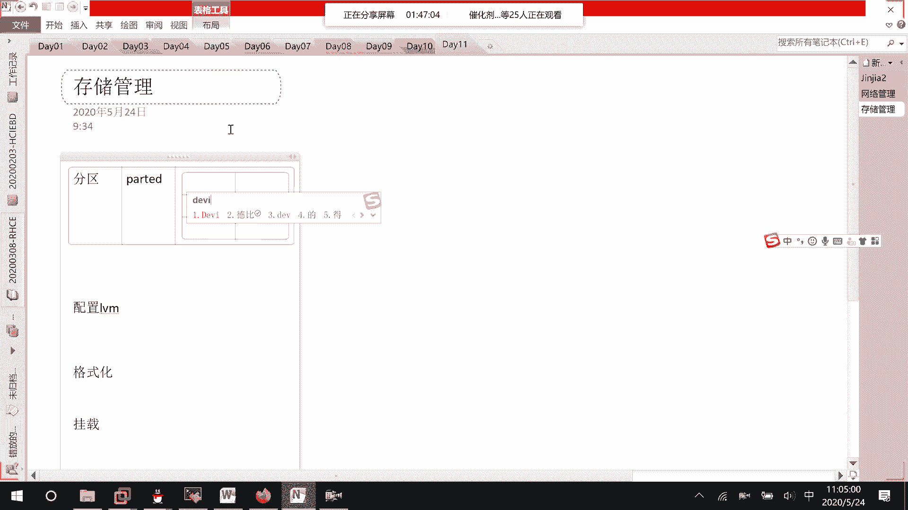

就比如说这边哈，我这个201设备上，我去给它添加了一个硬盘叫做sda。

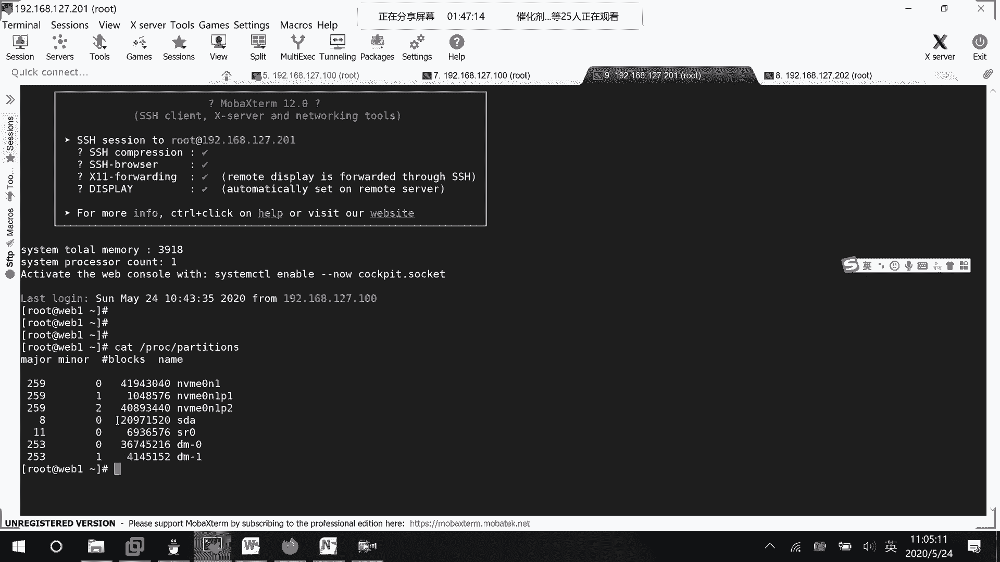

那到时候的话呢，这里就可以去写d e v斜线sda嘛，这就说快设备是谁，然后接下去的话呢，我们不是想要去对它进行创建分区吗，比如说number这个就是说分区的编号。

你这个的话呢是第一个分区还是第二个分区，你要去写一下，接下去的话呢你要去写一下，他的话呢从磁盘开始，它的一个分区大小是多少，比如说part，p a r t and，就说我们平时在写它的一个结束位置的话。

是在哪里吗，这边结束位置，是多少，这样子的话呢，我们就知道它这个大小的话呢，是多少的一个大小吗，或者的话呢你还可以去写一个叫做结束位置，位置就是说从头开始到我这边的话呢，呃从那个叫做上一个上一个节点。

它的一个结束位置开始到我这里，我划了多少空间过来嘛，然后下面这边的话呢还有一个叫做状态，你这边的话呢比如说状态它有两种，一种的话呢就是p r e s e n t，表示现在的话呢是进行一个创建。

还有一个的话呢，abs e n t这个的话呢表示去进行删除，我们的一个分区，好吧这两种状态行，这里的话呢，就比如说我们想要去对哪一台设备呢。

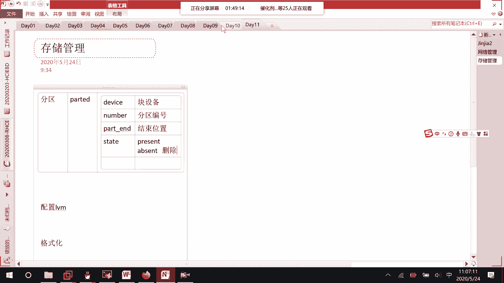

比如说对这台设备吧，诶不是啊，比如说对这台设备呢，我们去创建一个sda一的一个分区好吧，或者的话呢，顺便这台设备我们也去进行一个创建吧，cat process partition。

它也有一个s d a一嘛，我去进行一个创建好，那这边的话呢我们来看一下剧本怎么样去写，比如说vim party 20200523点雅马文件，他这边开头的话呢都是一样的，host。

比如说w e b2012 ，好像是这样写吧，我看一下cat etc enerable，在哪里哦，对w e b2012 好吧，然后下面这边的话呢，就写上远端执行的一个主机是谁，叫做r o t用户。

接下去的话呢我们的一个任务，第一个任务比如说叫做part我们的block，然后呢里面刚才不是说过有很多的一个参数吗，它的一个模块是这个party的第一个离异，vc表示你想要设置的一个快设备是谁。

我们的s d a设备，然后接下来的话呢我们要去创建分区，第一个分区编号，然后接下去我们目前的状态是怎么样呢，present就说去进行一个创建，接下来从最开始，因为我们在进行party的时候呢。

它是不是有一开始的话呢，它的起始编号本身就有了保持默认，然后接下去呢到哪里结束呢，我想要去创建一个十gb的一个大小，就这样子嘛，十gb的一个大小就这样子，然后这边的话呢我来截个图哈。

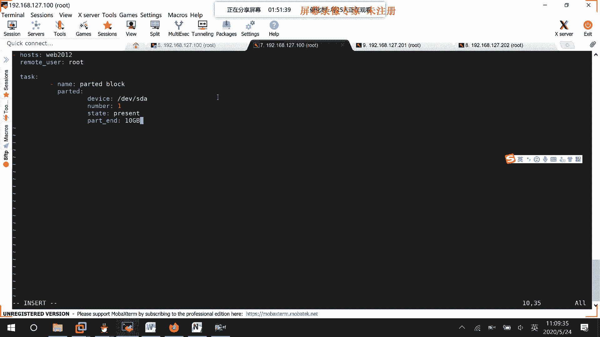

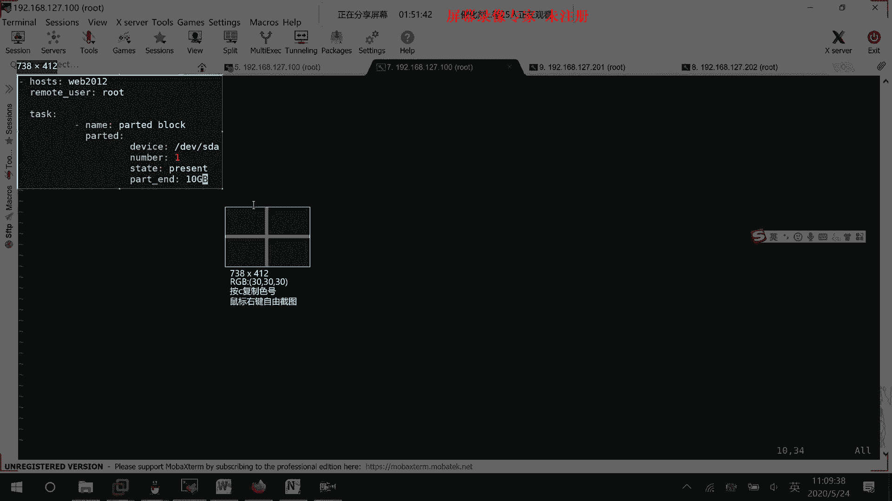

我放到后面去吧。

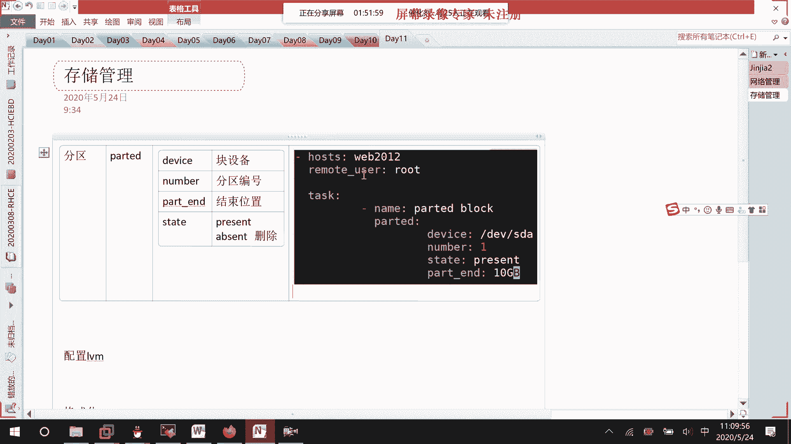

好然后这里的话呢我们来保存退出一下，应该不至于这么惨，这个也不行哈，playbook大c，我来检查一遍，先，hosters，hosters remote。

诶诶hosters remote root test，name party，诶h o s t s，我这边有什么问题吗，等一下我先懵了哦，这里少了个s，我再来试一下。

unreachable failed to connect，那个我估计我这边的话呢这台设备有点问题，201设备有点问题，我这边的话呢在写playbook的时候呢，就对202这台设备去进行一个操作。

因为刚才突然间我的一个连接的话呢，就明明这边是一个201，它的话呢就自己去连接到了，一个叫做web 2上面去，比较奇怪哈，我这边就针对某一台设备吧，没有关系啊，好这边的话呢它成功了。

因为这台设备我不操作了，我就把它先把终端给关了吧，然后现在这边的话呢，因为概念就是空执行一遍，县这边的话呢，我把这边给删了，还没还没有那么快哈，等一下，好这里的话呢它执行好了之后，我们再来检查一下。

这里的话呢是不是就多了一个s d a e呀，我们的话呢可以来看一下，它这个实际的大小的话是多少，d vs da，然后这边比如说叫做p一下，你看是不是刚好是一个叫做十gb的大小对吧，就这样子。

如果说你这边的话呢还想要有第二个分区啊。

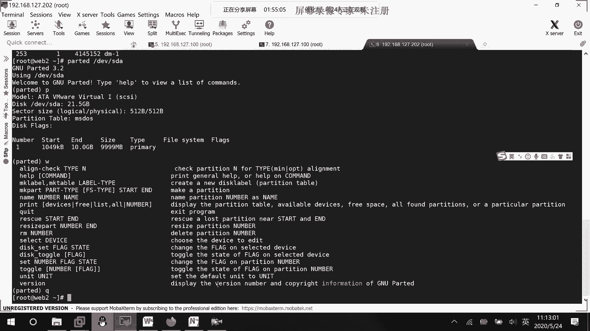

第三个分区啊，就按照类似的这样子的一个嗯，格式去进行一个写操作就行了，我这边的话呢再去创建一个第二个分区哈。

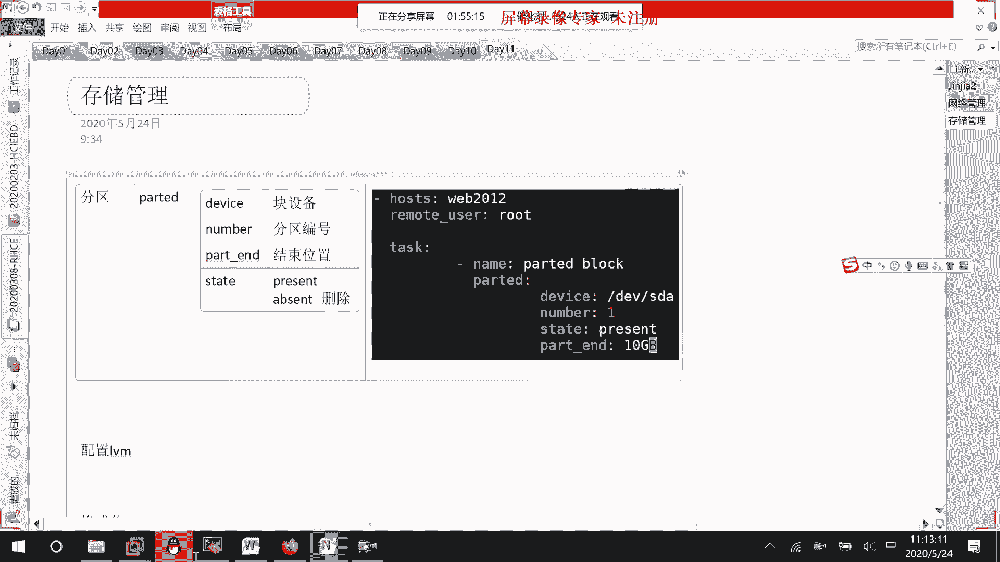

这里a错了，这里这边的话呢，比如说因为这边其实你可以去写循环，你想要写几个嘛，第二个比如说现在的话呢我就不那么大了，就一个gb的一个大小就可以了，再来运行一点，瘦的空间不够了吗，二number 2开始。

安sim p r t一点安包，啧啧，嗯start我start也去写一下吧，是大，他这个要这么大吗，不是g病，诶等一下这边我得去改一下，啧啧，算了，这边的话呢他一直在报错啊，我就手工的来这边来创建一下。

哎，来来创建一下看哈，第二个，然后的话呢呃等一下new，make heart，主分区pm 2 y，start就10gb，and就是12gb，w这没什么问题，cat proce partitions。

那好现在这边的话呢它就有两个分区进来了哈。

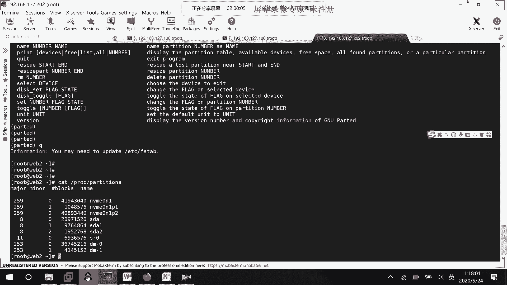

可以刚才那样子去做，应该是没有问题的，然后现在这边的话呢就好像我们分区已经有了，我们不是要去配置我们的一个逻辑卷了嘛，对不对，那现在的话呢，想要去把一些刚才创建的分区的话呢，加入进来的话。

我们来看一下怎么去加他，这里的话呢有两个命令，一个叫做lv g的一个命令，还有一个的话呢叫做lv 0 l这个命令lvl，它的话呢也可以去进行一个加入。

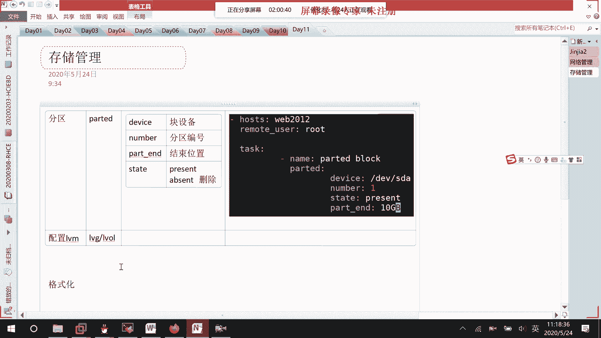

我们来看这里的话呢，如果要去写剧本的话呢，怎么样去进行一个写，比如说v i m l v g，20200524点yml的一个文件里面，这里的话呢也是一样的。

hosters w e b02 remote它的一个user root吗，ps sks，然后接下来这里的话呢，第一个我们要去写一下这个卷轴的名称是什么，我们之前对不对，先创建卷轴卷轴的名称。

比如说叫做v g0 啊，或者v g e r就在这里去写嘛，接下去你有哪些叫做逻辑卷啊，就是说那个分区想要去加进来嘛，就好像我们这边的话呢，sda 1 sda 2，如果都想要去加，都想要去加进来的话。

那怎么办呢，离e v sda一逗号dev sda 2，你有多个的话呢，就用逗号去进行一个分隔，如果说只有一个的话呢，我们是不需要写逗号的，不需要去写逗号的好吧。

然后接下去的话呢还有一个state state的话呢，present就表示创建absent的话，那就表示进行一个删除嘛，因为默认的话呢就创建，我们这边的话呢就不去写了好吧，那好稍等这边模块忘记去写了。

lv lv机冒号，然后呢这里面的几个参数嘛，我等下给你们列一下哈。

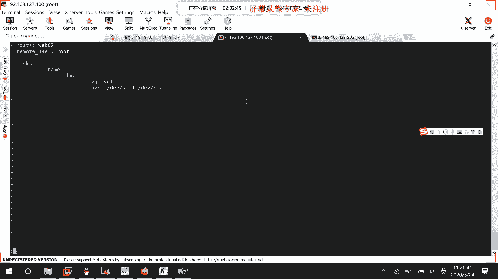

首先第一个这里的话呢就是vg卷组的名字，然后接下去的话呢就是p vs，我们要加入到这个圈子里面的一些pv 4设备嘛，有多个用逗号分隔，如果说只有一个的话，那就算了，然后接下去state，表示状态。

你的话呢要么就把它删除掉，要么就把他给创建起来，然后这里的话那就没有什么东西了哈，然后还有一个就这些就这些那好，这边的话呢我们来保存退出一下。

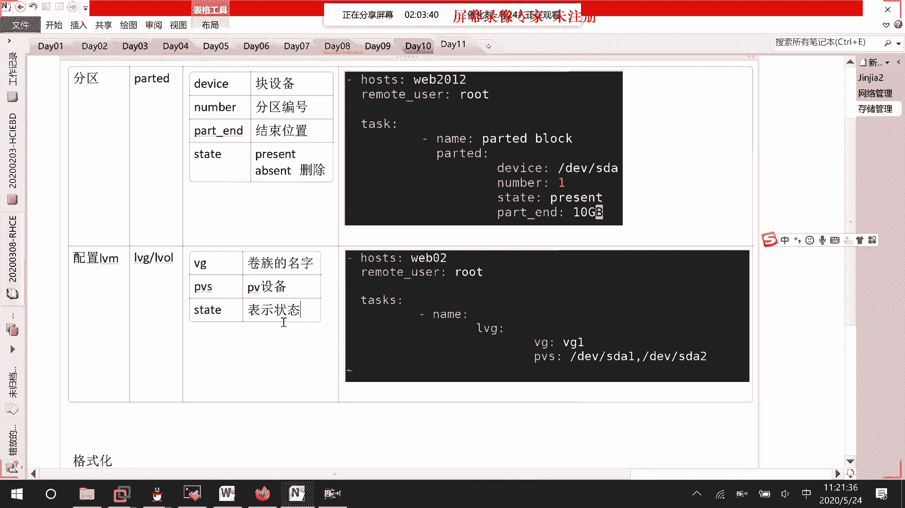

运行一下，叫做enerable playbook，大c先检查一遍，看一下我们写错掉，稍等一下，我又哪里写错了哦，name哦，name忘记去写了，correct lv g，lvg。

接下去的话呢vg vg 1，lvg这是没有问题的，vg vg，我看一下啊，host remote host task，name lpg，空格错了，难怪我觉得这边空格特别大，缩进，等一下，好这边的话呢。

它这个空运行的时候没有什么样的一个问题，这边我先来看一下l vs vjs，这边还没有的哈，你看这边的话呢是不是创建了一个叫做vg 1，在这里啊对吧，v g一的话呢，他这就创建起来了。

因为我们的话呢总共是一个是实际的，还有一个叫做2g的，它的话现在就变成了一个差不多12g的对吧，这边的话呢咱们再来创建一个分区party，叫做d vs da make part。

这边的话呢比如说叫做primary，然后呢默认其实是12gb结束的话呢，比如说是四gb，稍等一下q一下，这边的话呢还有个三嘛，我们来看啊，这个v g s的话呢，它只有12g b，我觉得不够了。

我怎么样通过这个叫做unstable的话，再给他去进行一个添加呢，他这边的话呢想去诶，他这边的话呢想要去添加的话呢，还是非常简单的，就这里名字你还是写上是谁的，下面这里的话呢就比如说哪个分区。

你想要去进去吗，这边的话呢是不是一个d v sda 3，想要放进去啊，就把名字跟在后面就可以了，这边我们来运行一遍啊，等一下，好，然后这边的话呢我们来看一下vg s。

他是不是就从那个12变到了差不多14啊，他这边的话呢我们在创建这个卷轴的时候，他没有什么，就说其他的一些参数在没有其他的一些参数在。

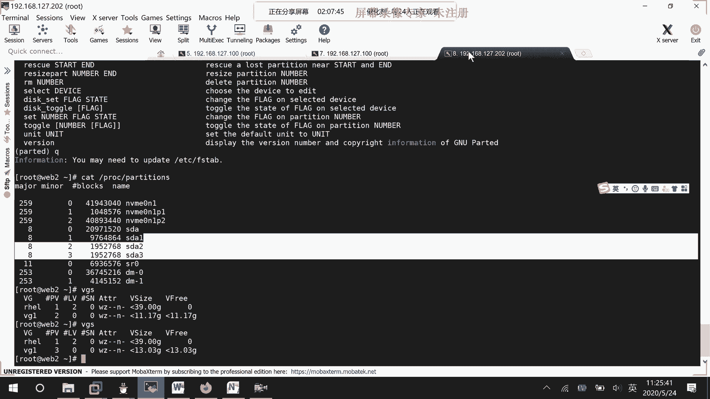

所以这边的话呢就是去创建我们的一个vg，vg，然后下面这边的话呢vg创建起来了，如果说我们想要去创建一个逻辑卷呢，比如说使用这个lv lol这条命令来进行一个创建，它里面的话呢有哪些参数呢。

咱们来看一下哈，首先这里第一个我们的话呢，要创建的逻辑卷的名字，然后的话呢我这些空间的话呢，到时候要去从哪里去取吗，逻辑卷的一个叫做附卷轴，卷轴从哪里去取对吧，然后接下来的话呢。

我们要去说你这个逻辑卷的大小是多少，对吧，这些参数的话呢肯定要去写，还有的话呢就是我现在是创建它呢，还是删除它呢，通过我们这个state的话呢去进行一个说明嘛，这边我们来创建一个叫做两gb大小的。

一个叫做逻辑卷，好。

这边比如说就是我来copy一下，叫做vga，找出设备了哈，copy，lvg叫做lvm，20200524点yml的一个文件，然后这边的话呢我们要改的就是下面这三行嘛，现在的话呢就不要说再去创建vg了。

比如说就是l v m里面的话呢，现在使用的一个模块是什么呢，lv lol这个模块对吧，接下来冒号我们要去说，我们目前的话呢创建的逻辑卷的名字叫什么，比如说叫做lv 1，从哪个附卷组当中去拿呢。

我刚才是不是创建了一个叫做v g e r大小呢，嗯这边的话呢比如说我们创建一个十gb吧，哦两gb干顺十啊，就两gb吧，好吧好了之后的话呢，我们就保存退出，来这个上面去看一下没有哈。

然后这边的话呢我们先空跑一遍unstable playbook，等一下，稍等一下，a field bad size，他这个单位很奇怪，有时候的话呢要那样子，有时候估计又得小写，我先空运行。

空运行成功了之后呢再说，好了哈。

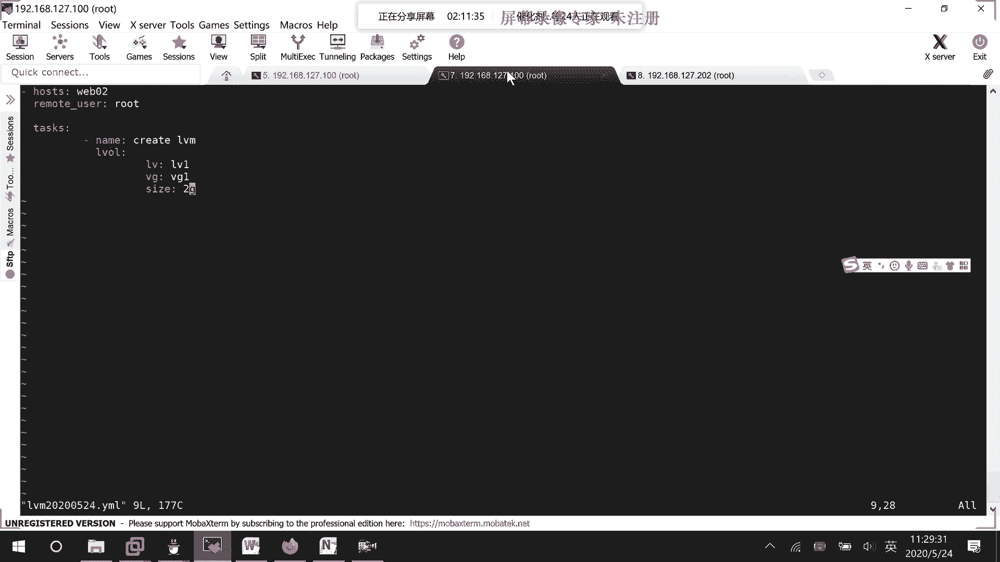

就前面我们再去创建，比如说卷轴啊，还有分区的时候呢，它都是大写的嘛，但这边的话呢它这个g的话又得小写。

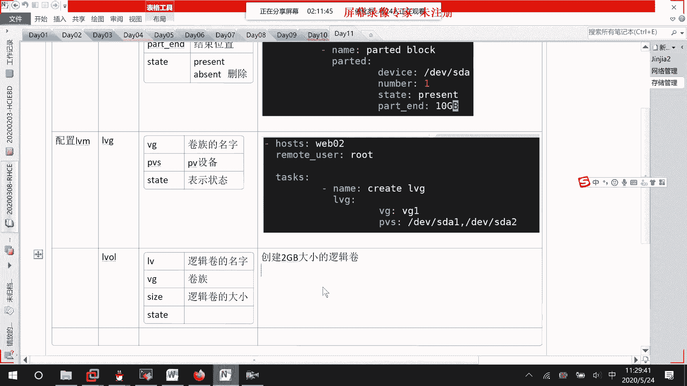

如果你写大写的话，他又会去报错，记住就好了，那好这边的话呢空运行没有出错，我这里的话就去执行一遍，啧啧啧好，这里好了之后的话呢，我们来这边去查一下，是不是多了一个叫做lv一的一个东西啊，对吧那行。

然后接下去的话我可能觉得哈他这个叫做哦，两gb不够去使用了，我现在的话呢，如果想要去对它进行一个扩展的话，就是说把他的空间变成到五级b啊，或者变成六级b啊，这该怎么办呢，这边来看answerable。

然后的话呢叫做docs，它的一个模块叫做lv lv lol嘛，然后它这里的话呢有一个resize，这个的话呢就是说把它去变大，就说调整它的空间，这个呢string就是说去启用它的一个收缩嘛。

可以的话呢就是说变小哦，if current size size request，就是说它太大的话呢，你去可以，你可以去给它变小吗，可以给它变小，我们这边的话呢来试一下哈，在里面的话呢怎么样去写。

比如说sahi link冒号yes，我看下一级可不可以，呃我先空运行一遍，呃sorry，bout with out，yes，啊string启用，等一下我看一下，应该是可以直接这样子去进行一个调整的。

strength，我看下r i v e s的e fs，resize，resize fast system，yes，啧啧啧，诶哦我再去加一个选项，resize five sim，这边的话呢。

farce y e s，就是说强制性的话去进行一个修改哈，啧啧啧，17，啧啧啧，啧啧，好了，这边的话呢就说，在写的时候呢，它是有一个，他在写的时候其实应该有一个叫做呃收缩。

启用我们的一个收缩higary size，去调整它的大小吗，但他后面跟的就应该是yes或者no，要不要去启用，我把它跟在这里的话呢反而错了，这边不跟的话呢反而是可以的，这里的话呢。

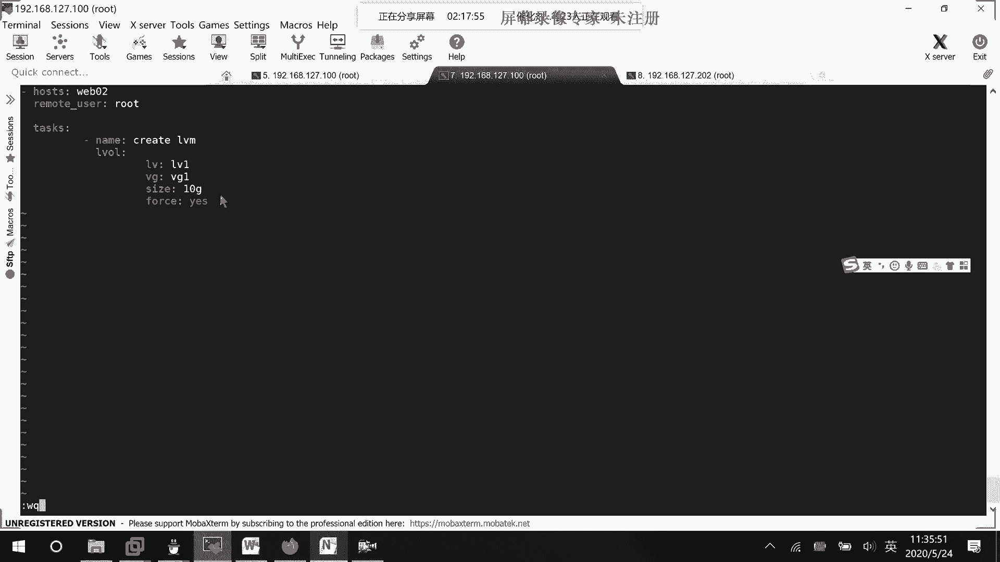

就是说我一开始明明明明创建了一个叫做lv，一的话呢，它是一个两gb对吧，这边的话呢现在好了，我把它调整到一个实际的一个大小吗，这个就是我们逻辑卷的话呢，如何去进行一个调整，就这样子呢去进行一个设置好吧。

那行现在的话呢我们逻辑卷也已经有了，如果说想要去进行一个使用的话呢，是不是需要对它去进行一个格式化，格式化这一块的话呢，使用的是一个叫做fire system，它的一个模块。

这边的话呢它的参数相对来说的话会简单很多，总共这边的话呢三个参数，第一个参数div，你想要去设置的一个叫做快设备分区是谁，你这边的话呢不一定要逻辑卷，你是一个普通的分区也是可以的。

第二个fire system type就是我们的一个文件格式嘛，然后接下去的话呢，还有一个如果说你后续的话呢，就好像我们之前在学习逻辑卷的时候，他是不是先把逻辑卷的空间给增大了，或者怎么样。

是不是还要去进行一个扩展，所以这里就说resize，f s这边的话呢是对增加的快设备大小的话呢，去进行一个调整，调整增加的，lvm空间吗，对吧，这边我们不去做，就做这上面两个，第一个对分区。

我们的话呢想去对它进行一个格式化吗。

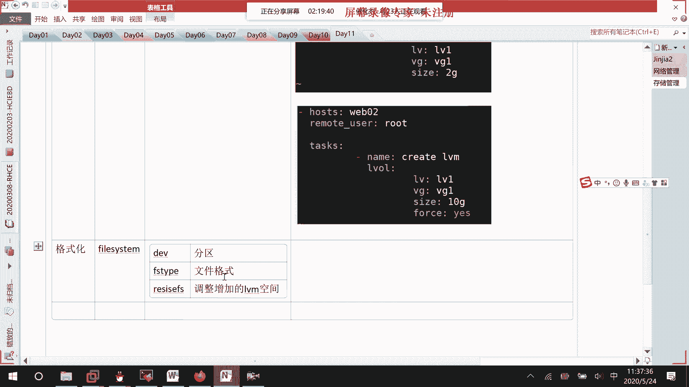

就比如说这里哈有一个分区的话呢，叫做，哦有一个分区在这叫做lv 1，我想要去对它进行一个格式化，这边的话呢怎么样去做呢，首先我们来看一下l s d v，在v g一下面的话呢，是不是有一个叫做lv一啊。

我就希望对它进行一个格式化，这边比如说copy这个的话呢叫做fire fs吧，20200524点yml v i m f s，然后这边的话呢现在的一个模块就不再是lv。

lol了现在要使用的是file system的一个模块，然后这边的话呢第一个写的d v对谁呢，d v下面的vg一里面的lv一这个分区，然后接下去的话呢我们要设置的一个东西。

就是说fire type你要格式化成什么样的一个类型，比如说你想去格式化成xfs的ex t4 的，ex t2 的全都可以，比如说我这边的话呢，就就变成最传统的叫做x f s的好吧。

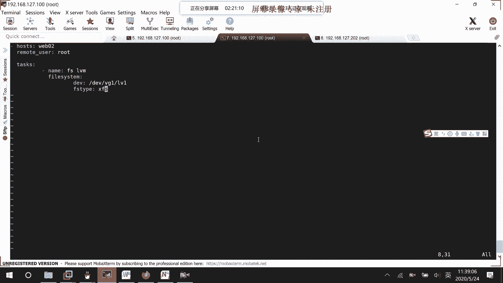

稍等一下。

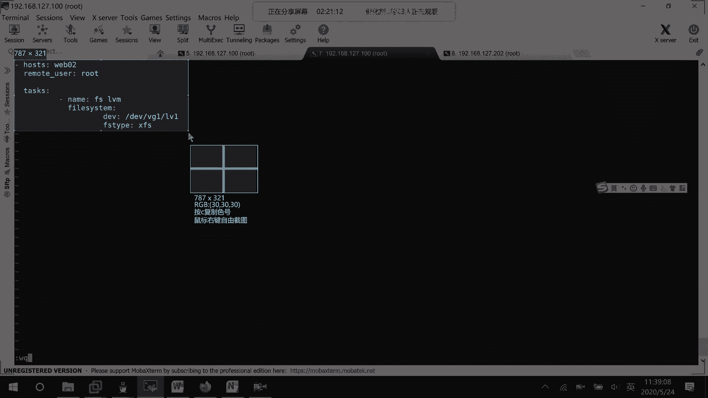

就这样。

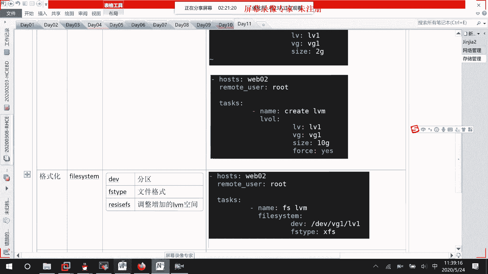

那好这边的话怎么回车，还是来空运行一遍，unable playbook，大cfs，这边就两个参数还出错了，那我真的不服气了哈，好这边的话呢他没有出错，我们现在的话呢，比如说block id。

我们的话呢去查一下有没有和我们lv相关的线，是没有的，我们这边的话呢来并执行一下这个剧本，等他执行完了之后，我们看一下啊，l v e的话呢，现在有没有block id。

并且去看一下它的一个格式是怎么样子的吗，等一下哈，那好这边好了，我们来看它，这里的话呢是不是有格式化了，格式的话呢xfs uid是不是也有了，那行，就好像我现在的话呢，每一次在开机的时候。

都要对2012，2022手工的去执行这条命令，mount dev sitting room，到soo嘛，我觉得特别麻烦，或者的话呢像这个我都格式化了以后，想要去用嘛。

我如果说有十台设备都想要去用这个快设备。

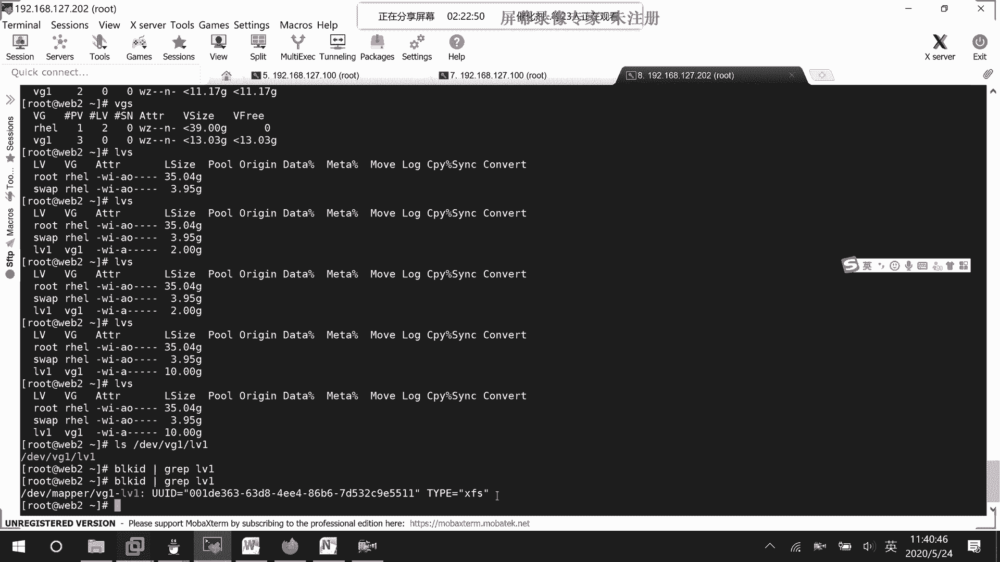

想要一次性进行挂载，怎么办呢，格式化也好了，接下去就是我们的一个挂载，挂载的话呢，它使用的一个模块就是我们的mt mt里面的话呢，我们来看一下有哪些选项可以去使用。

首先第一个你的话呢可以写的就是说详细一点，然后如果说就想写的一个简单一点的话呢，第一个src就是说原文就说啊，就比如说我们光盘设备嘛，原设备是谁，原来的一个设备是谁，然后接下去我们要挂载到哪里去对吧。

pass挂载点，它的一个位置在哪，然后接下去的话呢还有一个叫做state，啧啧，他这边的话呢abs e n t我们就把它给卸载掉，但挂载的话呢它就不再是present了，它是这个monty的。

就说对你去进行一个挂载，默认情况下的话呢，它就是一个mounted的一个形式，好吧，那行有时候的话呢，如果说你要去写一些叫做选项啊，就op t后面去跟上就好了，比如说只读啊，止血啊，或者可读可执行啊。

自己都可以去写，然后还有的话呢你如果想要写的详细一点，fire system tap，你也可以去跟上一下吗，比如说你这是一个so，还是一个普通的x f s的一个文件吗，好吧。

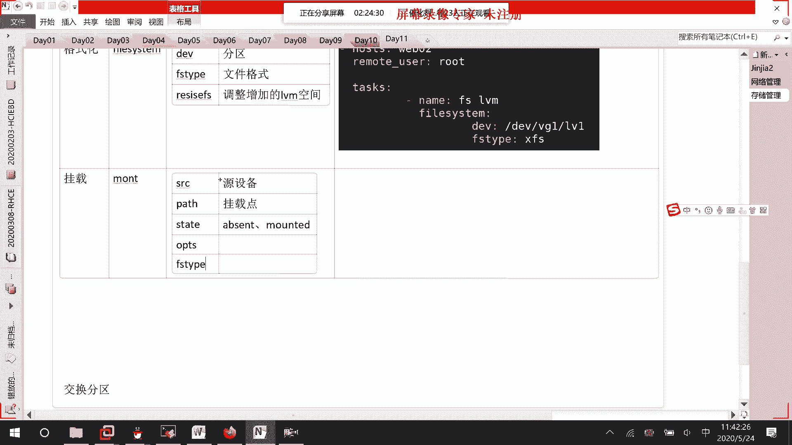

那这边的话呢咱们来试一下哈，咱们来试一下，我来copy一下，叫做随便copy一个吧，copy fs叫做mount二零二零零五二三点二四点y ml，诶，等一下，啵v i m这个文件，然后里面这边的话呢。

这些不用去改哈，就把这三行给删了吧，比如说这里要去mount，然后下面这里第一个pass，你想要去挂载到哪里去，比如说我在这边的话呢，去make d i r l v e test。

你看这边的话呢是没有lv 1，lv 1 test是没有的，我呢这复制一下路径的话呢，就到时候要挂载到这边去吗，src也就是说圆是谁，圆的话呢，你要么写div稍等一下。

你这边的话呢要么写div vg lv 1，要么写这种形式，是不是写这个uid也可以啊，uid稳定嘛，那这边的话呢就使用我这个uid的一个形式，然后下面这边的话呢，比如说文件它的一个格式。

因为我本身就已经知道，那我就去写一下嘛，还有的话呢就说他去进行个挂载，present。

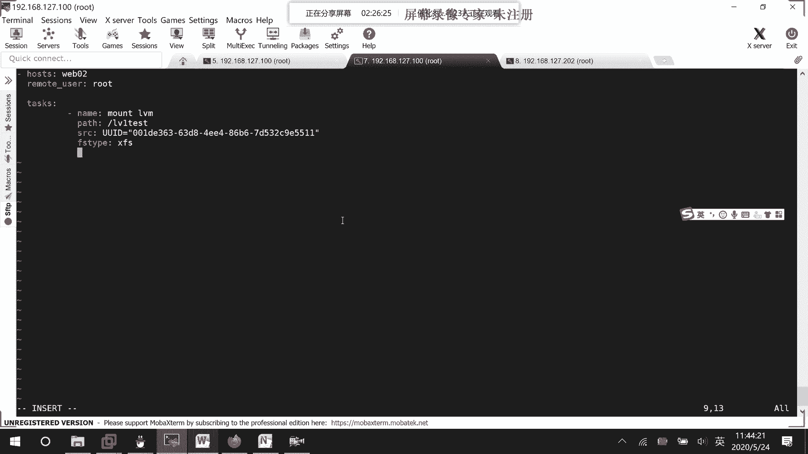

这边啊这边三个我漏写了一个mounted的话呢，它是这样子的，就是说查看叫做etc，mt文件，进行挂载，然后这个叫做present的话呢，就是说当前去进行一个临时挂载吗。

absent的话呢就去进行一个卸载好吧，那好，这边的话呢。

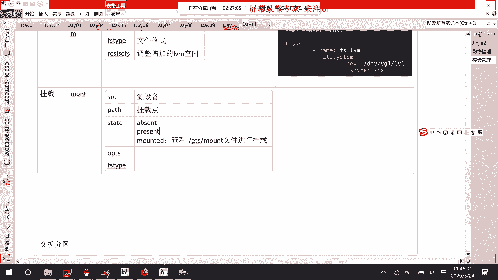

我们就是默认使用当前的一个信息挂载，就把那这后面的话呢我们也不用去写对吧，想写的话你也可以就是state，pi等一下，p r e s e n t去进行一个挂载。

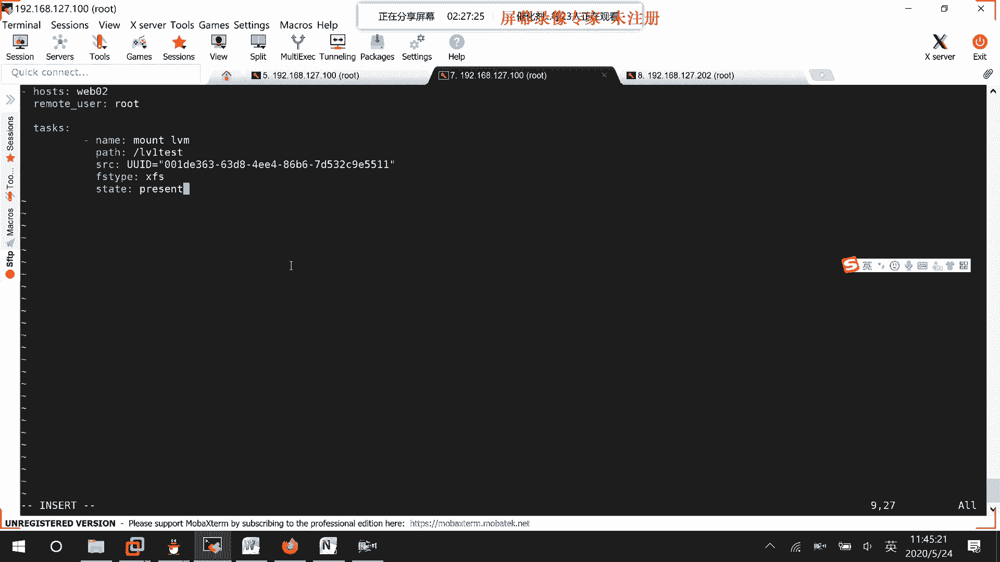

好了之后呢，保存退出就行了。

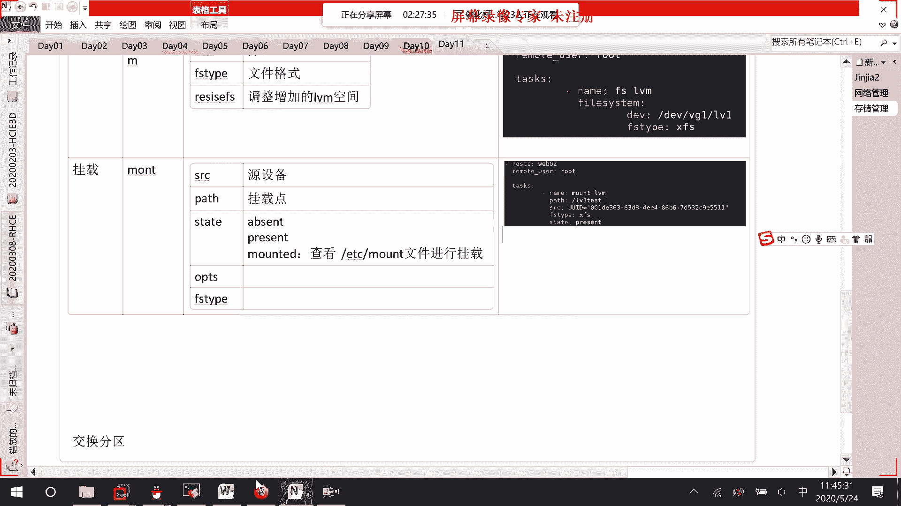

那行这编好了之后呢，我们先来空执行一遍answerable playbook，大c mount，看一下有没有出错，嗯我看哦我少了模块啵啵啵啵啵，啵这边好了之后保存退出，再来执行一遍，等一下。

好这里好了之后，你看没有问题，我来运行一遍，好这里运行完了，我们来检查一下，哦我看一下cat etc，f s table，哎你看在这边的话呢，他是不是就加入了一个信息了，在这里面对吧。

然后接下去的话呢就是说，你这边如果说状态写的不是一个叫做present，你的话呢比如说写的是一个叫做mounted的，我这边再来去创建一个目录，比如说make dir lv 2 tt，稍等一下。

我改一下，这里呢去改一下，叫做lv 2，这边的话呢比如说叫做mounted的好吧。

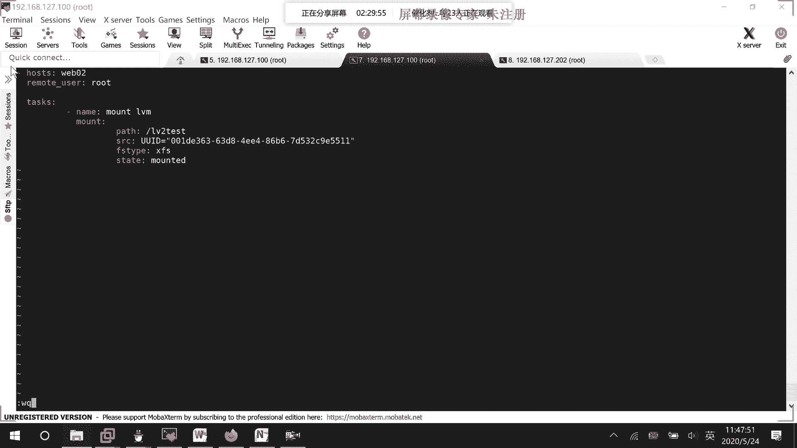

我改哈。

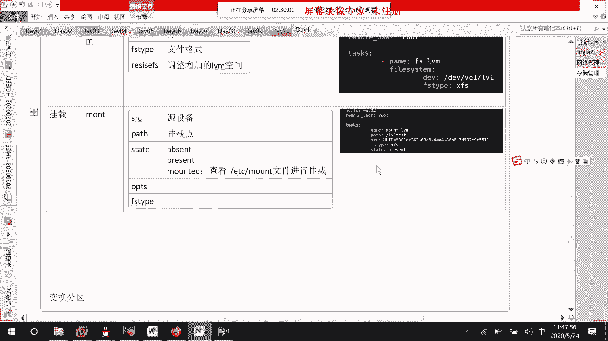

然后呢呃为了就是说避免去发生问题的话呢，这边啊vim etc f s table，我把最下面这条信息呢把它给注释掉，先先注释掉，然后这边我再来运行一下我们的剧本，等一下，嗯好这边好了。

我们再来cat一下，他多了一个lv 2嘛，我们再来df减h一下，是不是就多了一个叫做lv 2的一个信息，所以present的话呢，就是说往我们的f s table里面去加了信息。

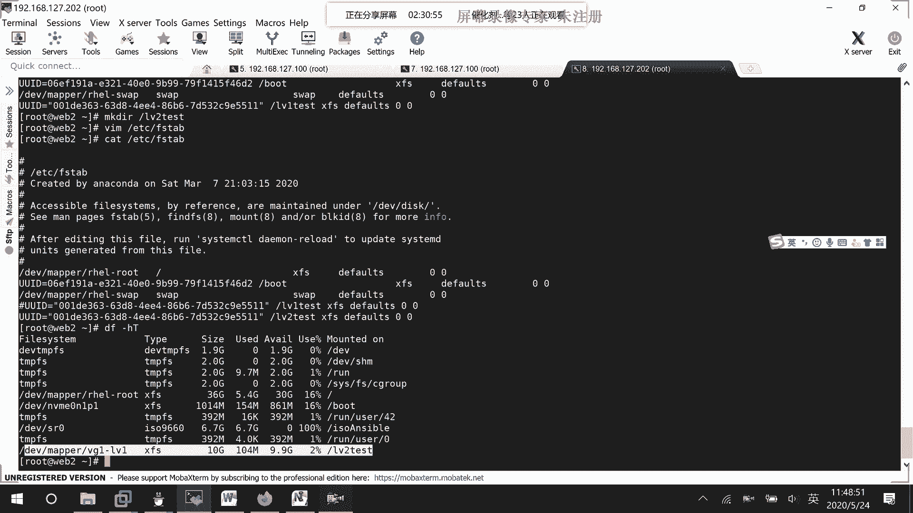

这里我写错了，不是mt是ftb，只去加了信息，然后像这个叫做present的话呢，这个只加了信息，然后这个的话呢，他会去使用添加的那条信息的话呢。

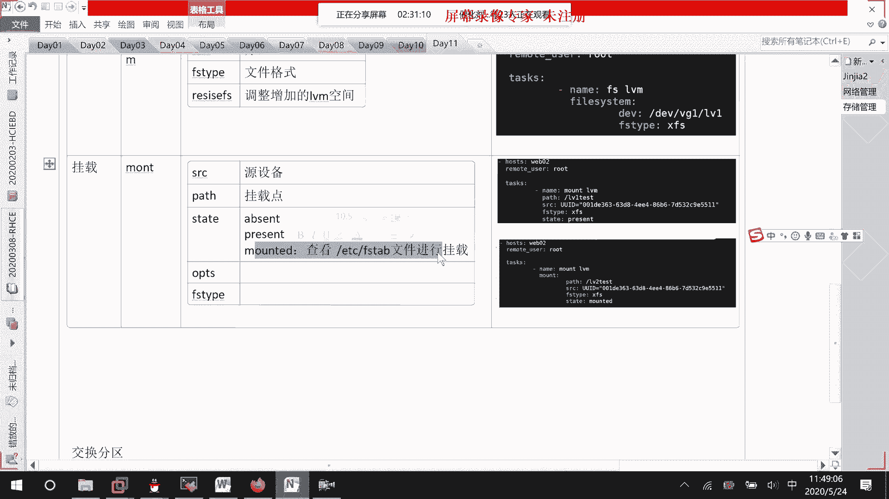

并且去进行一个挂载，然后接下来，如果说我想要把那个条目给删除掉呢，是不是就这个叫做改成，abs e n t啊，我们来试一下哈，等一下。

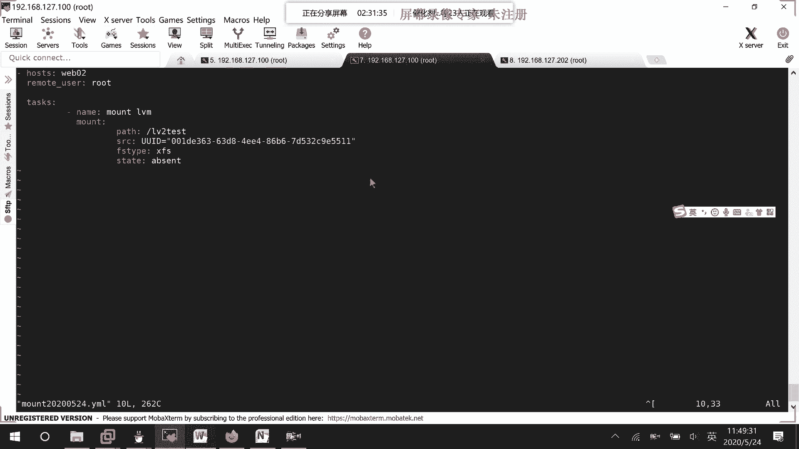

我们再来执行一下。

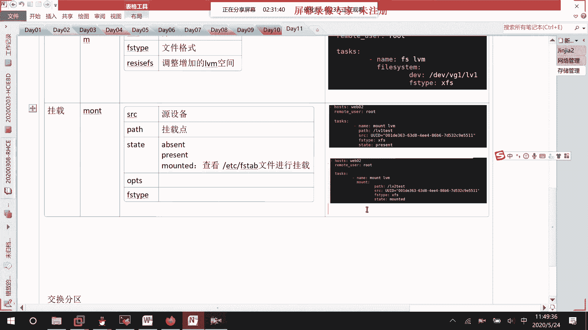

等一下稍微慢一点点，好这里好了之后，我们来看一下d f h l v2 test是没了，cat lv 2 test是不是就没了，就这样子啊，行这里的话呢是我们叫做逻辑卷。

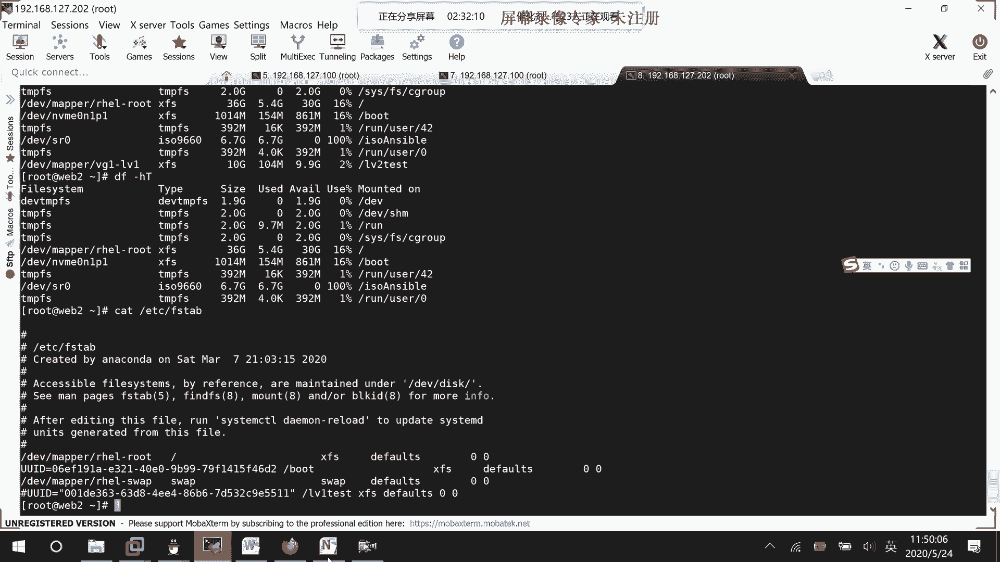

它的一个创建是怎么样的，下面这边的话呢，其实也就是去讲，怎么样对我们的一些分区的话呢，去进行一个格式化挂载啊，对不对，挂载，然后下面这边的话呢交换分区这一块，目前的话呢红帽八它是不支持这个交换分区的。

一个单独模块去进行一个使用的，如果说这边你想要去进行一个使用的话，那怎么办呢，我们可以使用那个command吗，命令就说嗯你分区如果有了，是不是可以这样子，我来写一下哈，第一个比如说是去创建交换分区。

比如说目前的话呢已经存在一个分区了，叫做d vs da 4，那这个的话呢，怎么样把s d s去变成我们的交换分区呢，第一个那就比如说在任务里面呢，我去写个name嘛，其实主要我们刚才在改的时候。

是不是就对下面这里去进行一个修改，比如说这个的话呢就是去格式化，我们的dvs da 4里面的话呢，room怎么样去写啊，这里第一个com m amd command里面的话呢。

嗯要对我们的交换分区去进行格式化，就不能再是什么x f s吧，我们就要去写make snap，后面的话呢就去跟上你分区的一个名字吗，这样就可以了，然后接下去呢你交换分区创建完毕了之后呢。

是不是要去进行一个激活啊，激活交换分区的话呢，就name比如说叫做我们的a c t i v e swap吧，那这里面的话呢要写的第一个也是command的，我们平时在激活的话呢。

是不是就swap on d vs d a s，就使用命令去做就行了，如果这个的话呢是一个临时挂载，如果说你想要去进行一个永久挂载呢，那是不是这个就到一个叫做s w a p就可以了。

source呢是不是就这个嗯挂载点的一个信息啊，格式呢swap是不是就可以了，然后如果说想要立刻去进行激活，但他这边不能去进行激活，你只能去写一个present，就下面那个挂载好吧。

这个的话呢就是我们存储它的一个管理的话呢，是这样子去管的，是这样子去管的，没问题啊，然后上午的话呢我们讲到这一个下午的话呢，再去讲一下叫做网络的一个管理好吧。

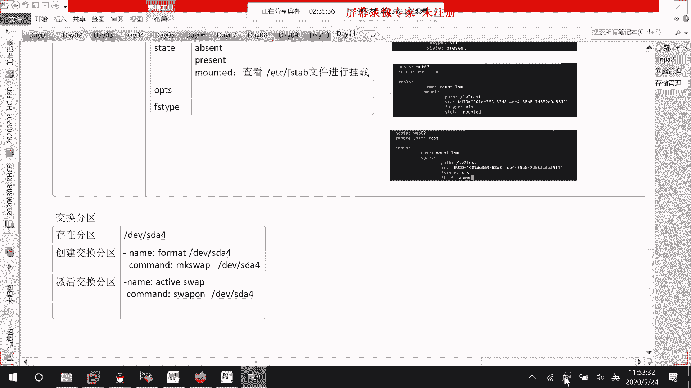