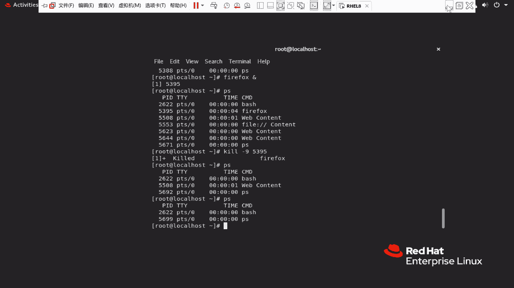

# RHCE8.0视频教程【45课时】 - P4：20200315-RHCE-01 - 六竹书生6682 - BV1su4y1Z7sJ

然后的话呢我们看一下上节课的话呢，我们就说学了一个vm编辑器，vim编辑器，学完了之后的话呢，后面就说讲了一个叫做用户管理的一个命令，像嗯用户怎么样去简单的添加，还有用户的修改。

然后还有一个叫做用户的一个删除嘛，然后的话呢接下来我们来看一下，还今天的话呢，还是继续再来学习一下用户管理的内容，就是说要去看一下用户怎么样去修改，用户怎么样去加入到另外一个主当中去。

这边的话呢你看user add这边的话呢，就是说添加用户，然后呢这个叫做user mode，这个的话呢就是说修改用户，修改用户的一些属性，一些特征嘛，然后的话呢它有哪些特征可以去修改。

像我们在这边的话呢都已经说了，比如说你想要去修改它的登录名是c，想要去修改它的一个加目录的话，那是d想要去修改解释器的话，那是s s的话呢，你们稍微注意一下，这个叫做s bno log。

就是说不允许我们去进行一个登录吗，然后后面然后这里的话呢我们再来看一下，还有一个叫做user del，像直接这样user delete的话呢，就是说删除用户直接去删除的话呢。

像他的一些加目录的信息还是会存在的，如果说你跟一个杠r这样子的话呢，就会把这个用户他相关的，比如说嗯加目录啊，邮箱的信息全都给删除掉嘛，是这样子的，那好这边的话呢接下来我们来看一下之前呃。

有之前有一个人的话，就是说把一个用户给删了，然后的话呢发现再去创建用户的话呢，那个人哦这样子啊，之前就说有一个人去创建了一个叫做user 01，然后的话呢用户id和用户所在组是一个001。

然后他的话呢可能再去创建了一个user，一子多少呢，我看一下，比如说他再去创建一个user一吧，一还是创建回user 01哈，这个时候的话呢，可以发现这个用户是不是使用了之前。

就是说这个用户的话呢使用了之前的一个id，然后的话呢像之前原来的原来的这个user，它的所有文件的话呢，都会归这个叫做新的用户所有吗，所以就是说嗯解决办法是什么呢，像这种，如果说你像原来的一些用户啊。

因为就是说担心一个叫做信息泄露的一个问题，对吧，泄露就是说原来这个用户他创建的文件，如果说不想要归这个新用户拥有的话呢，你可以去把它给删除掉，删除的话呢，首先第一步就是说是去找到那个。

就是没没有所有者的文件，然后的话呢再进行删除，这个是一个，然后的话呢他在群里问的一个问题，就是嗯，你去文件里面去把他的一个所有者和所在组，改成1002了，但是那边还是没有识别过来对吧。

你这边创建用户的时候的话呢，你就需要去指定一下它的一个id，你后面去改变的话呢，它好像是不能生效的，知道吧，你的问题应该是这个，为什么就是说改了文件之后，就是啊文件的那个叫做所有者的话。

那还是user 01对吧，因为你在想哈，比如说一个文件叫做f1 ，它本身是属于我们这个叫做user 01的，后面你去创建了一个叫做新的user 01，他的id是不是0012，那这个file一文件的话。

是不是就属于我们这个新的user 01，然后你把这个叫做id改掉了，其实这个文件的所有者，他的id不是也就变成01002了吗，这个能听明白吗，好像赵玉成在群里问的对吧，这个能明白吗。

因为你这个改掉了的话呢，因为你你的话这个用户创建起来，然后新创建，它使用的是之前回收的001，所以的话呢这个文件还是归这个用户所有，你把id改掉了，那这个文件的它的一个所有者，他也是去被改掉。

改成这个叫做1002了，知道吗，好吧，所以的话呢这里存在的一个问题的话，就是嗯用户在删除了之后，如果说你后面的话呢去创建一个同名的用户，他会去使用那个被回收的id的，如果后续创建同名的用户。

会使用被回收的id，可等一下，好吧，然后就说像这样子的话呢，如果说你想你就是说为了那个用户删了，希望把它其他所有的文件我都删掉的话呢，这边跟你们说了，先去查找到啊，没有人类，没有人的。

没有所有者的一个用户，然后再把那些文件进行删除吗，这个呢在后面我们会去讲，有个命令叫做放的查找，我这边的话呢先把查找的命令跟你们去讲，怎么样去删除的话，那后面咱们再去看查找的命令就放着放着。

然后呢从根目录下开始去找找什么呢，no user，没有人所有让o这里呢叫做no group，g r o u p，这个的话呢就是说哦没有没有所在组，这个o什么意思呢，要么是没有所有者的。

要么是没有所在组的，这个就是一个or的一个意思，如果说你只想要去找没有所有者的，那就是弄user的，如果说并且是没有所在组的呢，就a嘛，所以这里的话呢当o两个之中有一个没有的，那我就想把它给删掉。

把它给找出来嘛，那这种找出来的东西的话呢，我们把它放到div now当中去，这里的话呢就是说不管找到的是对的还是错的，我都把它放到这个div now当中去嘛，就这样子，这个是查找，等到后面的时候呢。

再跟你们去说查找到的东西该怎么去删除掉，这个应该没什么问题哈，然后下面这里的话呢我们来看一下，接下去我们来看一下用户管理，稍等一下，我看一下mark，赵玉辰今天没在，对吧啊，赵玉成，你这个听明白了吗。

好那好，接下去的话呢我们就说不讲用户管理，是讲主管理，因为用户管理我们已经讲完了，首先的话呢来看一下我们用户的信息的话呢，它是存储在哪里的，稍等一下，用户信息的话呢，它是存储在这里的。

叫做e t c g r o u p这个文件，我们来看一下它里面的一个结构的话呢，是怎么样的，cat etc group，这边的话呢就写了很多东西，前面这里的话呢就是呃哪一个小组，这个小组有没有加密。

后面这里的话呢就是说它的主id是多少，有没有谁是属于我这个小组的，有没有谁是属于我这个小组的，就是说除了我自己这个用户之外，还有没有其他人是属于我这个小组的，好吧，小组名，小组成员，小组名，小组成员。

这里的话就是说像这样子的形式，就是说没有其他的用户是属于我这个小组的，那行，这边的话呢就比如说呃小组文件，然后下面这里的话呢我们来看一下，比如说我们想要去查看用户属于哪个组，这边的话呢该怎么去查看呢。

有个命令叫做group，后面的话呢你再去跟上具体的账号嘛，就比如说我这边有哪些用户啊，我给忘了哈，哦我这边有一个叫做tk e d u的一个用户，那这边的话呢就是groups。

然后这边tk du回车可以发现的话呢，就是说我的tk e d u，是属于tk e d u这个小组，然后的话呢像我系统当中这边的叫做red hat呢，它属于red hat这个小组，又属于will这个小组。

它的话就属于两个小组，好吧，这边我复制一个下来哈，那好然后下面这边的话呢，像我这边不是有个叫做tk e d u吗，比如说我想要让他去加入到red hat这个小组，该怎么办。

用户加入到我的一个叫做read the hat这个小组，你们这个的话呢要知道怎么样去加，因为考试当中的话呢，之前会让你把某个用户，这加入到某个小组当中去，但是可能的话呢你一开始在做的时候。

把用户给创建起来了，但是没有加入到其他小组嘛，那你后面知道要知道怎么样去修改，知道吧，那好这边的话呢你的一个命令是这样子的，比如说它有好多种命令，我先说一种user mode。

这个就是我们上一节课说的修改用户啊，就说修改用户的一个特征吗，修改用户特征的时候呢，和小组相关的有哪个呢，杠大小g的话呢，它是不是修改组组啊，但是我现在是想要修改它的一个负数组。

就是说它多在一个小组当中，所以这边的话呢我们要跟一个杠大g的横线，大写的g，然后接下去接下去后面就写加入到哪个小组，在后面的话呢写哪个用户，就是说tk e d u这个用户pk e d u这个用户。

那现在的话呢我们再来看一下tk e d u，它的话呢就属于两个小组了吗，一个的话呢是自己pk e d u的一个小组，后面一个的话呢就是red hat的一个小组。

那行现在下面的话呢我们再给这个tk e d u，再加加入到v这个组，w h e e l这个组，我们来看一下它属于几个小组，我们发现加完了之后的话呢，它还是只属于两个小组，一个组组一个附属组嘛。

所以像这个的话呢，你如果说只有一个杠大g他的话呢，用户同时只能属于两个小组，其中的话呢会把某一个附属组，就是说某个附属组给替换掉，我最新的这个附属组组组的话是不会替换掉的，下面一个问题是什么呢。

如果说希望用户属于两个以上的小组，也就是说现在呢我希望它属于tk e d u v组，还有个red hat读作怎么办，这个就是我们上节课说的，加上一个杠a的一个选项，他的话呢就可以去属于多个小组嘛。

就这里哈这个横线ag，让用户的话呢属于两个以上的一个小组好吧，所以这边的话呢我们来看一下，因为它已经属于v组了，再把它加入到red hat组就行了吗，这个时候再来看可以发现的话呢，它属于三个小组了。

如果说你还想让它属于多四个小组的话呢，再把这个名字去改一下就行了，它可以属于两个以上的一个小组好吧，这个稍微注意一下，就是说单独的a的话呢，你是没有办法去使用的，你的话呢这个a需要和那个g的话呢。

一起组合起来去进行一个使用，这种的话呢是使用一个叫做user mode的一个方式，去进行一个修改，下面这里的话呢它还有其他的方式啊，我们来看一下，还有一种命令叫做g password。

这个的话呢也可以让用户加入到某一个小组，比如说我希望这个叫做tk e d u，加入到哪个呢，呃我看一下加入的root小组吧，不要不要不要这个吧，嗯这个s s h d这个小组好吧。

就是说希望fried heat，加入叫做s h d小组，这个的话呢怎么样去加呢，即password杠a加入谁呢，tk e d u用户加入到叫做s h d小组，这个的话呢就是说给这个小组加这个成员。

上面这句话呢给这个成员加这个小组嘛，他这是不一样的，所以你们的话呢顺序要稍微理理清楚，所以你看这个g password杠a，他的话呢，现在这个用户是不是就属于四个小组了，我们那个的话呢叫做圈君mod。

如果说你只使用一个大g的话，它有一个小组的限制的，我这个g password它是没有任何限制的，你看他现在是不是直接属于四个小组了，也没有说把某一个附属组给替换掉嘛，对不对。

所以这边的话呢就是说将tk d，用户加入到s hd这个小组，那好现在的话呢就比如说呃，我想我想要去把一个用户从一个小组当中去，移除出来呢，将用户从小组中，这边的话呢像那个圈圈mod怎么去做，我就不讲了。

因为我基本上是不用这种方法的，所以我就不去讲了，我用的是这个叫做g password的一个方法，像我现在的话呢，就比如说我想要去把用户tk e d u，从这个s h d小组单中移除出来，怎么样去做呢。

这样子，password横线d，然后的话呢就是tk e d u从s h d单中移除，移除出来吗，现在这里的话呢，我们的pk e d u就不属于我们的，叫做s s h d这个小组，所以的话呢在添加的时候。

这边使用的是减a，在移除的时候，这边使用的是一个减d，你们就说用户小组的管理的话呢，去记住这两个就可以了，添加和移除嘛，这个没什么问题啊，那好这里的话呢，因为就是说小组他没有什么样，很多的一个属性啊。

接下去我们就要来看一下怎么样去创建小组，因为前面这里的话呢，只是说用户他怎么样去加入到某个小组嘛，创建小组的话呢，我们还没有去讲创建小组的命令的话呢，就是group ad，他这个选项的话呢。

其实我们可以发现他很少，首先一个杠f如果说你已经存在了，我的话呢，就是说去使，就是说去使用之前的一个呃他的一个id嘛，就抢占之前的之前小组的一个信息，这小g呢我的话呢去指定我用户的一个id给我。

给我这个叫做小组，就是说给小组指定id，然后呢，这边的话就是说去修改你的一个登录选项，这个我们不去用它，然后下面这里的话呢可以给小组加密，然后这里的话呢就是说让他可以去修改，一个叫做root的一个权限。

这不管我们的话呢，主要就是说去管这个杠小g就可以了，他的话呢可以去指定一个id，然后我们这边的话呢来去加一个group ed，比如说叫做杭州tk e d u，那这边的话呢小组就创建起来了。

然后小组怎么样，就是说用户怎么样去加入小组呢，刚才我们去讲过了，怎么样去删除小组呢，也讲过了，接下去的话呢就是说去删除小组，删除小组的命令的话呢，就是group delete跟group delete。

后面的话呢跟上杭州tk e d u，这个的话呢可以很顺利的去删除掉，像我们这边的话呢，可以发现e t e t c groups稍等啊，你看这里的话呢，是不是有一个叫做kk du的一个小组。

我现在比如说想要把tk e d u给删除掉，你们看可不可以group delete tk e d u回车，这边的话呢不能去删除，为什么呢，因为有用户把tk e d u作为自己的组组。

所以的话呢你就没有办法删除了，如果说呃这个小组当中，这个小组是作为其他用户的附属组的话，你可以去删除，如果这个小组作为其他用户的一个组组的话，你就不能删除了，如果想删除的话呢。

就把这个小组用户它的一个足足给替换掉吗，如果小组作为主组的话，如果小组作为主组的话，无法删除该小组，除非的话呢这个小组它不是任何用户的主组，你才可以去删除，如果是其他用户的一个附属组的话呢。

这个也是没有关系的，知道吧，那好下面这里的话呢我们要来看一下，这个就是一个用户管理和小组管理，应该没什么问题啊，我再讲一下，到时候再让你们去看一下，然后接下去的话呢我们要来讲密码管理了。

这里的话呢分成三个方面，第一个方面就是我root修改密码，第二个方面普通用户怎么去修改密码，第三个也就是说那个呃密码时间的一个介绍，因为上一节课的时候呢，跟你们在讲那个etc shadow文件的时候。

是不是有什么过期时间这些东西啊，我呢把他的一些选项的话呢再给你们介绍一遍，好吧，我就不去修改了，首先我们来看一下root用户，他的话呢可以修改自己的密码，然后呢root用户可以修改所有用户的密码。

也就是说普通的用户的话呢，它也能修改的，如果说他想要去修改自己的密码，怎么怎么样去修改呢，叫做password，然后后面的话呢再去跟上啊，等一下password。

后面的话呢再去跟上你的一个叫做用户的名字，如果说你这边直接不跟的话，他修改的就是自己的一个密码，password这边后面不跟用户名，然后的话呢这边我给大家去改一下，然后因为他是一个超级管理员。

所以就是说这边我这个密码的话呢，因为我刚才起的是一个red hat 123，所以他这边的话呢就一个提示，就一个提示你再输一遍的话呢，他就修改成功了，因为我是超级管理员，现在的话呢。

如果说他想要去修改那个red hat的一个密码呢，password redhat，比如说改成r o t e23 ，好他这边的话呢也说我太短了，但是最后的话呢是不是也让我成功了，所以像这种方式的话呢。

就是说怎么样去给普通用户去修改密码，下面这里的话呢我们再来看一下哈，叫做稍等一下，然后下面这里的话，就比如说普通用户怎么样去修改自己的密码，我这边su到red hat，我先把密码记一下。

然后的话呢你看现在已经是red hat了，比如说red hat给自己修改密码呢，password首先他要先输入自己的老密码，所以普通用户给自己修改密码的话呢，第一步输入老密码r o t123 。

然后接下去再去输入新的密码，比如说red hat 123稍等，你看像这个，如果是你在修改普通用户的时候呢，他对你密码的话呢，它是会校验的，如果说你不符合我的一个密码要求的话，那我就不让你修改了。

他这个密码要求的话呢，不短于三个字符哦，八个字符，然后的话呢要有数字大写小写，然后的话呢还有一个叫做不能有字典顺序的，一个密码，知道吧，这里的话呢我就不去修改了，不去修改了，然后的话呢。

这种形式是不是和root第一种形式很像啊，我的话呢如果说想修改自己密码，能不能用这种形式呢，咱们来试一下password，比如说我后面跟read hat是我自己吗，所以的话呢你看这边它是不可以去跟的。

只有root后面可以去跟上一个用户的名字，知道吧，如果是普通用户，password后面不能跟上用户名，即使是自己的，你也不能去跟了，稍等一下啊，在这，这个的话呢主要是这两种类型的一个修改。

然后的话呢在我们考试当中啊，我们的话呢会登录到一个叫做root用户，考试的时候，root用户可能会让你的话呢去创建，比如说两个用户或者三个用户，几个用户创建好了之后的话呢，让你去修改密码。

这个的话呢考试的考试的时候，不同主机你的密码是不一样的，就比如说我这边几台几个用户的话呢，希望你修改成这个密码，对不对，那这个的话呢像如果说修改，因为之前我们考试的时候修改五个用户。

你如果说哪个字符敲错了，那是不是就完了呀，而且的话呢在敲的时候，它这边是不是全都是啊看不到的一个东西啊，所以这里的话呢介绍你们一种方法，怎么样，就说一条命令使用入场，如何实现一条命令修改密码。

就是说后面的话呢就不需要你再去输入密码了，你们来看一下password，然后后面这里的话呢我看一下，我想一下password嗯，稍等会有一个命令，我怎么突然间脑子卡壳了呢，稍等我一下。

这里比如说一coach，后面这里的话呢，就是说哎等一下后面这里的话呢，就是说引号一下，把你想要改的密码的话呢给放进去，在考试的时候呢，咱们是可以复制粘贴的，然后一coach这个东西，然后管道服嘛对吧。

password这个一coach的命令的话呢，上面这里我们看到了，就是说你后面输输入的是什么，他就给你输出什么东西吗，然后这管道符上节课学过了，前面的执行结果作为后面的执行内容，对不对。

减减standing标准输入，我把它作为我的输入给给谁呢，比如说给我的read heat用户，那好你看red hat是不是就修改了，所以这条命令的话呢，你们可以去看一下，这种方式。

这样子的话呢我们到底设了什么密码，自己是可以看到的，比起这个叫做盲打的话呢，就是说好得多嘛，比起这个盲打的话，那我们就好得多了，对不对，那好这个的话呢没有什么样的一个问题哈，没有什么样的一个问题。

接下去的话呢我们来介绍一下这个密码时间，因为在上一次课的时候呢，我们就说去介绍了什么多久过期的一个问题嘛，我把这里给复制一下过来哈，因为现在的话呢就是要来讲一下这张表，它里面的一些选项的一些信息。

然后你看这个用户名，那那那这个就是说给哪个用户的密码嘛，然后这里的话是设置的密码，然后这里的话呢嗯这边一个冒号，这边就是说，这里一个冒号和这个冒号之间的话呢，是不是什么时候去修改的。

之前的话呢因为没有修改，所以就没有时间，现在的话呢我们再来看一下cat etc shader文件，这里叫做red hat，这边就有时间了嘛，就是说距离1970年你改了多久了，对不对。

然后像这边叫做root，就是说1970年1月1号，你改了多久了，是不是也有一个时间在这里了，就是说这个好像是算过来了之后的话呢，是一个天数，天数是多少天对吧，然后这边的话呢我们来看一下。

如果说你想要去修改一下它最近更新的时间，可以怎么办呢，因为一种方式，你可以通过修改密码去修改它的一个时间吧，第二种方式呢我们作为管理员，比如说手工刷新一下所有用户的一个密码时间，可不可以，这边也可以啊。

我们来看一下，稍等他的话呢改密码的操作是password，所以他的一些选项的话呢都是在这里，比如说这个的话呢叫做我看一下delete啊，错了应该是change change修改。

c h a n g e chain啊，c h a g e c h a g e，就说来修改我们下面这些东西啊，首先的话呢你看这个的话呢，减d我可以去刷新一下你的一个时间的sdof last。

就是说设置一个最后修改的一个时间吗，然后的话呢比如说gd，比如说把它改成20200315，给哪个用户呢，稍等一下，给这个叫做pk edu，后面估计还得跟上时间，他刚才这个时间的话呢。

是一个叫做18329嘛，现在呢诶他这时间的话诶改错了哈，嗯杠b后面应该跟一个时间戳，后面这里我估计得跟一个时间戳哈，所以这边的话呢可能得先去算一下，然后的话呢再把它给指定进来，不能直接跟上这么一个日期。

202003151004，我看一下啊，他的话呢你得去算一下，就是说不能直接去跟上这个几月几号，他算不过来，你自己的话呢要先把它换成这个叫做天数，才可以天数把它给指定进了。

所以杠地后面的话呢你直接跟上天数，天数不能去跟上，这个叫做几月几号的一个时间骗ge ge，然后接下去的话呢这个叫做简易嘛，e的话呢就是说设置他到什么时候过期，对不对，所以这个的话呢我来看一下政府有效期。

就是这个减大一嘛，这里有效到什么时候过，然后接下去的话呢，我们再来看一下它的下一个选项，叫做h就不看了，杠i呢inactive，就是说设置密码的话呢，呃过期了之后，什么时候就说多久之后你才不能用嘛。

这里的话呢就是我们的减i激活时间哦，保活时间也就是说这是大写的i，你密码过了多久之后的话呢，你进来还可以去用天数，然后的话呢这里的话就几天就好了，只有这边是距离，这边的话呢是一个距离，这两个是一个距离。

其他的你就写实际的天数就可以了好吧，因为这边密码至少比如说使用五天，那就是在前面修改的时间的基础上，我再加一个五就可以了吗，对吧，那好，然后下面这里的话呢，我们再来看一下这个叫做l，这不看了。

修改它的一个用户劝解给你们看一下吧，杠稍等一下，叫做bread head，这边的话你看就是说他上一次修改是什么时候，他的话呢，密码过期有没有什么样的一个时间限制，这边全都没有tk e d u。

诶等一下e d u这边的话呢就是说never never，因为我那个时间改的太大了，他的话呢没有办法去算嘛，所以的话呢嗯可能我看一下，改成这种结构可不可以啊，全局age降d，比如说叫做tk du。

他这个改不了，他这个估计真的得一个叫做时间戳的一个形式，才能去改诶，又改成功了哦，他这个就是说你后面可以跟时间戳，或者跟上这种日期的形式也是可以的哈，或者跟上这种日期的形式，就说天数。

然后这边的话呢第三个跟上这种形式，但是后面日期的话呢，具体跟上什么形式，需要看一下你自己计算机的格式是什么，因为我这个是一个叫做英文的一个系统嘛，有些人如果是中文的。

你的话呢先去看一下其他用户的时间格式，再来调整自己的好吧，那好这里的话呢杠l就是说显示，显示杠l的话呢是显示你用户的一个信息嘛，然后这里的话呢，我们再来看一下这个m小写的m什么意思呢。

你这个密码你在修改前的话呢，至少要使用几天，这也就是m嘛，比如说m3 天，m4 天，也就是说你修改完了之后，在这三天或者四天之内，你是不能再去修改密码，你一定要用这么几天线。

然后这个叫做maximum day，也就是说设置，set maximum of day before password change，这里的话就是说你立马去修改的话呢，如果想要去修改。

可能在这么一个范围内，最多的话呢，你使用几天嘛，最多你使用几天，所以这里就是这个大写m密码有效期，这个时间到了，你必须要去改，然后接下去的话呢这里有个叫做w，也就是说密码可能七天前可能快要超期了。

你的话呢去对我进行一个提示嘛，它提示是怎么样呢，比如说你su到red hat登录进来，它下面这里的话呢就有个提示信息，比如说密码还有几天就要就要就要过期了，你的话呢可以去修改一下，知道吧。

所以这里的话呢是我们所有的一些选项，所有的一些选项，我来看一下他刚才那个为什么我修改不成功呢，不应该选取age杠d，比如说202000314dk e t u，他这个就是说使用刚才那种形式也可以。

使用这种形式也可以，刚才这种形式的话呢，可能对于系统有点要求，但是这种形式的话呢应该都是通用的，中间的话呢用横线把它给分割出来，把它分割出来好吧，那这个的话呢是一种形式，我再补充一种形式啊，第四种形式。

也就是说可能我想我作为管理员，我现在创建了很多用户，但是有些同事的话呢还没有入职嘛，如果说那你现在的话呢就设置这个密码，这个密码它已经开始生效了，比如说一个用户user 1。

我的话呢在今天3月15号创建起来了，然后的话呢密码有效期可能是90天，那比如说user一样，他在这个100天，比如说还有提醒时间十天好吧，他在这100天之内都没有入职，那你看一个用户过来。

他拿到一个密码的话，是不是直接就是过期的一个状态，就直接不能去用吧，我们是不是要去更新一下，那这里的话呢我们可以怎么样呢，设置用户在下一次登录的时候的话呢，呃去更新一下你的这个叫做密码时间。

密码时间可以怎么样呢，这样子劝举age杠d，你写个零就行了，然后后面的话呢再写上，比如说tk e d u，那这样子用户在下一次更新的时候呢，会把密码时间设置为它登录的一个时间，这个还是比较常用的。

设置用户的密码时间为下次登录的时间，这个的话呢就是说只更新一次，不是说每一次都进行更新，它只更新一次好吧那行，那这里的话呢最少使用几天，最大使用几天密码到期，你们都知道。

然后i的话呢饱和时间之前也说过了，然后这里减e它这里的话呢是不是距离时间，这里的话呢肯定第一个可以怎么样去描述，我最后一个肯定也可以怎么样去描述吗，比如说我这里强制哈圈距a级大e。

比如说2020314t k e d u回车，这样子的话呢，这个用户诶不对不对，稍等哈，那你来看一下，这样子的话呢，这个tk e d u它是不是就过期了，因为账户过期时间的话呢是3月14号。

所以你可以发现他所有显示的信息，就是这个password一定要被去修改一下，因为你过期了之后的话呢，就表示你这个账号，现在所有的密码信息都是过期的，就比如说我这里su到t k e d u回车。

这边的话呢是不是还可以去登录进来，如果说我先su到red hat，在s u a再s u到t k e d u，他的密码的话呢，我刚才tk e d u的密码是什么，我想一下。

好像我刚才没有设过t k e d u的密码，稍等一下，这边我再来试一下，我先给tk e d u设置一个密码，叫做ecoach r o t123 。

password减减standing给我们的tk e d u好吧，我这边的话呢再给它去设置一个超时时间，然后这我看一下3月14哦，这个估计会有点嗯好，这个没有问题啊，3月14这没有还想，这里的话。

只是说，我这个圈句下句吧，减d它的修改时间，比如说2020年1月1号，因为就是说我这个是3月14号过期，他可能3月15号改了吗，那好这个没有问题啊，3月14号过期。

我su到t k e d u它是可以登录的，如果说我先su到red hat呢，再su的p k e d u，这边的话呢你看他这里就有提示，就我这个账号的话呢已经过期了，你的话呢是无法登录的。

所以这里的话呢你们要稍微注意一下，用户过期了，普通用户无法登录，只有一个你的超级管理员账户的话呢，可以进行登录，超级管理员账号登录了之后的话呢，可以去把你这个账户的有效期，时间去更更新一下嘛。

比如说现项目还没有结束，把它改成4月14号或者4月15号嘛，这样子去修改一下，明白吧，那好这个没什么问题啊，就是说啊这里我再引申一点啊，我们很多时候可能就是说和这个公司，可能项目到期啦，或者怎么样。

你除了去修改它的有效期，还有没有什么样的一个做法呢，可以锁定用户，那你把用户给锁了之后的话呢，其他人就没有办法再进行一个登录了，就比如说我现在的话呢，先把我的t k e d u它的一个抄袭时间的话呢。

去改一下，然后这里的话呢我们来看一下，就比如说我现在的话呢把把用户给锁定，用户锁定的话呢怎么样呢，use the mode，它这里有个选项叫做l把用户给锁定住，l他的话呢就是tk du。

然后的话呢你看id稍等哈，id tk e d u，这里的话呢它的用户也是存在的对吧，su到t k e d u可以又到red hat，然后在su的pk e d u密码的话呢，r o o t123 。

对不对，唉等一下我写错了，这没有关系啊，我再来说一遍r o o t123 回车，就是其实我密码的话呢是输入正确的，但这个用户的话就一直无法登录，这个的话呢，你们就可以去怀疑这个账户是不是被锁定了。

所以用这种方式可以锁定用户，他的话呢呃用户被锁定了，我们的超级管理员可以登录，然后呢普通用户无法登录，它的一个现象是什么样子的呢，是这样子的，叫做输入正确的密码，还是出现认证失败。

就是说这个的话呢很容易让人怀疑，是不是我自己把密码输入错了，这个的话呢不是你自己把密码输入错了，是真的，你可能就是说嗯他这个用户的话呢被锁定住了，这用户被锁定住了，好吧，这个没有什么样的一个问题啊。

没有什么样的问题，然后我想一下嗯，有一个是查看我们用户状态的，嗯这个p a s s等一下e x t p s s，我这里给你们补充一个东西，这考试的时候呢不考，这有个叫做stages。

他的话呢可以去查看用户的当前状态，是怎么样的，password大s，比如说我先来看一下red hat这边的话呢，是不是他什么时什么时候去修改密码的，然后的话呢，嗯最多是最就是说需要修改几天才能去修。

修改密码，然后的话呢这边就是说最多使用多少天嘛，然后这里我们来看一下pk e d u，你看这个的话呢，是不是显示它是一个被lock的一个状态，如果说你一直在登录的时候，发现可能登不上去的话呢。

要么就是被锁定住了，要么就是嗯锁定之后的话呢是怎么取消的，这里有个叫做减u，就是说去进行一个取消，或者的话呢这里有个简易，直接就是把我们的用户的话呢，有效期给到期掉嘛，所以这里哈取消用户锁定。

这里叫做嗯password叫做小写的u就可以了，t k e d u，然后这边的话呢再看状态，他现在就说已经被取消锁定了，然后像上面这里的话呢，一种方式就是说去修改时间，还有一种方式的话呢。

password简易，我们的一个叫做tk du就可以了，好吧，那好简简易，在这里，简易的话呢，他直接就把你的一个过期时间，设置到1970年1月1号，这个时间，好这个的话呢没什么样一个大问题啦。

主要就是说密码管理这一块，你们把你们因为考试的时候呢，之前是一直没有考密码管理，但是你们如果作为管理员的话呢，用户管理又会经常用到吗，所以这边的话呢给你们去提一下，如果上课这这个时候不能掌握呢。

没有关系，课后自己花一点时间去看，因为它这个选项的话呢非常的固定，非常的固定，这边我给你们去找一张图过来哈，稍等，应该之前ppt当中的话呢也是有的，你看首先这里上一次修改时间，最少使用天数。

也就是说啊我改密码的时间，这个最大使用天数，它的话呢，我的提醒时间是在最大使用天数前几天，去进行一个提醒的，然后这里密码超期，然后这里激活时间是多少吗，这张图你们自己去对应一下，这个我也讲不了。

需要你们自己去领悟一下好吧，我这边的话呢休息15分钟，你们的话呢去把这个东西看一下，等一下的话呢我们要去讲用户权限管理了好吧，我看上一次有嗯，那这边的话呢我们继续啊，像之前的话呢讲的用户管理。

如果用户管理你哦，用户管理没有直嗯，没有直接理解的话呢，关系不大，你大致的话呢有个印象，课后的话呢自己去复习一下，所以你们后面再进行复习的时候，自自己去做一遍，不要就是说我写了啥东西。

你就复制了什么东西给我，就好像我这边是tk e d u，你也tk edu的话，那可能就有点假了，你可以改成自己名字缩写嘛对吧，不需要一直给我们公司做广告啊，而且我们公司的名字。

然后这边的话呢这边来讲用户权限管理，首先的话呢我们来看一下如何查看用户权限。

就是这第一节课讲的有一个命令叫做l s j l，这条命令我们可以去看，比如说etc password文件，因为这个l s减l的话呢经常用，所以它的命令可以缩写成l l。

但这里呢不是所有的命令都是可以缩写的，然后接下去的话呢我这边不不来操作password文件，因为它是一个系统文件，所以的话呢很多权限其实你不能去修改，如果修改了的话呢，就不能进行正常的一个读写了吗。

那这边我老样子去到tab目录下，把所有的文件我先给删了，就没有东西了，这个时候呢我简单一点就来创建一个文件，比如说叫做aa文件，那这个时候的话呢l l aa，它这里的话呢就有一系列的信息了。

我这里给你们来分析一下，首先第一个之前跟你们说了，诶，等一下，这里的话呢之前跟你们说过，然后的话稍等啊，这些这里不用管它，我们来看一下，就这样子，它分成了这么几个部分。

第一个部分表示你文件的类型是什么吗，一个是横线，一个是d，之前说了，然后中间这里呢文件权限，然后这后面的话呢就是一个链接的一些信息，就是说有没有进行一些软连接硬连接，然后这里的话呢就是说文件的所有者。

文件的所在主，然后这里文件大小，然后这里创建日期，然后这里文件名字，所以的话呢它有这么几个部分组成，这里的话呢我们虽然讲文件权限，我们先来讲这两个文件，所有者文件所在组什么意思呢，就好像说我买了个u盘。

然后的话呢在我们公司当中的话呢，属于教学不可见教学部，那你看这个u盘的所有者的话呢，是不是就是我自己a2 所在组呢，是我们的一个叫做教学部啊，然后接下去这里的话应该没什么问题啊，然后接下来我们来看权限。

权限的话呢，咱们分成了三个部分，这里嗯我再插入一个表格，权限的话呢分成三个部分，首先这里第一个部分表示文件所有者，他的权限，也就是说我a对于这个u盘，或者对于这个文件的一个权限，然后呢具体什么权限呢。

我等一下会去说哈，然后这里第二段，表示的是文件所在组的一个权限，那也就是说我教学部的一个权限嘛，然后接下来最后这里是不是还有一个r减减啊，这个就是其他用户，就比如说我们公司的其他部门。

像那个通知你们上课的教务啊或者考务啊，对不对，所以这里呢权限我们分成了这三个部分，那好他这边的话呢虽然分成了三个部分，可以发现每一个部分是不是都有三个位置啊，对吧，三个位置。

这三个位置的话呢有什么样的一个含义呢，首先第一个位置，第二个位置，第三个位置，第一个位置的话呢，如果说你有这个权限，就写一个r表示可读，对文件可以读，如果没有的话，那就写一个横线就可以了，知道吧。

有字符就表示有权限，没有字符就表示没有权限，第二个w可写，就像我们现在来看一下，就好像这个a文件我的所有者是可读可写的，所在组只能可读，其他用户也只能可读，然后最后这里还有一个权限叫做x权限。

叫做可执行权限，可执行权限，因为在我们这个linux当中，你们都知道有什么shell脚本啊，这些对不对，所以呢要去进行一个执行，执行的话呢，读写我们都知道，就是说读，如果说对于目录来说，目录来说。

还有一个就是文件来说，如果你是讲的是一个叫做可读的一个形式，目录就是说能不能查看目录里面的内容嘛对吧，然后文件呢是不是可以查看文本的内容吗，如果你没有没有这个叫做可读权限，你里面的东西看不到。

然后这里w呢这个就是能不能去创建文件，对不对，然后像这个呢能不能去修改文件吗，修改文本内容吗，如果说你没有权限的话呢，你是无法进行修改的，然后接下去的话呢我们来看一下，还有一个叫做执行权限。

执行权限对于目录来说，就是我能不能cd进去，如果说你没有执行权限是不能cd的，然后像这个文件呢，就是能不能单做脚本去进行一个执行，文件的话呢，稍微会单纯一点，就是目录这一块执行，这里能不能cd进去。

好吧，这是这几个权限跟你们讲了，接下去的话呢我们来看一下，在这里我们比如说想要去修改文件的所有者，这里的话呢该怎么样去改修改文件的所有者，比如说现在呢把它改成一个叫做reheat。

用户把这个去改成read heat，来看一下修改的命令是这个change online，也就是说修改文件的所有者也好，修改文件所在组也好，我们使用的一个命令是这个change句，稍等一下，诶稍等。

这个修改文件的所有者，change owner，比如说这边要改成red hat吗，哪个文件呢，aa文件吗，这个时候你再来看一下它的所有者，是不是就变成red hat了好吧。

然后然后的话呢我把它写到上面来吧，就不写这边了，然后下面这里的话呢我们来看一下，如果说我现在希望修改文件的所在组呢，所在住把他的话呢改成我们的啊，tk e d u这个小组，这该怎么改呢。

change owner，冒号tk e d u a a，是不是就变成这个tk e d u aa了，这个的话呢是一种方式去进行修改，还有一种方式，比如说我把他的一个所在组的话呢，改成一个reh好吧。

改成就这个劝句group read cat a文件，所以你看是不是从tk du的话呢，变成了一个aa啊，这种方式也能去改，然后现在的话呢有一个需求是什么呢。

修改文件的所有者为t k e d u所在组为rot，这怎么去改，那修改的方式呢，我们这边就不能使用change group了，要使用change owner，我们其实可以发现你这个冒号作为分隔。

前面是所有者，后面是不是所在组啊，所以这边在写的时候呢，就tk e d u冒号r o t嘛，再写上aa嘛，对不对，所以你看所有者tk e d u所在组，rot是不是就改过来了，这个比较简单。

所有者和所在组，我建议你们的话呢记住这个change owner就可以了，如果说呃有有时间有精力的话呢，去把这个叫做呃read change group的话呢，自己去记一下好吧，然后接下去的话呢。

我们要来讲一下权限的一个管理了，权限管理这边的话呢，权限的一个修改，它使用的是这个change句，mode c h m o d，然后它的一个命令格式是什么呢，我们可以来看一下，是这样子的。

全局mod选项，你的话呢用什么样的一个权限，后面跟上文件的名字就可以了，文件的名字就可以了，那好这边的话呢我们来画一个简单的图啊，叫做m s p i n t。

首先这边命令的话呢就是我们的全局mod，然后后面的话呢我们要去跟上，用户的类型是什么，比如说所有者对不对，u表示所有者，然后的话呢是不是还有文件的所在组啊，即表示所在组。

也就是说可以对一类一类的用户去进行修改，表示其他用户，如果说我一次性想要去修改所有用户呢，a他的话呢就表示u g o这三类用户，就是说所有用户，你这边根据自己的实际情况的话呢，可以去设置不同的用户类型。

对谁修改，然后后面这里的话呢你可以怎么样呢，比如说我给某个类型的用户去加上某个权限，让他们加上执行权限吗，或者说减去某个权限，比如说减去r权限，或者减去x权限，对不对，或者让他直接就等于什么权限。

这里我也这样子啊，稍等一下，我写大一点吧，这里比如说减去就是说去除某些权限吗，然后呢加上这个就是说添加某些权限吗，对不对，还有呢等于那这个意思的话呢，就是说让他等于r w x就是说固定权限是什么。

你就直接给他就行了，所以这边的话呢我权限你的一个添加或者修改，就这三种，然后接下来的话呢我们来看一下，后面再跟上权限r w还有一个的话呢，x或者就是说这几个的一个组合，比如说r和w组合，或者r和x组合。

或者w和x组合都可以，然后接下去后面这里的话呢跟上文件的名字，就这样子，所以的话呢它整体的一个命令结构是这样子。

我们这边的话呢来看一下。

按照这个结构来做几个练习，做几个简单的小练习，像这里的话呢我就不喜欢这里，像这里的话呢，就比如说嗯这边不是有个a文件吗，稍等一下，诶这边也不能脱小，那这样子吧，这边的话呢l l aa对不对。

a文件他的一个叫做tk e d u的所有者，是不是一个叫做r w x啊，我比如说给所有者添加一个执行权限，那使用命令的话呢，首先是我们的全句mod没有问题，所有者这边选怪是u对不对。

空格他他的话呢要干嘛呢，添加嘛添加哦，u没有空格啊，直接加加上什么东西呢，执行是不是就是x啊，什么文件呢，aa文件，对不对，那你这个时候再来看一下，我的执行者是不是从刚才没有这个权限，就到了有这个权限。

所以这个就是说给某个用户，给所有者去添加这个权限，现在的话呢就是说给所有者移除，移除什么权限呢，移除一个叫做写和执行权限吧，执行权限，那这里移除的话呢，是不是就全剧mod u减去写权限，执行权限a文件。

这个时候你再来看它是不是确实没有，写和执行的权限了，那行，这个就是说给所有者是这样给其他的用户啊，或者所有用户他也是一样的好吧，这里的话呢就比如说我想要去给什么呢，嗯嗯给所有者赋予，什么权限呢，叫做。

叫做写和执行权限吧，好吧，让他有写和执行权限，没有读权限，没有读权限，这个看一下能不能成功哈，这里的话呢就是全剧mod所有者有写和执行权限，a文件吗，l l a a，那你看他这个是不是就没有读权限了。

就有写和执行权限吗，你等于什么这个类型的用户的话呢，就只有这个权限了，是这样子的一个操作，那行这个的话呢我就跟你们简单的这样去讲，其他类型的我就不讲了好吧，然后下面这里的话呢我们再来看一下对。

接下去我要去讲这个了，这个的话呢是我们的一个叫做字母表示方法，接下去的话呢，我们要来讲一个叫做数字表示方法，数字表示方法什么意思呢，你看这里r w x，如果说我们用那个进制来表示的话，这里是不是一样。

就是说二的零次方对吧，二的一次方，二的二次方是不是就四啊，124嘛，所以就说这边每个位置的权限，它都可以用一个数字来表示，这个时候如果说你要用数字表示法的话呢，它怎么样去写呢，他这样子哈。

首先命令还是全局mod的，然后接下来中间这里的话呢，我们要去写三个数字，三个数字，比如说这里我来看一下一个叫做number 1 number 2 number 3，这几个number它是合在一起的。

然后后面的话呢再去写一个file文件的名字，就比如说第一个number的话呢，它的权限是给谁呢，所有者第二个权限给所在组，第三个权限的话呢是给我们的其他用户的，其他用户的也就是说三你写三个数字。

它自动的会把权限的话呢，给到这三个类型的一个用户。

然后的话呢那这个number 1 number 2 number 3的话呢，我们怎么样去进行一个操作呢。

稍等一下，他这个的话呢number一也好，number 2也好，三也好，它这个是一些权限，它的一个组合，比如说我有一个读权限，那这位是不是有数字啊，后面两位是不是没有数字啊，如果说所有者它是有毒权限。

那我就给他一个四，然后接下去所在组的话呢，它是有读写权限，是不是有这两个权限，这个就没有啊，那它的权限就是一个六，其他用户如果什么权限都没有呢，那这位就是1x0+2x0+4x0，是不是就是一个零啊。

就是说有的这个位数就相当于这里是个一，没有的位数都是一个零，然后接下去呢1x0+2x0+4x0，所以第一个就是四嘛，如果是有读写读写权限的话呢，就是110，对不对，那这里就是1x0+2x1+4x1。

是不是就是六啊，所以这个就是数字表示方法，这里的话呢去写三个数字，比如说这边让哦所有者，有什么权限呢，r w x权限所在组，他的话呢什么权限呢，rw权限，其他用户他的话呢没有任何权限，那我们来看一下。

因为每个位置用一个number表示，他这里的话呢三个权限都有，就是1+2+4，那这个得到的结果是不是就七，然后接下去的话呢所在组2+4，它得到的结果是不是就六，其他用户的话呢什么权限都没有。

是不是就是一个零啊，那这边我们来看一下，如果给一个760得到的结果，是不是我们说的rw x这个权限啊，全剧mod 760 aa文件l l aa，你看这边权限的话呢，是不是还是横向的rw x rw横线。

横线横线横线，对不对，这个的话呢就是我们用数字的一个方法，怎么样去进行一个修改，就到这里就行了，然后的话呢其他的一些特殊权限的话呢，等到时候考试辅导的时候再去跟你们去讲啊，你们的话呢这里只需要知道啊。

字母表示方法，数字表示方法，你们这个叫做数字表示方法，有没有什么样的一个问题，数字表示方法没什么问题的话呢，我下面这里就说接着去讲了哈，接着睡觉诶，等一下，这里如果没什么问题的话，那我就接下去讲了。

在这里的话呢，它文件当中有一个叫做野马的一个概念，源码的一个概念，那这边的话呢我先把文件都给删除掉，rm i fa文件，我这边touch一个文件，fire 1。

然后呢叫做嗯make一个dir叫dir 1，这边我们来看一下fire文件，它创建起来的时候，默认权限是多少，加二是不是六啊，四四，因为r的话呢就一个权限就是四嘛。

所以呢默认情况下我们的一个叫做file文件，它的权限是644，目录文件的一个权限呢，74+15，对不对，755，所以这边的话呢我们可以发现一个，文件就说文本文件，默认权限是644。

然后呢一个目录文件默认权限等一下，一个叫做755，对不对，那为什么啊，普通文件它的一个权限会是644，目录文件，它是一个七五呢，这边的话呢我跟你们去说一下，其实真实的一个场景是怎么样的。

真实的一个普通文件，文本文件，它的权限是666的，可读可写，然后一个目录权限呢它是一个777的，那为什么就是说这个权限的话呢，会变成一个644和755呢，主要这边是有个掩码，掩码。

我们现在的话呢来看一下掩码，you must，你看前面这个零的话呢，表示静置，我们不用管它，主要是看后面这个叫做022022，这边022的话呢，我去把它变成一个叫做啊rw的一个形式，第一段的话呢。

第二段，第三段，也就是说这里所有者，所在组，然后这里的话呢其他用户对不对，这三种类型零二那就相当于横线横线诶，诶稍等一下，我复制一下，横线横线对吧，022的话呢，就是横线后面的话呢有一个叫做w横线。

然后呢后面这个二的话呢，是不是横线横线，他这个野马是这样子的，如果说你本来的权限当中存在了这个权限，我就把你给过滤掉，因为我掩码设的是022，是不是所有者是有w所在组也有w啊，其他用户是不是也有w。

那这样子如果你原来文件的话呢，所在组和其他用户有w权限，我会把你给过滤掉，如果说你本身没有这个权限呢，我是不是就没有办法去过滤啊，那你看相同的我这个野马给这个目录去使用。

如果这个目录的所在左和其他用户有w权限，我就把你给移除掉吗，因为你看这个的话呢，权限是不是刚好是2777减去一个零，22=755，是不是就相当于把这个w给过滤掉，这边我们来看一下我这边的话呢。

比如说把我们的页码设置成000，那也就是说现在不进行任何的一个过滤，touch while 2，make dir dir 2，你看f2 它的权限是不是就666了呀，第二呢它的权限是不是就777了呀。

所以这里的话呢，先来看一个叫做修改页码的命令，就是说像这个东西的话呢，有什么样的一个好处呢，你看如果说你你公司当中已经有一些要求，可能对于其他用户不能去读取某些目录啊。

或者就是说不能去对整个系统做什么样的，一个操作，你把页码一改，后续创建的所有文件，是不是就不用再想着去修改权限这个操作了，因为我直接把不想要给用户的权限，我把它给过滤掉了呀，把这个类型的用户。

比如说其他用户，他只能读，对不对，如果说只能读的话呢，对于一个普通文件只能读的话，那我是不是就是把它的一个叫做写和执行，给过滤呀，那默认创建的文件对于其他用户就不能读吗，所以这个的话呢主要是方便我们。

比如说对系统在管理的时候，你掩码事先设置好，就不用再去修改权限了，明白吗，修改成000的时候呢，我们可以发现fire它的权限是三个6d i r，它的权限的话呢是三个七。

这个的话呢就说明默认我的一个叫做file权限，和d i r的权限，那现在的话呢就比如说把野马，喂一个叫做111呢，那你看这里fire的权限是不是就是五五，然后呢叫做嗯dr的权限，是不是就应该是666啊。

是不是这样子，是不是这样子呢，我们来看一下它这个呢不是这样子的，you must sk，比如说一一，我这里touch fire 3，make di r d i r3 ，你看这个fire 3。

它的一个权限的话呢，是不是还是666啊，我们来看一下，为什么就说刚才那边可以直接去剪，但是这里不能直接去捡吗，你们来看这边的话呢，看到结果，反正这个fire还是666b i r的呢。

它也是不是也是一个叫做666，来看一下，我就看，因为它这三个位置全都是一样的，我就看其中一个位置就好了好吧，一的话呢它的权限是不是横线横线，还有一个叫做执行权限，那好像我这个fire权限默认权限的话呢。

它是个666，那就r w横线吗，a等一下，诶稍等稍等，他这个是不是2w横线，你看嗯，因为它这三个的话呢，一对应其过滤方式呢是一模一样的，我这边应该去改一下，把我的正常的权限写下面，叫做它这个写下面。

就说野马呢我写下面，然后我用户的权限的话呢，我写上面好吧，稍等一下，这里的话呢就是说正常的权限，下面这里的话呢是野马权限，你看被这个一去过滤的话，因为是一个横线是保留下来没有被过滤啊。

w被横线过滤是不是没有过滤，被保留下来，这减号呢我本身没有权限，所以的话呢被这个x过滤完了之后，是不是还是一个减哈，那这边的话呢最终的结果是多少，是不是还是六啊，所以这个的话呢不是简单的加减计算。

是把这个权限给过滤掉，如果说这个位它是有值的，并且我如果说刚好像这个七七刚好也是有值的，那过滤下来就是一个横线，如果说我刚好没有纸的呢，这边没有值的，那这里这里比如说野野马，这边刚好是没有值的。

那过过滤下来是不是就保留自己的本身啊，所以这里fire的话呢，他得到的结果是三个六，d i r得到的结果也是三个六，这个的话呢你们能不能明白，我就这样子简单的讲一下，你们能不能明白，你们给我一下回复啊。

在群里面哈，这个能不能明白，这可以明白对吧，那好那这边的话呢应该可以明白，那我就不说了哈，这边的话呢我再去把它改回到原来022，那像这样子，如果一改的话呢，就说这样子掩码一改。

我们是对整个系统后续创建的，所有文件都能生效的，如果说我只是说在一次的批量创建当中，希望他临时生效怎么办，这个永久生效，这个如果说啊一次创建文件或者目录的时候，它临时生效，就好像我们我们之前说过。

循环的去创建批量文件，这里的话可以怎么做呢，你打一个括号，它就是临时生效了，比如说you must，你的一个权限是多少呢，嗯比如说是一个叫做111，然后呢这里你打一个分号。

比如说touch不要1122吧分号，然后这里呢比如说touch fire，然后这里的话呢再来make dir dir是回车，这个时候l l你看这里fire 4，它的权限就是444对吧。

d i r4 呢它的权限就是六啊，555吗，然后呢你看我们的you must，它还是一个022，所以像这种情况的话呢，就你临时的去做的话呢，可以直接这样子，但是很多人的话呢可能反应不过来。

因为这个还要去计算嘛，其实还不如的话呢，就是说把文件创建好了之后再去修改权限，这几个的话呢随便你们自己去选择，只是说如果你后面再写shell脚本的话，那用这种命令会稍微快一点吗，好吧那行。

那这个的话呢没什么样的一个大问题了哈，我们来看一下，我看一下下面下面没了，然后这边的话呢权限管理我就讲这么多，这边的话呢我去给你们出几个简单的小练习，稍微去做一下吧。

这边的话呢就是说为什么是当前绘画呢，主要是这个basher当中，他去给你设置了，如果说你是小于多少的，稍等一下，如果说你是小于200的，你是一个002，如果你是大于200的，是一个叫做022嘛。

其实如果你这个没有设置的话呢，你再进行切换，它是不会去改变的，这边tk e d u叫做点special r c，这个好像没有啊，哦它它这个的话呢是在etc下面，也就是说这个的话呢等到后面应该会去讲啊。

他的话呢他这个是脚本，每个用户在登录进来的时候讲到这里的话。

我先给你们去讲一下，这个用户的话呢登录进来他会做哪些事情好吧，这扩展一下也是可以的，用户登录的时候会就是说怎么样去操作，首先第一步用户在进行登录的时候呢，我们之前不是都说过，用户有自己的一个加目录嘛。

对不对，首先等一下诶，cat etc应该是r c这一个，这太长了啊，不是e t c r o t，但是r c我看一下，但是嗯稍等一下，应该是profile，首先的话呢你看他进来的时候呢，会先执行一个文件。

叫做special profile，这个文件，第一个执行这个文件，然后这个文件里面呢，它来判断一下自己加目录当中有没有存在，bash rc的文件，如果存在的话呢，我去执行br c嘛。

然后接下去的话呢第二步，因为就是说br c，然后接下去第三步，我去看一下有没有存在这个etc rc这个文件，这个我就不去cat了，cat一下，然后呢回车一下，然后这个beetc下面的一个br c的话呢。

它有什么样的一个特点呢，是不是哦，等一下我看一下，这没什么，这里的话你看像第一个文件和第二个文件，是不是某个用户去特有的，像第三个文件呢，是不是所有用户都有啊。

那这样子在这个besir c下面配置的所有信息，是不是对所有用户都生效，就好像你刚才比如说去切换当前的绘画，那是不是就相当于去重新的去做了一遍，这三个文件，那它的一个you must。

you must肯定去重新读取了呀，所以就变成一个叫做022嘛，如果说你把这段代码给注释掉了的话呢，那他可以对当前所有的绘画都进行一个生效的，知道吧，这个能听明白吗，那个上客服应该能理解吧。

因为主要原因是他这边有you must sk，每次在执行的时候呢，他自己会去更新一遍用户登录的时候呢，所以就是说每个用户在登录的时候，他都会去执行一下这些脚本，好吧，嗯接下去的话呢我们来看一下。

就到这里过，我们用户权限管理的话就讲到这里过，等后面的话呢其实会去讲一个叫做a c l s，它这个的话呢，就是给某个特定的用户去设置权限，我好像忘记给你们发ppt了。

所以因为这个本身就是一个rh 134的内容，我就先不提上来讲了，等到时候呢到了这个章节之后，我再去跟你们讲这个好吧，然后下面这里的话呢我们来讲一下权限管理，权限管理这一块的话呢，我们第一个如何去查看哦。

喂进程管理，第一个就是说如何去查看一些进程，会讲这个，还有的话呢，就是说如何调整进程的优先级，这个的话呢呃像查看进程啊，或者就是说调整进程的优先级的话呢，考试基本上是不会考到，因为像你这个命令的话呢。

我也没有什么样的一个结果可以固化在那边吗，这个的话呢可能在c当中基本上不会考，但是你们需要去了解一下好吧。

那这边的话呢我们来看一下，就好像说我们这里所有任务嘛。

这里的一些进程的话呢，我们在linux当中怎么样去使用命令去进行查看。

在这里的话。

你想要使用图形化界面去查看的话呢，也是可以的哈，稍等一下，他在这里的话呢有应该有一个叫做我找一下，you tell这呃，这里system monitor，其实打开来就是和我们windows当中。

那个进程管理器的话呢是一模一样的，这里我们不看，那好他查看进程的命令，第一个ps你们肯定都是知道的，查看的是我们当前终端它的一个进程，be basher的话呢，就我们这个窗口嘛。

p s是不是就是我们刚才运行的这个命令啊，然后的话呢如果说我想要去查看所有终端呢，或者这里啊。

ps等一下我把这个放大一点，我在这里面，你看这里的话呢，它是不是有个叫做2622，刚才这边的话呢是2831啊，因为它是两个不同的终端，所以的话呢是不同的一个进程，然后接下去的话呢。

比如说想要去打开一个应用程序，是不是firefox啊，如果说你直接这样子去打开的话，那好我们这个窗口就不能再去敲命令了，所以我们后面一基本上会跟上这个语的符号，就是说在后台打开我们的进程。

那这个时候呢我们这终端也能去用吗，这个时候我们再来看一下ps，你看是不是一个better，然后又多了一个叫做firefox啊。

然后这里呢是我们p的一个命令吗，稍等一下哈哈。

你看这里的话呢，firefox firefox下面的话呢，可能被打开了三个网页的一个信息嘛，是不是在这里都有，这边的话呢，如果说我想要通过命令去把它给关闭掉。

该怎么办。

我们这里来看一下pdf啊，这个就是说进程去把它打开，这个我们不管它，然后的话呢这里有一些叫做对tr，然后这里的话呢你看有一些呃进程的一个状态，然后这个状态的话呢，等一下去看刚才有个人的话呢就说了。

去关闭命令的话呢，是不是有个叫做cr k i l l，但是很不幸的是，我这边是没有去写哦，这里有这里有一个禁止控制性哈，就care他的话呢可以导致我们对，导致我们进程的一个终止嘛，然后这个进程控制。

你看care他发送的格式是什么呢，cr信号后面跟上一个id默认信号的话呢，是五表示把我们的进程给终止掉吗，啊就是15默认值是把我们的进程给终止掉，然后的话呢，像我们经常在键盘上可能是不会按ctrl z。

这个的话呢是停止我们的一个键盘，有时候的话呢我们是不是还会看按ctrl c，ctrl c的话呢，发出的一个指令其实是一个二的一个指令，叫做中止键盘，刚才ctrl z的话呢是停止键盘。

这两个指令的话呢是不一样的，那好我来看一下。

比如说这边我来关关一下，那就是p默认情况下，如果是五的15的话，那我们就不管它了，后面的话呢跟上这个编进程，编号4881码回车，这个时候你看我们的一个叫做five fox就没了，发fox就没有了。

然后的话呢稍等一下，我们来看一下。

对by fox没了，然后接下去的话呢，就比如说像他这个15的话呢，它是停止，它是友好的方式去停止的，就是说可能事情处理完了之后，然后的话呢进行一个停止，可以被拦截的，他这个呢cs 15是可以被拦截掉。

如果说我不想要被拦截，就是说强势的要把他给扎实沙沙前，强制的给拦截掉吧，因为我这普通话不太好，杠9k i l l减九九的话呢，就是说中断这个的话是无法拦截的，是致命的，比如说5192关了诶。

等一下p s哦，他刚才fire fox关了之后，所有的都关了，我再来打开一下fire fox。

因为我们刚才关闭了firefox之后的话呢，可以发现叫做有些进程的话呢，他是不是还是放在那里啊，web content可能等了一会儿之后的话才被关掉吗。

如果说我现在k i l l减九five fox的话呢。

5395回车，这个时候再来ps，他是不是就是说关闭的进度，会比刚才那个叫做实物会更快，因为15的话它很多页面没有关掉，对不对，所以的话呢15和九，它全都是把我们的进程给终止掉，一个的话呢是可以拦截的。

一个的话那是不可以拦截的。

这边的话呢我去列几个数字哈，首先ps，然后的话呢，接下去就是说关闭进程用的是一个叫做k i l，l，然后呢这边去说几个常用的一个选项，首先一个是减九不可拦截，终止，然后呢还有一个叫做减15。

这个的话呢是一个默认值，它的话呢是可以拦截的，而且他是友好的中断进程，然后接下去的话呢，我们刚才讲了一个叫做20 20，什么呢，就相当于我们建按了ctrl加z，它这个是什么呢，是停止键盘的一个使用了。

然后还有一个的话呢减二，他这个的话呢相当于我们平时按的ctrl加c，它是什么呢，中断我们键盘的一个使用，诶中断键盘使用，像这里的话呢，嗯就是这几个程序，就是说这几个指令的话呢，我们会用的多一点。

杠九是用的最多的，减九用的是最多的，好吧那行，然后这里的话呢我们来看一下。

像这个p s的话呢，我们只查看到自己的终端，如果说我想要去查看所有终端执行的信息呢，p s减a u x，这边的话呢就是说你看信息明显多了很多嘛，就不仅仅只有我本地的了。

还有就是说其他终端的信息都在我们这里，我们可以发现这里的话呢，p i d是不是一的一个进程啊，叫做system，在我们linux linux红帽发单中的话呢，第一个进程就是system的一个进程。

这个了解一下就行了，然后的话呢前面这个用户这里p i d的话呢，就是说进程的编号嘛，我们关闭进程的话呢，后面就是跟上这个进程的编号，然后下面这里呢cpu内存虚拟的，然后的话呢rs的话实际消耗的一个资源。

然后t t y的话呢，就终端像这些打问号的终端都是一些系统进程，然后这个state的话呢，就是你当前这个进程的状态是怎么样子的，我们可以发现在这里的话呢，有去给你们去列举了几个进程状态哈，稍等一下。

这里比如说s它可能处于中端，就是休眠状态或者怎么样嘛，然后的话呢，像这个i它可能是某一个的一个子集，对不对，这里的话如果你们感兴趣的话，自己去对照一下，然后下面这里的话呢，start什么时候开始的。

time持续了多久，然后command用什么命令把它给进行一个打开的，这个没问题，像这个的话呢。

p s它是静止的，就打开了一次之后的话呢，他就不会去刷新了，所以p横线a u x查看所有的，然后如果说我希望进行一个实时刷新，实时刷新有个命令叫做tot。

你看14哦，不对哦，这里五秒八秒，11秒对吧，他这个的话呢就是说三秒钟跳动一次，三秒钟跳动一次，当前的话呢这个系统起来两个多小时了，然后有两个用户登录，平均负载0。6%几啊，然后一点几啊，0。8几嘛。

这个信息，然后任务总共有几个几个运行，几个睡觉，几个停止的几个僵尸进程，然后的话呢我们的内存的一个情况，我们交换分区的一个情况是怎么样子的，是不是都在这里进行一个显示啊，这没问题啊。

所以这里的话呢有个命令叫做top。

他的话呢实时刷新刷新时间的话呢是三秒钟，如果说你自己想要去修。

修改它的一个刷新时间的话呢，也是可以的，这个的话你要退出，你按一个q就可以了，好吧，t o p l o不q，这边的话呢top然后呢减低一秒跳动一次，12 13 14 15。

对不对，所以这里叫做top，减d后面一这个的话呢呃刷新时间，三秒哦，默认为三秒，这里的话呢嗯将其修改为一秒吗行吗，这里的话呢没什么问题啊，如果说我现在的话呢，不想去看到具体进程的信息。

我只想去看前面这一部分概要的一个信息。

可以怎么办呢，up time，就说起来了多久嘛，平均负载的一个情况是怎么样的。

这个up time，可以去进行一个查看，那好因为像我们等一下的话呢，可能去关闭进程啊。

或者怎么样，是不是首先的话呢要去查看到我们进程编号了。

才能去进行一个关闭啊。

所以现在的话呢我们来看一下，如何去进行一个查询，进程号查询，他这个查询的一个方式，首先你是不是这固化下来p u p s a u x啊。

管道服grp five fox，这是一个方式，因为你这个ps因为你这个进程在运行的时候呢，进程号是不是就不变了，所以ps你查询出来之后，我在里面再去搜索我的five fox，首先是这个5810。

因为下面这里的话呢，可能是一些就是说其他的一些网页信息嘛，你看tab tab对不对，子id，所以这个是一个叫做5810的一个信息，在红帽七之前的话呢，他没有这么详细的信息的，红帽期的话呢。

之前就一个系统的一个进程，还有的话呢把这个firefox变红的一个进程编号，就这个字体变红了，就两个的红帽八，他想显示非常详细啊，以及里面哪个网页的紫禁城。

它都会显示出来，那好这边的话呢这个是不是可以查询到进程号。

然后接下去的话呢还有什么方法呢，p rap firefox是不是直接就出来5810，比如说有时候我忘了，我只记得fire呢，他这个也是能查的，只是说查询出来好多个，他的话呢没有说具体的命运是什么。

要你自己去判断一下，所以像这个p rap的话呢，适合于你的话呢。

对于进程名字非常了解的一个情况，算的话呢你可能都没有办法去判断嘛，对不对，然后接下去除了这个呢，还有什么样的一个命令呢。

叫做p i d of，比如说fire，我就查一个fire，他是查不到的fox，他这个的话呢是不是又可以查到很多个，把所有和firefox相关的都列举出来了。

所以这边的话呢我比较推荐你们记住这个。

因为这个的话呢它显示的信息非常的多嘛。

如果说你已经完全掌握这个进程的名字的话呢，你可以使用第二种方式，第三种方式的话呢，我不太推荐你们去记好吧，那好这里的话呢就是进程查询是这样子的，然后呃进程关闭的话呢，上面我们这也讲过了嘛，对不对。

像这里的话呢，ps这里看到的所有进程号，都是全局的概念，都是全局的，然后的话呢我们刚才在打开一些，比如说火狐啊的时候，是不是后面加了一个这个叫做雨的一个符号。

稍等哈，是不是加了这个叫做余的一个符号，就表示这东西的话呢是一个后台打开吗，所以的话呢我们像ps。

他可以去查看全局的一个进程，连后台的都能查看到，如果说我现在只想要去查看一些，后台的一个进程呢，jobs你看jobs。

这里的话呢它所有的进程号，包含了前台加后台的所有进程，我现在的话呢比如说想要去说啊，我后台去执行的一些命令，用这个jobs可以去进行一个查看，比如说我现在你们先来看一下。

我来去启动，因为我们在windows当中是不是有一个notepad，在我们linux当中有一个叫做edit。

他这个的话呢就相当于是记事本的一个功能，你看我这边打开了对吧。

123可以写吧，这里呢123也可以写对吧，或者我这里去写一个if configure可以执行吗，他现在是不能执行的，除非我把这个东西给关闭了，ctrl z是不是就相当于care，然后的话呢减20，对吧。

他这个的话呢，control z我中断掉了，对不对，我这里if configure是不是可以去显示，但这边如果说我再去写了3456，是不是就没有办法去写了。

我再来说一下我刚才操作的一个步骤哈，首先第一个使用g edit打开我们的记事本，这个时候出现了一个什么样的一个问题呢，记事本可以操作，然后呢终端不能操作了，然后接下去第二步我干嘛呢。

control加z是干嘛，那就是jz的话呢，我们刚才可以看到是不是中断键盘的一个操作，所以这个时候的话呢记事本不能操作了，然后呢终端的话呢是不能操作啊，这像这个ctrl z的操作的话呢。

就相当于是把我们的前台进程，就是说切换到我的后台当中去了，在那边去进行一个停止吗。

你这这个时候的话呢可以再来看一下，叫做j o b s，你看是不是g edit的话呢，它是不是一个停止的一个状态，如果说我现在又想要让这个后台进程，去激活一下呢，back vg。

他这个进程编号是不是一个二二嘛，回车你看这个时候他是能写的，这里的话呢也是能写的，因为他现在的话呢，已经跑到了我的一个后台进程当中去了，所以呢我这个bg，只是去唤醒我的一个后台进程，如果说这个后台进程。

我想要去回到前台当中去呢，f几二回车，这个时候他又不能写了，这个时候你看这里，if configure。

它不能用了，知道吧，稍等一下。

这里没有，这里看不到他那边了，所以的话呢，嗯这个control z是把我们的一些前台进程，就卡在那里了，放到后台当中去，它是不能操作了，然后第三步的话呢，vg后面跟上你的一个叫做后台进程编号。

他会怎么样呢，你这边叫做记事本，可以操作，终端的话呢也能够去操作，能明白吗，因为他已经加入到我的后台进程了，然后接下来第四个fg跟上后台进程编号呢，这个命令的话呢是把后台，你的话呢把它放到前台当中去。

他的话呢记事本可以操作，我的前台不能操作，所以这个后台进程的话呢会有这几种状态哈，这几种状态，这就说前台后台切换应该没什么问题啊，我就不去画图了好吧那行。

然后这里的话呢我control z一下jobs，如果说我现在想要去关闭我的g editor的话呢，有几种方法呢。

关闭后台进程的方法，第一种方法，我们通过全局的方式去进行一个关闭。

ps a u x rap，比如说我现在去关闭g edit，好吧，你看这里的话呢，是不是就有一个6310的一个进程啊。

我这边给你们来关一下，稍等一下。

你看6310，我来关一下，叫做k i l l减96310回车，哦我写错了，6130回车，它是不是就没有了，这种的话呢就是使用我们全局的一个进程编号，然后你看一下像这个终端当中jobs，他在这里的话呢。

是不是可以看到一个叫做running fire fox啊，像这里。

如果说我想要使用一个叫做后台的方式呢，还有一个就是后台关闭啊，这里就是说后台的一个方式，其实就是一个局部的一个方式，怎么样去关它，关闭的命令也是tr减九信号，随便你们去给。

只是说我现在是想表示本地的前面跟个百分号。

百分号，这里是不是第一个进场by fox还没关吗。

百分号一就可以了，就可以关掉，如果你不跟百分号的话，就表示系统的第一个进程，如果你跟了的话，就表示我局部里面的第一个进程能明白吗。

第一个任务，所以这里care减九所有的信号都是一样的，冒号哦不对，百分号后台或者就是说局部的局部编号，你看到的是几就关闭几，因为就是说我们在工作的时候呢，会打开很多后台进程，如果你都去全局当中找的话呢。

特别的麻烦，明白吗，那行这个像我们嗯进程当中的话呢，我讲这么多，接下去的话呢，我们来讲一下进程优先级的一个调整，因为像我们有时候电脑，它这个进程优先级什么时候生效呢，只有资源不够用的时候。

我的话呢会参考我设置的优先级，去给设备进行一个调整，如果说本身资源就很充沛的话，那我这优先级的话呢是不生效的，明白吗，那行这里的话呢我们来我们这边来看一下，默认情况下大家进程的一个。

后台进程是指当前g u i的前台还是开的shell，上面的热情，钱钱等一下，那就就几分钟了，我这个进程调整，我下午再讲吧。

