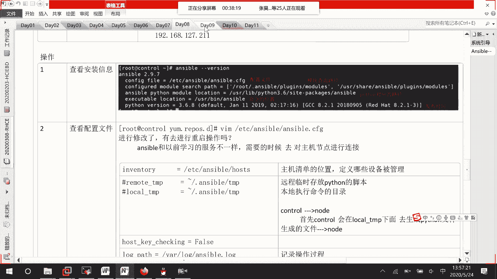

# RHCE8.0视频教程【45课时】 - P50：20200524-RHCE-all_recv - 六竹书生6682 - BV1su4y1Z7sJ

你们到时候的话呢，可以按照这个去进行一个复习吧。

首先，首先这里的话呢，第一次课我们去介绍了unstable对吧，也就是说让大家去了解一下什么是answerable，然后接下去的话，第二个就是说我们去部署我们的unstable吗，其实这边的话呢。

也就是说告诉我们怎么样去控制，我们的那那些叫做节点受控主机嘛对吧，然后接下去的话呢，后面我们就先去学习了一个模块的，一个就是说基础的模块信息嘛，其实这边的话呢也就是说去实施我们的playbook。

因为我们一个一个模块学会了之后呢，才能在playbook里面去进行一个编写，对不对，然后接下去第四个我们的话去学习了什么呢，怎么样去使用变量，就说自定义变量，还有系统当中的一些变量的话叫做事实吗。

就是这里。

就好像类似于用这条命令叫做answerable m setup，回车诶，等一下w一比零二，嗯稍等这边的话呢，它其实显示出来的东西是不是就这样子，就，是诶他这个信息好像没有特别的全哈，没有特别全。

其实这些的话呢，因为都是从远端主机上去收集过来的，这边的话呢你可以看一下，就这个啊fix是不是就是这个事实啊，我们到时候呢想要去调用的时候都可以去获取，今天的话呢就有个同学去问。

如果说我想要去根据磁盘的一个情况，比如说磁盘剩余空间只有五个g了，我只想要去划分它的一个叫做50%的话，那怎么办呢，那首先你要去判断一下嘛，这边的话呢有这么多信息，比如说这边啊。

然后减a f i l t r，这边的话呢我来想一下它的一个变量是哪个嗯，device，稍等一下，好这里的话呢它就显示出了这么一个东西，不再更一下吧，answerable device。

你看就比如说我们刚才的话呢，在w e b上的话呢，不是有一个sda嘛，对不对，他的话呢有一个参数叫做size 20 gb，然后上面这边的话呢s d a3 ，它大小1。86，sda 2大小1。86。

然后这边的话呢它是有一个叫做九点几啊，其实基本上都要向上取整一下，你把这些空间剪掉的话呢，就是我这里剩余的一个空间吗，剩余的一个空间对吧。

因为这边没有直接去计算出来，剩余的空间是多少，这些的话呢叫做事实，反正就说你觉得是从系统上可以获取到的，那你都可以从事实这里面去找变量的名字，获取不到的，那就自己去写嘛，等一下诶，这什么情况。

然后下面这边的话呢我们要做的一个事情，就好像我们在进行创建分区的时候呢，可能会创建很多个，或者的话呢就是说我们硬盘的话呢，那你都要去进行分区嘛，那这个时候的话呢我们就讲到了一个任务控制。

就比如说他的一个循环啊，这些信息对不对，这里，稍等我想一下应该是怎么样去说，就写任务控制吧，这里就比如说循环判断，对不对，还有的话呢出现错误的该怎么办，出现错误的话呢，我们之前说过一个叫做ignore。

对不对，忽略掉嘛，其实的话呢还有一种方式，我们可以去进行一个处理的，就说我们可以是这样子的一个结构哈，我这边来编写一个哦，我就编写之前的吧，v m叫做network，这里这里的话呢我写了一个task。

对不对，但这个task的话呢有时候可能会出现问题，那我这边的话呢，该怎么样去对它进行一个拯救呢，啊我们可以这样子稍等，这样子，比如说我要去写这个，我去改一个，这个是，这个叫做test。y mli。

啧啧啧，这里面的话呢，就比如说我现在的话呢想去更新一下啊，呃我们的数据库吧，然后这里的话呢，我们的话呢，可能就是说把这里当作一整个任务块的话呢，去进行一个执行嘛，database单做一整个任务。

快去进行一个执行，那好就不要再写一个单独的一个模块了，我们这边block block的话呢，就表示定义某一个执行的过程子过程，那我们这边的话呢是什么呢，比如说减n name，这边的话呢。

我这边要么install http，要么install e database吧，date吧好吧，就写这个，然后里面的话呢我们是不是要去写模块ym name，比如说哎。

比如说我们这边的话呢要安装的是一个mysql，然后接下去的话呢，它的一个present是不是应该a state，是不是应该是present p r e s e n t嘛，就这样就好了，那你看有时候。

如果说我们的ym源挂载点没有去挂载，那是不会有问题啊，那这边的话呢我们就要这样子去写一个，如果说你上面出现问题了，ie s c u e rescue出现问题了，你上面出现问题了。

那好来执行我下面这个语句，比如说减n yin store http，或者的话呢你的样貌也没挂载嘛，我怎么样去修复你呢，就说去correct ym可以吧，里面的话呢你就写一系列它的过程嘛。

我这边现在为了方便的话，直接就写去ym install tree好吧，随便去写一个，也就是说block出现故障了，那好会来执行我们这个rescue的一个命令，去进行一个恢复，去进行一个恢复。

那这边的话呢比如说就是压模模块name，tree，然后这边state，然后这里present嘛就这样子就可以了，如果说上面出现问题了，那你可以rescue就说把ym员都做好了之后。

我们再去执行上面这个语句嘛，就是说把这下面语句呢在下面再去写一遍嘛，那这个有什么好处呢，因为你看啊，我不需要每次的话呢都去创建亚目园，除非有问题了，我创建一下再对自己进行一个安装嘛。

这是就就是说可以节省后续的一个时间，这是一个还有一个是什么呢，就是说不管你上面是执行成功的，还是执行失败的，因为上面呢我知道它很容易出现失败，我就这样子把它定义成一个block。

然后不管你上面是执行成功的还是执行失败的，我都会来执行office里面的语句块，比如说要么install vs f t p d，那这边要么你就照常去写name vs f t p d。

然后这边state p r e s e n t能明白吧，就说，就这边在进行错误处理的时候呢，除了我们之前说的一个忽略之外。

或者的话呢把它定义成对的之外，还有这里一个rescue，还有一个的话呢always这两个信息啊。

稍等我去写一下，应该写哪，第十天不可能，啧啧哦。

这里我在这边的话呢去补充一下第三个，这里的话呢block他的话呢作为定义的子块，如果说，如果block执行失败，ie scue内容可以执行，否则不能执行，然后接下去的话呢。

就是说如果就说这边always子块，无论block，是否执行成功，都会执行好吧，所以这边的话呢有这样几种去进行，叫做错误处理的方式。

然后下面这边的话呢，我们再来看一下第五个内容的话呢，就任务控制啊，循环这些东西，还有的话呢是不是讲了一个叫做嗯计划任务啊，计划任务你们的话呢模块怎么样去用，也告诉你们了，在这个压码文件当中呢也可以去做。

接下去的话呢第六章就是去创建文件，和目录，这个我们是讲过fire fish copy这些信息吗，第七章的话呢，我们是不是讲过一个叫做角色啊，哦就是说那个呃数控主机的管理，就是我们之前说的那个通配符吗。

就新号啊，还有的话呢冒号啊这样子去进行一个分割的，然后后面第八章的话呢，我们是不是讲了一个rose，就是嗯他的一个角色管理吗，然后接下去的话呢，第九章的时候就是answerable故障处理。

因为就好像我们平时在做的时候，unstable的话呢就会出现一个问题，就比如说嗯，这边的话呢我随便去写一个啊，比如说这个hosters，我东西丢了，我这边answerable playbook减大c。

然后fire点雅马文件，它的话呢就会出现一个提示信息，告诉你第几行，第几列的话呢可能出现问题了对吧，还有时候的话呢，你们可能会遇到这个sy n ax干track，应该是这个，我看一下减减。

list这个是加密不对，稍等一下，unstable playbook，哦在这儿看到了，这个的话呢，它其实显示出来和那个checks是一样的，然后你看这边如果说我把它改回正确的呢，这里把s补回去。

在这里把s补回去，再检查一遍，没有错误的话呢，他直接就把这个playbook的名字给我显示出来的，如果有问题的话，那我们就里面去找嘛，好吧那行。

然后接下去的话呢，我们也学了一个计划任务怎么写吗，对吧，就那个cortable模块会写，其实在里面的话呢应该全都是一样的，然后到这里过的话呢，它就结束了，其实这个c当中它的unstable很简单。

就讲这些东西你能去写压码文件，能去改基础的增加二就可以了，然后自己的话呢能去用一下，rose的一个角色就可以了，然后这边的话呢，我们不是会有很多的一个模块要去使用吗。

稍等一下，这边，就是所有的一些模块信息，我把这个发给大家。

比如说我现在的话呢，干就要去看这个和我们啊，这都有显示出来它的一些参数啊，是怎么样子的好吧，或者的话呢你想要去看其他的，就比如说像f e t c h o ym吧，啧啧啧，只是说这个站点呢会打开的慢一点。

诶怎么又是这个界面啊，这里就所有的一个模块的话，全都在这了吗，像我们要查询的ym在这里没有，估计的话呢，你还得去下一页，young嘛什么的全都有哈，main我们的yum模块哦，在这儿在这儿。

你看这个模块要怎么写，有什么参数，这边全都有教你们的，然后下面这边的话呢就是它案例，如果说你想要去安装一个最新的，去安装一个包啊，然后的话呢还有就是说去移除某一个包啊。

还有这边的话呢去测试我们的一个亚目园，这边全都有，所以的话呢自己多多去看一下，知道吧，明白吗。

在这上面的话呢。