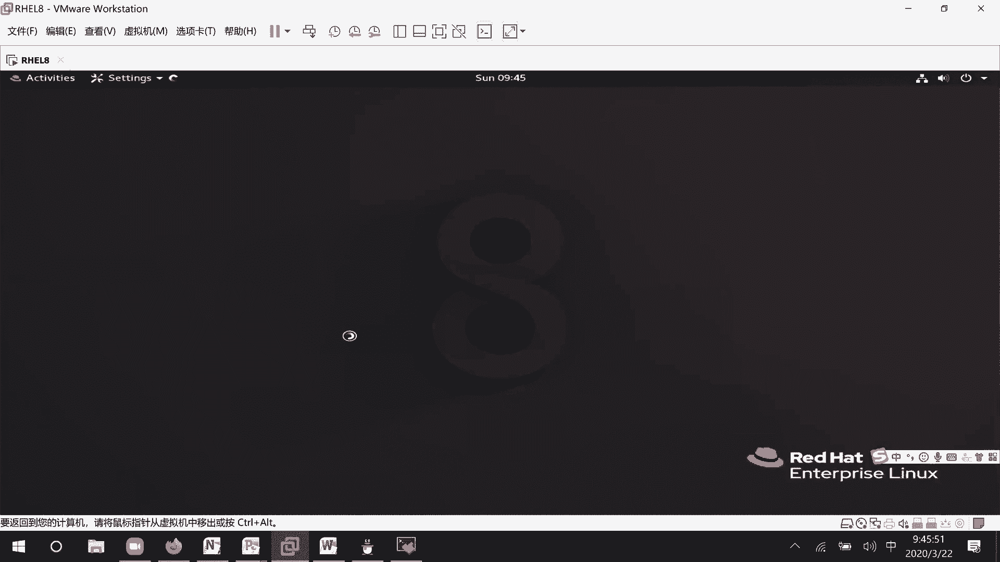

# RHCE8.0视频教程【45课时】 - P6：20200322-RHCE-01_recv - 六竹书生6682 - BV1su4y1Z7sJ

然后今天的话呢这里我们开始来上课哈，我看一下这个有好来上课，今天的话呢一些内容就是说呃日志的一个查看，还有的话呢时间同步，之前的话呢，这个时间同步在我们普通的环境上的话呢，他要等很久。

但是考试的时候一下子就能成功，因为考试的时候呢，他把一些变量都已经设好了，然后接下去的话还有一个叫做网络管理，这个网络管理这一块非常重要，因为我们在考试的时候呢，它里面是不是一台一台的虚拟机啊，对不对。

他的话呢会有一个叫做服务端和客户端的概念，首先这些设备他要能互相去联通吗，所以你要学会去怎么去配i p地址啊，还有的话呢怎么这样去修改ip地址，在七点版本当中的话呢，他还去考。

如果我一台电脑有两个网卡的话呢，我怎么样把它给绑在一块嘛，七点当中也考，然后这边的话呢八点我们也要去学哈，然后接下来我们来看一下下一个章节的话，就是文件的压缩和归档。

这个文件压缩和归档的话呢是怎么样子的呢，也就是说他在一些呃系统当中放了一些文件，让你把它给找到，找到了之后呢，对这些文件去把它归档，归档好了之后再进行一个压缩，就放在那里。

到时候的话呢会有机器自动去评分嘛，然后下面这里的话呢我们再来看一下，接下去就是我们软件管理，我们上节课的话呢，就简单地学习了一个叫做服务的管理，服务管理可能就怎么启动，但是的话呢在做服务管理之前。

我是不是先去安装了一个软件，所以的话如果软件没装，那你这个跟系统上面根本就不存在这个服务，不能提供这个功能，这样子的话呢也不需要你去管理了吗，所以这个的话呢是我们今天安排的几个内容，内容的话呢。

我就不安排太多了，因为咱们上课进度的话呢呃有有点快了哈，好吧好，上节课的话呢我们学完了日志管理之后，后面的话呢，就是说没有让你们去怎么样去找日志嘛，好吧，这边的话呢查看日志，它的一些命令的话呢会比较多。

这个的话呢在你们工作当中有些人会用的，首先第一个的话呢就是说tell，就说查看为几行的信息吗，记行的信息，啧啧啧，但是这个的话呢我们之前学过，像这个tell的话呢，后面是不是要跟上一个文件的名字啊。

这里我们来看一下pea i l，这里有个选项的话呢叫做f f，他的话呢叫做follow name，description，我看一下这个我翻译的话呢哦翻译tr减f，他这个的话呢就是说去实时的去查看。

我们日志的一个信息，比如说呃vlog message嘛，就是说他这边如果有增加的话，就会实时的去给你显示出来，所以的话呢像之前他这个是不是静态的，去进行一个查看，这边的跟上一个减f。

它的话呢就可以进行一个实时性的查看了，好吧，实时性的查看微信行的信息，只是说我们现在的话呢就是没没有做，没有做什么事情，他这边就没有日志产生了，ctrl c的话呢结束查看，然后还有一条命令的话呢。

hotel 2他的话呢就缩写，因为这条命令经常用到tifa，他这边没有哈，他这边的话呢没有这个命令嗯，我看一下，这个的话呢这个版本当中没有cf的一个命令，在七版本当中的话呢，它有一个叫做cf的一个命令。

在我们的八版本当中没有这个命令，然后接下去的话，那还有什么命令可以去查看日志呢，这个叫做jia jia control，他这个的话呢一回车的话，就是把所有的日志信息给你显示出来好吧，显示所有的日志信息。

他这个的话日志信息就是说从最开始就说，这边的话呢就什么时候开始吗，2020年3月22号几点到我们，2020年3月22号几点，这边的话呢给我们去进行一显示好吧，她这边的话呢。

因为我开机的时候之前没有产生什么事情嘛，后面的话才进行一个登录，啊这个特别多，好吧那行，然后接下去的话呢还有一个什么呢，如果说你想去在这个日志，因为它这个是一个日志系统，它是所有的信息。

刚才这个的话呢是不是针对某一个文件啊，如果说你想要实时性的去查看所有信息的话呢，这个可以怎么办呢，jia control，这里的话呢，减f他这边的话呢，就会对所有的日志信息，进行一个实时的一个显示。

好吧，实时显示所有的日志信息，那好然后这里的话呢，像像有时候我们可能在进行诊断的时候，可能系统报错了吗，我们只关心什么级别的呢，不是info级别的，我我可能只关心那个叫做嗯诶。

我的话呢只关心就是错误等级的一些事件，这里的话呢它的选项有很多啊，这个叫做p选项，就priority，你的一个优先级，也就是说是事件的一个等级是怎么样子的吗，然后下面这里的话呢我们再来看一下减大s。

或者就是说减减since，这表示什么意思呢，你后面跟一个日期就表示哪一天发生的，或者的话呢就跟上什么yesterday，昨天的一些信息嘛都可以的好吧，然后的话呢他这些选项是可以去组合在一起的。

你再跟上一个u，比如说查看昨天上午九点到，昨天下午四点的一个信息，他这个都可以的行，这里的话呢我们稍微来试一下，因为这个日志主要是查看，我就跟你们讲这几个，啊jia control，这边的话呢。

比如说你要么写一个大s，或者的话呢减减since回车，后面什么都不跟他是不可以的，你至少要跟一个日期，比如说今天的或者的话呢，也就是说你去跟上一个具体的日期，今天就说几月几号吗。

2020年3月22号对吧，它也是能显示出来的，像这几种格式哈，然后还有的话呢就像刚才说的事件等级减小，写的p就行了，e r r级别的，这里的话呢，就把一些错误的信息给我们显示出来好吧。

然后还有的话呢就是说从什么时候开始，比如说3月21号开始，until u n t i l，这里的话呢就是引号，比如说叫做2020年30322，这里的话因为就是说我昨天的话呢没有开机。

所以他这个日志的话呢就是什么东西都没有，什么东西都没有嗯，然后还有的话呢就比如说几点几分嘛，比如说我这边的话呢，要去看早上09：30到现在09：40，叫做40，它就是说产生的一些日志有哪些回车。

他这个的话就可以显示出来，就是说30分的时候没有，但是33分的时候开始有了吗，会等一下，他这边的话呢只有09：39：53，就是说像56秒，57秒，它就没有产生信息了，明白吧。

所以这里的话呢就是说有这些格式啊，我给你们来看复制一下哈，嗯查看所有的日志信息，下面这里的话呢还有叫做查看今天的日期哦，查看今天今天的日志，然后接下去的话呢，就说查看具体从哪一天开始的日志。

然后接下去的话呢我们再来看一下，这个就是根据事件级别去对日志的话呢，去进行过滤嘛，根据事件级别对日志进行过滤，然后接下去的话呢我们来看一下，这个就是说到什么时候过他的话呢。

这个不一定就是要和since去进行一个结合啊，你这边的话呢就是它如果你不指定，那就是从最开始去进行查看，直到这个时候去进行一个结束吗，好吧，这个的话呢是日志查看里面几个简简单的命令。

下面的话呢我们来讲一下时间同步，就是说时间同步这块东西像上次课的，就是说第一次课有些人就是可能时间啊，或者就是他的一个时区没有设置。

我之前跟他说的话呢，可以在图形化界面当中去设置对吧，来看一下这个图形化的话呢，在哪里去设置啊。

这里然后这里的话呢有个叫做啊。

不是这里右击setting。

稍等一下，然后这边的话呢它这个比起之前就智能很多，可以搜索打开这个time，然后这里的话呢要不要自动时间同步啊，当前时间是多少啊，你的时区是什么时候啊。

都可以去设置的好吧，如果说没有图形化界面呢，我们该怎么办，首先第一个的话我们先来查看时间，当前的一个时间命令的话呢，就是d a t e，这个的话呢就表示今天是星期日3月22号，然后09：46时区的话呢。

c t s2020 吗，然后现在的话呢我们想要去看一下他，他这个东西去管理时间的话呢，有一个专门的时间服务，时间服务时间服务的一个名字的话叫什么呢。

呃叫做time control system control，减减等一下减减，system control list fire，list unit fire，这边的话呢我们去查找一个time嘛。

就说可能我不知道它是什么，但是时间的话呢要么和time有关，要么和did有关吗，我这边来查一下time time，你看这边的话呢可能就有一个叫做time，这个是一个同步。

这是target不管它time dex service，这里有一个就是说对它去进行一个管理的吗，时间去进行一个管理的好吧对，然后接下去的话呢，我们这个看到的是不是一个叫做比较简单的，一个时间信息啊。

稍等一下，我后面再加一点，这里看到的是比较简单的时间信息，如果说我想要看的详细一点呢，因为有时候我可能不知道，这个到底代表什么意思嘛，到底到底代表什么属性吗。

还有一个叫做time dead control，它就可以显示得非常的清晰，这个表示什么意思呢，你本地的时区的时间是多少，然后呢临时区它的时间是多少，然后呢这里的话就是说临时区的那个时间吗。

下面这里你所处的一个叫做时区在哪里，然后呢你这边的区域是比起临时区是东边呢，还是什么是什么什么区域，就说比他快了八个小时嘛，然后这里的话呢，当前你的一个时有没有开启你的时间同步，这里就是说no。

no就表示我的时间同步是没有启动的，知道吧，这里可以看到所有的信息，这里的话呢我就不进行注释了哈，因为已经给你们读过一遍了，下面这里的话呢我们继续来看，像这边的话呢，可能这里时区是一个亚洲上海，对不对。

如果说我想要去改改时区，用命令怎么样去做，修改时区的话呢，它的命令就是这个time bt control，这边的话呢就有说help这里，首先这里有一个叫做set不对。

set troom后面的话呢你去跟上时区就可以了，但是就是说据我据我来说，我都不知道中国的话呢它会以哪几个为市区吗，可能有亚洲上海，可能有亚洲重庆，可能有亚洲北京，那有没有亚洲杭州，这个我不知道。

那这里的话呢可以使用这个叫做list time room，去看一下它支持哪些时区，好吧，这里的话呢叫做adb不对啊，time dead control list，叫做troom，这里，查看时区。

他这边的话呢会显示出来很多东西，比如说我们这边的话呢，只关心和亚洲开头的一些东西，那就grape一下嘛，管道服grape一下是不是就可以了，所以的话呢一定要学会怎么样去进行一个过滤。

然后这边的话呢就比如说诶他这里的话，亚洲北京好像没有没有显示出来哈，没有显示出来，但是的话呢有一个叫做亚洲重庆，重庆好像也没有显示出来，是我看错了吗，就看到了一个亚洲上海，亚洲上海诶。

重庆在这里怎么没找到呢，那这边的话就一个亚洲上海哈，我比较熟悉一点，或者的话我这边比如说那我就随便选一个吧，选择第一个吧好吧，把时区的话改成这个时候，改成这个时区。

那这边就是time dead control set time zone，后面的话呢，你就把刚才复制粘贴的这个东西给放上去，就可以了好吧，然后现在的话呢我们再来去看一下嘛，你看这个时区的话呢。

是不是就刚从刚才我们的东巴，变成现在的一个东山区啊，对不对，去修改它，这个的话呢不需要去启动服务，它直接自己的识别，我把它改回来，改成一个叫做亚洲上海，好这边就东八区。

因为如果说我这边去改成北京人家的话呢，识别不到，所以就没有用了，你一定要去看一下那个系统当中，支持的时区有哪些，知道吧，这个不能就是说自己一股脑想要怎么设置，就怎么设置，那行这个现在这里没什么问题啊。

下面这里的话呢，我们要来看一下那个叫做nt t服务，nt p服务，这个的话呢就是时间同步，像现在的话呢，很多很多平台它都会有一个分布式部署，也就是说在一个集群当中，它有很多很多的设备嘛。

像上一次课的话呢，我们解决了一个什么问题呢，多个集群当中要互相访问的话，那首先要不要互相信任，那也就是说互相之间的话呢进行s s h信任，但是像有些软件对于设备的时间的话呢，也是有要求的，那我怎么办呢。

我的话呢比如说手工给他设一个时间，或者手工给他设个时间，那有时候设置的时候呢，嗯设备离得比较远啊，或者要进行一些查找，可能会时间差会比较多一点嘛，那现在的话呢能不能这样子呢，就好像第一第一台设备。

它就相当于那个晚上七点，央视，就是说电台里面的话呢，它是不是就有那个铃声起来，我的话呢就看下手表，我的时间和这个7。1不一样，不一样的话呢，我就对自己的时间去进行一些调整嘛。

那所有人都和这台设备去进行时间调整的话，那是不是整个集群当中时间就会同步了呀，对吧，他就这么一个概念，在这里的话呢，这台设备是不是就是一个server，他去提供一个时间。

然后这些的话呢算是一个client，不断的去和我进行一个时间的比对吗，时间的比对，那好这个的话呢叫做nt p服务，因为它是一个nt p服务，那它的名字叫什么呢。

我们首先来查一下system control unit，they are unit fire，因为就是说这个是一个ntp，我们来查一下和ntp相关的一个都没有，这个的话呢是为什么呢。

他的一个服务名字比较奇怪一点，它叫做这个c h r o n y，它的话那不叫做n t p，明白吗，查看服务员，等一下，因为就是说时间同步的话呢，他有很多方式去做，在我们这个叫做七点红帽考试当中的话呢。

它是用这个时间同步服务，而不是用那个n t p服，因为有些人的话呢是知道，就是有一个专门的ntp服务对吧，在这个考试当中，我们用他用的的话，那就不是这个nt p服，用的是这个服务，用的是这个服务好吧。

就考试考试的一个环境的话呢，和我们平时用的一些软件，可能稍微会有点那么不太一样哈，那好这边的话呢服务是有了，这边我们看到这个是不是一个，disable的一个状态。

我们先来看一下system control，看它一下开机的启动状态，disable，看一下它当前的运行状态，inactive，也就是说根本没有去工作对吧，我们等一下的话呢，记得把他的服务的话呢给开起来。

现在的话呢可以不去开，因为等最后我们比如说配置文件，修改完了之后呢，还是要去修，就是说去设置一下服务的，还不如等一下直接去设置吗，好吧，这边的话呢我们来看一下，那现在的话呢。

我们要做的就是说去修改配置文件吗，那它的配置文件在哪里呢，cd etc因为说了这里的话呢，会和它的服务基本上同名，对不对，但这里没有哈，你看l s e t c c h r o诶，这里有c o n f。

只是说他在这个etc下面呢不再是一个目录，直接就是这个文件本身是我的一个配置文件，直接就在etc下面，而不是说在etc下面的某个目录里面了，就是说不是所有的服务，都是在某它的一个配置文件。

都是在某个目录里面，有可能直接就是在etc下面etc config文件，那好那这边的话呢我们这里就进来了，他这里的话呢什么意思呢，他这里就是说使用公用的服务器，t n t p o r g的一个项目。

这里的话呢就是说提供了一个地址池嘛，pool 2什么什么什么就说开始加速，对不对，在这里的话我们就去指定一下和谁进行加速，他这里的话呢就这边的话它是包含了很多设备，比如说我现在的话呢。

只和一台设备去进行加速的话，等一下一台设备进行加速的话，怎么办，破的话呢，就是说这个是表示一群的机器吗，这里如果说我们只想和一台呢，server后面的话呢去跟上那台设备的，比如说域名或者ip地址。

比如说我自己和自己进行同步，可以吧，因为我就一台设备嘛，这里的话呢，那你是不是可以写192168127。18，或者127点点0。1吗，这个随便你啊，这边的话呢，就比如说我写这个192168，127。

128，这个i buri b u r s t表示什么意思呢，开启我们的同步加速，同步加速好，这个好了之后的话呢，首先这是第一个，稍等哈，就这样写，如果说那边的话呢是一个池子的模式的话呢。

那你就说用破就可以了，下面这个不用去管它，然后这里的话呢就是说开启它同步嘛，我们要看的是这里a love client access local network，也就是说允许谁来对我进行一个访问。

默认情况下的话呢，只允许本地，就是说只允许自己去访问自己的，就比如说现在呢，我希望192168127点，这个网段来访问我呢，love 192168127点，野马24位的，如果说你希望192168。

这整个网站都能来访问我，那也就是说1921680点就可以了吗，我们这里的话呢，比如说更加明细一点，是127来访问，我好吧，就是说允许哦设置能够进行访问，就是说这个网站的设备，然后下面这里的话呢。

可能就是说要进行一些认证嘛，这里我们不看它哈，然后下面这里的话呢就是说日志产生了之后，记录到哪里去好吧，我们就改这两行就够了，做好了之后呢，保存退出，保存退出完毕之后呢，一定要记得重启服务。

首先第一个把它给包起来，下次开机的话还可以去用吗，system control enable，然后还有一个的话呢叫做start，因为它本身一开始是关闭的，现在的话呢是把它给start一遍就行了。

如果你实在不放心的话，那就restart了好吧，我们这里的话做完了之后，可以发现它都没有提示，有没有成功都是不知道的，那现在要做的事情的话呢，就是说去检查一遍，像这个叫做is is enable啊。

或者is active啊，去检查一遍，知道吧，system control is active active，还有的话呢is enable，等一下，他这边的话呢也是enable的。

这东西就不用管它了好吧，然后然后这边的话就没有什么大问题了，没有什么大问题，这里没什么大问题，因为就是说嗯，我们来看一下啊，稍等一下，这边有点小问题，我们来看一下这个，它如果是一个叫做nt p服务器端。

服务器端修改文件，他这边的话呢，因为就是说是自己和自己去进行同步的，所以就是说因为就是说作为这个集群当中，自己作为自己的服务器端，那这个东西的话呢服务器是不需要，对不对，因为服务器的话呢以自己作为圆嘛。

所以的话呢，那这几行信息是不是都可以去删掉了呀，对不对，对吧，然后的话呢，如果说这边你是一个ntp客户端的话，客户端，如果你作为一个客户端，想要去和服务器端去进行同步的话，你要考虑的一个东西是什么。

就是说和哪台设备去同步嘛，这里客户端，就是说因为我刚才的话呢一起再配了哈，n t p如果你是一个叫做服务器端的话，你的话呢配这条就够了，如果你是一个客户端呢，你配这一条就够了。

表示我要和谁去进行一个同步吗，对吧，因为就是说我们现在就是说两两台设备的话呢，是作为同一台设备，是作为同一台设备，作为同一台设备哈，所以这里要稍微注意一下，这个如果是n t b服务器端的话呢。

你把上面的那些信息给删了就行了，他的话呢就是说自己和自己同步，然后客户端的话呢，去指定和哪一台设备去同步嘛，那好这里做完了之后重启服务，重启完了之后呢，我们来检查一下nt p服务是不是已经启动了。

就这个time that control，这里的话，是不是还是显示这个叫做no的一个状态，还是没有启动，那这边的话呢我们需要去进行一些设置，叫做稍等一下，第一个time that control。

这边的话呢叫做set，稍等会看一下sn t p，后面的话呢跟上to把它给开启起来，就说我现在的话想要去使用我们的时间同步，稍等这里的话呢就是active哦，这里是一个active啊。

其实他现在的话呢是干嘛呢，现在就是说正在同步，只是说时间的话呢还没有同步完成，刚才其实已经启动了，我刚才看错了哈，然后这个的话呢就是说服务已经启动了，然后他就说在等待同步，虽然就是说是同一台设备。

它也需要去等一定时间，等一定时间，等时间就说嗯他们两个时间同步好了之后呢，这边就可以变成一个yes了吗，就可以变成一个yes了哈，稍等一下，他会比较慢一点，它会比较慢一点，稍等一下，sm 392118。

1916817诶，这些都是对的呀，我打一下看看，稍等一下，不在我这里面，嗯好的好，稍等一下，叫做修，local mn p p，他这个还没有同步成功，这个很慢哈，看一下要做。

那现在的话呢就是说还在那边等待同步，还没有那么快。

但是流程的话呢就是这样子配下来，服务器端的话呢主要就是说去设置一下，谁能对我确信一个访问，然后这边的话呢客户端主要就是说是去写，我去和谁去进行一个同步嘛，我这边的话呢防火墙也下午去克隆一台，完全的。

这边的话呢我不等了，就说像你们刚才如果那个破它不注释掉，他的意思，就是说我现在是作为一台客户端，去和其他设备去同步，我现在的话呢其实想做的事情是什么呢，自己和自己去进行一个同步，自己和自己进行同步。

但是这边的话呢这是又没有成功哈，那这样子的话呢，我下午去克隆一台了之后的话呢，再去做一下，好吧好好，那这个的话呢就说时间同步的话呢。

就先讲到这里吧，然后我下午的话呢克隆两台了之后，再跟你们来讲一下，那好下面这里的话呢我们来看一下，接下去的话呢来简单的看一下，这个叫做网络管理好吧，首先这边的话呢，你们应该都已经有ip地址的一个基础了。

像ip地址的话，它是32位的比特位，然后0101它的网站有哪些，这个应该都知道的，我这就不讲了，然后的话呢这边简简单的来提一下，我们上网的四大要素嘛，首先第一个ip地址对吧，第二个的话呢野马对吧。

第三个的话呢网关对吧，第四个的话呢就是我们的dns js地址对吧，所以这几个信息的话呢，到时候可能考试的时候，它会让你们去配ip地址掩码网关dns的话呢，可能就是考官设备的ip地址。

我们到时候在考试的时候呢，它是一个局域网的一个环境，我们的话呢是不能上网的，不能上网干事的话，网络形成起来之后的话，可以直接和考官的设备去进行一个互相联通的，那行，这边的话呢接下去我们来看一下ip地址。

查看ip地址，用命令的话呢它是一个if configure嘛，我们这边的话呢可以看到他这个名字的话呢，是不是e n s160 ，这个是这个名字啊，他这个的话呢像在我们红帽期之前，基本上命名的话呢。

是比如说eh e r或者eh 2，这样子的一个名字，在红帽八之前，也就是说红帽七它的一个名字是什么呢，是一个e n o的一个形式，就是说r h e l6 。

他的话呢是e t h一或者e t h2 那种形式，i h e l7 ，它的一个名字的话呢就e n o，比如说1671736这形式，然后的话呢像到现在我们的一个红包八，它的话呢就是e n s。

160这样子的一个格式嘛，这个的话呢呃e n就是我们的一个以太网，没有什么问题，然后这个o的话呢之前是一个叫做on board嘛，然后这个s的话呢网卡它是一个模块插插槽，模块插槽，然后计算出来之后。

后面这里的话呢得到的一个结果是一个160，所以这个名字的话呢和之前是有些变化的，然后我们去看ip地址的时候呢，这一块是我们的ip地址，然后这一块是我们的一个野马，这块的话呢是我们的一个广播地址吗。

它自己会去计算出来，不需要我们去计算的好吧，然后这个的话呢是他自己就说呃，形成的一个i p v6 地址，我们现在还没有去进行一个配置，现在的话呢，这里我们比如说想要去对网卡进行配置的话呢。

它有几种方式呢，第一种方式就是我们的图形化界面吗，然后的话呢还有那个t u i界面，然后接下去的话呢第二个叫做命令方式，然后接下去第三个的话呢，就是我们的配置文件的一个方式。

这边的话呢图形化界面我们简单来看一下。

也就是说这边这里它有一个叫做sitting，稍等一下，然后这里的话呢你把它开启on，后面这里的话呢就可以进行一系列的配置嘛，这我不讲。

然后的话呢还有图形化，就说嗯字符的那种方式。

n n m t u i的一个方式，这个也可以去配的，考试的时候呢，这个界面是能打开的。

就说像这个界面，这个图形化界面可能就是说对资源消耗比较多。

有时候打开，但有时候能打开，但这个界面的话基本上都能打开的好吧，所以这个界面的话呢你们自己可以去研究一下，他的话呢就是说去编辑啊，或者设置主机名啊对吧，这编辑比如说编辑这个网卡。

然后下面这里的话呢到底是自动还是手工啊，对不对，他这边基本上用那个回车键啊，e s c键啊，这些键去进行一些操作，稍等一下。

然后除了这个界面之外的话呢，它还有一个图形化界面。

这个界面的话呢呃是能用，但是相对来说的话呢和这个图形化界面类似。

nm connection editor，就这个界面它也可以去编辑的，所以的话呢，我们这边有三种方式可以去打开图形化界面。

图形化界面自己去练一下。

我这边的话呢就不说了嗯，因为我这边的话呢就一个网卡，可能如果说对ip地址进行修改了之后，我的这个远程工具就不能连上去了吗，我在这边的话呢，去给他再去新增加两个网卡，就是说这个设备的话，你去右击。

接下去添加，比如说我要添加网络适配器一个，再添加网络适配器两个，确定一下。

等一下。

然后现在的话呢，我们再来看一下我们的一个网卡，if configure，这边的话呢它就出来e n s r4 ，e n s256 这几个网卡吧，我这边的话呢，嗯图形化界面的方式给你们去配一个吧。

好吧好吧，图形化界面的方式给你配一个，首先nm connection edit，然后呢这里因为线的话呢，我现在要对新的去进行一个配置吗，所以这里点击添加添加类型的话，它有很多种。

我现在的话是一个以太网创建，接下去的话呢它这边叫做通用，这里啊，你们的话呢在考试的时候，经常会忘记一个什么呢，所有的用户可以去进行一个连接，把它给勾上，把它给勾上，这个然后还有上面这个叫做自动连接网络。

就是说当网络可用时自动连接嘛。

就好像我们手机wifi的时候，在配置的时候，它有个功能，就是说可用的时候自动切换到那个网络当中去，然后这里的话呢去取一个名字，这个的话呢什么意思呢，就好像说我现在这里的话呢有个网卡。

它叫做e n s224 ，就好像你这个的话呢，如果不插网线或者不连有线设备，它是不是就是一个物理设备啊，就像我们的电话机一样吗，不能打电话，那现在的话呢我是不是拉一根线啊，比如说从电信或者联通。

联通拉一根线，这根线的话呢是不是可以给它起一个名字啊，比如说1号线路，2号线路，3号线路吗，对吧，所以这个的话呢，这个名字是我们这个连接的名字，和这个网卡的名字是没有关系的，只是说给他的一些配置信息。

这里的话呢我比如说叫做e n s，叫做444吧，好吧，和他的名字224的话呢有点关系，但又有点没有关系，然后接下去的话呢这也就以太网，也就是说你给哪个设备去用呢，然后的话呢接下去mtu这些的话呢。

我们就不设置好吧，然后接下去我们要配的就是ipv 4的地址，这边的话呢比如说手工配置添加一个地址，我这个地址，比如说192168127。130，野马24位网关的话呢，比如我看到是192168127。

2吗，这个地址的话怎么去看呢，啊在讲这个的时候，我们先来看一下，我忘记那个网络环境跟你们讲过了没有，稍等一下，就是说我首先为什么我这个设的是127，因为我刚才添加的两个网卡是不是n t模式啊。

然后的话呢我这边编辑虚拟网络编辑器的时候，稍等一下，编辑虚拟网络编辑器的时候，这个nt是不是192168127啊，所以这两个的话应该在一个网段，为什么呢，这个的话呢叫做我这里一个叫做vmv的，一个软件。

你的话其实可以直接把它想成一台设备，他这个设备上面的话呢，嗯或者就是说把它想成一个环境，然后在这在这里的话呢，它有很多台交换机，你可以这样子去想，然后这里的话呢其中有一台交换机，它叫做vnet 8。

这个的话呢它是一个叫做127，哦不对，192168127点，野马24位的一个网段，然后的话呢，这个网段它的一个网关地址是多少呢，我们来看一下n a t设置，他的网关是不是127192168，127。

2啊，所以网关叫做192168127。2，那好接下来的话呢，我不是在这个环境当中去有一台虚拟机吗。

这台虚拟机的话呢，就是我这台设备叫做rh e l8 。

其中我有一个网卡是ems叫做多少呢，224对吧，我的一个模式是不是nat模式啊，就相当于我这个网卡的话呢，是连接到这边来了，就是说连接到这里叫做vnet 8，这里来，那好，我既然连到这台交换机的话呢。

那我的网站是不是应该和他是同一个网段，这个网站的网关的话呢，是一个12192168127。2，所以我这台设备，这个网卡的网关是不是也应该是127。2，然后这里的话呢你们稍微注意一下。

这个它不是一个n t模式吗，对不对，然后这个就是说嗯，他的话vr net我们可以把它想成一个单独的环境，但是这个vr net软件的话，最终是不是安装在我们windows主机上面。

我们把这个软件装起来了之后，就说有些人想要去正常通信的时候，我经常会让你们来看这个叫做网络适配器，对不对，因为其实这个网络适配器的话，就相当于是和我这个物理机去进行一个相连的，相连的一个接口。

也就是说在我这个物理机上面的话呢，有一个叫做我画一下哦，我有一个网卡，然后他这边的话呢不是有网络适配器，叫做vm network devnet 8嘛，对不对，叫做v net 8嘛。

那这样子的话就相当于我这台设备的话呢，其实是也有和这个东西去进行一个相连的，近相连的，如果说你的一个模式是一个，叫做n a t模式的话，会怎么样呢，我这边发出了一个叫做1921681。

就说127网段的数据吗，是不是会这样子，叫做一路过来发到了物理机网卡上面，我发现这个是一个n t模式，表示他想要出外网的对吧，在我这个网卡的话呢，就会对你进行一个转换，转成我这个物理机所在的地址。

比如说我物理机是192。16，8。一点网段吧，我的话呢就会把你转到这个网段的地址，然后和外界去通信，那到时候如果说外界有数据进来呢，发现是去给某个端口或者某个地址的数据，那我这边是不会转换成原来相应的。

127的某个地址往里面去走啊，这个是我们的一个n a t模式，它是这样子的，然后的话呢，有时候你们还会遇到一个什么模式呢，叫做，稍等一下，等一下太慢了，然后有时候的话呢。

你们是不是会遇到一个叫做金主机模式，它仅主机模式的话呢是怎么样子的呢，也是一样的，在中间这里的话呢可能有一个叫做哦，虚拟网络适配器，仅主机模式，然后的话呢像你这边有一个网卡。

它的话呢也接到这个叫做金主机模式的设备，上面来，那好那相同的，像我这个网就是说物理网卡的话，是不是也会接接到这里来，他这个警主机的话呢，它是不是其他网段，19216827网段。

就是说如果说这个vi h e l8 ，它发出的是192127，19216827网站的数据，到了这个呃网络适配器之后，他发给了我的物理网卡，物理网卡发现是一个二期网站，我这个金主机模式呢只能在内部交互的。

他的话收到这个数据是不会再转换到外面去，但是如果说是内部的某一台主机要的话呢，我是可以去进行转发的，可以去转发的，所以像这个金属机模式的话呢，我们是不能上网，nat模式的话呢，它可以上网。

原因是我可以帮你去转发出去吗，好吧，然后这是这种模式，然后我们这边的话呢有时候还会看到桥接模式，有时候发现的话呢，这个网卡很多，那这个桥接的话呢怎么去调嘛，如果说选择自动桥接的话。

可能还不能正常进行上网，这边我们来看一下，比如说这边的话呢有一个网络适配器，就比如说我这边是一个vr net 0嘛，他的话呢是一个桥接模式，桥接的话呢相同的，就比如说这边rh e l8 有一台设备。

它不是连到这个桥接模式的网络适配器上嘛，然后我这里的话呢，物理机是不是也会去进行一个连接，它这个桥接模式的话，这台设备其实你可以把它想成把这两个网，就说，因为稍等一下，你们诶哦对你们来看一下。

就说像这台设备，它在物理网络环境当中，是不是会连一台交换机啊，或者就是说其他设备，反正就是说连接到物理网络当中去对吧，如果说你是一个桥接环境的话，我这里一根线连到这个视频器，这里一根线是不是连过来。

其实就相当于这根线，直接就连到这台交换机上面了，那这样子的话呢，我这台设备会获取到的地址，是不是就和这个网卡的地址是一样的，这个网卡地址比如说是1921681网段的，那我也是1921681网段的。

也是这样子的一个网段，所以的话呢你看如果说我这边是调到一个嗯，自动呢，自动有时候就是说设备它可能没有那么智能，它选择不到，如果说选择这个叫做戴尔无线的这个网卡呢，我们怎么去看呢。

你看我这里有一个叫做戴尔无线1820，连接到了物理网络环境嘛，那就连到外界去了，然后我这里有个叫做virtual box的，这个是什么东西呢，是我内网当中还有一个叫做虚拟化软件。

那如果说呃他连到了这台设备上去，那是不是就相当于我这个的话，和我主机内部的另一个软件去进行一个，互相连接，所以这边的话在选桥接的时候呢，你们要稍微注意一下，到底是连接到哪个网卡上面去。

就他这个你调调节到哪个网卡，这个网卡连在什么环境，就相当于你的话呢，也直接的去连到这个环境当中去了，好吧，这里的话呢这三种方式考试的时候呢，不去考我们设备的一个连接方式，不会去考设备的连接方式。

这个应该没什么问题啊，你们我看你们班还是很厉害的哈，然后你看像这个叫做桥接模式的话呢，像这个n a t啊或者dh cp全灰的，它主要是看物理环境是怎么样的，我就是怎么样好吧，然后像这个金主机模式呢。

你看nat模式是灰的，dh cp是开着的，表示从哪里到哪里，他这个的话呢因为只能在内部去进行一个通信，只能在内部进行通信，所以这里的话呢你看连网关地址都看不到皇冠，其实网关地址是点二的一个地址。

点二的地址，如果你想跨网段访问的话，然后像这个nt因为就是说要去到其他网站，所以这里有个np设置，并且告诉你网关的地址是多少，好吧，那好gai的话给你们打岔了一下，现在的话呢我们继续来看一下这里。

叫做那那我这里的话呢配127应该能理解了，野马24位能理解，网关押21127。2能理解，然后这个dns的话呢dns考试的时候会具体给你们，像我们在正常的，就是说现在的一个网络环境当中。

你可以直接把dns地址指成这个网关地址，让网关让你再去进行一个请求吗，或者的话直接去解8。8。8。8，或者114。14。14啊，都是可以的好吧，比如说我这里写8。8。8。8吧，好了之后就save一下。

然后这个时候的话咱们就配好了。

我们来看一下是不是真的生效了呢，你看这里的话呢，224130是不是立刻就生效了，立刻生效，就是说我们连服务都不用充气，但是如果说你用图形化界面再去修改一下的话，可能要去重启一下服务好吧，这是图形化界面。

然后这个命令行配置的话呢，就有些人知道叫做if config也可以去配，对不对，但是我们这边的话呢，用的是nm cli的一个命令，这个命令的话呢，它可以就是说嗯下次开机的话呢，它的一个配置信息还在吗。

首先nm c l i connection show，我们先来查看一下连接信息，也就是说哪个网卡和哪个，就就我们刚才说的，这里有一个叫做24a，这里的话呢是不是有个24的网卡，这里是不是有个连接啊。

也就是说哪个物理网卡和哪个逻辑连接，是有相关联的，好吧，这里的话呢可以发现我n s160 有一个叫做，这后面这里是设备，前面这里的话呢是一个叫做名字，就是说连接的名字，然后这边后面这里的话呢是一个设备。

这里的话呢是一个叫做连接的名字，我们刚才设置的四个叫做三个四嘛，然后这个uid是什么东西呢，嗯在我们生活当中，是不是每个人有一个身份证去进行标识啊，在计算机当中的话呢，呃连接也好，网卡也好。

还有一些文件也好，它都有一个自己的唯一标识符，u u i d来进行一个标识的，然后下面这个的话呢是设备自动生成的，一个叫做桥接信息和外接可以去进行联系的，好吧，那这没有问题。

所以的话呢前面这是一个逻辑的名字，后面这里的话是一个设备物理的设备的名字，这个呢要稍微去注意一下哈，铂金名字，然后的话呢这个叫做物理名字，就是说真实的网卡的名字叫什么，那好。

然后这里的话呢我们只是看到一些简单的信息，如果说我现在想要去看一些详细的信息呢，可以这样子，后面的话呢你再去跟上具体的连接名字，就比如说我去查看这个的详细信息，稍等哈，e n s，三个四。

他这个可以去tb的，可以去tb的，叫做查看详细信息，可以等一下回车来看一下它，这里的话呢就把所有的信息给我们列出来了，connection id uid啊，还有啊网络的类型，然后接口的一个名字啊。

是不是自动连接都有，那现在的话呢就比如说我比较关心i p v4 ，这部分的配置，是不是这里就有了方式，手工获取dns 8。8。8，然后的话呢这里就是自己的地址是多少，你看野马。

他直接就这样子跟在后面的斜线24，然后接下去这里的话呢就是一个网关地址嘛，对吧，有时候的话呢考试当中时间比较着急，你只关心ip v4 ，你一定要记得使用过滤去做一下好吧，然后接下去的话呢我们来看一下嗯。

nm cl i connection show，三才的话呢就是说怎么查看是看到了，现在的话呢，就比如说我想要把它给把这条把这条连接，就是说把电话线给拔了，把网线给拔了，这该怎么办，就是说关闭断开连接。

那这个的话呢n m c l i connection，你看add添加delete edit是对连接编辑方面对吧，load是加载monitor，是监控，我们现在是不是应该把它给down掉。

down和up是一起的，也就是说down，然后的话呢后面跟什么东西呢，可以发现这个是不是三个四，而不是24啊，后面跟的是连接的名字回车，你看现在这里的话呢，这device这里是不是就两个横线。

就表示目前它是断开连接的，也就是说我的话呢配置文件是存在的，只是说没有和某个设备去进行一个关联，然后现在的话呢我们来看一下ip地址，他这个ip地址是不是就没了，因为我这个网卡和配置已经断开了呀对吧。

现在的话呢我们再把它给起来，这个时候再来看一下这地址是不是又回来了，然后这边connection show是不是就有了，所以这里的话呢要注意，怎么样去对我们的配置的话呢进行一下断开，进行一下连接。

叫做启动连接，这个的话呢是根据配置文件这一块，你们的话呢其实也可以发现，有时候的话呢我能很快速的定位到我的设备，但是的话呢嗯配置文件的名字，我不能很快速的去进行一个定位吗。

那现的一个问题就是说怎么样通过这个是通过，啊逻辑连接去断开，我现在的话呢，怎么样去通过物理设备去进行断开呢，那这边的话呢就不应该再写connection了，就应该写device，device。

这边的话呢就是说disconnect，然后的话呢后面再跟上你设备的名字，e n s224 嘛，你看线的话呢又没有了对吧，那行，所以这条命令的话呢，稍微去了解一下怎么样去断开连接。

因为有时候在工作环境当中，你可能要去测试嘛对吧，然后的话呢disconnect是断开connect，connect的话呢就是说进行一个连接嘛，这里启动连接，那好这里没什么问题，然后现在的话呢。

就比如说我现在想要把这个东西去修改一下，该怎么办，修改，我现在这个的话呢，不是叫做n s e n s3 个四嘛，我觉得不太好听，我想要去叫三个六，这该怎么办。

n m z l i connection show p，三个四，对不对，我现在的话呢其实就是这个connection id，想要去改一下，想要去修改一下它的命令，基本上全都是一样的，你们来看一下。

稍等nm ci connection，后面的话呢修改的英文单词，modify，modify，modify谁呢，首先我们是不是要写modify哪个属性啊，稍等我看一下modify，他这里的话呢，嗯nm。

就是正常情况下我们怎么样去写呢，叫做connection，叫做它的一个i d嘛，这里的话呢就是说由于像这些他比较特殊一点，你后面的话呢特别是改这个id名字的时候，我本身的话呢。

是不是要通过名字去定位到某一个廉价，现在的话呢因为我们是去改某一个名字嘛，比较特殊，直接就去写这个id i d的名字本身叫什么呢，e n s3 个四。

然后后面的话呢新的呢connection b新的名字，e n s666 可以，变成现在的三个六嘛，这就是修改，所以的话呢这边格式稍微去看一下，叫做前面这里我们全都是一样的，然后这个叫做id是关。

稍等一下，我这软件崩溃了，这边我们来看一下它，这个的话呢就是修改就是nm cl i connection modify，大家都是一样的吗，只是说这里的话呢id id你去写一下。

我因为我现在想要去修改某个设备啊，就是说某个连接的一个名字，所以这里的话呢就跟一下i d，然后的话呢原来你的一个名字叫什么，然后后面的话呢修改的一个属性是哪个，后面的话呢再跟上新名字嘛。

就是说属性前面这里的话呢就是说连接的名字，然后这里的话呢就跟上你要修改的属性，然后后面的话呢就是说新的值嘛，不一定是名字，这个字好吧，那好现在这里的话呢，我们再来看一下有什么东西可以去改的哈。

比如说我们去改一下它这个吧，要不要自动去连接，要不要自动去连接，根据上面这个命令的话，那第一个是不是这个叫做nm ci connection modify，现在的话呢是不是直接去跟这个名字就行了。

e s666 ，只是说好像比较奇怪，这边没有显示全对吧，然后我现在呢要修改的是connection，点alter connect，他刚才的话呢是不是一个叫做自动启动的yes吗。

那它的一个反义词是不是就是no啊，回车现在的话呢你再去看一下诶，然后这边的话呢是不是就不会自动切断，所以这里的话呢，它的一个格式基本上都是这样子，nm connection modify。

哪个属性改成什么样的一个性质好吧，然后如果说你想要去把它的设备改一下的话呢，也是可以的，就这个in the face name，他这个不是给24去用吗，如果说你想要给那个叫做嗯，256去用。

i connection modify e s3 个六，然后呢connection interface name e s256 ，然后现在你再来看一下，if configure，稍等啊。

in connection show，诶，他这边怎么还没有改过来，reload和respect叫做，他这边还没有改过来，诶稍等，restart，这样i connection，哦他这个的话呢。

现在估计不能直接去改，为什么呢，嗯这里啊因为就是说这边的话呢，这个ui d的话就是说不是他的，并且这个mac地址的话呢也不是他的，所以这样子直接去改的话呢，不太行哈，不太行，我这个叫做224。

它的一个呃，我这边的mac地址，我看一下，这边没有显示出来，叫做稍等一下，我找一下，嗯224他的话e9 e3 诶，这个不是改过来了吗，d哦对，d9 的话它还是原来的v9 的话呢，是上面这个的嘛。

所以的话呢这个不能这样子去改哈，我把它改回来叫做e n s224 ，这个时候再去up一下，应该就能up起来了好吧，因为就是说在改的时候的话，他那个如果你真的要去改一个网卡，你连他的一个uid。

还有像他的一个叫做mac地址这些信息都要去改，所以如果涉及到这个修改的话呢，建议你们先把原来的链接给删了，再去添加一个新的连接好吧，connection和device有啥关系，他的话他的话呢是这样子的。

叫做啊，这个device的话呢它就是一个硬件的物理设备，我们的网卡是不是一个硬件的物理设备啊，connection的话呢是一个逻辑的连接的配置文件，你可以这样子去想配置文件，我刚才那样子去改的话。

那为什么不行呢，配置文件里面，它的mac地址是我的一个叫做224这个网卡的，但是后面的话呢我是把网卡改成e n s256 ，所以的话呢，我这个网卡的信息和配置文件的信息匹配不上。

因为有个mac地址匹配不上嘛，所以他就不允许我去进行一个启动，这能明白吗，device它是一个叫做物理上的设备，connection的话呢，它算是配置文件，配置文件就是说逻辑上的一个表示。

就是说我device和某一个connection进行联系，就相当于和某个配置文件去联系了，这下播能明白吗，嗯一个device要以配多个connect connection。

一个device它可以配置多个connection，但是同时的话呢只有一个connection是可以去用的，一个device它可以配置多个connection，但是的话呢同时只有一个。

就是说只有一条连接是进行一个启动的，只有一条连接是启动的，然后这边的话呢下面这里我们再来看一下，刚才的话呢就是说修改，然后刚才修改的时候呢，这里发现它不成功，你们要知道它里面的话呢。

还有其他的一些影响因素吗，那也就是说不能直接这样子，那我这边的话呢就是说把链接给删除掉，那我重新去给256配一个嘛，可以吧，后面的话呢你去跟上那个连接的名字吗，这个时候三个六式就没了，好。

然后接下去的话呢，我们就说要重新去创建新的链接，我这边的话呢再讲一下，就给你们去练习了哈，把这个连接怎么创建讲完就好了，nm ci connection，这边就是add，add的话呢，后面跟什么呢。

诶等一下add的话呢，后面就跟上你这个连接的名字叫什么，刚才这个不是叫三个六吗，我现在叫三个八好吧，es 3个八，其实你不叫三个八也可以，你叫pk e d u3 个八也是可以的。

就是说也不一定要与ins开头，然后接下去的话呢稍等，add connection，name connection，id吧ins connection，这个就是说他这个名字的话呢。

我们要用这个缩写先去加一下tk，比如说e d u3 个八好吧，connection name就就相当于这个in 3个六，然后后面的接下去我们在之前在配置的时候，是不是有去配他的网卡类型是什么type吗。

type或者你写connection type也可以，就是说写这个详细的配置，你这边也可以去写缩写吧好吧，我这边的话呢tap叫做designet以太网，然后接下去的话呢，比如说我希望它开机自动启动呢。

是不是connect connection，auto connect，或者这边你在就是说你在刚开始初始化的时候，我们肯定可以对这个connection都去配吗。

所以这里的话呢你只打一个connection就可以了，打outer connect就可以了，你也可以去打这个全称，知道吧，比如说我写yes，然后接下去的话呢，你可以去给这个设备直接去配一个ip地址。

对不对，手工的方式去配嘛，或者你这样子直接回车也可以，为什么呢，它默认的模式是一个dh c p的模式，会自动的去从我们的网络环境当中，自动去获取ip地址，知道吧，像这样子创建这条连接的意义是什么呢。

创建一个名字叫做创建一个connection，叫做e t k e d u3 个八的连接，然后的话呢嗯模式是以太网，然后接下去的话呢开机自动启动，就说网络可用时自动启动，那还少了一个什么啊。

是不是没有说和哪个设备去进行管理啊，所以这里的话呢叫做我们可以去说一下，和谁去关联，if name就是我们的device的一个名字，或者就是说interface name嘛都可以。

我们这些if name和我们的e n s256 去关联，好吧，后面这里再跟一个，if name in s256 ，这个设备就是说e n s256 网卡去使用，然后的话呢其实到这里过，你可以回车了。

插线的话是不是就添加成功了，然后这边的话呢我们来看一下，这个叫做e n s256 有没有ip地址，你看他这里是不是就有ip地址，为啥呢，这个就是说可以自动获取ip地址。

默认的话呢就是说获取ip地址的方式，是dh cp的，也就是说你环境当中有dh c p打开来的话，它就可以自动去获取，好吧，那好，现在的话呢，就比如说呃我不太喜欢他去自动获取，因为毕竟服务器嘛。

如果说我希望它进行一个手工获取呢，手动配置ip地址，我要修改修改哪个呢，是不是这个叫做e n s哦不对，修改这个叫做tk e d u3 个八，然后接下去我要i p v4 ，它的一个地址是多少。

比如说192168127。88，然后后面掩码是不是24位呀，你就直接分在这里，就斜线24就可以了，然后的话呢是不是要给他去指定网关，你可以192168127。2，就说这边一个空格，你直接打下去就可以了。

知道吧，回车，但是你看这边的话呢，嗯他是不是有报错，他有报错，就说这边网关的话呢，它不可以直接跟在这边，这个提示就是说这个野马呢就24位，你不然的话，他会把后面所有的东西都识别成24位了。

在我们的八之前，很多人的习惯都是这样子去打，但是从八开始他不能这样子去打了，这边就是说配个ip地址，配个野码嘛，对不对，配好了，然后接下去的话呢，现在因为刚才网关没有配上去吗。

i p v4 点点完了之后，你tab多按几下，这边的话呢就提示了，你这边的话呢就是说不需要一个一个去死记嘛，你看这不就是get away了吗对吧，然后呢geway的地址是多少呢，192168127。

2嘛对吧，然后还有一个最重要的固定的ip地址，给他配了固定的一个叫做网关，给他去配了，那么它的dns我也给他配个，还有一个什么东西没配啊，是不是就说获取方式我也我也得去说一下。

不然人家的获取方式一直是dh cp的一个模式，把它改成手工的方式，能明白吗，所以手动配置ip地址的话，这里有几部，第一步我们先去给它配置，比如说ip地址福，然后接下去的话呢我们再去给它配置网关地址。

然后下面的话呢再去给它去配置dns地址，重启会生效，因为这个是永久生效的，永久生效的和if configure配的是不一样的，if configure的话呢，它只是临时生效吗，这个是永久生效的。

你关机开机了之后，人家都在好吧，你看所以的话呢，这边就是说先配置这些参数信息，再去修改你的一个method的，你们的话呢可以去试一下，能不能先修改，mu模式再配置ip地址，这个的话可能会报错。

因为你本身的话呢，现在就是说没有ip地址，你要设置成手工的，怎么可以呢，他这是不可以的，明白吧，好这里的话呢就这样子去修改，我们来看一下if configure 256，他这边的话呢还是这个。

我们来试稍等一下，nm connection down in，不对，叫做tk e d u3 个八再up一下，再来看一下它这边的话呢，是不是就变八八生效了，他这个就是说设备重启了之后呢，也能生效的好吧。

这里手工配置ip地址的话呢，你们顺序不要写错掉，先配ip地址，在呃修改模式，然后的话呢还有一点什么东西要注意的呢，像这些英文单词，你们可以不用去记，打了这个i p v4 点什么东西的时候。

按两下tab键，就可以把相应的信息给你显示出来的，好吧，这也没什么问题，然后下面这里的话呢，有时候在工作场合当中，我可能一个网卡需要多个ip地址吗，这个的话呢我怎么办呢。

如果说我使用这种方式去修改这种方式，他的话呢就是说只保留一个ip地址了，就是说啊我这边的话呢ip地址嗯，怎么样去配置多个网关，相同的也是怎么样去配置dns，相同的也是这样子去配置的好吧。

我们来看一下怎么去配呢，比如说这个叫做tk e d u3 个八，这里叫做i p v4 ，address你前面这里写一个加号，就表示我再加这个属性进行，比如说给他192168127。188。

编码24位的好吧，现在我们再来看一下nm connection show，你看这里的话呢是不是就有两个ip地址了，然后的话呢比如说我们给它down一下，再给它up一下，叫做i p，a d d，诶稍等啊。

这里的话你看这个256的话呢，是不是就有两个地址了，对不对好，所以这里的话呢在配置的时候，就是说你前面写一个加号就可以了，然后如果说你现在的话呢，可能有五个地址或者六个地址，现在想要去去除某一个地址呢。

因为它这个地址很多，如果你直接都去除掉的话，都没有了嘛，如果去除的话，前面这一跟个减号就可以了，现在来看一下嗯，你看地址的话呢是不是就一个，所以像这种的话，一个网卡怎么去配置多个ip地址呢，是这样配的。

怎么去去除多个ip地址呢，前面跟一个减号就行了，把特定的ip地址给删除掉，好吧，然后像ip地址基础配置这一块的话呢，你们先去看一下，看完了之后的话呢，我等一下跟你们去讲链路聚合好吧。

这里的话呢给你们20分钟时间去练习一下，因为早上的话快，然后这边的话呢你们一定要知道，就是说呃首先要添加设备，就是说如果你没有这个网卡的话呢，那你去连接创建下，比如说我现在只有一个160的网卡。

你去创建了一个连接给256用，人家都不存在，那我设备怎么去用呢，是不是用不起来啊，所以一定要先把网卡添加进去，网卡有了之后，如果你不对，他任何进行任何配置，人家是不是空配的，所以我们像这些命令的话呢。

就是说怎么样对这个物理网卡进行了一个配置，明白吧，这两块呢不要搞混掉，然后下面这里的话呢，呃我们来看一下这个删除也讲了，现在的话呢稍等nm c l i connect秀，然后的话呢。

嗯我们以前是不是经常会使用一个命令，system control restart network，对不对，他以前没有这么长的，就有个network，这个命令的话呢，它是干嘛的呢。

他是不是去重启我们网络服务的，这个叫做重启网络服务诶，也就是说修改了配置之后，你去restart一下，或者reload一下这个网络服务重新读取，那么所有的连接它的配置信息都更新了。

现在的话呢因为就是说红帽他说了，在下一个叫做rh e l的版本当中的话呢，就会把这个network全部给废除掉，就说不去用了，不去用了，如果说你现在的话呢还想要去用怎么办呢，你可以去安装一个服务哈。

这个下午的话呢可以去说一下，稍等一下，哦romeo root h e l，然后有一个叫做，accuse，有一个叫做，诶这里粘土我反正没看到哈，在这里的话呢没有看到它叫做network，稍等一下。

我找一下先嗯，这次应该没有找错嗯，s或s，然后的话呢叫做，如果说你想用的话呢，在这里叫做network script，这里就是说你把这个去安装一下的话，叫做安装这个软件。

你的话呢就又可以去使用这个network，就说system control restart network的一个命令，只是说在下一个大版本当中的话呢，他可能就是说这个就会被废除掉了。

所以从这个七版本当中。

七就是说从这个八版本开始呢，大家就是说不要过分于过分依赖这个命令，那这个的话呢它这个既然被去除掉了，我现在的话呢，也让你们不要这么依赖于这条命令，那如果说网络修改了。

我要怎么样去重新启动我们的一些服务呢，刚才的话呢，不知道你们有没有看到，我是不是经常做的一个事情，nm cl i connection down，比如说音不要这个哈，叫做tk 888，对不对。

然后呢再进行一个up，对不对的话呢，其实就是说把这个连接给关闭了对吧，然后呢up呢up的话是不是就把这个连接启动啊，其实这个就相当于是我们restart的一个过程，把某一个连接它的配置的话呢。

重新去读取一遍，如果说这边的话呢你有很多信息要进行重启，就是说很因为工作当中的话呢，可能就是说有很多网卡要进行重启嘛，一条一条去搞的话呢也不现实，nm c l i connection。

这里的话呢有一个叫做reload重新加载，他这里就是说对所有的东西去进行一个reload，这条命令的话呢是一个text服务，和我们这边service的话是没有什么关系的，它也是网络在线的一些东西呃。

我们这个n m c l i的话呢，就是network manager里面的一个命令呀，对不对，然后这边的话呢，嗯好吧。

这个reload的话呢，就是说是对所有的去进行一次重启，这个就是说去加载所有的链接哦，这个重启的话可以吗，这个重启是可以的，它还没有废弃掉，你可以试一下，就之前的话呢应该你们也了解过。

像这个network manager和那个network，是不是有时候会进行一个互相排斥啊对吧，现在这个的话呢你去重启一下，它也是可以识别的，这里没什么问题啊，主要就是说嗯重启就说怎么样去启动这块呢。

跟你们去讲一下，然后下面这里的话呢，我们来做一下叫做链路聚合，链路聚合，链路聚合的话是什么意思呢，就好像说我这台linux设备，我是不是有三个网卡，一个网卡的话呢。

可能就是说我的一个物理机要进行一个访问嘛，然后这边比如说有两个网卡，他的话呢每一个网卡是一个叫做百兆的好吧，这样子的话呢一次性一个接，就说和某一台设备进行连接的话，是不是一只能100兆100兆的。

发另一个接口的话呢，它是不能起来去工作的，因为就是说我们知道通信当中有个原木，它是一条连接一条通道的意思吗，那这样子这边只能空闲在这边，那有没有办法把这两条都利用起来呢，那就是说把这两条去捆绑起来嘛。

一起去做同一件事情，就说我们可以把两个网卡或者多个网卡的话呢，去进行一个捆绑，他本来流出去的是100兆，就是按照我们最理想的情况捆绑起来之后，一次性可以留出200兆回来，200兆流出去。

200兆回来200兆，能明白吗，这就是说我们要做的链路捆绑，这个的话呢叫做t e a m，首先我们去准备两张网卡，我这边比如说呃e n s22224 ，还有e n s256 好吧，现在要做的事情呢。

为了让我们的配置能更成功，大家把这个叫做和224或者256相关的，所有配置给清空掉，我这里把步骤写得详细一点哈，第一步准备两张网卡，然后接下去，第二步，删除所有配置信息，不然的话呢就是说不管考试也好。

什么时候也好，会有影响的，能明白吗，因为我这边的话呢，或者我不知道，那就是device delete也可以，n256 ，还有一个的话呢，这个delete不了哈。

那就n m connection delete吧，tk 3个八嘛，这个可以delete，好吧，把和这个叫做224，或者就是说呃256相关的都给删除掉，24网卡和256网卡相关的配置，搜山图。

然后接下去的话，我们它的一个配置步骤是怎么样子的呢，因为他们两个的话是不是要组成一个小组，就是说这里一个网卡，这里一个网卡，他们想要组成小组，那首先第一步的话呢，我们是不是先把这个叫做小组给创建出来。

然后对小组进行一些简单的配置，配置完了之后呢，第二步是不是把这些这两个网卡给添加进去啊，所以这里啊你看啊，我们我们刚才说的那个步骤，我再来强调一遍，第一步准备网卡，不要忘了。

然后接下去我们第二步创建小组，然后接下去第三步，叫做江哦网卡加入小组组成一个小组嘛，他这个加入进去之后的话呢，有什么样的特征呢，我刚才不是说了一个例子吗，我这里如果是一台linux虚拟机。

和这边如果说要进行通信的话，正常情况下原就是说标志一个通信的话呢，是不是有那个五元组的信息，原ip地址，目标ip地址，mark地址，目标mac地址，对不对，还有个协议嘛，我就不写了呃，呃写一下吧。

然后你看和目的哪里通信的话呢，这个目标ip目标mac是不固定的，协议的话呢，是不是有固定的，也就是说现在从两个变成一个的话，如果说这边是两个ip地址，是不是就两个通信，那这个是不合理的不合理的。

他们如果说加入到这个小组之后呢，这两个网卡共用一个ip地址，然后并且这两个网卡共用一个mac地址，能明白吗，他加入小组的意义，就是说在我们的逻辑上，把这两个网卡他去使用同一个ip地址。

使用同一个mac地址，那这样子呢把两个两个接口单，做一个接口去进行一个使用吗，这样子的话呢我们就可以就是说一台设备，他通过多个网卡和外界去进行交流，好吧，这个的话呢算是路由交换里面的东西。

我简单跟你们提一下，有兴趣的话呢可以自己再去查一下哈。

那好现在这里的话呢我们继续来配置哈，按照这个过程。

稍等一下哈，我看一下好，这没问题，然后接下去的话，那我们就说做第三个创建小组这个操作，好创建小组的话呢。

我们怎么样去创建呢，nm connection，我要去add add什么东西呢，现在就应该是就是说啊connection name，对不对，你小组也应该拥有一个名字吧，随便你写，比如说我叫做t0 。

可不可以吗，if name呢，t0 ，因为我这个小组是不是没有对某个物理的ip，就说网卡是逻辑上的，所以这个名字本身就随便取的，但是这个网卡，你就是说他到时候逻辑上会虚拟出，就是说对外界的时候。

用这个叫做逻辑上的禁令去进行通信好吧，然后接下去的话呢，之前在创建的时候是不是either net，我现在是不是小组，是不是应该就是t，然后接下去我要说的什么东西呢，嗯在进行开机的时候。

就是说网络可用的时候要不要进行自动连接，你可配可不配，但后面有个最重要的叫做config configure，也就是说我怎么样去和外界通信，我这里毕竟有比如说两个网卡吗，我是两个同时去和外面工作呢。

还是说正常情况下一条去工作，等我这一条出现故障了之后，这条再起来知道吧，他这里的话呢我们涉及到工作模式，上一小组的时候呢涉及到工作模式，工作模式的话呢主要有三种模式，第一种模式的话呢叫做active。

这个叫做高可用，他的话呢是怎么样呢，正常情况，一条也就是说一个网卡工作，另一个网卡是不工作的，等到就是说本身工作，那个网卡出现故障了之后呢，另一个起来接替他去进行一个工作。

虽然这个的话呢没有我刚才那个效果什么，就是说达到200兆吧，但他这个也是我们链路聚合的一个作用，然后第二个模式的话呢是怎么样呢，叫做，这个的话呢是干嘛的呢，这个也就是说随机的。

也就是说我网卡收到一个信息的话呢，随机的发送给某一个网卡，这个是进行一个随机发送，他的话呢，就是说没没有说固定的去发送给某一个网卡，能明白吧，然后的话呢还有一种模式。

我想一下叫做load balance，对少了一个，还有一个叫做lod，load balance的话呢是怎么样的一个，就说来了一个数据之后，我可能第一个包给第一个网卡，第二个包给第二个网卡。

第三个包给第一个，第四个包给第二个吗，也就是说来了之后我是均匀分配的，这个around the be，可能我的话呢通过一些算法，比如说哈希算法去计算出来，这个某一个数据包的类型呢。

经常是1号网卡来处理吗，那就一直发给1号，如果说像有时候算出来的一些哈希值，就是说这种类型是2号网卡来处理了，那我就会发给2号网卡嘛，这个就是说是比较round，就它这个有进行一个计算。

但这个road balance的话呢，就是说左一个右一个，左一个右一个，这样子就只是进行一个均匀分配好吧，所以这里的话呢呃有这几种模式，主要是在我们这个config里面要去配置，这里面的话呢。

你们来看一下，它这个配置命令是一个jason的一个格式，j s o n，如果有些人就说搞过开发，或者这嗯了解过这种非结构化数据的话，你应该知道外面我们这打引号应该能理解吧，它是一个字符串好吧。

他这种格式的话呢就画画，首先我要去设置它的运行模式，运行模式是什么呢，后面是不是要写它的属性啊，然后这里因为运行模式的话呢，它有很多参数，其中有一个参数是写它运行模式的名字。

active make up，我们这里比如说就写高可用吗，你看它这个配置是什么意思呢，我这个t有一个runner运行模式，这个大属性，运行模式大属性里面的话呢有个name属性。

这个name的名字叫什么呢，active back up，知道吗，如果说它还有其他属性的话呢，其实就是说在这里去打个逗号，然后呢再比如说叫做呃其他的一些属性嘛，冒号怎么样的，所以你们这个一定要注意一下。

前面这里第一个花括号是grunner的这一组，然后记下去run有什么属性呢，有name属性，name属性的取值是什么呢，是active backup，好吧，这东西不要写错掉哈，比较长比较长。

好我这个前面这里就不复制了哈，稍等我一下，然后下面这里的话呢，回车它是不是就添加成功了，有时候的话呢就是说这个太难记了，这个main文件的话就查看帮助嘛，你们可以去看一下到底有哪些帮助帮助。

因为我平时不太看这些帮助文件啊，啊我回车了之后，你看稍等福瑞这里我的话呢，因为他这个就和我们vim编辑器的话是差不多的，你可以去查找的，比如说斜线tm，你看这里的话呢是不是就可以去找到了，这里的话呢。

configure就是一个叫做json格式的一个configure，他直接就这样写了，稍等一下，我，稍等哈，稍等我先退出去，嗯不是这个，这里他有一个叫做front一的一个fire刷的。

我看一下master t1 ，他这里好像没有写具体的一个叫做runner，up to，而不是这里，他这好像没有去写了，哦这里有这里有，你看他这边的话呢，这个就是说在bd的模式下，它是可以这样子去写的。

好像没有去写哈，没有去写，那这边你们自己去记一下吧，在之前版本当中的话呢，它configure后面是具体的配置信息的，在这里的话它就没有具体配置信息了，比较不好，所以这边的话呢你们自己来记记忆一下哈。

记一下，但是这个nm一个example的话呢，也是可以去帮助大家稍微去看一下的，好吧，那行这里的话呢创建小组这个步骤，我们算是做好了，现在的话呢我们要做的事情，是不是可以对小组进行一些配置啊对吧。

nm connection show，这里是不是就有个t，然后呢，就比如说i p a d d r，稍等一下，你看这里的话呢是不是就添加了一个t啊，它的一个mac地址是不是一个叫做二零fd，对不对。

这添加进来了，就是说创建了一个听这个物理的设备啊，就是说逻辑上的一个物理设备好吧，现在的话呢因为它没有任何配置信息，我们可以先对它进行一些配置，比如说给他一些ip地址啊，给他掩码，给他网关可不可以好吧。

那接下来的修改的话呢和物理网卡都是一样的，nm connection modify t0 ，i p v4 address，192168，比如说127。111吧，i p p4 get way。

192168127。2，i p v4 dns s192168 ，比如说114了，114点，114点，114。114，然后呢i p v4 点method的，比如说手工方式去获取吗，他这个的话呢。

你可以一步到位的方式去进行设置的好吧，那好这里的话呢我们对tm进行了一些配置，那接下来的话呢我们配置完了，是不是要执行下一步了，第四步就是说把我们的网卡加入到小组当中去，将物理网卡加入小组中。

在加入之前的话呢，我把这个信息给你们贴一下哈，也就是说把第五块和第六块网卡给加进来嘛，那行你看怎么去加，怎么去加nm connection，添加这里的话呢，添加类型是什么呢。

因为这些属性前后顺序其实关系不是很大，只是说有个别的话呢，它要求有前后顺序，nm connection at，我来看一下connection，比如说叫做t0 ，它的第一个part好吧。

接下去的话呢type type的话呢有哪几种呢，好听的话我们好像用过了哈，他的话呢这里有个叫做slaver，诶，怎么没看到了呀，稍等一下，man nm ci example，诶这里不是哦。

他这里直接就是in the net type就可以了，直接就这种类型，nm ci connection add type in the ne，然后呢叫做connection name。

比如说叫做t0 点part一好吧，然后的话呢它真实的接口是谁呢，e24 嘛，然后我要去说一下我的老大是谁，就说我属于哪个小组吗，我是不是属于t0 这个小组啊，回车，然后接下去的话呢。

是不是还有一个叫做256part 2，然后就这样子，nm connection add type，他的话呢是属于哪一个小组当中，这个的话呢就是这个物理网卡，它的逻辑连接名对应的是哪个物理网卡。

属于哪个小组当中去吗，回车，那好就说通过这两条命令的话呢，把设备加加入进去，现在的话呢我们来检查一下，你看这里的话是不是启动了两个，然后接下去i p a d d r呢，这个叫做第五个网卡。

然后呢这个的话呢叫做第六个网卡，这里的话呢是不是第八个网卡，我们这边的话呢看不到他任何的关系，只是说这个是不是一个down的一个状态，down的状态，我们现在的话呢可以去启动一下服务好吧。

if configure，你看现在这里的话呢，是不是就有一个t0 的地址了，这里t0 的地址是不是有了，我这边的一个mac地址，刚才看到是不是一个d9 ，我一更新之后，224他的mac地址是多少。

是不是也是d9 ，256它的mac地址是多少，是不是也是第九啊，现在的话也就是说我只要开启了这个t，他们加入到我这个小组当中来的话呢，mac地址其实都会变成我这个小组的mac地址，ip地址的话呢。

大家共用这个ip地址，这个能明白吗，虽然说在第五个网卡和第六个网卡那块的话呢，没有去显示ip地址，它这个本身就不显示了，他们的话呢是共用这个ip地址的，因为你看最主要的。

我想让你们看的是他的mac地址都是一样的，他的mac地址都是一样的，就是说大家的话呢全都共用这个mark地址，然后ip地址的话呢，大家全都共用下面这里上面那边的话呢，它没有进行一个显示，这个能明白吗。

那现在的话呢我们可以自己试试一下去拼嘛。

叫做pin，192168127。111，他这边是不是一直在拼啊。

然后的话呢就比如说呃，因为可能这个模拟器的话呢，它稍微有点问题哈，我们先来看一下正常工作的设备的话呢，它是哪个好吧，t control，然后这边的话呢stages稍等啊，叫做st，听control稍等。

teen 0，that，你看现在运行的是不是一个叫做active back up，的一个模式啊，然后的话呢里面有24的网卡，256的网卡，现在的话呢谁在正常工作的，224正常工作的。

那也就是说我现在224把它给断掉了之后，那256是不是应该能起来接替去工作啊，对不对，稍等我先把这条命令给你们记录一下，很快就好了，稍微拖一下下就好了，稍等哈，首先这边的话呢我们就说查看状态。

发现他是一个叫做224在工作的，那我们现在把24给down了，nm connection down e n s，这个t0 杠part 1224。

好像是part一对吧，稍等一下，你看他是poe，我把它给down了，然后的话呢因为这是一个模拟器，它可能就是说要比较久的时间，或者重新去ping的话呢，它才能去进行一个恢复，这次很快哈，这次很快。

你看这边的话呢，256是不是就立刻来去就说去接替工作了，这就是active的一个模式，如果说像那个round be啊或者其他模式的话呢。

可能会同因为同时都在收发嘛，可能会更加快一点，好吧，这个有没有什么样的一个问题，上的话呢就讲到这里挂啊，就说断开，u s224 的连接，然后的话呢发现很快就恢复了，所以像你们有时候在业务当中。

如果有条件的话呢，可以这样子，就是说进行一个准备嘛，免得一个接口坏了之后，整个就不能去工作了，好吧，这个叫做btm的话呢，我就讲到这里，过下午的话呢我再去讲怎么样去删除，怎么样去查看咱们的配置文件好吧。

下午因为还是一点半上课。