# RHCE8.0视频教程【45课时】 - P7：20200322-RHCE-02_recv - 六竹书生6682 - BV1su4y1Z7sJ

然后这边的话呢我们来看一下，上午的话呢我们把这个叫做tm给配起来了吗，他们全都加进来了，然后中午有个同学问，像这两块网卡有没有通过什么命令的方式去加。

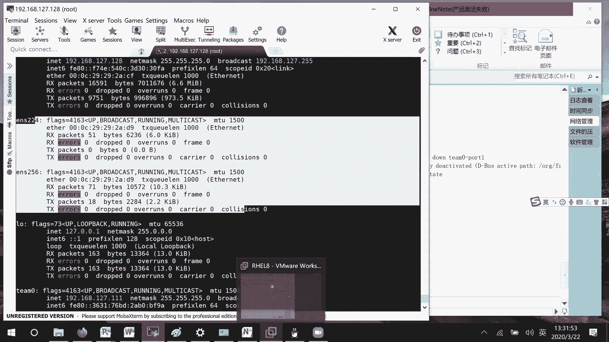

这两个网卡的话，就相当于你现在是一个叫做物理机自己的电脑，你买了一个网卡怪之后，你是不是手工去添加，其实这个的话呢，并不是说在工作当中是一个图形化界面，或者命令行方式去加。

这个在我们现实生活工作当中的话呢。

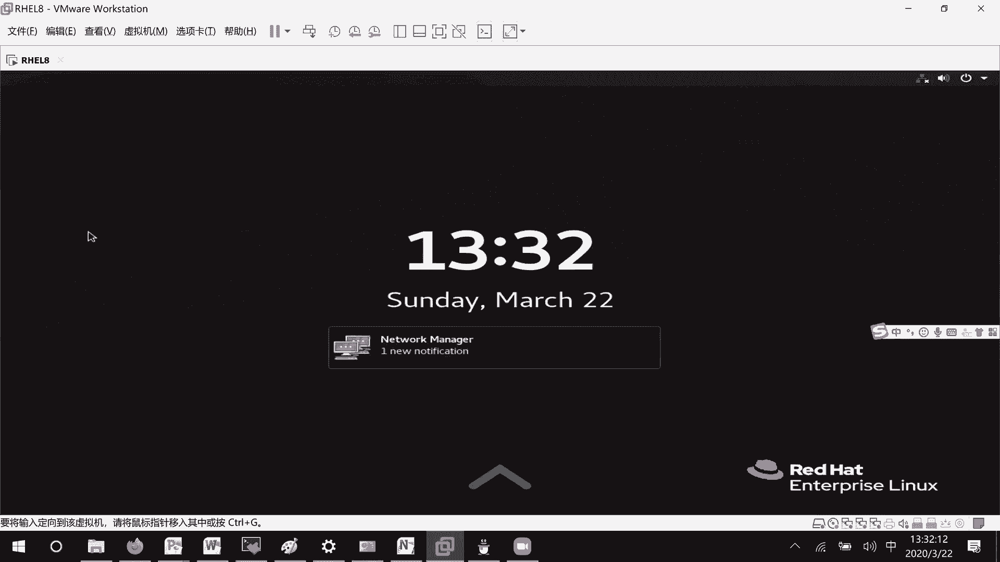

他是这是我们的一个动作去加网卡的一个动作。

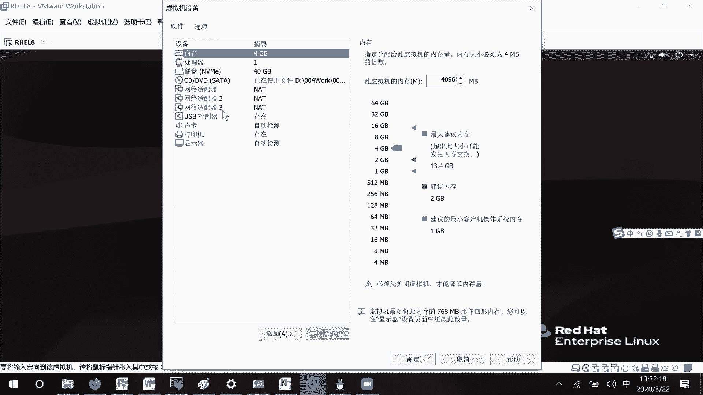

好吧，这个了解一下那行，现在这里的话呢哦我们也就是说怎么去修改，如果修改的话呢，i connection modify一下就可以了吗，现在的话呢我们就说如何删除，如果说你希望他们就说恢复原状的话。

怎么办呢，就像这个part 2的话呢，他不要再加入到这个小组当中去嘛，不要去加入进去，delete t0 part 2就可以了啊，你看这里的话，如果我们用这个i p a d d r去看的时候。

他这个24的话呢，它的一个叫做mac地址，是不是还是这个d j啊，没有恢复过来吗，这边的话呢那也就是说你去重新启动一下，他重新去读取一下那个配置，我们再来看一下它这个网卡现在还没有恢复啊，还没有恢复。

等一下哈，估计得把那个都给删掉，所以的话就好像这个听你在做的时候，要么就是说从头到尾一次性都创建成功了，如果说没有创建成功的话呢，就把成员因为我们刚才在创建的时候，是不是先创建小组，再再添加成员。

如果说在删除的时候，先把成员从小组当中移掉，然后再去把这个小组给移掉，然后呢重新去做，如果有错误的话，那建议你们从头再来好吧，我这边把命令给你们复制下来哈，nm connection delete。

这个是一个part 2的，然后还有一个的话呢，part一的，然后接下去的话呢。

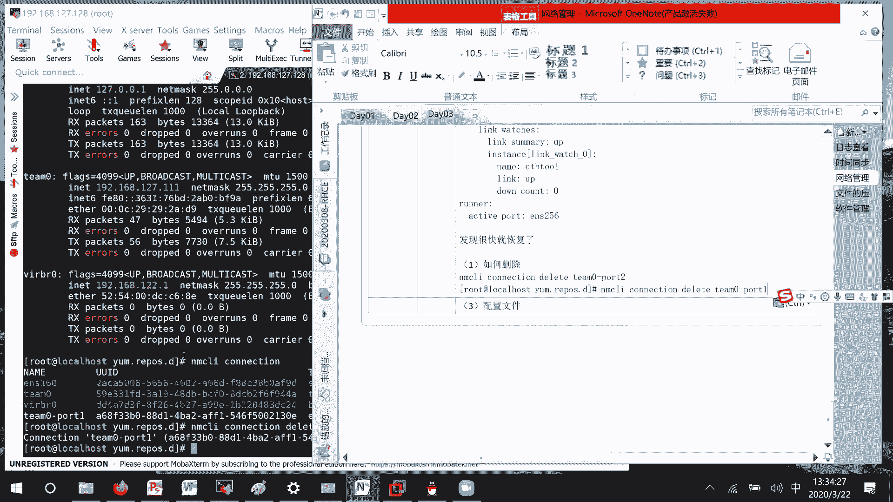

我们就把t0 他自己给移除掉吗，移除完毕之后呢，我们再来i p a d d r看一下，你看他这个mac地址的话呢，就是这个t0 它是不是还存在，然后这里的话呢e n s它是恢复了。

但是这个ns 24为什么没有恢复呢，它是这样子的，我这个mac地址的话呢，它其实不是凭空去进行产生的，它是从就是说加入到我这个小组当中，就说成员里面的mac地址，他会去挑一个过来去。

作为我自己的一个mac地址了，明白吗，会拿拿其中的一个作为我的一个mac地址了，知道吧，其实这边的话呢就是说删掉了之后，其实就是说连接删掉了之后，mac地址就回来了，这个的话呢我们发现它没有改变的。

原因是tm默认取了这个地址，作为他们小组的mac地址，知道吧，这边我们来清空，这边我们就说重新去配置一下reload ip add，诶，这边我是不是没有回车啊，哎回车了呀，嗯done，还没有消失呢。

我看一下，他这个的话呢现在一直就没有消失掉哈。

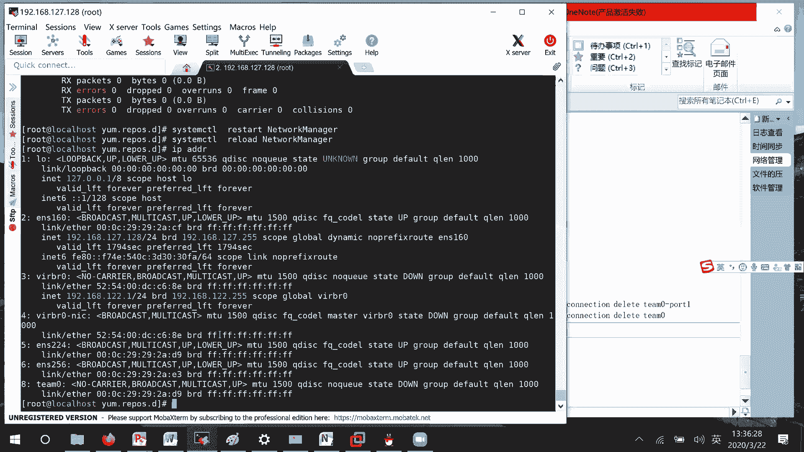

nm ci connection show，那现在这个的话呢就是说问题比较大，直接这样子去删除的话呢，我们发现就是说我们去重启那个network manager啊，它是不是还是存在在这里重启。

重新去读取我们的配置信息啊，它是不是还在这里啊，所以这里的话呢我们就不先把它给添加回去，nm connection，然后add type它也是零，connection name，比如说叫做t0 。

if name也是这个叫做t0 ，这里的话呢干嘛呢，先这样子再删除这个听的时候，n m c l i connection down，听林，这个时候的话呢我们再来删一下，看有没有用哈。

i connection，delete p，零回车，还是没删掉，那这个的话他需要去重启一下网络了呀，他需要重启一下网络，像这种情况，就是说把他这个听的话给删掉了之后也不行，要重启一下网络。

这个重启网络的话呢，估计要使用那个network，我后面的话呢去看一下有没有其他的解决办法，好吧这个的话呢先放着好吧，下面这里的话呢呃我们上午这边一直在讲的，就是说如何通过命令行的话呢去实现配置。

下面这里我们来看一下它的一些配置文件，因为有些配置文件比较厉害嘛，这个的话呢配置文件的位置在哪里呢，cd etc six config network scrapes，在这下面，然后的话呢。

现在我们的r h e l8 比我们七来说，它就干净很多了，之前在七版本下面，是不是有很多的ii fcfg开头的文件，这边的话呢，就只有就是说你真正有配置的一些信息，在这好吧，我们来看一下这里面的话呢。

有什么东西我copy的if configure，比如说拷贝的话呢，这个文件，比如说我想要对四这个网卡去进行配置，v i m if config u s4 ，首先这这里第一行的话。

就表示你这个的话呢类型是什么，网卡的类型是什么，然后接下去的话呢，这里就是说代理有没有协议，如果说我们没有的话，因为是手工敲嘛，这就删掉吧，浏览这个也不要，然后这里的话呢就是说获取的方式。

他这里是不是dh cp啊，直接可以获取吗，比如说我这边设置menu方式去进行获取，可以这默认路由不要哎，等一下不要，然后这里的话呢i p v4 如果出现错误的话呢，要不要报告啊什么的。

不要i p v6 没有不要不要不要线都不要，然后这里的话呢什么意思呢，我和哪个物理啊，不对，我这个连接连接名叫什么名字，比如说我叫444好吧，44，然后的话呢接下来这uid的话呢。

就是说每个设备它都会生成的，我们这边的话呢，因为没有吗，到时候让他直接去分配好了，我这里把它删了，不需要去设置，好吧，然后这里device的话呢，就是说你物理设备的名字叫什么24嘛。

然后这个on boot什么意思呢，开机要不要自动启动，我比如说设置成yes，开机自动启动，然后接下去的话呢，下面这里是不是就要去配置我们的ip地址，对吧，首先这里的话呢，我们来看一下里面要写哪些东西。

一个就是我们的ip地址，野马啊，还有就是说dns啊，还有一些网关的信息，对不对，我们这里的话呢来写一下哈，我没记错的话呢，因为我这个不常写i p a d d r，19216192168127。10。

然后这里get away，比如说192168127。2，然后呢dn s192168 哦，我随便写一个吧，114。114。214。114好吧，然后这里的话呢，嗯还有一个是不是野马还没写啊。

其他的先后顺序的话呢没有关系，比如说叫做一个24位，这里的话呢mask它好像有点问题啊，prefix等于24位，这个我们这里的话呢，来看一下它能不能去进行一个正常的一个启动，好吧，e s c冒号wq诶。

想写的wq，if config一下，这边的话呢这里现在还没有啊，我让他重新去读取一下nm cl，i connection reload，诶这里没有识别到，我看一下啊。

nm ci connection up，device up叫做een，up e n s224 诶，稍等一下，我看一下，这里的话呢，他一直没有起来嗯，这应该就可以了，等一下怎么了，我看一下有提醒吗。

对它是比较方便，但是就是说嗯七版八版本当中，就是说第一次是想要把它给替换掉吗，是想替换掉，所以的话呢现在就是说有时候他又不能去用，就特别的麻烦，就特别麻烦，所以在这边的话呢，会更加快一点，好吧。

我来看一下它这边，还是没有，我这个应该是没有写错啊，type boat，perfect name，224，yes，这个没有没有写错，等一下，他这里的话呢。

我在在使用那个叫做network的方式去给它进行重启，我看一下可不可以，这应该就是说直接就可以了，但是这里为啥不可以，怎么了，野马它是perfect啊，nm connection，那我再来add一个看。

add connection，name叫做test吧，if name的话呢，比如说叫做e n256 ，然后的话呢i p v4 点address，192168127。18，i p v4 点。

i p v4 啊，等等一下，这边就是24，它的格式有很多种，不是说就那么一种哈，192168127。2，叫做i p v4 点dn s，19216114吧，稍等哈，has nethernet。

你看他这里就是说prefix嘛，我没写错啊，ip add我也没写错啊，foot protocol，诶哦我这边还没改哈，稍等一下，n m z l i connection。

n m c l i connection，modify test i p v4 method menu，嗯这边网络类型没有问题啊，他这里都protoco写now，写now，我改一下，看一下能不能成哈。

其实他这个的话呢和我们这里没有关系，就是说野马它是没有问题的，就是说启动这一块，启动这一块嗯，我刚才说想要改哪个brute protocol，这边没有立刻识别的。

没有立刻区别的system control restart network manager，他这个没有立刻识别的啊，他这比较估计还是需要通过我们的network方式去写，嗯这边的话224嗯。

这边的话呢你用这种方式也可以，就是说ip add flash，就是说刷新一下，通过这种方式去刷新一下，因为他那个就是说reload这一块的话呢不能去写，那我们只能就是说去进行一下刷新好吧。

因为它我们通过reload的话呢，它是读取不到配置的，所以这边的话呢只能想其他的办法，就是说刷新一下地址配置。

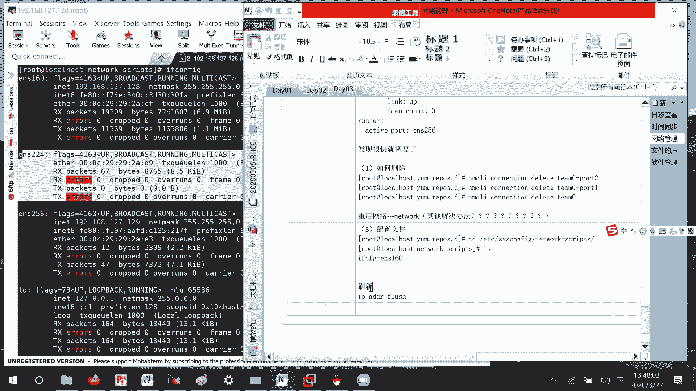

还有一种的话呢就是network，因为network真的是好用，之前的所有版本当中全都是network去管理吗，剑的话呢它嗯把他就说计划把它给替换掉的话，那我们只能想其他的办法把它给刷新出来，好吧。

那好这边的话呢配置文件的信息，我这边再给你们去导导出导出一下，其实配置文件信息的话呢，没有没有什么样的一个大问题，因为有些人的话呢，在自己的之前的一些版本当中，看到的可能是一个mask，对不对。

但是有一些文件当中的话，它识别的是一个叫做perfect，就是说前缀的意思吗，好吧，这里的话呢就是说呃ip地址获取方式，我们的话呢手工这边就是一个自动的话呢，那这边就是一个dh cp。

然后接下去这里的话呢就配置的ip地址，他可以去用，到时候的话呢，我们我们去安装一个软件就可以了吗，早上说过，就是就是iso有一个叫做base os package。

里面有个叫做let's work scrap，你把这个软件的话呢装起来它就能用了，但是的话呢计划在下一个大版本当中，network就不要去用了，就说华为不是就是红帽他自己的一个计划吗。

然后接下去的话呢这里就是说配置网关地址，然后这里的话呢就是说配置，es地址好吧，然后这里的话呢就是说野马，然后这里的话呢就是说和哪个设备相连，然后这里的话呢相连啊，哪个配哪个设备的配置信息。

这个没问题啊，然后这里的话呢就是说开机自启动，开机自启动，他就这样一个过程，然后到时候的话呢刷新地址，你们用这个ip add flash，或者的话呢，这边我把他的一个地址再去修改一下好吧。

if config e s4 ，比如说我把这个地址的话呢改成一个110吧，保存退出i p a d d，这边的话呢是不是还是一个10i p a d d flash，再来看一下诶，怎么现在又没有变过来了。

稍等我看一下i p a d d是我改错了吗，没改错，等一下哈，稍等我一下，我看一下哎这里flash之后就可以了呀，nm ci connection reload，他他现在又不生效了，很神奇。

现在又没有生效，又没有声响，s y s t m control restart network manager，现在又没生效了，这是什么鬼东西啊，不就在这里了吗，它已经识别到了呀。

nm c l i connection reload，是我刚才没有改吗，我改了我改了，110191168127。110啊，对不对，他这里不是已经有了吗，nm cl i connection。

我先当一下吧，然后再up一下，哎现在又有了，那这样子啊，这个的话呢我把这个叫做224的连接，我先删了，重新给你们去做一下好吧，稍等我一下，它的一个叫做e n s24 ，可以等一下444。

delete e s，44好了，我现在的话呢就是说重新开始，把这个给你们去做一下，首先的话呢还是介绍这个目录没有问题，然后接下去我们是要为特定的网卡去编辑，配置文件。

这里的话呢它都是i f c f g开头，后面的话呢就是说什么样的信息自己去写，比如说dn t k e d u好吧，然后接下来里面的时候，第一个type e t h e r f e t h e r。

n e t以太网的类型吗，下面这里的话呢就是说boot protoco，也就是说我通过什么样的方式去获取，我的一个ip地址，这边的话呢比如说我们设置的是手工的好吧，那这边就等于now。

然后接下去下面这里的话呢，我们就要去配置ipv 4的四大属性，ip add等于192168127。7a d d r，然后接下去的话呢它的一个掩码prefix 24位的。

然后接下去的话呢它的一个网关get way，192168127。2d s的一个地址，192168127。2，比如说也是点二好吧，然后的话呢on boot，也就是说开机要不要让它自动启动呢。

也是开机自动启动，然后还有一个的话呢，就是说这个配置给谁用啊，这个配置的名字叫什么啊，我们去设置一下name，比如说叫做tk e d u好吧，d e v e c。

e device呢是给e n s224 去进行一个使用，这没有问题，所以第一步这里先创建配置文件，它这里的话呢是不是没有我们没有，我们那个叫做e n t k e d u的一个连接信息。

我们来试一下i p a d d flash，这边能不能看到没有看到，然后这里的话呢nm ci connection reload，reload命令的话呢，是不是，也就是说去把那个目录下面的所有信息。

都去读取一遍，所以接下去第二步去读取，网络配置目录下面的所有文件，用这条命令a，重新就说去加载一下，把所有的信息都加载进来对吧，然后加载完了之后呢，我们ip addr看一下他有没有地址。

那你看线是不是就有地址了，我不知道为什么刚才没有啊，不知道是不是操作的太快了还是怎么回事，然后有了之后的话呢，接下去我们第三步，比如说想要去修改配置信息嘛，那这里的话呢是不是就v i m。

if configure叫做e n s t k e d u r，比如说这里的话呢，我把地址改成77，好纯退出，现在的话呢，它的一个地址情况肯定是没有立刻生效的，那我们现在要做的事情。

就是说第四步想要去重新加载信息，那重新加载信息的话呢，我们只能这样做，n m z l i connection，这里的话呢就比如说叫做reload，他这个reload的话呢重新去读取那个配置文件嘛。

但是只是说把一些新的连接，应该就是说去读取进来，但是里面的配置它没有去更新的，我们这边如果要去修改的话呢，就先把它给down了，叫做tk e d u，先把它给down了。

然后的话呢再把tk e d u给up起来，稍等哈，他这个的话呢现在就比较麻烦很麻烦，然后接下去的话呢，我们再来看一下i p a d d r它的地址的话呢，是不是就变成了77。

然后这种的话呢哦你们应该了解了，现在的话呢我们再来看一下，就比如说他这里不是只有一个ip地址吗，或者只有一个网关地址吗，我如果说想要再去新增加一个怎么办，这边的话呢因为第一个是零。

第二个的话呢就是一个一嘛，比如说叫做17好吧，我们来试一下冒号wq，然后这里的话呢给他去down掉，再给它去up一下，然后再i p a d d r回车，诶，这边线没有加载过来哈，稍等一下哈。

嗯现在没有加载过来，等一下我看一下nm cl，i connection modify test，2t v4 点j s加上，我就是说在这个test上面去写一下，192168，比如说点127。

点133 24的，at if config test，对呀他这里就是写个一就可以啦，那我这边为什么又没有呢，connection down，等一下我看一下先这个不知道为什么。

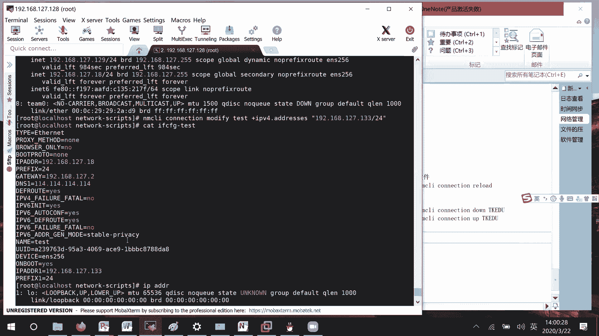

就是通过配置文件改的，它基本上反应都没有那么快，不不不，他这个now和有时候manual或者static全都是一样的，全都是一样的，只是说这边的话呢，他不知道为啥这样子，嗯nm connection。

然后这里的话呢down tk，然后这边的话呢再up一下，诶谢有了，现在有了，那这样子的话就是他的话呢now是可以的，就是说其实这些参数的话没什么问题，我虽然说我平时我一直说我平时不常配嘛。

但是这个的话呢会经常去写的，就是说看其他的一个配置文件嘛，这里写now的话呢没有问题的好吧，他这边的话呢，你看如果说我们修改完信息了之后，就说配置文件修改完信息之后。

有时候up up down你是可以的，然后接下去第五步，我比如说再去修改了一个配置信息，可以发现up down的话呢，是不是一直不可以啊，那你这边的话呢就先去reload一下，然后再down再up一下。

那这个基本上肯定是可以的好吧，单独去用的话呢不可以，now表示如果没有设置，就是dh cp，所以这边的话呢写闹也没什么问题啊，好吧，这边的话如果说配置文件呃，叫做你的配置配置文。

通过配置文件方式去修改的话呢，你先给他reload一下，然后再去down和up一下，好吧，这个流程的话呢给你们时间自己去试一下吧，好了，这边的话呢我们继续来看一下，就是啊刚才有人问，就说这个ip地址。

能不能就说网卡的名字能不能改，可以改，改的话呢两种方式，第一种方式通过这个编，首先先来编辑这个文件，中间的话呢加上这行信息，然后重新去编译我们的一个哦grab文件，到时候reboot一下它就有了。

这个的话呢是在之前的课程叫做24，里面会讲怎么去修改我们内核文件，现在的话呢因为没有254，所以这里就跟你们提一下，还有的话呢另一种方式，如果说你只想改某一个设备的话呢，可以怎么办呢。

编辑这个叫做rose，其实这个文件里面的话呢，把信息主要是这个，mac地址这一块啊，之前的版本之中，它是不需要加上问号和星号的线的话，那要加之前的版本的话呢，是一个一线的话呢是一个32的一个信息。

诶32的一个信息，然后后面这个的话呢内核这里你可以不用去跟，然后直接跟上一个name，就是说具体什么名字就好了好吧，它上面这里的话呢有一个参考案例，你可以把两个去对调一下也是可以的。

然后刚才的话呢就是有人说那个ip add flash的话呢。

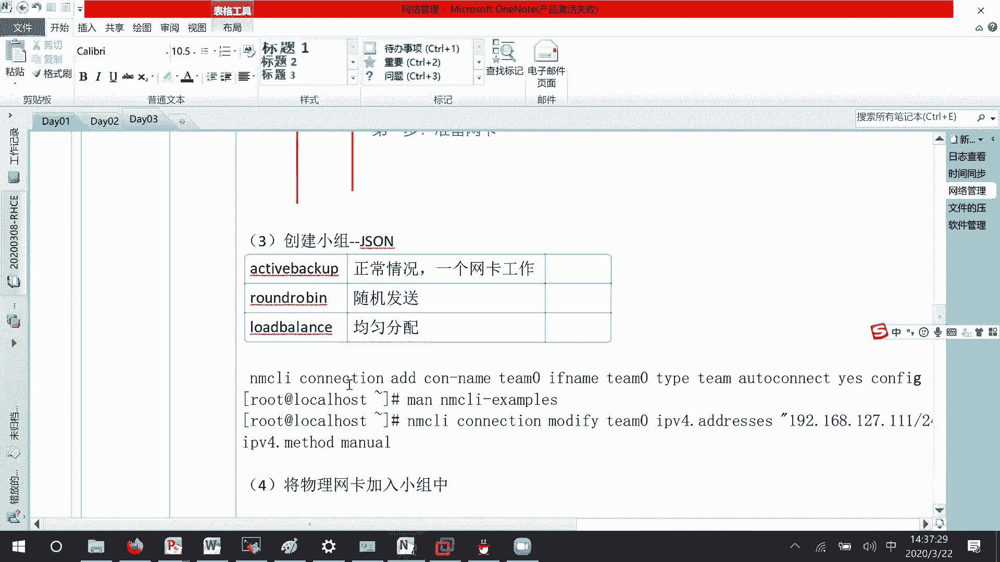

没有成功对吧，是的，这里的话呢我看了一下没有成功，他这个i b a d d flash的话呢，就是后面把跟上某一个网卡的一个名字，我这里想一下，应该是一吧，二也可以，反正我有二。

他这样子的一个操作的话呢，就是说先把它里面的地址先释放掉，然后的话呢我刚才就说俊瑞漏了一下，看他能不能获取到一个新的信息嘛，我刚才参数忘记更了，然后接下去还有第二个。

我们network manager的话呢，它是一个管理工具，它不是我们一个就是说网络服务，就是说真实在运行的一个服务，它只是一个管理工具，就是说管理的一个网络服务的一个工具嘛，像我们现在的话呢。

就是比如说像s h这些它都是s s h，它是一个在跑的东西，但是这个network manager它就是网络的一个管理工具，它不是就是说网络运行的一个本身好吧。

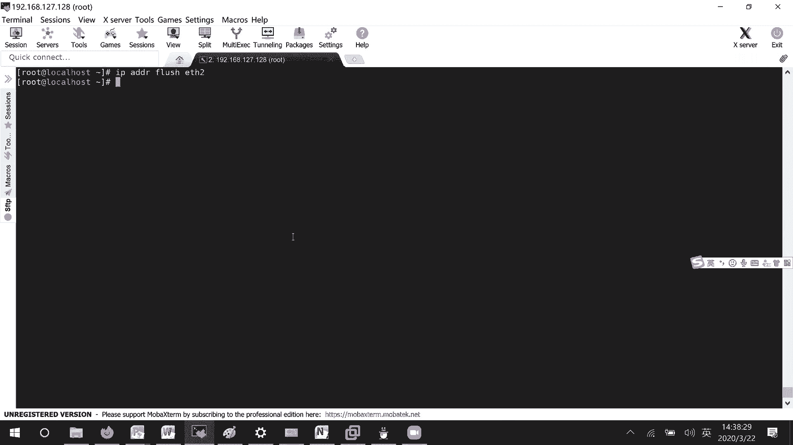

这边的话呢嗯网络这一块，我们内容的话主要讲这里，这里有兴趣的话自己去改一下，但是在改的时候呢，建议你们先做一下快照，就是说万一你的哪一个东西给编辑错了，或者怎么样。

万1等1下回就说回不到原来的一个地方嘛，好吧这个没什么问题啊，下面这里的话呢我们就来看一下这个比较简单，叫做哦文件的压缩和归档这一块的东西，好吧，啥东西啊，现在三点要到了，要不这样子吧。

我们先来讲这个软件的管理，然后再讲这个文件的压缩吧，文件压缩下一次去讲，因为软件管理的话呢比较有用，因为讲估计也得讲一个多小时，到时候你们回去可以自己复习一下好吧，那好在我们这个红帽当中，不管是七版本。

六版本还是几版本，它的话进行软件安装，就是说软件管理的话呢主要两种方式，第一种方式的话呢就是rpm包嘛，它这个全真的话呢，就是那个红帽包管理器，它的话呢是一个红帽开发的。

然后接下去的话呢还有一种叫做y u m样元，这两个有什么样的一个区别呢，我们可以这样子去想啊，二pm的话呢，相当于这边的话，就是说我通过浏览器去把一个包，下载到我本地的文件夹单中去。

然后到时候呢我双击去对它进行一个安装，然后像这个亚目源呢，我可能手机啊或者电脑啊，使用那个叫做腾讯管家嘛，管家上面的话是不是有软件管家，那好，我这里的话呢，就是说有一个软件或者有一个配置信息。

连接到这个管家上面，我比如说想要去查，就是说想要去安装什么软件，我就从这里实时请求嘛，请求过来安装，请求过来安装，这样子就说两种不太一样，一个的话呢就是说使用对外的一些服务。

以及就是说对外已经哦它是一个亚目源，你就说去连接它去进行一个使用，所以这个的话呢这边就是一个服务器端，下面这边的话呢就是一个客户端，好吧，这两种模型我们首先的话呢来看一下这个rpm。

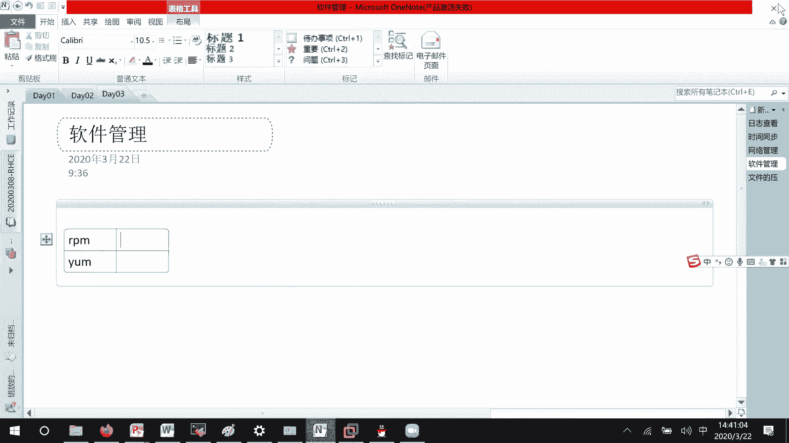

他的话呢首先就是说要下载一些软件嘛，我们本身光盘里面的话呢，它就有很多软件了，稍等一下，因为我重启过，那没事，这边的话呢怎么还来不来，可以哈，这边的话呢我们来看一下。

就是说嗯在光盘当中本身就已经有很多软件了，如果说你们自己需要的话呢，可以去一些站点上面去下载，或者的话去下载一些源码的包，自己去进行一个打包嘛，这个东西就是说源码包怎么打包的话呢，它有一些流程的。

你们自己的话呢进行，那这边的话呢，就是你们可它的话呢是有一套流程的，你们就是说去下载一些源码，然后自己打包去试一下就可以了，因为像有一些比较小型的，像什么2048或者什么样的一些源码包。

很多可以自己去试一下，这边的话呢我们来看一下city run mile root h e l，就说进来这里，啊进来这里的话呢，l s你看这边的话呢，是不是就有很多很多的一个信息啊。

其中就说在以前的版本当中，这个a p p dream和这个bass os的话呢，他他们两个全都在一起的，叫做在i s o吧，so目录里面就是说所有的软件都在都在那里面，但现在的话呢变掉了。

它分成两个部分，第一个部分base os的话呢，基本上是一些和系统底层相关的一些软件，然后这个的话呢就是我们一些应用服务的话呢，会在这里会在这里。

然后我们这边的话呢比如说进入app string l s，它的话呢有package，这里面的话呢就是一个一个的软件包了，这个r e p o d a t a的话呢，就是一些解析文件。

我们等一下的话呢再进行一个说明，好吧，这边我们就比如说叫做去看一个软件ls，root h e l，然后呢app string后面的话呢我看一下跟上一个package，比如说vs ftp。

就是说看一下这款软件存不存在嘛，他这里的话呢就是如果说有显示出来的话。

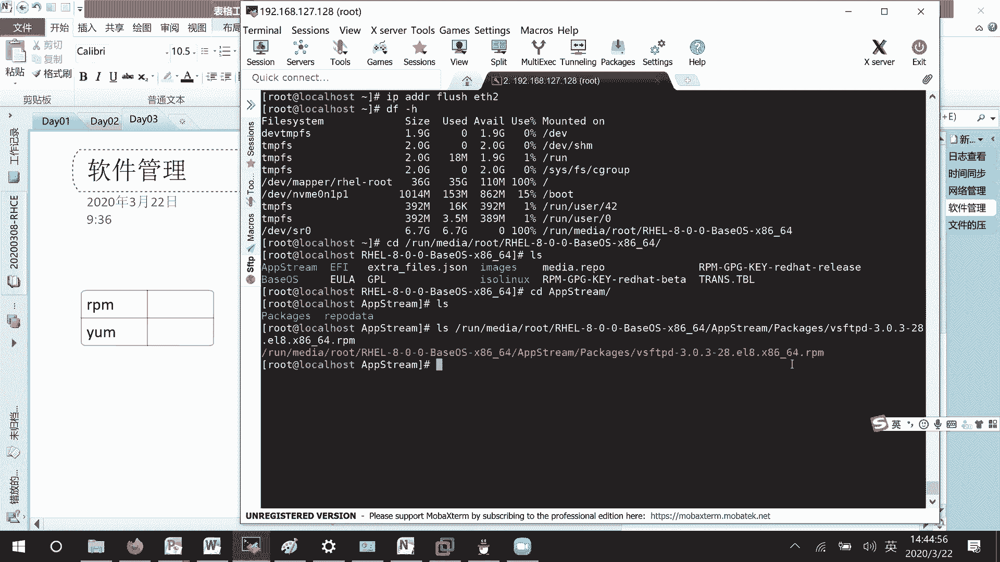

那就表示这款软件我们是存在的，接下去的话呢，这个就好像我们平时下载下来的，那个叫做ex e的一个东西，然后如果你有图形化界面的话呢，其实也可以双击去进行安装，但是我们比如说现在没有图形化界面吗。

好这里rpm。rpm就是说后缀，他的话呢就类似于windows中的叫做ex e文件好吧，然后的话呢前面这里v s f t p d，他这个的话呢是我们包的名字，也就相当于就是说类似于我们软件的一个名字。

叫好像说qq嘛好吧，然后后面这里的话呢3。三点，这个是什么呢，就是说我们软件的一个版本号，因为有时候的话呢你们在公司啊，或者在哪里去安装软件的时候，发现我当前的这个版本可能版本太低了，不符合他的要求嘛。

那你的话呢可以去网上去找，可能就是说啊三点点二啊，就是说比他低的一个版本，可能这个版本太高了不行，你可以去找三点点二，这些比他低的一些版本吗，有些软件是这样子的好吧，然后接下去的话呢这一块这一块的话呢。

就是我们的一个发型吗，发型号你看这个e l8 的话，那就表示我们是一个红帽八，红帽八的一个软件，就是说红帽八上面去安装的一个软件，平时的话呢可能就是e l7 嘛，红帽七或者e l6 ，红帽六好吧。

所以lease发行版本，所以的话呢这里要稍微去注意一下，然后这里的话呢就是说哦运行的一个平台，是架构是怎么样的，是一个叫做arm的，还是一个叫做x86 的，基本上的话呢像我们红帽。

现在这里都是一个x86 的一个架构，这也没什么问题啊，接下去的话呢，我们就要想着用我们的r p m，怎么样去对这个软件的话呢，去进去进行一个管理了哈，不首先它的一个命令的话呢也是rpm。

我们在进行软件安装的时候，首先第一个可能会去查找软件在不在，在了之后的话呢，我可能想去安装一下，安装完了之后的话呢，可能在这个过程当中是不是需要去更新一下，更新完了之后的话呢。

可能就是说啊这款软件不用了，那我怎么样去进行一个卸载吗，所以呢我们会通过这几个方面的话呢，去进行一些简单的一个介绍好吧，首先第一个我们查看一下，我们这个系统当中安装了多少软件。

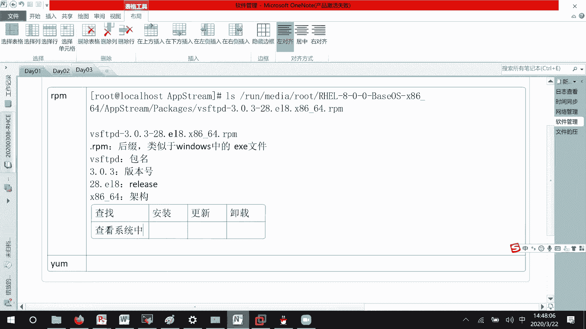

那建议有哪些它这个命令的话呢，就是rp rpm减qq就carry ma呢，就是or系统当中已经安装的所有软件，他这就特别特别的多，如果说你想要去过滤的话，就这个rap一下就行了吗，啊我随便找一个。

比如说vs f t t d，他这里的话就表示已经安装了，然后的话呢比如说我就查找vs f t，他也能查找出来，然后这里的话呢它其实还有另一种方法，就你后面直接跟上这个软件包的名字，他也能去查的。

但这种查找方式有什么不好的地方呢，你必须跟上精确的报名，如果说这个名字你不是精确的。

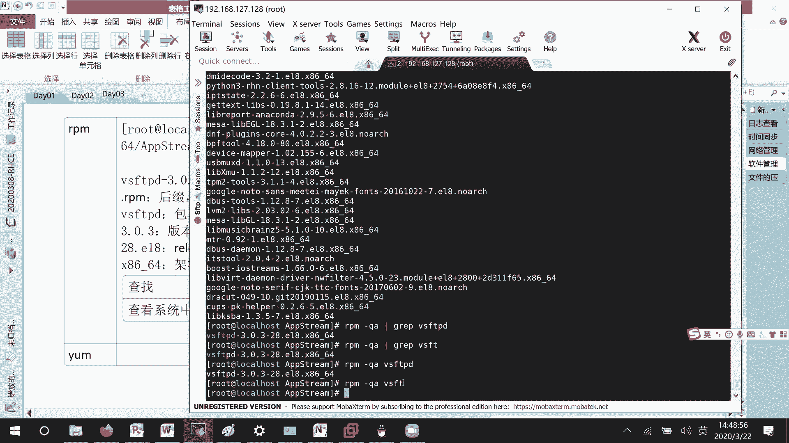

我是没有办法去进行查找的，好吧，这里就是这种情况的话呢，只适合精确查找，稍等一下哦。

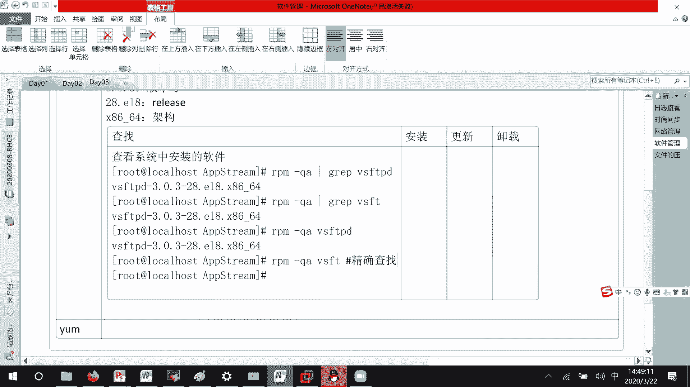