# RHCE8红帽认证课程：P10：指定用户对FTP的读写权限 🛠️

在本节课中，我们将学习如何为特定用户配置FTP服务器的读写权限，并实现用户根目录限制，以满足企业环境中安全、可控的文件传输需求。

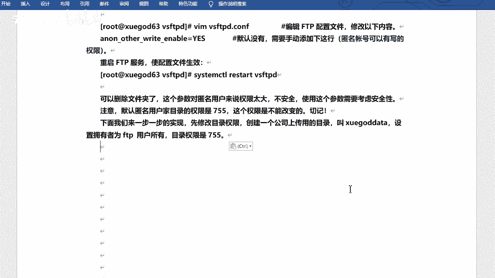

## 概述

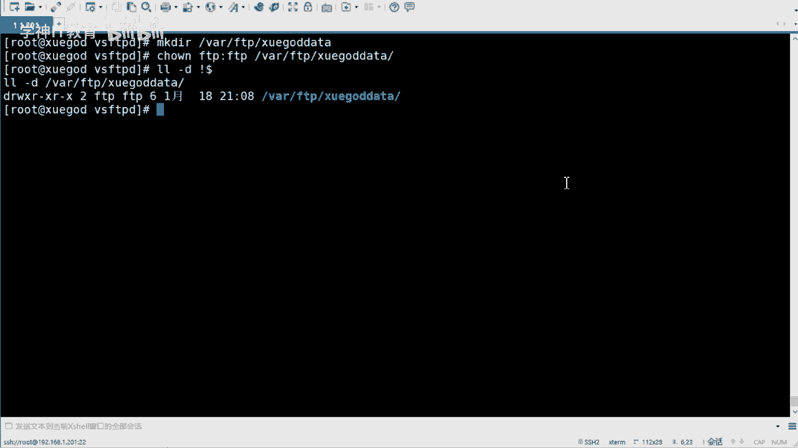

上一节我们介绍了FTP服务的基本配置。本节中，我们来看看如何为特定用户（而非匿名用户）分配权限，并将其活动范围限制在指定目录内，以提升安全性。

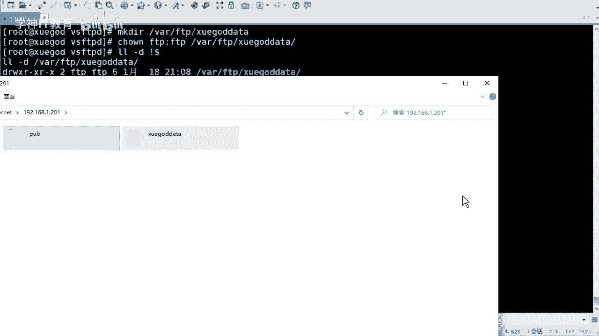

## 配置匿名用户权限的局限性

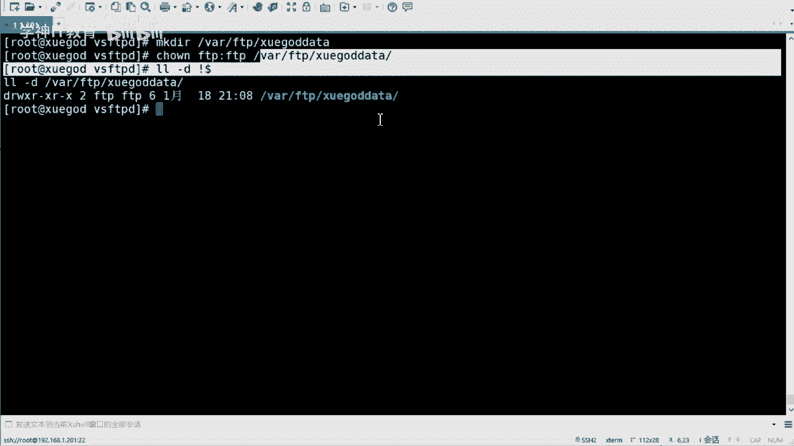

使用`anon_upload_enable=YES`等参数可以为匿名用户开启上传权限，但此权限范围过大，存在安全风险。默认匿名用户的目录权限为`755`，且所属组无法更改。

## 创建专用上传目录

以下是创建一个供FTP用户使用的专用目录的步骤：

1.  创建一个名为`xueba_data`的目录。
2.  将该目录的所有者设置为`ftp`用户。
3.  将目录权限设置为`755`。

```bash
mkdir /var/ftp/xueba_data
chown ftp:ftp /var/ftp/xueba_data
chmod 755 /var/ftp/xueba_data
```

此目录专供FTP用户操作。通过移除其他用户的写权限（例如，将权限改回`755`），可以确保只有FTP用户能写入，从而保障安全。通常，用户只需读权限，写权限应谨慎分配。

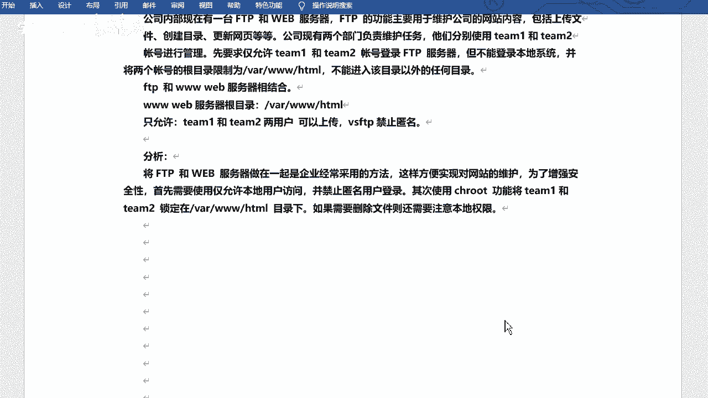

## 企业级需求：特定用户访问与目录禁锢

公司内部常将FTP与Web服务器结合，以便维护网站。假设需求如下：
*   仅允许`team1`和`team2`用户登录FTP，但不能登录本地操作系统。
*   将这两个用户的FTP根目录限制为`/var/www/html`。
*   禁止匿名用户登录。

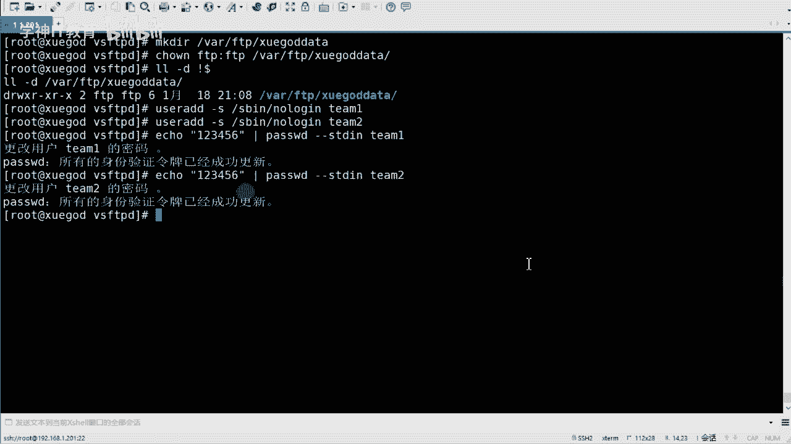

### 需求分析与解决方案

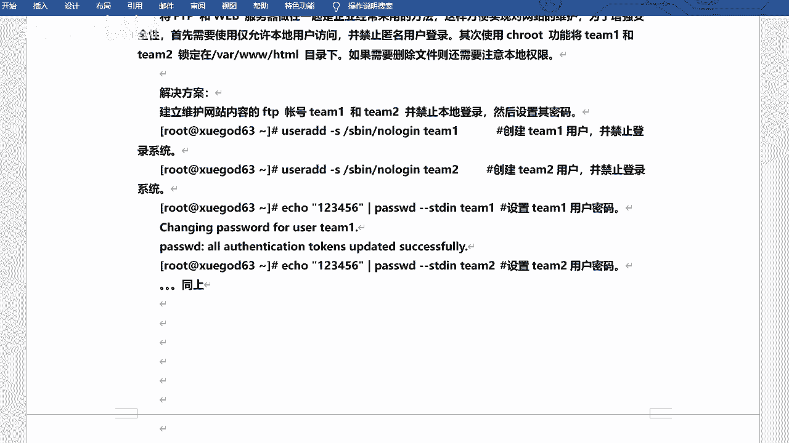

我们需要创建系统用户但禁止其登录Shell，并通过`chroot`功能将其禁锢在指定目录。

### 创建系统用户并禁止登录

以下是创建用户并设置其登录Shell为`/sbin/nologin`的步骤：

```bash
useradd team1 -s /sbin/nologin
useradd team2 -s /sbin/nologin
echo “123456” | passwd --stdin team1
echo “123456” | passwd --stdin team2
```

### 修改FTP服务器配置

需要修改`/etc/vsftpd/vsftpd.conf`配置文件，关键配置如下：

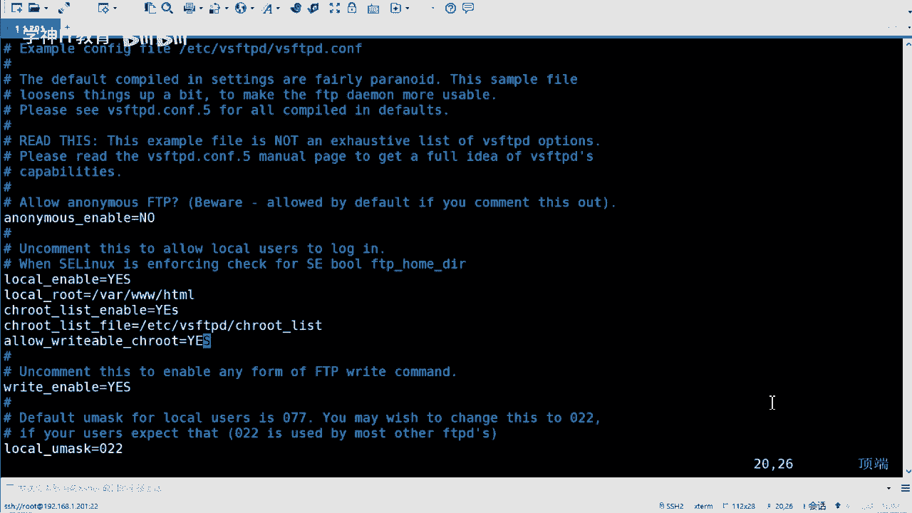

```ini
# 禁止匿名登录
anonymous_enable=NO
# 允许本地用户登录
local_enable=YES
# 设置本地用户的根目录
local_root=/var/www/html
# 启用chroot禁锢列表
chroot_local_user=YES
# 指定禁锢列表文件
chroot_list_file=/etc/vsftpd/chroot_list
# 允许禁锢列表中的用户有写权限
allow_writeable_chroot=YES
```

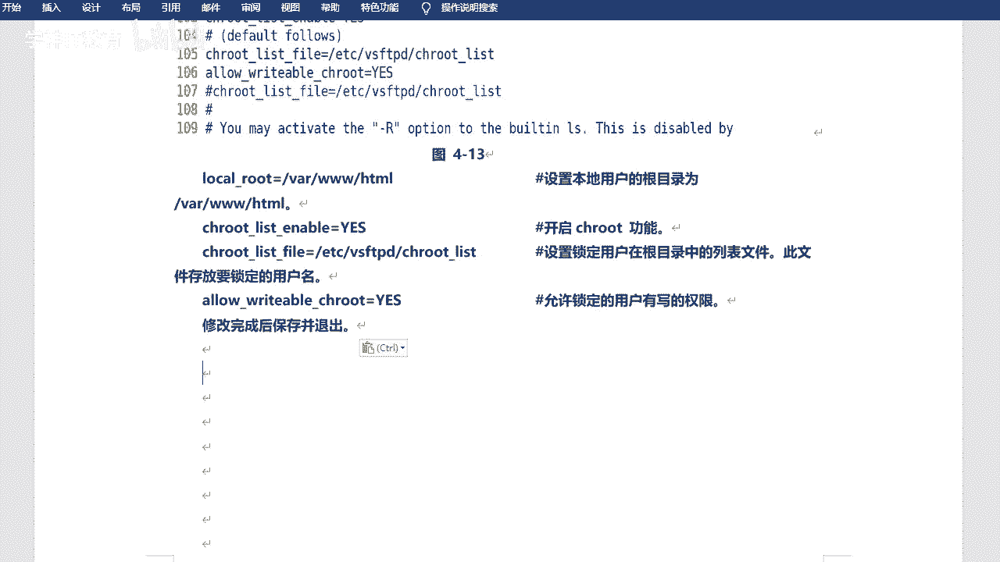

### 创建用户禁锢列表

创建`/etc/vsftpd/chroot_list`文件，并写入需要被禁锢的用户名：

```bash
echo “team1” > /etc/vsftpd/chroot_list
echo “team2” >> /etc/vsftpd/chroot_list
```

### 设置Web目录权限

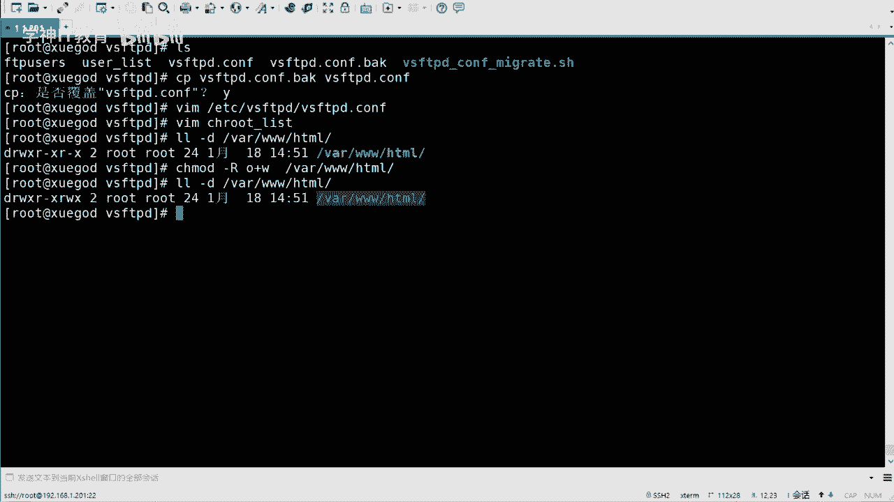

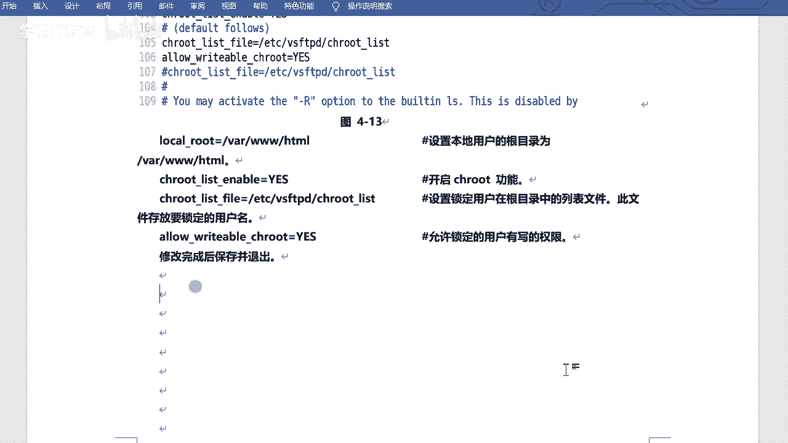

为确保`team1`和`team2`用户能在`/var/www/html`目录下写入文件，需为目录添加其他人（`o`）的写权限：

```bash
chmod o+w /var/www/html
```

### 重启服务并测试

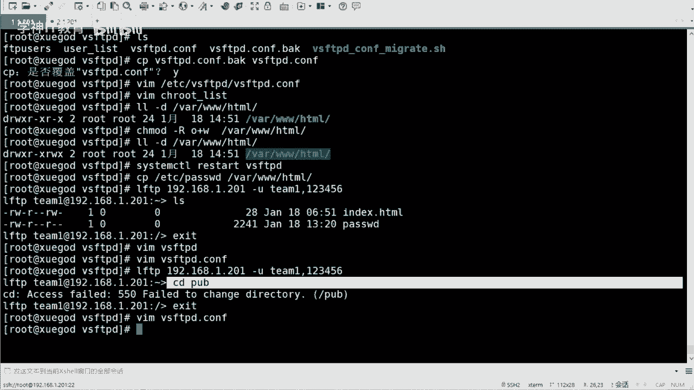

完成配置后，重启`vsftpd`服务使配置生效：

```bash
systemctl restart vsftpd
```

随后，可以使用`lftp`命令行工具或`FileZilla`等图形化FTP客户端，使用`team1`或`team2`的账号密码进行连接测试。连接后，用户将被限制在`/var/www/html`目录下，并拥有上传和下载文件的权限。

## 总结

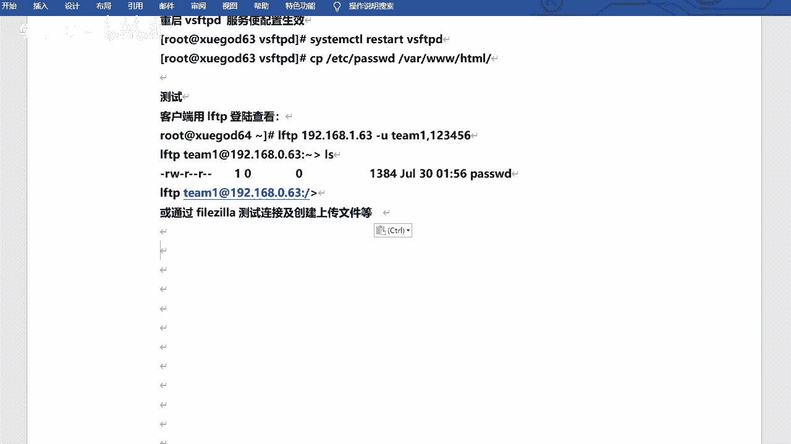

本节课中我们一起学习了如何为FTP服务配置特定用户的读写权限。关键点包括：创建专用目录、配置系统用户并限制其登录Shell、修改`vsftpd.conf`以启用目录禁锢功能，以及正确设置目录权限。通过以上步骤，可以实现安全可控的企业级FTP访问方案。