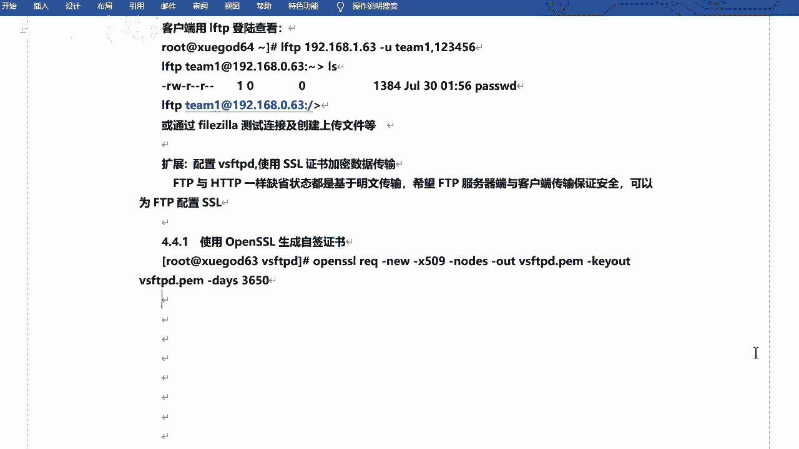
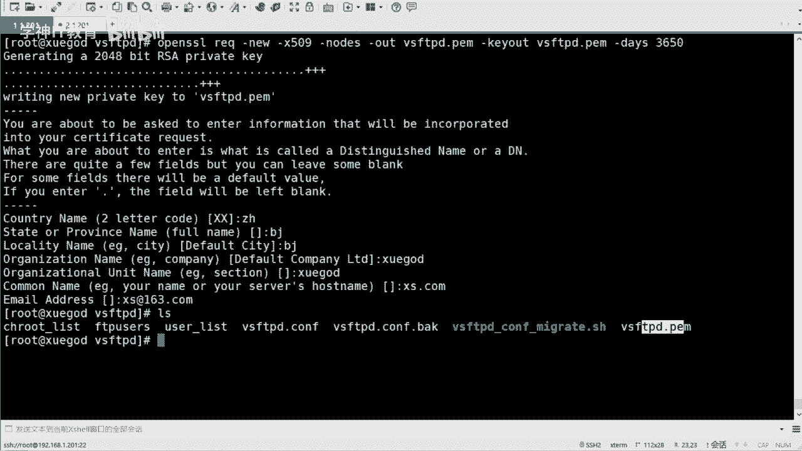
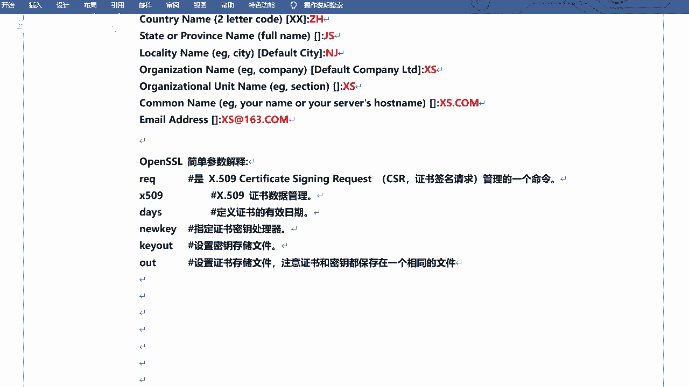
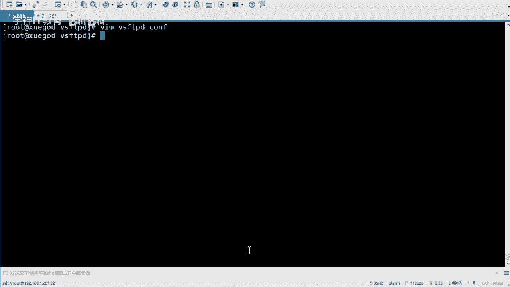
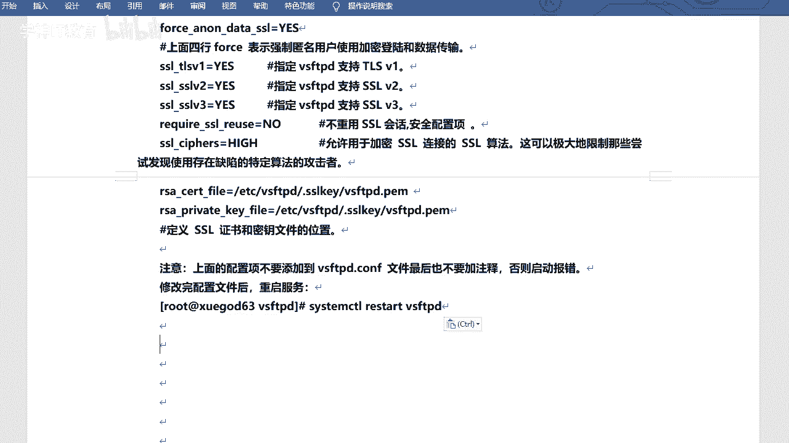
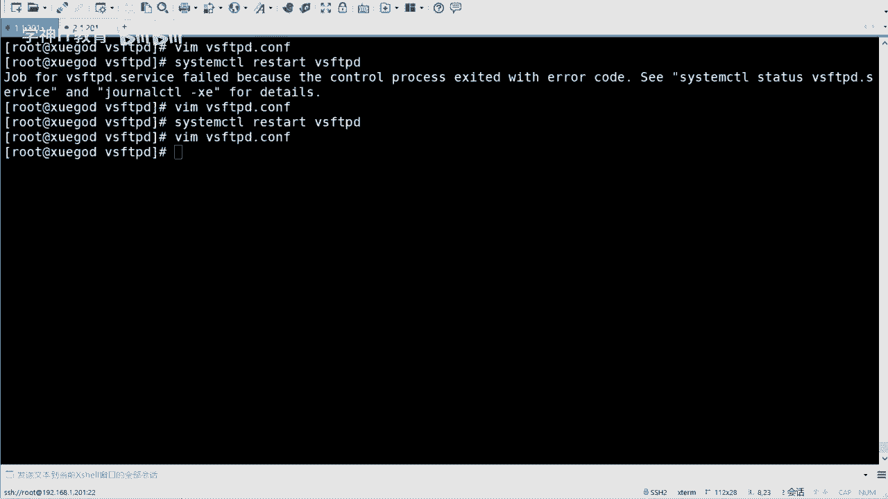
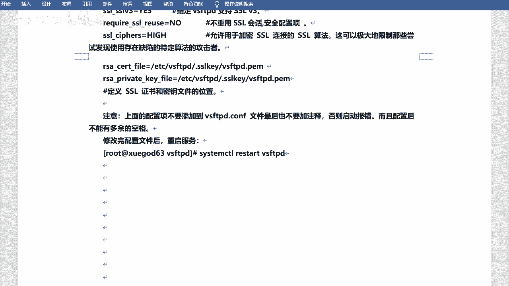
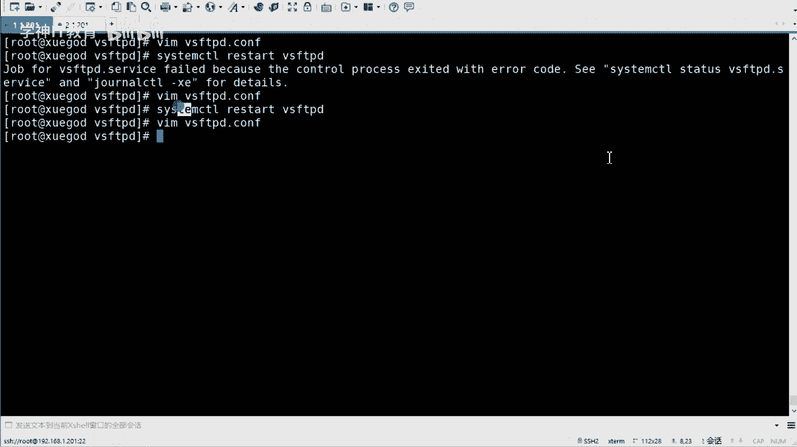
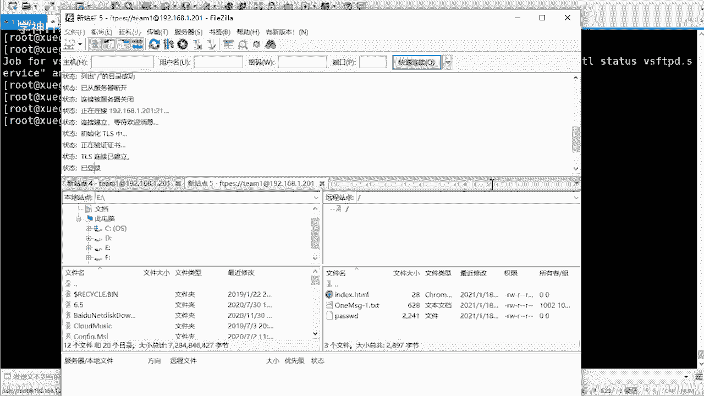
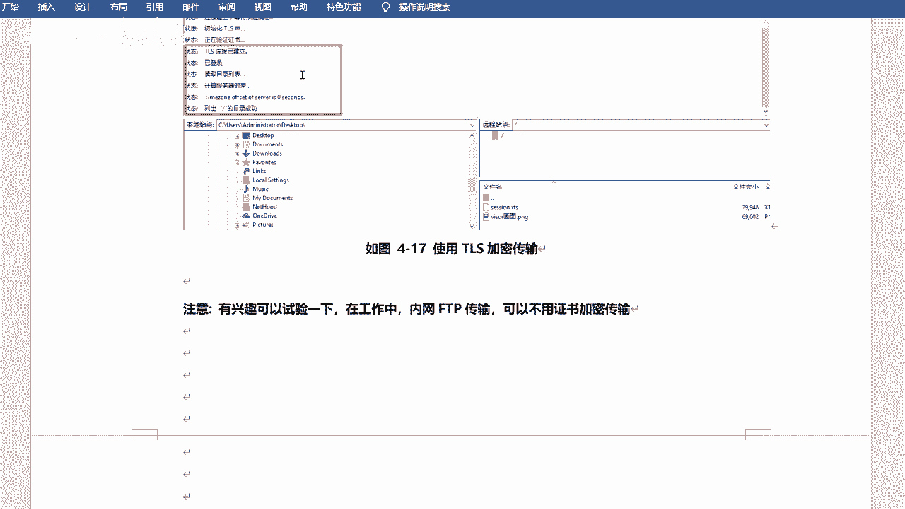

# RHCE8红帽认证课程：P11：使用SSL证书加密数据传输 🔐

## 概述
在本节课中，我们将学习如何为VSFTPD服务配置SSL/TLS证书，以实现数据传输的加密。通过使用自签名证书，我们可以将原本明文传输的FTP连接升级为安全的加密连接，从而保障数据在传输过程中的机密性。



上一节我们介绍了基本的FTP服务配置，本节中我们来看看如何为其增加安全层。

---

## 生成自签名证书
首先，我们需要创建一个自签名证书。自签名证书意味着证书的颁发者和使用者是同一实体，适用于内部测试或学习环境。

以下是生成自签名证书的命令及其参数说明：

```bash
openssl req -x509 -nodes -days 365 -newkey rsa:2048 -keyout vsftpd.pem -out vsftpd.pem
```



*   **`req`**： 表示使用证书请求管理命令。
*   **`-x509`**： 指定生成自签名证书，而不是证书请求。
*   **`-nodes`**： 表示生成的私钥不需要密码保护。
*   **`-days 365`**： 设置证书的有效期为365天。
*   **`-newkey rsa:2048`**： 同时生成一个新的2048位的RSA私钥。
*   **`-keyout vsftpd.pem`**： 指定私钥的输出文件名。
*   **`-out vsftpd.pem`**： 指定证书的输出文件名。此处私钥和证书保存在同一个文件中。



执行命令后，系统会提示输入证书信息，例如国家、省市、公司、域名和邮箱等。这些信息将包含在证书中。

生成证书后，建议将其移动到专用目录并设置严格的权限，以增强安全性。

```bash
mkdir -p /etc/ssl/private
mv vsftpd.pem /etc/ssl/private/
chmod 400 /etc/ssl/private/vsftpd.pem
```

---

## 配置VSFTPD以启用SSL
证书准备就绪后，下一步是修改VSFTPD的配置文件，使其支持SSL加密连接。

以下是需要添加到 `/etc/vsftpd/vsftpd.conf` 配置文件末尾的核心参数：

```
ssl_enable=YES
allow_anon_ssl=NO
force_local_data_ssl=YES
force_local_logins_ssl=YES
ssl_tlsv1=YES
ssl_sslv2=NO
ssl_sslv3=NO
require_ssl_reuse=NO
ssl_ciphers=HIGH
rsa_cert_file=/etc/ssl/private/vsftpd.pem
rsa_private_key_file=/etc/ssl/private/vsftpd.pem
```



以下是每个配置项的简要说明：

*   **`ssl_enable=YES`**： 启用SSL支持。
*   **`allow_anon_ssl=NO`**： 禁止匿名用户使用SSL连接。
*   **`force_local_data_ssl=YES`** 和 **`force_local_logins_ssl=YES`**： 强制本地用户的数据传输和登录过程使用SSL加密。
*   **`ssl_tlsv1=YES`**， **`ssl_sslv2=NO`**， **`ssl_sslv3=NO`**： 指定启用的SSL/TLS协议版本。建议启用TLSv1，并禁用不安全的SSLv2和SSLv3。
*   **`require_ssl_reuse=NO`**： 不要求重用SSL会话。
*   **`ssl_ciphers=HIGH`**： 指定使用高强度的加密套件。
*   **`rsa_cert_file`** 和 **`rsa_private_key_file`**： 分别指向证书文件和私钥文件的路径。



**重要提示**： 修改配置文件时需格外严谨，确保没有多余的空格或错误的缩进，否则可能导致服务无法启动。配置添加完成后，保存文件并重启VSFTPD服务使配置生效。



```bash
systemctl restart vsftpd
```

---





## 测试加密连接
服务配置并重启后，我们可以使用支持FTP over SSL/TLS的客户端进行测试。

1.  在FTP客户端（如FileZilla）中创建新站点。
2.  将协议选择为 **“要求显式的FTP over TLS”**。
3.  输入服务器IP地址、端口（默认为21）、用户名和密码进行连接。

首次连接时，客户端会收到一个安全警告，提示服务器的证书是未知的（自签名证书）。此时，我们可以查看证书详情，确认其信息与我们生成时填写的一致，然后选择信任并继续连接。连接建立后，所有的数据传输都将被加密。

这个过程表明，FTP服务已成功配置为使用SSL证书进行加密通信。



---



## 总结
本节课中我们一起学习了如何为VSFTPD服务配置SSL加密。主要内容包括：使用OpenSSL工具生成自签名证书、在VSFTPD配置文件中启用并强制SSL连接、以及使用客户端测试加密传输。虽然自签名证书主要用于学习和测试，但整个流程清晰地展示了为网络服务添加传输层安全的基本方法，这对于理解HTTPS等其他加密服务的工作原理也很有帮助。