# RHCE8红帽认证课程：P12：NFS服务配置及设置开机自动挂载 🗂️

在本节课中，我们将学习如何配置NFS（网络文件系统）服务器，并实现客户端对共享目录的访问与开机自动挂载。NFS允许在网络中共享目录和文件，使远程文件访问如同本地操作一样便捷。

## NFS服务简介

上一节我们介绍了FTP服务，本节中我们来看看另一种文件共享服务——NFS。NFS全称为Network File System，是一种由FreeBSD支持的文件系统。它允许系统在网络上与他人共享目录和文件。用户和程序可以像访问本地文件一样访问远端系统上的文件。

NFS采用客户端-服务器（C/S）模式，默认使用端口`2049`。在RHEL 7及以后版本中，默认使用NFSv4版本。由于文件系统操作复杂，NFS启动时会使用随机端口传输数据，这些端口的协调依赖于RPC（远程过程调用）服务`rpcbind`。RPC的主要功能是管理NFS功能对应的端口号并告知客户端。

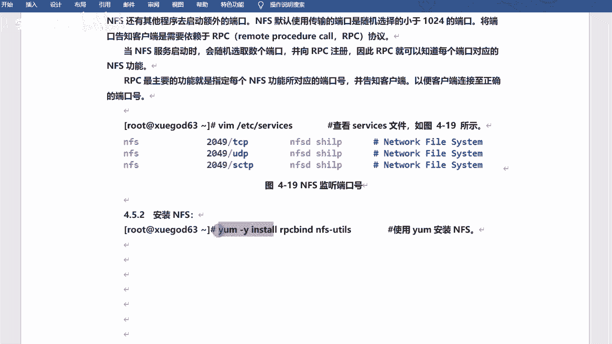

## 安装NFS服务

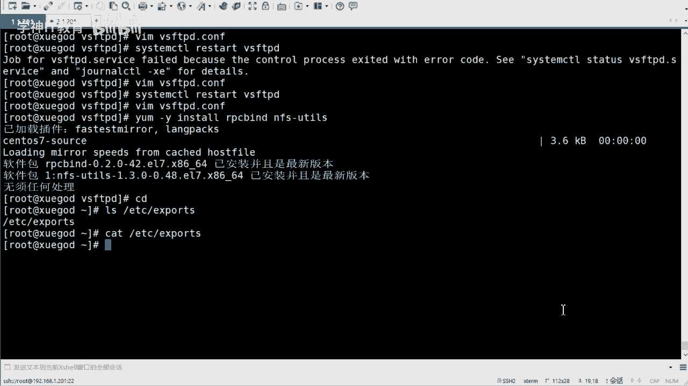

要配置NFS服务器，首先需要安装必要的软件包。以下是安装步骤：

1.  检查并安装`nfs-utils`和`rpcbind`软件包。
    ```bash
    yum install -y nfs-utils rpcbind
    ```
2.  这两个软件包在标准系统安装后通常已存在。若未安装，执行上述命令即可。

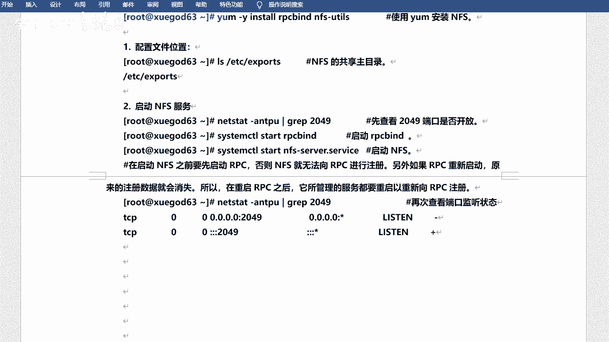

安装完成后，NFS的主要配置文件位于`/etc/exports`，该文件初始为空。

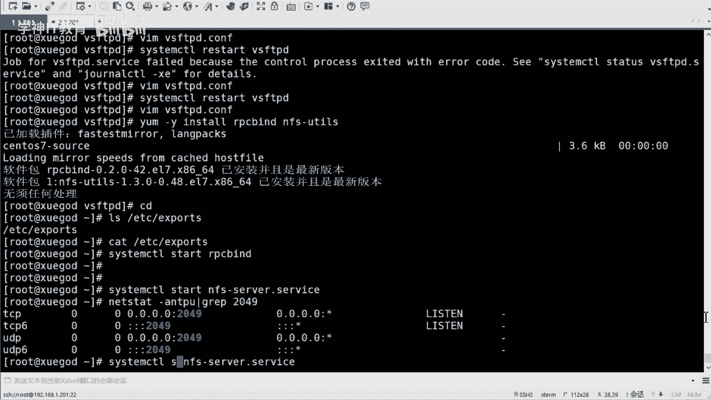

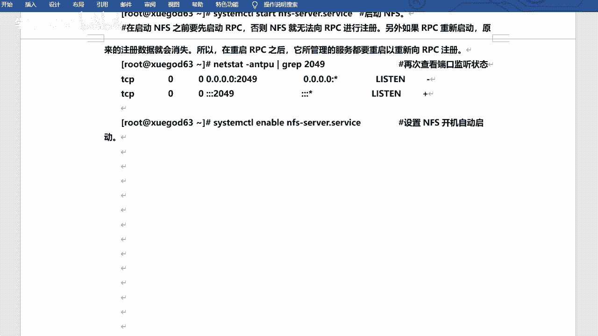

## 配置NFS服务器

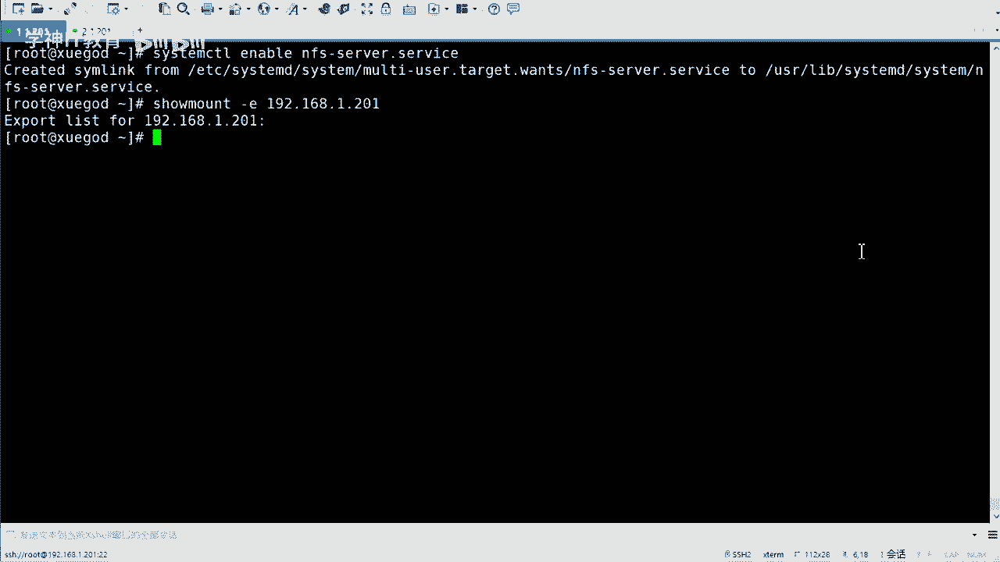

配置文件`/etc/exports`用于定义要共享的目录及其访问权限。其基本格式为：
```
共享目录路径 客户端地址(权限参数)
```

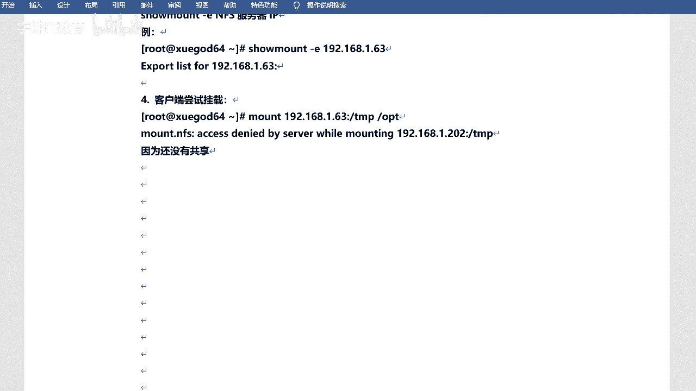

例如，将`/media`目录共享给所有客户端，并赋予读写权限，可写入如下内容：
```
/media *(rw)
```
*   `/media`：要共享的目录路径。
*   `*`：代表允许所有网段的客户端访问。也可指定具体IP或网段，如`192.168.1.0/24`。
*   `(rw)`：权限参数，`rw`表示读写，`ro`表示只读。

## 启动NFS服务

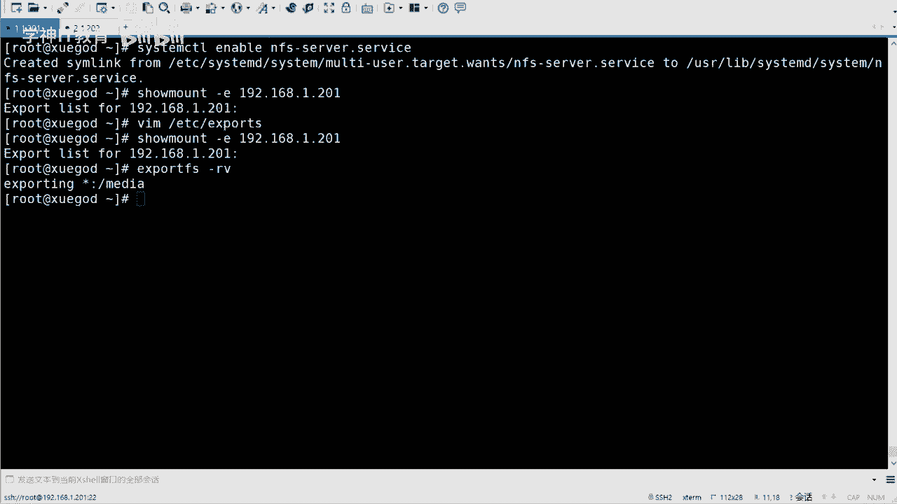

配置好共享目录后，需要启动相关服务。**请注意，必须先启动`rpcbind`服务，再启动`nfs-server`服务**，以便NFS能向RPC正确注册。

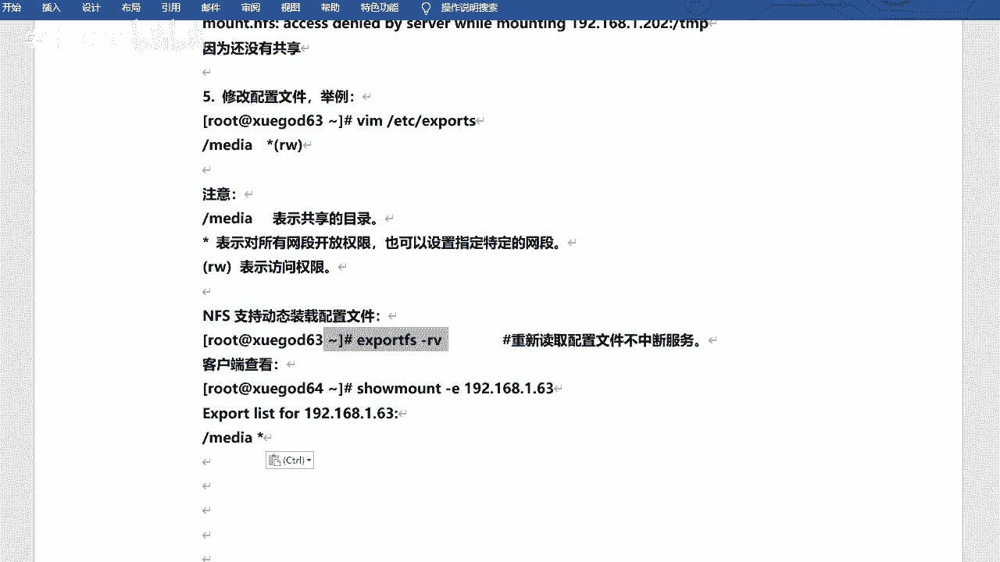

以下是启动服务的步骤：
```bash
# 启动rpcbind服务
systemctl start rpcbind
# 设置rpcbind开机自启
systemctl enable rpcbind

# 启动nfs-server服务
systemctl start nfs-server
# 设置nfs-server开机自启
systemctl enable nfs-server
```
启动后，可以使用`netstat -tunlp | grep 2049`命令验证NFS端口是否在监听。

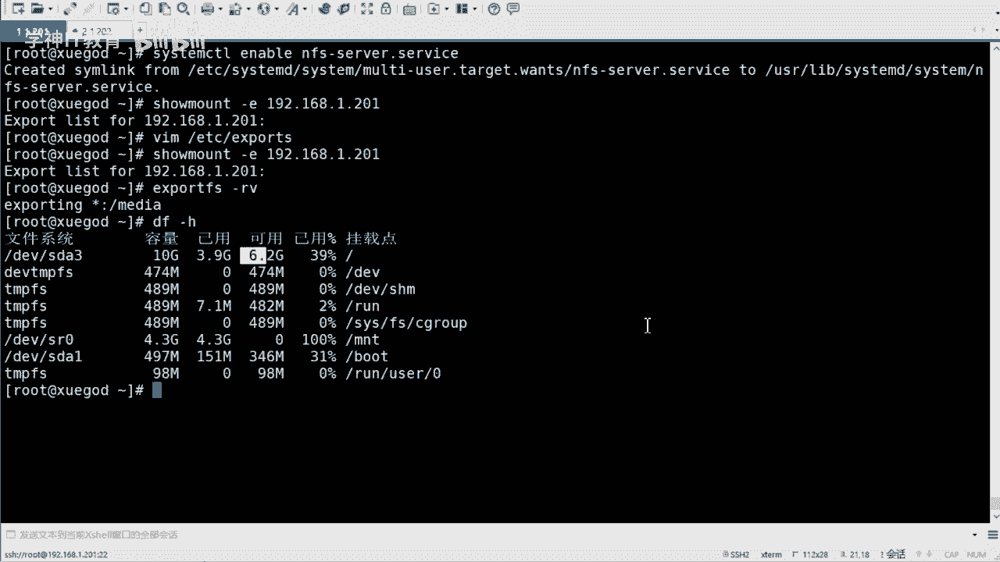

**重要提示**：如果重启了`rpcbind`服务，它所管理的NFS服务也需要重启以重新注册。

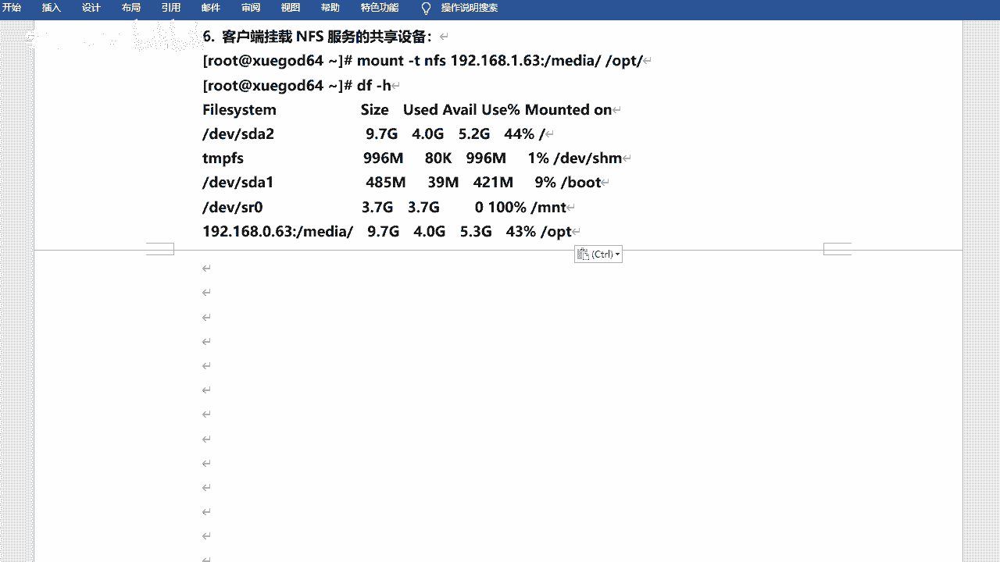

## 客户端挂载NFS共享

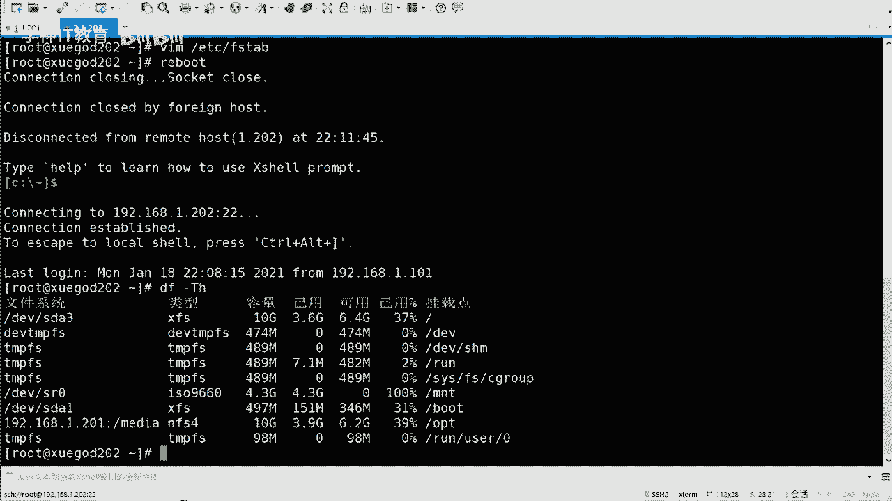

在NFS服务器配置并启动后，客户端可以查看并挂载共享目录。


1.  **查看服务器共享列表**：
    在客户端执行以下命令，查看NFS服务器（假设IP为192.168.1.201）导出的共享目录。
    ```bash
    showmount -e 192.168.1.201
    ```
    在服务器本机上，可以使用`exportfs -v`查看自己共享的目录。

2.  **手动挂载共享目录**：
    使用`mount`命令将远程共享目录挂载到本地的一个空目录下。
    ```bash
    mount -t nfs 192.168.1.201:/media /opt
    ```
    *   `-t nfs`：指定文件系统类型为NFS。
    *   `192.168.1.201:/media`：NFS服务器地址及共享目录路径。
    *   `/opt`：本地挂载点目录。

    挂载成功后，执行`df -Th`命令可以看到类型为`nfs4`的挂载信息。

## 设置开机自动挂载

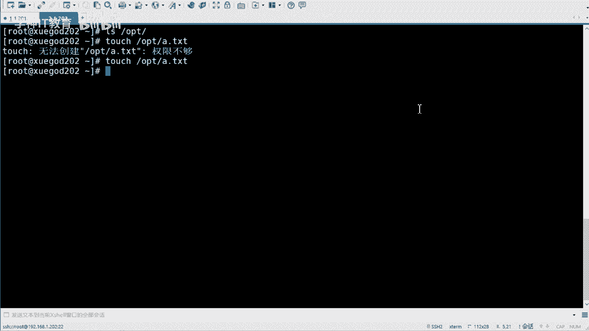

为了实现系统重启后自动挂载NFS共享，需要修改客户端的`/etc/fstab`文件。

在`/etc/fstab`文件中添加如下一行：
```
192.168.1.201:/media /opt nfs defaults 0 0
```
添加后，可以执行`mount -a`命令测试配置是否正确，或直接重启系统验证。

## 权限问题说明

在挂载NFS共享后，即使服务器端共享权限设置为`rw`，客户端也可能无法创建文件。这是因为NFS默认会将客户端的root用户映射为服务器上的`nfsnobody`用户。

**解决方法**：在NFS服务器上，将共享目录的属主和属组改为`nfsnobody`。
```bash
chown -R nfsnobody:nfsnobody /media
```
**注意**：在RHEL 8中，`nfsnobody`用户可能简写为`nobody`。

## NFS配置参数详解

NFS的配置非常灵活，以下是一些常用参数说明。

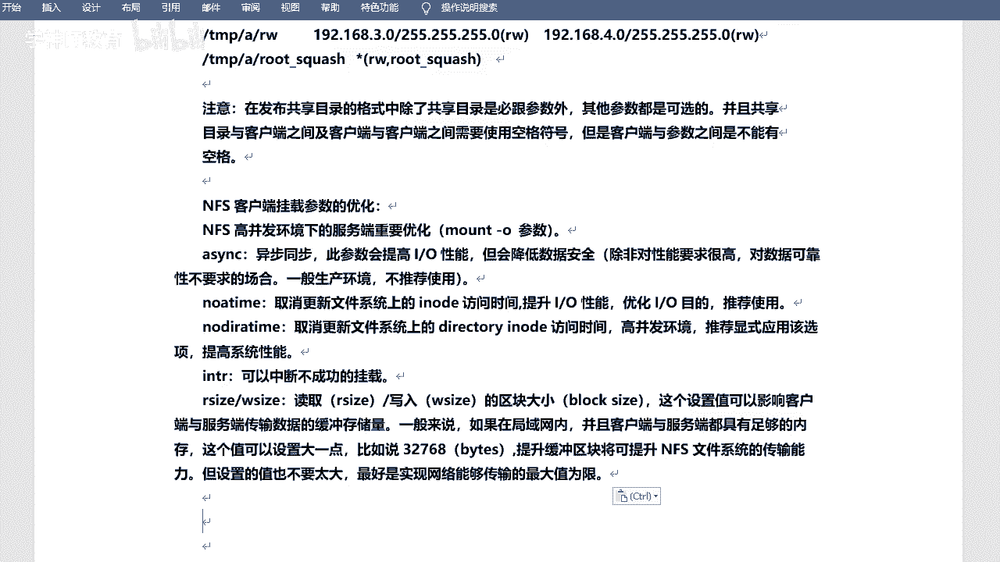

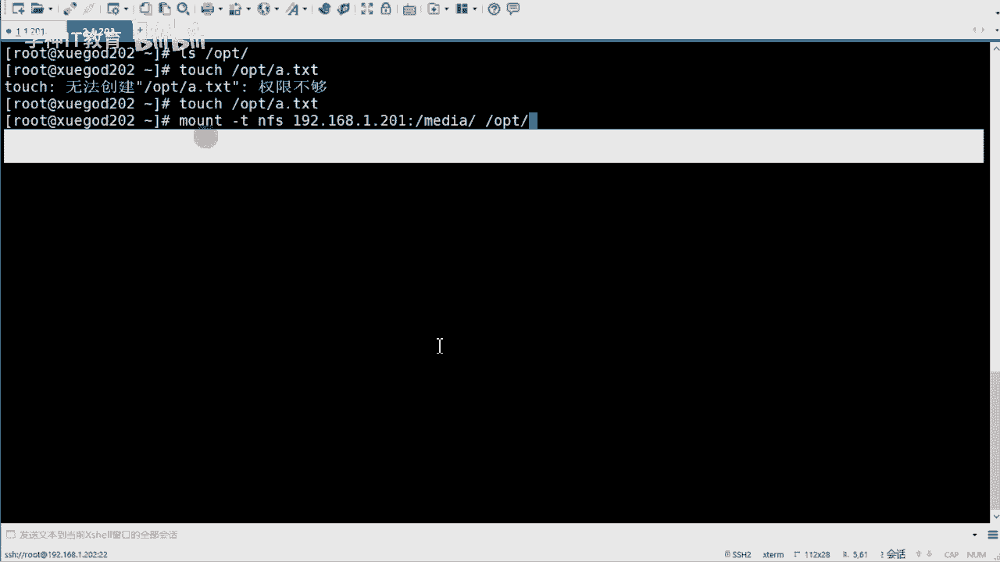

**服务器端配置参数（位于`/etc/exports`）**：
以下是`/etc/exports`文件中可用的主要权限参数：
*   `rw`：读写权限。
*   `ro`：只读权限。
*   `sync`：同步写入，数据同时写入内存和硬盘。
*   `async`：异步写入，数据先暂存于内存。
*   `no_root_squash`：客户端root用户保持root权限（慎用）。
*   `root_squash`：客户端root用户映射为匿名用户（默认）。
*   `all_squash`：所有客户端用户都映射为匿名用户。
*   `subtree_check`：检查父目录权限（适用于共享子目录）。
*   `no_subtree_check`：不检查父目录权限（适用于共享整个目录）。

多个参数用逗号分隔，例如：`/sharedata 192.168.1.0/24(rw,sync,all_squash)`。


**客户端挂载参数（`mount`命令使用）**：
在手动挂载时，可以使用`-o`选项指定挂载参数以优化性能或行为。
```bash
mount -t nfs -o noatime,nodiratime,rsize=32768,wsize=32768 192.168.1.201:/media /opt
```
常用参数包括：
*   `noatime`：不更新文件的访问时间，提升I/O性能。
*   `nodiratime`：不更新目录的访问时间。
*   `rsize/wsize`：设置读写数据块的大小。
*   `soft/hard`：设置挂载失败后的行为（硬挂载会持续重试，软挂载会报错）。

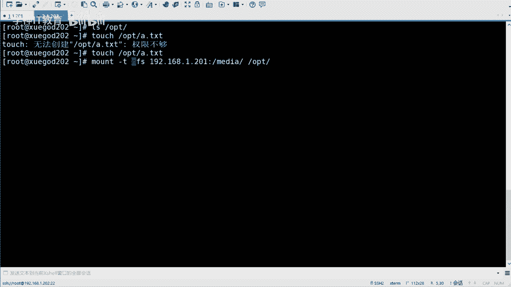


## 内核参数优化（可选）

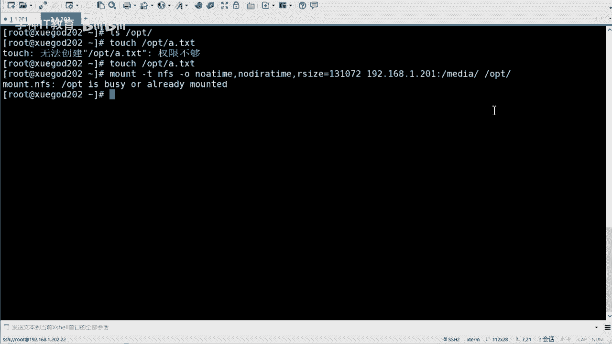

对于高性能要求的场景，可以调整内核参数以优化NFS性能。通过`sysctl`命令修改并生效。
```bash
# 编辑配置文件
vim /etc/sysctl.conf
# 添加或修改如下参数
net.core.rmem_default = 262144
net.core.wmem_default = 262144
net.core.rmem_max = 67108864
net.core.wmem_max = 67108864

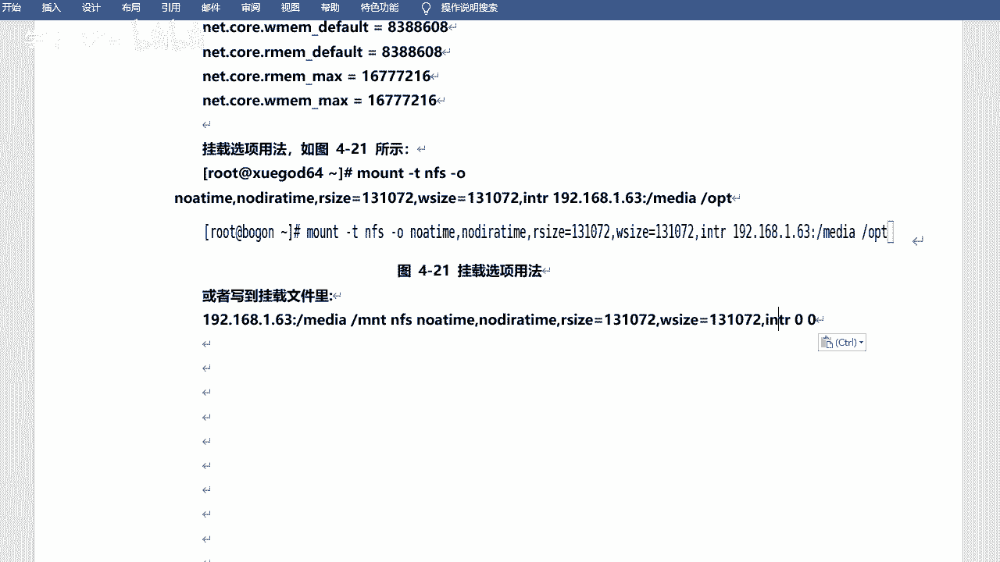

# 使配置生效
sysctl -p
```

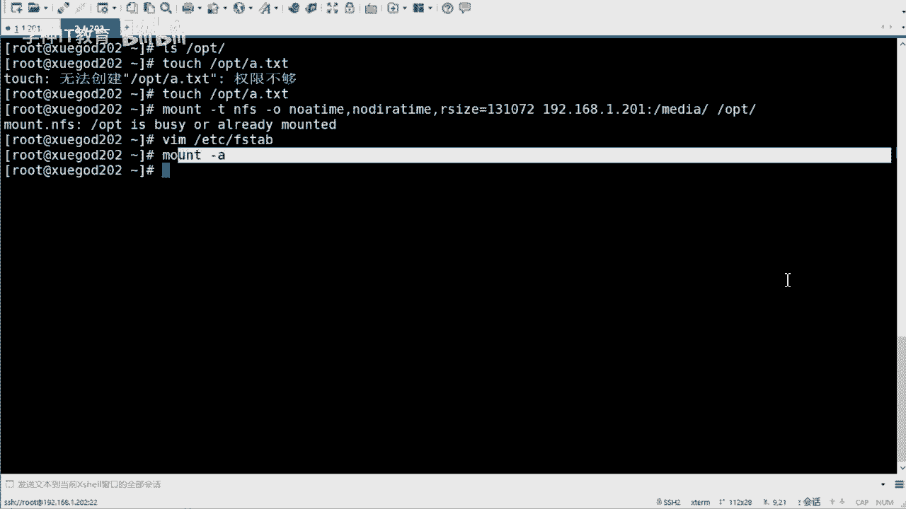

## 课程总结

本节课中我们一起学习了NFS网络文件系统的配置与管理。主要内容包括：
1.  **NFS基础**：理解了NFS的工作原理及其C/S架构。
2.  **服务安装与配置**：学会了安装`nfs-utils`和`rpcbind`软件包，并编辑`/etc/exports`文件来共享目录。
3.  **服务管理**：掌握了正确启动NFS服务（先`rpcbind`后`nfs-server`）的方法。
4.  **客户端操作**：实现了使用`showmount`查看共享、使用`mount`命令挂载共享目录。
5.  **自动挂载**：通过配置`/etc/fstab`文件实现了开机自动挂载NFS共享。
6.  **权限与参数**：了解了NFS的权限映射机制，并学习了服务器端与客户端常用的配置参数。

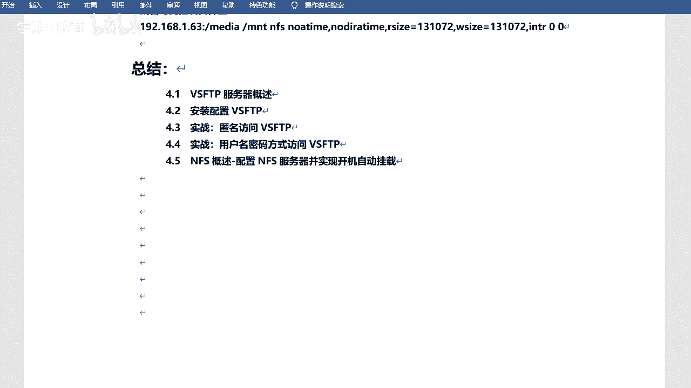

通过掌握NFS，你可以在Linux环境中轻松搭建跨主机的文件共享服务，为构建集群或分布式应用打下基础。