# RHCE8红帽认证课程：1：环境配置与sshd服务介绍 🚀

在本节课中，我们将学习如何为后续的服务学习配置基础环境，并详细介绍第一个服务——sshd（安全外壳守护进程）服务。这是第二阶段学习的开端，我们将从CentOS 7系统开始，逐步掌握各种核心服务的配置与管理。

## 环境准备与系统配置

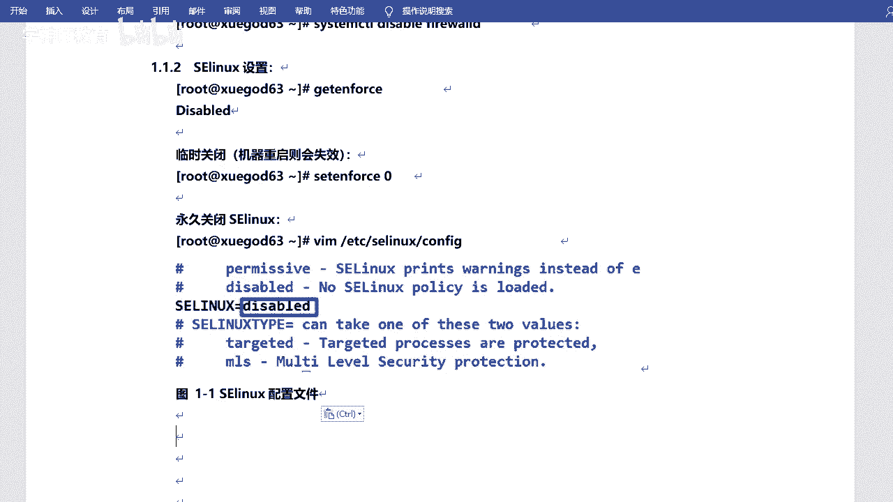

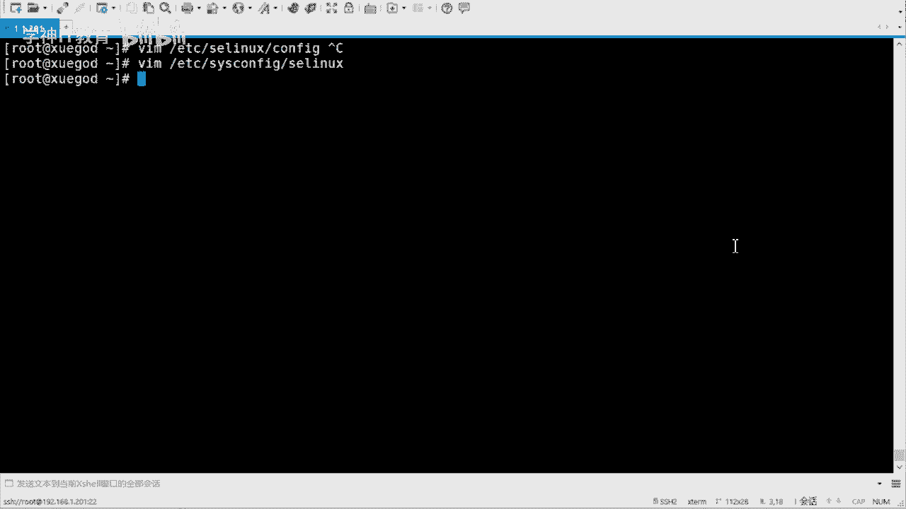

上一节我们概述了课程安排，本节中我们来看看如何为实验准备一个干净的CentOS 7系统环境。这包括关闭不必要的安全组件、配置网络以及设置软件源。

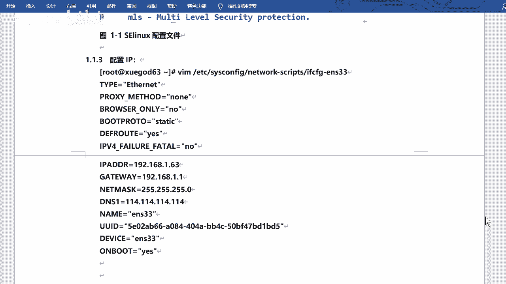

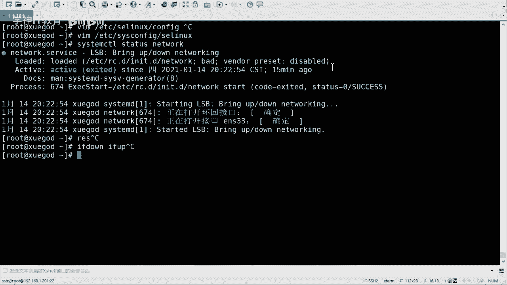

### 关闭防火墙与SELinux
在开始服务学习前，建议暂时关闭防火墙和SELinux，以避免它们对实验造成干扰。

以下是操作步骤：
*   **关闭防火墙**：执行 `systemctl stop firewalld` 停止服务，然后执行 `systemctl disable firewalld` 禁止开机启动。
*   **关闭SELinux**：编辑配置文件 `/etc/selinux/config`，将 `SELINUX=` 的值改为 `disabled`，然后重启系统生效。也可临时执行 `setenforce 0`。

### 配置静态IP地址
稳定的IP地址对于服务器管理至关重要。在CentOS 7中，我们通过修改网卡配置文件来设置静态IP。

以下是关键配置项：
*   **BOOTPROTO**：设置为 `static`。
*   **ONBOOT**：设置为 `yes`。
*   **IPADDR**：设置静态IP地址，例如 `192.168.1.100`。
*   **NETMASK**：设置子网掩码，例如 `255.255.255.0`。
*   **GATEWAY**：设置网关地址。

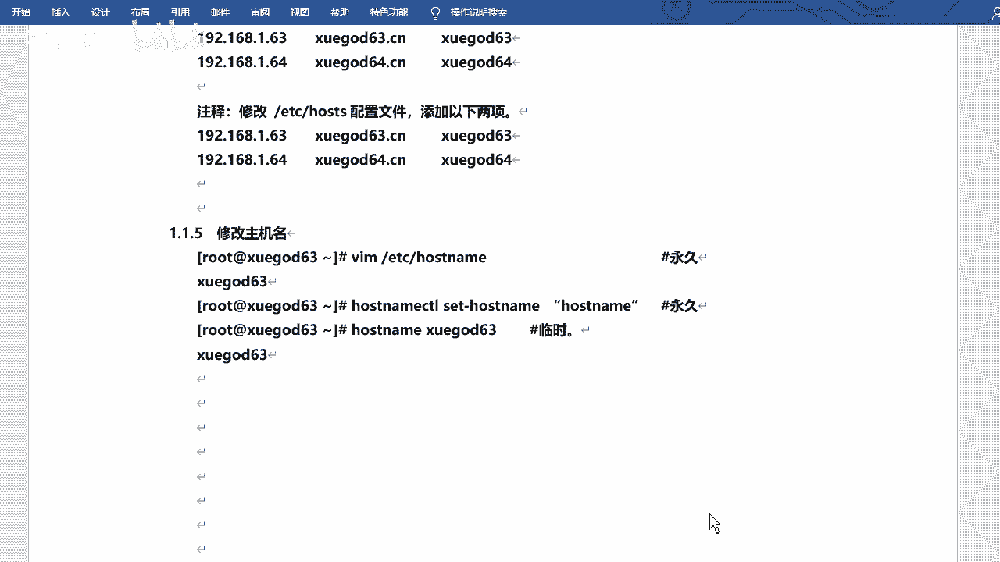

配置完成后，执行 `systemctl restart network` 使配置生效。请注意，IP地址应根据您实际的网络环境进行设置。

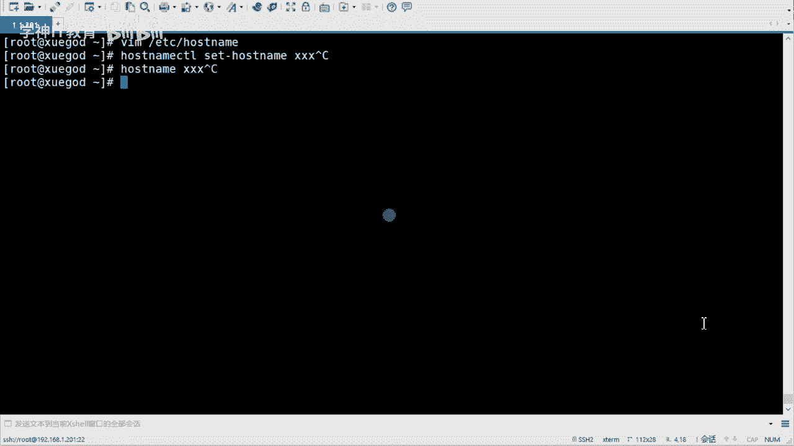

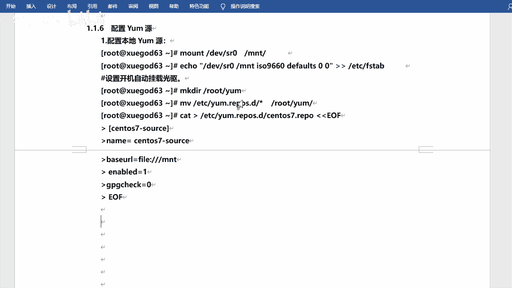

### 设置主机名与主机映射
清晰的主机名有助于在多台服务器间进行区分和管理。

以下是相关操作：
*   **永久修改主机名**：编辑 `/etc/hostname` 文件，或使用命令 `hostnamectl set-hostname 新主机名`。
*   **临时修改主机名**：使用命令 `hostname 新主机名`。
*   **设置主机映射**：编辑 `/etc/hosts` 文件，添加如 `192.168.1.100 server01` 的条目，方便通过主机名访问。

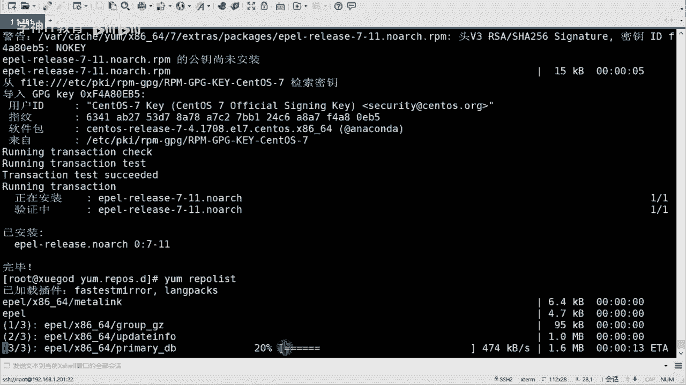

### 配置Yum软件源
为了顺利安装软件包，需要配置Yum源。可以使用本地光盘镜像，但更推荐配置网络源以获得更多更新的软件包。

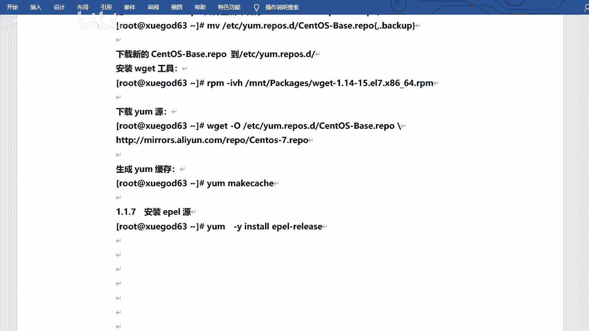

以下是配置网络源（以阿里云为例）的方法：
1.  备份原有repo文件：`cd /etc/yum.repos.d/ && mkdir bak && mv *.repo bak/`
2.  下载阿里云Base源：`wget -O /etc/yum.repos.d/CentOS-Base.repo https://mirrors.aliyun.com/repo/Centos-7.repo`
3.  下载阿里云EPEL源：`wget -O /etc/yum.repos.d/epel.repo https://mirrors.aliyun.com/repo/epel-7.repo`
4.  清理并重建缓存：`yum clean all && yum makecache`

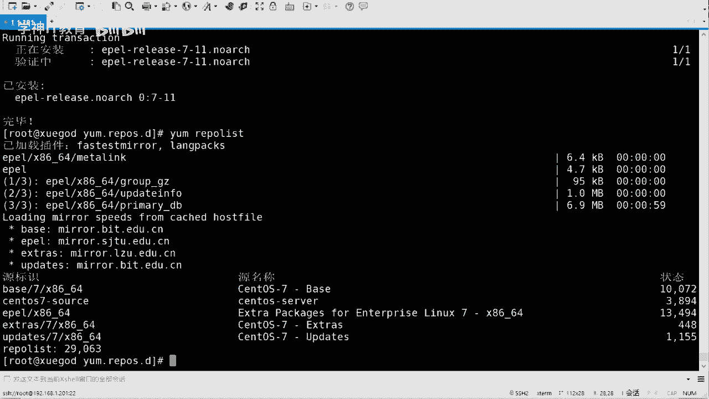

完成上述所有基础配置后，建议为虚拟机创建一个快照，以便后续实验能快速回退到干净状态。

## SSH服务详解 🔐

上一节我们完成了基础环境搭建，本节中我们来看看第一个服务——sshd。SSH（Secure Shell）服务是Linux系统远程管理的基石，它提供了加密的远程登录和文件传输功能。

### SSH服务概述
SSH服务相比古老的Telnet服务，最大的优势在于其传输过程是加密的，因此更加安全。我们日常使用的远程连接工具（如Xshell, FinalShell, Termius等）都基于SSH协议。

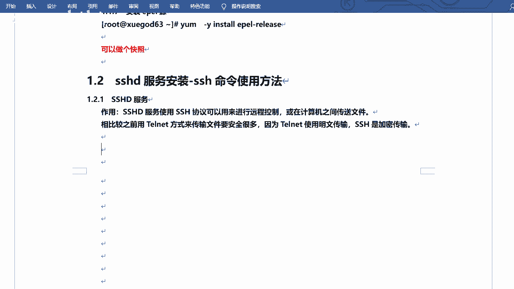

### 检查与安装SSH服务
通常，SSH服务在系统安装时已默认安装并启动。

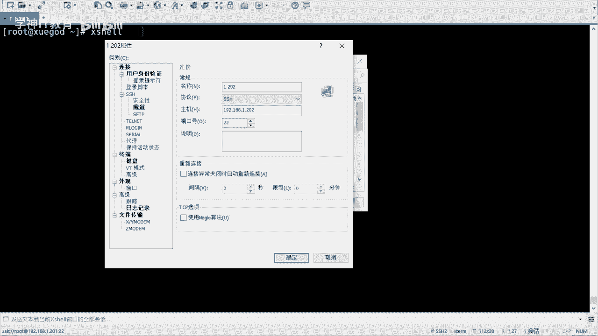

以下是验证和安装的方法：
*   **检查服务状态**：执行 `systemctl status sshd`，查看服务是否为 `active (running)`。
*   **检查安装的包**：执行 `rpm -qa | grep openssh`，查看是否安装了相关包。
*   **安装服务**：如果未安装，可以执行 `yum install -y openssh openssh-server openssh-clients` 进行安装。

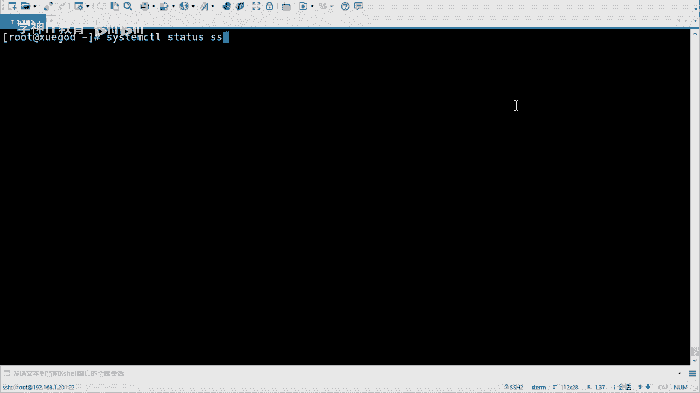

### SSH服务配置文件
学习服务，核心之一就是了解其配置文件。SSH服务有两个主要配置文件：

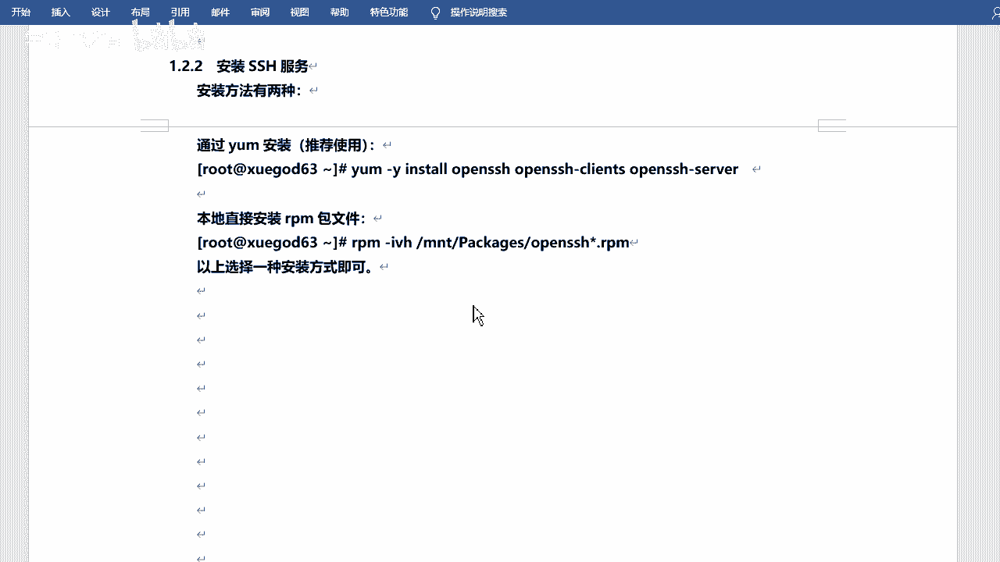

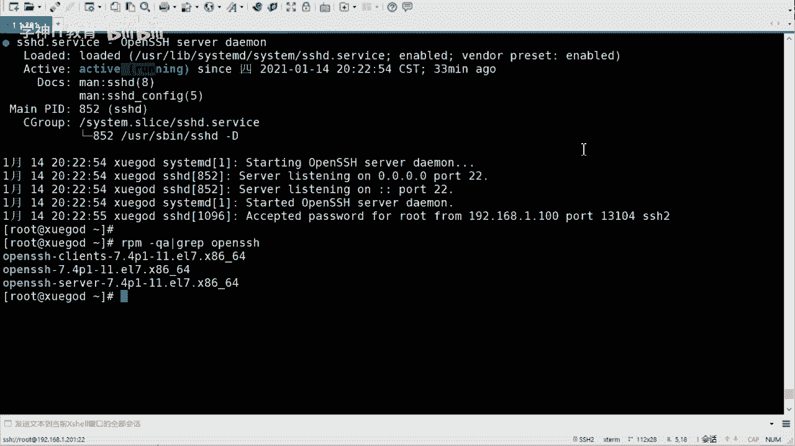

*   **服务端配置文件**：`/etc/ssh/sshd_config`。这是我们主要需要修改的文件，用于配置服务端的各项参数，如端口、允许登录的用户、认证方式等。
*   **客户端配置文件**：`/etc/ssh/ssh_config`。用于配置SSH客户端的行为，通常无需修改。

**请注意**：对于服务配置文件的众多参数，**无需死记硬背**。重要的是知道配置文件的位置和作用，具体参数在工作中可根据需求查阅文档。

### 管理SSH服务
在CentOS 7/8中，我们使用 `systemctl` 命令来管理服务。

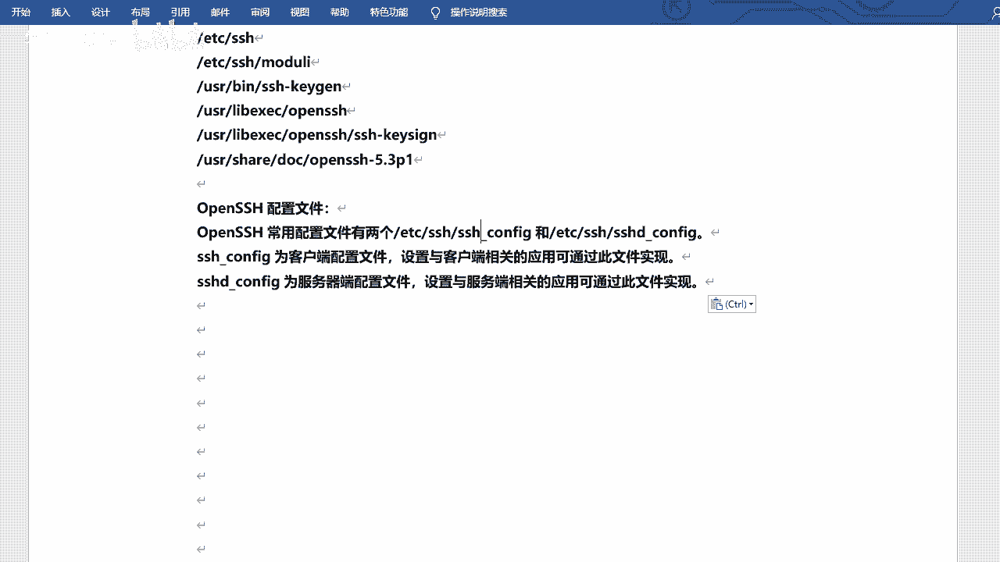

以下是常用命令：
*   **启动服务**：`systemctl start sshd`
*   **停止服务**：`systemctl stop sshd`
*   **重启服务**：`systemctl restart sshd`
*   **查看状态**：`systemctl status sshd`
*   **设置开机自启**：`systemctl enable sshd`

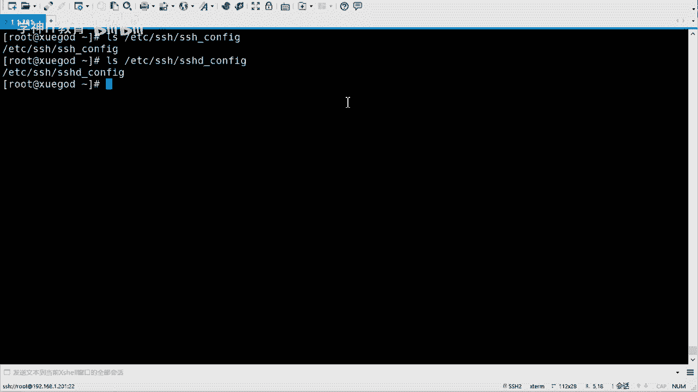

系统也兼容旧版的 `service` 和 `chkconfig` 命令，但底层仍调用 `systemctl`。

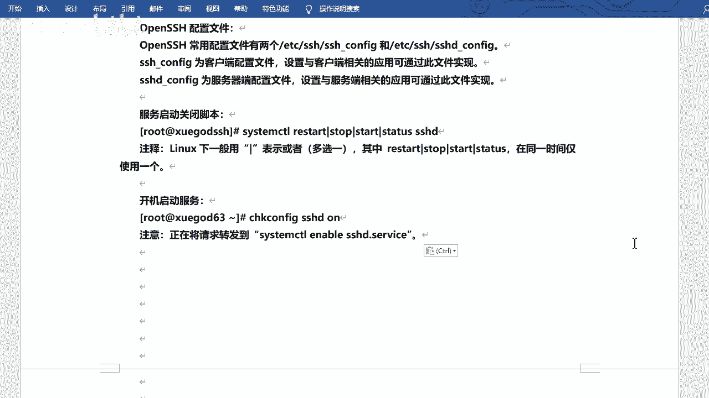

---

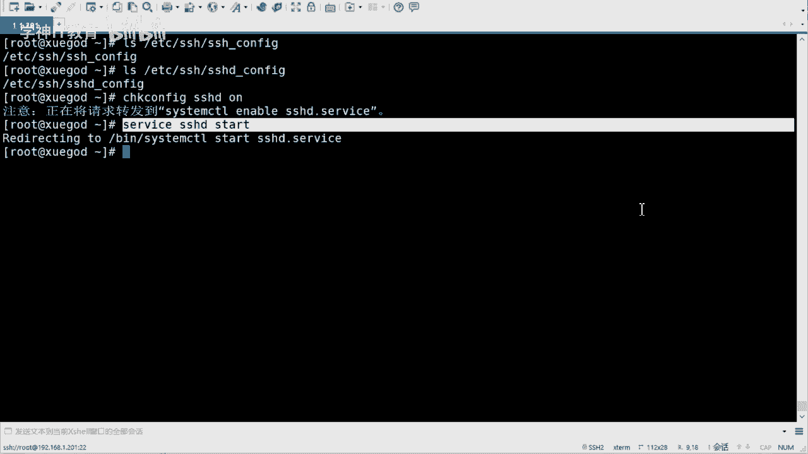

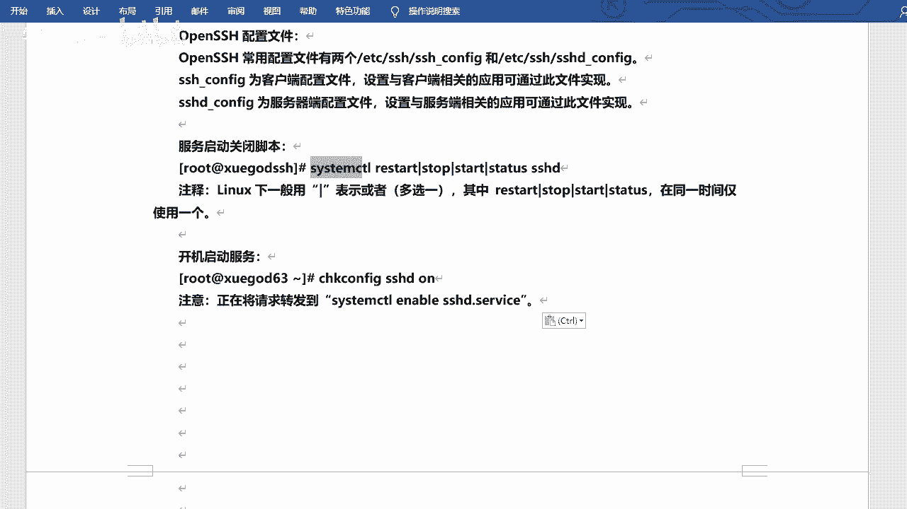

本节课中我们一起学习了第二阶段课程的基础环境配置方法，包括网络、主机名和软件源的设置，并深入介绍了SSH服务的基本概念、安装验证、核心配置文件以及服务管理命令。SSH服务是后续所有远程操作和文件传输的基础，理解其工作原理至关重要。下一节课，我们将开始学习如何具体配置SSH服务的安全选项和高级功能。