# RHCE8红帽认证课程：P2：SSH远程连接与配置文件详解 🔐

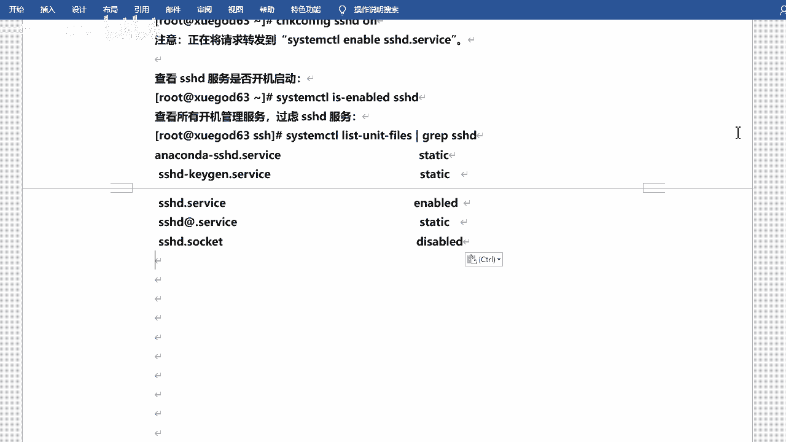

在本节课中，我们将要学习SSH远程连接的核心操作以及其服务端配置文件的详细讲解。我们将从SSH服务的基本管理开始，逐步深入到连接方式、常用命令，并重点解析`/etc/ssh/sshd_config`配置文件中的关键参数，帮助你掌握安全、高效地配置SSH服务。

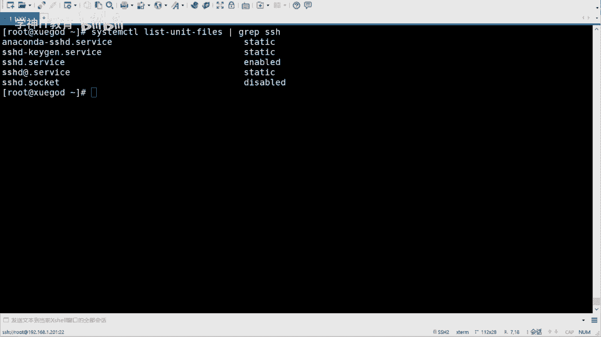

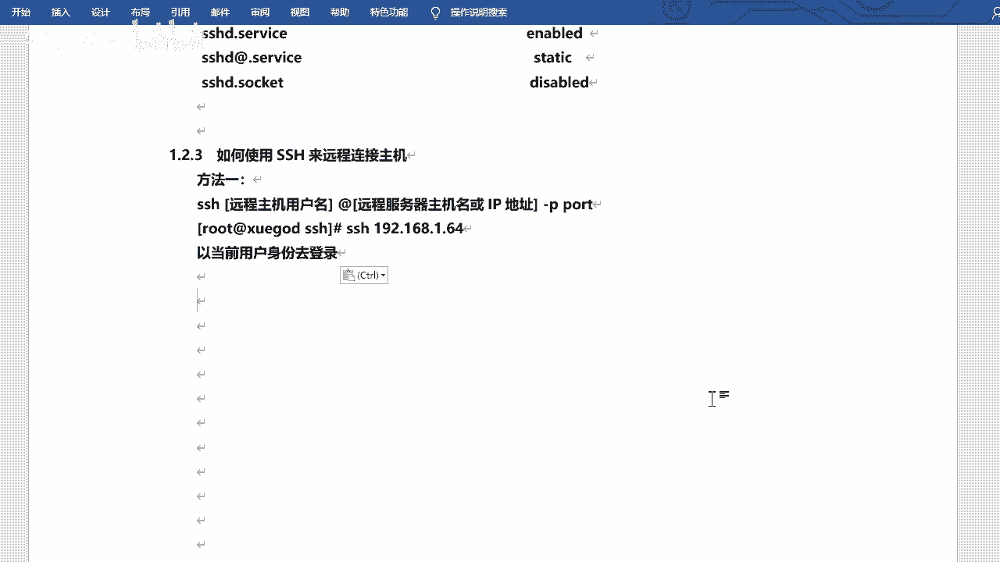

## SSH服务管理 🔧

上一节我们介绍了SSH的基本概念，本节中我们来看看如何管理SSH服务。在Linux系统中，SSH服务通常由`sshd`守护进程提供，我们可以使用`systemctl`命令对其进行管理。

以下是SSH服务管理的常用命令：

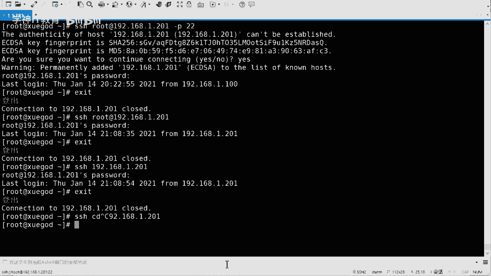

*   **启动服务**：`systemctl start sshd`
*   **停止服务**：`systemctl stop sshd`
*   **重启服务**：`systemctl restart sshd`
*   **查看服务状态**：`systemctl status sshd`
*   **设置开机自启**：`systemctl enable sshd`
*   **禁用开机自启**：`systemctl disable sshd`

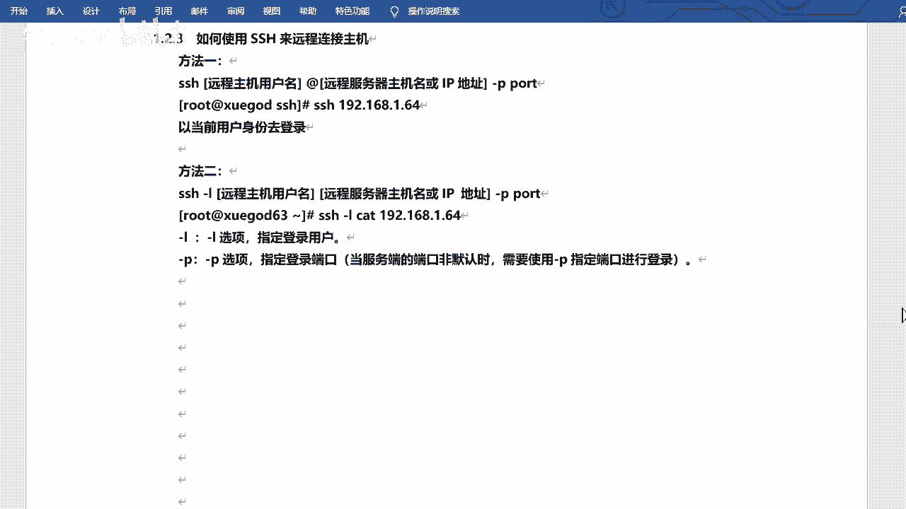

若要检查`sshd`服务是否已设置为开机启动，可以使用命令：
```bash
systemctl is-enabled sshd
```
该命令会返回 `enabled`（已启用）或 `disabled`（已禁用）。

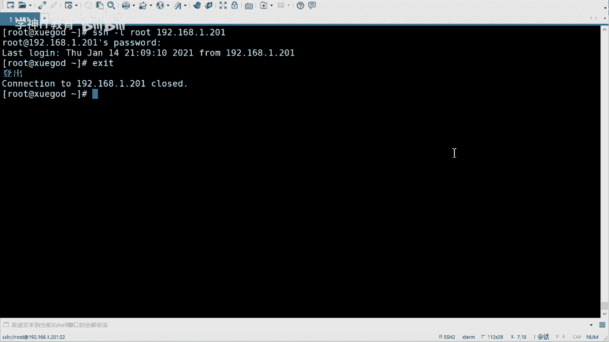

## SSH连接方式与命令 💻

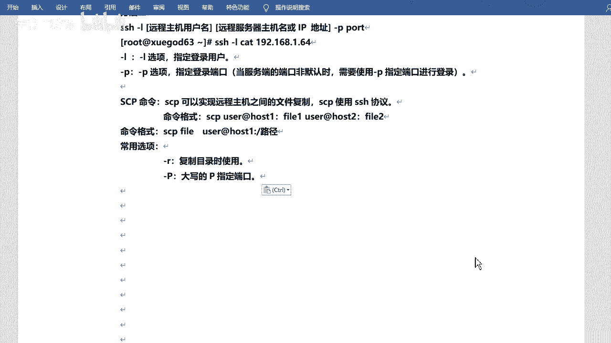

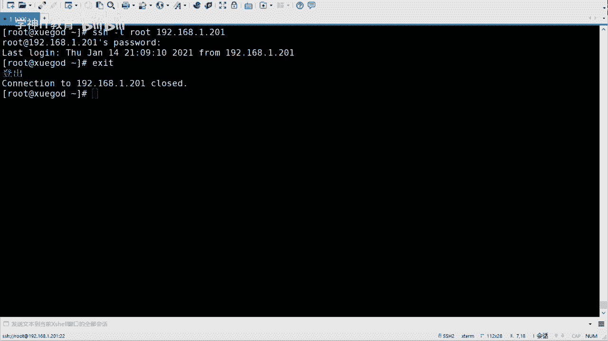

了解了服务管理后，我们来看看如何使用SSH进行连接。除了使用Windows端的图形化工具（如Xshell、PuTTY），在Linux或macOS的终端中，可以直接使用`ssh`命令进行连接。

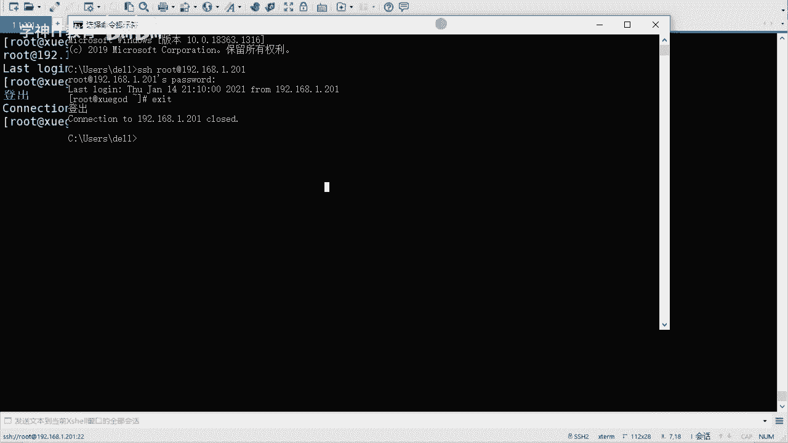

以下是SSH连接的几种语法格式：

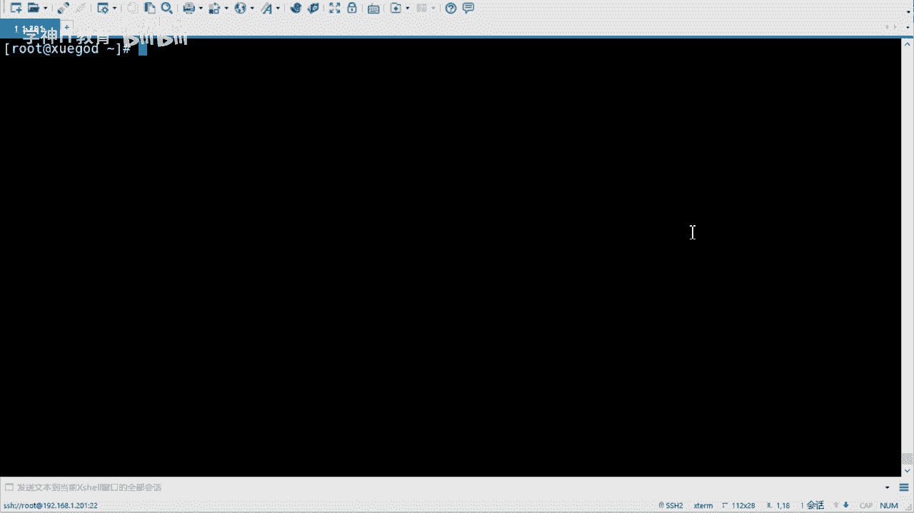

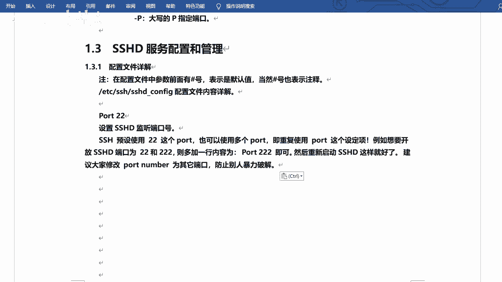

*   **标准格式（指定用户）**：`ssh username@hostname_or_ip`
*   **指定端口**：`ssh -p port_number username@hostname_or_ip`
*   **使用 `-l` 参数指定用户**：`ssh -l username hostname_or_ip`

例如，以`root`用户身份连接IP为`192.168.1.201`的服务器，默认端口为22：
```bash
ssh root@192.168.1.201
```
首次连接时会提示确认主机密钥，输入`yes`后，再输入相应用户的密码即可登录。退出登录使用 `exit` 命令。

与SSH协议相关的另一个常用命令是`scp`，用于在本地和远程主机之间安全地拷贝文件。

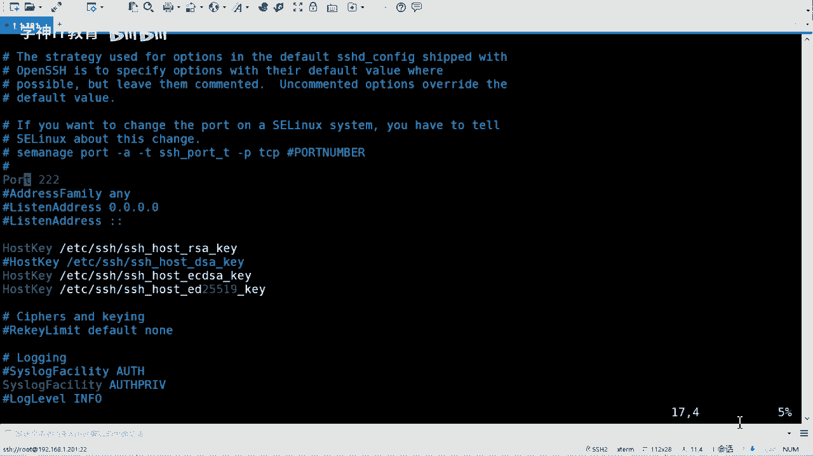

以下是`scp`命令的基本格式：

*   **拷贝文件到远程主机**：`scp local_file username@remote_ip:/remote/directory/`
*   **从远程主机拷贝文件**：`scp username@remote_ip:/remote/file local_directory`
*   **递归拷贝目录（加 `-r` 参数）**：`scp -r local_directory username@remote_ip:/remote/directory/`
*   **指定端口（加 `-P` 参数）**：`scp -P port_number ...`

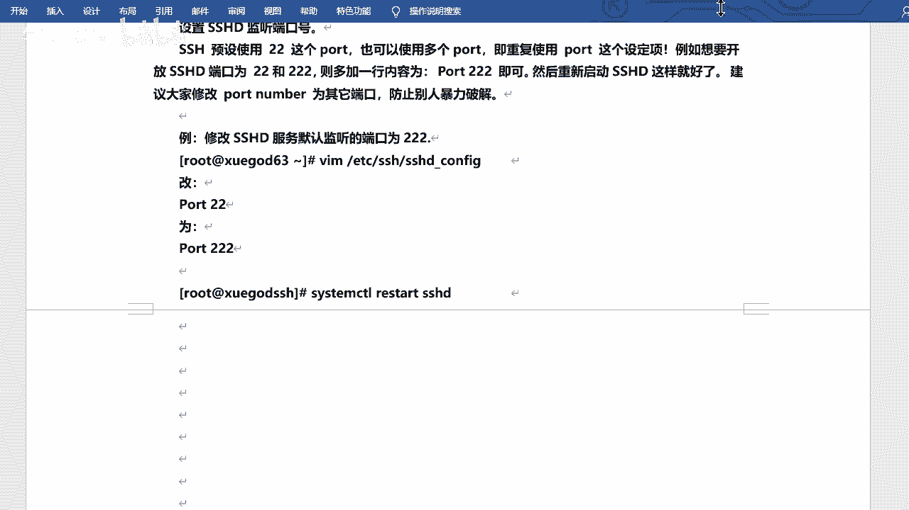

## SSH服务端配置文件详解 ⚙️

掌握了连接方法后，本节我们将深入SSH服务端的核心——配置文件。SSH服务端的主配置文件是 `/etc/ssh/sshd_config`。修改此文件可以控制SSH服务的行为，增强安全性。

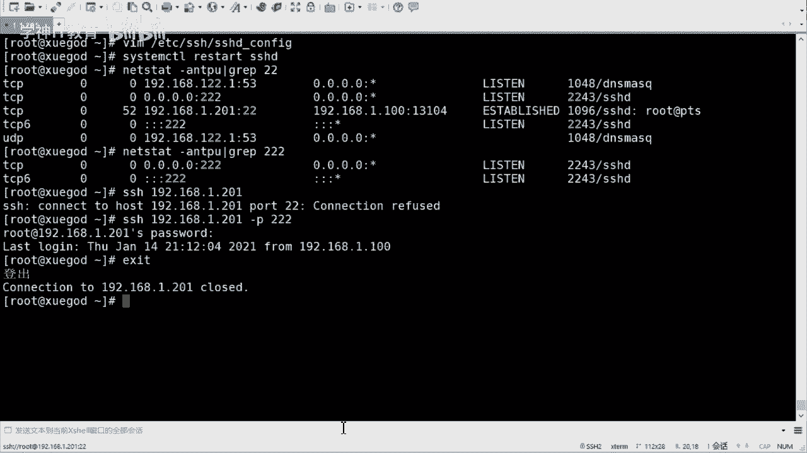

**重要提示**：修改配置文件前，建议先进行备份，例如：
```bash
cp /etc/ssh/sshd_config /etc/ssh/sshd_config.bak
```
这样在配置出错时，可以快速恢复。

修改配置后，必须重启`sshd`服务才能使更改生效：
```bash
systemctl restart sshd
```

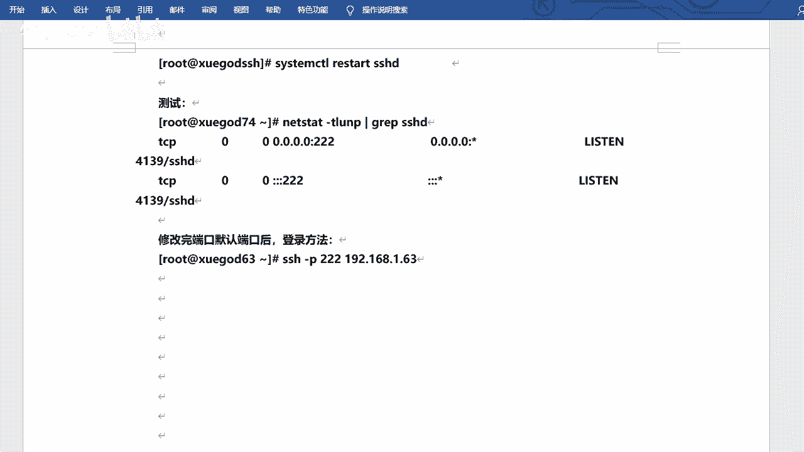

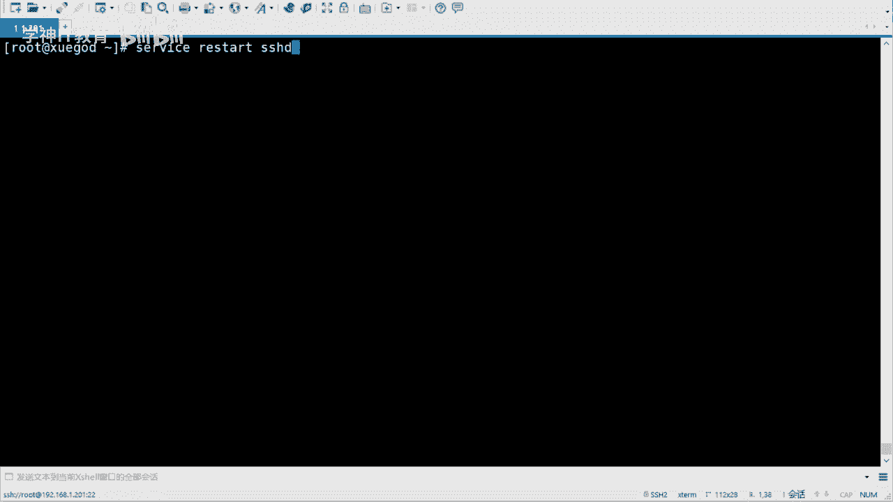

以下是配置文件中一些关键的安全相关参数及其说明：

*   **`Port 22`**： 定义SSH服务监听的端口号。为提高安全性，建议修改为非默认的端口（如 `2222`）。修改时需去掉行首的 `#` 注释符号。
*   **`#AddressFamily any`** 与 **`#ListenAddress 0.0.0.0`**： 默认监听所有IPv4地址（`0.0.0.0`）。如果服务器不需要从公网通过SSH访问，可以将其改为内网IP地址以增强安全。
*   **`PermitRootLogin yes`**： 是否允许root用户直接远程登录。出于安全考虑，**强烈建议将其改为 `no`**，禁止root远程登录。日常管理应使用普通用户登录后，再通过 `su` 或 `sudo` 切换权限。
*   **`PasswordAuthentication yes`**： 是否启用密码验证。可以设置为 `no` 来强制使用密钥对认证，安全性更高。
*   **`PermitEmptyPasswords no`**： 是否允许空密码登录。必须保持为 `no`。
*   **`PrintLastLog yes`**： 是否打印用户上次登录的信息。登录后会显示类似 `Last login: Mon Aug 1 10:00:00 2022 from 192.168.1.100` 的提示。

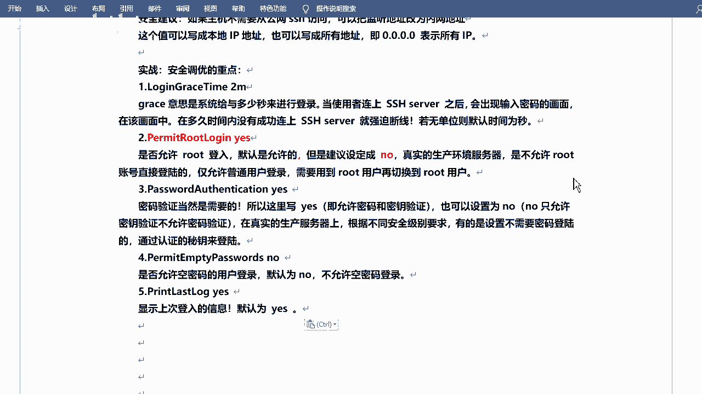

## 配置文件扩展：登录提示信息 ℹ️

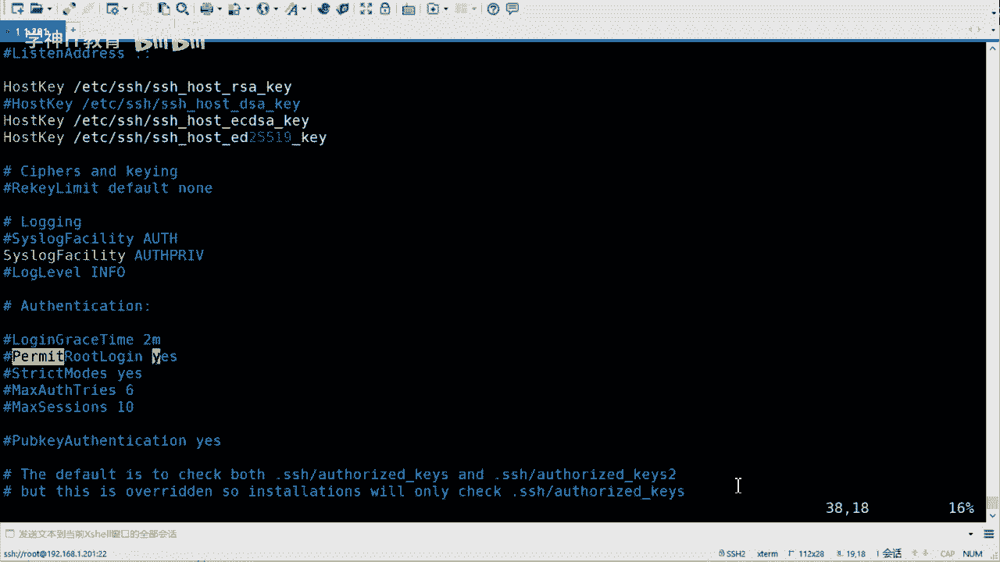

除了核心安全配置，我们还可以自定义用户登录时看到的提示信息。这个功能通过 `/etc/motd`（Message Of The Day）文件实现。

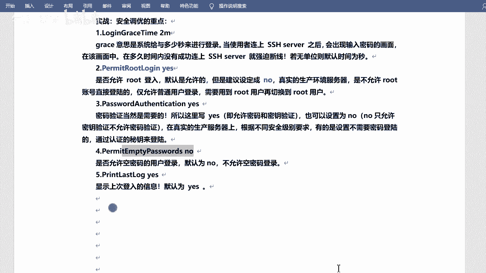

例如，我们可以添加一条警告信息：
```bash
echo “Warning: All operations will be logged and monitored.” > /etc/motd
```
当用户通过SSH成功登录后，在显示上次登录信息的下方，就会看到这行自定义的提示。

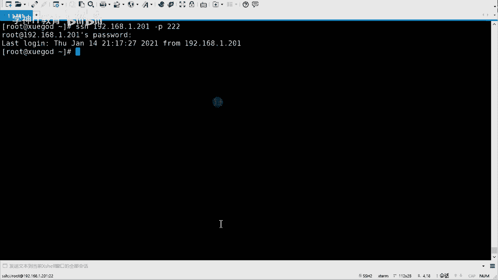

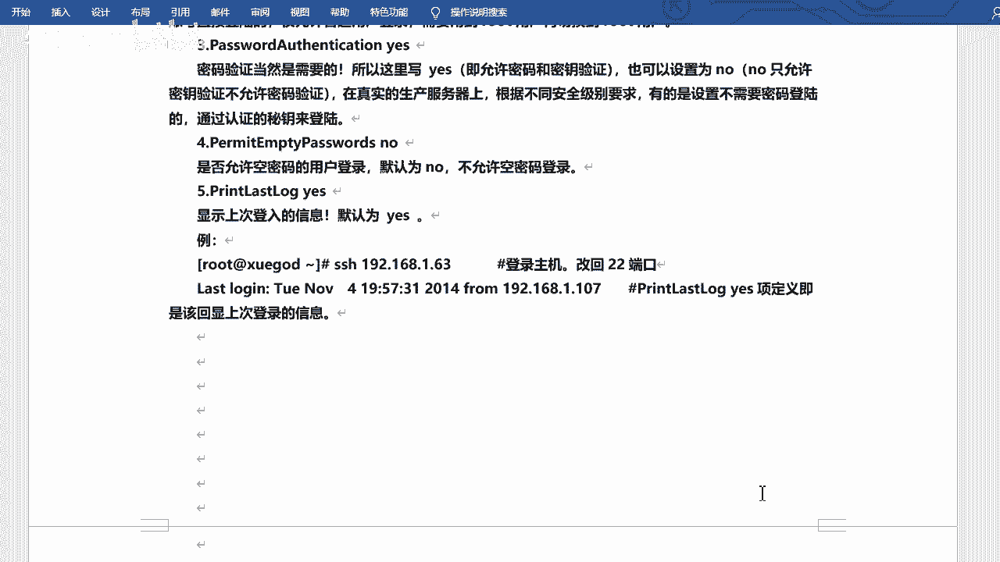

## 性能优化参数 ⚡

最后，我们来看一个可能影响连接速度的参数。在配置文件中，有一个参数是 **`UseDNS`**。

*   **`UseDNS yes`**： 当设置为 `yes` 时，SSH服务器会尝试通过DNS反查客户端的主机名。这在某些内网环境或DNS解析较慢的情况下，可能导致SSH连接建立速度变慢。
*   **建议**： 在内网环境中，如果不需要此功能，可以将其设置为 **`no`** 以加快连接速度。

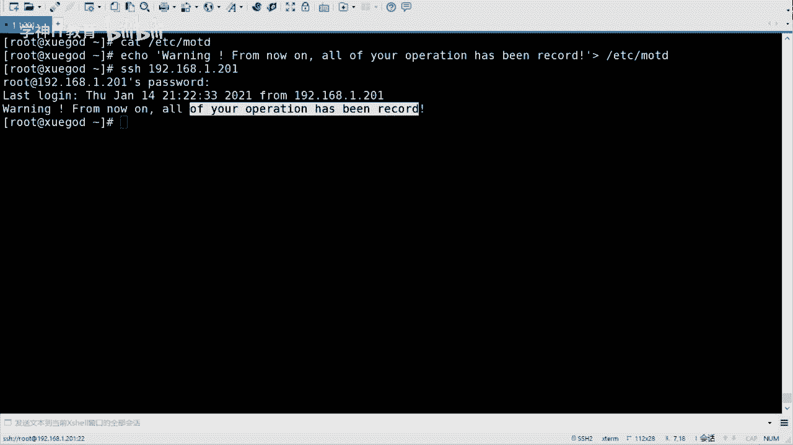

---

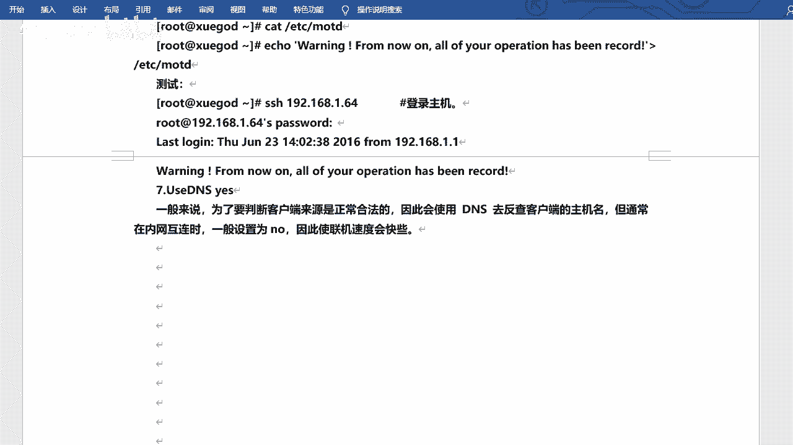

本节课中我们一起学习了SSH远程连接的完整知识。我们从SSH服务的基本管理命令开始，实践了多种连接方式和文件传输命令`scp`。随后，我们深入剖析了`/etc/ssh/sshd_config`配置文件，重点讲解了修改默认端口、禁止root远程登录等关键安全配置，并了解了如何设置登录提示信息和优化连接性能。掌握这些内容，是进行安全、高效的Linux系统运维管理的重要基础。