# RHCE8红帽认证课程：P5：rsync介绍-同步单个目录 📚

在本节课中，我们将要学习rsync工具的基本概念和使用方法。rsync是Linux系统中一个强大的数据镜像备份和同步工具，它支持增量备份，能够高效地在不同主机之间同步数据。我们将从认识rsync开始，学习其安装、基本命令使用，并初步体验如何同步单个目录。

## 认识rsync 🔍

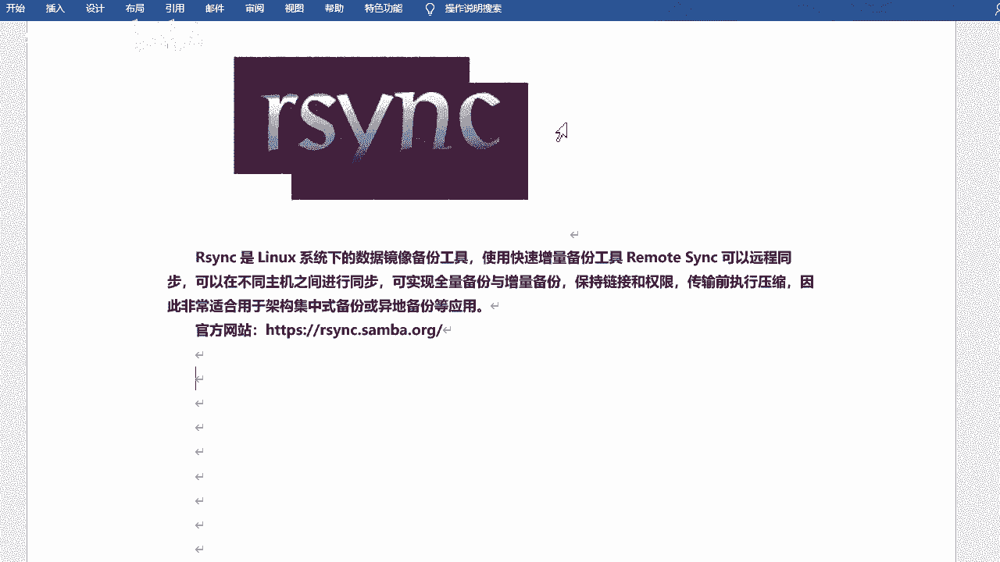

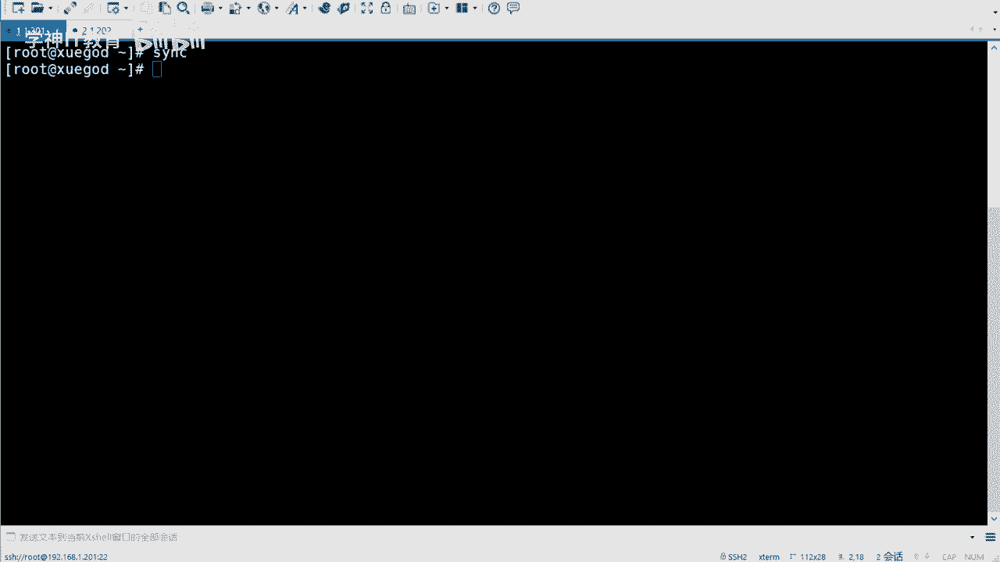

上一节我们概述了本节课的内容，本节中我们来详细了解一下rsync。

rsync是Linux系统下的数据镜像备份工具，全称是remote sync，意为远程同步。它可以在不同主机之间进行同步，实现全量备份和增量备份，并且能够保持文件的链接和权限属性。在传输前，rsync会对数据进行压缩，因此非常适合用于架构备份或异地备份等应用场景。

除了rsync，系统还有一个`sync`命令，用于将内存中的数据同步到硬盘。而rsync则专门用于文件和目录的备份与同步。

与简单的`cp`命令相比，rsync功能更强大：
*   `cp`命令类似于Windows的复制，主要用于本地或远程的文件拷贝，但无法高效处理大量数据或进行差异比较。
*   `rsync`是一个专业的同步工具，可以边复制、边统计、边比较，只传输修改过的文件，效率更高。

rsync的主要特点包括：
*   可以镜像保存整个目录树和文件系统。
*   能够保持原文件的属性（如权限、时间、软链接等）。
*   无需特殊权限即可安装和使用。
*   支持增量备份，首次同步复制全部内容，后续只传输修改过的文件。
*   支持在传输过程中进行压缩，以节省带宽。
*   可以使用`rcp`、`ssh`等方式传输文件，也可以通过直接的socket连接。

## 备份方式 📊

了解了rsync的基本概念后，我们来看看它支持的备份方式。rsync的核心优势在于其增量备份机制。

常见的备份方式有三种：
1.  **完全备份**：每次备份都复制所有的数据。
2.  **差异备份**：每次备份时，都与第一次的完全备份进行比较，备份所有发生变化的文件。
3.  **增量备份**：除第一次完全备份外，每次只备份自上一次备份以来新增或修改过的文件。

**rsync默认采用的就是增量备份方式**。它会通过对比源端和目标端文件的修改时间、大小等信息，仅同步发生变化的部分，这大大提高了备份效率，节省了时间和网络资源。

## rsync的运行模式与概念 🔄

在开始动手操作前，我们需要理解rsync的运行模式和一些关键概念，这有助于我们理解后续的同步方向。

rsync采用客户端-服务器（C/S）模式，但它也可以作为点对点的工具直接使用`rsync`命令。如果以守护进程模式运行rsync服务，它会监听**873**端口。

在同步过程中，涉及两台主机，根据数据流向的不同，会产生两组容易混淆的概念：

*   **以数据为参照**：这是最简单的理解方式。
    *   **源端**：数据所在的服务器。
    *   **目标端（备份端）**：数据要同步到的服务器。

*   **以同步动作为参照**：这解释了“推”和“拉”两种模式。
    *   **发起端**：主动发起同步操作的机器。
    *   **备份源**：被同步数据的机器。

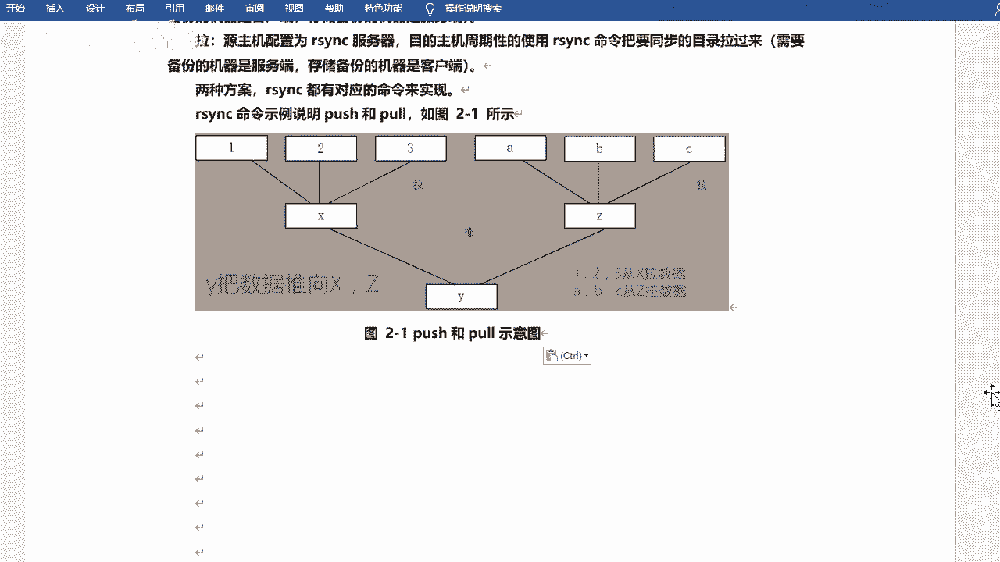

*   **以服务角色为参照**：
    *   **服务端**：运行`rsyncd`守护进程的机器。
    *   **客户端**：执行`rsync`命令的机器。

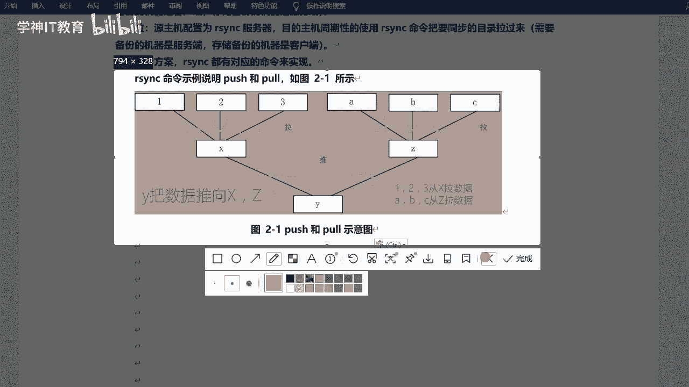

**“推”（Push）和“拉”（Pull）模式**：
*   **推（Push）**：源端主动将数据同步到目标端。此时，**目标端是服务端**，源端是客户端。
*   **拉（Pull）**：目标端主动从源端拉取数据。此时，**源端是服务端**，目标端是客户端。

对于初学者，建议**始终以“数据从源端同步到目标端”来思考**，这样可以避免概念混淆。在实际操作中，我们会明确指定源路径和目标路径。

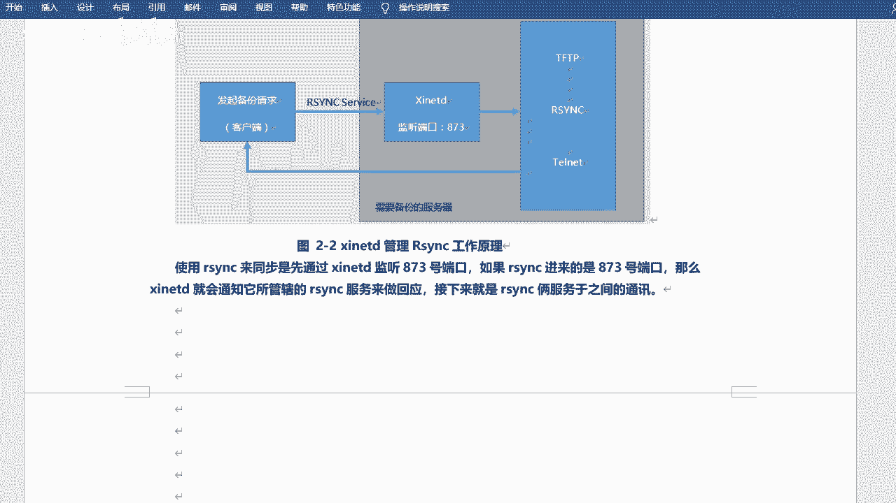

## 安装与基本命令使用 ⚙️

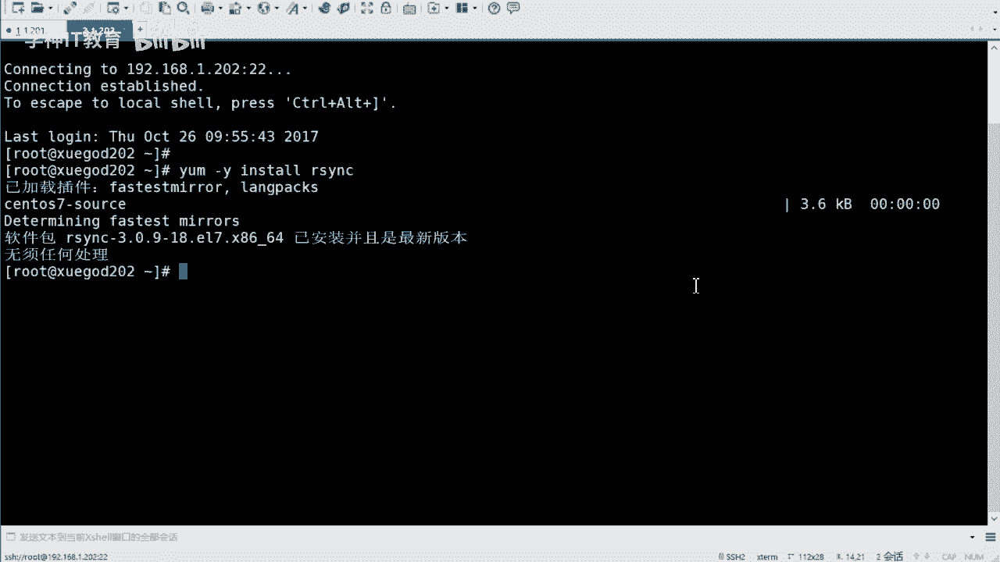

现在，我们进入实践环节。首先确保rsync工具已经安装，然后学习其基本命令格式。

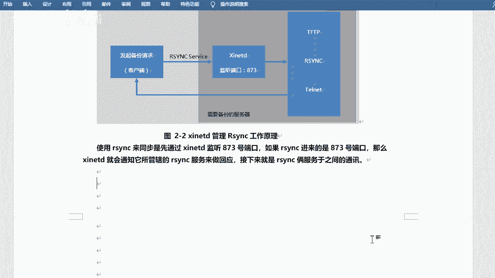

在RHEL/CentOS 7及以后的系统中，`rsync`通常已经默认安装，并且不再依赖`xinetd`服务管理。你可以使用以下命令检查：
```bash
rpm -qa | grep rsync
```
如果未安装，可以使用`yum install rsync -y`进行安装。

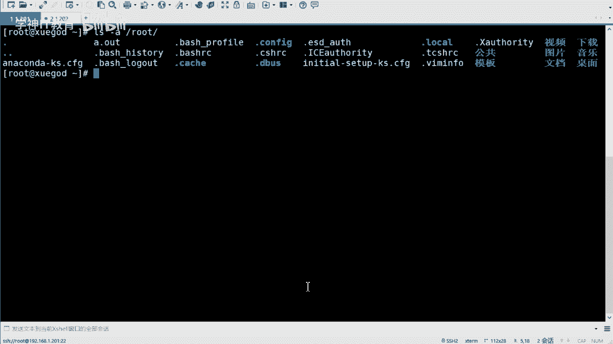

`rsync`命令的基本格式如下：
```
rsync [选项] 源路径 目标路径
```

以下是初学者需要掌握的核心选项：

| 选项 | 含义 | 说明 |
| :--- | :--- | :--- |
| `-a` | 归档模式 | 这是最常用的选项，相当于`-rlptgoD`的组合，能递归同步并保持所有文件属性。 |
| `-v` | 详细输出 | 显示同步过程的详细信息。 |
| `-z` | 压缩传输 | 在传输过程中进行压缩，以提高效率。 |
| `--delete` | 删除目标端多余文件 | **重要**：使目标端成为源端的精确镜像，删除目标端有而源端没有的文件。 |
| `-P` | 显示进度与断点续传 | 结合了`--progress`（显示进度）和`--partial`（保留部分传输的文件以实现断点续传）的功能。 |

**`--delete`选项详解**：  
假设源端目录有文件`1.txt`, `2.txt`，目标端目录有文件`1.txt`, `3.txt`。使用`--delete`选项同步后，目标端的`3.txt`会被删除，最终只保留和源端一致的`1.txt`, `2.txt`。如果不使用该选项，目标端的`3.txt`会保留。

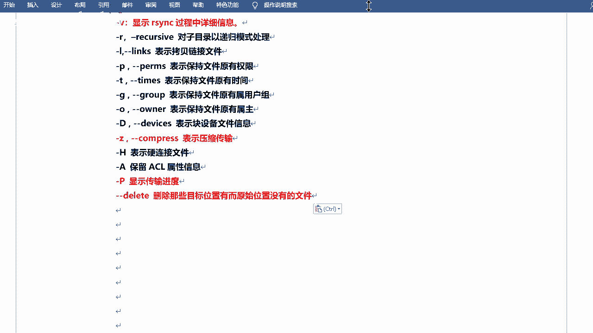

## 实战：同步单个目录 🚀

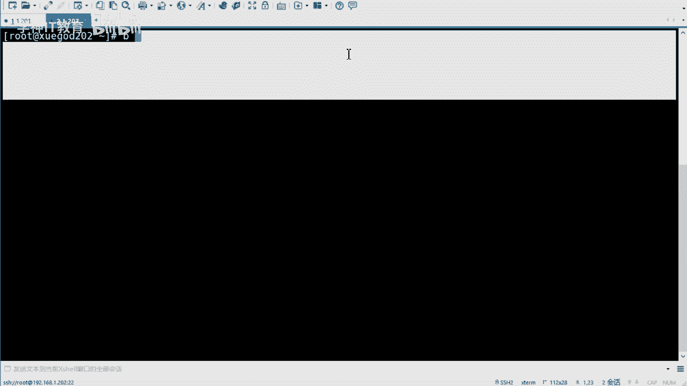

理论准备就绪，下面我们通过一个实例来演示如何使用rsync命令同步单个目录。我们将使用两台主机：
*   **源端**：IP为 `192.168.1.114`
*   **目标端**：IP为 `192.168.1.202`

**操作步骤**：

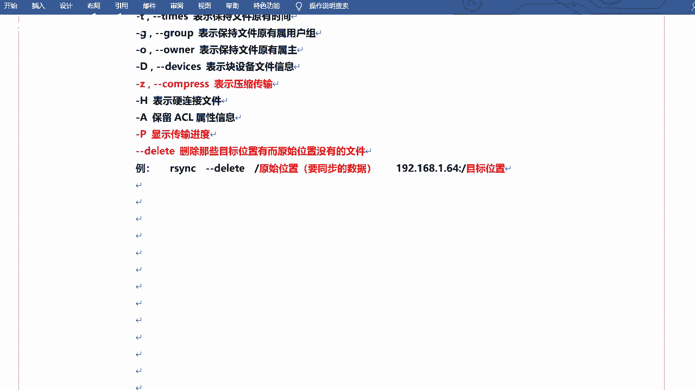

1.  **在源端准备测试目录和数据**：
    ```bash
    # 创建测试目录
    mkdir -p /var/www/html
    # 复制一些文件和子目录到测试目录中（以/boot目录为例）
    cp -r /boot/* /var/www/html/
    ```

2.  **使用rsync从源端同步到目标端**：
    在源端（114）执行以下命令，将`/var/www/html`目录同步到目标端（202）的`/web_backup`目录。
    ```bash
    rsync -avzP --delete /var/www/html/ root@192.168.1.202:/web_backup
    ```
    **命令解析**：
    *   `-avzP`：归档模式、显示详情、压缩传输、显示进度。
    *   `--delete`：确保目标端是源端的精确镜像。
    *   `/var/www/html/`：**注意源路径后的`/`**。有`/`表示同步目录内的内容，没有`/`则表示同步目录本身。
    *   `root@192.168.1.202:/web_backup`：以root用户身份同步到202主机的`/web_backup`路径。

3.  **执行过程**：
    *   首次连接时会要求输入目标端（202）root用户的密码。
    *   如果目标端`/web_backup`目录不存在，rsync会自动创建它（但只能自动创建最后一级目录）。
    *   命令执行后，会显示每个文件的传输进度和整体统计信息。

4.  **验证结果**：
    登录到目标端（202）机器，检查`/web_backup`目录，可以看到与源端`/var/www/html`目录完全一致的文件和子目录结构。

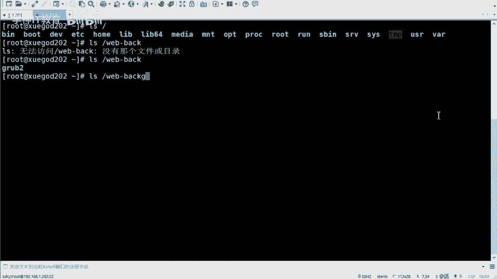

**注意事项**：
*   本例使用的是SSH协议进行加密传输，因此需要输入密码。后续课程会讲解如何配置免密认证。
*   这种方式是“推”模式，源端是命令发起方（客户端），目标端是接收方（服务端由SSH守护进程临时充当）。

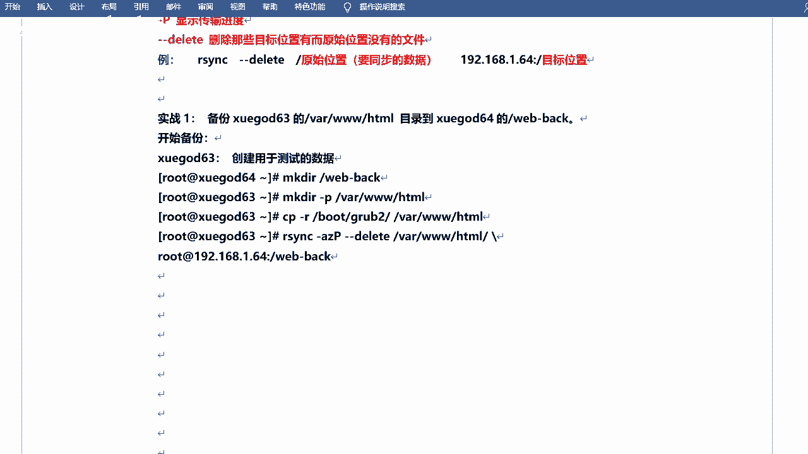

## 总结 📝

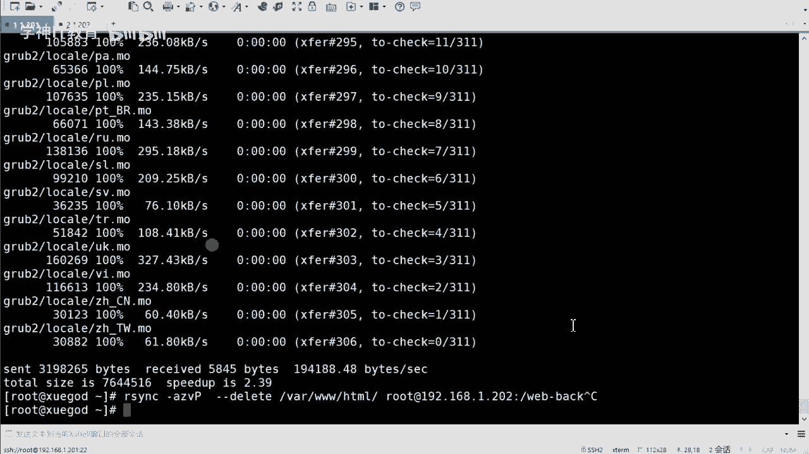

本节课中我们一起学习了Linux下强大的同步工具rsync。我们从认识rsync及其与`cp`命令的区别开始，了解了其增量备份的工作原理。接着，我们厘清了rsync运行中“源端/目标端”、“推/拉”模式等重要概念。最后，我们通过一个完整的实战示例，学会了使用`rsync -avzP --delete`这个经典组合命令，将本地一个目录安全、高效地同步到远程主机。

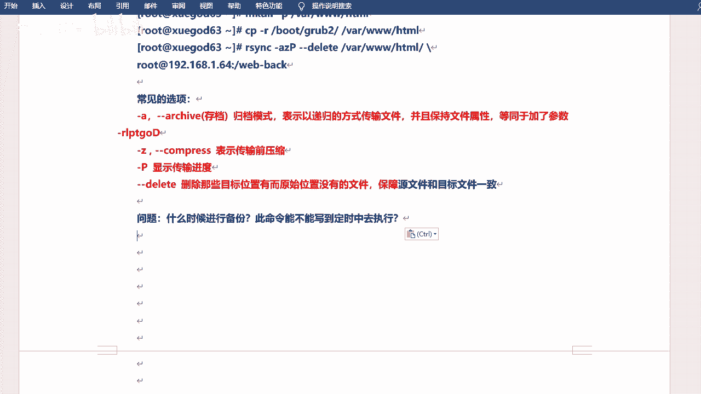

你已经掌握了rsync最基础也是最重要的单次命令同步方法。在接下来的课程中，我们将学习如何配置rsync守护进程服务，以及如何结合`inotify`工具实现数据的实时自动同步。