# RHCE8红帽认证课程：P6：无密码同步与保持文件权限 🔑

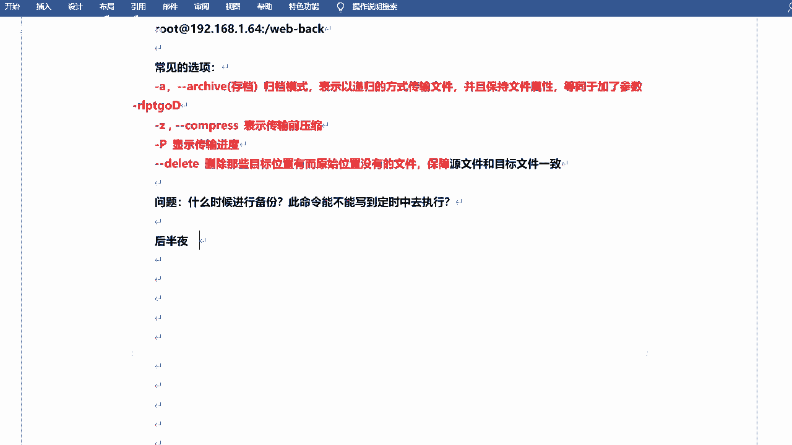

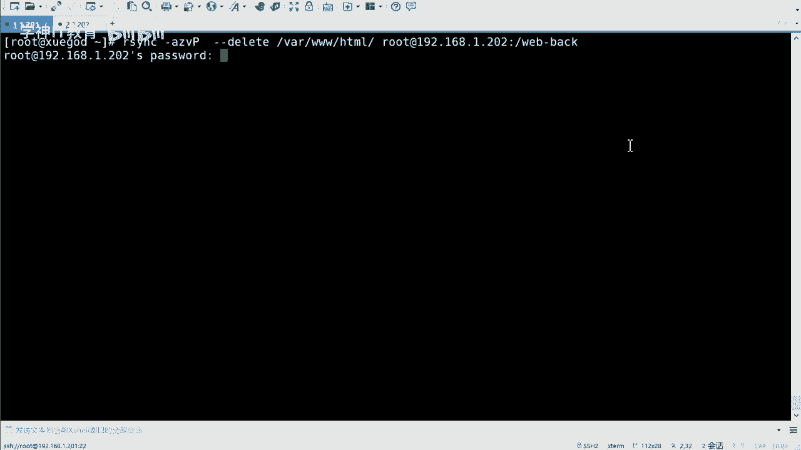

在本节课中，我们将学习如何实现无需人工干预的自动化文件同步，并确保同步过程中文件的原始权限得以保留。这对于在业务低谷期（如后半夜）执行备份任务至关重要，可以避免因手动输入密码而中断自动化流程。

上一节我们介绍了基本的`rsync`命令用法，本节中我们来看看如何实现无密码同步以及保持文件权限。

## 实现无密码同步 🔑

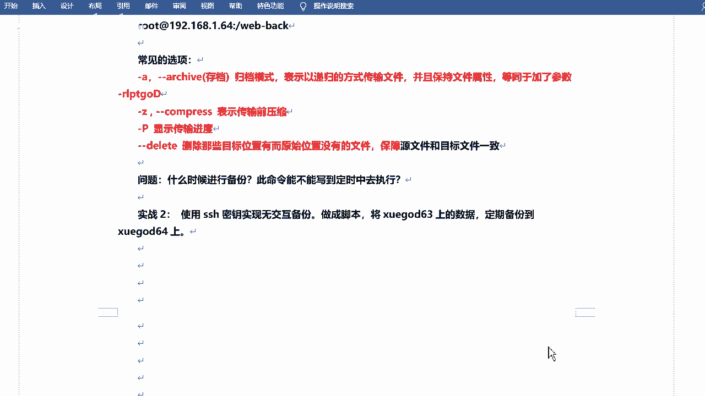

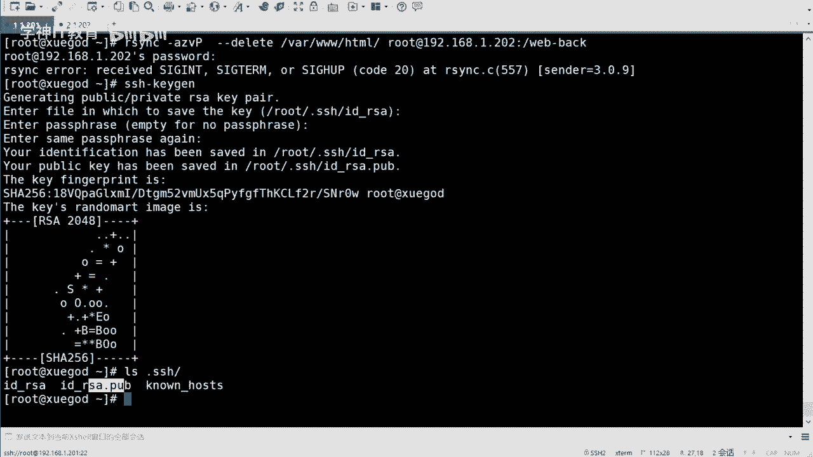

`rsync`命令基于SSH协议传输数据。SSH协议支持两种认证方式：密码认证和密钥认证。为了实现无密码同步，我们需要配置SSH密钥对，这样在执行`rsync`时就不再需要手动输入密码。

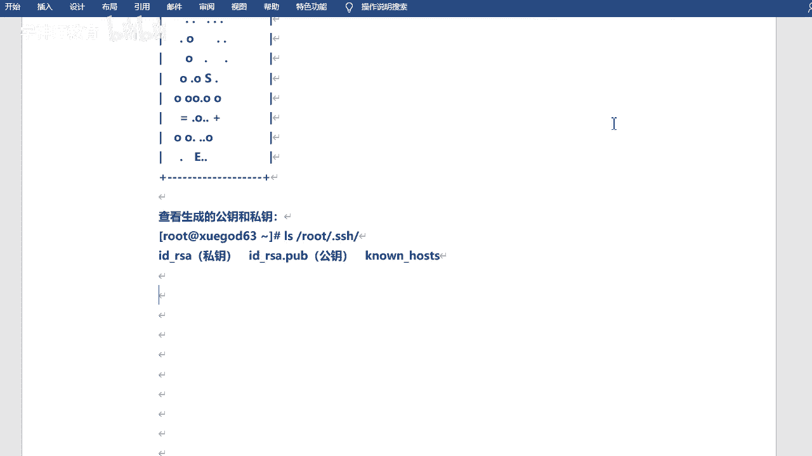

以下是配置SSH密钥对并实现无密码`rsync`同步的步骤：

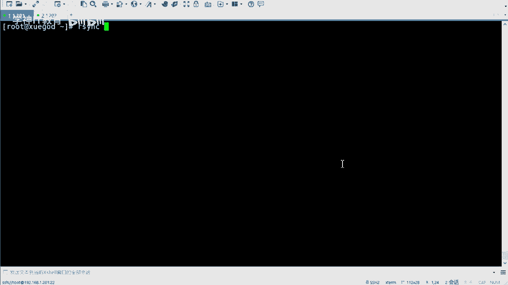

1.  **在源主机生成SSH密钥对**
    使用`ssh-keygen`命令生成密钥对。执行命令后连续按回车，接受所有默认设置。
    ```bash
    ssh-keygen
    ```
    此命令会在`~/.ssh/`目录下生成两个文件：私钥`id_rsa`和公钥`id_rsa.pub`。

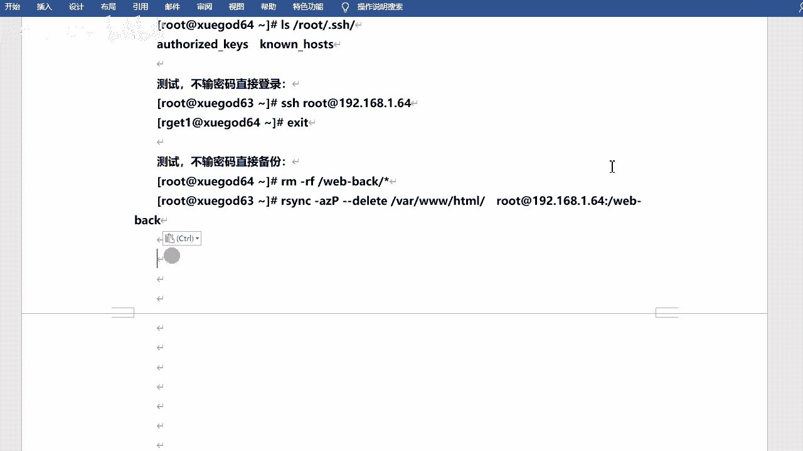

2.  **将公钥传输到目标主机**
    使用`ssh-copy-id`命令将公钥复制到目标主机。此过程需要输入一次目标主机的密码。
    ```bash
    ssh-copy-id root@192.168.1.202
    ```

3.  **测试无密码同步**
    配置完成后，再次执行`rsync`命令将不再提示输入密码。
    ```bash
    rsync -avz /var/www/html/ root@192.168.1.202:/web_backup/
    ```

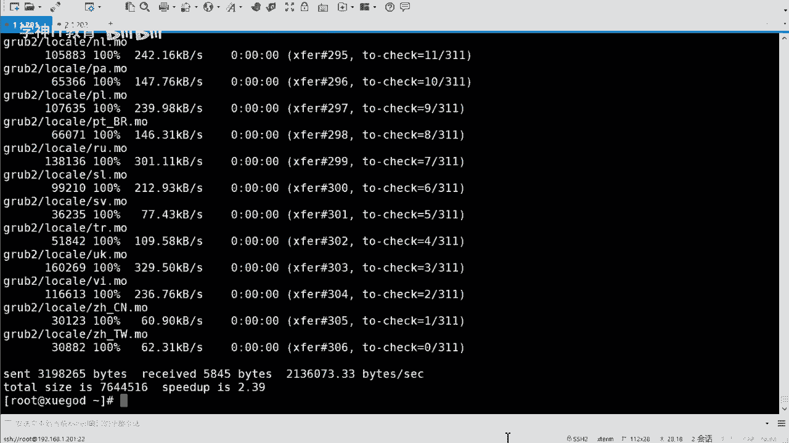

**操作技巧**：可以使用 `Ctrl + R` 快捷键搜索历史命令，快速调出并执行之前使用过的长命令。

## 配置rsync守护进程模式 🔄

除了使用SSH协议，`rsync`还可以运行在守护进程模式下，这种方式功能更丰富，配置更灵活。

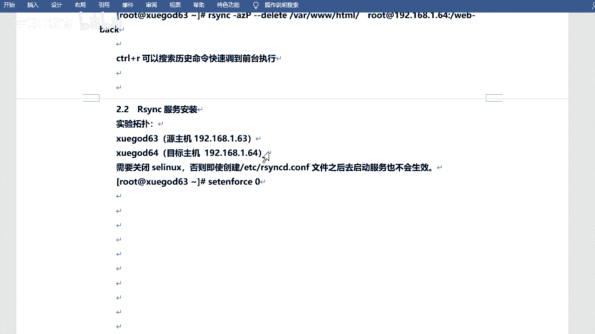

首先，我们需要在作为“服务端”（即数据接收端）的主机上安装并启动`rsync`服务。

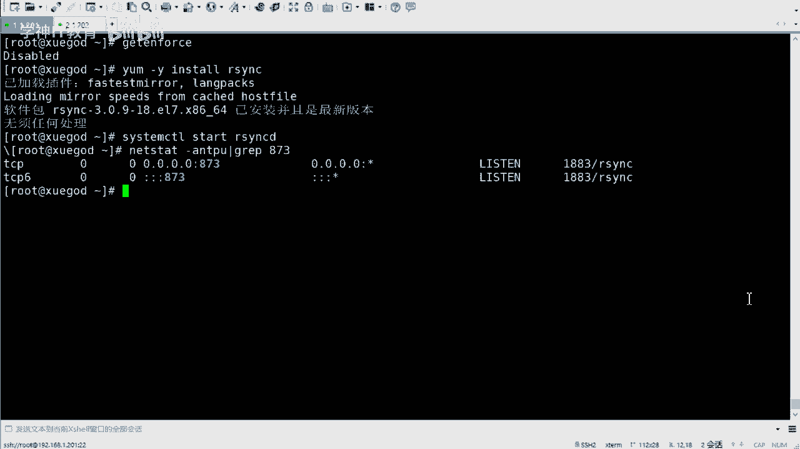

以下是配置rsync守护进程的基本步骤：

1.  **确保环境准备就绪**
    关闭SELinux和防火墙，以避免权限和网络访问问题。
    ```bash
    setenforce 0
    systemctl stop firewalld
    ```

2.  **安装rsync软件包**
    ```bash
    yum install -y rsync
    ```

3.  **启动rsync守护进程**
    ```bash
    systemctl start rsyncd
    systemctl enable rsyncd
    ```

4.  **验证服务**
    检查873端口是否在监听，以确认服务已启动。
    ```bash
    ss -tunlp | grep 873
    ```

**注意**：对于RHEL/CentOS 6系列，配置方式略有不同，需要手动创建`/etc/rsyncd.conf`配置文件并使用`xinetd`来管理服务。

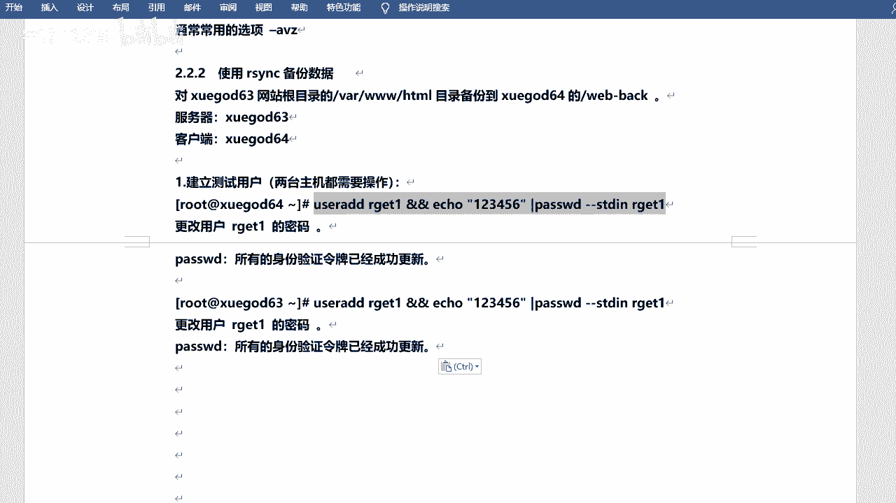

## 使用特定用户同步并保持权限 👤

在实际生产环境中，我们可能不希望直接使用root用户进行同步。这时可以创建一个专用用户，并确保同步时文件的属主和权限信息得以保留。

以下是使用专用用户进行同步并保持权限的步骤：

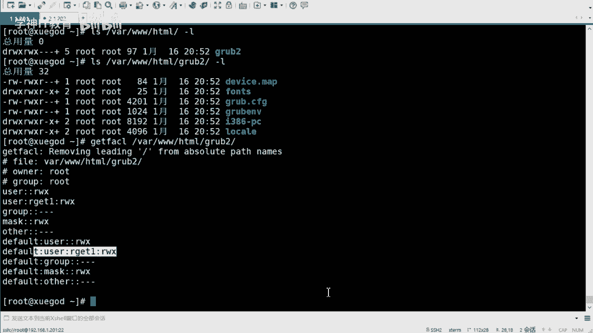

1.  **创建专用同步用户**
    在源主机和目标主机上创建相同的用户，例如`rsync_user`。
    ```bash
    useradd rsync_user
    echo “123456” | passwd --stdin rsync_user
    ```


2.  **设置源目录的权限**
    将待同步目录的属主改为同步用户，并设置ACL权限，确保该用户拥有完整权限。
    ```bash
    chown -R rsync_user:rsync_user /var/www/html/
    setfacl -R -m user:rsync_user:rwx /var/www/html/
    setfacl -R -m default:user:rsync_user:rwx /var/www/html/
    ```

3.  **执行同步（仍需密码）**
    此时使用`rsync_user`用户同步，仍需输入该用户的密码。
    ```bash
    rsync -avz /var/www/html/ rsync_user@192.168.1.202:/web_backup/
    ```

4.  **实现无密码同步（结合密码文件）**
    为了避免在脚本或定时任务中输入密码，可以使用`--password-file`选项。首先创建一个包含密码的文件（注意设置严格的权限，如600），然后在命令中指定。
    ```bash
    echo “123456” > /etc/rsync.pass
    chmod 600 /etc/rsync.pass
    rsync -avz --password-file=/etc/rsync.pass /var/www/html/ rsync_user@192.168.1.202::web_backup_module # 假设配置了模块
    ```
    通过这种方式，即使使用非root的普通用户，也能实现无需交互的自动化同步，并且`-a`（archive）参数可以保证文件的权限、属主、时间戳等属性原样同步到目标端。

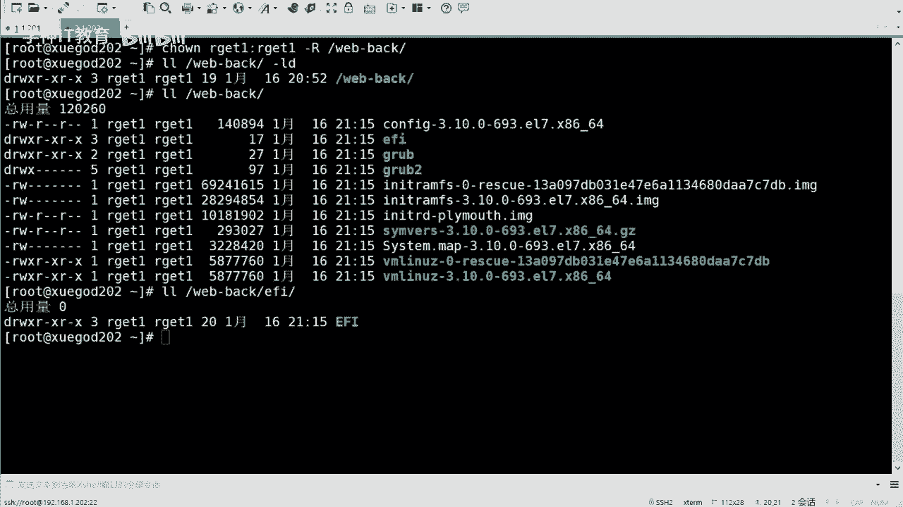

本节课中我们一起学习了实现`rsync`无密码同步的两种主要方法：配置SSH密钥对和使用`rsync`守护进程模式配合密码文件。同时，我们也掌握了如何通过创建专用用户和正确设置权限，在自动化同步过程中保持文件属性的完整性。这些技能是构建可靠、自动化的备份与同步方案的基础。