# RHCE8红帽认证课程：P7：rsync服务形式运行与推拉模式 🚀

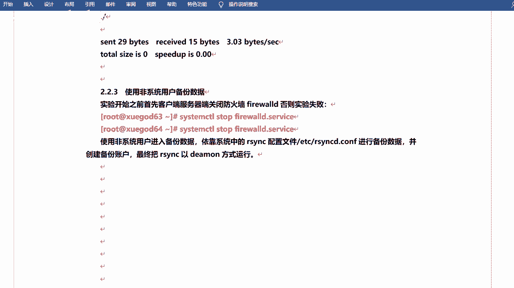

在本节课中，我们将学习如何将rsync配置为守护进程（服务）形式运行，并掌握其配置文件的核心参数。同时，我们将实践数据的“推送”和“拉取”两种同步模式，为后续实现自动化备份打下基础。

---

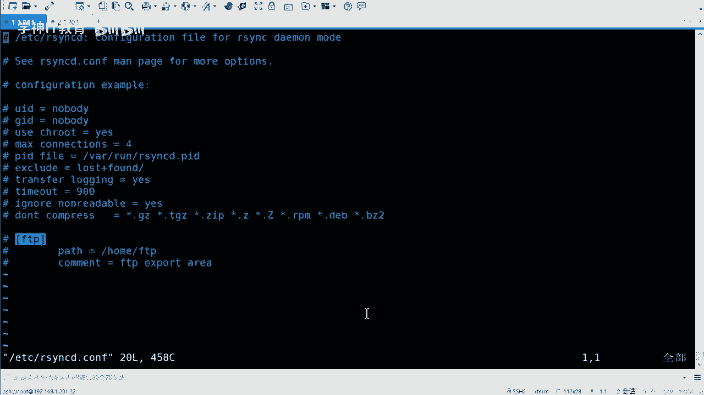

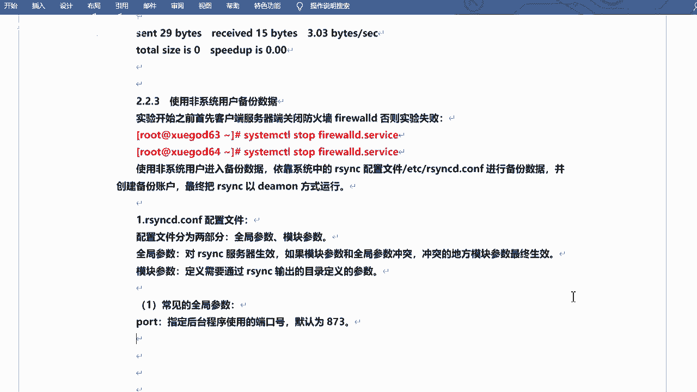

## 服务配置与核心概念 🔧

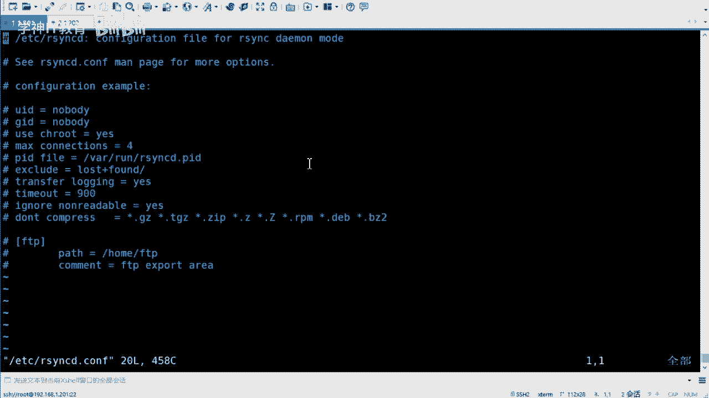

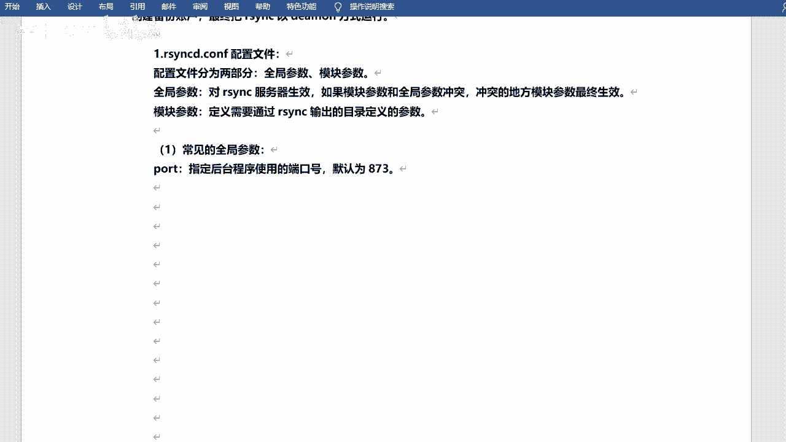

上一节我们介绍了rsync的基本命令用法。本节中，我们来看看如何将其配置为系统服务，以实现更安全、更灵活的远程同步。

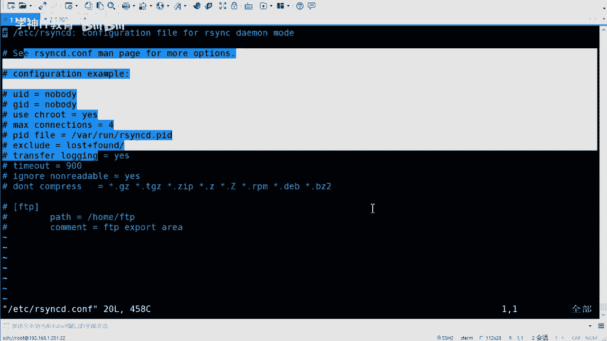

### 配置文件结构

rsync的守护进程配置文件是 `/etc/rsyncd.conf`。它主要分为两个部分：
*   **全局参数**：对整个rsync服务生效的配置。
*   **模块参数**：定义具体的共享目录（模块）及其访问规则。

如果模块参数与全局参数冲突，**模块参数的优先级更高**。

### 关键配置参数解析

以下是配置文件中一些核心参数的含义，初学者需要重点关注：

*   **uid / gid**：指定rsync守护进程运行时使用的用户和组ID。
*   **address**：服务监听的IP地址。
*   **port**：服务监听的端口，默认为 **873**。
*   **hosts allow**：定义允许访问的客户端IP地址或网段。
*   **use chroot**：是否将用户锁定在模块目录内，增强安全性。
*   **max connections**：最大并发连接数，0表示无限制。
*   **pid file / lock file / log file**：分别指定进程ID文件、锁文件和日志文件的路径。
*   **auth users**：指定允许进行同步的虚拟用户名（无需是系统用户）。
*   **secrets file**：指定存储`auth users`对应密码的文件。**该文件权限必须设置为600**。
*   **path**：**（模块参数必需）** 指定模块对应的实际目录路径。
*   **read only**：模块是否为只读模式。
*   **list**：客户端请求模块列表时，是否列出此模块。

---

## 实战：配置rsync服务端 🖥️

现在，我们将在服务器（假设IP为192.168.1.202）上一步步配置rsync服务。

### 1. 编写配置文件

我们需要手动创建并编辑 `/etc/rsyncd.conf` 文件。请确保准确输入，避免复制粘贴可能引入的格式错误。

```bash
# 全局配置部分
uid = root
gid = root
address = 192.168.1.202
port = 873
hosts allow = 192.168.1.0/24
use chroot = yes
max connections = 5
pid file = /var/run/rsyncd.pid
lock file = /var/run/rsyncd.lock
log file = /var/log/rsyncd.log
motd file = /etc/rsyncd.motd

# 定义一个名为 ‘wwwroot‘ 的模块
[wwwroot]
    # 模块对应的实际目录
    path = /web_back
    # 模块描述
    comment = Used for web backup
    # 是否只读
    read only = no
    # 是否列出模块
    list = yes
    # 授权用户（虚拟用户）
    auth users = rsync_user
    # 密码文件路径
    secrets file = /etc/rsyncd.passwd
```

### 2. 创建相关目录和文件

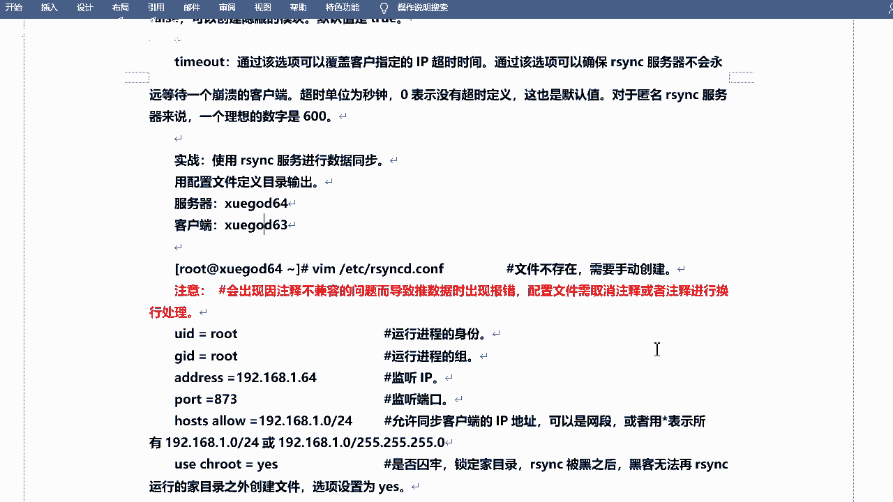

根据配置文件中的设定，创建必要的目录和密码文件。

```bash
# 创建模块目录
mkdir -p /web_back

# 创建欢迎信息文件
echo “Welcome to backup server.” > /etc/rsyncd.motd

# 创建密码文件，格式为“用户名:密码”
echo “rsync_user:password123” > /etc/rsyncd.passwd

# 将密码文件权限设置为600，这是强制要求
chmod 600 /etc/rsyncd.passwd
```

### 3. 启动rsync服务

配置完成后，启动rsync守护进程并检查其运行状态。

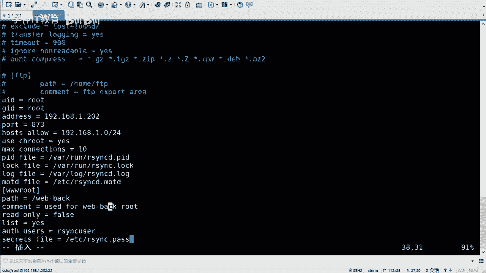

```bash
# 启动服务（不同系统命令可能不同，如 systemctl start rsyncd）
rsync --daemon --config=/etc/rsyncd.conf

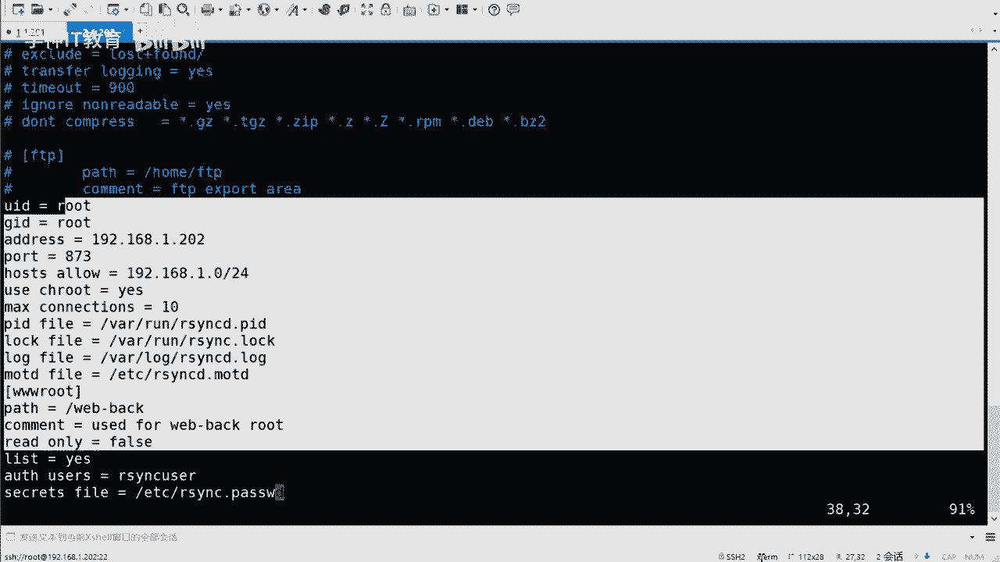

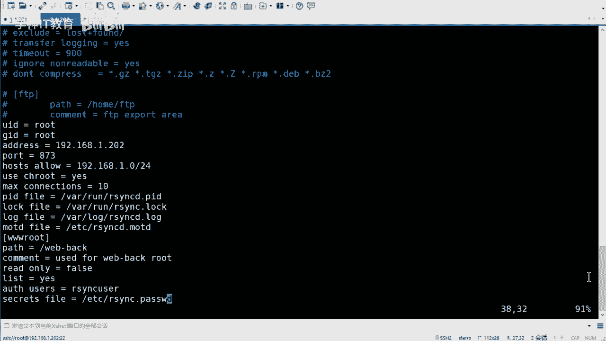

# 检查服务端口（873）是否已监听
netstat -antp | grep 873
```

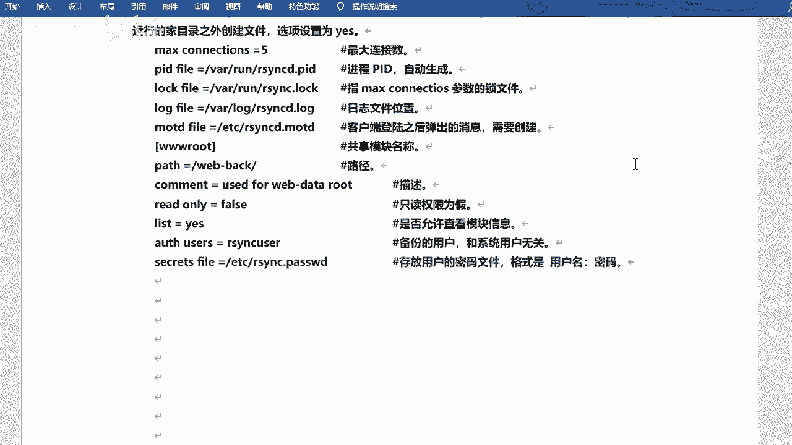

---

## 实践：推拉同步模式 ↔️

服务配置并启动后，我们就可以在客户端使用“推”或“拉”的模式进行同步了。

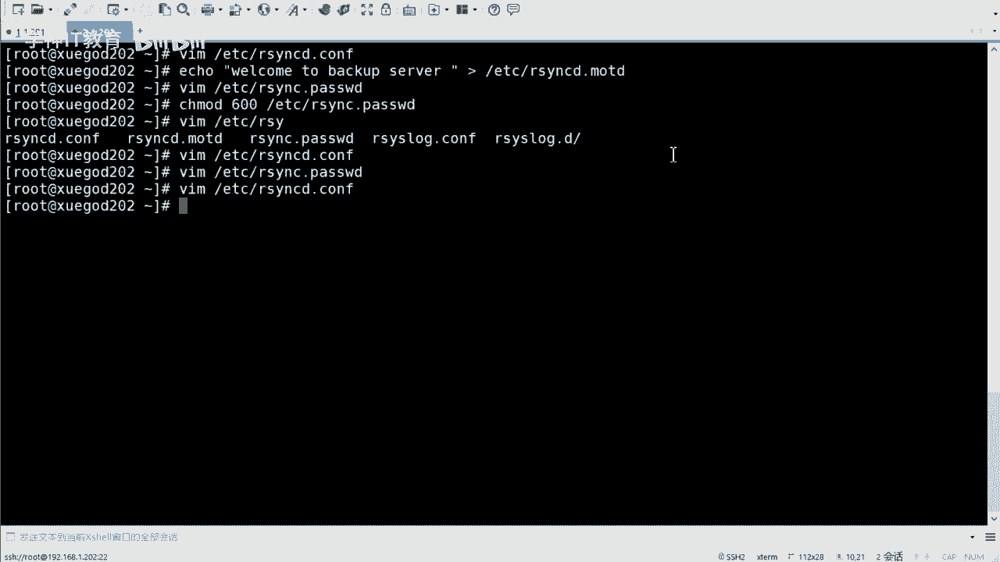

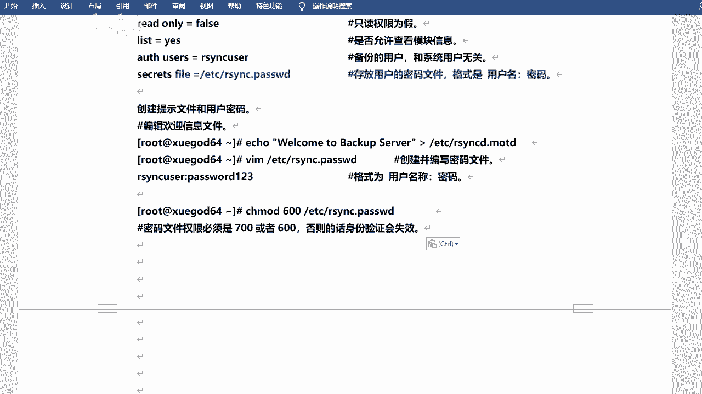

### 推送模式（Push）

将本地数据**推送**到远程rsync服务器指定的模块中。

```bash
# 基本命令格式
rsync -avz /本地目录/ 用户名@服务器IP::模块名

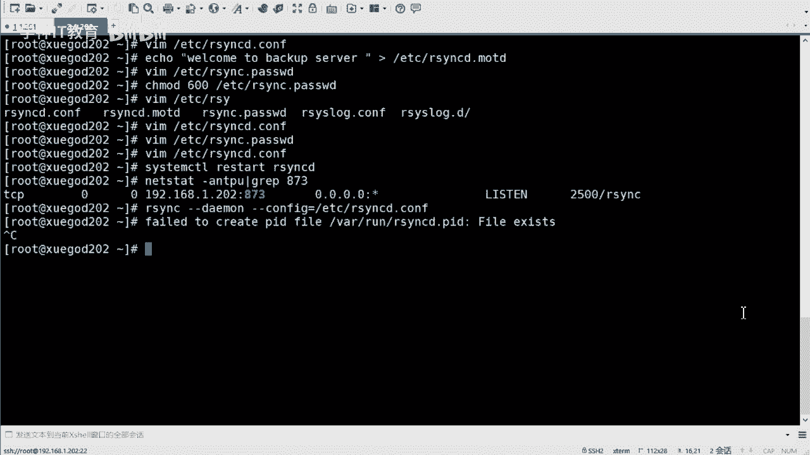

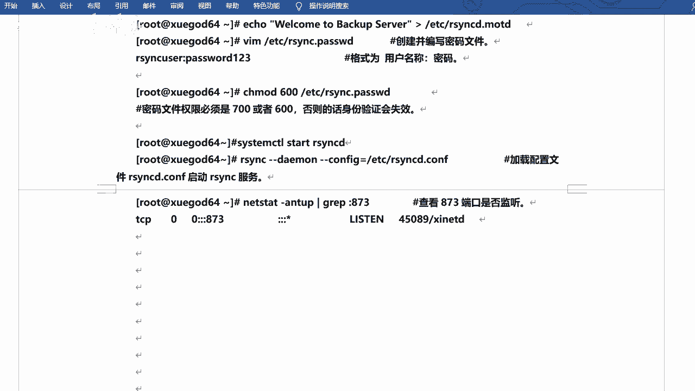

# 示例：将 /opt/www/ 目录推送到服务器的 wwwroot 模块
rsync -avz /opt/www/ rsync_user@192.168.1.202::wwwroot
```
执行命令后，会提示输入密码（即`/etc/rsyncd.passwd`中为`rsync_user`设置的密码）。

### 拉取模式（Pull）

将远程rsync服务器模块中的数据**拉取**到本地。

```bash
# 基本命令格式
rsync -avz 用户名@服务器IP::模块名 /本地目录/

# 示例：将服务器 wwwroot 模块的数据拉取到本地 /opt/backup/ 目录
rsync -avz rsync_user@192.168.1.202::wwwroot /opt/backup/
```

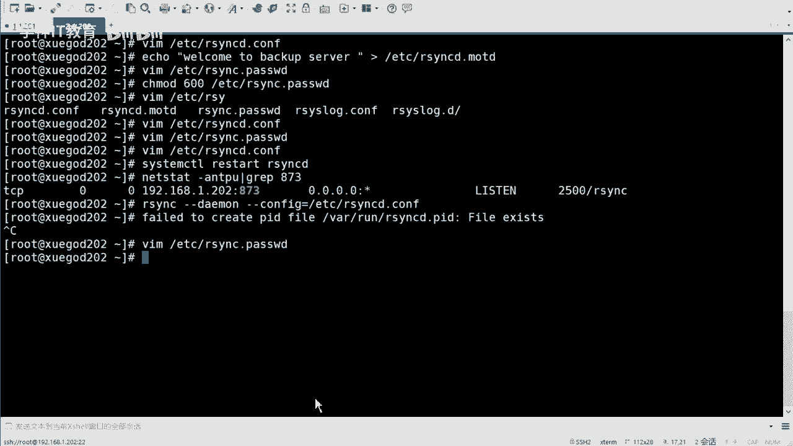

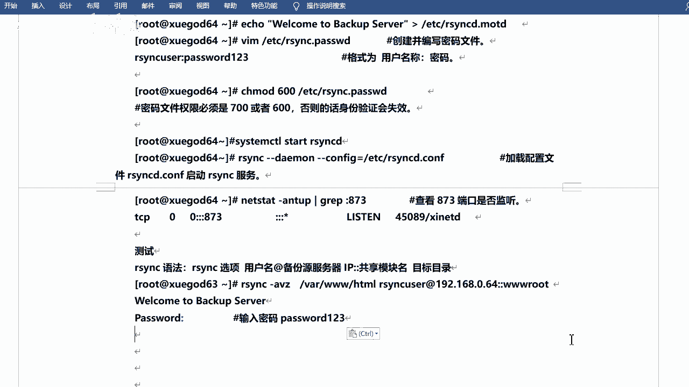

### 使用密码文件实现无交互同步

为了避免每次手动输入密码，可以在客户端创建一个**仅包含密码**的文件。

```bash
# 在客户端创建密码文件（只写密码，不写用户名）
echo “password123” > /etc/rsyncd_client.passwd
chmod 600 /etc/rsyncd_client.passwd

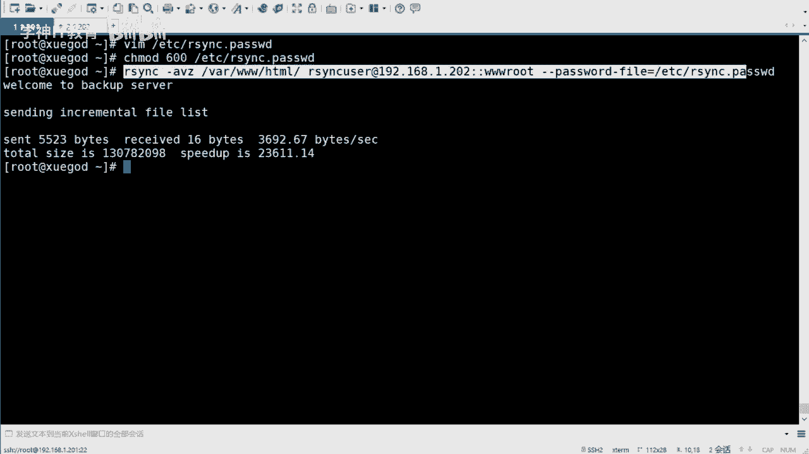

# 使用 --password-file 参数进行同步（无需交互输入密码）
rsync -avz --password-file=/etc/rsyncd_client.passwd /opt/www/ rsync_user@192.168.1.202::wwwroot
```

通过这种方式，我们可以将rsync命令写入脚本，并结合`cron`计划任务，实现定时自动备份。

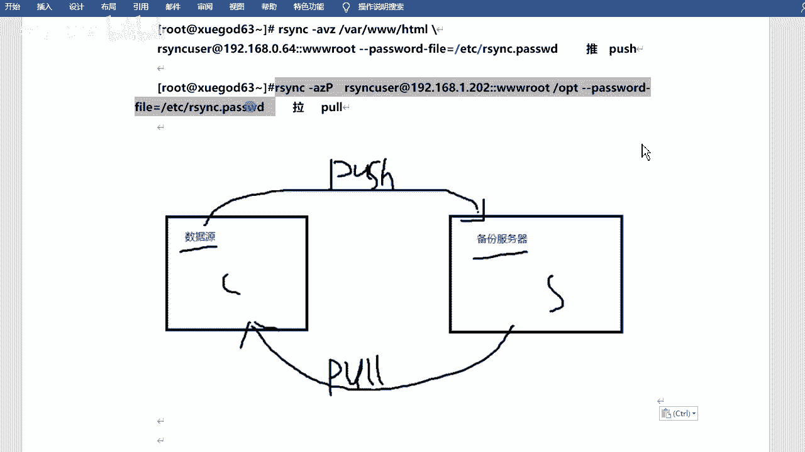

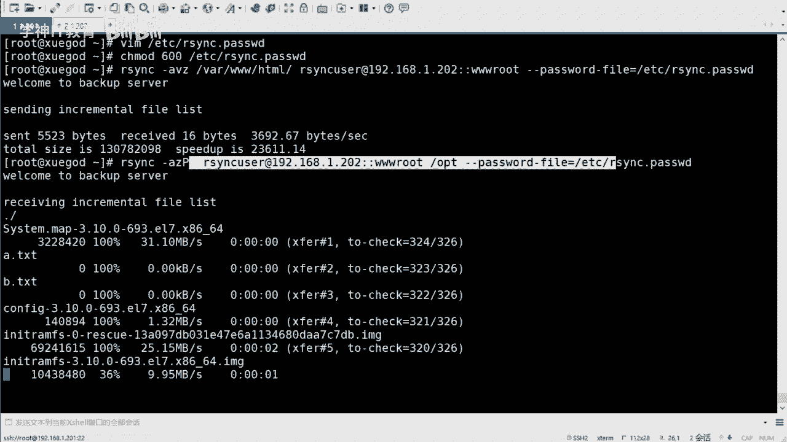

---

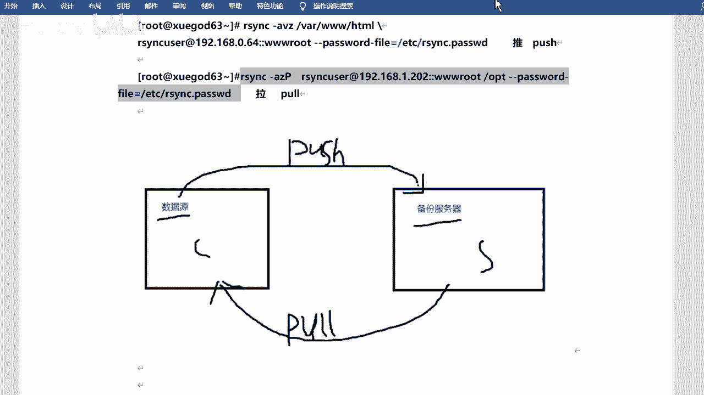

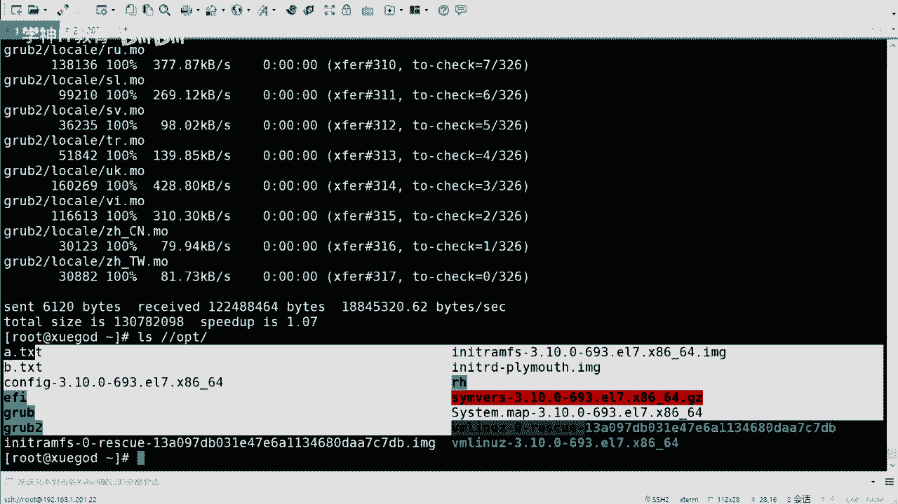

## 总结 📝

本节课中我们一起学习了：
1.  **rsync守护进程的配置**：理解了`/etc/rsyncd.conf`配置文件的全局与模块参数结构，并掌握了`auth users`、`secrets file`、`path`等关键参数的配置方法。
2.  **服务端部署流程**：完成了从编写配置文件、创建密码文件到启动服务的完整过程。
3.  **两种同步模式**：
    *   **推送（Push）**：将本地数据上传至远程服务器。
    *   **拉取（Pull）**：从远程服务器下载数据到本地。
4.  **自动化基础**：通过`--password-file`参数免去交互输入，为后续编写自动化备份脚本做好了准备。

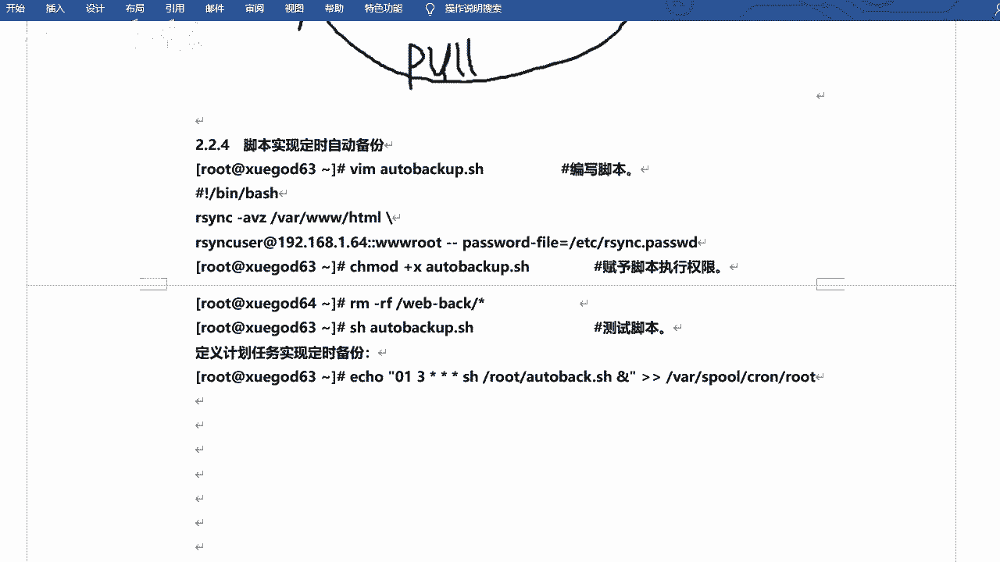

掌握rsync的服务模式配置，是构建企业级自动化备份与同步方案的核心技能。