# RHCE8红帽认证课程：P8：sersync+rsync触发式同步 🔄

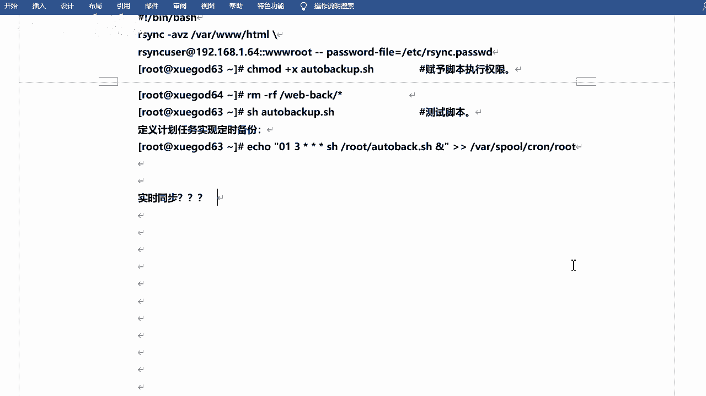

在本节课中，我们将学习如何实现触发式文件同步。我们将了解传统定时同步的局限性，并掌握使用sersync工具结合rsync来实现更高效、更稳定的触发式同步方案。

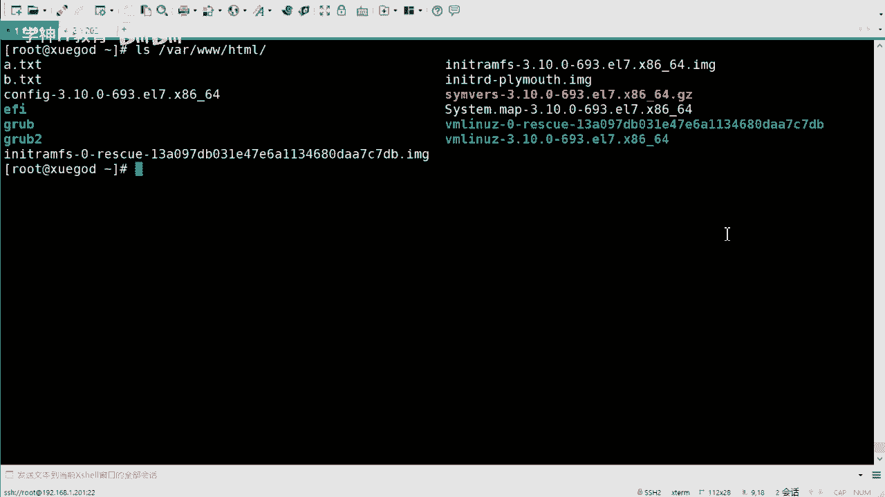

## 概述：从定时同步到触发式同步

上一节我们介绍了使用rsync进行定时同步的方法。本节中我们来看看如何实现更智能的同步方式。

定时同步可以满足常规需求，但并非每分每秒都需要同步。如果目录内容没有发生变化，同步操作会消耗不必要的系统资源。因此，我们所说的“实时同步”更准确地应称为“触发式同步”。

触发式同步是指当源目录发生改变时，才触发同步操作。这里的“改变”主要指**增、删、改**操作。例如，新建、删除文件或修改文件内容时需要同步。而像`ls`查看目录或`cat`查看文件内容这类读取操作，则不需要触发同步。

## sersync与inotify的对比

之前常用`inotify`工具来实现类似功能，但它存在一些不足。`inotify`只能记录目录发生了变化，无法精确记录是哪个具体文件或目录发生了变化。因此同步时可能需要同步整个目录，效率较低。

相比之下，`sersync`工具能精确记录发生变化的文件，并仅使用`rsync`同步这些更改过的文件，因此效率更高。同时，`sersync`的运行也更为稳定。

## sersync同步原理

sersync的同步原理清晰且自动化程度高。

1.  用户在配置了sersync服务的主服务器上写入或更新文件。
2.  sersync进程实时监控指定目录的文件变化。
3.  一旦检测到变化，sersync会调用`rsync`命令，仅将发生变化的文件同步到远程开启了`rsync`守护进程的服务器上。

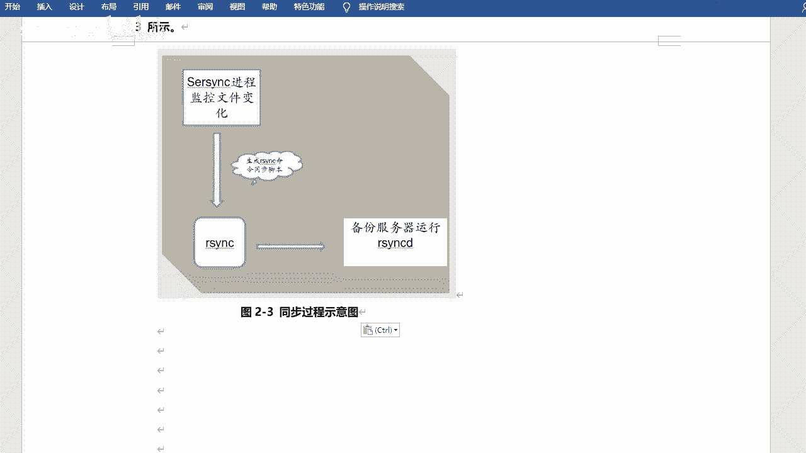


这个过程可以是“推”（`push`）模式，也可以是“拉”（`pull`）模式，具体取决于`rsync`命令的写法。

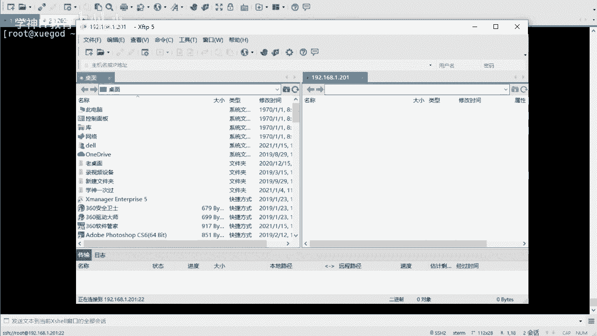


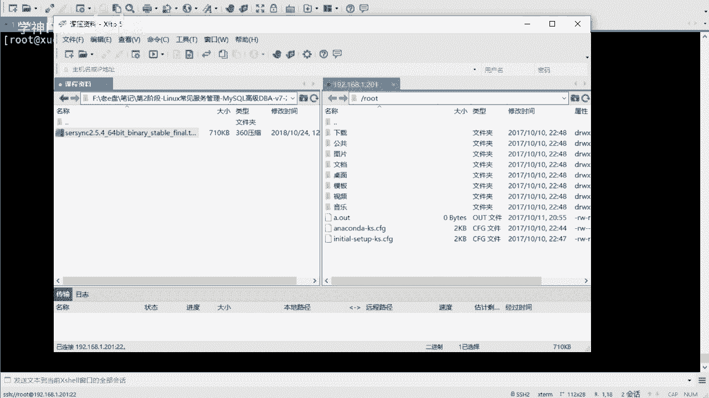

## 配置sersync实现触发式同步

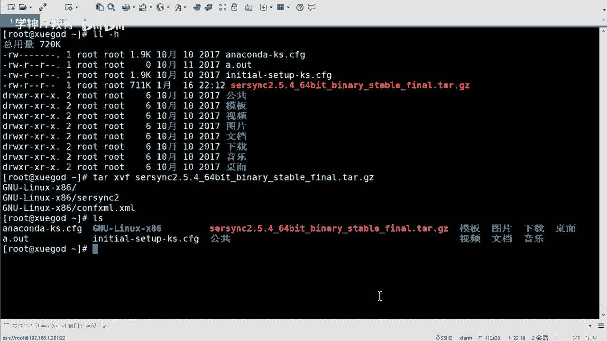

以下是配置sersync的详细步骤。

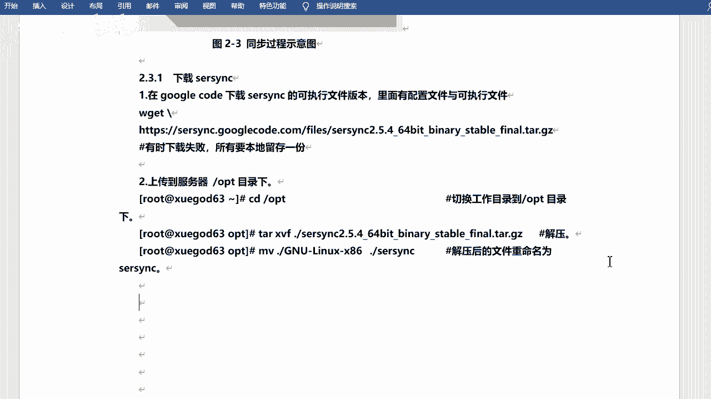

### 第一步：环境准备与软件部署

首先，确保已经配置好`rsync`服务端（守护进程）和客户端（密码文件等），这是sersync工作的基础。

然后，获取sersync软件。它是一个编译好的二进制工具包，无需安装，解压即可使用。主要包含两个文件：可执行程序`sersync2`和配置文件`confxml.xml`。

建议将其放置于`/opt`目录下，并重命名目录以便管理。

```bash
# 示例：将sersync移动到/opt目录并更名
mv sersync_archive /opt/sersync
cd /opt/sersync
```

### 第二步：修改sersync配置文件

在修改配置文件前，请先进行备份，这是一个好习惯。

配置文件`confxml.xml`中需要修改以下几个核心参数：

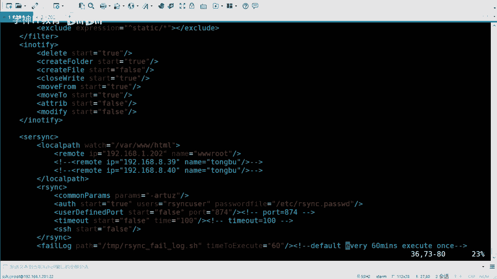

```xml
<!-- 第24行左右：定义要监控的本地目录 -->
<localpath watch="/var/www/html">
    <!-- 第31行左右：定义远程同步目标 -->
    <remote ip="192.168.1.202" name="wwwroot"/>
    <!-- 注意：此处的name是rsync服务端配置的模块名，而非用户名 -->
</localpath>

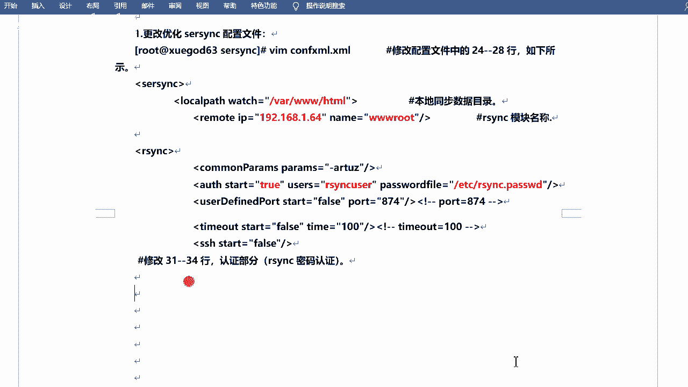

<!-- 第36行左右：定义rsync同步参数 -->
<commonParams params="-artuz"/>
<!-- 第39行：设置是否在启动时先全量同步一次 -->
<start enabled="true"/>

<!-- 第45行左右：定义认证信息 -->
<auth start="true" users="rsync_user" passwordfile="/etc/rsync.password"/>
<!-- users是rsync认证的用户名，passwordfile是对应的密码文件路径 -->
```

以下是需要修改的关键参数列表：
*   `localpath watch`：监控的源目录路径。
*   `remote ip`：远程目标服务器的IP地址。
*   `remote name`：远程`rsync`服务端配置的**模块名**。
*   `start enabled`：是否在服务启动时先进行全量同步。
*   `auth users`：用于`rsync`认证的用户名。
*   `auth passwordfile`：`rsync`认证密码文件的路径。

### 第三步：启动sersync服务

配置完成后，可以使用以下命令启动sersync守护进程：

```bash
./sersync2 -d -r -o confxml.xml
```

命令参数说明：
*   `-d`：以守护进程（daemon）模式在后端运行。
*   `-r`：在服务正式开始监控前，先全量同步一次监控目录下的所有文件。
*   `-o`：指定配置文件的路径。

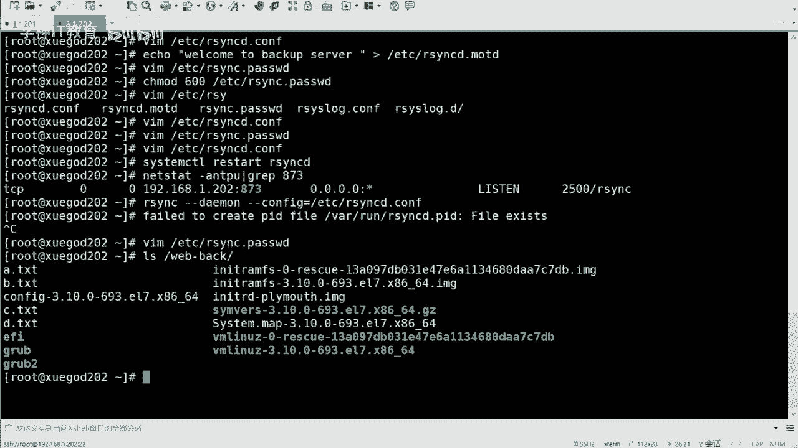

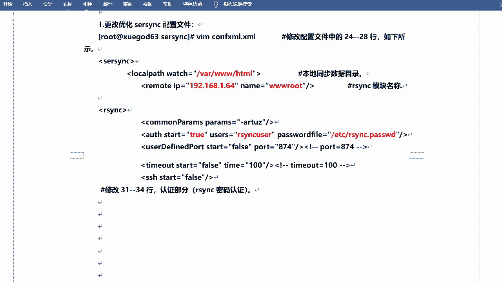

启动后，可以尝试在监控目录（如`/var/www/html`）中创建、修改或删除文件，观察变化是否能快速同步到远程服务器。

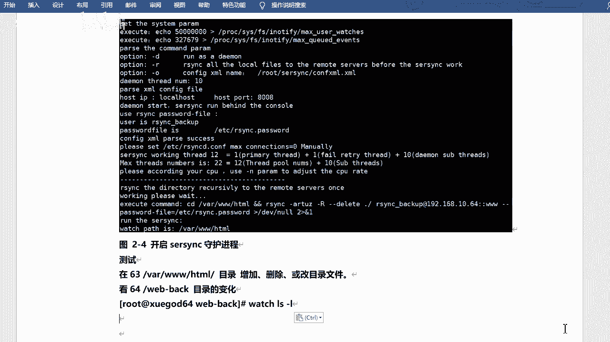

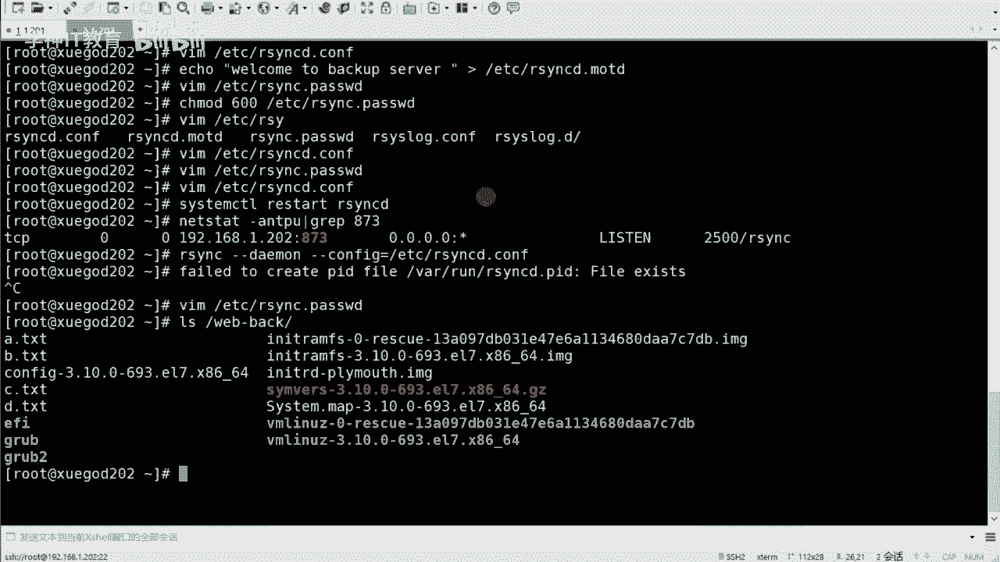

### 第四步：配置开机自启与进程监控

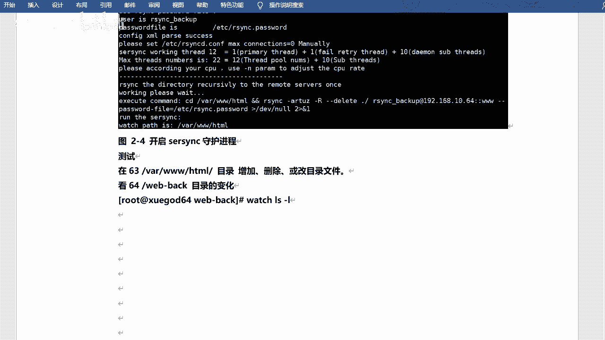

为确保服务持久化，可以将其启动命令加入开机自启脚本`/etc/rc.d/rc.local`。

```bash
# 在 /etc/rc.d/rc.local 文件中添加
/opt/sersync/sersync2 -d -r -o /opt/sersync/confxml.xml
```

同时，为`/etc/rc.d/rc.local`文件添加执行权限：`chmod +x /etc/rc.d/rc.local`。

为了确保sersync服务持续稳定运行，避免进程意外终止导致同步中断，建议编写一个监控脚本，并通过`cron`计划任务定期检查。

以下是一个简单的监控脚本示例`check_sersync.sh`：

```bash
#!/bin/bash
# 检查sersync进程是否在运行
SERSYNC_PROCESS=$(ps -aux | grep -v grep | grep sersync2 | wc -l)
if [ $SERSYNC_PROCESS -eq 0 ]; then
    # 如果进程不存在，则启动它
    /opt/sersync/sersync2 -d -r -o /opt/sersync/confxml.xml
    echo "$(date): sersync restarted." >> /var/log/sersync_monitor.log
fi
```

然后，使用`crontab -e`添加计划任务，例如每5分钟检查一次：

```bash
*/5 * * * * /bin/bash /path/to/check_sersync.sh
```

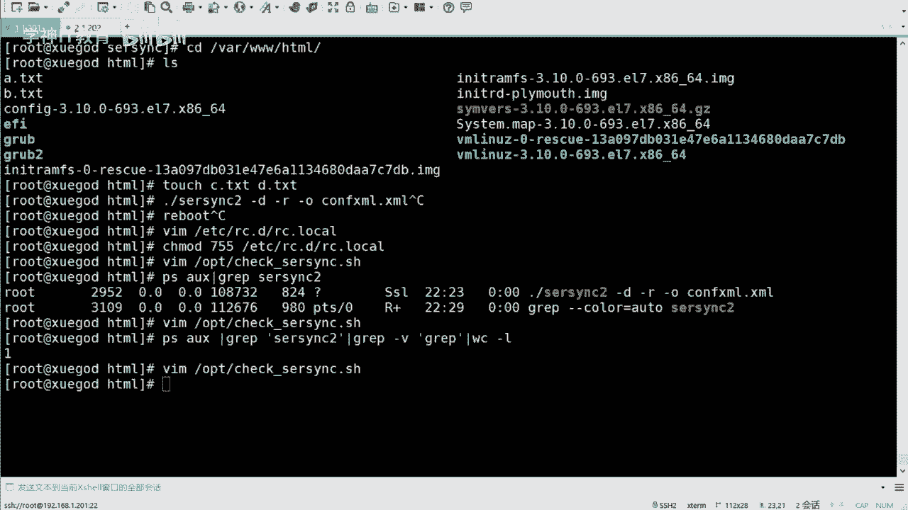

## 总结

本节课中我们一起学习了触发式文件同步的完整实现。

我们首先理解了触发式同步相较于定时同步的优势。然后，对比了`sersync`和`inotify`工具，明确了`sersync`在精确同步和稳定性上的特点。接着，我们逐步完成了`sersync`的部署、配置、启动，并最终通过配置开机自启和监控脚本，构建了一个健壮、自动化的触发式文件同步方案。

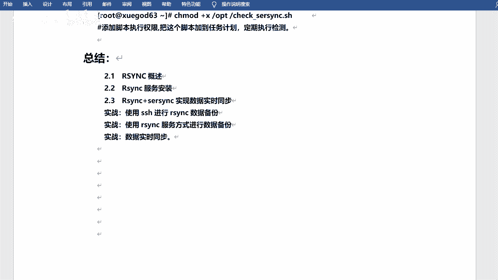

通过本课的操作，你应当能够熟练地使用`sersync`+`rsync`来满足生产环境中对文件实时（触发式）同步的需求。