# RHCE8红帽认证课程／自学必备／云计算／rhce／Linux运维 - P10：指定用户对ftp有读写权限 - 学神科技 - BV1L54y1S7qZ

这样的话就可以了是吧，但是这个权限比较大好吧，看一下啊，这样的话可以删除，当然也可以改名字是吧，但这个参数呢对于一名用户来说比较大啊，不安全使用这个参数呢需要考虑安全性啊，然后注意啊，默认匿名用户呃。

加的权限是七五，这个群是不能改变的啊，这个需要注意就是普通的目录权限，然后就是q5 嘛是吧，然后下面咱们可以一步一步来实现啊，怎样呢，我可以先修改目录权限啊，创建一个公司上传用的目录。

比如叫做学霸的data是吧，设置拥有者为ftp用户啊，所有目录权限的话是七五啊，我就给他一个这个目录是吧，用这个目录迷迷糊，你可以去操作的好吧。

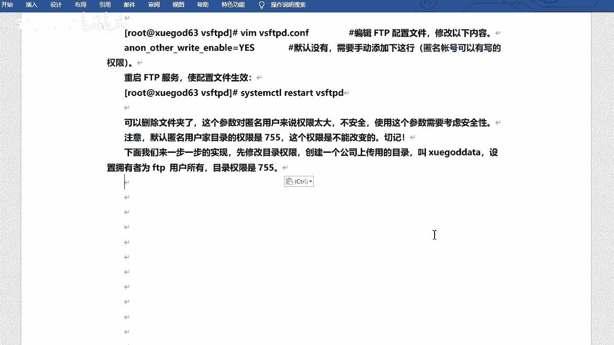

可以操作的啊，相当于专门的用户是吧啊专门的一个mo呃，创建一下啊，嗯然后y下载ftp下的呃，这叫血炸的是吧，对，然后change john ftp ftp哇，现在ftp，然后学gardate是吧。

看一下，是吧，这个这个和刚才的pub就一样了是吧，就一样了啊，然后咱们来试一下啊。

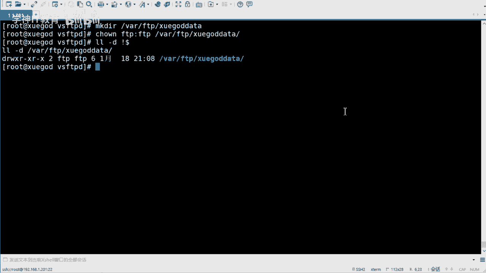

打开它，在这儿啊新建，是吧，这个是可以的啊，然后你就用比如我用这个目录啊，用一名用户上传下载就可以了啊，然后你可以把这个目录的那个权限给它去掉是吧，因为他因为因为他没有这个权限的话是吧。

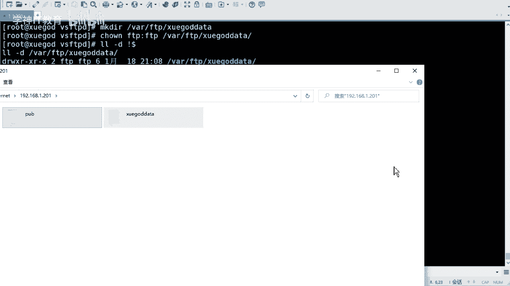

没有ftp权限的话，它是写不了的，对不对，这个你就可以放心了啊。

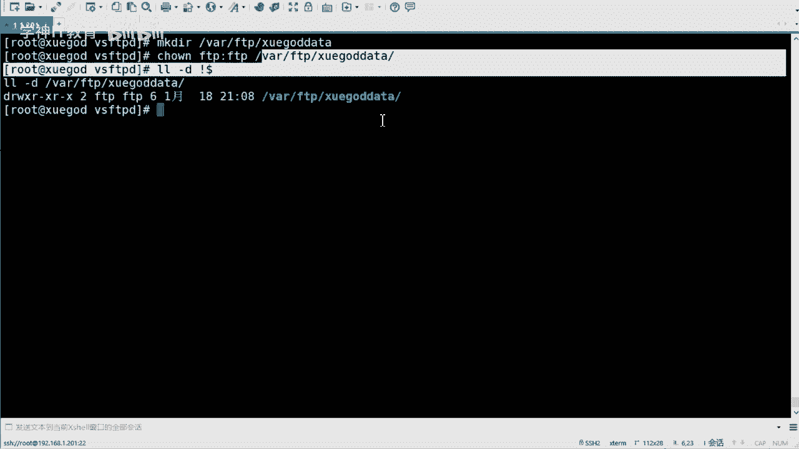

嗯七五默认就是七五啊，所以说不用去改，啊然后改的话就是改数组数组就可以了诶，然后测试是吧就可以了啊，嗯其实一般的话因为用户只有读就可以了啊，只读就可以了，写权限其实也是没有的，你可以再回收回来是吧。

可以再回收回来一名糊，它的权限应该是最小的是吧，应该是最小的，你不然的话谁都能是吧，谁都能这个这个下载是吧，谁都能上传肯定是不行的，万一给你上个木马呢是吧，那不就坏了吗，好啊，然后正常情况下呢。

咱们是用正常的用户名和密码对吧，哎你的用户名密码是匹配的话是吧，那那那这个是可以的对吧，这个是可以访问的啊，所以说咱们还是来看这个正常的用户名和密码的访问好吧，来看这个啊，嗯比如说公司内部啊。

现在有一台ftp和web服务器f d p的功能呢，主要是维护公司的网站内容啊，包括上传文件，创建目录，更新网页等，公司的话现在有两个部门负责维护啊，分别是tm一和tm嗯。

先要求允允仅允许tm和tm账号登录ftp服务器，但不能登录本地系统啊，并将两个账号的根目录限制为y下3w tml啊，就是他们的根目录啊，就是不能去不能去切换的啊，不能进入该目录以外的任何的目录啊。

然后ftp和3w web服务器相结合，也就是说你的ftp服务器的目录和这个web目录服务是重合的是吧，重合的呃，是挖一下3w tl啊，这个目录好吧，只允许tmt面两用户上传啊，v f p p禁止匿名啊。

禁止匿名的就是不允许一名户登录啊，这个意思嗯，那么这个相当于是个题吧是吧，或者是一个正常的一个需求好吧，这样的一个需求啊，咱们看一下怎么去解决一个需求啊，咱们可以分析一下啊是吧，看一下啊。

这个可能字比较多是吧，咱们简化一下它啊，嗯加f t f t p和web服务器坐在一起是企业经常用到的方法，然后这样可以方便对网站的维护增加接线啊，首先需要使用仅允许本地用户访问，并禁止匿名用户动。

其次使用troot功能将tm和tm锁定在y下3w tml这个目录下，如果需要删除文件，则还需要注意本地的权限啊，而且还有什么还有这啊，还有一个叫，这两个用户不能登录本地系统啊，这个也需要注意的啊。

也需要注意的就是它不能登录你的系统，但是可以登录你的ftp是吧，等于ftp啊。

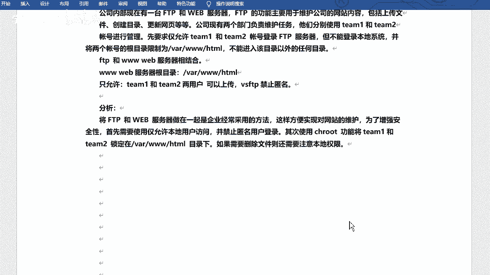

行那咱们来创建一下吧好吧，创建一下这两个目录啊，那么这两个目录的话呢，呃这两个用户啊，那么这两个用户的话呢，呃是系统用户，但是它不能登录系统，那么你就得给他设置这个登录shell是吧，登录shell啊。

叫兵线的no gain，对不对，我给大家应该想到了啊，这个呢是不允许动的操作系统的好吧，这是team e是吧，然后再设置一个team 2啊是吧，然后再给他设置一下密码，好吧。

密码echo的方式设置密码啊，然后tm都是123456啊，我这个都设置的比较简单的是吧。

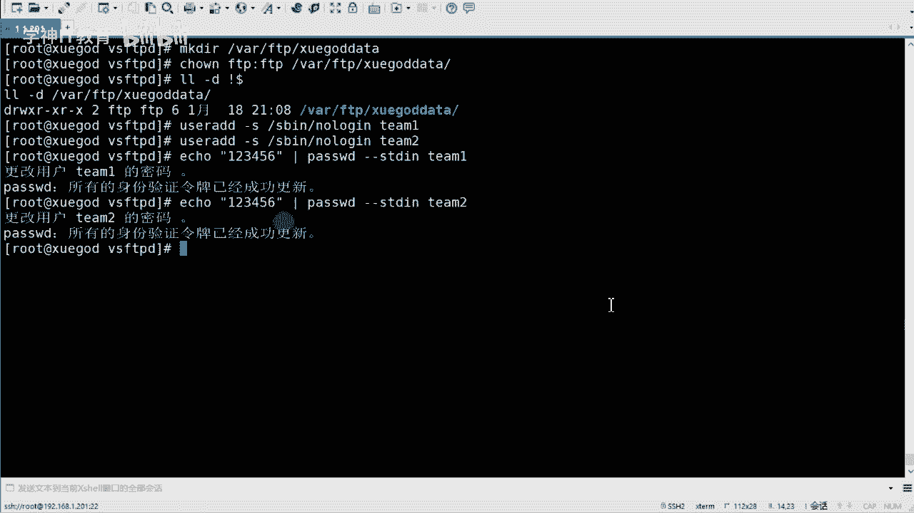

都是比较简单的啊，直接去设置它就可以了，ok然后的话咱们去改配置好吧。

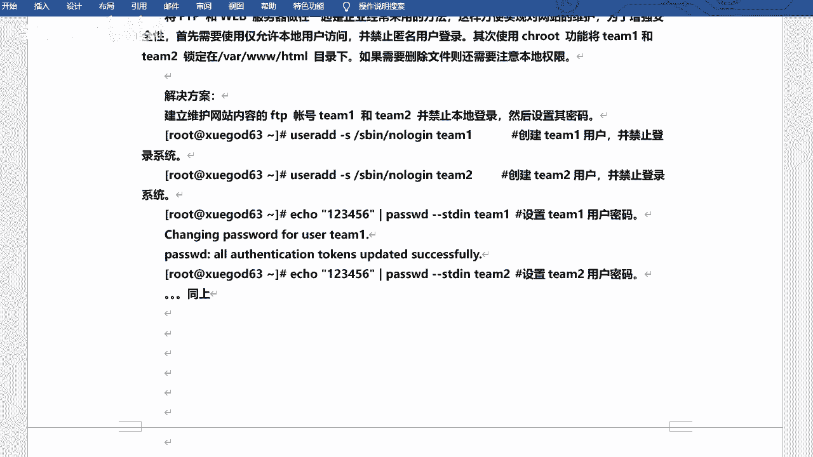

改配置啊，嗯那我还在这个目录下是吧，我还是在ftp这个配置文件的根目录下，相当于啊哎我干嘛呢，我再去给他拷贝一下吧，vs f t p。cf。b a k恢复回来啊，vs f t b。cf。

就是我不让匿名用户可以去登录好吧，可以登录了啊，走你是否要覆盖啊，yes好吧，e啊，然后修改一下a d c啊，然后vs f d d下的vs f d d。cos修改它就可以了好吧。

然后的话不允许移民互动啊，然后找到anonymous enable，这个啊，这个好吧，这个它默认是yes的是吧，默认是允许的啊，咱们给它改成中飞过去，我给他这改一下啊，好吧嗯对，然后local yes。

这个时还是yes啊，允许本地用户都对吧，就是这个啊，然后下边啊，然后下边呃在那个找一下吧，还是找一下啊，叫做local root，哦豁没有这个场吗，啊没有这个是吧，没有的话，那我就啊我就找一下这个吧。

叫做chrt local，就这个吧，其实我随便找个地方也可以啊，然后去写一下咱们的配置好吧，现在单独配置啊，嗯主要是这么几个，从哎呀，我还是从上面这些吧，因为他没有这个配置啊，我还不如从这写的嗯。

叫做local root，local root等，是y下3w html对吧，这个是它的本地root嘛是吧，就是根目录啊，根目录啊，然后叫做change root list，然后enable，然后yes。

陈root list其实就是身为禁锢你了啊，禁锢你的用户了好吧，他不能去切换到别的目录好吧，不能切换到别的目录啊，然后是七root list f啊，你给他feel啊，嗯这个是锁设置锁定用户啊。

设置锁定用户在根目录的呃这个列表文件啊，这里边存放的是用户名啊，呃这个文件的话其实咱们可以去写一个啊，目前没有啊，一会咱们写一个啊，而etc etc下的还是在vs s f t p地下。

叫做持之入at least好吧，交叉吧好吧，这个就是锁锁定用户的一个文件，一个文件啊，嗯然后是allow，allow rab，珍珠等于yes，啊这个是允许锁定用户，有写权限啊，allow嘛是吧。

retable啊好吧，这是几个，这是啊啊，应该从这开始，12344条是吧，四个配置啊。

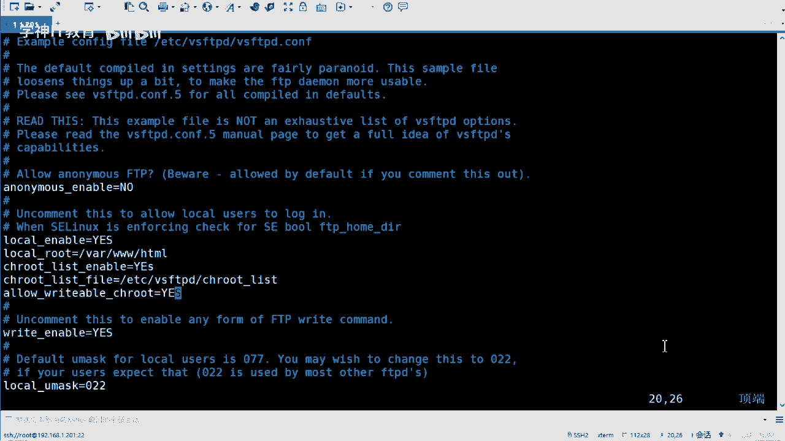

四个配置啊，配置键，ok改的多嘛是吧，其实改的不多啊，一个是把yes改成no是吧，就是默认的啊，然后下边的加这四条好吧，再来一次啊，当然你可以新加，如果说你找不到的话是吧，那呃那你可以新疆啊。

找不到的话，你可以直接去改啊，这去改也行的啊，然后呢我去新呃。

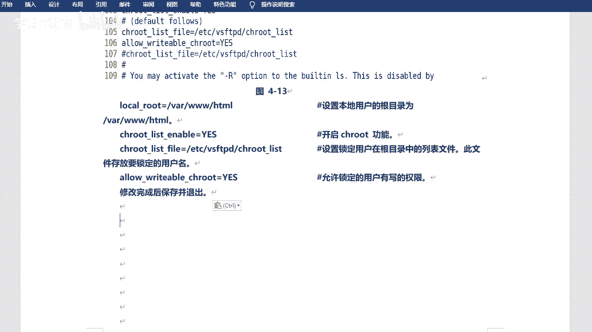

新建一个叫做changroot list的一个文件啊，然后把咱们的用户名呢写进去嗯，e t e c啊，就是在当前目录啊，叫做这个这个chrt list好吧，把用户名写进来啊，一个是team。

一个是tm ok这两个啊嗯好吧，那他们两个就有写权限了是吧，就写权限啊，嗯然后就看一下哇，下3w tml啊，这个目录好吧，这个目录这个目录是往这个目录是吧，同时也是咱们f t p的根目录好吧。

f tb这个模啊，然后给他改个什么权限呢，呃在这的话可以改一个这个啊，前置mod加一个啊，不是叫高r啊，那个叫呃o加w啊，o的话就是其他人嘛是吧，其他人的话对我这个目录也有写的权限好吧。

也许如果没有写信的话，你是不能去创建文件的是吧，原来怎么不改成f t p啊是吧，f t p那个只针对于匿名用户好不好，只对于一名用户啊，咱们这边是新加的两个用户是吧，所以说用o加w这种方式啊。

呃y下的3w6 给他改一下好吧，给他改一下啊啊这样的话o就会写权限了，o就会写权限了啊。

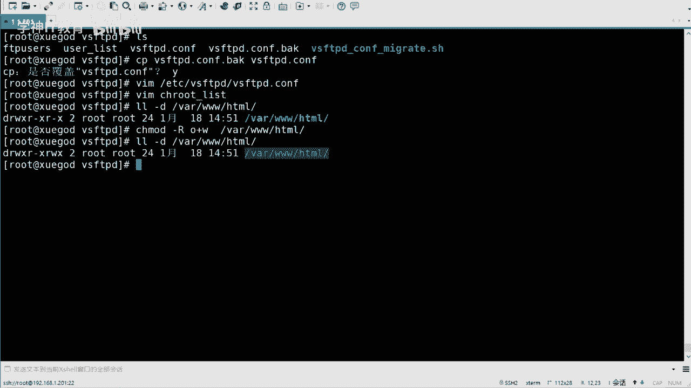

这个地方，这是咱们的配置啊。

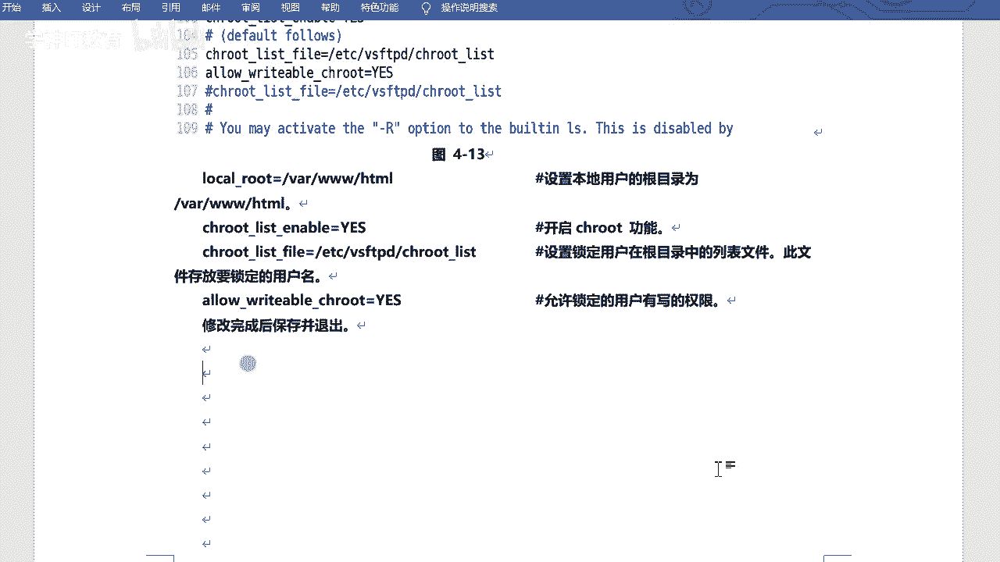

ok然后重启服好吧，重启服务啊，c t m read restart vs fpd好吧，然后重启的时候一定要注意有没有报错啊，报错的话说明你的配置啊是吧，写的不对啊，那你去修改一下是吧，修改一下啊。

嗯没问题的话就就整起来了好吧，能起来的啊，那比如说我去干嘛呢，嗯我去拷贝一下吧，把edg的password拷贝到万象3w怎么嗯，然后用l f t p啊，咱们试一下啊，嗯192。168。1。201。

然后杠u是指定用户名啊，还有team 1，然后逗号是密码啊，然后123456过来好吧，我来让你看啊，它有两个文件啊，一个是index也发错了，index是我之前存在的啊，比如我切过去看一下啊。

往下3w7 秒啊，这个index是我之前创建的啊，我下午上课好像用这个来着，然后趴座的是刚才传的是吧，哎那你能看见这两个文件，对不对，你们看看这两个文件的啊，不是写错了是吧，改成大写的啊。

但是它其实不影响的是吧，然后其实你去切换这个目录啥的，你是切不了的，因为它已经禁锢你了。

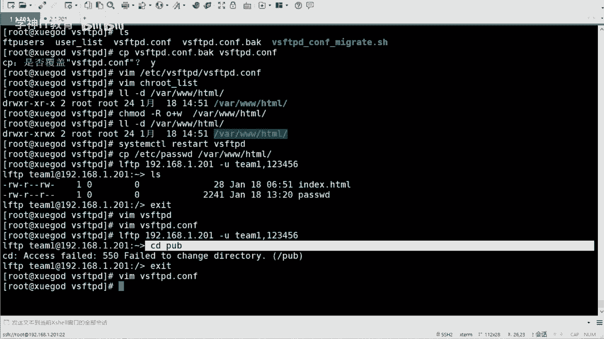

好吧，看你辛苦你了啊对啊，ok这是咱们普通用户设置用户去登录，是登录啊，嗯然后也可以通过fuza这样的用户这样的工具是吧，去上传这个文件，上传文件啊，这个也是可以的，cu za这个东西我给大家传一下吧。

有z了啊，就是那个什么来着工具嘛是吧，工具其实挺多的啊，fc了这个exe啊，这个直接就能用，我记得是，嗯是吧，然后我连一下啊，嗯连一下啊，然后主界面用户名就在这练吧，嗯新站点ftp协议是吧。

嗯主机名的话是192。1682。1。201啊，多个号的话是21，呃加密不用加，目前不用加密啊，登录的话是，询问密码好吧，用户名呢是tm 1，密码是等会连接一下啊，这才能输密码啊，密码的话是123456。

啊这是我之前的一个东西啊，不用管它行吧，这样的话就连上了啊，在这儿可能不明显啊，在这呢在这呢啊这是你的站点是吧，然后这边的话是你的文件名，这边是咱们linux服务器啊，这边是windows服务器是吧。

那我传个东西吧，比如说随便传个啥，把他传过来，对不对，你看这是可以传的，可以传的话，就这么一直可以写的嘛是吧，这不就是可以写的啊，嗯，ok啊啊这是咱们的用户名和密码的方式是吧。

用户名和密码的方式去去登录是吧，去登录啊，然后什么读写权限啊什么的都有的啊。

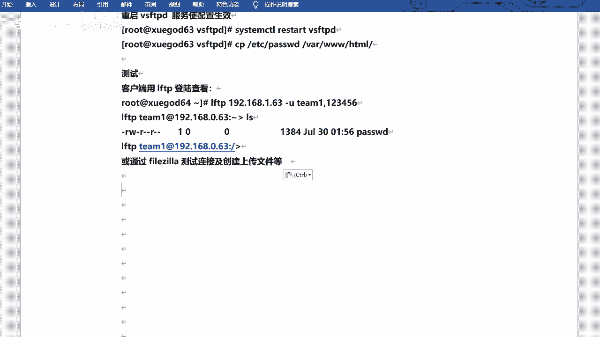