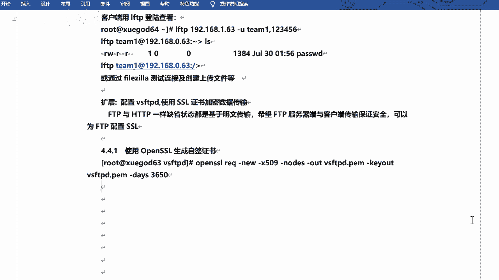

# RHCE8红帽认证课程／自学必备／云计算／rhce／Linux运维 - P11：使用ssl证书加密数据传输 - 学神科技 - BV1L54y1S7qZ

行吧，下面咱们来个扩展啊，来个扩展啊，呃什么扩展呢，就是加加这个sl做证书好吧，配置s f t b啊，使用s证书加密数据传输是吧，当然这个是呃，不是那个啥的啊，这个不是怎么说呢，不是这个必须的是吧。

但是咱们可以看一下是吧，可以开回家演技啊，嗯，加密的啊，对ftp啊，其实不单单是咱们web服务器可以做做这个s l的是吧，f t p的话也是可以的，对不对，ftp的话也是可以的，因为他们默认情况下啊。

宣传状态都是基于平面传输的是吧，呃希望ftp服务器端与客户端保证传输，保障安全，那么可以使用ftp配置s l好吧，这个其实几个命令就可以搞定啊，但是看上去很难，其实不难啊，其实不难的啊是吧，这个名啊。

我们一起看一下，生成自签名证书智能字，前面都说啊，这个可以直接去直接去使用的好吧。

应该使用的啊，啊我给他嗯，我就我就在这儿吧，执行一下啊，open cl啊，iq杠六啊，什么杠x509 note，这个参数非常多啊，out out，然后k out，然后days是吧，这个我简单说一下啊。

嗯iq什么意思，iq的意思是呃是一个一个怎么说呢，是一个管理命令啊，管理命令啊，就是证书签名的请求，x50 呢是方式啊，或者证书管理数据的方式，this是有效期有效期啊，这是天好吧，这是天啊对。

然后这个这个node是节点嘛啊out就是输出证书的保存文件啊，k out的话是key叫密钥的存储文件啊，new k就是新诶，这有6k吗啊没有new k是吧，new个new是吧，这个就是新新证书啊。

这是个新的证书就没事好吧，就可以了啊，时间回转就会啊，但是它会让你输个信息啊，比如说你的country，你的你的这个这个啥，你的这个这个国家是哪儿是吧，中国比如说啊呃省啊，省市北京吧啊。

然后city也是北京啊，公司是吧，公司是学霸的吧，部门是吧，学干的啊，然后是你的域名啊，你的好词，server's house name啊，你的服务的这个这个主机名是吧，服主机名啊，比如说叫哈哈哈。

这叫什么x s。com啊，email dress啊，你的你的email地址是吧，email地址啊，这个随便写啊，2163。com行吧，就可以了好吧就可以了啊，他会给咱们去生成啊，他会给咱们去生成啊。

他是在当前目录吧，在这儿啊它会生成的一个证书好吧，它会生成一个证书啊。

我们把笔记写一下好吧，笔记写一下啊啊这个这个你们不用记是吧，这个参数其实当然比较多啊，然后直接复制就可以了，如果想做的话，是直接复制就可以啊，嗯然后参数的话我这也有一个说明是吧。

这个参数是干什么的啊好吧，关键是咱们要找到呃，不是要要看到你生成的这个这个证书好吧。

生成的证书啊，然后咱们已经找到了，在这儿了对吧，在这啊嗯一般的话呢咱们是给它生成一个什么呢，呃生成一个目录吧，然后专门去存放这个证书啊，嗯比如说叫那个点儿啊，叫点s啊，sk是吧。

这个然后mv把v s m d p d。pm啊拷贝到点s l k，然后给它加个权限啊，叫400好吧，400啊就是嗯root权root用户对它只有写权限是吧，但是读写也是可以的。

但是它里面其实是一些什么这个字符之类的啊，也没有必要读，给他改一下400就可以了，嗯好嗯，改完之后啊，这个当然只是生成证书是吧，生成证书啊，然后咱们需要去改配置文件对吧，还是需要改配置文件的啊。

嗯vs f b。com对吧，然后咱们写一下啊，写一下啊，写的话呢我看他有没有纸，他有没有那个啥的啊，有没有以前的配置啊，找一下ssl enable有吗，啊没有是吧，那个啥呢。

这个这个这个s s l t s有吗，也没有好吧，那我就自己写吧，行吧啊，找个位置啊，找个位置，一般的话咱们复习到最后好吧，一般的话咱们找个位置插一下就行了，就是在这，是吧，然后插一下啊。

我给他复制一下吧，因为加的东西比较多啊，s enviable，yes是吧，这个是启用ssl啊，然后，这个hello nico啊，就是呃匿名用户是吧，然后false就是强制啊。

local data s s l啊，local lovin s s l，匿名乌lovin s s l啊，什么匿名用户data都是s l啊，都是强制加密的，相当于好吧，强制加密的啊，然后是知识的版本啊。

知识的版本啊，因为s5 它是分分这个版本的好吧，好像是从一到到三啊，咱们都写一下，123是吧，多写一下啊，嗯然后这个啊，呃require s s l什么raise啊，这个东西这个是什么，不重用s规划啊。

不重演四次绘画啊，就是你已经建立了这个绘画了，然后不再去重复这个了啊，然后还有一个因为这个配置比较多是吧，比较多啊，什么sephigh啊，就是一个加密算法好吧，嗯然后是指定你的文件啊。

指定文件third third fill啊，third file就是认证文件啊，就是刚才咱们放的那个那个位置啊，然后是私钥文件啊，这俩目前咱们这两个用的是呃，用的是一个文件啊，一个文件啊，哎就这些对吧。

所以说这个配置很多对吧，很多啊，你也不用记好吧，你也不用记啊，因为记的话我估计也记不过来是吧。

也寄不过来啊，就直接用就可以了好吧，咱们主要可以，咱们主要是看看效果是吧，主要是看看效果，就是它支持这种s的方式嗯，把这个，好吧这些啊这些都是需要去插入的，嗯嗯嗯需要注意的是。

上面的配置不要添加到最后的配置文件啊，步骤在文件最后添加啊，否则启动会报错的对吧，然后咱们重启一下服。

哦你看我是不是我是不是还写错了呀，哎呀呀呀，喂我是复制的呀，我是复制的，还能写错了，我看看啊，然后我给它删掉就可以了是吧，剩下就可以了，就是这个地方多了几个空格是吧，这个东西非常的严谨的啊。

非常严谨的啊，和r3 n c一样，把r3 c的话也不行啊，你也不能多空格啊，然后也不能后边跟上什么注释什么什么之类的是吧，都不行啊，嗯然后对，然后重启就可以了啊，重启就可以了。

那我在这写一下吧，而且是吧，这个这个配置后不能有是吧，多余的空格啊，我感觉就是这个结果真的是，有的配置文件其实挺是吧，挺宽松的啊，但是有的就非常的较劲啊，它就是不能让你多个空格，少空格是吧，这都不行。

好那咱们来验证一下吧是吧，验证一下啊，呃还是用这个fc了好吧，还是用它啊，那我来再再连一下啊。

啊重启了吧，我重启了吧。

重启了啊，然后我再连一下啊，这个东西啊，有新版本我就不用新版本的，然后再新连一个，再新连一个吧，在新连一个啊，最新一个站点啊，嗯192168。1。2的二端口是21是吧，然后这个怎样呢。

这个可以选择一个叫做要求显示的ftp，什么over t s啊，可以用它啊，然后也是学位密码，用户名的话是还是t一啊，连一下，已经连着一台服务器在新标签中连接，你看啊它会有它会有这样的一个什么呢。

有这样的一个一个提醒吧，是一个提醒啊，呃服务器的证书未知，且小心按证证书，以确信该服务器可信任好吧，就是他已经连的时候，他已经开始去验证这个证书了啊，这时候内容的话呢是咱们写的就对好吧。

什么t s x s。com呀，学尬学尬的东西，这是咱们自己写的，所以没问题啊，该就是自签的啊，自签名的就是咱们自己去签发的啊，哒哒哒哒啊，然后确定就可以了好吧，然后也能连上也能连上啊。

然后你看这他连的时候呢会正在验证证书js连接一乘以建立以登录啊，然后这个就ok了，好吧这就可以了啊好吧。

咱们看的就是那个那个提示啊，包括它的一个连接过程就行了好吧，ok这个是咱们的，加密是吧，加密啊行吧，有兴趣的话可以可以试一下是吧，可以试一下，这个不强制，如果说你感觉困难的话是吧。

这个不强制必须要做的好吧，但是我建议的话可以去试一试好吧，可以试一试啊，连上之后你可以看一下是吧，它的一个提醒，对不对，连接过程啊，ok行，这个是什么呢，这个是。

加密是吧。